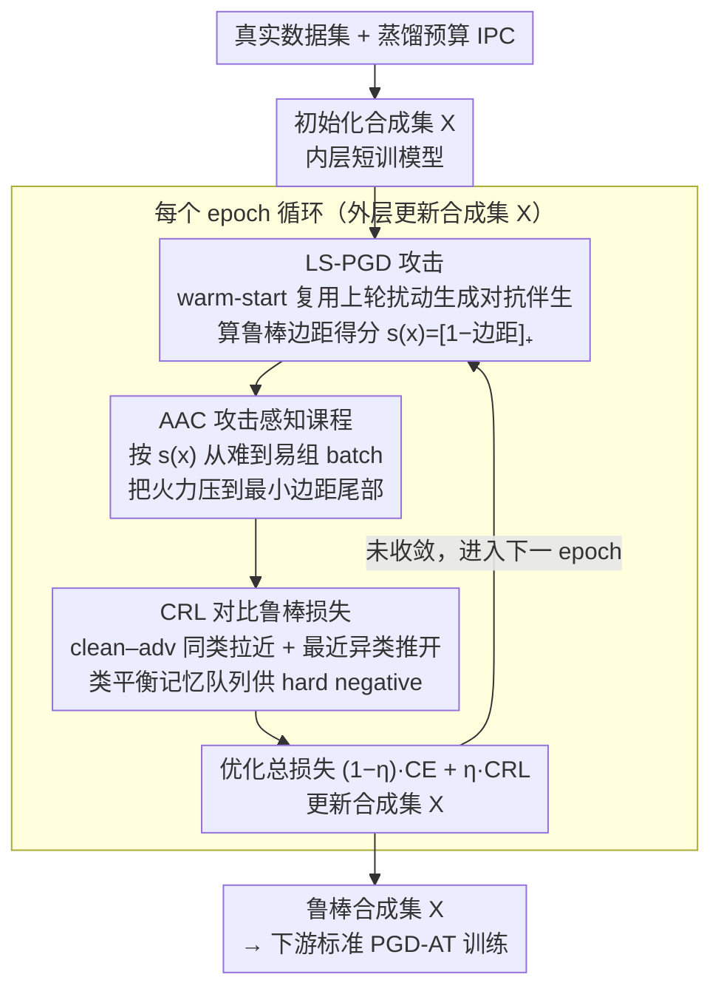

# Mind Your Margin and Boundary: Are Your Distilled Datasets Truly Robust?

**会议**: ICML 2026  
**arXiv**: [2605.20606](https://arxiv.org/abs/2605.20606)  
**代码**: https://github.com/SLGSP/CCR  
**领域**: 模型压缩 / 数据集蒸馏 / 对抗鲁棒性  
**关键词**: 数据集蒸馏, 鲁棒蒸馏, 对抗课程, 鲁棒边距, 对比学习

## 一句话总结
本文提出 C2R 框架，把数据集蒸馏中的鲁棒性问题重新拆解成"最小鲁棒边距"问题，用"攻击感知课程 (AAC) + 对比鲁棒损失 (CRL) + 线搜索 PGD (LS-PGD)"三件套，让合成集训练出的模型在六种攻击上平均比之前的鲁棒蒸馏 SOTA 高出约 2.8% 鲁棒准确率。

## 研究背景与动机

**领域现状**：数据集蒸馏 (DD) 把一个大训练集压缩成几十~几千张合成样本，让小模型在合成集上训完接近全数据训练的精度。主流路线包括梯度匹配、轨迹匹配 (MTT)、分布匹配、生成式蒸馏、解耦式 SRe2L/D4M 等。绝大多数方法只优化干净精度，对抗鲁棒性几乎不进入目标函数。

**现有痛点**：当蒸馏数据被用于安全敏感场景时，PGD/CW/VMI/Jitter 等攻击能轻易把模型打穿。已有"鲁棒蒸馏"工作 (GUARD 的曲率正则、ROME 的信息瓶颈对齐、Tsilivis 等的 NTK 元学习) 虽然提升了鲁棒性，但 **accuracy–robustness trade-off 很差**：要么干净精度跌得太多，要么在强攻击下仍然崩。

**核心矛盾**：作者指出已有方法有两个结构性漏洞——(i) **边距错配**：鲁棒风险被"最小鲁棒边距"那一小撮样本主导 (Schmidt et al. 2018)，但现有方法对所有对抗伴生样本一视同仁，把优化预算稀释在大量"已经够鲁棒"的简单点上；(ii) **边界忽略**：流行的"类均值对齐" $\mathcal{L}_{\mathrm{rob}}=\sum_c \|\mathbb{E}[e(x_c)]-\mathbb{E}[e(\tilde x_c)]\|_2^2$ 只追求类内全局相似，没有在决策边界附近显式拉开类间距离，而对抗错误恰恰发生在边界。

**本文目标**：设计一个鲁棒蒸馏目标，能 (a) 把优化集中到"最小边距"的对抗样本上，(b) 显式扩大决策边界附近的类间隔，同时 (c) 不让蒸馏成本爆炸。

**切入角度**：从鲁棒铰链损失 $\mathcal{L}_{\mathrm{hinge}}=\mathbb{E}[[1-\underline{m}(x;\theta)]_+]$ 出发，证明 $\max_i v_i(\theta) = [1-\min_i \underline{m}(x_i;\theta)]_+$，也就是"改善最差铰链 = 改善最小鲁棒边距"。这把"该优化谁"从启发式变成了可证明的排序。

**核心 idea**：用 PGD 估计每个样本的鲁棒边距 $\widehat{m}_{\mathrm{rob}}(x;\theta)=g_\theta(x+\delta_T)$，按 $s(x)=[1-\widehat{m}_{\mathrm{rob}}]_+$ 从难到易排课程，配合实例级 supervised contrast 强迫"clean–adv 同类拉近、最近异类推开"，并用线搜索 PGD + 类平衡队列控成本。

## 方法详解

### 整体框架

C2R 沿用标准 DD 的双层结构：外层更新合成集 $X=\{(x_s,y_s)\}_{s=1}^N$，内层在 $X$ 上短训一个模型 $f_\theta$；输入是真实数据集 + 蒸馏预算 IPC (每类样本数)，输出是一个针对鲁棒训练优化过的合成集 $X$，下游只需把标准对抗训练 (PGD-AT) 跑在 $X$ 上即可。每个 epoch 的循环可以这样理解：先用 LS-PGD 给每个合成样本 $x$ 算一个对抗伴生 $\tilde x=x+\delta$，并据此算出鲁棒边距得分 $s(x)=[1-\widehat{m}_{\mathrm{rob}}(x;\theta)]_+$（越大越靠近决策边界）；再按得分从难到易组 batch (AAC)，把对比鲁棒损失 CRL 的火力集中到低边距尾部；最终优化 $\mathcal{L}_{\mathrm{C^2R}}=(1-\eta)\mathcal{L}_{\mathrm{perf}}+\eta\mathcal{L}_{\mathrm{CRL}}$，其中干净 CE 守精度、CRL 守边界，再用类平衡 memory queue 给 CRL 喂足 hard negatives 同时压住计算量。

### 关键设计

**1. Attack-Aware Curriculum (AAC)：把更新预算押到"最小鲁棒边距"那一小撮样本上**

针对的痛点是"边距错配"——之前的鲁棒 DD 用类均值对齐或对所有 adv 求平均，结果优化被大量"已经够鲁棒"的简单点稀释。AAC 的底气来自一条恒等式 $\arg\max_i [1-\underline{m}(x_i)]_+ = \arg\min_i \underline{m}(x_i)$：要改善最差的铰链损失，等价于改善最小的鲁棒边距，于是"该优化谁"从启发式变成可证明的排序。实现上用 PGD 内循环 $\delta_{t+1}=\Pi_\Delta(\delta_t+\alpha\,\mathrm{sign}(\nabla_x\ell(f_\theta(x+\delta_t),y)))$ 近似最坏扰动，再令得分 $s(x)=[1-g_\theta(x+\delta_T)]_+$，每个 epoch 按 $s(x)$ 降序组 batch。这样做之所以有效，是因为它把鲁棒理论里"worst-case 才决定 robust risk"的决策性统计量（最小边距）直接搬进了训练循环，而不是均匀地稀释优化预算。

**2. Contrastive Robustness Loss (CRL)：用实例级对比把决策边界附近的类间隔显式撑开**

针对的痛点是"边界忽略"——类均值对齐 $\|\mathbb{E}[e(x_c)]-\mathbb{E}[e(\tilde x_c)]\|^2$ 只追求类内平均不变性，对边界附近的脆弱子模式没专门施压，而对抗错误恰恰发生在边界。CRL 把它换成实例级 supervised contrast：对 anchor $x_i$ 定义正集 $P(i)=\{\tilde x_i\}\cup\{x_j,\tilde x_j: y_j=y_i\}$、候选集 $A(i)=P(i)\cup\{x_k,\tilde x_k: y_k\neq y_i\}$，损失为

$$\mathcal{L}_{\mathrm{CRL}}=\frac{1}{M}\sum_i \Big[-\sum_{a\in P(i)} \frac{1}{|P(i)|}\log\frac{\exp(g_{i,a}/\tau)}{\sum_{b\in A(i)}\exp(g_{i,b}/\tau)}\Big],\quad g_{i,a}=\mathrm{sim}(e(x_i),e(a)).$$

分子把"clean–adv 同类"拉成正对，分母对最相似的异类（包括异类的 adv 版本）施加最大压力——而这个 $\max$ 项正好对应鲁棒边距公式里的 $\max_{k\neq y}f_k(x+\delta)$。所以 CRL 不是泛泛地做表征对齐，而是把"对抗几何"和"对比学习"对位起来：最近异类被显式纳入梯度路径，鲁棒边界因此被实打实推开。

**3. LS-PGD + 类平衡 memory queue：把内层攻击和全对比这两个最贵的部分摊薄**

前两个设计各自带来一个成本炸点——AAC 要反复跑多步 PGD，CRL 朴素实现是 $O(M^2)$ 的 batch 内全对比。LS-PGD 用 warm-start 化解前者：缓存上一轮扰动 $\hat\delta(x)$，若 $x+\hat\delta(x)$ 处 loss 没降就直接复用；否则只算**一次反向**拿方向 $v=\mathrm{sign}(\nabla_x \ell)$，再用**纯前向**在几何序列 $\mathcal{S}=\{\alpha\beta^q\}_{q=0}^{Z-1}$（$Z\in\{2,3\}$）上做行搜索，取 $\delta'=\arg\max_{\eta\in\mathcal{S}}\ell(f_\theta(x+\Pi_\Delta(\hat\delta+\eta v)),y)$；因为起点是"上次最优 $\delta$"，把 $T$ 次反向摊到接近 1 次反向而攻击强度不衰减。memory queue 化解后者：每个类维护一个容量 $Q$ 的 FIFO 队列缓存历史 embedding，对 anchor 用低维随机投影 $R\in\mathbb{R}^{r\times d}$ 粗筛取 top-$k$ hard negatives，CRL 分母只算这些，单步成本从 $O(M^2)$ 降到 $O(Mk)$。队列还顺带解决了"batch 太小缺 hard negative"的问题，给对比损失稳定供给有信息量的 impostors。

### 损失函数 / 训练策略

外层目标 $\mathcal{L}_{\mathrm{C^2R}}=(1-\eta)\mathcal{L}_{\mathrm{perf}}+\eta\mathcal{L}_{\mathrm{CRL}}$，$\eta\in[0,1]$ 控制鲁棒/干净权衡。注意 AAC 本身 **不引入额外损失项**，它只改 batch 采样顺序，把 CRL 的梯度集中到低边距尾部。下游训练（用蒸馏集训新模型）仍然走标准 PGD 对抗训练，扰动预算 $|\varepsilon|=2/255$。

## 实验关键数据

### 主实验

跨 3 个基础数据集 (CIFAR-10/100, Tiny-ImageNet) × 5 个 IPC × 5 种攻击 (FGSM/PGD/CW/VMI/Jitter)，再加 6 个 ImageNet-1K 子集。下表抽取 CIFAR-10/100 与 Tiny-ImageNet 在 IPC=10 的代表性结果（与 ROME 相比的提升取自论文 Table 2 的子串）：

| 数据集 / 攻击 | IPC | SRe2L | D4M | ROME | C2R | 提升 vs ROME |
|--------------|-----|-------|-----|------|-----|--------------|
| CIFAR-10 / PGD | 10 | 13.09 | 20.14 | 24.01 | 28.49 | **+4.37** |
| CIFAR-10 / VMI | 10 | 13.28 | 20.14 | ≈ROME | 28.49 | +4.37 |
| CIFAR-100 / PGD | 10 | 7.08 | 4.25 | 8.42 | 12.92 | **+2.82** |
| Tiny-ImageNet / PGD | 10 | 1.59 | 0.97 | 1.36 | 3.27 | +1.73 |
| CIFAR-10 / Clean | 10 | 37.53 | 48.16 | 47.94 | ~46–48 | 与 ROME 持平 |

跨六种攻击平均：**C2R 比之前最好的鲁棒 DD 高约 2.8% 鲁棒精度**，且干净精度不显著下滑。

### 消融实验

| 配置 | 关键观察 | 说明 |
|------|---------|------|
| Full C2R | 最佳鲁棒精度 | AAC + CRL + LS-PGD |
| w/o AAC (uniform sampling) | 鲁棒精度明显下降 | 验证"低边距样本驱动鲁棒风险"理论预测 |
| w/o CRL (回到类均值对齐) | 边界附近脆弱，强攻击下崩 | 验证"边界级类间分离"必要性 |
| LS-PGD → 标准 $T$-步 PGD | 精度相近、显存/时间显著上升 | LS-PGD 在固定 compute budget 下不输 |
| w/o memory queue | hard neg 不足，CRL 收益减半 | 队列对 CRL 的扩展性必要 |

### 关键发现

- **理论与实证一致**：把 AAC 关掉，鲁棒精度的损失最大，正好对应"min margin 主导 robust risk"的命题。
- **CRL > 类均值对齐**：在所有 IPC 上 CRL 都赢，说明类均值对齐确实在"边界级几何"上是欠拟合的目标。
- **小 IPC 收益更大**：IPC=1 时 C2R 相对 baseline 的相对提升最显著，因为合成集越小，每个样本"占地越大"，边距优化越关键。
- **强攻击下差距拉大**：在 VMI/CW 等强攻击下，C2R 比基线的 gap 比 FGSM 大，说明边界级正则是真的把鲁棒边距推宽了，不是只把弱攻击挡住。

## 亮点与洞察

- **把鲁棒蒸馏问题翻译成"最小边距优化"问题**，并给出可计算的代理 $s(x)=[1-\widehat{m}_{\mathrm{rob}}]_+$，让"该优化谁"从启发式变成可证明排序——这种"理论先指最差样本，工程把课程铺过去"的套路对其它鲁棒训练任务也直接可借。
- **CRL 把鲁棒边距公式 $\max_{k\neq y}f_k(x+\delta)$ 显式编码进损失**：分母里的 hard negatives 正是公式里那个 $\max$，比"类均值对齐"在动机上更对位。这是把"对抗几何"和"对比学习"打通的一个干净案例。
- **LS-PGD 是个轻便的攻击工程 trick**：warm-start + 几个前向探针就能保住 PGD 强度，把内层成本砍到接近 1 次反向，对所有"内层要重复跑攻击"的方法（鲁棒训练、对抗数据生成、对抗样本检测）都通用。

## 局限与展望

- 实验都集中在分类 + $\ell_\infty$ 小预算 ($\varepsilon=2/255$)；更大预算、$\ell_2$/通用扰动、自适应/AutoAttack 下的表现没系统给出，可能在更强威胁模型下边距估计噪声会放大。
- AAC 的得分依赖当前 $\theta$，蒸馏早期 $\theta$ 还很差，估计的"最小边距"未必稳定；论文没讨论是否要在 warm-up 阶段切换 sampling 策略。
- CRL 用 memory queue 提供 hard negatives，但 queue 的容量 $Q$、随机投影维度 $r$ 是超参，可能要按数据集重新调；自动化方案是个明显改进点。
- 整套方法对干净精度有约束（$(1-\eta)\mathcal{L}_{\mathrm{perf}}$），但论文没探索"是否能用 AAC 思路同时提升干净精度的难样本"，鲁棒/干净是否能联合用同一课程是有意思的方向。

## 相关工作与启发
- **vs ROME (信息瓶颈对齐)**：ROME 用"clean/adv 特征分布对齐 + IB 视角"做鲁棒蒸馏，本质是分布级正则；本文把视角下沉到"最小边距 + 边界几何"，在所有强攻击下都更稳。
- **vs GUARD (曲率正则)**：GUARD 用曲率正则降低对抗敏感度；C2R 不显式约束曲率，而是用边距视角直接对接 robust risk，理论解释更清晰。
- **vs 标准鲁棒训练 (Madry et al.)**：Madry 的对抗训练目标 $\min\max$ 是"per-sample worst-case"；C2R 把"per-sample" 升级成"per-dataset worst-case"——课程层面挑出 min-margin 样本，更契合 DD "样本量极少"的场景。
- **vs SupCon (Khosla et al.)**：SupCon 是干净监督对比；CRL 把 $\tilde x$ 显式纳入正集、把"最近异类"显式纳入负集，是 supervised contrast 在对抗几何下的自然推广，对其它鲁棒表征学习也可借。

## 评分
- 新颖性: ⭐⭐⭐⭐ 把"最小鲁棒边距"理论 + 课程 + 对比损失三件套打成一个干净的鲁棒蒸馏框架，组件本身不算全新但组合与动机对位强。
- 实验充分度: ⭐⭐⭐⭐ 3 个基础集 + 6 个 ImageNet 子集 × 5 个 IPC × 5 种攻击全表覆盖，且消融对应理论命题。
- 写作质量: ⭐⭐⭐⭐ 理论小节简短但精准，命题 8/9 把"为什么要挑 min margin"讲得很清楚。
- 价值: ⭐⭐⭐⭐ 鲁棒 DD 是 DD 走向部署的关键卡口，平均 +2.8% 的提升在 IPC=1/5/10 的强压缩区有实际意义。

<!-- RELATED:START -->

## 相关论文

- [\[ICML 2026\] DIVER: Diving Deeper into Distilled Data via Expressive Semantic Recovery](diverdiving_deeper_into_distilled_data_via_expressive_semantic_recovery.md)
- [\[NeurIPS 2025\] Graph Your Own Prompt](../../NeurIPS2025/model_compression/graph_your_own_prompt.md)
- [\[ICML 2026\] IDLM: Inverse-distilled Diffusion Language Models](idlm_inverse-distilled_diffusion_language_models.md)
- [\[ICML 2026\] ArcVQ-VAE: A Spherical Vector Quantization Framework with ArcCosine Additive Margin](arcvq-vae_a_spherical_vector_quantization_framework_with_arccosine_additive_marg.md)
- [\[ICML 2026\] Critique-Guided Distillation for Robust Reasoning via Refinement](critique-guided_distillation_for_robust_reasoning_via_refinement.md)

<!-- RELATED:END -->
