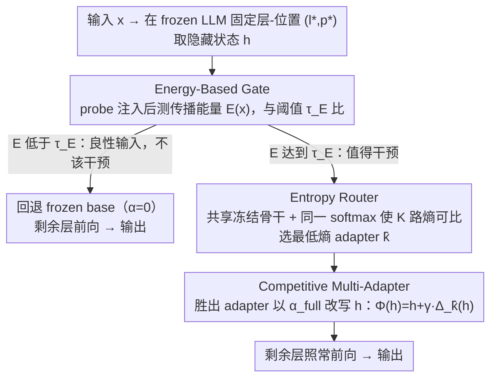

# Multi-Adapter Representation Interventions via Energy Calibration

**会议**: ICML 2026  
**arXiv**: [2605.28722](https://arxiv.org/abs/2605.28722)  
**代码**: https://github.com/V1centNevwake/MARI  
**领域**: LLM 对齐 / 表征干预  
**关键词**: 表征干预, 多适配器路由, 能量门控, 真实性对齐, 推理时编辑  

## 一句话总结
MARI 指出现有「表征干预」方法都依赖一个线性表征假设——单条全局 steering 向量加到所有输入上——既因为最优校正方向随样本剧烈变化而不可靠，又会在良性输入上误伤通用能力；它把单 adapter 换成多个低秩 adapter 并用「竞争训练 + 熵路由」做样本自适应干预，再用一个独立训练的低秩 probe 算「传播能量」做阈值门控，决定是否启用干预，从而在 TruthfulQA/BBQ/Safety 上大幅领先 ReFT、同时在 MMLU/ARC 上不掉甚至略升。

## 研究背景与动机

**领域现状**：表征干预 (Representation Intervention) 是当前 LLM 对齐里增长最快的非训练范式之一——冻住模型权重、只在推理时在某一层某一位置改动隐藏状态，就能把模型行为推向「更真实」「更安全」「更不偏见」。Activation Steering / CAA / ITI / ReFT 都是这条线，技术核心是一个全局 steering 向量或低秩更新 $\Phi_\psi(\mathbf{h})=\mathbf{h}+\gamma s_\psi\Delta_\psi(\mathbf{h})$。

**现有痛点**：所有这些方法都假定「线性表征假设」——一个属性（比如真实性）对应隐藏空间里一个固定方向，所以一条 steering 向量对所有输入都成立。但作者在 TruthfulQA 上做的诊断显示，每个样本所需的校正向量 $\Delta(x)=a(x,y^\star)-a(x,\hat{y})$ 在模长和方向上都剧烈漂移，沿任意一维主成分滑动平均都看不到一致的方向。

**核心矛盾**：(i) 单条静态干预无法覆盖异质需求——某些样本要往 $+\mathbf{v}$ 推、某些要往 $-\mathbf{v}$ 推，强行平均反而打架；(ii) 即使方向对了，对那些本来就「不需要被纠正」的良性输入施加干预，会扰动其内部表征，把 MMLU/ARC 这些通用能力打掉好几个点。

**本文目标**：(1) 让干预方向/强度随样本变化；(2) 提供一个**无标签**的「该不该干预」判据，避免在良性输入上 over-intervention；(3) 整套机制在推理时无需访问 ground-truth，且训练参数远少于全量微调。

**切入角度**：把单 adapter 换成多 adapter 集合 + 训练时硬路由让它们各自占领不同子空间；推理时用预测熵（参数无关）选最自信的 adapter；用一个独立训练的低秩 probe 在网络后续层产生扰动的传播能量，作为「输入是否值得干预」的信号。

**核心 idea**：用「多 adapter + 熵路由」把全局线性干预升级成分段仿射 (piecewise-affine) 干预；用「probe 传播能量 + 阈值」实现 label-free 的样本级触发开关。

## 方法详解

### 整体框架
MARI 想在不碰模型权重的前提下，让「表征干预」既随样本自适应、又能在良性输入上自动收手。它在 frozen LLM $f_\theta$ 的某一固定层-位置 $(l^\star,p^\star)$ 插入一组干预模块，推理时一条输入要过三道关：先取出隐藏状态 $\mathbf{h}=\mathbf{h}^{(l^\star)}_{p^\star}(x)$，让一个独立 probe 算它的「传播能量」$E(x;\alpha_\text{probe})$ 并和阈值 $\tau_E$ 比，能量不够就判定为「不该干预」直接走 frozen base（$\alpha=0$）；过了门控的输入再算 $K$ 个低秩 adapter 各自的预测熵，选最自信的那个出手；胜出的 adapter 以强度 $\alpha_\text{full}$ 改写 $\mathbf{h}$，剩余层照常前向得到输出。训练分两阶段——先用「硬路由、赢家拿梯度」训出 $K$ 个各占一块子空间的 adapter，再独立训 probe 配 off-subspace 正则把它的扰动方向拉到干预子空间附近。

### 关键设计

**1. Competitive Multi-Adapter + 熵路由：把单条全局向量拆成 $K$ 段、按样本自适应选**

诊断实验已经证明所需校正向量 $\Delta(x)$ 在模长和方向上都剧烈漂移，一条静态 steering 向量根本盖不住这种异质需求。MARI 在同一注入点并排放 $K$ 个秩 $r$ 的低秩 adapter $\Delta_{\psi_k}(\mathbf{h})=\mathbf{U}_k(\mathbf{V}_k^\top\mathbf{h}+\mathbf{b}_k)$，训练时对每条样本 $(x,y)$ 算 $K$ 路 loss $\ell_k(x,y)$（多选题用 CE、生成用 teacher-forced NLL），梯度只回传给当前 loss 最小的「赢家」$k^\star(x,y)=\arg\min_k\ell_k(x,y)$，目标 $\mathcal{L}_\text{route}=\mathbb{E}[\ell_{k^\star}]$，再加一项 minibatch 用量均衡防止所有样本挤进同一个 adapter（mode collapse）。这种硬路由比软路由（gating mixture）更能逼出真正的专家化——软路由的梯度会把各 adapter 拉回平均解，反而退化成单向量。推理时拿不到 $y$、没法用 oracle 路由，于是改用「最自信即最低熵」的代理：选 $\hat{k}(x)=\arg\min_k u_k(x)$，其中 $u_k$ 是 adapter $k$ 输出分布的熵（多选用 option entropy、生成用平均 next-token entropy）。论文给出风险界 $R_\text{ent}\le R_\text{min}+L\cdot\eta$，只要专家化带来的收益 $\Delta_\text{spec}$ 大过误路由率 $\eta$ 乘 loss 上界 $L$，整套就严格优于单 adapter。

**2. Energy-Based Gate + Off-Subspace 正则：用一个无标签信号决定「该不该干预」**

即便方向选对了，对那些本不需纠正的良性输入强行干预，也会扰动内部表征、把 MMLU/ARC 打掉几个点；所以需要一个推理时拿不到 ground-truth 也能用的开关。MARI 训一个独立的小秩 probe $g_\phi$（秩 $r_\text{probe}<r$，表达式和 actuation adapter 一样但不参与生成），对输入算 probe 更新 $\delta_\phi(x)=g_\phi(\mathbf{h}(x))$，以强度 $\alpha_\text{probe}$ 注入后跑完剩下的层，逐层量它造成的扰动 $e_m(x;\alpha)=\|\mathbf{h}^{(\alpha,m)}_{p^\star}(x)-\mathbf{h}^{(m)}_{p^\star}(x)\|_2$，取中位数 $E(x;\alpha)=\mathrm{median}\{e_m\}_{m=l^\star}^L$ 当作这条输入的「**传播能量**」——它衡量一个小扰动能在网络深处激起多大响应，越大代表这条输入越「吃得动」干预。训练目标

$$\mathcal{L}_\text{cal}=\mathbb{E}[\ell_\phi(x,y)]+\lambda_\text{off}\,\mathcal{R}_\text{off},\qquad \mathcal{R}_\text{off}=\mathbb{E}\big\|\Pi_B^\perp(\delta_\phi(x))\big\|_2^2$$

里的 off-subspace 正则把 probe 的更新约束在「in-field 校准子空间」$B$（在 unlabeled 输入上跑 PCA 拟出的 rank-$k$ 基）内，使能量真正贴着干预要走的方向、从而预测干预是否有益。阈值 $\tau_E$ 在含 applicable/non-applicable 输入的小控制集上一次标定：取 non-applicable 那部分能量分布的 $(1-\rho)$ 分位数（论文取 $\rho=0.9$），刚好拦下约 90% 的良性输入。理论上 Thm 5.2 给出 non-applicable 输入的能量上界 $E(x;\alpha)\le\alpha(\kappa_\text{non}S+\Gamma(x)\varepsilon)+o(\alpha)$——off-subspace 残差 $\varepsilon$ 越小、in-field 衰减 $\kappa_\text{non}$ 越大，门控的分离度越好。把「能不能干预」交给独立 probe、「怎么干预」交给 adapter，正是为了避免让同一组参数背两个相互冲突的目标。

**3. 冻结骨干 + 共享 softmax：让 $K$ 个 adapter 的熵真正可比**

熵路由能成立的隐形前提，是 $K$ 个 adapter 的熵 $u_k(x)$ 必须在同一把尺子上。MARI 让所有 adapter 共享同一个 frozen 骨干和同一个输出 head，并统一 softmax 温度——不引入 per-expert 温度，也不做 logit scaling；每个 adapter 只学 $\mathbf{U}_k,\mathbf{V}_k,\mathbf{b}_k$，$\theta$ 全冻，可选的 per-adapter 标量 $s_k$ 默认 $\equiv 1$，整套只留一个全局 $\gamma$ 当强度旋钮。一旦各 adapter 学了不同温度或不同 head，熵在数值上就失去可比性，路由会退化成单纯挑「温度最低」的那个。这条约束常被忽略，却是熵路由 work 的底层保证。

### 损失函数 / 训练策略
两阶段训练：(1) Multi-Adapter 阶段用硬路由 + minibatch 用量均衡，目标 $\mathcal{L}_\text{route}+\lambda_\text{usage}\mathcal{L}_\text{usage}$；(2) Probe 阶段用 $\mathcal{L}_\text{cal}=\mathbb{E}[\ell_\phi]+\lambda_\text{off}\|\Pi_B^\perp\delta_\phi\|_2^2$。推理时阈值 $\tau_E$ 在控制集上一次性标定，触发率 $\rho=0.9$ 是主要可调超参，$K$、$r$、$r_\text{probe}$、$\alpha_\text{probe}$、$\alpha_\text{full}$ 均为固定超参。

## 实验关键数据

### 主实验
在 Llama-2-7B/13B、Llama-3-8B、Qwen2-7B、Qwen2.5-14B/32B 共 6 个 backbone 上跑 TruthfulQA (MC1/MC2)、BBQ、Refusal/Safety 三类对齐指标和 MMLU、ARC-E、ARC-C 三类通用能力指标。

| Backbone | 方法 | TruthfulQA MC1 ↑ | BBQ ↑ | MMLU ↑ | ARC-C ↑ |
|---|---|---|---|---|---|
| Llama-2-7B | Vanilla | 32.03 | 0.329 | 23.3 | 33.8 |
| Llama-2-7B | ReFT (SOTA) | 50.46 | 0.540 | 23.2 | 34.0 |
| Llama-2-7B | **MARI** | **64.35** | **0.751** | 23.2 | 33.5 |
| Llama-3-8B | ReFT | 50.58 | 0.637 | 66.0 | 51.6 |
| Llama-3-8B | **MARI** | **61.81** | **0.792** | **66.6** | **52.1** |
| Qwen2.5-14B | ReFT | 52.33 | 0.646 | 80.8 | 63.6 |
| Qwen2.5-14B | **MARI** | **67.93** | **0.821** | **81.6** | **64.1** |
| Qwen2.5-32B | ReFT | 55.60 | 0.821 | 83.4 | 59.5 |
| Qwen2.5-32B | **MARI** | **81.94** | **0.876** | **84.2** | **60.0** |

### 消融实验
| 配置 (Llama-3-8B) | TruthfulQA MC1 | BBQ | MMLU | ARC-C |
|---|---|---|---|---|
| Vanilla | 28.70 | 0.608 | 65.9 | 51.4 |
| w/o Energy Gating（只多 adapter） | 65.15 | 0.800 | 57.5 ↓↓ | 44.8 ↓↓ |
| w/o Multi-Adapter（只能量门控） | 45.80 | 0.680 | 66.2 | 51.8 |
| **Full EG-MARI** | 61.81 | 0.792 | **66.6** | **52.1** |

### 关键发现
- 「去掉能量门控」反而对齐分数更高（MC1 65.15 vs 61.81），但通用能力崩塌（MMLU 65.9 → 57.5、ARC-C 51.4 → 44.8），完美验证了作者的核心论点：always-on 干预天然有 over-intervention 代价。
- 「去掉多 adapter」对齐分大幅下降（MC1 45.80 vs 61.81），证明单条全局 steering 向量确实不够覆盖异质需求；并且这一项即使没有 multi-adapter，能量门控本身也能小幅提升通用能力。
- TruthfulQA MC1 的提升幅度（+14~28 个点）在表征干预这类「冻权重」方法里是异常大的，比 ReFT 还能再拉 11–26 分；说明把表达力从「秩 $r$」升级到「$K$ 段秩 $r$」在小子空间里依然能极大扩容。
- 在 Qwen2.5-32B 上 MARI 把 TruthfulQA MC1 推到 81.94、Safety 0.876，已经接近一些 RLHF 模型的水平，但代价只是几个低秩 adapter + 一个 probe，参数开销可以忽略。

## 亮点与洞察
- **概念上的反共识**：作者用一个非常简单的 sliding-window 诊断把「线性表征假设」证伪——这种「先做诊断 → 再立论 → 再设计」的论文写法在表征工程领域非常少见，值得抄。
- **熵路由作为推理时 oracle 的替代**：这个 trick 很轻、不引入额外参数、不需要学 gating network，只要骨干和 head 共享就能用，可以无脑迁移到所有需要 inference-time expert selection 的场景（MoE、tool routing、cascade）。
- **能量门控的解耦设计**：把「该不该干预」和「怎么干预」用两套参数解耦，再用 off-subspace 正则把 probe 拉到 actuation 子空间附近——这是一个非常优雅的 label-free OOD/applicability 信号设计，能直接挪去做拒答门控、工具调用门控等任务。
- **分段仿射的几何视角**：把多 adapter + 路由解释为对输入空间的分区 $\mathcal{R}_k=\{x:\pi(x)=k\}$，在每个区域上是 rank-$r$ 仿射映射，整体是 piecewise-affine——这种几何刻画把「表征干预」和经典的 piecewise-linear 网络理论桥起来了，留给后续做形式化分析很大空间。

## 局限与展望
- 注入点 $(l^\star,p^\star)$ 还是固定的单一层-单一 token；如果干预需求在不同样本上对应不同层（论文自己的诊断其实暗示了这点），需要再加一层「层选择」机制，整个 pipeline 会变重。
- 能量门控阈值 $\tau_E$ 依赖一个含 applicable/non-applicable 的控制集；在没法明确标注「benign 输入」的领域（医疗 / 法律 / 多语种）这一步可能要费力构造。
- 对齐基准（TruthfulQA / BBQ）和通用基准（MMLU / ARC）评测面虽然广，但缺生成质量、可读性、长文本对话等开放式评测；推理时多 adapter + probe 的额外前向开销（多算 $K$ 次熵 + 1 次 probe 传播）也没有公开报告。
- 理论部分给的是 risk bound + 能量上界，都是「条件性」的——专家化收益 $\Delta_\text{spec}$ 和误路由率 $\eta$ 都需要经验估计；论文没证明熵真的能逼近 oracle loss，这一步留作经验工程。

## 相关工作与启发
- **vs ReFT (Wu et al., 2024)**：ReFT 是单条 rank-$r$ 全局更新，MARI 等价于「$K$ 段 rank-$r$ 更新 + 选择器」，在表达力上严格更广；ReFT 在 always-on 模式下会损通用能力，MARI 用能量门控规避了这点。
- **vs Activation Steering / CAA / ITI（steering vector 系）**：那一系是更弱的零参数版本，只加常量向量，本质上是 rank-1 干预；MARI 用低秩矩阵 + 路由把这个家族 strict 包住。
- **vs LoRA / IA³（PEFT）**：PEFT 改的是权重不是表征，目的也是任务适配而非对齐；但「多专家 + 路由」的思想和 LoRA-MoE / MoLoRA 同源，差别是 MARI 的目标不是任务多样性而是同一任务下的输入异质性。
- **vs RLHF / DPO**：RLHF/DPO 要改全部权重、需对齐数据集，MARI 完全冻权重、只学几个低秩矩阵 + probe，且可在推理时整体关掉；适合做「外挂式安全层」，但对齐质量上限取决于 frozen base 本身有多少可被 steer 的子空间。
- **启发**：能量传播作为 OOD/applicability 信号的范式，可以推广到 LLM agent 的「该不该调工具」、retrieval 的「该不该召回」、推理的「该不该多步思考」——任何需要门控「外部模块何时启用」的场景都可以用这类 probe + 能量 + 阈值的范式实现 label-free 决策。

## 评分
- 新颖性: ⭐⭐⭐⭐ 多 adapter + 熵路由是 PEFT/MoE 旧 trick，但用到表征干预 + 配能量门控的组合很新
- 实验充分度: ⭐⭐⭐⭐ 6 个 backbone + 7 个 benchmark + 完整消融，但缺生成质量与推理开销报告
- 写作质量: ⭐⭐⭐⭐⭐ 先诊断证伪共识、再设计、再给两条定理支撑，结构非常工整
- 价值: ⭐⭐⭐⭐ 给「免训练对齐」提供了一个能保通用能力的强 baseline，落地门槛低

<!-- RELATED:START -->

## 相关论文

- [\[ICML 2026\] Energy-Structured Low-Rank Adaptation for Continual Learning](energy-structured_low-rank_adaptation_for_continual_learning.md)
- [\[ICML 2026\] Towards Steering without Sacrifice: Principled Training of Steering Vectors for Prompt-only Interventions](towards_steering_without_sacrifice_principled_training_of_steering_vectors_for_p.md)
- [\[ICML 2026\] ProjQ: Project-and-Quantize for Adapter-Aware LLM Compression](projq_project-and-quantize_for_adapter-aware_llm_compression.md)
- [\[ICML 2026\] Towards Resource-Efficient LLMs: End-to-End Energy Accounting of Distillation Pipelines](towards_resource-efficient_llms_end-to-end_energy_accounting_of_distillation_pip.md)
- [\[AAAI 2026\] QuEPT: Quantized Elastic Precision Transformers with One-Shot Calibration for Multi-Bit Switching](../../AAAI2026/model_compression/quept_quantized_elastic_precision_transformers_with_one-shot_calibration_for_mul.md)

<!-- RELATED:END -->
