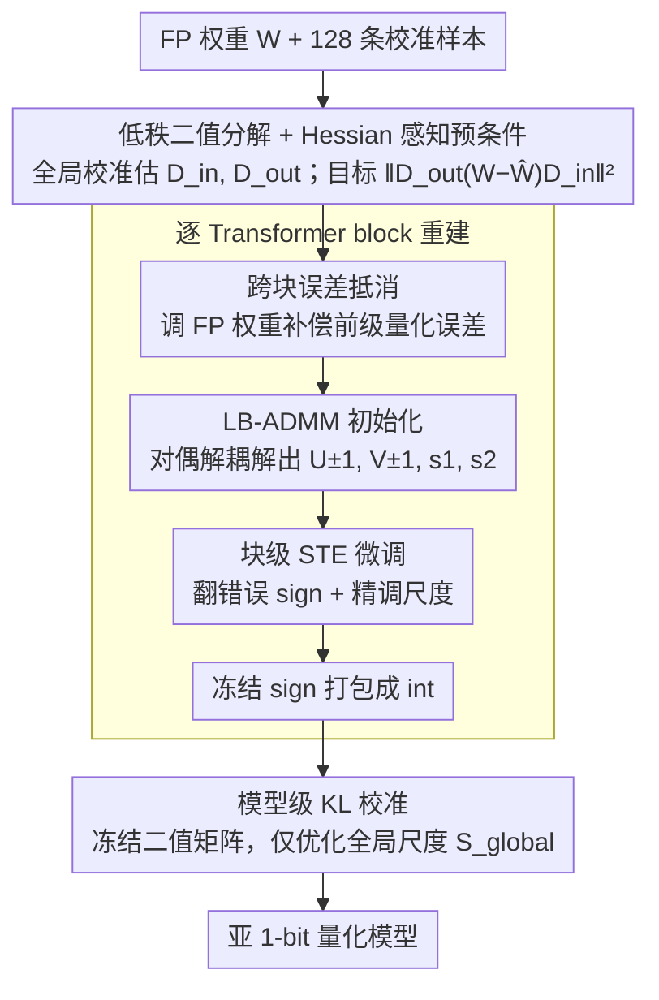

# NanoQuant: Efficient Sub-1-Bit Quantization of Large Language Models

**会议**: ICML 2026  
**arXiv**: [2602.06694](https://arxiv.org/abs/2602.06694)  
**代码**: 暂未公开  
**领域**: 模型压缩 / LLM 量化  
**关键词**: 后训练量化, 亚 1 比特, 低秩二值分解, ADMM, 大模型部署  

## 一句话总结
NanoQuant 把权重量化重新表述为「低秩二值分解」问题，用 Hessian 感知的 ADMM 精确初始化 $\pm 1$ 因子和浮点尺度，再做块级 STE 重建与全局尺度 KL 校准，在仅 0.26M token 校准数据和单卡 H100 上首次让 PTQ 把 LLM 压到真正的 1-bit 乃至亚 1-bit，把 Llama2-70B 从 138 GB 压到 5.35 GB 并能跑在 8 GB 消费级 GPU 上。

## 研究背景与动机

**领域现状**：权重量化已是 LLM 部署的标准做法。后训练量化 (PTQ) 像 GPTQ、AWQ、QuIP 等可以稳定地推到 2 bit；最近的二值 PTQ（BiLLM、ARB-LLM、STBLLM、HBLLM）尝试压到 1 bit；而二值量化感知训练 (QAT) 如 OneBit、LittleBit、DBF 已经能做到 1 bit 甚至亚 1 bit。

**现有痛点**：二值 PTQ 普遍用「就地二值化 + 全精度尺度」的结构 $\mathbf{W}\approx\alpha\mathbf{B}_{\pm 1}$，这在比特率上有一个结构性下界——必然至少 1 bit/参数，再加上各种 group mask 和 scale 元数据，实际比特率 (effective BPW) 往往要 2.5–4 bit 才能拿到可用的 PPL；而能压到亚 1 bit 的二值 QAT 又要 上亿 token 和数天多卡训练，70B 模型基本碰不到。

**核心矛盾**：PTQ 数据/算力便宜但被表征结构卡死，QAT 表征灵活但数据/算力开销大到无法 scale 到 70B。问题的本质是「能不能在 PTQ 预算下，找到一种比直接二值化更紧凑的表征」。

**本文目标**：拆成三个子问题——(1) 找一种结构上能压到亚 1 bit 的二值表征；(2) 在小校准集下精确初始化这种表征；(3) 让 70B 模型在单卡上跑完整个量化流程。

**切入角度**：从 LittleBit/DBF 借来「低秩二值分解」的表征——把权重写成两个 $\pm 1$ 低秩矩阵加两个浮点尺度，存储复杂度由 $r/d$ 控制，可以低于 1 bit。但 QAT 是端到端训练学这个分解，作者问：能不能在 PTQ 预算下，用一个「精确初始化 + 块级重建」的二阶段方法，直接逼近 QAT 的精度？

**核心 idea**：把亚 1 bit PTQ 重新表述为「Hessian 加权的低秩二值矩阵分解 + 块级 STE 微调 + 全局尺度 KL 校准」，用 ADMM 把组合优化和连续松弛解耦，从而绕开二值组合优化的 NP-hard 困难。

## 方法详解

### 整体框架
NanoQuant 把每个 Linear 层权重 $\mathbf{W}\in\mathbb{R}^{d_\text{out}\times d_\text{in}}$ 分解为 $\widehat{\mathbf{W}}=\mathbf{s}_1\odot(\mathbf{U}_{\pm 1}\mathbf{V}_{\pm 1}^\top)\odot\mathbf{s}_2^\top$，其中 $\mathbf{U}_{\pm 1}\in\{-1,+1\}^{d_\text{out}\times r}$、$\mathbf{V}_{\pm 1}\in\{-1,+1\}^{d_\text{in}\times r}$，$\mathbf{s}_1,\mathbf{s}_2$ 是两条全精度的通道尺度向量。整条流水线分三段：**(1) 全局校准**——把 128 条样本灌进 FP teacher，给每个 Linear 层算出 K-FAC 风格的输入/输出对角预条件子 $\widetilde{\mathbf{D}}_\text{in},\widetilde{\mathbf{D}}_\text{out}$；**(2) 块级重建**——逐 Transformer block，每个 block 内先调 FP 权重抵消前级量化误差，再用 LB-ADMM 精确初始化所有 Linear 层的 $\mathbf{U},\mathbf{V},\mathbf{s}_1,\mathbf{s}_2$，再用 STE 联合微调连续 latent 和尺度，最后冻结 sign 并打包成 int；**(3) 模型重建**——冻住所有打包后的二值矩阵，只继续优化全局浮点尺度集合 $\mathbf{S}_\text{global}$，用 KL 把量化模型的 logits 拉回 FP teacher。

### 关键设计

**1. 低秩二值分解 + Hessian 感知预条件：换一个能突破 1-bit 下界的量化结构**

二值 PTQ 卡在 1 bit 的根源是表征——$\mathbf{W}\approx\alpha\mathbf{B}_{\pm 1}$ 这种「就地二值化」每个参数都得存一个 sign，比特率天然不可能低于 1。NanoQuant 干脆把量化目标换成两个 $\pm 1$ 低秩因子的乘积，存储量由秩 $r$ 连续控制，从而能压到亚 1 bit。但换了表征还得有对的优化目标：作者不去最小化朴素的欧氏重建误差，而是改写成 Hessian 加权的 $\mathcal{L}(\widehat{\mathbf{W}})\approx\|\widetilde{\mathbf{D}}_\text{out}(\mathbf{W}-\widehat{\mathbf{W}})\widetilde{\mathbf{D}}_\text{in}\|_F^2$——这等价于在校准激活/梯度统计张成的椭球范数下做低秩二值近似，也正是二阶 Taylor 展开下的任务损失。这么做是因为欧氏误差对小校准集太敏感、会让那些 quantization-sensitive 的通道被淹没，而 Hessian 加权让后续优化优先压住对下游 loss 影响最大的方向。其中的对角预条件子 $\widetilde{\mathbf{D}}_\text{in},\widetilde{\mathbf{D}}_\text{out}$ 取自 K-FAC 风格估计，并用收缩稳定 $[\widetilde{\mathbf{D}}]_{ii}\leftarrow(1-\gamma)[\mathbf{D}]_{ii}+\gamma\,\mathrm{mean}(\mathbf{D})$——把经验估计往均值拉一点，对小校准集尤其关键，Llama/Qwen 取 $\gamma\approx 0.2$、输出分布更尖锐的 Gemma/Rnj 取 $\gamma\approx 0.6$。

**2. 跨块误差抵消（Error Mitigation）：先补偿前级累积误差，再量化当前块**

逐 block 顺序量化在二值化下会让误差一路累积放大——前面 block 量化引入的输出偏差会被后面 block 当成「真实输入」继续传播，传到深层时早已面目全非。NanoQuant 借鉴 GPTQ 式的顺序误差补偿：量化第 $i$ 个 block 前，先用已经量化好的前 $i-1$ 个 block 的实际输出，去调整当前 block 的 FP 目标权重，让它主动吸收掉前级累积的量化误差，再把这份「已补偿」的权重交给 LB-ADMM 去分解。这是整条 pipeline 里单点收益最大的模块——消融里只做 LB-ADMM 初始化时 PPL 高达 206.03，补上 Error Mitigation 直接降到 15.07，说明跨块误差累计在亚 1 bit 下被放大得极其严重，不先把它压住，后面再怎么微调都救不回来。

**3. Latent-Binary ADMM（LB-ADMM）：在 PTQ 预算下解出高质量的二值初始化**

低秩 $\pm 1$ 分解本身是 NP-hard 的组合优化，直接搜不动。LB-ADMM 的做法是用对偶变量把「连续重建」和「二值约束」解耦，写成 $\min_{\mathbf{U},\mathbf{V},\mathbf{Z}_U,\mathbf{Z}_V}\tfrac{1}{2}\|\widetilde{\mathbf{W}}_\text{target}-\mathbf{U}\mathbf{V}^\top\|_F^2+\tfrac{\lambda}{2}(\|\mathbf{U}\|_F^2+\|\mathbf{V}\|_F^2)$，约束为 $\mathbf{U}=\mathbf{Z}_U,\mathbf{V}=\mathbf{Z}_V$。然后三段交替：连续因子 $\mathbf{U}$（及对称的 $\mathbf{V}$）的更新归结为一个由 $\rho,\lambda$ 正则的线性系统，用 Cholesky 分解把复杂度压到 $\mathcal{O}(r^3/3)$；辅助变量 $\mathbf{Z}$ 用 Sign-Value Independent Decomposition (SVID) 取最佳秩-1 sign-preserving 近似，把连续解逐步投影到可行的二值流形上；对偶变量 $\boldsymbol{\Lambda}$ 按标准方式累加。收敛后再做一次「magnitude balancing」——用 $\eta=\sqrt{\|\widehat{\mathbf{V}}\|_F/\|\widehat{\mathbf{U}}\|_F}$ 调平两个因子的量级，把每行平均绝对值分别灌进尺度 $\mathbf{s}_1,\mathbf{s}_2$。这套解耦比 LittleBit 的 Dual-SVID 和 DBF 的端到端 ADMM 在小校准集下都更稳：消融里 LB-ADMM 在 0.8 bit 下 PPL 20.06，而 DBF-ADMM 30.27、Dual-SVID 直接崩到 167.73——初始化质量几乎决定了亚 1 bit 的成败。

**4. 块级 STE 微调 + 仅尺度的模型级 KL 校准：把局部初始化对齐成全局可用的量化模型，同时把显存压住**

好的初始化只是局部最优，还要让整个网络的输出对齐 FP teacher，但又不能像 DBF 那样把全部权重梯度留在显存里——那样 70B 根本跑不动。NanoQuant 把这步拆成两级。块级用 Straight-Through Estimator 让梯度穿过 $\mathrm{sign}(\cdot)$ 反传，逐 Transformer block 联合优化 $\mathcal{U},\mathcal{V},\mathbf{s}_1,\mathbf{s}_2$ 去最小化块输出误差 $\|\mathcal{B}(\mathbf{X}_\text{in})-\widehat{\mathcal{B}}(\mathbf{X}_\text{in};\mathrm{sign}(\mathcal{U}),\mathrm{sign}(\mathcal{V}),\mathbf{s}_1,\mathbf{s}_2)\|_F^2$；这一步既能翻转初始化里少量错误 sign，又能精调尺度，反传只局限在单个 block 内、规模可控。模型级则把所有 block 的二值矩阵全部冻结打包成 int，只放开全局浮点尺度集合 $\mathbf{S}_\text{global}$，用 KL 把量化模型的 logits 拉回 teacher：

$$\min_{\mathbf{S}_\text{global}}D_\text{KL}\big(\text{Logits}(\mathcal{M}(\mathbf{X}))\,\|\,\text{Logits}(\widehat{\mathcal{M}}(\mathbf{X};\mathbf{S}_\text{global}))\big).$$

由于全局阶段只优化向量级尺度（参数量 $\ll$ 权重），昂贵的 STE 反传被锁在 block 级，整套 70B 量化才能在单卡 H100 上跑完——这正是它能 scale 到 70B、而二值 QAT 跑不动的工程关键。

### 损失函数 / 训练策略
块级目标用 MSE，模型级用 KL；优化步数 $(T_\text{pre},T_\text{post},T_\text{glob})$ 三段独立设；ADMM 迭代次数 $K$、惩罚 $\rho$、岭正则 $\lambda$、收敛阈 $\epsilon$ 为四个核心超参；校准集仅 128 条 WikiText-2 样本（约 0.26M token），上文长度 2048。

## 实验关键数据

### 主实验
评测覆盖 Llama-2/3、Gemma-3、Qwen-3、Rnj-1 五个家族，0.6B–70B 共 17 个模型，WikiText-2 PPL 与 6 个常识推理任务零样本准确率。

| 模型 / 比特率 | 方法 | Effective BPW | WikiText-2 PPL ↓ | 备注 |
|---|---|---|---|---|
| Llama-2-7B / 1 bit | NanoQuant | 1.00 | 10.34 | 单卡 H100，0.26M token |
| Llama-2-7B / 1 bit | HBLLM_R | 3.25 | 7.60 | 多 3.25× 存储 |
| Llama-2-7B / 1 bit | BiLLM | 2.88 | 19.87 | 比 NanoQuant 还差 |
| Llama-2-70B / 1 bit | NanoQuant | 1.00 | 6.52 | 138 GB → 5.35 GB |
| Llama-3-8B / 0.8 bit | NanoQuant | 0.80 | 18.16 | 首个亚 1 bit PTQ |
| Llama-3-8B / 0.55 bit | NanoQuant | 0.55 | 25.69 | 极限压缩 |
| Llama-2-7B vs QAT DBF | NanoQuant 1.05M token | 1.00 | 9.01 vs DBF 9.25 | DBF 用 1.38B token, 37.6 GPU-h |

### 消融实验
| 配置 | PPL ↓ | Zero-shot ↑ | 说明 |
|---|---|---|---|
| 仅 LB-ADMM 初始化 | 206.03 | 36.89 | 没有重建必崩 |
| + Error Mitigation | 15.07 | 46.40 | 抵消前级累计误差 |
| + Factorized Refinement | 13.58 | 46.75 | STE 微调 sign 和尺度 |
| Full (再 + 模型级 KL) | 12.47 | 48.94 | Qwen3-8B 0.8 bit |
| Dual-SVID 初始化 | 167.73 | 35.11 | LittleBit 风格 |
| DBF-ADMM 初始化 | 30.27 | 37.20 | DBF 风格 |
| LB-ADMM 初始化 | 20.06 | 39.29 | 本文，Rnj-1 0.8 bit |

### 关键发现
- 初始化是亚 1 bit PTQ 成败的关键：仅换初始化策略就能让 PPL 从 167 降到 20，证明把二值组合问题在 ADMM 里解掉比让 STE 自己找好 sign 重要得多。
- 整条 pipeline 的 4 个模块都不可省，缺 Error Mitigation 时 PPL 爆到 206，说明跨块误差累计在二值化下被放大得非常严重。
- 在「等比特率」下 NanoQuant 唯一能与多倍存储的 HBLLM/STBLLM 抗衡：BiLLM 2.88 bit 在 Llama-2-7B 上 PPL 19.87，NanoQuant 1.00 bit 反而是 10.34，说明低秩二值表征比就地二值化在小预算下更紧凑。
- 部署上：在 RTX 3050 8GB 上 Llama-3.2-3B 解码吞吐 3.7×、显存 5.4×、能耗 3.9× 优于 BF16；70B 模型可以装进 8 GB 消费卡跑到 20.11 tok/s，是这篇论文最直接的工程意义。

## 亮点与洞察
- **结构创新**：把量化目标从「尺度 × 二值矩阵」改成「尺度 × 二值因子的乘积」，从而打破 1 bit 的结构下界——这一步在概念上比 ADMM 解法本身更重要，因为它说明 sub-1-bit 不需要 codebook 或 sparsity 这类额外机制。
- **ADMM 的合身用法**：把组合约束 $\mathbf{U}\in\mathbb{B}^{d\times r}$ 用对偶变量推到 $\mathbf{Z}$ 子问题、连续约束推到线性系统，两边各自解析可解，是 ADMM 处理「非凸 + 离散约束」的范式案例，可以直接迁移到 codebook 量化、剪枝、稀疏化等问题。
- **预算分摊**：把昂贵的 STE 反传锁在 block 级、全局阶段只优化向量级尺度，是让 70B 在 H100 上跑通的关键工程哲学——给后续做超大模型 PTQ 的工作提供了模板。
- **预条件子做收缩**：在小校准集场景下，明确把 K-FAC 对角线和均值做 convex combination 而不是直接信任经验估计，对 Gemma 这类输出分布尖锐的模型尤其重要，值得在所有 Hessian-aware PTQ 里抄一遍。

## 局限与展望
- 论文公开的 PPL 数字依旧明显高于 BF16 baseline（如 Llama-2-7B 5.47 → 10.34），亚 1 bit 在长上下文和复杂推理任务（GSM8K、MMLU 完整集）上的表现没有给出，工程上能用到什么程度需要更多评测。
- 评测里给出的「QAT 对照」是作者自己 reproduce 的，原始 LittleBit/DBF 用更多 token 训练后的精度边界没有完全对齐；公平比较应该至少给一组在同样 token 预算下两边都 retrain。
- 校准集只用 128 条 WikiText-2，对 Gemma/Qwen 这类多语种、code 占比高的模型可能有偏；shrinkage 系数 $\gamma$ 需要针对家族调，泛化到新家族时还是要手动试。
- ADMM 在亚 1 bit 上的收敛行为没有理论保证，论文里给的「Hessian-aware initialization 是关键因子」更像是经验声明而非定理；未来可以补 nonconvex ADMM 在该结构下的收敛速率分析。

## 相关工作与启发
- **vs BiLLM / ARB-LLM / STBLLM / HBLLM（二值 PTQ）**：它们走「就地二值化 + 显著权重保留 + group mask」路线，effective BPW 被结构卡在 2.5–4 bit；NanoQuant 直接换表征到「低秩二值分解」，跳过了显著权重的二值化分歧问题，等比特率下精度全面占优。
- **vs OneBit / BinaryMoS / LittleBit / DBF（二值 QAT）**：它们靠 100M–1B token 的端到端训练学这个分解；NanoQuant 把训练换成「ADMM 精确初始化 + 块级 STE」的 PTQ，数据/算力降到 1/100–1/1000 仍能接近其精度，主要差距在 70B 上 PTQ 反而能跑、QAT 跑不动。
- **vs GPTQ / AWQ / QuIP（整数 PTQ）**：整数量化的 BPW 被「位宽必须是整数」卡死；NanoQuant 的 BPW 由秩 $r$ 连续调节，可以做 0.55、0.8、1.0 任意点，是真正连续的 Pareto 前沿。
- **vs QMoE / BTC-LLM（亚 1 bit 但有约束）**：QMoE 只针对 MoE 模型，BTC-LLM 需要 codebook 额外存储；NanoQuant 不挑模型架构、也没有额外 codebook，是首个通用 sub-1-bit PTQ。

## 评分
- 新颖性: ⭐⭐⭐⭐ 「低秩二值分解 + ADMM 初始化」的组合在 PTQ 上是第一次，但表征结构本身借自 LittleBit/DBF
- 实验充分度: ⭐⭐⭐⭐ 覆盖 5 个家族 17 个模型 + 消融 + 部署，但缺 GSM8K/MMLU 等推理基准
- 写作质量: ⭐⭐⭐⭐ 三阶段 pipeline 结构清晰，公式和算法伪码到位
- 价值: ⭐⭐⭐⭐⭐ 让 70B 跑在 8 GB 消费卡上 + 单卡 H100 13 小时量化 70B，直接降低了大模型部署门槛

<!-- RELATED:START -->

## 相关论文

- [\[ICML 2026\] NeUQI: Near-Optimal Uniform Quantization Parameter Initialization for Low-Bit LLMs](neuqi_near-optimal_uniform_quantization_parameter_initialization_for_low-bit_llm.md)
- [\[ICML 2026\] LFQ: Logit-aware Final-block Quantization for Boosting the Generation Quality of Low-Bit Quantized LLMs](lfq_logit-aware_final-block_quantization_for_boosting_the_generation_quality_of_.md)
- [\[ICML 2026\] Bounded Hyperbolic Tangent: A Stable and Efficient Alternative to Pre-Layer Normalization in Large Language Models](bounded_hyperbolic_tangent_a_stable_and_efficient_alternative_to_pre-layer_norma.md)
- [\[ICML 2026\] Model Merging Scaling Laws in Large Language Models](model_merging_scaling_laws_in_large_language_models.md)
- [\[ACL 2025\] Outlier-Safe Pre-Training for Robust 4-Bit Quantization of Large Language Models](../../ACL2025/model_compression/outlier-safe_pre-training_for_robust_4-bit_quantization_of_large_language_models.md)

<!-- RELATED:END -->
