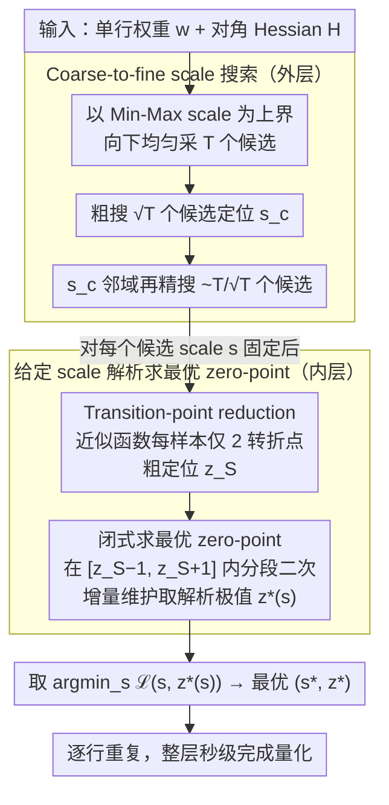

# NeUQI: Near-Optimal Uniform Quantization Parameter Initialization for Low-Bit LLMs

**会议**: ICML 2026  
**arXiv**: [2505.17595](https://arxiv.org/abs/2505.17595)  
**代码**: 暂无公开（推理可通过 BitBLAS 支持浮点 zero-point）  
**领域**: 模型压缩 / 低比特量化 / PTQ  
**关键词**: 后训练量化, 均匀量化, 量化参数初始化, scale-zero point 优化, LLM 部署

## 一句话总结
本文指出主流后训练量化 (PTQ) 方法都沿用了 Min-Max 公式来初始化 scale 与 zero-point，而这套老公式隐含了"由极值决定参数 + zero-point 必须是整数"两个被长期忽视的约束；作者提出 NeUQI，用"给定 scale 解析地求最优 zero-point + 由粗到细搜 scale"两步把约束打掉，在 LLaMA-2 7B 2-bit 通道量化下把 C4 困惑度从 SOTA 的 47.55 (MagR) 砍到 17.50，并使轻量蒸馏后超越成本高得多的 PV-tuning。

## 研究背景与动机

**领域现状**：LLM 本地化部署（消费级 GPU、笔记本）越来越火，主流做法是 PTQ 把 BF16 权重量化到 int2/3/4。在所有 PTQ 范式里，**均匀量化（uniform / affine quantization）**因为硬件原生支持、推理 kernel 简单，是工业部署的事实标准；学术界从 GPTQ → AWQ → QuIP → QuaRot → MagR → GPTAQ 一路把量化方法本身打磨得很精致。

**现有痛点**：量化的两个核心参数 —— scale $s$ 与 zero-point $z$ —— 几乎所有方法都用同一行老公式（Jacob et al. 2017 的 Min-Max）初始化：$s = (\max(\bm{x}) - \min(\bm{x}))/(2^k - 1)$，$z = -\lfloor \min(\bm{x})/s \rceil$。在 8-bit / 4-bit 时这样够用，但到 3-bit / 2-bit 性能就会塌方（GPTQ 在 LLaMA-2 7B 2-bit 上 C4 PPL 高达 2592）。"方法越改越多，初始化却没人动" 是该领域的一个盲点。

**核心矛盾**：Min-Max 公式背后藏着两个被长期忽视的硬约束 —— (i) **极值决定参数**：scale 和 zero-point 都由 $\bm{x}$ 的极值绑定，搜索算法（如 LeanQuant）只能在"极值候选对"的二维网格上搜，候选规模 $T^2$（$T=2048$）巨大；如果直接在 $(s, z)$ 空间搜只需 $2^k T$，差几个量级。(ii) **zero-point 必须是 $k$-bit 无符号整数**：把 $z$ 限制成离散整数压缩了参数空间，在 $k=2$ 时只剩 4 个候选，搜索失败率高。

**本文目标**：(i) 解除两个 Min-Max 约束，让 $z$ 可以取浮点、scale 与 zero-point 解耦优化；(ii) 在 $\mathcal{O}(n \log n)$ 时间内给定 scale 解析地求出最优浮点 zero-point；(iii) 拿"更好的初始化"打败"更复杂的微调"，证明初始化不是配角。

**切入角度**：作者重新审视权重量化损失（GPTQ 风格，Hessian 对角近似）$\mathcal{L}(s, z) = \sum_i H_{i,i} (Q_{s,z}(w_i) - w_i)^2$，发现 **固定 scale 后 $\mathcal{L}(z)$ 是一个分段二次函数**（piecewise quadratic），有 $n(2^k - 1)$ 个转折点。这意味着对每个固定 scale，最优 zero-point 是可以闭式精确求解的 —— 把二维联合优化降成一维。

**核心 idea**：把 "scale 与 zero-point 联合搜" 拆成 "外层一维 scale 搜 + 内层 zero-point 解析求最优"，再用 transition-point reduction + coarse-to-fine 两道加速把单层量化时间从 112 秒压到秒级。

## 方法详解

### 整体框架

NeUQI 要解决的是"给定一层权重，怎么挑出真正最优的 scale $s$ 与 zero-point $z$"。它对单层权重矩阵 $\bm{W}$ 的每一行 $\bm{w}$ 独立做量化，凭借的输入是这一行的权重和一个 GPTQ 风格的对角 Hessian $\bm{H} = \mathbb{E}_{\bm{X}}[\bm{X}^\top \bm{X}]$。核心做法是把原本要在 $(s, z)$ 二维上联合搜的问题拆成内外两层：外层从 Min-Max 给出的 scale 上界往下均匀采候选、用由粗到细的方式定位最优 scale；内层对每个候选 scale 解析地求出令误差最小的浮点 zero-point。两层套完后取 $\arg\min_s \mathcal{L}(s, z^*(s))$ 作为最终参数，整层量化从基线的百秒级压到秒级。

### 关键设计

**1. 闭式求最优 zero-point：把内层从二维搜索变成一维解析极值**

主流方法把 $z$ 锁成 $k$-bit 整数、又和极值绑死，导致在 2-bit 下 $z$ 只剩 4 个候选、搜不出好解。NeUQI 先把 $z$ 解放成浮点，再注意到一个关键结构：固定 scale 后，单样本损失 $\mathcal{L}_i(z) = h_i (x_i + z - \mathrm{clip}(\lfloor x_i+z \rceil, 0, 2^k-1))^2$（其中 $x_i = w_i/s$、$h_i = H_{i,i} s^2$）是 $z$ 的分段二次函数，有 $2^k - 1$ 个转折点、$2^k$ 个区间；总损失 $\mathcal{L}(z) = \sum_i \mathcal{L}_i(z)$ 在所有转折点的并集（共 $n(2^k-1)$ 个）上仍然分段二次。既然每一段都是二次函数，最优 $z^*$ 就能在每段内闭式求极值、再取全局最小。直接对每段重算整个 sum 是 $\mathcal{O}(n \cdot 2^k \cdot n)$；Algorithm 1 的 trick 是观察到相邻两个区间之间只差"某个 $\mathcal{L}_i$ 的贡献切换"这一项，于是增量维护当前区间的二次函数 $\mathcal{L}^I(z) \leftarrow \mathcal{L}^I(z) + \delta(z)$，每次只算本区间的极值，把复杂度降到 $\mathcal{O}(n \cdot 2^k \log(n \cdot 2^k))$（排序占主导）。之所以非这样不可，是因为解锁后的最优 $z$ 不一定落在任何 $w_i + j$ 网格点上，只有靠分段二次的解析极值才能精确找到。

**2. Transition-point reduction：把每样本 $2^k-1$ 个转折点压成 2 个**

上一步在 $k=2$ 时够快，但 $k=4$ 时 $2^k$ 这个因子会拖慢内层。NeUQI 进一步观察到：$\mathcal{L}_i(z)$ 在中段区间 $[-1/2 - x_i,\ 2^k - 1/2 - x_i]$ 其实被 rounding 损失上界 $h_i/4$ 截顶了——远处那些样本早已 saturate，不可能把全局最小拉走。于是构造一个超近似函数 $\mathcal{L}_i^S(z)$，把整段中部直接替换成常数 $h_i/4$，只保留两端的 quadratic，每个样本因此只剩两个转折点。先用 Algorithm 1 在这个近似上找到粗位置 $z^S$，再退回原始 $\mathcal{L}_i(z)$、只在长度为 2 的小窗 $[z^S - 1, z^S + 1]$ 内精化（小窗里每样本同样最多两个转折点）。两遍都是 $\mathcal{O}(n \log n)$，把内层从 $\mathcal{O}(n 2^k \log(n 2^k))$ 拉下来，让 $k=4$ 也能秒级跑完，而精度几乎无损——Table 1 里 relative loss 只有 1.00001×–1.00003×。本质上是经典的 "outer bound 粗定位 + local refine 精修" 套路在量化损失上的一次干净落地。

**3. Coarse-to-fine scale 搜索：把外层 $T$ 次内层求解砍成 $\mathcal{O}(\sqrt{T})$ 次**

外层要在多个候选 scale 上各跑一次内层，朴素地把 $T=2048$ 个候选全搜一遍太贵。scale 候选集取 $\mathcal{S}_T = \{ ((\max(\bm{w}) - \min(\bm{w}))/(2^k - 1)) \cdot (i/T) : i = 1, \dots, T \}$，即以 Min-Max 推出的 scale 为上界向下均匀采样。由于经验上 $\mathcal{L}(s, z^*(s))$ 作为 $s$ 的函数是单峰、平滑的，没必要全网格搜：先在 $T_c = O(\sqrt{T})$ 个候选上粗搜得到 $s^c$，再在 $s^c$ 附近约 $T/T_c$ 个 fine candidate 上精搜，总评估次数 $O(\sqrt{T}) \approx 90$。配合前两步，单层量化时间从基线的 112 秒降到几秒。

### 损失函数 / 训练策略

NeUQI 是纯 PTQ、无梯度训练，损失就是 Eq. 5 的对角 Hessian 加权 MSE $\mathcal{L}(s, z) = \sum_i H_{i,i} (Q_{s,z}(w_i) - w_i)^2$，校准集与 GPTQ 一致（少量 WikiText / C4 样本）。它也可选地与下游强微调（PV-tuning、EfficientQAT）组合——NeUQI 提供一个更好的起点，使后续微调用更少资源就能赶上甚至超过原版。

## 实验关键数据

### 主实验

LLaMA-2 7B 2-bit 通道量化（Wiki2 ↓ / C4 ↓ PPL，五个 zero-shot benchmark 平均 ↑ Acc）：

| 方法 | Wiki2 PPL | C4 PPL | 平均 Acc | 备注 |
|------|-----------|--------|----------|------|
| GPTQ | 6953 | 2592 | 35.08% | 完全崩 |
| GPTAQ | 1269 | 246 | 34.97% | 仍崩 |
| MagR† | 129 | 47.55 | 39.54% | 之前最强 |
| **NeUQI** | **17.14** | **17.50** | **47.24%** | 提升 ~3× / +7.7 pp |

LLaMA-3 8B 2-bit、LLaMA-2 70B 2-bit、Qwen-2.5 7B/14B 2-bit 上趋势一致 —— NeUQI 把"崩盘的 GPTQ/GPTAQ"和"勉强能用的 MagR"都甩开。在 LLaMA-2 70B 2-bit 上 NeUQI 取得 Wiki2 7.03 / C4 8.88 / Acc 65.13%（最强基线 MagR† 是 13.95 / 68.62 / 61.80%）。

### 消融实验

加速消融（LLaMA-2 7B 2-bit，单层 query 投影耗时）：

| 配置 | 相对 Loss | 相对耗时 | 绝对耗时 (s) |
|------|-----------|----------|--------------|
| Baseline（无任何加速） | 1.0000× | 1.000× | 112 |
| w/ transition-point reduction（去 coarse-to-fine） | 1.00197× | 0.548× | ~61 |
| **NeUQI 完整版** | **1.00193×** | **0.027×** | **~3** |

- transition-point reduction 单项约省 50% 耗时，加 coarse-to-fine 后再砍约 95%。
- 全部加速合起来引入的 loss 退化 < 0.2%，几乎无感。

### 关键发现
- **更好的初始化比更贵的微调更划算**：NeUQI 仅做初始化（不微调）就把 LLaMA-2 7B 2-bit 的 C4 PPL 从 47.55 降到 17.50；再加轻量蒸馏后甚至超过 PV-tuning（一个资源消耗大得多的联合优化方法）。
- **整数 zero-point 是最大的桎梏**：放开 $z$ 为浮点后，等比特宽度下 PPL 降幅可达 15.54%，平均 Acc 涨 3.95 pp；额外比特开销很小（zero-point 只多存一个 float，在 channel-wise 粒度下分摊后 ~0.05 bit）。
- **3-bit NeUQI 量化的 Qwen-2.5 在等显存下能超过 BF16 原版**：Figure 1 显示等内存预算下 NeUQI 3-bit 在 C4 PPL 与 5-bench 平均准确率上严格优于同 footprint 的 BF16 较小模型 —— 这是过去 PTQ 没怎么做到过的。

## 亮点与洞察
- **重新审视"被默认正确"的工程公式**：Min-Max 公式从 2017 年沿用至今，所有人在改"量化方法"，但没人质疑"参数初始化"。本文把它拆成两个具体的、可挑战的约束，是非常工程师的洞察 —— 提醒我们一个领域里被默认的 baseline 公式经常藏着可挖的金矿。
- **"分段二次 + incremental update + transition-point reduction"是干净的算法工程**：把一个看似要 $\mathcal{O}(n^2 \cdot 2^k)$ 的 brute force 问题压到 $\mathcal{O}(n \log n)$，每步的 trick 都有清晰的几何动机（上界 / 邻接增量 / 单峰 fine search），可迁移到其他"分段凸 / 半凸"量化损失场景。
- **"初始化 > 微调"的反常识结论**：现在大家默认要堆 fine-tuning 才能救低比特；本文展示了一个对照 —— 同样的 PV-tuning 接到一个好初始化上反而被超越，说明微调救不动垃圾起点（"坏的初始化在大量微调后依然差"）。这是个值得 BitNet / QAT 阵营反思的信号。

## 局限与展望
- **目前只在 weight-only 通道量化设定下验证**：activation 量化与 group-wise / mixed-precision 没系统跑；group size 较小时 transition-point reduction 的常数项可能恶化。
- **依赖 GPTQ 风格的对角 Hessian 近似**：把 cross-weight interaction 完全忽略；在某些极度耦合的 attention 矩阵上可能不够准。
- **浮点 zero-point 的硬件友好性**：作者在 Appendix E 论证 mainstream 硬件可以支持，但实际 deployment kernel 上的吞吐对比缺数据；如果硬件 fallback 到 float32，推理收益可能会被打折。
- **可以推广到非均匀 / 学习的 quantization scheme**：本文只解了 uniform 这一种；同样的 "fix one param, solve the other analytically" 思路应能推广到 logarithmic / power-of-two 量化。

## 相关工作与启发
- **vs GPTQ / GPTAQ (Frantar et al. 2023)**：他们用 OBS 思路逐权重 round + 误差补偿，但 scale/zero-point 仍 Min-Max。NeUQI 改的是它们共享的初始化层，可与 GPTQ 风格的 rounding 路线正交叠加。
- **vs LeanQuant (Zhang & Shrivastava 2025)**：LeanQuant 直接在 Min-Max 的两个极值上做二维网格搜（$T^2 \approx 4{,}000{,}000$ 次评估）；NeUQI 解耦后只需 $\mathcal{O}(\sqrt{T})$ 次 scale 评估 + 内层 $\mathcal{O}(n \log n)$ 解析求 $z$，理论复杂度低 1000× 以上。
- **vs OmniQuant (Shao et al. 2024) / EfficientQAT (Chen et al. 2025)**：他们把 Min-Max clipping 当成可学参数训；NeUQI 不训只解析，直接达到 / 超过这条路线在多个设定上的性能，且不需 backward。
- **vs MagR (Zhang et al. 2024)**：MagR 是抑制权重 magnitude 的预处理，与 NeUQI 完全正交，理论上可叠加（论文未做此组合实验）。

## 评分
- 新颖性: ⭐⭐⭐⭐ 把"老公式藏着两个约束"挑出来本身是 underrated insight；分段二次解析求 zero-point + incremental DP 是新的算法贡献。
- 实验充分度: ⭐⭐⭐⭐⭐ LLaMA-2/3、Qwen-2.5 全 size、2/3-bit、channel-wise / group-wise、加上 PV-tuning / EfficientQAT 组合实验，覆盖度顶。
- 写作质量: ⭐⭐⭐⭐ 算法和动机讲得清楚，但 Algorithm 1 在正文里仅给 high-level，要看 Appendix；公式排版略密。
- 价值: ⭐⭐⭐⭐⭐ 直接把 LLaMA-2 70B 2-bit 推到可用水平（Acc 65%），对消费级 GPU 部署有现实意义；与现有 PTQ pipeline 即插即用。

<!-- RELATED:START -->

## 相关论文

- [\[ICML 2026\] WUSH: Near-Optimal Adaptive Transforms for LLM Quantization](wush_near-optimal_adaptive_transforms_for_llm_quantization.md)
- [\[ICML 2026\] LFQ: Logit-aware Final-block Quantization for Boosting the Generation Quality of Low-Bit Quantized LLMs](lfq_logit-aware_final-block_quantization_for_boosting_the_generation_quality_of_.md)
- [\[ICML 2026\] OSAQ: Outlier Self-Absorption for Accurate Low-bit LLM Quantization](osaq_outlier_self-absorption_for_accurate_low-bit_llm_quantization.md)
- [\[ICML 2026\] NanoQuant: Efficient Sub-1-Bit Quantization of Large Language Models](nanoquant_efficient_sub-1-bit_quantization_of_large_language_models.md)
- [\[AAAI 2026\] SpecQuant: Spectral Decomposition and Adaptive Truncation for Ultra-Low-Bit LLMs Quantization](../../AAAI2026/model_compression/specquant_spectral_decomposition_and_adaptive_truncation_for_ultra-low-bit_llms_.md)

<!-- RELATED:END -->
