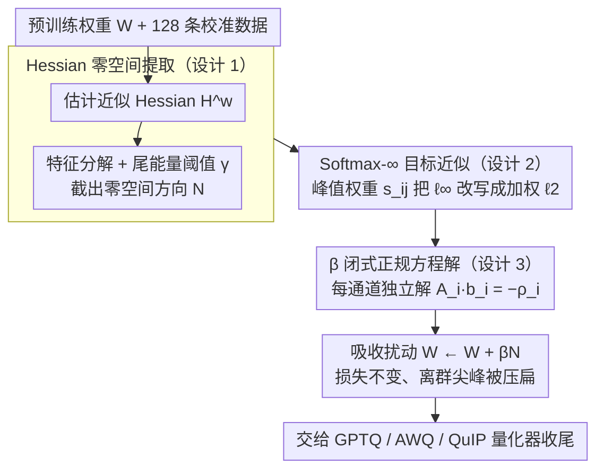

# OSAQ: Outlier Self-Absorption for Accurate Low-bit LLM Quantization

**会议**: ICML 2026  
**arXiv**: [2605.04738](https://arxiv.org/abs/2605.04738)  
**代码**: 无  
**领域**: 模型压缩 / LLM 仅权重量化  
**关键词**: 仅权重量化, 离群值抑制, Hessian 零空间, 加性变换, 闭式解  

## 一句话总结
OSAQ 利用 LLM 各层 Hessian 在不同输入下保持一致的低秩零空间，将零空间向量线性组合成一个加性权重扰动 $\Delta W$，在不改变二阶任务损失的前提下把离群权重「自吸收」掉，使 2 比特仅权重量化的困惑度比朴素 GPTQ 降低 40% 以上。

## 研究背景与动机

**领域现状**：LLM 部署的瓶颈在 decoding 阶段的内存带宽（memory wall），所以仅权重量化（W4/W3/W2A16）成为压缩主流。代表方法 GPTQ 用近似 Hessian 做误差补偿，AWQ 用激活分布做按通道缩放，QuIP/QuaRot/SpinQuant 等用正交旋转把离群值「摊平」到其他维度。

**现有痛点**：所有这些方法本质上都依赖**相邻层之间的乘性等价变换** $(XW_1)W_2 = (XW_1T^{-1})(TW_2)$。在 2-bit 这种极端低位场景下，单靠乘性变换仍然无法把权重的离群尖峰压到量化网格能覆盖的范围，困惑度退化严重。

**核心矛盾**：乘性范式必然要把变换「转嫁」给前后相邻层，受限于网络拓扑（残差、LayerNorm 跨过来的不可吸收路径）和数值范围耦合，能压制离群值的自由度有限；而单层内部其实还有大量「损失不敏感」的方向没被利用。

**本文目标**：寻找一种**纯加性**的、**只作用在当层权重**、**严格不影响二阶任务损失**、**离线一次性吸收**的离群值抑制手段。

**切入角度**：作者实测发现，虽然不同输入的激活协方差结构差异巨大，但**任务损失对权重的 Hessian 在不同样本下却展示出一致的低秩结构**——尾部一批特征值合起来才占 0.01% 能量，且这些零空间方向在不同样本上保持稳定。这意味着存在一组方向，沿其改动权重几乎不影响损失。

**核心 idea**：把这些 Hessian 零空间向量加权求和，构造一个加性扰动 $\Delta W = \beta \mathcal{N}$，让 $\|W + \Delta W\|_\infty$ 最小化以压扁离群值，同时保证 $\Delta w^\top H^w \Delta w \approx 0$ 使损失几乎不变；用 Softmax-$\infty$ 近似把不可微的 $\ell_\infty$ 改成带温度系数的加权 $\ell_2$，从而得到 $\beta$ 的闭式解，全程无需训练或迭代。

## 方法详解

### 整体框架
OSAQ 是一个可插拔的 PTQ 前置步骤，目标是在不动相邻层、不影响二阶任务损失的前提下，把每层权重里的离群尖峰离线「摊平」。给定预训练 LLM 和少量校准数据（128 条、序列长 2048），它对每一层线性权重 $W \in \mathbb{R}^{M\times N}$ 独立走一条流水线：先估计该层关于权重的近似 Hessian $H^w$，对它做特征分解并按尾能量阈值 $\gamma$ 截出一组「损失不敏感」的零空间方向 $\mathcal{N} \in \mathbb{R}^{K\times N}$；然后求出每个输出通道的组合系数 $b_i$，堆成系数矩阵 $\beta \in \mathbb{R}^{M\times K}$；最后令 $W \leftarrow W + \beta\mathcal{N}$，把这个加性扰动直接吸收进权重，再交给 GPTQ / AWQ / QuIP 等已有量化器收尾。因为扰动落在零空间里且只改当层权重，整个过程不增加任何推理开销。

### 关键设计

**1. Hessian 零空间提取：找出一组「沿之改权重也不增损失」的自由方向**

OSAQ 的立足点是：要在不伤损失的前提下挪动权重，就得知道哪些方向「损失不在乎」。把任务损失对权重做二阶 Taylor 展开，主导项是 Hessian 项 $\frac{1}{2}\Delta w^\top H^w \Delta w$，于是只要让扰动 $\Delta w$ 落在 $H^w$ 的低曲率方向上，这一项就近似为零、损失几乎不变。具体做法是对 $H^w$ 特征分解 $H^w = V\,\mathrm{diag}(\lambda_1,\dots,\lambda_N)V^\top$，把特征值按 $|\lambda|$ 升序累加，直到尾部累计能量达到阈值 $\gamma\in(0,1)$，即 $K = \min_k\{\sum_{i=1}^k|\lambda_i| \ge \gamma\sum_{i=1}^N|\lambda_i|\}$，取对应的前 $K$ 个特征向量作为零空间矩阵 $\mathcal{N}$。这里用「尾能量比例」而非固定数值阈值是关键：固定阈值会让某些层零空间为空、某些层维度爆炸，而尾能量策略让每层都拿到大约等量的可用自由度，又保证这些方向的曲率确实近似为零，不会一改就把损失顶飞。

**2. Softmax-$\infty$ 目标近似：把不可微的「压最大值」改写成可闭式求解的加权 $\ell_2$**

有了零空间方向后，真正要优化的目标是「扰动之后让权重的最大绝对值尽量小」，即 $\min_\beta \|W + \beta\mathcal{N}\|_\infty$——压的就是离群尖峰。但 $\ell_\infty$ 非光滑、不可微，硬解只能像 MagR 那样迭代次梯度，慢且没有闭式解。OSAQ 借用凸优化里的 log-sum-exp / softmax 技巧（Boyd & Vandenberghe）对绝对值做温度归一化，给每个元素一个峰值权重 $s_{ij} = \exp(|W_{ij}|/\tau) / \sum_t \exp(|W_{it}|/\tau)$：当温度 $\tau\to0^+$ 时 $s_{ij}$ 集中到「最大那个元素」上，于是加权平方和 $\sum_j s_{ij}(W_{ij}+\cdot)^2$ 就近似只惩罚峰值。这样既保住了「专挑离群值打」的语义，又因为目标变回了平方损失，下一步能立刻写出正规方程。

**3. $\beta$ 的闭式正规方程解：每个输出通道独立解一个小线性系统，零训练零迭代**

把前两步合起来，对第 $i$ 个输出通道得到目标 $\min_{b_i} \tfrac{1}{2}\sum_j s_{ij}(W_{ij}+b_i^\top n_j)^2 + \tfrac{\mu_1}{2}\|b_i\|_2^2 + \tfrac{\mu_2}{2}(b_i^\top v)^2$，三项分别是峰值加权拟合、防系数过大的 $\ell_2$ 正则、避免整通道同向平移的反平移正则。令一阶条件为零，得到 $A_i b_i = -\rho_i$，其中 $A_i = \sum_j s_{ij}n_j n_j^\top + \mu_1 I_K + \mu_2 v v^\top$。由于 $A_i \succeq \mu_1 I_K \succ 0$ 严格正定，最优解 $b_i^\ast = -A_i^{-1}\rho_i$ 存在且唯一，把 $M$ 个通道的解堆起来就是 $\beta^\ast$。这意味着全程没有超参搜索、没有收敛性问题、不需要 GPU 训练——端到端只是一次特征分解加每通道一次 $K\times K$ 小矩阵求逆，70B 模型分钟级就能跑完所有层。

### 损失函数 / 训练策略
OSAQ 没有任何训练损失，整条流程都是 PTQ 校准式的：用 128 条序列长 2048 的样本估计 $H^w$，涉及的超参只有尾能量阈值 $\gamma$、温度 $\tau$ 和正则系数 $\mu_1,\mu_2$，作者用简单网格搜索证明结果对它们都很鲁棒。它与下游量化器（GPTQ/AWQ/QuIP）正交、可即插即用；在 2-bit 这种极端设置下还能叠加坐标下降迭代（记作 $\dagger$）进一步压低困惑度。

## 实验关键数据

### 主实验
模型覆盖 LLaMA2-{7B,13B,70B}、LLaMA3-{8B,70B}，乃至 Mistral-Large-123B-Instruct 和 Llama-3.1-405B-Instruct；评测分语言生成（WikiText2 / C4 困惑度）、常识 QA（PIQA / ARC / WinoGrande 零样本准确率）、MMLU 与 MT-Bench。基线包括 GPTQ、AWQ、QuIP、MagR、OmniQuant 等。

| 模型 / 设置 | 指标 | FP16 | GPTQ | OSAQ+GPTQ | 增益 |
|---|---|---|---|---|---|
| LLaMA2-7B W4A16 | WikiText2 PPL | 5.47 | 5.83 | **5.73** | 减少 0.10 |
| LLaMA2-13B W4A16 | WikiText2 PPL | 4.88 | 5.13 | **5.04** | 减少 0.09 |
| LLaMA3-70B W4A16 | WikiText2 PPL | 2.90 | 3.60 | **3.42** | 减少 0.18 |
| LLaMA3-70B W4A16 | C4 PPL | 6.90 | 7.40 | **7.24** | 减少 0.16 |
| LLaMA2-7B W4A16 | C4 PPL | 6.97 | 7.37 | **7.34** | -- |

与 AWQ 组合也类似：LLaMA3-8B 上 OSAQ+AWQ 把 WikiText2 PPL 从 7.10 降到 6.82，C4 从 10.1 降到 9.93。论文摘要强调的「2-bit 比朴素 GPTQ 减 40% 困惑度」是 OSAQ$^\dagger$+GPTQ 在 W2A16 下相对 vanilla GPTQ 的极端低位场景结论。

### 消融实验

| 配置 | LLaMA2-7B WikiText2 W4A16 PPL | 说明 |
|---|---|---|
| Vanilla GPTQ | 5.83 | 仅 GPTQ |
| OSAQ+GPTQ | 5.73 | 加上零空间加性变换 |
| OSAQ+AWQ | 5.99 | 换到 AWQ 上同样有效 |
| OSAQ+GPTQ（变 $\gamma$） | 对 $\gamma$ 不敏感 | 网格搜索（Fig.5）证实超参鲁棒 |
| 改用固定阈值切零空间 | 各层维度严重失衡 | 论文文本说明尾能量策略必要 |

### 关键发现
- Hessian 在不同输入下的低秩结构高度一致：把不同 batch 算出的零空间投到 2D 平面后近似重合（Figure 1 右），而输入零空间则发散，这是 OSAQ 立论的实验基础。
- 模型越大、位宽越低，OSAQ 带来的相对增益越显著——这与「离群值随规模增大而加剧」的经验观察相符。
- 与所有乘性变换法（缩放/旋转）正交，叠加任意一种都能稳定提升，说明它确实补上了乘性范式覆盖不到的「层内自由度」。

## 亮点与洞察
- 「不影响损失的扰动方向」这一视角把量化离群值问题转化成一个**在 $H^w$ 零空间内的优化**问题，是从近似 OBS（Optimal Brain Surgeon）传统中拿到 LLM 时代的漂亮迁移。
- Softmax-$\infty$ 近似把不可微的 $\ell_\infty$ 转成带温度的加权 $\ell_2$，进而获得闭式解，避免了 MagR 那种昂贵迭代——这个技巧在很多「想要 minimax 又要闭式」的场景都可以借鉴。
- 「加性 vs 乘性」两种等价变换的正交性指出了一条新轴：今后再设计 PTQ 时可以同时考虑乘性变换的拓扑限制和加性变换的零空间利用，两者叠加。

## 局限与展望
- 校准依赖近似 Hessian（实际上多用 Fisher / 经验二阶估计），对校准数据分布敏感；分布漂移下零空间稳定性需要进一步验证。
- 当前只对每层独立处理，没有考虑跨层的累积扰动；多层叠加后整体损失的二阶近似可能不再准确。
- 论文未公开代码，复现门槛较高，且对超大模型（405B）虽然给了结果，但 Hessian 估计与特征分解的工程开销并未详谈。

## 相关工作与启发
- **vs GPTQ**：GPTQ 在量化时用 Hessian 做误差补偿，是「事后修复」；OSAQ 在量化前先用 Hessian 零空间把权重摊平，是「事前预处理」，两者天然互补。
- **vs AWQ / QuIP / SpinQuant**：这些方法靠相邻层乘性变换（缩放或旋转），受限于网络拓扑；OSAQ 是层内加性变换，不依赖前后层，弥补了乘性范式的盲区。
- **vs MagR**：MagR 也最小化 $\ell_\infty$，但用迭代次梯度求解；OSAQ 借 Softmax-$\infty$ 近似拿到闭式解，效率高出一个数量级。

## 评分
- 新颖性: ⭐⭐⭐⭐⭐ 「加性变换 + Hessian 零空间」是 LLM 量化里少见的全新视角
- 实验充分度: ⭐⭐⭐⭐ 覆盖 7B-405B 全谱模型并叠加多种 baseline，但缺 W2A16 详细消融的对外公开
- 写作质量: ⭐⭐⭐⭐ 数学推导规范、动机叙事顺畅，零空间一致性插图很有说服力
- 价值: ⭐⭐⭐⭐⭐ 即插即用、零开销、可与所有现有 PTQ 组合，工业落地友好

<!-- RELATED:START -->

## 相关论文

- [\[ICML 2026\] NeUQI: Near-Optimal Uniform Quantization Parameter Initialization for Low-Bit LLMs](neuqi_near-optimal_uniform_quantization_parameter_initialization_for_low-bit_llm.md)
- [\[ACL 2025\] Accurate KV Cache Quantization with Outlier Tokens Tracing](../../ACL2025/model_compression/accurate_kv_cache_quantization_with_outlier_tokens_tracing.md)
- [\[ICML 2026\] LFQ: Logit-aware Final-block Quantization for Boosting the Generation Quality of Low-Bit Quantized LLMs](lfq_logit-aware_final-block_quantization_for_boosting_the_generation_quality_of_.md)
- [\[ICML 2026\] NanoQuant: Efficient Sub-1-Bit Quantization of Large Language Models](nanoquant_efficient_sub-1-bit_quantization_of_large_language_models.md)
- [\[NeurIPS 2025\] ParetoQ: Improving Scaling Laws in Extremely Low-bit LLM Quantization](../../NeurIPS2025/model_compression/paretoq_improving_scaling_laws_in_extremely_low-bit_llm_quantization.md)

<!-- RELATED:END -->
