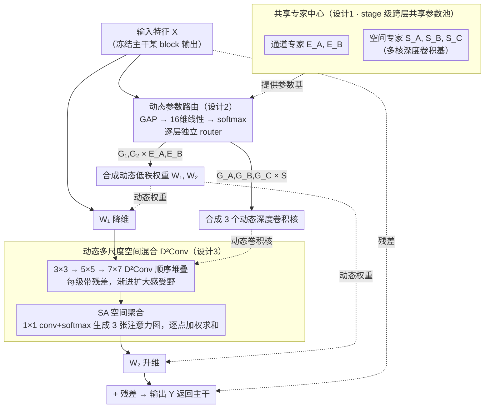

# Parameters as Experts: Adapting Vision Models with Dynamic Parameter Routing

**会议**: ICML 2026  
**arXiv**: [2602.06862](https://arxiv.org/abs/2602.06862)  
**代码**: https://github.com/LMMMEng/ParaX  
**领域**: 模型压缩 / 参数高效微调  
**关键词**: PEFT, MoE 适配器, 共享专家中心, 动态参数路由, 密集预测  

## 一句话总结
作者把"参数本身当成专家"——在每个 stage 维护一个跨层共享的可训练参数矩阵池 (shared expert center)，让每一层的 ParaX 适配器通过一个轻量路由器为当前输入**动态合成**低秩投影和多尺度深度卷积的权重，从而同时解决传统 adapter 的"输入无关"和"跨层冗余"两大缺陷，在密集预测任务上以 <5% 可训练参数稳定超越 full fine-tuning。

## 研究背景与动机

**领域现状**：在视觉模型上做 PEFT (Parameter-Efficient Fine-Tuning)，目前主要分两派——prompt 派 (VPT 等) 往输入序列里插可学习 token；adapter 派 (LoRA、AdaptFormer、Mona 等) 往每层里嵌一对低秩矩阵 $W_1\in\mathbb{R}^{C\times\hat C}, W_2\in\mathbb{R}^{\hat C\times C}$。adapter 派目前在密集预测任务 (分割、检测) 上明显占优，Mona 进一步在 adapter 里塞多核深度卷积来强化空间建模。

**现有痛点**：作者实证地揪出现有 adapter 的两个"硬伤"。

- **表征不足 (Representation Deficiency)**：adapter 一旦训完，权重就**对输入无关**。在 COCO 上用 ERF (effective receptive field) 可视化 Mona、AdaptFormer 等微调后的 Swin-L，会看到 ERF 明显比 full fine-tuning 小一圈——意味着低秩、输入无关的变换没法为不同图像内容定制最优的空间响应。
- **特征冗余 (Feature Redundancy)**：每层 adapter 参数互相隔离，CKA 分析显示不同层学到的模式极其相似，说明跨层之间没有显式信息交互，相同的事情被反复学。

**核心矛盾**：在严格的参数预算下 (LoRA-style，几 M 可训练参数)，**静态、孤立**的低秩 adapter 既不能根据输入定制，也没有跨层信息流，于是只能学到"普适但平庸"的变换。要修这两个洞，既不能简单加大 $\hat C$ (参数预算爆掉)，也不能让 adapter 之间共享同一组权重 (会强制各层做相同变换、表达力进一步坍塌)。

**本文目标**：(1) 让 adapter 的权重随输入动态变化，恢复 ERF；(2) 让多层 adapter 之间存在隐式信息流，降低 CKA 冗余；(3) 二者必须在不显著增加可训练参数预算的前提下完成。

**切入角度**：把 MoE 中"用 router 选不同 expert"这件事**搬到参数层面**——expert 不是子网络，而是同尺寸的**可训练参数矩阵**；不同层共享同一组 expert，但各层有自己的 router，给出不同的混合系数。这样既得到了"输入相关" (router 看输入)，也得到了"跨层耦合" (共享 expert 必须服务多层，迫使其学到通用且多样的基)。

**核心 idea**：在每个 stage 放一个**共享专家中心** (一堆同尺寸的可训练参数矩阵)，让每层的 ParaX 模块用一个超轻量 router 把它们**线性混合**成当前层、当前输入专属的低秩投影 + 多尺度深度卷积核——参数即专家，路由即合成。

## 方法详解

### 整体框架
ParaX 想在不撑破 PEFT 参数预算的前提下，让 adapter 的权重既随输入动态变化、又在层间共享信息。它以四 stage 的层级 backbone (Swin / ConvNeXt) 为例：每个 stage 配一个共享专家中心，每个 building block 里挂一个 ParaX 适配器 (Swin block 在 token mixer 和 channel mixer 后各挂一个，ConvNeXt block 在整个残差模块后挂一个)。前向时每个适配器独立地用一个超轻量 router 读取当前输入特征、输出动态系数，把专家中心里的参数矩阵线性合成出本模块专用的 $W_1, W_2$ 和三尺度深度卷积核，再用这组动态权重对输入做"降维 → 多尺度空间混合 → 升维"的低秩变换并加残差返回主干。除了专家中心、router 和任务头之外不引入任何额外可训练参数，主干全程冻结。

下图给出单个 ParaX 适配器的前向流程：实线是特征数据流（主干特征经降维 → 多尺度空间混合 → 升维 → 残差），虚线是 router 用专家中心的参数基合成的动态权重，三个虚框分别对应下面的三个关键设计。

### 关键设计

**1. 共享专家中心：把参数共享放在专家池层面，同时修跨层冗余和表达力坍塌**

针对的痛点是 adapter 两难——各层参数互相隔离会导致 CKA 冗余 (相同模式被反复学)，但若让各层直接共享同一组 adapter 权重又会强迫所有层做相同变换、表达力坍塌。ParaX 的解法是在 stage 粒度上维护一池可训练参数矩阵作为动态合成的"基"：通道方向的低秩投影专家成对存放 $\mathbf{E}_A\in\mathbb{R}^{M\times C\times\hat C},\ \mathbf{E}_B\in\mathbb{R}^{M\times\hat C\times C}$，其中专家容量 $M$ 和 adapter 隐维度 $\hat C$ 是控制参数总量的两个核心超参；空间方向再加三组对应不同卷积核大小的深度卷积专家 $\mathbf{S}_A, \mathbf{S}_B, \mathbf{S}_C\in\mathbb{R}^{M\times\hat C\times K_i^2}$。所有 ParaX 模块都从同一个 stage 级 expert center 拉权重，但每层有自己的 router。共享发生在专家池而非 adapter 这一层，于是既得到了跨层耦合 (共享 expert 被多层调用、被迫学得通用且多样，CKA 冗余下降)，又保留了各层独立 router 带来的表达多样性——两个看似冲突的诉求被这一设计自然兼容。

**2. 动态参数路由：用线性混合代替 MoE 的稀疏选专家，恢复输入相关性又稳得住训练**

这一步直接对治"表征不足"——传统 adapter 训完权重就对输入无关，ERF 比 full fine-tuning 小一圈。ParaX 让权重随输入合成：输入 $\mathbf{X}\in\mathbb{R}^{HW\times C}$ 先 GAP 得到通道描述子，过一个把维度砍到 16 的线性层得到隐藏向量，再用两个并行线性层加 softmax 得到门控向量 $\mathbf{G}_1, \mathbf{G}_2\in\mathbb{R}^M$；动态权重由张量收缩合成 $\mathbf{W}_1=\sum_{m=1}^M \mathbf{G}_1[m]\,\mathbf{E}_A[m]\in\mathbb{R}^{C\times\hat C}$、$\mathbf{W}_2=\sum_{m=1}^M \mathbf{G}_2[m]\,\mathbf{E}_B[m]\in\mathbb{R}^{\hat C\times C}$，然后做标准 LoRA-style 残差更新 $\mathbf{Y}=\mathbf{X}+\sigma(\mathbf{X}\mathbf{W}_1)\mathbf{W}_2$ (中间夹空间混合)。把 MoE 经典的"top-k 选 expert"换成"全 expert 线性混合"，既保留了看输入决定权重的动态性，又避开了稀疏路由的训练不稳定，复杂度退化成 $O(M)$ 的矩阵加权和；router 隐维度故意压到 16，让它自身的参数和计算几乎可忽略，PEFT 的极小参数约束才依然成立。

**3. 动态多尺度空间混合 (D²Conv)：把卷积核也纳入"看输入再合成"，给密集预测加 buff**

Mona 等已证明多核 depthwise conv 对密集预测至关重要，但它们的卷积核静态、所有样本共享。ParaX 把动态性从通道扩展到空间：router 再多输出三个门控 $\mathbf{G}_A, \mathbf{G}_B, \mathbf{G}_C\in\mathbb{R}^M$，分别与 $\mathbf{S}_A, \mathbf{S}_B, \mathbf{S}_C$ 合成出三个动态深度卷积核 (kernel size 渐增，论文典型取 $3\times3, 5\times5, 7\times7$)。空间混合用顺序堆叠加残差的结构——输入依次过三个 D²Conv、每个都有残差 shortcut，逐步扩大感受野；最后接一个 Spatially-varying Aggregation (SA) 模块，用一个 $1\times1$ conv 加 softmax 生成三张空间注意力图，与三尺度特征逐点相乘后求和。这里用的是 depthwise 动态卷积，区别于 KernelWarehouse 等基于 standard conv 的动态卷积，也是 PEFT 预算的硬性要求。卷积核参与动态合成配合扩大的 ERF 直接对 dense prediction 见效，SA 则在空间维度做最后一层动态加权，参数代价可忽略却能进一步细化每个像素位置该选哪个尺度。

### 损失函数 / 训练策略
ParaX 是纯 PEFT 设置：主干冻结，只训练 expert center、router 和任务头 (分割/检测/分类各自的标准 head)。所有任务沿用各自标准训练配方 (UperNet/ADE20K 160K iter；Mask R-CNN/COCO；MAE-pretrained ViT-B/16 on classification)，未引入新损失。专家容量 $M$ 和隐维度 $\hat C$ 控制可训练参数预算，多核组合 $\{K_1, K_2, K_3\}$ 在 Section 4.5 中消融。

## 实验关键数据

### 主实验

ADE20K 语义分割 (mIoU) 与 COCO2017 检测/实例分割 (AP$^b$/AP$^m$) 对比 (摘自 Table 1、Table 2)：

| Backbone | 方法 | 可训练参数 (M) | ADE20K mIoU | COCO AP$^b$ | COCO AP$^m$ |
|---|---|---|---|---|---|
| Swin-B | Full fine-tuning | 86.8 | 50.2 | 47.5 | 42.8 |
| Swin-B | LoRA | 5.4 | 49.4 | 40.1 | 38.5 |
| Swin-B | Mona | 5.2 | 49.8 | 46.6 | 42.4 |
| Swin-B | **ParaX** | **5.2** | **50.3** | **47.3** | **42.7** |
| Swin-L | Full fine-tuning | 195.0 | 51.2 | 48.6 | 43.8 |
| Swin-L | Mona | 7.5 | 51.6 | 48.1 | 43.9 |
| Swin-L | **ParaX** | **7.3** | **52.0** | **48.6** | **44.0** |
| ConvNeXt-B | Full fine-tuning | 87.6 | 51.4 | 47.8 | 43.0 |
| ConvNeXt-B | Mona | 6.5 | 50.7 | 47.5 | 43.2 |
| ConvNeXt-B | **ParaX** | **6.5** | **51.1** | **48.0** | **43.5** |
| ConvNeXt-L | Full fine-tuning | 196.2 | 52.4 | 48.1 | 43.2 |
| ConvNeXt-L | Mona | 9.1 | 51.5 | 48.9 | 44.4 |
| ConvNeXt-L | **ParaX** | **9.2** | **52.0** | **49.5** | **44.8** |

亮点：在 4 个 backbone × 2 个任务的 8 个 setting 里 ParaX 全部刷出最优，且对 Swin-L (分割) / ConvNeXt-L (检测) 这种大模型，用 <5% 可训练参数反超 full fine-tuning 0.8% mIoU 和 1.4% AP$^b$；面板 (c) 的 ERF / CKA 可视化也实证 ParaX 的 ERF 与 full fine-tuning 接近、CKA 跨层冗余显著降低。

### 消融：跨任务可迁移性 (panoptic segmentation, COCO2017)

| Backbone | 方法 | 参数 (M) | PQ | SQ | RQ |
|---|---|---|---|---|---|
| Swin-B | Full-tuning | 86.8 | 50.3 | 81.3 | 60.6 |
| Swin-B | AdaptFormer | 5.4 | 47.1 | 79.4 | 57.4 |
| Swin-B | Mona | 5.2 | 48.1 | 79.9 | 58.3 |
| Swin-B | **ParaX** | **5.2** | **48.8** | **80.8** | **59.0** |
| Swin-L | Full-tuning | 195.0 | 51.4 | 81.5 | 61.9 |
| Swin-L | Mona | 7.5 | 49.7 | 80.7 | 60.2 |
| Swin-L | **ParaX** | **7.3** | **50.2** | **81.3** | **60.5** |

Panoptic 是分割 + 检测的合体、对表征要求最高，也是先前 PEFT 工作最薄弱的环节。ParaX 在 Swin-B 上比 AdaptFormer 高 1.7 PQ、比 Mona 高 0.7 PQ，并把与 full fine-tuning 的差距压到 1.2–1.5 PQ。这是相对其他 baseline 最具区分度的任务，验证"动态 + 跨层共享"带来的表达力对统一密集任务的价值。

### 关键发现
- **ERF 与 CKA 对齐预测的故障模式**：作者在 Figure 1(c) 用 ERF/CKA 把"表征不足"和"特征冗余"诊断出来，然后用 ParaX 让两个指标都向 full fine-tuning 靠拢，事后用主指标证明这一靠拢确实带来精度。这种"先用诊断指标找病灶，再用方法对症"的实证回路在 PEFT 论文里少见，可复用。
- **专家中心规模 vs 任务难度**：在论文消融 (Section 4.5) 中，$M$ 和 $\hat C$ 的最优配比随任务粒度变化；密集预测受益于稍大的 $M$，分类对 $\hat C$ 更敏感。提示动态参数路由的"专家池"应按任务粒度配置而非一刀切。
- **多核 D²Conv 顺序堆叠 > 并行**：顺序 + 残差比并行三支并接更利于 ERF 平滑扩张，这与 SegMan、SegFormer 等关于"渐进感受野"工作一致。

## 亮点与洞察
- **"参数即专家"的视角换得很漂亮**：经典 MoE 用 router 选子网络，代价是路由稀疏 + 大 expert；本文把 expert 缩成同尺寸参数矩阵、router 用线性混合，复杂度退化到 $O(M)$ 矩阵加权和，于是在 PEFT 的"几 M 参数"预算里也能跑得动 MoE 思想。
- **共享专家中心同时解决了两个对立的诉求**：跨层共享 = 信息流 (降 CKA)；layer-specific router = 表达多样性 (升 ERF)。两个看似冲突的目标被共享池的设计自然兼容。
- **动态卷积核合成的可迁移性**：D²Conv 的"系数 × 基"思路本质上与 KernelWarehouse、CondConv 同源，但把它放进 PEFT + depthwise + 残差堆叠的组合里是首次。这套"router + parameter basis"的合成原语，可直接迁移到 LoRA、AdaLoRA 等其他 adapter 形式上。
- **PEFT 超过 full fine-tuning 的另一个例证**：当主干预训练充分时，可训练参数太多反而过拟合下游分布；ParaX 在 ConvNeXt-L 上反超 full fine-tuning 1.4% AP$^b$ 再次印证这一现象，PEFT 不只是为了省钱。

## 局限与展望
- **推理时计算开销未必小**：动态合成 $\mathbf{W}_1, \mathbf{W}_2$ 和三个 D²Conv 核需要每个 token (或每张图) 跑一次 router + 张量收缩；虽然作者称效率 OK，但与 LoRA "训完合并到主干、推理零开销"相比是劣势，部署到延迟敏感场景要小心。
- **专家中心规模选择缺自动化**：$M$ 和 $\hat C$ 需要按任务搜，论文给出经验值但未给闭式准则；当 $M$ 太大时专家间会塌缩 (类似 MoE 的 expert collapse)，作者未深入讨论这一风险。
- **路由器极简但可能受限**：16 维 hidden + softmax 的 router 设计是为了省参数，但密集预测可能更需要 token-级别 (而非图像级别) 的路由；token-级路由如何与 depthwise conv 联动是待解问题。
- **未在 LLM/VLM 上验证**：方法本身对架构中立，但论文实验局限在视觉骨干 + dense prediction，迁移到 LLM SFT、VLM 微调上的表现尚未给出。

## 相关工作与启发
- **vs LoRA (Hu et al. 2022)**：LoRA 用静态低秩 $W_1 W_2$ 更新，ParaX 是其动态化 + 跨层共享版；当 $M=1$ 且 router 输出常量 1 时退化为 LoRA。
- **vs AdaptFormer / Mona**：AdaptFormer 是 ParaX 的"静态、无空间核"特例；Mona 加了静态多核 depthwise conv，ParaX 把这些核也动态化并放进共享专家池，因此能同时修 ERF 和 CKA。
- **vs MoELoRA / HydraLoRA / MoLA**：这些方法在 LoRA 内部引入 MoE，但 expert 仍是子模块且需要稀疏路由；ParaX 把 expert 缩成参数矩阵、用 dense 混合，路由训练更稳。
- **vs KernelWarehouse / OmniNet (动态卷积)**：核思想 (系数 × 基) 同源，但 ParaX 用 depthwise 卷积适配 PEFT 预算，并把"参数池"扩展到完整 adapter (含通道投影 + 空间核)，而非只动态化卷积本身。

## 评分
- 新颖性: ⭐⭐⭐⭐ 把 MoE 思想下沉到"参数即专家"的粒度，是 adapter 家族里少见的清爽新视角。
- 实验充分度: ⭐⭐⭐⭐ 覆盖语义分割/检测/实例/全景/分类、两类 backbone 各两个规模，主指标 + ERF/CKA 诊断都有，但未跨到 LLM/VLM。
- 写作质量: ⭐⭐⭐⭐ Figure 1 (c) 的"病灶诊断"叙事很有说服力；公式与图配合清楚。
- 价值: ⭐⭐⭐⭐ 在 PEFT 上稳定反超 full fine-tuning，且"动态合成 adapter 权重"是可向 LLM/VLM 迁移的通用 primitive。

<!-- RELATED:START -->

## 相关论文

- [\[ICLR 2026\] LD-MoLE: Learnable Dynamic Routing for Mixture of LoRA Experts](../../ICLR2026/model_compression/ld-mole_learnable_dynamic_routing_for_mixture_of_lora_experts.md)
- [\[ICML 2026\] PRISM: Synergizing Vision Foundation Models via Self-Organized Expert Specialization](prism_synergizing_vision_foundation_models_via_self-organized_expert_specializat.md)
- [\[ICML 2026\] Continual Model Routing in Evolving Model Hubs](continual_model_routing_in_evolving_model_hubs.md)
- [\[CVPR 2026\] Quant Experts: Token-aware Adaptive Error Reconstruction with Mixture of Experts for Large Vision-Language Models Quantization](../../CVPR2026/model_compression/quant_experts_token_aware_vlm_quantization.md)
- [\[ICML 2026\] FRISM: Fine-Grained Reasoning Injection via Subspace-Level Model Merging for Vision–Language Models](frism_fine-grained_reasoning_injection_via_subspace-level_model_merging_for_visi.md)

<!-- RELATED:END -->
