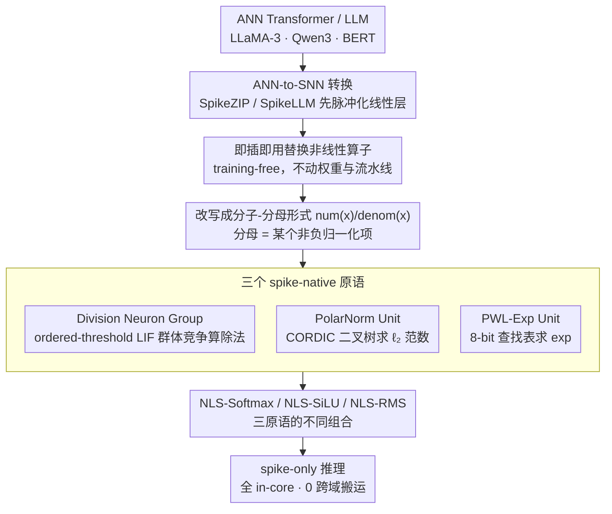

# Plug-and-Play Spiking Operators: Breaking the Nonlinearity Bottleneck in Spiking Transformers

**会议**: ICML 2026  
**arXiv**: [2605.20289](https://arxiv.org/abs/2605.20289)  
**代码**: 暂未公开  
**领域**: 模型压缩 / 脉冲神经网络 / ANN-to-SNN / 神经形态硬件  
**关键词**: 脉冲神经网络、Transformer 非线性算子、ANN-to-SNN 转换、LIF 神经元、训练-free

## 一句话总结
作者把 Transformer 里最难脉冲化的三个非线性算子（Softmax、SiLU、RMSNorm）拆成"除法 / 指数 / $\ell_2$ 范数"三个公共原语，分别用 LIF 神经元群体计算 + 位移缩放实现成 spike-friendly 模块，再像积木一样拼回原算子，全程不需要任何微调就能即插即用到现有 ANN-to-SNN 流水线里，对 LLaMA-3-8B / Qwen3-8B / BERT 等模型的精度损失 <1%。

## 研究背景与动机

**领域现状**：把大模型部署到神经形态硬件（Loihi、TrueNorth）上做事件驱动推理是一个明确的能效优化路线，近年 ANN-to-SNN 转换（不重新训练，直接把激活映射到脉冲发放率）已经被推广到 Transformer 和 LLM，代表工作有 SpikeZIP-TF、SpikeLLM 等。

**现有痛点**：现有 ANN-to-SNN 工作绝大多数只处理 Transformer 里的线性算子（矩阵乘、FFN 投影），对 Softmax、SiLU、RMSNorm 这类非线性算子要么直接绕开、要么放到外部 CPU 上算。问题在于神经形态芯片的核心数据通路只支持脉冲、位移、加法等轻量操作，并不擅长浮点除法 / 指数 / 平方根；把非线性算子搬到外部处理器会引入大量跨域数据搬运开销，反而抵消脉冲计算的能效优势。

**核心矛盾**：要做到"严格 spike-only"部署，必须把这些非线性算子也脉冲化；但标准 LIF 动力学 $v(t) = \lambda v(t-1) + I(t)$、$s(t) = \mathbb{I}[v(t) \geq \theta]$ 天然只能做"累积-阈值-重置"的近似线性映射，硬塞除法或者 $\sqrt{\cdot}$ 进去要么需要训练，要么破坏与现有转换流水线的兼容性。

**本文目标**：设计一套**训练-free**、**模块化**、**只用 LIF 原语**的非线性算子实现，可以直接插入 SpikeZIP / SpikeLLM 等现有 ANN-to-SNN 流水线，不动权重也不动 pipeline。

**切入角度**：作者注意到 Softmax / SiLU / RMSNorm 在代数结构上其实是同一类东西——分子是某个输入相关项，分母是某个非负归一化项；如果能把"分子-分母-除法"拆成独立模块，每个模块只用 LIF 和位移就能实现，那么不同非线性算子就只是这套原语的不同组合。

**核心 idea**：把非线性算子分解成"除法 + 指数 + $\ell_2$ 范数"三个 spike-native 原语，再用模块化的方式重新组合出 Softmax / SiLU / RMSNorm。

## 方法详解

### 整体框架
NLSpiking 是一个三层结构：最底层是三个 spike-native 原语（除法、$\ell_2$ 范数、指数），中间层把每个目标非线性算子改写成 $\phi(x) = \text{num}(x)/\text{denom}(x)$ 的"分子-分母"形式、分别用原语近似，最上层的 NLSpiking 算子（NLS-Softmax / NLS-SiLU / NLS-RMS）只是这套原语在分子分母构造上的不同组合。关键在于它和原 ANN-to-SNN 转换框架完全解耦——可以在 SpikeZIP-TF 把线性层转换完之后，再单独把非线性算子换成 NLSpiking 版本，权重和流水线都不用动。

### 关键设计

**1. Division Neuron Group：把"除法"翻译成神经元群体竞争**

非线性算子脉冲化的最大拦路虎是除法——神经形态芯片只擅长脉冲、位移、加法，不擅长浮点除法。作者的做法是用一群 ordered-threshold 的 LIF 神经元实现整数近似 $q \approx I_A/I_B$，分两阶段执行。第一阶段对脉冲分母时间累积得到 $I_B = \sum_{t=1}^T I_B(t)$，再右移得到基准阈值 $\theta = I_B \gg n = \lfloor I_B/2^n \rfloor$（$n = \log_2(TL)$），并把群体里第 $i$ 个神经元的阈值设成 $\theta_i = i\theta$，相当于把分母的"幅度"编码成一道道阈值梯度。第二阶段把脉冲分子 $I_A(t)$ 喂进这个群体，神经元 $i$ 当且仅当 $I_A(t) \geq i\theta$ 时发放，统计活跃神经元数 $q = \sum_i s_i$ 再右移就得到商 $\hat q = q \gg n = \lfloor \sum_t I_A(t)/\theta \rfloor$。这样一来，除法就被转化成"找最大的 $i$ 使 $v(t) \geq i\theta$"这个查表式的群体竞争问题，而群体竞争恰恰是硬件天然支持的，整个过程只有阈值比较和位移、没有任何除法器。

**2. PolarNorm Unit：借 CORDIC 把 $\ell_2$ 范数化成移位加减**

RMSNorm 需要 $\|\mathbf v\|_2 = \sqrt{\sum_i x_i^2 + \epsilon d}$，但平方和开方在脉冲域里几乎不可能直接展开。作者借用 70 年代硬件浮点里成熟的 CORDIC 迭代来绕过：先把输入扩展成 $\mathbf v = [x_1, \dots, x_d, \sqrt{\epsilon d}]$，按二叉树两两合并相邻元素，每次合并跑 CORDIC-Hypot 迭代 $x_{k+1} = x_k + d_k \cdot y_k/2^k$、$y_{k+1} = y_k - d_k \cdot x_k/2^k$（$d_k = \text{sign}(y_k)$），$n$ 步后 $x_n \approx \sqrt{x^2 + y^2}$，最后用一个恰好是 $2$ 的整数次幂的固定增益倒数 $1/K_n$ 做缩放，整棵树跑完就拿到范数近似。CORDIC 的妙处是用迭代旋转把平方和开方统一成"位移 + 加减 + 符号判断"，正好落在神经形态指令集里；二叉树结构则顺带给出 $\mathcal O(\log d)$ 的并行深度和可证明的误差界。

**3. PWL-Exp Unit：用 8-bit 查找表替掉运行时指数**

Softmax 和 SiLU 都绕不开 $\exp$，但脉冲域同样做不了指数。作者把 $[-L, L]$ 等分成 $K$ 段（段宽 $\gamma = 2L/K$），每段用线性插值 $e^x \approx ax + b = \frac{e^{x_{i+1}} - e^{x_i}}{x_{i+1} - x_i}(x - x_i) + e^{x_i}$（$x_i = -L + \gamma i$），把斜率 $a$ 和截距 $b$ 预计算后塞进一张 8-bit 查找表，运行时只做一次查表加一次定点乘加。这等于把"运行时指数"换成了"预计算系数 + 位移缩放"，既有解析误差界保底（Theorem 5.1 给出 $\varepsilon_{\exp} = \frac{L^2}{2K^2} e^{2L/K}$），又把内存压到几十字节量级，刚好放得进 Loihi 这类芯片紧张的片上 SRAM。

### 损失函数 / 训练策略
方法是 **training-free** 的——不引入任何 loss、不做微调。所有近似的误差都在 ANN-to-SNN 转换之后通过算子级替换暴露出来。理论上作者给出每个非线性算子的相对误差界：

- Softmax：$|\tilde\phi_i - \phi_i| / \phi_i \leq \frac{2}{1 - \varepsilon_{\exp}}(\varepsilon_{\exp} + \Delta)$
- SiLU：$|\tilde\phi(x) - \phi(x)| \leq |x| \cdot \frac{2\varepsilon_{\exp}}{1 - \varepsilon_{\exp}} + |x|\Delta$
- RMSNorm：$|\tilde\phi_i - \phi_i| / \phi_i \leq \frac{\varepsilon_{\text{pol}} + \Delta}{1 - \varepsilon_{\text{pol}}} + \sqrt{d}\Delta$

其中 $\Delta = 1/n$ 是 $(T, L)$-Division 的量化步长，$\varepsilon_{\text{pol}} = \lceil \log_2 d\rceil \cdot 2^{-2n-1}$ 是 PolarNorm 的 CORDIC 树误差。推荐 $H = 5, K = 64$，此时 $\varepsilon_{\exp} \leq 3.63 \times 10^{-3}$。

## 实验关键数据

### 主实验
模型级评估覆盖两类：（1）经 SpikeLLM / SpikeZIP 转换的 SNN-LLM；（2）未被现有 ANN-to-SNN 流水线显式覆盖的标准 ANN-LLM。

| 模型 | 任务平均 | 原始算子 | NLSpike 算子 | $\Delta$ |
|------|---------|---------|-------------|---------|
| LLaMA-3-8B（5 任务平均） | Avg Acc | 0.730 | 0.727 | -0.003 |
| LLaMA-2-7B（5 任务平均） | Avg Acc | 0.686 | 0.684 | -0.002 |
| Mistral-7B（5 任务平均） | Avg Acc | 0.724 | 0.724 | +0.000 |
| Qwen3-8B（5 任务平均） | Avg Acc | 0.734 | 0.748 | **+0.014** |
| SpikeLLM T=2,W2A16 LLaMA-2-7B | Avg Acc | 0.477 | 0.477 | -0.000 |
| SpikeLLM T=2,W2A16 LLaMA-2-13B | Avg Acc | 0.516 | 0.515 | -0.001 |
| SpikeZIP BERT（4 任务平均） | Avg Acc | 0.807 | 0.810 | +0.003 |

所有模型在 WinoGrande / HellaSwag / ArcC / ArcE / PIQA 这五个常识/推理任务上的精度变动都 $< 1\%$，部分任务上 NLSpike 甚至小幅领先（Qwen3-8B 上 +1.4%）。

### 消融实验
| 配置 | 关键指标 | 说明 |
|------|---------|------|
| NLS-Softmax | 跨维度 mean error 最低，max error 受 8-bit 网格约束 | 优于 Padé / PWL / Sorbet / hardmax |
| NLS-SiLU | mean error 与 64-段 PWL-sigmoid 持平，远好于 XNOR / DoReFa-4b | 训练-free 基线中最优 |
| NLS-RMS | 跨维度稳定，blockwise RMS 在 $d$ 不对齐 block 时不稳定 | 解决 blockwise 的对齐问题 |
| $H = 3/4/5$（SiLU 区间） | mean/max 误差均极小；$H \geq 8$ 时 max error 急升 | 推荐 $H = 5$ |
| $H$ 增大（Softmax，$d = 64$） | mean/max 误差单调下降；$H \leq 4$ 误差非常大 | Softmax 要更大的截断区间 |

### 关键发现
- "非线性算子的能耗占比小所以可以忽略"在 spike-only 部署里完全不成立——它们一旦放到外部处理器，跨域数据搬运成本占主导。
- 三个原语共用一张查找表，整张 LUT 只需 $K$ 个 8-bit 和 16-bit 值，远小于传统浮点表，符合 Loihi 这类神经形态芯片的片上 SRAM 上限。
- 延迟分析（Table 3）显示 NLSpike 在每次时间步只需要 $n$ 次位移-加 / LUT 调用，跨域数据搬运为 0，而 SpikeZIP 需要 $\mathcal O(T)$ 次跨域非线性求值，SpikeLLM 虽然只算 1 次但仍依赖外部处理器；NLSpike 是三者里唯一完全 in-core 的方案。
- 误差界与实测吻合，证明模块化分解没有让误差雪球式累积，每个原语的误差被独立 bound 住。

## 亮点与洞察
- "把除法当作 spike-native 原语"是这篇工作最反直觉也最关键的设计——以前的 SNN 工作几乎不敢把除法看成基本操作，而作者通过 ordered-threshold LIF 群体把它变成了"找最大激活神经元"，把硬件不友好的运算翻译成硬件最擅长的群体竞争。
- 用 CORDIC 做 $\ell_2$ 范数是非常巧的迁移：CORDIC 在 70 年代就被用于硬件浮点计算，因为它只用移位和加减；作者把它用到 RMSNorm 上，相当于把硬件设计的经验直接挪到了 SNN 算子设计里。
- "分子-分母"统一抽象给出的是一个可扩展模板：未来要加 GeLU、LayerNorm、甚至 RoPE 里的 $\sin/\cos$，都只需要再补一个原语模块，不需要重新设计整套流水线。
- 训练-free 这个属性对工程落地至关重要，意味着 NLSpike 可以直接套在已有的预训练权重上而不破坏精度，这与"换硬件就要重训模型"的传统 SNN 工作完全不同。

## 局限与展望
- 作者明确承认目前还没在真实神经形态硬件（Loihi / TrueNorth）上做端到端 LLM 部署，受限于算子覆盖率、片上内存和精度-延迟权衡，所有结果都是软件模拟。
- 实验覆盖的非线性算子只有 Softmax / SiLU / RMSNorm，对 GeLU、Mish、Swish-Beta 等其它常用激活，以及 RoPE / ALiBi 等位置编码里隐含的三角/分式运算，还没有覆盖。
- $H$ 的选择有任务相关性：SiLU 喜欢小 $H$、Softmax 喜欢大 $H$，这意味着不同算子可能需要不同的 LUT 配置，给硬件部署带来一定碎片化。
- PWL-Exp 在 8-bit 量化下已经接近误差下限，再想压精度可能要换成更紧的非均匀分段或者多级查找表。
- 改进思路：把 NLSpike 与训练时量化（QAT）结合，在转换前就让模型主动适应 LIF 噪声；或者把"分子-分母"抽象扩展到 MoE 的 gating（也是 softmax 风格）上，让稀疏 MoE 模型也能在神经形态硬件上跑。

## 相关工作与启发
- **vs SpikeZIP-TF（You et al. 2024）**: SpikeZIP 把 Transformer 线性算子脉冲化，但非线性算子仍交给外部处理器；本文补齐了非线性这块拼图，可直接挂在 SpikeZIP 后端。
- **vs SpikeLLM（Xing et al. 2025）**: 用 saliency-driven spike allocation 做 W2A16 量化，关注的是激活的稀疏分配；本文正交于它，是把非线性算子本身重写，可与 SpikeLLM 复用。
- **vs Sorbet（Tang et al. 2025）**: Sorbet 也用 shift-based 离散运算实现非线性，但需要知识蒸馏和微调与原 BERT 对齐；本文完全 training-free，更适合大规模 LLM 场景。
- **vs FAS / LAS（Chen et al. 2025）**: 这两条线关注 ANN-to-SNN 的速度和无损转换，但仍把非线性放在外部；NLSpike 给出了"真正 end-to-end spike-only"所缺的那块拼图。
- **vs XNOR-Net / DoReFa-Net**: 极低比特量化的代表，但在 SiLU / Softmax 上误差很大；本文表明模块化的"位移-加 + LUT"组合可以在等同硬件成本下大幅压低误差。

<!-- RELATED:START -->

## 相关论文

- [\[NeurIPS 2025\] Spiking Brain Compression: Post-Training Second-Order Compression for Spiking Neural Networks](../../NeurIPS2025/model_compression/spiking_brain_compression_post-training_second-order_compression_for_spiking_neu.md)
- [\[AAAI 2026\] A Closer Look at Knowledge Distillation in Spiking Neural Network Training](../../AAAI2026/model_compression/a_closer_look_at_knowledge_distillation_in_spiking_neural_ne.md)
- [\[CVPR 2025\] Plug-and-Play Versatile Compressed Video Enhancement](../../CVPR2025/model_compression/plug-and-play_versatile_compressed_video_enhancement.md)
- [\[CVPR 2026\] ReFTA: Breaking the Weight Reconstruction Bottleneck in Tensorized Parameter-Efficient Fine-Tuning](../../CVPR2026/model_compression/refta_breaking_the_weight_reconstruction_bottleneck_in_tensorized_parameter-effi.md)
- [\[NeurIPS 2025\] S2M-Former: Spiking Symmetric Mixing Branchformer for Brain Auditory Attention Detection](../../NeurIPS2025/model_compression/s2m-former_spiking_symmetric_mixing_branchformer_for_brain_auditory_attention_de.md)

<!-- RELATED:END -->
