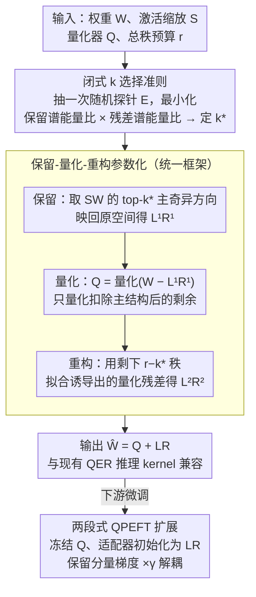

# Preserve-Then-Quantize: Balancing Rank Budgets for Quantization Error Reconstruction in LLMs

**会议**: ICML 2026  
**arXiv**: [2602.02001](https://arxiv.org/abs/2602.02001)  
**代码**: https://ai-isl.github.io/srr (项目页)  
**领域**: 模型压缩 / LLM 低比特量化  
**关键词**: PTQ、量化误差重构、低秩补偿、QPEFT、秩预算分配

## 一句话总结
作者提出 SRR（Structured Residual Reconstruction），把 QER（Quantization Error Reconstruction）中固定用于补偿量化残差的低秩预算 $r$ 显式地拆成"先保留 $k$ 个主奇异方向再量化"和"用 $r-k$ 个秩去拟合残差"两部分，并给出一个只需一次随机探针的闭式准则来逐层选 $k^\star$，在 2/3 bit PTQ 和 QPEFT 上一致优于 LQER/QERA。

## 研究背景与动机

**领域现状**：LLM 低比特 PTQ 把权重压到 3/2-bit 时精度掉得很厉害，主流补救方式是 QER：把权重近似成 $\mathbf{W}\approx \mathbf{Q}+\mathbf{L}\mathbf{R}$，其中 $\mathbf{Q}=\mathcal{Q}(\mathbf{W})$ 是直接量化的结果、$\mathbf{L}\mathbf{R}$ 是一个秩 $\le r$ 的修正项，用来还原量化误差。ZeroQuant-V2、LQER、QERA 等就是这条路上的代表，再配合一个由校准激活算出来的对角缩放矩阵 $\mathbf{S}$，在缩放空间 $\mathbf{S}\mathbf{W}$ 中做截断 SVD。

**现有痛点**：所有现有方法都把整个秩预算 $r$ 砸在拟合残差 $\mathbf{S}(\mathbf{W}-\mathbf{Q})$ 上。但在低比特区，量化误差通常是稠密、高秩的，而真正"低秩"的反而是 $\mathbf{S}\mathbf{W}$ 本身——transformer 权重在激活缩放空间里高度各向异性，能量集中在少数主奇异方向上。结果是：量化最先破坏那几个高能量方向，留下又脏又高秩的残差让有限的秩去擦，越擦越亏。

**核心矛盾**：秩预算的"用途"被默认死锁成"补残差"了，但实际上一份秩预算可以有两种更划算的用法——要么在量化之前保住主子空间（结构保留），要么留给量化之后修残差（误差重构）。哪种更划算取决于具体层的谱形状。

**本文目标**：在固定秩预算 $r$ 的前提下，回答两个子问题——(i) 是否存在一种"先保留 $k$ 维主结构、再量化、再用 $r-k$ 维修残差"的统一框架；(ii) 怎样不靠暴力枚举就能逐层、逐矩阵地选出最优的 $k$？

**切入角度**：作者把 $\mathbf{S}\mathbf{W}$ 的奇异谱形状当作一个"先验信号"——谱衰减越快、能量越集中，越值得把秩花在保留上；衰减越平，越值得把秩留给残差。再加上一个"量化噪声近似各向同性"的假设，可以把 $k$ 的选择写成 $\rho_k(\mathbf{S}\mathbf{W})\cdot\rho_{r-k}(\mathbf{S}\mathbf{E})$ 的最小化问题，其中 $\rho_p(\mathbf{A})$ 是 $\mathbf{A}$ 在 rank-$p$ 截断后剩下的能量比，$\mathbf{E}$ 只需一个 $\mathcal{U}[-1,1]$ 随机矩阵代理。

**核心 idea**：把 QER 重写成"保留-量化-重构"三步走 ($\mathbf{W}\approx \mathbf{L}^{(1)}\mathbf{R}^{(1)} + \mathbf{Q} + \mathbf{L}^{(2)}\mathbf{R}^{(2)}$)，并用一个一次性随机探针就能求出最佳秩劈分 $k^\star$。

## 方法详解

### 整体框架
SRR 是 plug-and-play 的、无需微调的 PTQ 后处理。对每一个线性层权重 $\mathbf{W}\in\mathbb{R}^{m\times n}$ 和它的激活缩放矩阵 $\mathbf{S}$，给定量化器 $\mathcal{Q}$、总秩预算 $r$，SRR 走 4 步：(1) 抽一个随机矩阵 $\mathbf{E}_{ij}\sim\mathcal{U}[-1,1]$，按 $k^\star=\arg\min_k \rho_k(\mathbf{S}\mathbf{W})\rho_{r-k}(\mathbf{S}\mathbf{E})$ 选秩劈分；(2) 取 $\mathbf{S}\mathbf{W}$ 的 top-$k^\star$ 奇异分量并映回原空间，得到 $\mathbf{L}^{(1)}\mathbf{R}^{(1)}=\mathbf{S}^{-1}\mathrm{SVD}_{k^\star}(\mathbf{S}\mathbf{W})$；(3) 只对剩余分量做量化 $\mathbf{Q}=\mathcal{Q}(\mathbf{W}-\mathbf{L}^{(1)}\mathbf{R}^{(1)})$；(4) 用剩下的 $r-k^\star$ 秩在缩放空间里拟合诱导出来的量化误差 $\mathbf{E}_k=\mathbf{W}-\mathbf{L}^{(1)}\mathbf{R}^{(1)}-\mathbf{Q}$，得到 $\mathbf{L}^{(2)}\mathbf{R}^{(2)}=\mathbf{S}^{-1}\mathrm{SVD}_{r-k^\star}(\mathbf{S}\mathbf{E}_k)$。最终把两个低秩块拼成 $\mathbf{L},\mathbf{R}$，推理时形式仍是 $\widehat{\mathbf{W}}=\mathbf{Q}+\mathbf{L}\mathbf{R}$，与现有 QER 推理 kernel 完全兼容。

### 关键设计

**1. 可微的"保留-量化-重构"参数化：把秩预算的隐含用途搬上台面**

传统 QER 默认把整份秩预算 $r$ 砸在残差上，等于偷偷替你做了"秩全用来补残差"这个决定。SRR 把这个决定显式化成一个可调劈分点 $k\in\{0,\dots,r\}$：先用 $k$ 个秩保留主结构、量化、再用 $r-k$ 个秩修残差。$k=0$ 就退回传统 QER（ZeroQuant-V2/LQER/QERA），$k=r$ 退回 LQ-LoRA/SVDQuant 那种"先保结构后量化"的方案，而中间值落在一个之前文献没人研究的区域。形式上这就是在缩放空间里最小化重构误差 $\min_{0\le k\le r}\|\mathbf{S}(\mathbf{W}-(\Delta_1+\mathcal{Q}(\mathbf{W}-\Delta_1)+\Delta_2))\|_F$，其中 $\Delta_1$ 是 rank-$k$ 的保留项、$\Delta_2$ 是 rank-$(r-k)$ 的残差修正。妙处在于由 Eckart-Young 定理，给定 $k$ 时最佳的 $\Delta_1,\Delta_2$ 都退化成对应矩阵的截断 SVD，于是整个优化只剩 $k$ 这一个标量自由度。之所以非要这么拆，是因为作者发现同一层里不同投影矩阵（Query/Output/MLP up/down）达到最小重构误差的 $k$ 差异巨大（如 LLaMA-2 7B layer 10 的 Q 投影最佳 $k$ 与 Output 投影相去甚远）——秩分配必须细到 layer/matrix 级别，一刀切注定吃亏。

**2. 基于"量化噪声近似常数比"的闭式 $k$ 选择准则：一次随机探针定最优劈分**

把 $k$ 显式化之后，新难题是怎么逐层逐矩阵选 $k^\star$ 又不暴力枚举——对每个候选 $k$ 都跑一次量化加一次 $\mathbf{S}\mathbf{E}_k$ 的 SVD 要 $O(r)$ 次昂贵计算。作者从展开 $\mathcal{L}(k)^2=\|\mathbf{S}\mathbf{E}_k\|_F^2\cdot\rho_{r-k}(\mathbf{S}\mathbf{E}_k)$ 入手（$\rho_p(\mathbf{A})$ 定义为 $\mathbf{A}$ 在 rank-$p$ 截断后剩下的能量比），靠两个假设把它简化掉：假设 1 设量化误差能量比近似常数 $\eta_\mathcal{Q}$，于是 $\|\mathbf{S}\mathbf{E}_k\|_F^2\approx \eta_\mathcal{Q}^2\rho_k(\mathbf{S}\mathbf{W})\|\mathbf{S}\mathbf{W}\|_F^2$；假设 2 设量化残差的归一化谱近似不依赖 $k$，于是可以拿一个 $\mathbf{E}\sim\mathcal{U}[-1,1]$ 的随机矩阵代替真实的 $\mathbf{E}_k$。两步合起来得到闭式准则 $k^\star=\arg\min_k \rho_k(\mathbf{S}\mathbf{W})\rho_{r-k}(\mathbf{S}\mathbf{E})$，只需算一次 $\mathbf{S}\mathbf{W}$ 的奇异谱再抽一个随机 $\mathbf{E}$ 算它的谱。这套代理之所以能信，是因为它选出的 $k$ 与真实重构误差曲线高度一致（论文 Figure 2），且不同随机探针之间选出的 $k^\star$ 通常只波动 $\pm 1$——transformer 层维度够大，随机矩阵奇异谱高度集中，one-shot 就够稳。配合 randomized SVD，相对原 QER 只多出 $1.06\times$ 计算（LLaMA-2 7B 上）。

**3. 两段式 QPEFT 初始化 + 梯度衰减解耦：让保留方向稳、残差方向学**

SRR 自然延伸到 Quantized PEFT：用 $\mathbf{Q}$ 当冻结主干，把可训练 LoRA-style 适配器直接初始化成 $\mathbf{L}\mathbf{R}=\mathbf{L}^{(1)}\mathbf{R}^{(1)}+\mathbf{L}^{(2)}\mathbf{R}^{(2)}$，一上来就贴近原权重。但麻烦是保留分量 $\mathbf{L}^{(1)}\mathbf{R}^{(1)}$ 的奇异值远大于残差分量 $\mathbf{L}^{(2)}\mathbf{R}^{(2)}$，同一个学习率会要么把前者过度更新、要么把后者欠学。作者的办法是给保留分量的梯度乘一个衰减系数 $\nabla_{\mathbf{L}^{(1)}\mathbf{R}^{(1)}}\mathcal{L}\leftarrow \gamma\nabla_{\mathbf{L}^{(1)}\mathbf{R}^{(1)}}\mathcal{L}$（$\gamma\in(0,1)$，常用 $0.1$ 或 $0.5$），残差分量梯度不动。背后的直觉是分工：保留方向承载原权重的主干语义、该保持稳定，残差方向才是真正的任务适配容量、该放手去学。解耦后两类方向各司其职互不干扰，QPEFT 在 2-bit 下相对基线在 GLUE 平均提升 $5.9$ pp，且对 $\gamma$ 取值很不敏感——说明主要收益来自更好的初始化、梯度衰减只是个防漂移的稳定器。

### 损失函数 / 训练策略
PTQ 阶段无需训练，全部由 SVD + 量化 + 随机探针完成。QPEFT 阶段沿用标准下游任务损失（如 GLUE 的 cross-entropy/Pearson），唯一改动是上面的梯度缩放 $\gamma$。所有 SVD 都用 randomized SVD（Halko 等人），只需 top-$r$ 奇异值。

## 实验关键数据

### 主实验
在 6 个模型（TinyLlama 1.1B、Gemma-2 2B、LLaMA-2 7B/13B、LLaMA-3.1 8B/70B）、两种秩预算（$r=32, 64$）、3 个 QER 基线（LQER、QERA-approx、QERA-exact）下系统比较。代表数据点（WikiText2 PPL ↓，3-bit MXINT 量化）：

| 模型 | 秩 | QER 基线（QERA-exact） | + SRR | 提升 |
|------|----|-----------------------|-------|------|
| TinyLlama 1.1B | $r=64$ | $19.59$ | $18.71$ | $-0.88$ |
| Gemma-2 2B | $r=64$ | $19.36$ | $18.30$ | $-1.06$ |
| LLaMA-2 7B | $r=64$ | $10.68$ | $10.59$ | $-0.09$ |
| LLaMA-3.1 8B | $r=64$ | $11.00$ | $10.78$ | $-0.22$ |
| LLaMA-3.1 70B | $r=32$ | $6.68$ | $6.63$ | $-0.05$ |

SRR 在所有 (模型, 秩, 基线) 组合上一致降低困惑度；对小模型（TinyLlama、Gemma-2）和 3-bit 区间提升最明显。零样本五任务平均准确率（$r=64$, 3-bit）：

| 模型 | BF16 | w-only | QERA-exact | + SRR |
|------|------|--------|-----------|-------|
| Gemma-2 2B | $59.26$ | $45.12$ | $52.15$ | $54.38$ |
| LLaMA-2 7B | $58.90$ | $52.50$ | $55.28$ | $56.56$ |
| LLaMA-3.1 8B | $67.34$ | $51.17$ | $59.05$ | $60.79$ |

### 消融实验

| 配置 | 关键指标 | 说明 |
|------|---------|------|
| QER（$k=0$） | baseline PPL | 全部秩补残差，主流做法 |
| LQ-LoRA-style（$k=r$） | 比 $k=0$ 略差 | 全部秩保结构、没人修残差 |
| SRR with 单次随机探针 | 与最优 $k^\star$ 差距 $\le\pm 1$ | one-shot 谱代理足够稳定 |
| QPEFT w/o 梯度衰减 $\gamma$ | 训练不稳，washed out | 主干方向被过度更新 |
| QPEFT $\gamma\in\{0.1, 0.5\}$ | 都比基线好 | 对 $\gamma$ 不敏感，验证主要收益来自更好的初始化 |

### 关键发现
- 最关键的不是"保留多少"，而是"知道某一层该保留多少"——同一模型不同投影矩阵的最佳 $k^\star$ 差异巨大，做层级自适应才是 SRR 起作用的核心。
- one-shot 随机探针之所以能用，是因为 transformer 层的维度足够大、随机矩阵的奇异谱高度集中（论文 Appendix B 显示重复抽样选出的 $k^\star$ 通常只差 $\pm 1$）。
- QPEFT 上 $5.9$ pp 的 GLUE 增益主要来自 SRR 初始化对主干结构的保真，而梯度衰减更像是一个"防漂移"的稳定器，对 $\gamma$ 值很不敏感。

## 亮点与洞察
- 把一份"看起来唯一用途"的资源（秩预算）显式参数化、然后用 spectral 比例直接闭式选解。这种"把暗藏的设计选择搬上台面"的套路非常可迁移：例如 LoRA 的秩、MoE 的专家数、KV cache 的保留比都可以借鉴同样的"谱代理 + 闭式选择"模板。
- one-shot 随机矩阵能当量化噪声谱的代理，本质是借了 Marchenko-Pastur 那一族大维随机矩阵谱集中的好处。LLM 层维度（数千）正好落在集中区，所以一个 sample 就稳。
- 推理形式 $\widehat{\mathbf{W}}=\mathbf{Q}+\mathbf{L}\mathbf{R}$ 与现有 QER kernel 完全兼容，工程落地几乎零成本——任何已经在用 LQER/QERA 的部署只要换初始化脚本。

## 局限与展望
- 假设 1（量化误差能量比近似常数）和假设 2（残差谱不依赖 $k$）在 1-bit 极端区段可能站不住，论文最低评估到 2-bit；更激进的 binarization 下 SRR 的闭式准则可能需要重新推。
- 缩放矩阵 $\mathbf{S}$ 仍依赖校准数据，且 SRR 的最优 $k^\star$ 会随 $\mathbf{S}$ 改变；如何让 SRR 在校准分布漂移下保持稳定值得后续工作。
- QPEFT 上的梯度衰减只是一个简单的 stop-gradient 风格 trick，进一步用 second-order/preconditioned 优化器替代或许能解放 $\gamma$ 的超参选择。
- 全文实验只覆盖权重量化，没碰激活量化和 KV 量化；秩劈分思想是否能扩展到这两种场景未知。

## 相关工作与启发
- **vs LQER / QERA-approx / QERA-exact**：这三者都对应 $k=0$，把所有秩花在残差。SRR 在统一框架里证明 $k=0$ 在低比特高度各向异性的层上是次优的，并给出一个零额外训练的升级。
- **vs LQ-LoRA / SVDQuant**：这两者对应 $k=r$ 的极端，先保结构后量化。SRR 揭示这种极端在残差仍然高秩的层上同样次优，并允许中间值。
- **vs LoftQ / QLoRA**：QPEFT 的 baseline 通常用迭代 QER 初始化适配器，SRR 用一次性闭式初始化就能在 2-bit GLUE 上拿到 $+5.9$ pp，说明"初始化质量 > 迭代次数"。

## 评分
- 新颖性: ⭐⭐⭐⭐ 把秩预算的隐含分配显式化是一个简单但之前没人这么做的角度，闭式准则也很自然。
- 实验充分度: ⭐⭐⭐⭐ 6 个模型 × 2 秩 × 3 QER 基线 + QPEFT 在 GLUE 上的下游验证，覆盖广。
- 写作质量: ⭐⭐⭐⭐ motivation→formulation→assumption→algorithm 的链路清晰，Figure 2 让读者直观看到代理与真值的对齐。
- 价值: ⭐⭐⭐⭐ 与现有 QER 推理 kernel 零修改兼容、几乎零额外训练，工程落地友好；同时给后续"秩预算如何切"提供了可复用模板。

<!-- RELATED:START -->

## 相关论文

- [\[ICML 2026\] Compress then Merge: From Multiple LoRAs into One Low-Rank Adapter](compress_then_merge_from_multiple_loras_into_one_low-rank_adapter.md)
- [\[CVPR 2026\] Quant Experts: Token-aware Adaptive Error Reconstruction with Mixture of Experts for Large Vision-Language Models Quantization](../../CVPR2026/model_compression/quant_experts_token_aware_vlm_quantization.md)
- [\[ICML 2026\] ProjQ: Project-and-Quantize for Adapter-Aware LLM Compression](projq_project-and-quantize_for_adapter-aware_llm_compression.md)
- [\[ICML 2026\] GEMQ: Global Expert-Level Mixed-Precision Quantization for MoE LLMs](gemq_global_expert-level_mixed-precision_quantization_for_moe_llms.md)
- [\[ICML 2026\] NeUQI: Near-Optimal Uniform Quantization Parameter Initialization for Low-Bit LLMs](neuqi_near-optimal_uniform_quantization_parameter_initialization_for_low-bit_llm.md)

<!-- RELATED:END -->
