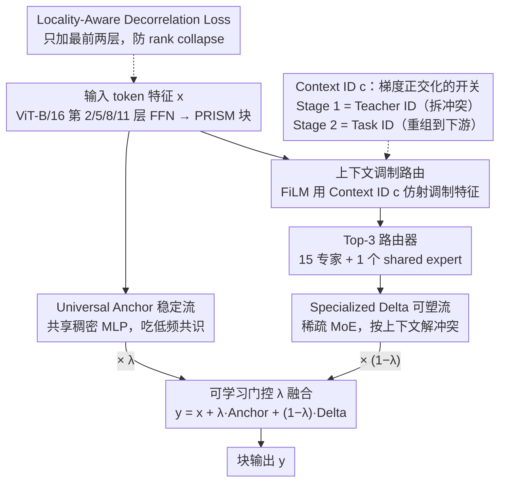

# PRISM: Synergizing Vision Foundation Models via Self-Organized Expert Specialization

**会议**: ICML 2026  
**arXiv**: [2606.03444](https://arxiv.org/abs/2606.03444)  
**代码**: https://github.com/robotyingtang/PRISM-VFM  
**领域**: 多模态VLM / 视觉基础模型蒸馏  
**关键词**: 多教师蒸馏, 视觉基础模型, MoE, 上下文路由, 梯度冲突  

## 一句话总结
PRISM 把 CLIP / SAM / DINOv2 三个异质视觉基础模型蒸馏进同一个 ViT 学生时,用"双流条件 MoE"（一条共享 anchor 流稳梯度、一条上下文路由的稀疏专家流解冲突）让专家自组织地分工——共识知识共享、冲突知识分支,在 PASCAL-Context 上比此前 SOTA SAK 在全部 5 个任务上都更好。

## 研究背景与动机
**领域现状**：CLIP（语义对齐）、SAM（边界/几何）、DINOv2（细粒度局部纹理）三种视觉基础模型各有所长,工业部署希望把它们的能力压进一个学生 backbone,既省内存又省延迟。

**现有痛点**：把多教师特征塞进一个稠密学生（RADIO / Theia / UNIC 这一系）会出现严重的梯度冲突——CLIP 想让特征对类别不变（压缩方差），DINO 偏要让局部纹理可分（保持方差），同一份共享参数在反向时收到方向相反的梯度 $\cos(\mathbf{g}_i, \mathbf{g}_j)<0$,合成梯度幅度被互相抵消,最后落到"哪边都不擅长"的折中。

**核心矛盾**：现有"分而治之"方案（SAK 用 Teacher-Agnostic Stem + Teacher-Specific Adapters）通过硬切分支降低干扰,但隐含一个过强假设——"视觉知识可以被显式切成不相交的子领域"。现实是 CLIP 和 DINO 编码"猫"时是同一概念的不同频段（语义 vs 局部纹理），硬切要么浪费参数（共识被复制 K 份）要么扼杀正向迁移。

**本文目标**：在多教师 VFM 蒸馏里,既不要稠密的"全共享导致冲突",也不要 SAK 式的"全硬分导致冗余",而要一种"按 token / 按层 / 按教师上下文动态决定共享还是分支"的中间路线。

**切入角度**：把 MoE 的稀疏路由当作"梯度正交化"的实现工具——对存在冲突的教师梯度,让它们被路由到不同专家上从而减小有效内积 $\langle \tilde{\mathbf{g}}_{i,n}, \tilde{\mathbf{g}}_{j,n}\rangle\approx 0$；对存在共识的部分,让它们走共享 anchor 流。

**核心 idea**：用"Decompose-then-Recombine"两阶段范式——Stage 1 用 teacher ID 作上下文条件,让稀疏专家在多教师蒸馏中自发分化（emergent specialization）；Stage 2 用 task ID 作上下文,把这些专家重新组合到下游任务上。配一个 locality-aware decorrelation loss 防止浅层因 CLIP 强语义监督而提前坍缩。

## 方法详解

### 整体框架
PRISM 要把 CLIP / SAM / DINOv2 三个互相打架的教师压进一个 ViT-B/16 学生而不让它们的梯度互相抵消。做法是把学生第 2/5/8/11 层的 FFN 换成 **PRISM 块**——一个**双流条件 MoE**：一条 **Universal Anchor**（跨所有上下文共享的稠密 MLP $\mathcal{F}_{\text{anc}}$，吃任务无关的低频共识）保稳定,一条 **Specialized Delta**（15 专家 Top-3 路由 + 1 个内部 shared expert 的稀疏 MoE $\mathcal{F}_{\text{moe}}$，被上下文 $c$ 调制）解冲突,整块输出按可学习门控 $\lambda\in[0,1]$ 把两流加权相加 $\mathbf{y}=\mathbf{x}+\lambda\cdot \mathcal{F}_{\text{anc}}(\text{LN}(\mathbf{x}))+(1-\lambda)\cdot \mathcal{F}_{\text{moe}}(\mathbf{x}, c)$。训练走 "Decompose-then-Recombine" 两阶段：Stage 1 在 ImageNet-1k 上 30 epoch、以 Teacher ID 为上下文从 3 个冻结 ViT-L 教师（DINOv2-L / CLIP-L / SAM-L 的第 5/11/17/23 层特征）蒸馏出自发分工的专家,Stage 2 在 PASCAL-Context / NYUD-v2 上 40k iter、改以 Task ID 为上下文把这些专家重组到下游多任务。

### 关键设计

**1. 把 MoE 当梯度正交化工具：用稀疏路由拆开冲突梯度**

多教师蒸馏的根痛点是优化矛盾——稠密 backbone 里聚合梯度 $\mathbf{g}_{\text{total}}=\sum_k \gamma_k \mathbf{g}_k$，当两个教师方向相反 $\cos(\mathbf{g}_i,\mathbf{g}_j)<0$（CLIP 要压方差、DINO 要保方差）时会出现 $\mathbf{g}_i\approx -\mathbf{g}_j$，合成幅度坍缩到"哪边都不擅长"的次优均衡（gradient averaging）。PRISM 的主张是：稀疏 MoE 天生能缓解这件事——把冲突教师的梯度路由到不同专家 $E_n$，使它们在同一参数上的有效内积 $\langle \tilde{\mathbf{g}}_{i,n}, \tilde{\mathbf{g}}_{j,n}\rangle\approx 0$（靠减少冲突教师对同一专家的共激活、或让残差梯度弱对齐实现）。于是分工很自然：共识走 Universal Anchor、冲突走 Conditioned MoE。相比 RADIO 系直接蒸到稠密 backbone（完全不管冲突）和 SAK 的硬切分支（手工划定边界）,PRISM 把"何处共享、何处分支"从经验启发升级成以梯度内积为目标、由数据驱动的正交化设计。

**2. 上下文调制路由：用 FiLM 让路由器认得出"谁在看"**

标准 MoE 路由器只看图像内容,所以 CLIP 教师和 DINO 教师同看一张猫时拿到相同输入、路由到相同专家,emergent specialization 直接失败。PRISM 用 FiLM 把 Context ID $c$（Stage 1 是 Teacher ID、Stage 2 是 Task ID）以仿射形式注入归一化后的特征 $\hat{\mathbf{x}}=(1+\gamma(c))\odot \text{LayerNorm}(\mathbf{x})+\beta(c)$，再让路由器 $G(\hat{\mathbf{x}})$ 做 Top-$K$ softmax 派发,MoE 输出 $\mathcal{F}_{\text{moe}}(\mathbf{x}, c)=E_{\text{shared}}(\mathbf{x})+\sum_{i\in \text{TopK}} G(\hat{\mathbf{x}})_i\, E_i(\mathbf{x})$，其中内部 shared expert $E_{\text{shared}}$ 专门吸收路由波动带来的公共偏差。$c$ 相当于把特征空间重新定向,逼路由器对不同教师做出不同决策。关键区别在于 PRISM 让 FiLM 只调制**路由决策**,专家本身保持纯特征学习——而 MoFME 用 FiLM 直接替代专家计算,会把路由决策和专家功能绑死;PRISM 的做法更符合"路由 vs 表示学习"的职责分离。

**3. Locality-Aware Decorrelation Loss：在浅层撑起高 rank 底座防路由坍缩**

MoE 路由的有效性强依赖输入 token 的多样性,但多教师蒸馏天然有"高级语义压倒低级结构"的倾向——作者把它叫 "semantic short-circuiting"：CLIP 的强语义监督会让浅层提前收敛到全局语义,token 特征同质化（rank collapse），路由器拿不到判别信号就坍缩。LDL 只对前两层施加,惩罚空间上远距离 token 之间的高余弦相似度、同时保护近距离的局部相关性 $\mathcal{L}_{\text{decorr}}=\frac{1}{|\mathcal{P}|}\sum_{(i,j)\in\mathcal{P}}\max(0,\cos(\mathbf{z}_i,\mathbf{z}_j)-\epsilon)\cdot \mathbb{I}(d_{ij}>r)$，其中 $r$ 是局部半径、$d_{ij}$ 是空间欧氏距离、$\mathbb{I}(d_{ij}>r)$ 只对远距离对计入惩罚。这等于注入了一个"局部归纳偏置"的正则——不打死局部相关（视觉特征的物理事实）,只强制远距离 token 保持差异,在浅层人为撑起一个高 rank 的特征底座,给深层专家提供有区分度的原材料。

### 损失函数 / 训练策略
- **Stage 1**：$\mathcal{L}_{\text{stage1}}=\mathcal{L}_{\text{aux}}+\alpha \mathcal{L}_{\text{distill}}+\beta \mathcal{L}_{\text{decorr}}$，$\alpha=0.9$、$\beta=0.1$。每次迭代随机抽一个 teacher $T_k$ 用其 ID 作上下文。
- **Stage 2**：$\mathcal{L}_{\text{stage2}}=\mu \mathcal{L}_{\text{distill}}+\sum_{t}w_t \mathcal{L}_t$，$\mu=1.0$，$w_t$ 按 MTL 标准做法固定。
- 骨干 ViT-B/16,MoE 层每层 15 个专家 + 1 个 shared expert,Top-3 路由;门控 $\lambda$ 实验里自动呈现"浅层偏稳定（$\lambda$ 高）、深层偏专精（$\lambda$ 低）"的层级模式。

## 实验关键数据

### 主实验
PASCAL-Context（5 任务: SemSeg / Parsing / Saliency / Normal / Boundary）和 NYUD-v2（4 任务: SemSeg / Depth / Normal / Boundary）双基准。

| 方法 (PASCAL-Context, ViT-B) | SemSeg mIoU↑ | Parsing mIoU↑ | Saliency maxF↑ | Normal mErr↓ | Boundary odsF↑ | $\Delta_m$ %↑ |
|------|------|------|------|------|------|------|
| Single-task baseline | 80.25 | 70.54 | 84.54 | 13.57 | 74.22 | 0.00 |
| Multi-task baseline | 76.76 | 65.26 | 84.39 | 13.98 | 70.37 | -4.04 |
| RADIO | 78.06 | 68.13 | 85.18 | 13.59 | 72.64 | -1.53 |
| Theia | 76.51 | 67.53 | 84.38 | 14.56 | 70.34 | -4.33 |
| SAK (前 SOTA) | 81.88 | 74.30 | 84.79 | 14.02 | 74.09 | 0.83 |
| **PRISM (Ours)** | **82.20** | **75.34** | **84.81** | **13.47** | **75.92** | **2.29** |

最关键的两点：(1) $\Delta_m$ 从 SAK 的 0.83% 抬到 2.29%,首次让多任务联合模型在 PASCAL-Context 上明显超过 single-task baseline；(2) 在 5 个任务上**全部**超过 SAK,Boundary（+1.83 odsF）和 Normal（-0.55 mErr）这种几何任务提升尤其说明 emergent expert 对共享几何结构的提取比 SAK 的物理隔离 adapter 更高效。

### NYUD-v2 与消融
NYUD-v2 上 PRISM 与 SAK 互有胜负——PRISM 在 SemSeg（60.22 vs 59.93 mIoU）、Depth（0.4883 vs 0.4942 RMSE）领先,SAK 在 Normal、Boundary 略优,作者归因为 SAK 的专属 adapter 对室内几何高频信号有更强局部性,反映"灵活重组 vs 专精局部适配"的数据集相关权衡。

| 配置 | 关键观察 | 说明 |
|------|---------|------|
| 完整 PRISM | $\Delta_m=2.29\%$ | 双流 + FiLM + LDL 全开 |
| 浅层 $\lambda$ vs 深层 $\lambda$ | 浅层 $\lambda$ 高、深层 $\lambda$ 低 | 自发学到"浅层稳定、深层专精"的层级模式 |
| Stage 1 teacher ID 路由 | 不同教师走不同专家 | 验证 emergent specialization 真实发生 |

### 关键发现
- $\lambda$ 自发分层这点很关键：浅层倾向"共享 anchor"维持鲁棒优化,深层倾向"稀疏专家"做精细分化——这与人对 ViT 层级语义结构的直觉吻合,也证明门控不是冗余设计。
- PRISM 在几何/边界任务上的提升说明 emergent expert 比 SAK 的硬切分支更能挖掘"跨教师共享几何结构"——SAM 和 DINO 都隐含边界信号,被 PRISM 自动汇聚而非被分开。
- LDL 只加在最前两层就够了,深层加反而损害专家分化——印证"短路问题主要发生在浅层"的诊断。

## 亮点与洞察
- **把 MoE 当"梯度正交化的实现工具"**这个视角值得记。以前 MoE 常被理解为"提升容量 / 条件计算",这里把它升级成"解决多目标优化里梯度冲突"的结构性方案,理论叙事更清晰,也指出了 MoE 在多教师/多任务蒸馏里的本质优势。
- **FiLM 调制路由而非调制专家**是个值得借鉴的工程选择。MoFME 用 FiLM 替代专家计算,但这样会绑死路由决策与专家功能；PRISM 让 FiLM 只影响"派发到哪个专家",专家本身保持纯特征学习,职责分离更干净。
- **Dual-stream（稳定 + 可塑）的设计哲学**可以迁移到任何"既要保留通用能力又要做下游特化"的场景——例如多模态指令微调里用一条 anchor 保留预训练通用能力、用一条 MoE 处理任务特异性,可能是个比 LoRA-only 更结构化的方案。

## 局限与展望
- 训练成本：双流 + 15 专家明显比 dense ViT-B 重,虽然推理用 Top-3 稀疏,但 Stage 1 的 emergent specialization 还是依赖大量教师 forward,实际落地的 GPU 时间需要论文未深入展开的分析。
- 教师选择敏感性：实验固定 CLIP / SAM / DINOv2 三教师,如果加入 Depth Anything、ConvNeXt 等更多教师,emergent specialization 是否还能稳定收敛？教师数量上限缺验证。
- NYUD-v2 上 SAK 在部分任务仍占优,说明对"明显需要局部专属归纳偏置"的任务,纯 MoE 路由可能不够——一个混合范式（PRISM-style 路由 + 部分轻量 adapter）也许能拿到 best-of-both。
- $\Delta_m$ 这个指标对参数量与 backbone 规模敏感,论文 Table 3 用 ViT-L 重复验证才更扎实——附录中 ViT-L 的扩展结果在主表前展示得不够突出。

## 相关工作与启发
- **vs SAK (Lu et al., 2025)**：SAK 用 Teacher-Agnostic Stem + Teacher-Specific Adapters 做硬切,PRISM 改成"软切 + 上下文路由"。优势是参数共享更精细,在 PASCAL-Context 全任务超越；劣势是训练更复杂、依赖 LDL 防止路由坍缩。
- **vs RADIO / RADIOv2.5 (Ranzinger et al., 2024)**：RADIO 直接稠密蒸馏,遇到 CLIP/DINO 梯度冲突就靠数据/loss 加权硬调；PRISM 从结构上分流,$\Delta_m$ 显著超出。
- **vs Mod-Squad (Chen et al., 2023)**：用信息论目标约束专家专精,但只在单任务/单教师内部分化；PRISM 把"分化"扩展到多教师多任务,且专精是 emergent 的（不靠显式目标函数强推）。
- **vs MoFME (Zhang et al., 2024)**：都用 FiLM,但 MoFME 让 FiLM 替代专家计算,PRISM 让 FiLM 调制路由决策——后者更符合"路由 vs 计算"职责分离。

## 评分
- 新颖性: ⭐⭐⭐⭐ Dual-stream 条件 MoE + 上下文调制路由 + LDL 这三件套组合在多教师 VFM 蒸馏场景里是新颖配方,emergent specialization 的视角清晰。
- 实验充分度: ⭐⭐⭐⭐ PASCAL-Context + NYUD-v2 双基准 + ViT-L scaling 实验,对 SAK / RADIO / Theia / UNIC 等强基线覆盖完整,$\lambda$ 自发分层和 LDL 浅层归属等诊断到位。
- 写作质量: ⭐⭐⭐⭐ 梯度冲突诊断到正交化目标到 MoE 结构这条逻辑链顺,Figure 1 的 Pipeline + Block 图很有用；唯一遗憾是 LDL 那部分公式与"防 rank collapse"的关系展开略快。
- 价值: ⭐⭐⭐⭐ 给所有想把多个 VFM 压进一个学生的实际工程需求提供了清晰可复现的 recipe,代码开源,$\Delta_m=2.29\%$ 的 SOTA 数字也足够说服 reviewer/工程师。

<!-- RELATED:START -->

## 相关论文

- [\[NeurIPS 2025\] VESSA: Video-based objEct-centric Self-Supervised Adaptation for Visual Foundation Models](../../NeurIPS2025/model_compression/vessa_video-based_object-centric_self-supervised_adaptation_for_visual_foundatio.md)
- [\[ICML 2026\] Quantifying the Uncertainty of Foundation Models with Singular Value Ensembles](quantifying_the_uncertainty_of_foundation_models_with_singular_value_ensembles.md)
- [\[ICML 2026\] BioArc: Discovering Optimal Neural Architectures for Biological Foundation Models](bioarc_discovering_optimal_neural_architectures_for_biological_foundation_models.md)
- [\[ICML 2026\] End-to-End Compression for Tabular Foundation Models](end-to-end_compression_for_tabular_foundation_models.md)
- [\[ICML 2026\] Geo-Expert: 用 LoRA 把 8B 模型微调成专家级地质推理 LLM](geo-expert_towards_expert-level_geological_reasoning_via_parameter-efficient_fin.md)

<!-- RELATED:END -->
