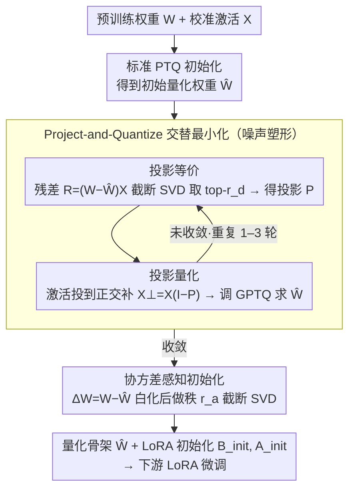

# ProjQ: Project-and-Quantize for Adapter-Aware LLM Compression

**会议**: ICML 2026  
**arXiv**: [2606.00494](https://arxiv.org/abs/2606.00494)  
**代码**: https://github.com/yy9301/ProjQ  
**领域**: 模型压缩 / LLM效率  
**关键词**: 后训练量化, LoRA, 子空间投影, 激活感知, 低秩噪声整形

## 一句话总结
ProjQ 把 PTQ 的量化噪声主动"塑形"到一个低秩子空间里、并把这部分让给后续 LoRA 适配器去消除，从而保住 LoRA 容量学下游任务，在 LLaMA-2 / Qwen2.5 / Qwen3 上用 3 bit 就能追平标准 4 bit baseline。

## 研究背景与动机

**领域现状**：把大模型先 PTQ（如 GPTQ、AWQ、QuIP）压成 3-4 bit、再贴一个 LoRA 适配器做下游微调（如 QLoRA、LoftQ）已经是部署 LLM 的事实标准流水线。

**现有痛点**：现行做法把量化和适配视为两个相互独立的阶段。PTQ 阶段只想着最小化"权重重建误差"，因此把噪声均匀地撒在所有奇异方向上；到了 LoRA 阶段，秩 $r$ 极小的适配器必须先用一大半容量去"擦"这些方向各异的噪声，剩下的容量才能用于学任务，本质上是"双重负担"。

**核心矛盾**：LoRA 只能修复低秩方向上的误差；PTQ 却倾向于产生满秩、各向同性的噪声。两个阶段的几何结构错位——能修的子空间只有一小块，但误差却铺满整个空间，导致 LoRA 永远在补漏，而不是在学习。

**本文目标**：在量化阶段就把噪声"挤"到 LoRA 能修的那个低秩子空间里，让正交补空间里的不可修复残差尽量小，从而把 LoRA 的容量从"补噪声"释放给"学任务"。

**切入角度**：作者从一条几何观察切入——"修复一个秩 $r_d$ 的低秩误差" $\equiv$ "找一个秩 $r_d$ 的正交投影 $P$ 把误差最大限度地装进去"。既然下游任务方向未知、但子空间结构可控，那量化器就应该围绕"可修复性"而不是"绝对幅值"来优化。同时还把目标从权重空间换到激活空间 $(W-\widehat{W})X$，因为输出误差才真正决定下游表现。

**核心 idea**：让 PTQ 学一个对 LoRA 友好的量化解——把不可避免的量化噪声"挤"进一个 LoRA 能消化的低秩子空间。

## 方法详解

### 整体框架
ProjQ 想解决的是"PTQ 把噪声乱撒、LoRA 修不过来"这个错位。它把"PTQ + LoRA 初始化"重新写成一个激活感知的双层优化 $\min_{\widehat{W}\in\mathcal{Q}}\,\min_{B,A}\,\lVert (W-\widehat{W}+BA)X\rVert_F^2$，外层负责"塑造噪声形状"、内层负责"用低秩适配器吸收噪声"。整套流程吃进预训练权重 $W$ 和校准激活 $X$，分两个阶段跑：阶段一（噪声塑形）用一个**设计秩** $r_d$ 做 **Project-and-Quantize 交替最小化**，把噪声挤进 $r_d$ 维可修复子空间；阶段二用真正的**适配秩** $r_a$ 做一次协方差感知的闭式 SVD，吐出量化骨架 $\widehat{W}$ 加一对 LoRA 初始化 $B_{init}, A_{init}$，交给下游 LoRA 微调。

### 关键设计

**1. 投影等价：把"找最优低秩适配器"换成"找一个低秩子空间"**

原问题混着离散权重 $\widehat{W}$ 和连续低秩矩阵 $B,A$，两组变量强耦合、几乎无从下手。作者的破局点是证明 $\min_{B,A}\lVert R+BAX\rVert_F^2 = \min_{P\in\mathcal{P}_{r_d}}\lVert R(I-P)\rVert_F^2$，其中 $R=(W-\widehat{W})X$ 是激活空间里的残差。这等式把"连续低秩矩阵优化"整个消掉了：最优适配器无非对应残差能量最大的那个 $r_d$ 维子空间，而最优投影 $P$ 直接由 $R$ 的截断 SVD 右奇异向量 $V_{r_d}$ 闭式给出，$P=V_{r_d}V_{r_d}^\top$。原本不可解的混合优化于是塌缩成"离散 $\widehat{W}$ + 投影 $P$"两组变量交替求解，同时还附送了一个干净的几何解释——量化误差该往哪个子空间塞、由哪块子空间负责擦，一目了然。

**2. Project-and-Quantize 交替最小化：让 PTQ 只去优化 LoRA 修不到的那部分**

这是 ProjQ 的灵魂。它把量化拆成交替的两步：P-Step 固定当前 $\widehat{W}^{(t)}$，对残差 $R^{(t)}=(W-\widehat{W}^{(t)})X$ 做截断 SVD 取 top-$r_d$ 右奇异向量，识别出"LoRA 能修复的可修复子空间" $P^{(t+1)}$；W-Step 把激活投到它的正交补 $X_\perp=X(I-P^{(t+1)})$，再调用标准激活感知 PTQ（如 GPTQ）求解 $\min_{\widehat{W}\in\mathcal{Q}}\lVert (W-\widehat{W})X_\perp\rVert_F^2$。妙处在于 $X_\perp$ 已经把 LoRA 会消除的方向"扣掉"了，PTQ 于是自动把宝贵的比特预算花在不可修复的尾巴上、而不是浪费在反正会被擦掉的子空间里——比特资源被精准送到最需要的方向。作者还证明只要 PTQ 子求解器不让误差增加，整套交替序列单调收敛，实测 1-3 轮就稳。

**3. 协方差感知的适配器初始化：给微调阶段的 LoRA 一个最优起点**

塑形结束后还得给 LoRA 一个好的初始值，否则 cold start 又是一笔损失。拿到 $\widehat{W}^{(T)}$ 后令 $\Delta W = W-\widehat{W}^{(T)}$，对激活协方差做特征分解 $XX^\top=U_X\Lambda_X U_X^\top$，构造白化矩阵 $Y=U_X\Lambda_X^{1/2}$，再对 $\Delta W Y$ 做秩 $r_a$ 截断 SVD $U_{r_a}\Sigma_{r_a}V_{r_a}^\top$，闭式输出 $B_{init}=U_{r_a}\Sigma_{r_a}^{1/2}$、$A_{init}=\Sigma_{r_a}^{1/2}V_{r_a}^\top\Lambda_X^{-1/2}U_X^\top$。注意这里塑形用的是设计秩 $r_d$（关心噪声"形状"）、初始化用的是适配秩 $r_a$（关心实际"容量"），两个秩解耦后既能按存储预算和任务难度独立调参，又能给出数学上最优的起点——一开局 LoRA 就对齐到了误差能量最大的方向。计算上也不亏：$\Lambda_X$ 严格对角，$\Lambda_X^{-1/2}$ 只是 $O(n)$ 的逐元素求逆，没有 $O(n^3)$ 的开销。

### 损失函数 / 训练策略
ProjQ 本身不引入额外训练损失，只在量化阶段调用 PTQ 求解器：外层目标是 $\lVert (W-\widehat{W})X(I-P)\rVert_F^2$，内层 PTQ 复用 GPTQ 等成熟方案。理论上作者还在"adapter 容量充裕" $r_a\ge r_d+r_s$ 下证明 ProjQ 的可分离上界 $\mathcal{U}(W_p)\le \mathcal{U}(W_c)$ 严格优于经典 PTQ，并给出零任务漂移情形 $r_s=0$ 下的强结论 $f(W_p)\le f(W_c)$，说明 ProjQ 不只是工程 trick，也是理论上正确的策略。

## 实验关键数据

### 主实验
在 LLaMA-2 / Qwen2.5-Instruct / Qwen3 上做 2-bit 极端量化，校准取 $r_a=r_d=64$，对比 GPTQ+SVD-LLM、AWQ+SVD-LLM、CALDERA、LoftQ。C4 困惑度（越低越好）：

| 模型 | GPTQ+SVD-LLM | AWQ+SVD-LLM | CALDERA | LoftQ | ProjQ |
|------|--------------|-------------|---------|-------|-------|
| LLaMA2-7B | 26.26 | 1.7e5 | 21.59 | 28.77 | **21.50** |
| LLaMA2-13B | 14.50 | 9.5e4 | 13.56 | 14.14 | **12.48** |
| Qwen2.5-7B-Ins | 62.27 | NAN | 50.57 | 34.17 | **33.50** |
| Qwen2.5-14B-Ins | 28.94 | NAN | 23.33 | 31.74 | **22.22** |
| Qwen2.5-32B-Ins | 16.96 | — | — | 16.95 | **14.33** |
| Qwen3-32B | 26.24 | — | — | 25.71 | **20.74** |

在 2-bit 这个极端档位上，AWQ 直接崩成 $10^5$ 级 PPL，而 ProjQ 在所有模型上都拿到最低 PPL；WikiText 上趋势相同。论文同时报告补偿评估损失（compensation loss）可比基线低约 $2\times$。

### 消融实验

| 配置 | 含义 | 结果走向 |
|------|------|----------|
| Full ProjQ | 交替优化 + 协方差感知初始化 | 基线 |
| w/o 交替迭代（只用 P-Step 初始化） | 不做 W-Step，相当于 LoftQ 风格 | 性能退化，明显比 ProjQ 差 |
| w/o 激活权重（用 $X=I$） | 退化为权重空间 LoftQ | 低 bit 下崩盘最严重 |
| 改变设计秩 $r_d$ | $r_d$ 太小→误差装不下；太大→正交补退化 | 中等 $r_d$ 最优 |
| 改变迭代次数 $T$ | $T=1$ 到 $T=3$ 间快速收敛 | 1-3 轮即稳定 |

### 关键发现
- 把"激活感知"和"低秩塑形"同时打开是关键——单独做任何一个都拿不到完整收益，说明 ProjQ 的两个机制是协同的而不是叠加的。
- 极低比特（2 bit、3 bit）场景下 ProjQ 优势最明显；4 bit 时各方法都接近 FP，差距缩小。这与理论一致：噪声越大，LoRA"双重负担"越严重，塑形带来的好处也越显著。
- ProjQ 3-bit 能匹配标准 4-bit baseline 的语言建模性能，相当于无痛省下 25% 的存储和带宽。

## 亮点与洞察
- "把噪声塑形成 LoRA 能吃的形状"这个想法本身就漂亮——它跳出了"PTQ 越精确越好"的惯性思维，承认下游一定会有 LoRA，于是反过来把 LoRA 当作量化目标的一部分；这种 co-design 思路可以迁移到任何"压缩 + 适配"的两阶段流水线。
- 投影等价定理把"低秩矩阵优化"消去换成"正交投影优化"，是一个很值得收藏的工程化简：以后碰到 $\min_{B,A}\lVert R+BA\rVert$ 这种形式都可以等价改写成"找 $r$ 维子空间"。
- 设计秩 $r_d$ 与适配秩 $r_a$ 解耦的小设计非常实用——$r_d$ 控制塑形的"清晰度"，$r_a$ 控制实际可用容量，二者不绑死意味着可以根据存储预算和任务难度独立调参。

## 局限与展望
- ProjQ 仍是"每层独立优化"，没有显式考虑跨层误差传播；在很深的模型上跨层耦合可能让局部最优偏离全局最优。
- 算法假设校准集 $X$ 能代表下游分布，校准数据偏离时塑形的子空间可能错位；论文没充分讨论 OOD 校准下的鲁棒性。
- 当前实验主要在 NLU/语言建模 PPL 上，对生成质量、长上下文、指令对齐等"更软"的指标缺少系统评估，下游收益仍待验证。
- 理论部分依赖"经典 PTQ 噪声谱扩散、ProjQ 噪声谱集中"的假设，这个假设在 1-bit 等极端量化下未必成立，是分析的潜在脆弱点。

## 相关工作与启发
- **vs LoftQ**: LoftQ 也想让量化和 LoRA 协同，但只在权重空间最小化 $\lVert W-\widehat{W}-BA\rVert$，对所有权重一视同仁；ProjQ 在激活空间最小化 $\lVert (W-\widehat{W}+BA)X\rVert$，把误差按对输出的实际贡献加权，是 LoftQ 的"激活感知 + 子空间塑形"升级版。
- **vs GPTQ / AWQ**: 经典 PTQ 只关心压缩本身、不考虑后续微调，结果是把误差均匀撒开；ProjQ 直接调用 GPTQ 作为 W-Step 子求解器，但把它喂的激活换成 $X_\perp$，相当于给 GPTQ 套了一层"塑形外壳"。
- **vs QLoRA**: QLoRA 是完全解耦的 PTQ + LoRA，工程简单但浪费 LoRA 容量；ProjQ 是 QLoRA 的"对齐版"——同样轻量、但 LoRA 起点更接近最优解。
- **vs CALDERA / EoRA / SVD-LLM**: CALDERA 用低秩 + 量化分解逼近权重；EoRA / SVD-LLM 提出协方差感知的低秩近似。ProjQ 直接吸纳 EoRA 的闭式初始化作为第二阶段，并在第一阶段补上"主动塑形"，把这些工作的优点串成一套完整流水线。

## 评分
- 新颖性: ⭐⭐⭐⭐ 把 PTQ 改造成"为 LoRA 服务的塑形器"是个清晰的新视角，投影等价定理也很扎实。
- 实验充分度: ⭐⭐⭐⭐ 覆盖三大模型族 + 多档比特 + 多基线，理论与实验互证；缺少长上下文与生成质量评估。
- 写作质量: ⭐⭐⭐⭐ 几何直觉、算法、理论、实验四部分衔接清晰，命题与定理表述规范。
- 价值: ⭐⭐⭐⭐ 直接命中"边缘部署 LLM"刚需，3-bit 追平 4-bit 是非常实际的收益。

## 评分
- 新颖性: 待评
- 实验充分度: 待评
- 写作质量: 待评
- 价值: 待评

<!-- RELATED:START -->

## 相关论文

- [\[ICML 2026\] Multi-Adapter Representation Interventions via Energy Calibration](multi-adapter_representation_interventions_via_energy_calibration.md)
- [\[ICML 2026\] Preserve-Then-Quantize: Balancing Rank Budgets for Quantization Error Reconstruction in LLMs](preserve-then-quantize_balancing_rank_budgets_for_quantization_error_reconstruct.md)
- [\[ICML 2026\] Breaking the MoE LLM Trilemma: Dynamic Expert Clustering with Structured Compression](breaking_the_moe_llm_trilemma_dynamic_expert_clustering_with_structured_compress.md)
- [\[ICML 2026\] Geo-Expert: 用 LoRA 把 8B 模型微调成专家级地质推理 LLM](geo-expert_towards_expert-level_geological_reasoning_via_parameter-efficient_fin.md)
- [\[ACL 2026\] Quantize What Counts: More for Keys, Less for Values](../../ACL2026/model_compression/quantize_what_counts_more_for_keys_less_for_values.md)

<!-- RELATED:END -->
