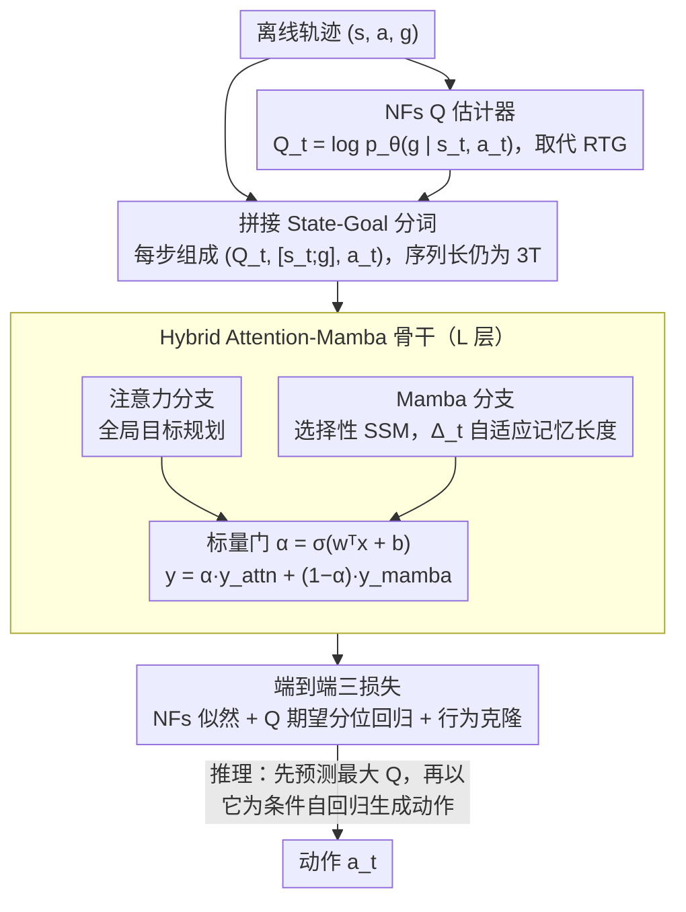

# QHyer: Q-conditioned Hybrid Attention-mamba Transformer for Offline Goal-conditioned RL

**会议**: ICML 2026  
**arXiv**: [2605.01862](https://arxiv.org/abs/2605.01862)  
**代码**: 未公开  
**领域**: 强化学习 / 序列建模 / 离线目标条件 RL  
**关键词**: Offline GCRL, Decision Transformer, Normalizing Flows, Mamba, 轨迹拼接

## 一句话总结
QHyer 用 Normalizing Flows 估计的状态依赖 Q 值取代 Decision Transformer 中的轨迹依赖 RTG，再叠加门控式 Attention-Mamba 混合骨干以实现内容自适应的历史压缩，在 OGBench/D4RL 的非马尔可夫与马尔可夫离线目标条件 RL 数据集上同时刷新 SOTA。

## 研究背景与动机

**领域现状**：离线目标条件强化学习（Offline GCRL）从静态数据集中学习"到达目标"的策略。当前两条主流路线：基于 Bellman 备份的价值方法（IQL/HIQL 等）和把决策视为序列建模的 Decision Transformer（DT）系。后者天然处理历史依赖，因此被认为更适合包含 non-Markovian 行为策略的真实数据集（如 OGBench play）。

**现有痛点**：把 DT 直接搬到 Offline GCRL 会撞两堵墙。其一，DT 用 RTG（Return-to-Go）作为条件信号，但稀疏目标奖励下 RTG 只剩"这条轨迹是否成功"的近似二值信号——同一个状态在成功轨迹中得 1、在失败轨迹中得 0，**完全无法跨轨迹比较状态质量**，于是失败演示里那些"局部有用的片段"再也拼不进新策略，stitching 能力崩塌。其二，纯注意力对时间结构不敏感；LSDT / DMixer 用固定窗的因果卷积补"局部分支"，但 play 数据需要长记忆、noisy 数据只需短记忆，固定感受野要么浪费容量、要么截断关键依赖。

**核心矛盾**：这两个限制是**耦合**的。只换 Q 值留住 RTG-style 固定窗，仍然在 non-Markovian play 上吃卷积病；只换骨干留住 RTG，仍然解不开稀疏奖励下的 stitching 瓶颈。必须同时解决——既需要"状态依赖的价值信号"，又需要"内容自适应的有效记忆"。

**本文目标**：(i) 给 DT 找一个能在稀疏目标奖励下区分状态质量的条件信号；(ii) 给骨干设计一种能按 token 动态调节记忆长度的时序模块。

**切入角度**：作者注意到目标可达 Q 函数 $Q^\beta(s,a,g)=p^\beta_+(g\mid s,a)$ 表示"从 $(s,a)$ 到达目标 $g$ 的概率"，**与轨迹无关**——这正好是 stitching 需要的"轨迹无关价值度量"。同时 Mamba 的选择性 SSM 把离散化步长 $\Delta_t$ 做成输入相关函数，可在不动结构的前提下让有效记忆按 token 漂移。两个观察拼起来正好对应两个限制。

**核心 idea**：用 **Normalizing Flows 估计 MC Q-value 作为 conditioning token 取代 RTG**，并用 **Attention+Mamba 学习门控融合**的混合骨干替换纯注意力，让 sequence modeling 真正适配 Offline GCRL。

## 方法详解

### 整体框架
QHyer 的思路是把 Decision Transformer 的"序列建模"框架彻底改造成适配稀疏目标奖励的版本：它把每个时间步表示成 $(Q_t, [s_t;g], a_t)$ 三元组，其中 $Q_t=\log p_\theta(g\mid s_t,a_t)$ 是 Normalizing Flows 估计的"从当前状态-动作到达目标"的对数概率（取代原本的 RTG），$[s_t;g]$ 是把状态和目标拼在一起的 token。这条序列送进 $L$ 层 Hybrid Attention-Mamba block，每个 block 让注意力分支负责全局目标规划、Mamba 分支负责内容自适应的历史压缩，再用一个标量门把两条分支的输出加权融合；训练端到端联合优化 NFs 似然、Q 期望分位回归与行为克隆，推理时先预测最大 Q、再以它为条件自回归生成 action。

### 关键设计

**1. 用 Normalizing Flows 估计的 Q 值取代 RTG：把"是否成功的二值信号"换成"轨迹无关的状态质量度量"**

DT 系最致命的痛点是 RTG 在稀疏目标奖励下退化——同一个状态在成功轨迹里得 1、失败轨迹里得 0，根本无法跨轨迹比较状态好坏，于是失败演示里那些"局部有用的片段"再也拼不进新策略，stitching 直接崩塌（实测 RTG 在稀疏奖励下覆盖率仅 25%）。QHyer 的做法是改用目标可达 Q 函数 $Q^\beta(s,a,g)=p^\beta_+(g\mid s,a)$ 作条件，它表示"从 $(s,a)$ 到达目标 $g$ 的概率"、与具体轨迹无关，正是 stitching 需要的度量（NFs Q 条件下覆盖率升到 92%）。具体用 coupling-layer NFs 建模条件密度 $p_\theta(g\mid s,a)$，靠可逆映射 $f_\theta(\cdot;z)$ 与变量替换公式拿到精确对数似然 $Q^\beta_\theta(s,a,g)=\log p_0(f_\theta(g;z))+\log\bigl|\det\partial f_\theta(g;z)/\partial g\bigr|$，再用期望分位回归 $L^2_\tau(u)=|\tau-\mathds{1}(u<0)|\cdot u^2$（$\tau\in(0.5,1)$）从 behavior $Q^\beta$ 学一个 transformer 自己的 $\hat Q_\phi(s,g)$，向**分布内最大 Q** 收敛（Theorem 3.1 表明偏差 $\epsilon_\tau$ 随 $\tau$ 提升而下降）。

为什么非得是 NFs？作者把这一步上升成"在 transformer 跨多目标读 Q-token 这个场景下，密度模型需要什么属性"的结构性论证：CVAE 只给 ELBO 下界、Contrastive RL 的密度比有目标相关偏移、Diffusion 算似然要 ODE+Hutchinson 估计引入方差——它们要么不归一化、要么把"跨多目标的 Q-token 序列"扭曲。NFs 的三角 Jacobian 让对数密度**既精确又廉价**，恰好满足跨目标 conditioning 的要求，实测它的 Q 估计误差也最低（Appendix G.4）。

**2. Hybrid Attention-Mamba 骨干：用输入相关的"平滑遗忘"替掉固定核卷积，让有效记忆按数据形状自动漂移**

第二个痛点和骨干有关：纯注意力对时间结构不敏感，而 LSDT / DMixer 用固定窗因果卷积补"局部分支"时又被感受野卡死——卷积对 $j<k$ 的影响是固定权重 $w_j$、超出即硬截断，可 play 数据需要长记忆、noisy 数据只需短记忆，固定核要么浪费容量、要么截断关键依赖。QHyer 在每个 block 里并排放两条分支：注意力分支管全局目标导向推理，Mamba 分支管内容自适应的历史压缩。Mamba 分支先用因果卷积提局部特征 $x'_t$，再走选择性 SSM $h_t=\bar A h_{t-1}+\bar B x'_t,\ y_t=Ch_t$，关键在离散化步长是输入相关的：$\bar A_t=\exp(\Delta_t\cdot A)$，$\Delta_t=\mathrm{softplus}(\mathrm{Linear}_\Delta(x'_t))$。$\Delta_t$ 小时 $\bar A_t\approx 1$、保留长历史（适合 play），$\Delta_t$ 大时 $\bar A_t\approx 0$、只看局部（适合 noisy）。这种"输入相关的平滑遗忘"能跨数据集自动调节有效记忆而无需手调感受野，正是固定窗结构根本做不到的事。

**3. 拼接 State-Goal 分词 + 端到端三损失：把目标塞进每步 token，避免序列变长带来的二次开销**

如果按 $(Q_t,s_t,g,a_t)$ 四元组组序列，长度会从 $3T$ 涨到 $4T$、注意力二次开销跟着上去。QHyer 改成 $(Q_t,[s_t;g],a_t)$，把状态和目标拼成一个 token——既保证目标信号每步可见，序列长度又仍是 $3T$，是把 NFs Q 信号无缝接进 DT pipeline 的关键工程 trick。整个系统端到端联合优化三个损失 $\mathcal L_{\text{QHyer}}=\lambda_{\text{critic}}\mathcal L_{\text{NFs}}+\lambda_{\text{BC}}\mathcal L_{\text{BC}}+\lambda_Q \mathcal L_Q$，分别对应 NFs 极大似然、Q-conditioned 行为克隆与 transformer 端 Q 期望回归，融合两条分支输出的标量门为 $\alpha=\sigma(\mathbf{w}^\top x + b)$。

### 损失函数 / 训练策略
NFs critic 用 hindsight relabeling 配合 $-\log p_\theta(g\mid s_t,a_t)$ 做极大似然训练；transformer 端 BC 损失为 $\mathcal L_{\text{BC}}=-\mathbb E[\log\pi_\theta(a_t\mid Q_t,[s_t;g])]$；期望分位 $\tau$ 按数据覆盖率选，低覆盖 play 用 $\tau=0.9$、高覆盖 noisy 用 $\tau=0.95$。推理分两阶段自回归：先生成 $\hat Q(s_t,g)$，再以它为条件生成 $a_t$。

## 实验关键数据

### 主实验
OGBench manipulation（5 个 test goal，平均成功率 %）与 D4RL Maze（normalized score）。

| 数据集 | 任务 | 第二好 | QHyer | 增益 |
|---|---|---|---|---|
| OGBench cube-play | single | GCIQL 68 | **84** | +16 |
| OGBench cube-play | double | GCIQL 40 | **56** | +16 |
| OGBench cube-noisy | double | GCIQL 23 | **30** | +7 |
| OGBench puzzle-play | 4x5 | GCIQL 14 | **31** | +17 |
| D4RL AntMaze-v2 | large-play | IQL 39.6 | **44.2** | +4.6 |
| D4RL AntMaze-v2 | medium-diverse | LSDT 75.8 | **94.0** | +18.2 |
| D4RL Maze2d | medium | QT 172.0 | **173.0** | +1.0 |

总分：OGBench cube-play 24→152（HIQL 基线对比），AntMaze 总分 303.6→483.4，Maze2d 总分 136.5→291.5。在 RTG 系列（DT/EDT/DC）几乎归零的 large maze 上 QHyer 直接破局。

### 消融实验

| 配置 | cube-single-play | cube-single-noisy | 结论 |
|---|---|---|---|
| RTG + Attention（≈DT） | 低 | 低 | RTG 失效 |
| NFs Q + Attention only | 74 | 60 | 缺时序自适应 |
| NFs Q + Mamba only | 80 | 91 | 缺全局推理 |
| NFs Q + Hybrid（QHyer） | **84** | **95** | 互补门控 |
| Hybrid + No Q | -- | -- | 退化为 BC |
| Hybrid + CVAE Q | < CRL | < CRL | ELBO 下界扭曲 |
| Hybrid + CRL Q | < NFs | < NFs | 负采样偏差 |

期望分位 $\tau$ 从 0.5 单调爬升到 0.9 最佳，超过 0.95 因覆盖不足而退化。

### 关键发现
- **两个创新各自必要、组合最优**：固定 NFs 换骨干、固定 RTG 换骨干、固定骨干换 Q 估计器，三套独立消融均显示 QHyer 的两个改动是叠加而非冗余。
- **Mamba 的 $\Delta_t$ 真的"按数据形状"漂移**：play 上 mean $\Delta_t=0.38$、$\bar A_t=0.92$，有效记忆约 12 步，门把 0.57 容量给 attention；noisy 上 $\Delta_t=1.05$、$\bar A_t=0.61$，有效记忆约 3 步，门把 0.58 给 Mamba。
- **NFs > CRL > CVAE > No-Q**：精确归一化对数密度是 sequence modeling stitching 的关键瓶颈。

## 亮点与洞察
- **"两个 limitation 是耦合的" 论证非常干净**：作者明确指出只解一边的失败模式（保持卷积的"非马尔可夫病"或保持 RTG 的"轨迹依赖瓶颈"），为同时改两处提供强动机，比常见"我们加了 A 又加了 B"叙事更有说服力。
- **NFs 选型的"结构性论证"**：把"为什么不能用 CVAE/CRL/Diffusion"上升到 transformer 跨多目标读 Q-token 这个具体场景的归一化需求，给出超越实验数字的设计原则——这种"在哪种使用场景下密度模型的属性才决定性"的分析很可迁移。
- **门控 + Mamba 自适应 Δ 的"双层自适应"**：粗粒度由门在分支间分配容量，细粒度由 $\Delta_t$ 按 token 调节记忆长度。这种"层级化的自适应性"是面对异质时间结构数据集的好范式，可迁移到机器人多任务、对话历史压缩等场景。

## 局限与展望
- 在 visual-noisy 上仍受限：像素级 NFs 密度估计成为主要误差来源，Markovian 行为又抵消了非马尔可夫建模优势。
- 理论分析基于确定性转移假设（继承自 R2CSL），扩展到随机环境是公开问题。
- 训练成本高于纯 DT：NFs critic + Mamba SSM + expectile 三个组件叠加；论文未给详细 wall-clock 对比。
- 期望分位 $\tau$ 与覆盖 $\tilde c$ 强耦合，跨数据集仍需手动选 $\tau\in\{0.9,0.95\}$。

## 相关工作与启发
- **vs DT/EDT/DC/DMamba**：都用 RTG 作条件，在稀疏目标奖励下退化为二值信号；QHyer 用 NFs Q 取代，stitching 能力质变。
- **vs QDT/CGDT/QT/Reinformer/VDT**：仍保留 RTG，把 Q 当辅助损失或正则；QHyer 直接用 Q-token 替换 RTG，对稀疏目标奖励更彻底。
- **vs LSDT/DMixer**：用固定核卷积补局部，受感受野硬约束；QHyer 用 Mamba 选择性 SSM 做"内容自适应"记忆，跨 play/noisy 不需手调。
- **vs HIQL/SAW/OTA**：层级方法假设子目标间 Markovian 转移，在 play 数据上不成立；QHyer 直接序列建模天然处理 non-Markovian。

## 评分
- 新颖性: ⭐⭐⭐⭐⭐ 首个把 NFs Q + Hybrid Attention-Mamba 用于 Offline GCRL，且把"两个限制耦合"的论证讲透。
- 实验充分度: ⭐⭐⭐⭐⭐ OGBench + D4RL 双 benchmark、3 个 Q 估计器消融、3 个骨干消融、$\tau$ 敏感性、$\Delta_t$/门权重可视化，闭环验证两个创新的必要性。
- 写作质量: ⭐⭐⭐⭐⭐ "限制 → 根因 → 选择"的层层递进，NFs 选型的对比论证教科书级。
- 价值: ⭐⭐⭐⭐ 给 Offline GCRL 注入了一条"序列建模 + 精确密度 Q"的可行路线，对机器人、长时程导航等下游有直接迁移价值。

<!-- RELATED:START -->

## 相关论文

- [\[CVPR 2025\] BHViT: Binarized Hybrid Vision Transformer](../../CVPR2025/model_compression/bhvit_binarized_hybrid_vision_transformer.md)
- [\[ACL 2026\] No-Worse Context-Aware Decoding: Preventing Neutral Regression in Context-Conditioned Generation](../../ACL2026/model_compression/no-worse_context-aware_decoding_preventing_neutral_regression_in_context-conditi.md)
- [\[ICML 2026\] Provably Learning Attention with Queries](provably_learning_attention_with_queries.md)
- [\[ICML 2026\] FlattenGPT: Depth Compression for Transformer with Layer Flattening](flattengpt_depth_compression_for_transformer_with_layer_flattening.md)
- [\[CVPR 2025\] Binarized Mamba-Transformer for Lightweight Quad Bayer HybridEVS Demosaicing](../../CVPR2025/model_compression/binarized_mamba-transformer_for_lightweight_quad_bayer_hybridevs_demosaicing.md)

<!-- RELATED:END -->
