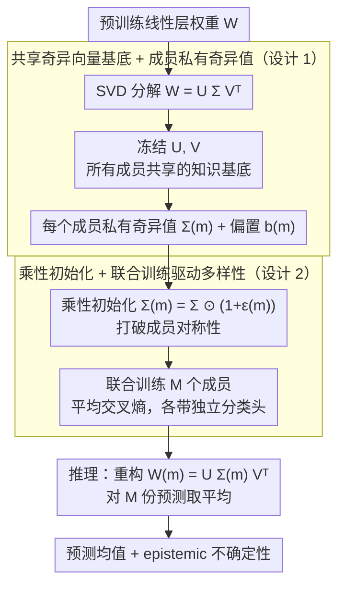

# Quantifying the Uncertainty of Foundation Models with Singular Value Ensembles

**会议**: ICML 2026  
**arXiv**: [2601.22068](https://arxiv.org/abs/2601.22068)  
**代码**: https://github.com/moturkoglu/Singular-Value-Ensemble  
**领域**: AI 安全 / 不确定性量化  
**关键词**: 不确定性量化, 隐式集成, 奇异值微调, 参数高效, 校准  

## 一句话总结
Singular Value Ensemble（SVE）把"集成多样性"做成纯粹由 SVD 奇异值的不同重新加权来表达——冻结预训练权重的左右奇异向量（共享的"知识基底"），只为每个集成成员训一组独立的奇异值，参数开销 $\lesssim1\%$ 而校准质量接近真正的 Deep Ensemble，把 UQ 带进了 PEFT 友好的资源受限场景。

## 研究背景与动机

**领域现状**：深度模型在高风险场景（医学诊断、自动驾驶、农业决策）部署越来越多，但它们用最大似然训出来普遍过自信，"不知道自己不知道"。量化认识不确定性（epistemic uncertainty）的金标准仍然是 Deep Ensemble——独立训 $M$ 个模型再做平均，校准、OOD 检测全面优于 MC-Dropout 等单模型近似。

**现有痛点**：Deep Ensemble 的训练成本和显存成本都按 $M$ 倍线性增长，对动辄数十亿参数的 foundation 模型几乎不可承受，连 $M=4$ 都吃不消。隐式集成（BatchEnsemble 的秩 1 扰动、MIMO、FiLM-Ensemble、LoRA-Ensemble）试图共享主干、只为每个成员加少量参数，但仍要"从零学一组对最终预测有用的新方向"——这些新参数没有继承预训练的语义先验。另一边，单模型 Bayes（Laplace-LoRA、BLoB、C-LoRA、SNGP）虽然参数少，却要么需要复杂的后验拟合、要么在 transformer 上水土不服。

**核心矛盾**：现代的 PEFT 范式（LoRA、Adapter、Prompt-Tuning）已经把"微调"成本压到极致，但"UQ"还停留在贵族阶段，二者形成结构性鸿沟。

**本文目标**：在 $<1\%$ 参数开销内，给出一个隐式集成方法，既能复用预训练 foundation 模型的"知识基底"，又能让成员之间产生足够多样的预测分布以衡量 epistemic uncertainty。

**切入角度**：作者诉诸近几年在可解释性与 PEFT 上累积的一条共识——"知识在权重空间中沿线性子空间组织"。SVF（Sun et al., 2022）就发现，冻结预训练权重的奇异向量、只微调奇异值，已经能完成多种下游适配，因为奇异值起到"对预训练表征重新加权"的作用。

**核心 idea**：既然不同的奇异值再加权能得到功能上不同的模型，那么"每个成员只学一组奇异值、共享预训练奇异向量"就天然构成一个保留预训练先验的隐式集成。

## 方法详解

### 整体框架
SVE 的目标是在 $<1\%$ 参数开销内给 foundation 模型加一层 epistemic 不确定性，而不重复训整套模型。它对每个想集成的线性层 $\mathbf{W}\in\mathbb{R}^{m\times n}$ 先做一次 SVD $\mathbf{W}=\mathbf{U}\boldsymbol{\Sigma}\mathbf{V}^{\top}$，把左右奇异向量 $\mathbf{U},\mathbf{V}$ 冻结成所有成员共享的"知识基底"，只让每个集成成员 $m$ 私有一组可训练奇异值 $\boldsymbol{\Sigma}^{(m)}$ 和一份偏置 $\mathbf{b}^{(m)}$，于是第 $m$ 个成员前向用 $\mathbf{W}^{(m)}=\mathbf{U}\boldsymbol{\Sigma}^{(m)}\mathbf{V}^{\top}$、输出 $\mathbf{y}^{(m)}=\mathbf{W}^{(m)}\mathbf{x}+\mathbf{b}^{(m)}$。$M$ 个成员（各带独立分类头）联合训练，推理时按 Deep Ensemble 标准做法对 $M$ 份预测取平均，多样性完全来自奇异值的不同重新加权。

### 关键设计

**1. 共享奇异向量基底 + 成员私有奇异值：把集成多样性压成对同一子空间的不同强度组合**

显式集成（Deep Ensemble）和隐式集成（LoRA-Ensemble）的痛点都在"新参数"——前者每个成员一份完整权重副本，后者每个成员要从零学一组对预测有用的低秩新方向，这组新方向不继承任何预训练语义。SVE 的做法是把权重 $\mathbf{W}$ 拆成 $\mathbf{U}\boldsymbol{\Sigma}\mathbf{V}^{\top}$ 后冻结方向、只在成员维度上各向异性地重缩放奇异值：前人对 transformer 权重可解释性的研究把左右奇异向量看作"语义方向"、奇异值看作各方向的相对重要性，于是每个成员相当于在同一组解释方向上拉出一组不同的"权重画像"。代价是每层每成员只增 $\min(m,n)$ 个标量（外加可选偏置），总参数开销约 $(M-1)\cdot 5/(4d)$——对 $d\!=\!4096$ 的 LLaMA-2-7B，即便 $M\!=\!16$ 也只 $\approx 0.2\%$。这既绕开了 LoRA-Ensemble 新参数"冷启动"的问题，又把"哪些方向放大、哪些方向收回"当成唯一的多样性自由度，从而在保留预训练先验的同时产生功能差异；本质上是把 SVF 的单模型适配范式推广到了集成式 UQ。

**2. 乘性初始化 + 联合训练驱动的多样性：不加任何正则就让 $M$ 个成员收敛到不同解**

成员共享同一基底，若初始化也一样就会塌缩成同一个解、失去集成意义。SVE 用乘性扰动打破对称性：$\boldsymbol{\Sigma}^{(m)}=\boldsymbol{\Sigma}\odot(1+\boldsymbol{\epsilon}^{(m)})$，其中 $\boldsymbol{\epsilon}^{(m)}\!\sim\!\mathcal{N}(\mathbf{0},\sigma_{\text{init}}^2\mathbf{I})$（默认 $\sigma_{\text{init}}=0.01$，约 1% 相对偏移），偏置则用加性扰动 $\mathbf{b}^{(m)}=\mathbf{b}+\boldsymbol{\eta}^{(m)}$；联合训练时不同 mini-batch 的随机梯度会把这点初始破缺逐步放大，使各成员收敛到同一基底下的不同奇异值组合，前向再用 clamp(min=0) 保证 $\boldsymbol{\Sigma}^{(m)}$ 非负。之所以用乘性而非加性扰动，是因为噪声幅度会自适应于奇异值大小——重要方向扰动绝对值大、次要方向小，既不破坏奇异值的相对排序又保证扰动有意义。这相当于把 Deep Ensemble"不同随机种子收敛到不同模式"的机制，换成了"共享基底 + 极小扰动"的廉价翻版。

> 方法的全部前提是"预训练奇异向量已经是有意义的语义方向"——这个假设强弱直接决定 SVE 该不该用。作者用一条可证伪的尺度律来验证（详见「实验关键数据」与「亮点与洞察」）：固定 ViT-S 架构、只换 backbone（随机初始化 → DINOv1 → DINOv2），SVE 的相对增益单调上升，弱 backbone 下反而最差。这条经验定律给方法划清了适用边界，本身不是一个设计选择，故不单列为关键设计。

### 损失函数 / 训练策略
唯一损失是 $M$ 个成员的平均交叉熵 $\mathcal{L}=\frac{1}{M}\sum_m \mathcal{L}_{\text{CE}}(f^{(m)}(\mathbf{x}),\mathbf{t})$，所有成员同步训练、不加额外正则；每个成员配独立分类头（额外 $M\cdot d\cdot C$ 参数，相对总量可忽略）。成员数视任务而定——视觉任务 $M=4$、SST-2 用 $M=8$、ARC-Easy 用 $M=16$；$\sigma_{\text{init}}$ 在 0.001 到 0.1 之间均稳健，默认 0.01。还可只对部分线性层（如仅 attention 投影）应用 SVE 进一步压参数。

## 实验关键数据

### 主实验

| 数据集 / 主干 | 方法 | Acc ↑ | ECE ↓ | NLL ↓ | Brier ↓ |
|---------------|------|-------|-------|-------|---------|
| Flowers102 / DINO ViT-S | Single | 86.3 | 3.9 | 0.56 | 0.20 |
| Flowers102 / DINO ViT-S | Deep Ensemble (M=4) | 91.5 | 0.9 | 0.33 | 0.12 |
| Flowers102 / DINO ViT-S | LoRA-Ensemble (M=4) | 94.6 | 1.1 | 0.21 | 0.08 |
| Flowers102 / DINO ViT-S | **SV-Ensemble (M=4)** | **95.4** | 1.0 | **0.18** | **0.07** |
| Oxford Pets / DINOv2 ViT-S | Deep Ensemble (M=4) | 89.2 | 13.3 | 0.43 | 0.17 |
| Oxford Pets / DINOv2 ViT-S | LoRA-Ensemble (M=4) | 86.1 | 9.0 | 0.49 | 0.22 |
| Oxford Pets / DINOv2 ViT-S | **SV-Ensemble (M=4)** | **90.1** | **2.2** | **0.30** | **0.15** |
| SST-2 / BERT-base | Deep Ensemble (M=8) | **93.2** | 4.7 | 0.23 | — |
| SST-2 / BERT-base | LoRA-Ensemble (M=8) | 92.7 | 3.8 | 0.21 | — |
| SST-2 / BERT-base | **SV-Ensemble (M=8)** | 92.0 | **2.8** | **0.21** | — |
| ARC-Easy / LLaMA-2-7B | Deep Ensemble (M=3) | 85.8 | 9.9 | 0.83 | — |
| ARC-Easy / LLaMA-2-7B | LoRA-Ensemble (M=5) | 86.0 | 9.0 | 0.92 | — |
| ARC-Easy / LLaMA-2-7B | Bayes-LoRA (LA) | 85.1 | 5.4 | 0.49 | — |

### 消融实验（核心组件 / 配置）

| 配置 | 关键结论 | 出处 |
|------|----------|------|
| 不同 backbone 质量（Random / DINOv1 / DINOv2） | SVE 相对增益随表征质量单调上升，DINOv2 上超 Deep Ensemble | Fig. 2 |
| 仅冻结 $\mathbf{U},\mathbf{V}$ vs 只调 $\boldsymbol{\Sigma}$（Single w/ SVF） | 单模型 SVF 已经稳定优于 Single（如 Flowers102 86.3→91.8） | Table 1 |
| 不同 $M$（$M\!=\!4/8/16$） | $M$ 越大校准越好，但 SVE 单 $M$ 增量参数 $\sim$ 千分之几 | Appendix B |
| $\sigma_{\text{init}}$ 在 $0.001\sim 0.1$ | 表现鲁棒，无需精调 | Appendix C |
| 部分层 SVE（仅 attention 投影） | 可进一步压参数，精度小幅损失 | Appendix D |

### 关键发现
- 校准是 SVE 真正的杀手锏：在 ARC-Easy 上 SVE 的 ECE 显著低于所有显式/隐式集成基线，接近联合学均值/协方差的 Bayes 方法（如 BLoB），却不需要复杂的后验拟合。
- Oxford Pets 这种"少样本 + 短训"场景揭示了对比方法的脆弱性：BatchEnsemble ECE 48.7%、Deep Ensemble 也烂到 13.3%、LoRA-Ensemble 9.0%，而 SVE 仍是 2.2%——说明共享预训练基底在低资源设置下提供了正则化效应，多样性来自奇异值重塑而非新参数的过拟合。
- 单成员 SVF（即把 $M$ 退化成 1）已经普遍超过普通微调，说明"只学奇异值"作为 PEFT 本身就有竞争力；SVE 等于在此基础上把"集成"的额外维度也无痛接入。
- 方法的"软肋"在弱 backbone 上：随机初始化的 ViT 上 SVE 最差，符合作者预设——没有有意义的奇异向量基底可共享时，重新加权机制就失去物理意义。这反过来也是个适用边界检验。

## 亮点与洞察
- 把"集成多样性"重新定义在一个语义化的子空间中：不再让成员从零学新方向，而让它们对同一组"知识方向"做不同的强度组合，是一种相当节俭的多样性范式。可类比迁移到："多任务"——给每个任务一组奇异值；"个性化"——给每个用户一组奇异值；"持续学习"——奇异值差量记录任务知识。
- 用 backbone 强弱反向验证方法假设：作者没有满足于"我们更好"，而是设计 Random→DINOv1→DINOv2 的尺度律实验，明示自身方法在何时崩、在何时赢。这是研究方法论上的好示范，比一律刷榜更有说服力。
- 参数开销公式 $(M-1)\cdot 5/(4d)$ 给出了清晰的工程预算：对 LLaMA-2-7B（$d=4096$）来说 $M=16$ 也只有 $\approx 0.2\%$，意味着可以把 UQ 当作"标配"放进任何 PEFT 流程，不必再做架构妥协。

## 局限与展望
- 全文未对比"成员之间真正的预测多样性"是否随 $M$ 饱和：奇异向量被锁住后，成员只能在同一组方向上调强弱，可能存在表达力上限，$M$ 超过某个阈值后多样性收益消失，论文对这一边界讨论不深。
- 大模型实验仅到 LLaMA-2-7B，且只在 ARC-Easy 单任务做了 LLM 评估；在 LLaMA-3、Qwen 等更新模型以及生成式任务（开放式 QA、代码生成）的 UQ 行为没有覆盖，尤其是 token 级 calibration 是否同样改善还是开放问题。
- 自己看：$\boldsymbol{\Sigma}^{(m)}$ 的非负约束用 clamp(min=0) 在训练中是不可导边界，理论上会偶发梯度截断；用 softplus 等平滑约束可能更稳，但作者未做对比。
- 推理时仍需要为每个成员显式重构 $\mathbf{W}^{(m)}=\mathbf{U}\boldsymbol{\Sigma}^{(m)}\mathbf{V}^{\top}$，对 $D$ 较大的 LLaMA 层意味着 $M$ 次重建开销；论文承认参数量便宜，但 wall-clock 推理代价随 $M$ 增长，工程上仍需调优。

## 相关工作与启发
- **vs Deep Ensemble**：标准做法、最强 baseline，但参数与计算 $M\times$；SVE 把 $M$ 项独立模型挤进同一组奇异向量底，参数 $\lesssim1\%$ 而校准追平甚至反超。
- **vs LoRA-Ensemble**：同样是隐式集成；LoRA-Ensemble 给每个成员加 $\mathcal{O}((m+n)r)$ 个新参数学习"低秩更新"，SVE 只学 $\min(m,n)$ 个奇异值且不引入任何"新方向"，参数更省且依赖预训练先验。
- **vs SVF / SVFit**：SVF 把"只调奇异值"用于单模型适配；SVE 把同一原语用于集成，主张奇异向量是 backbone 知识的共享语言。
- **vs BatchEnsemble**：BatchEnsemble 用秩 1 缩放向量乘共享权重，SVE 在 SVD 域里做同样的"逐方向缩放"，但缩放对象是有语义的奇异方向而不是任意基。
- **vs Bayes-LoRA / BLoB / C-LoRA**：这些方法用后验近似量化不确定性，理论严谨但实现复杂；SVE 用集成范式间接逼近后验，实现简单且 ECE 已与之相当。

<!-- RELATED:START -->

## 相关论文

- [\[ICML 2026\] End-to-End Compression for Tabular Foundation Models](end-to-end_compression_for_tabular_foundation_models.md)
- [\[NeurIPS 2025\] Hankel Singular Value Regularization for Highly Compressible State Space Models](../../NeurIPS2025/model_compression/hankel_singular_value_regularization_for_highly_compressible_state_space_models.md)
- [\[ICML 2026\] BioArc: Discovering Optimal Neural Architectures for Biological Foundation Models](bioarc_discovering_optimal_neural_architectures_for_biological_foundation_models.md)
- [\[ICML 2026\] PRISM: Synergizing Vision Foundation Models via Self-Organized Expert Specialization](prism_synergizing_vision_foundation_models_via_self-organized_expert_specializat.md)
- [\[ICML 2026\] Partial Fusion of Neural Networks: Efficient Tradeoffs Between Ensembles and Weight Aggregation](partial_fusion_of_neural_networks_efficient_tradeoffs_between_ensembles_and_weig.md)

<!-- RELATED:END -->
