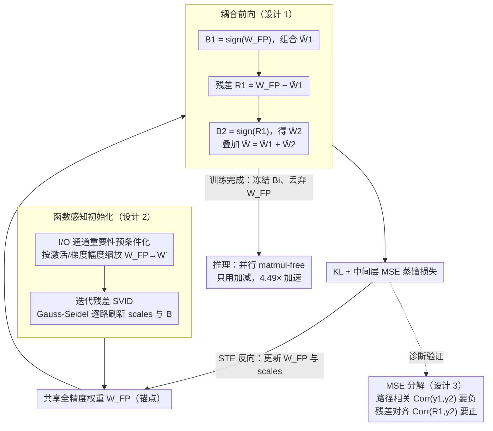

# RaBiT: Residual-Aware Binarization Training for Accurate and Efficient LLMs

**会议**: ICML 2026  
**arXiv**: [2602.05367](https://arxiv.org/abs/2602.05367)  
**代码**: 待确认  
**领域**: 模型压缩 / LLM 量化 / 二值化  
**关键词**: 残差二值化, 量化感知训练, LLM, 路径协同适应, matmul-free 推理  

## 一句话总结
本文针对残差二值化 LLM 中"并行二值路径学到冗余特征"这一被作者命名为 inter-path adaptation 的失败模式，提出 RaBiT——用单一共享的全精度权重在线派生所有二值路径并配合函数感知初始化，从而结构性地强制残差层级，使 2-bit Llama2-7B 在 matmul-free 架构下首次反超 VQ 强基线（Wiki2 PPL 5.78 vs QTIP 5.86），同时获得 4.49× 推理加速。

## 研究背景与动机

**领域现状**：LLM 部署到极致压缩比时，4-bit 量化（GPTQ、AWQ）已经成为工业标准，但前沿正在向 2-bit 推进。2-bit 区域有两条主要路线：(i) 向量量化 VQ（AQLM、QuIP#、QTIP）通过查表或复杂旋转保留较高精度，但硬件开销大；(ii) 残差二值化通过堆叠多个 $\{\pm1\}$ 二值层，天然支持 matmul-free（只用加减）的极致高效执行。残差二值化的核心承诺是"后续路径补偿前面路径的误差"，从而以二值的代价获得接近多比特的表达力。

**现有痛点**：尽管残差结构看起来很美，但在 QAT 训练中始终不稳定。作者深入分析发现，标准 QAT 把同一个全局梯度同时作用到所有并行路径，这会驱使每条路径在"竞速降低同一全局损失"中学到几乎一样的特征——即 Hinton 2012 命名的"feature co-adaptation"在残差二值化中的具体表现，作者称为 inter-path adaptation。结果是误差补偿层级被破坏，模型表达力被严重削弱。

**核心矛盾**：MSE 分解告诉我们路径间必须负相关、第二条路径必须主动对齐第一条路径的残差，模型才能真正发挥多路径的容量；但标准 QAT 的对称结构和共享梯度让路径几乎独立、关联接近零，于是堆叠多路径只是徒增参数，没有起到误差补偿的作用。以往工作（DB-LLM、MBOK）依赖启发式约束（路径冻结、机械分裂）来打破这种对称，但要么牺牲了联合优化空间，要么虽然制造了负相关但残差对齐很差。

**本文目标**：(i) 给出 inter-path adaptation 的形式化诊断指标；(ii) 在算法层面而非启发式层面把残差层级写进训练循环；(iii) 解决 2-bit QAT 初始化对最终精度的强敏感性。

**切入角度**：既然问题根源是"两条路径各自维护独立的潜变量权重 + 共享全局梯度"，那就反过来——只保留一个全精度权重 $\mathbf{W}_{\mathrm{FP}}$ 作为锚点，每个 step 现场从它派生出第一条路径与残差，再从残差派生第二条路径，让"第二条路径补偿第一条"成为图结构上的硬约束而不是 loss 上的软鼓励。

**核心 idea**：用一个共享全精度权重在线串联派生所有二值路径（耦合前向），让残差层级在每个 step 都被自动重建；再用 Iterative Residual SVID + I/O 通道重要性预条件化提供一个"保功能而非保权重"的稳定初始化。

## 方法详解

### 整体框架
RaBiT 想根治 2-bit 残差二值化的训练病：标准 QAT 给每条二值路径各配一套独立潜权重、再用同一个全局梯度去推它们，结果两条路径学成一对冗余的双胞胎，"后路补前路误差"的承诺落空。RaBiT 的破法是只留一个共享全精度权重 $\mathbf{W}_{\mathrm{FP}}$ 当锚点，每个前向 step 现场从它串联派生出第一条路径、再从残差派生第二条路径，让"第二条补第一条"变成计算图上的硬约束；同时配一套函数感知初始化把 QAT 的起点扶稳。推理时把训练好的二值矩阵 $\mathbf{B}_i$ 冻结、丢掉 $\mathbf{W}_{\mathrm{FP}}$，就回到原来并行、只用加减的 matmul-free 架构，不增加任何部署开销。

二值基本块写作 $\hat{\mathbf{W}}=\mathbf{g}\odot\mathbf{B}\odot\mathbf{h}$，其中 $\mathbf{B}\in\{-1,+1\}^{d_{\text{out}}\times d_{\text{in}}}$、$\mathbf{g}\in\mathbb{R}^{d_{\text{out}}}$、$\mathbf{h}\in\mathbb{R}^{d_{\text{in}}}$，矩阵-向量乘 $\mathbf{y}=\mathbf{g}\odot(\mathbf{B}(\mathbf{h}\odot\mathbf{x}))$ 只用加减实现；2-bit 时堆叠 $k=2$ 条这样的二值块求和。

### 关键设计

**1. 耦合前向：用共享 FP 权重在线派生，把残差补偿写死进计算图**

inter-path adaptation 的病根在于以往做法给两条路径各存一套独立潜权重、结构上根本不区分"主路径"和"补偿路径"，于是梯度一锤同抡，两条路径必然学到几乎一样的特征。RaBiT 训练时只存一个 $\mathbf{W}_{\mathrm{FP}}$，每个 step 现场三步派生：先取 $\mathbf{B}_1=\text{sign}(\mathbf{W}_{\mathrm{FP}})$ 组合出 $\hat{\mathbf{W}}_1=\mathbf{g}_1\odot\mathbf{B}_1\odot\mathbf{h}_1$，再算残差 $\mathbf{R}_1=\mathbf{W}_{\mathrm{FP}}-\hat{\mathbf{W}}_1$，最后令 $\mathbf{B}_2=\text{sign}(\mathbf{R}_1)$，有效权重 $\hat{\mathbf{W}}^{(2)}=\hat{\mathbf{W}}_1+\hat{\mathbf{W}}_2$。因为第二条路径被写成第一条残差的函数，即便梯度照样同抡，结构本身也强制 $\mathbf{B}_2$ 永远在追 $\mathbf{R}_1$，补偿层级不再靠 loss 软鼓励而是图结构硬保证。反向用一个 STE 把 $\nabla_{\hat{\mathbf{W}}^{(2)}}\mathcal{L}=(\partial\mathcal{L}/\partial\mathbf{Y})\mathbf{X}^{\top}$ 直接灌给 $\mathbf{W}_{\mathrm{FP}}$，缩放向量 $\{\mathbf{g}_i,\mathbf{h}_i\}$ 仍保留为各路独立可学习参数、按常规链式法则更新（把动态派生的 $\mathbf{B}_i$ 视为常数）。一个意外的副产物：只维护一套全精度权重直接把优化器状态（Adam 的动量/方差）减半，省下 LLM 微调中最稀缺的显存。

**2. 函数感知初始化：迭代残差 SVID + I/O 通道重要性预条件化，让起点保功能而非保权重**

2-bit QAT 对起点极其敏感，而标准 SVID 初始化是贪心的——第一条路径独占最优拟合，会把残差结构推进很差的局部极小，后续路径再怎么救也回不来。RaBiT 分两步治这个病。先做预条件化：用校准集上的输入激活幅度 $\mathbf{s}_{\text{in}}$ 和输出梯度幅度 $\mathbf{s}_{\text{out}}$ 把权重缩到 $\mathbf{W}'=\mathbf{s}_{\text{out}}^{\alpha_{\text{out}}}\odot\mathbf{W}_{\mathrm{FP}}\odot\mathbf{s}_{\text{in}}^{\alpha_{\text{in}}}$，把分解资源集中到功能上真正敏感的通道（Fisher / K-FAC 的局部敏感性直觉），避免等权拟合所有通道。再做迭代残差 SVID：以 Gauss-Seidel 风格在 $T$ 轮里逐路刷新 $(\mathbf{B}_i,\mathbf{g}_i,\mathbf{h}_i)$，每轮先把"其他路径已经吃掉的部分"从 $\mathbf{W}'$ 减去，再用 SVID（基于秩-1 SVD 的幅度分解）拟合剩余残差，最后把缩放映射回原始域。两步分别解掉"路径间贪心耦合"和"少数通道才重要"这两个互相加剧的初始化病，Table 7 / Figure 5 显示二者各自贡献明显，组合后起点 loss 最低、QAT 启动期最稳。

**3. inter-path adaptation 诊断指标：用 MSE 分解出的双相关性，看清补偿到底成没成**

以往工作只盯最终 PPL，根本看不出"多路径为什么没起到补偿作用"。RaBiT 把 2-bit 残差网络 $y_s=y_1+y_2$ 的 MSE 展开成可读的量：$\text{MSE}(y_t,y_s)=C'+2\sigma_1\sigma_2\cdot\text{Corr}(y_1,y_2)$，并补一个等价视角 $\text{MSE}\approx\sigma_{R_1}^2+\sigma_{y_2}^2-2\sigma_{R_1}\sigma_{y_2}\cdot\text{Corr}(R_1,y_2)$，其中 $R_1=y_t-y_1$ 是第一条路径的功能残差。这给出两条独立判据——**路径相关** $\text{Corr}(y_1,y_2)$ 要足够负、**残差对齐** $\text{Corr}(R_1,y_2)$ 要足够正——前者保证两路不冗余，后者才真正衡量"第二路在追第一路的残差"。两指标一上手就把各方法看穿了：标准 QAT 路径相关≈0（压根没补偿）；DB-LLM 靠启发式把路径相关压到 -0.49，但残差对齐只有 0.26（是机械抵消而非追误差）；MBOK 略好仍偏弱；唯有 RaBiT 同时拿到高负相关（≈-0.35 到 -0.50）与高残差对齐（0.58–0.65），从机理上证明耦合训练真的让第二条路径在追功能残差，这也正是它在 PPL 上反超的原因。

### 损失函数 / 训练策略
总损失 $\mathcal{L}_{\text{total}}=\mathcal{L}_{\text{kl}}+\gamma\sum_i\mathcal{L}_{\text{inter},i}$，KL 散度蒸馏 + 中间层 MSE 蒸馏（Llama 取 $\gamma=100$；Gemma3 因激活幅度大取 $\gamma=0$）。在 WikiText-2 + C4 的 2 亿 token 校准集上用 Muon 优化器训 6 个 epoch，上下文 4096。论文附录 B 把 MSE 分析中的最优性扩展到 KL 目标。

## 实验关键数据

### 主实验
在 Llama2-7B/13B、Llama3-8B、Gemma3-1B/4B/12B 上对比 SOTA 2-bit 方法。

| 模型 / 数据 | 指标 | RaBiT (2-bit) | 之前最佳 (2-bit) | 全精度基线 (16-bit) |
|--------|------|------|----------|------|
| Llama2-7B Wiki2 | PPL ↓ | **5.78** | QTIP 5.86 / DBF 6.10 / MBOK 6.99 | 5.12 |
| Llama2-7B QA Avg | Acc ↑ | **61.51** | QTIP 58.97 / DBF 58.42 | 62.26 |
| Llama2-13B Wiki2 | PPL ↓ | 5.15 | QTIP 5.11（仅次） | 4.57 |
| Llama3-8B Wiki2 | PPL ↓ | **7.34** | QTIP 7.52 / QuIP# 8.70 / BitStack 2.75e3（崩） | 5.75 |
| Llama3-8B QA Avg | Acc ↑ | **64.13** | AQLM 64.12 / QTIP 63.88 | 68.66 |
| Gemma3-1B Wiki2 | PPL ↓ | **11.27** | QTIP 13.14 / DBF 13.28 | 9.80 |
| Llama2-13B 难任务平均 (BBH+GPQA+MMLU-Pro+IFEval) | Acc ↑ | **27.14** | QTIP 25.38 | 29.27 |
| Llama2-7B 端到端解码加速 | Speedup ↑ | **4.49×** vs FP16 | — | 1.00× |

### 消融实验

| 配置 | Llama2-7B Wiki2 PPL ↓ | 说明 |
|------|---------|------|
| Standard QAT（独立潜权重）| 6.55 | 基线，inter-path adaptation 严重 |
| Standard QAT + Iterative SVID 初始化 | 6.21 | 仅换初始化也有收益 |
| Standard QAT + I/O 重要性预条件化 | 6.31 | 单独的功能感知预条件化 |
| Standard QAT + 两者组合初始化 | 6.18 | 两者协同 |
| Coupled QAT（仅本文耦合前向）| 5.84 | 解决 inter-path adaptation 是主要收益 |
| Coupled QAT + SVID | 5.80 | |
| Coupled QAT + 预条件化 | 5.81 | |
| **RaBiT（全套）** | **5.78** | 完整方案 |

Table 1 的 MSE 分解给出机理验证：在 Llama2-7B 第 5 / 15 / 25 层，RaBiT 的残差对齐 Corr$(R_1,y_2)$ 分别达到 0.65 / 0.58 / 0.62，显著高于 DB-LLM 的 0.26 / 0.25 / 0.25，证明残差层级真的被恢复了。

### 关键发现
- 耦合训练贡献最大：从 Standard QAT 6.55 到 Coupled QAT 5.84 只换前向结构就拿到 0.71 PPL，远超初始化单独带来的 0.34；说明 inter-path adaptation 是 2-bit 残差架构的首要瓶颈，而非初始化。
- 两条改动协同：耦合 + 函数感知初始化各自贡献 ≈0.7 / 0.4 PPL，组合后到 5.78，没有明显的边际递减；说明二者互补，前者优化结构，后者优化起点。
- 反超 VQ：Llama2-7B 上 RaBiT 5.78 PPL 微优于 QTIP 5.86，且保留 matmul-free，在 RTX 4090 上 4.49× 推理加速；在 Llama3-8B 上更明显（7.34 vs 8.70），QuIP# 等 VQ 方法在新架构上明显退化。
- 训练显存减半：只维护一个 $\mathbf{W}_{\mathrm{FP}}$ 直接把优化器状态从 2 路减到 1 路，副作用是 QAT 显存压力大幅缓解。

## 亮点与洞察
- 把"残差补偿"从损失偏好升级为图结构强约束，这是非常优雅的范式切换——很多并行多路径架构（不只是二值化）都受困于路径冗余，"链式派生 + 共享锚点"的思路完全可以迁移到 MoE 路由、多分支蒸馏、低秩残差适配等场景。
- MSE 分解给出的双指标（Corr$(y_1,y_2)$ 与 Corr$(R_1,y_2)$）非常有解释力，揭示了 DB-LLM 那种"机械负相关"是假补偿，真正的补偿必须看残差对齐——这条诊断方法值得任何做残差/集成模型的人借鉴。
- 把缩放 $\{\mathbf{g}_i,\mathbf{h}_i\}$ 留作独立可学习参数而不是每步重算 SVD，是一个"结构上严格 + 优化上松弛"的精妙折中：算法保证误差层级，优化器仍能用 momentum 等状态对幅度做细调，免去 SVD 的高额计算。

## 局限与展望
- 难任务上仍有显著差距：BBH/GPQA/MMLU-Pro/IFEval 平均 27.14 vs 全精度 29.27 在 Llama2-13B 上还可以，但 Llama3-8B 的 25.12 vs 31.03 差距更明显，说明 2-bit 在复杂推理上仍未完全过关。
- IFEval 是个不一致的弱项：Llama3-8B 上 RaBiT 15.42 比 QTIP 15.60 还略低且远低于基线 32.51，说明指令遵循类的"格式敏感性"在二值化下损失严重，需要更针对性的训练。
- Llama2-13B 上 RaBiT 5.15 PPL 略输 QTIP 5.11，作者归因为模型越大 VQ 越占便宜，但没有提出针对大模型的进一步改进。
- 共享权重训练时每步要重做派生，单 step 计算量增加；论文没有详细给出训练吞吐量与标准 QAT 的对比，工程实现上的额外开销在长训练 schedule 下值得关注。
- 框架只验证了 $k=2$（即 2-bit），$k\ge 3$ 时链式派生的数值稳定性、梯度信号是否依然清晰未做实验。

## 相关工作与启发
- **vs DB-LLM [Chen 2024]**: 用启发式分裂强制路径负相关，但残差对齐很差；本文揭示了"负相关 ≠ 真补偿"，残差对齐才是关键指标，并用结构约束让两者同时满足。
- **vs MBOK [Tran & Nguyen 2025]**: 用路径冻结避免协同适应，本质上是限制了联合优化空间；本文允许全部参数联合优化，靠图结构而非冻结来约束行为。
- **vs DBF [Boža & Macko 2025]**: 也强调函数保留，本文进一步把这一思想落到初始化的"I/O 重要性预条件化"上，并且和耦合训练正交可叠加。
- **vs QTIP / QuIP# / AQLM 等 VQ**: 这些方法用查表换精度，硬件不友好；本文证明 matmul-free 残差二值化在精度上也能追平甚至反超，是对"2-bit 必须靠 VQ"这一行业默认假设的有力反驳。

## 评分
- 新颖性: ⭐⭐⭐⭐ "用结构约束代替启发式"+"用残差对齐而非路径相关诊断"两点都很新。
- 实验充分度: ⭐⭐⭐⭐⭐ 覆盖 Llama2/3、Gemma3 共 6 个模型，含 PPL、QA、BBH/GPQA/MMLU-Pro/IFEval、推理速度、MSE 分解、消融。
- 写作质量: ⭐⭐⭐⭐⭐ 问题诊断、机理证明、消融对齐做得非常工整，是 LLM 量化少见的"机理论文"。
- 价值: ⭐⭐⭐⭐⭐ 首次让 matmul-free 2-bit 反超 VQ 强基线并保持 4.49× 加速，是 2-bit 部署落地的重要里程碑。

<!-- RELATED:START -->

## 相关论文

- [\[ICML 2026\] ReSpinQuant: Efficient Layer-Wise LLM Quantization via Subspace Residual Rotation Approximation](respinquant_efficient_layer-wise_llm_quantization_via_subspace_residual_rotation.md)
- [\[ICML 2026\] RQ-MoE: Residual Quantization via Mixture of Experts for Efficient Input-Dependent Vector Compression](rq-moe_residual_quantization_via_mixture_of_experts_for_efficient_input-dependen.md)
- [\[ICLR 2026\] Compute-Optimal Quantization-Aware Training](../../ICLR2026/model_compression/compute-optimal_quantization-aware_training.md)
- [\[ACL 2026\] CadLLM: Improving the Throughput of Diffusion-based LLMs via Training-Free Confidence-Aware Calibration](../../ACL2026/model_compression/improving_the_throughput_of_diffusion-based_large_language_models_via_a_training.md)
- [\[ICLR 2026\] What Layers When: Learning to Skip Compute in LLMs with Residual Gates](../../ICLR2026/model_compression/what_layers_when_learning_to_skip_compute_in_llms_with_residual_gates.md)

<!-- RELATED:END -->
