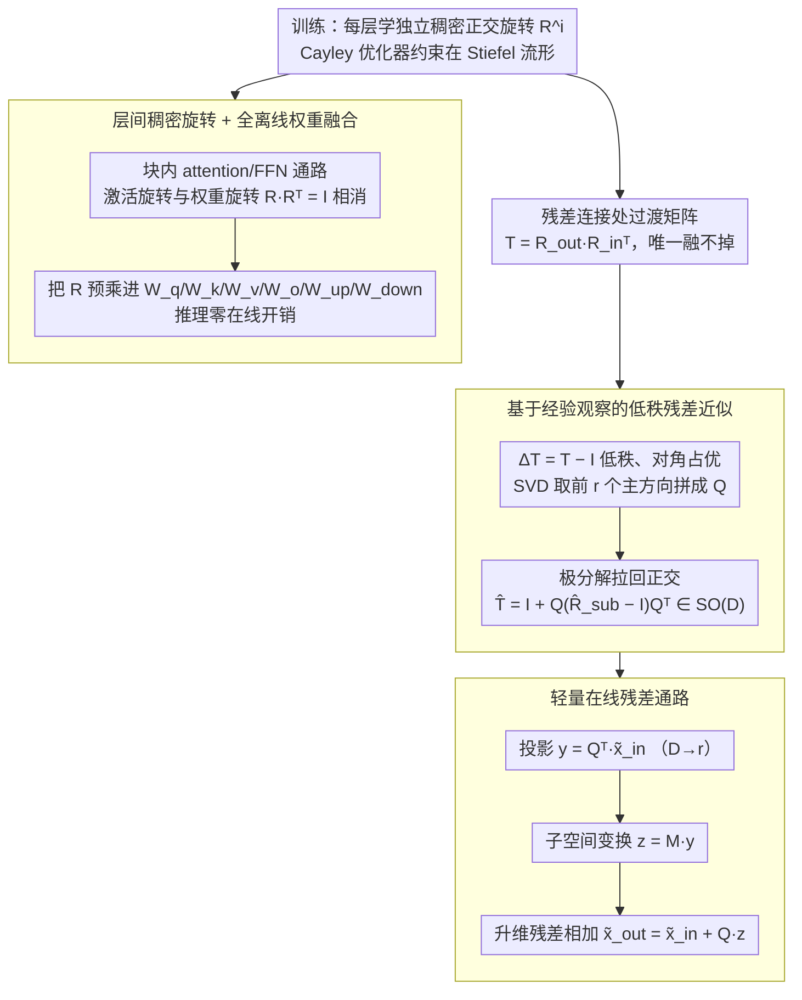

# ReSpinQuant: Efficient Layer-Wise LLM Quantization via Subspace Residual Rotation Approximation

**会议**: ICML 2026  
**arXiv**: [2604.11080](https://arxiv.org/abs/2604.11080)  
**代码**: 待确认  
**领域**: 模型压缩  
**关键词**: LLM 量化, 旋转量化, 层间旋转, 子空间近似, 残差对齐  

## 一句话总结
ReSpinQuant 在低比特 LLM PTQ 中同时保留"全局旋转可与权重融合"和"层间旋转可适配各层离群点"两大优点，靠的是把残差连接处不可消去的旋转过渡矩阵 $\mathbf{T}=\mathbf{R}_{out}\mathbf{R}_{in}^{\top}$ 用一个秩 $r\!\approx\!32$ 的子空间正交近似替代，在线开销只增加 $\sim0.2\%$，W4A4/W3A3 上同时压过 SpinQuant 和 FlatQuant。

## 研究背景与动机

**领域现状**：LLM 的低比特 PTQ 主流路线已经从单纯的权重量化（GPTQ、AWQ）走到"权重+激活"双量化（W4A4 乃至 W3A3），而处理激活离群点的关键工具是基于正交旋转的方法。QuaRot 用随机 Hadamard 矩阵把离群通道的能量均摊到所有维度，SpinQuant 进一步把旋转矩阵设成可学习并用 Cayley 优化器约束在正交流形上。

**现有痛点**：旋转策略目前分裂成两派，各有硬伤。**全局旋转**给整模型一个共享的 $\mathbf{R}$，使得激活旋转 $\mathbf{X}\mathbf{R}$ 可以提前融合进上一层权重 $\mathbf{W}\mathbf{R}$，推理零额外开销；但所有层共用一个基底，无法贴合各层异质的离群分布。**层间旋转**（FlatQuant、OSTQuant、ButterflyQuant、ParoQuant）给每层独立的 $\mathbf{R}^i$，精度更高，但相邻层基底不一致，激活旋转无法预融合，必须在线计算，FlatQuant 的 Kronecker 形式仍要 $\mathcal{O}(D^{1.5})$ MAC、ButterflyQuant 也要 $\mathcal{O}(D\log D)$。为了压住在线开销，这些工作只能用结构化矩阵（缩放、Butterfly、Kronecker）替代稠密旋转，再次牺牲表达力。

**核心矛盾**：在残差连接处，$\tilde{x}_{out}=\mathbf{R}_{out}\mathbf{R}_{in}^{\top}\tilde{x}_{in}+\mathbf{R}_{out}\,\text{Block}(\mathbf{R}_{in}^{\top}\tilde{x}_{in})$ 中过渡矩阵 $\mathbf{T}=\mathbf{R}_{out}\mathbf{R}_{in}^{\top}$ 只有在 $\mathbf{R}_{in}=\mathbf{R}_{out}$ 时才能退化成单位阵，被消掉。这就是"表达力"与"在线开销"二选一的根源。

**本文目标**：（1）保留稠密、层间独立的旋转矩阵，把表达力推满；（2）所有 attention/FFN 块内的旋转都离线融进权重；（3）只为残差连接处的基底过渡支付近似可忽略的在线代价。

**切入角度**：作者观察到，从 Hadamard 初始化出发、用 Cayley 优化器训出来的 $\mathbf{R}$ 离初始值非常近——Frobenius 范数偏移小、与初值余弦相似度始终接近 1。直接推论是 $\mathbf{T}=\mathbf{R}_{out}\mathbf{R}_{in}^{\top}\approx \mathbf{H}\mathbf{H}^{\top}=\mathbf{I}$，也就是说 $\Delta\mathbf{T}=\mathbf{T}-\mathbf{I}$ 是个低秩、对角占优的"小扰动"。

**核心 idea**：既然 $\Delta\mathbf{T}$ 主能量集中在很小的子空间，那就在该子空间内做一次稠密的正交旋转矫正，正交补空间走恒等映射，把 $\mathcal{O}(D^2)$ 的稠密对齐压成 $\mathcal{O}(rD)$ 的低秩对齐。

## 方法详解

### 整体框架
ReSpinQuant 想要的是"既保留层间稠密旋转的表达力、又不在推理时多付在线代价"。它给每个 transformer 层独立学一组稠密 $D\times D$ 正交矩阵，训练时把参数空间撑到 $\mathcal{O}(L\cdot D^2)$ 让旋转充分贴合各层离群分布；推理时把块内旋转通过数学消去全部融进权重，只在跨层残差这个唯一融不掉的地方留一个低秩在线模块，最终在线参数压到 $\mathcal{O}(L\cdot rD)$。一句话就是"训练大、推理小"。训练学到的稠密旋转沿两条路走：块内 attention/FFN 通路上激活旋转与权重旋转相消、整体离线融进权重（零在线开销）；跨层残差处冒出唯一融不掉的过渡矩阵，被压成低秩近似后用一条只在 $r$ 维子空间里算的在线通路对齐。

### 关键设计

**1. 层间稠密旋转 + 全离线权重融合：让每层有独立稠密旋转，却不在推理时显式出现**

层间方案精度高的根源是给每层一个独立基底，但稠密 $\mathbf{R}^i\in\mathbb{R}^{D\times D}$ 一旦显式留在推理通路上就要在线算，于是 OSTQuant、FlatQuant 之类被迫退回结构化矩阵（前者是 $\mathcal{O}(D)$ 对角缩放，后者是 Kronecker），牺牲表达力换效率。ReSpinQuant 具体给每层配 4 个稠密旋转：$\mathbf{R}_1^i$ 旋转 MHSA 输入与 FFN 输出、$\mathbf{R}_2^i$ 旋转 FFN 输入与 MHSA 输出、$\mathbf{R}_3^i$ 作用在 attention 内部（如 V 投影后），另有 $\mathbf{R}_4,\mathbf{R}_5$ 用 Fast Hadamard Transform 实现以处理 SpinQuant 协议中的特定激活通路。每条 attention/FFN 通路都让激活旋转与权重旋转相互抵消：先用 $\mathbf{R}^i$ 旋转激活，再用其转置旋转下一权重的输入侧、本权重的输出侧，因为 $\mathbf{R}\mathbf{R}^{\top}=\mathbf{I}$，这对旋转在数学上恰好消去。既然能消去，就可以在量化之前把所有 $\mathbf{R}$ 系数预乘进 $\mathbf{W}_q,\mathbf{W}_k,\mathbf{W}_v,\mathbf{W}_o,\mathbf{W}_{up},\mathbf{W}_{down}$（例如 $\tilde{\mathbf{W}}_v=\mathbf{R}_1^{i\top}\mathbf{W}_v\mathbf{R}_3$、$\tilde{\mathbf{W}}_o=\mathbf{R}_3^{i\top}\mathbf{W}_o\mathbf{R}_2$）。结果是训练时可学习参数高达 $1091.0\text{M}$（约 SpinQuant 的 63×），推理时这些参数 100% 隐入权重、online 参数只剩 $8.4\text{M}$——稠密矩阵之所以以前不能用，正是因为吸收不掉，而这套吸收机制把"用稠密"和"零在线"这对矛盾解开了。

**2. 基于经验观察的低秩残差近似：把残差处唯一融不掉的过渡矩阵压成低秩**

块内旋转能消去，但残差连接处会冒出一个 $\mathbf{T}=\mathbf{R}_{out}\mathbf{R}_{in}^{\top}$，只有 $\mathbf{R}_{in}=\mathbf{R}_{out}$ 时才退化成单位阵，否则这个稠密 $D\times D$ 矩阵必须在线算 $\mathcal{O}(D^2)$。作者的观察是：从 Hadamard 初始化出发、被 Cayley 优化器约束的 $\mathbf{R}$ 几乎不离初值，可视化 $\mathbf{R}_1^{\top}\mathbf{R}_2$ 子块呈对角占优且稀疏，于是 $\mathbf{T}\approx\mathbf{H}\mathbf{H}^{\top}=\mathbf{I}$，扰动 $\Delta\mathbf{T}=\mathbf{T}-\mathbf{I}$ 集中在极少数主方向上。据此对 $\Delta\mathbf{T}$ 做 SVD，取前 $r$ 个左奇异向量拼成 $\mathbf{Q}\in\mathbb{R}^{D\times r}$，把完整过渡矩阵投影进该子空间得 $\mathbf{T}_{\text{sub}}=\mathbf{Q}^{\top}\mathbf{T}\mathbf{Q}$。但直接截断的低秩近似不再正交，会破坏旋转方法对量化误差的边界保证，所以再补一步极分解 $\hat{\mathbf{R}}_{\text{sub}}=\mathbf{U}_{sub}\mathbf{V}_{sub}^{\top}$ 把它拉回 $SO(r)$，最终 $\hat{\mathbf{T}}=\mathbf{I}+\mathbf{Q}(\hat{\mathbf{R}}_{\text{sub}}-\mathbf{I}_r)\mathbf{Q}^{\top}$ 整体仍属于 $SO(D)$。复杂度因此从 $\mathcal{O}(D^2)$ 降到 $\mathcal{O}(rD)$，而精度几乎不丢，因为基底失配本就是低秩的。

**3. 轻量在线残差通路：用三步投影完成对齐，路径上不出现任何 $D\times D$ 乘法**

有了 $\hat{\mathbf{T}}$ 还需要让它在推理时真的便宜。ReSpinQuant 不显式构造 $D\times D$ 的 $\hat{\mathbf{T}}$，而是把更新写成三步流水：先投影 $y=\mathbf{Q}^{\top}\tilde{x}_{in}\in\mathbb{R}^r$ 降到 $r$ 维，再做子空间变换 $z=\mathbf{M}y$（其中 $\mathbf{M}=\hat{\mathbf{R}}_{\text{sub}}-\mathbf{I}_r$ 把恒等项和残差加法合并进一个小矩阵），最后升维并残差相加 $\tilde{x}_{out}=\tilde{x}_{in}+\mathbf{Q}z$。整条路径所有非平凡运算都发生在 $r$ 维小空间里，没有任何 $D\times D$ 矩阵乘法。这套"投影到主子空间—在小空间内完成全部非平凡变换—再升回原维度"的范式与 LoRA 同构，区别在于它用于推理期的基底对齐而非训练期的权重更新，因而天然同时拿到正交性、低秩性和硬件友好性。

### 损失函数 / 训练策略
旋转矩阵在 Cayley 优化器约束下保持严格正交，学习过程始终走在 Stiefel 流形上，目标是最小化 $\|\mathbf{Y}-Q(\tilde{\mathbf{X}})Q(\tilde{\mathbf{W}})^{\top}\|_F^2$。校准集采自 WikiText-2 的 800 段，损失只用标准交叉熵——刻意与 SpinQuant 协议一致、不引入 KL 散度或层级损失（这点与 OSTQuant/FlatQuant 相反），目的是把"结构创新"和"训练目标创新"解耦，单独看结构带来的收益。旋转优化完成后用 GPTQ 量化权重并采用固定 clipping。默认子空间秩 $r=32$，由 W3A3 设置下的 rank-PPL 曲线挑出的 Pareto 拐点决定。整套 pipeline 在单卡 H100 上对 LLaMA-3 8B 约 42 分钟完成校准。

## 实验关键数据

### 主实验
在 LLaMA-2 7B/13B、LLaMA-3 8B、LLaMA-3.2 1B/3B 上做 W4A4 与 W3A3 量化。

| 模型 / 设置 | 指标 | RTN | QuaRot | SpinQuant | FlatQuant | ReSpinQuant |
|-------------|------|-----|--------|-----------|-----------|-------------|
| LLaMA-3 8B / W4A4 | PPL ↓ | 219.82 | 7.82 | 7.50 | 7.73 | **7.24** |
| LLaMA-3 8B / W4A4 | 0-shot Avg ↑ | 36.74 | 62.90 | 64.53 | 62.72 | **64.65** |
| LLaMA-3 8B / W3A3 | PPL ↓ | 77055 | 98.04 | 15.07 | 133.52 | **13.09** |
| LLaMA-3.2 1B / W3A3 | PPL ↓ | 115358 | 812.46 | 69.70 | 543.66 | **49.90** |
| LLaMA-3.2 3B / W4A4 | PPL ↓ (FP16=7.81) | 266.80 | 9.99 | 9.46 | 9.57 | **9.06** |

### 消融实验（LLaMA-3 8B, W3A3, 不同子空间秩 $r$）

| 配置 | PPL ↓ | 0-shot Avg ↑ | 说明 |
|------|-------|--------------|------|
| $r=0$（无残差矫正） | 20.03 | 46.94 | 残差通路只走恒等映射 |
| $r=8$ | 14.20 | 49.77 | 只取最主要的 8 个方向已基本回血 |
| $r=32$（默认） | 13.09 | 50.74 | 在线 MAC 仅 32.3M（占总量 0.2%） |
| $r=128$ | 12.80 | 50.80 | 进一步加大边际收益小 |
| $r=4096$（满秩） | 12.52 | 51.22 | 上限参考 |

### 关键发现
- 残差过渡矩阵 $\mathbf{T}$ 的"信息"真的极度集中：从 $r=0\to 8$ PPL 直接砍掉 30%，但从 $r=32\to 4096$ 只挪动 0.57 PPL，验证了"层间差异是低秩的"这一核心猜想。
- 训练成本可控：LLaMA-3 8B 校准 42 分钟（SpinQuant 17 分钟、FlatQuant 45 分钟），单卡 H100 一小时内完成；但参数空间扩大 63 倍带来精度大幅提升，性价比可观。
- 端到端延迟几乎打平 SpinQuant：H100 上 LLaMA-3 8B、batch=16 时 TTIT 从 160.95 ms 仅升到 163.81 ms（+1.7%），证实在线开销确实可忽略。
- 量化大模型 > 全精度小模型：ReSpinQuant 把 W4A4 的 LLaMA-3.2 3B 做到 9.06 PPL，已经压过 FP16 的 LLaMA-3.2 1B（9.76 PPL），且内存占用更低——明确把量化推到 Pareto 前沿。

## 亮点与洞察
- "Train-Large, Infer-Small"是这篇论文的范式贡献：训练阶段不吝惜参数（$\mathcal{O}(L\cdot D^2)$ 全稠密），推理阶段靠数学融合 + 低秩近似把在线成本压到 0.2%，思路可直接移植到任何"训练时复杂、推理时受限"的场景，例如 LoRA-style 微调融合、动态稀疏专家路由等。
- 用 SVD+极分解联合做"低秩 + 正交"是值得复用的小工具：直接 SVD 得到的低秩近似不再正交，会破坏旋转方法对量化误差边界的保证，作者补一步极分解 $\mathbf{U}\mathbf{V}^{\top}$ 把它拉回 $SO(r)$，整体仍属 $SO(D)$。这种"投影到子空间—在子空间内严格正交化—再升维"的模板对正交约束类任务都有借鉴价值。
- 论证链漂亮：从"Cayley 优化器把 $\mathbf{R}$ 锁在 Hadamard 附近"这个经验观察出发，推出 $\mathbf{T}\approx\mathbf{I}$，再得出 $\Delta\mathbf{T}$ 低秩，最后用 SVD 量化主方向。一条经验观察撑起一个完整方法，论文叙事干净。
- "训练参数 vs 在线参数"的明确解耦提供了一个新的设计自由度：63× 训练参数膨胀几乎"免费"，这暗示量化领域未来可能出现更大胆的"重训练 / 轻推理"分裂式架构。

## 局限与展望
- 作者明说只优化了"结构"而没动训练目标，OSTQuant/FlatQuant 用的 KL 散度、层级损失没整合进来，这是个明显的未挖掘维度。
- 单卡 H100 限制了实验规模，最大只测到 13B，70B 及更大模型上 $\mathbf{R}$ 是否仍然贴近 Hadamard 初值缺乏直接证据；如果在大模型上 Cayley 优化器把 $\mathbf{R}$ 学得更"远"，子空间近似就可能崩。
- 没有专用低比特硬件 kernel 实测，TTIT 已经持平 SpinQuant，但若有 W4A4/W3A3 的算子优化，端到端 throughput 可能呈现不同的相对差距。
- 自己看：默认 $r=32$ 是根据 LLaMA 系列定的，跨架构（如 Mistral、Qwen、MoE）未必同一最优值，落地时建议把 $r$ 也做自适应。
- 自己看：方法核心假设是 Cayley 优化保持 $\mathbf{R}\approx\mathbf{H}$，若初始化换成随机正交矩阵或换用 Householder 参数化，$\Delta\mathbf{T}$ 未必仍然低秩，论文未对此做鲁棒性测试。

## 相关工作与启发
- **vs SpinQuant**：同样用 Cayley 优化器学习 $\mathbf{R}$，但 SpinQuant 是全局一个 $\mathbf{R}$、零在线开销；ReSpinQuant 把全局放成层间稠密，再用子空间近似补回融合性，精度与表达力双赢。
- **vs FlatQuant**：FlatQuant 的层间 affine 通过 Kronecker 把参数压到 5.8M、但在线 MAC 198.1M（$\mathcal{O}(D^{1.5})$）；ReSpinQuant 走相反路线——训练参数膨胀到 1091M、推理只剩 8.4M / 32.3M MAC，把代价彻底搬到离线。
- **vs OSTQuant**：OSTQuant 的层间组件被压成对角缩放（$\mathcal{O}(D)$），表达力受限；ReSpinQuant 保留完整稠密旋转，靠融合而非结构化来换取效率。
- **vs ButterflyQuant / ParoQuant**：Butterfly/对偶旋转把矩阵束缚成 $\mathcal{O}(D\log D)$ 结构；ReSpinQuant 不接受结构约束，只把"非平凡部分"约束成低秩。
- **vs QuaRot**：QuaRot 用固定随机 Hadamard，零训练成本但精度天花板低；ReSpinQuant 在保留同等推理通路结构的前提下把 Hadamard 当起点继续学，精度大幅领先。

<!-- RELATED:START -->

## 相关论文

- [\[ICLR 2026\] ParoQuant: Pairwise Rotation Quantization for Efficient Reasoning LLM Inference](../../ICLR2026/model_compression/paroquant_pairwise_rotation_quantization_for_efficient_reasoning_llm_inference.md)
- [\[ICML 2026\] RQ-MoE: Residual Quantization via Mixture of Experts for Efficient Input-Dependent Vector Compression](rq-moe_residual_quantization_via_mixture_of_experts_for_efficient_input-dependen.md)
- [\[ACL 2026\] Adaptive Layer Selection for Layer-Wise Token Pruning in LLM Inference](../../ACL2026/model_compression/adaptive_layer_selection_for_layer-wise_token_pruning_in_llm_inference.md)
- [\[ICML 2026\] RaBiT: Residual-Aware Binarization Training for Accurate and Efficient LLMs](rabit_residual-aware_binarization_training_for_accurate_and_efficient_llms.md)
- [\[NeurIPS 2025\] Quantization Error Propagation: Revisiting Layer-Wise Post-Training Quantization](../../NeurIPS2025/model_compression/quantization_error_propagation_revisiting_layer-wise_post-training_quantization.md)

<!-- RELATED:END -->
