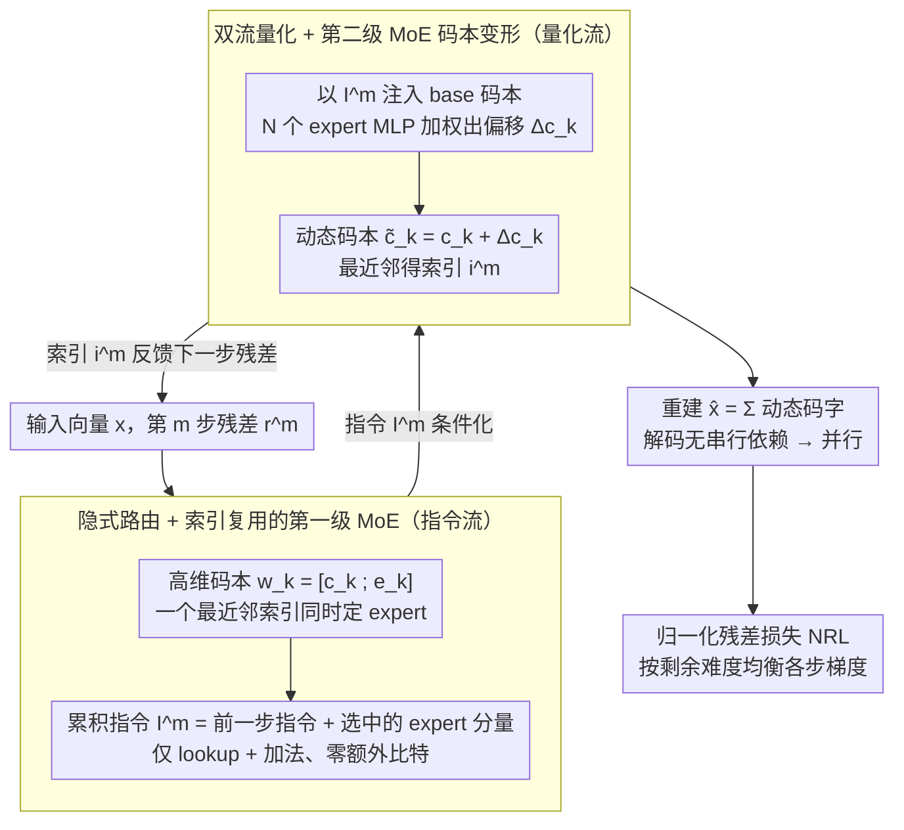

# RQ-MoE: Residual Quantization via Mixture of Experts for Efficient Input-Dependent Vector Compression

**会议**: ICML 2026  
**arXiv**: [2605.14359](https://arxiv.org/abs/2605.14359)  
**代码**: [KDEGroup/RQ-MoE](https://github.com/KDEGroup/RQ-MoE)  
**领域**: 模型压缩 / 向量量化  
**关键词**: Residual Quantization, MoE, 输入自适应码本, 并行解码, Normalized Residual Loss

## 一句话总结
RQ-MoE 用「两级 MoE + 双流量化」的设计，让残差向量量化（RQ）的码本随输入动态生成，又通过把指令流与重建流解耦实现 6–14× 解码加速，在四个 retrieval benchmark 上 MSE/Recall 持平或超越 QINCo。

## 研究背景与动机
**领域现状**：向量量化（VQ）通过把高维向量映射到「码本中心」实现压缩，多码本量化（MCQ）通过用多个小码本进一步降低误差，其中残差量化（RQ）的「逐步逼近」策略被广泛用于推荐系统、speech codec、生成式 RecSys 的 token 化。最近 QINCo 把 RQ 升级为「动态码本」—— 每步用 MLP 根据已重建的部分动态生成下一步的码本，显著改善了重建质量。

**现有痛点**：(i) 传统 RQ 用静态码本，对不同区域的局部流形几何「一刀切」，限制表达力；(ii) QINCo 引入了严格的串行依赖 —— 第 $m$ 步码本需要先得到第 $1\ldots m-1$ 步的重建，导致解码无法并行，部署时延高；(iii) 直接把 MoE 套上去的「显式门控」会浪费 bit 预算（4 个 expert 就要 2 个额外 bit，对 256 项码本是 25% 开销）。

**核心矛盾**：动态码本（要好）与并行解码（要快）天然冲突 —— 若码本依赖前序重建，必须串行；若想并行，又会失去输入自适应能力。

**本文目标**：在不增加任何额外比特、不丢失输入自适应的前提下，把解码完全并行化，并保持/超过 QINCo 的重建与检索精度。

**切入角度**：作者重新审视 RQ —— 它本身可视作一个退化的 MoE（最近邻搜索 = top-1 隐式路由）。如果把每个码字的「expert 信息」与「量化分量」绑定在同一索引下，路由就免费了；同时把「指令传播」从「重建路径」上剥离，并行就实现了。

**核心 idea**：用一个高维码本 $\mathbf{w}_k^m=[\mathbf{c}_k^m;\mathbf{e}_k^m]$ 把量化分量与 expert 分量绑在同一索引上（第一级 MoE 隐式路由），并把指令累加流与码本生成流解耦（第二级 MoE 按累计指令变形 base 码本），从而支持完全并行解码。

## 方法详解

### 整体框架
RQ-MoE 沿用 RQ 的「逐步精化残差」骨架：$M$ 步量化，每步选一个索引 $i^m$。但每一步并行维护两条流：

- **指令流 (Instruction Stream)**：保存累积 expert 信息 $\mathbf{I}^m\in\mathbb{R}^{D_e}$，更新规则极简，$\mathbf{I}^m=\mathbf{I}^{m-1}+\mathbf{E}_{i^{m-1}}^{m-1}$，初始 $\mathbf{I}^1=\mathbf{0}$。
- **量化流 (Quantization Stream)**：在第 $m$ 步把静态 base 码本 $\mathcal{C}^m$ 用第二级 MoE 函数 $f_t$ 按 $\mathbf{I}^m$ 变形为动态码本 $\tilde{\mathcal{C}}^m=\{\tilde{\mathbf{c}}_k^m\}$，再在动态码本上做最近邻 $i^m=\arg\min_k\|\mathbf{r}^m-\tilde{\mathbf{c}}_k^m\|_2^2$。

最终重建 $\hat{\mathbf{x}}=\sum_{m=1}^M\tilde{\mathbf{c}}_{i^m}^m$，与标准 RQ 求和形式一致 —— 这意味着解码时只要拿到索引序列，所有 $\mathbf{I}^m$ 都可由「索引 lookup + 加法」并行得到，所有 $\tilde{\mathcal{C}}^m$ 也可并行生成，整条解码路径完全摆脱串行依赖。

### 关键设计

**1. 隐式路由 + 索引复用的第一级 MoE：让最近邻索引「一索引两用」，零比特实现路由**

朴素 MoE 套到 RQ 上，最大的浪费是门控——每个 expert 都要额外存 $\log_2 N$ bit，4 个 expert 就吃掉 2 bit，对 256 项码本是 25% 的预算开销。作者的破局点是把 expert 选择「焊」进本来就要存的量化索引里：每个码字不再是 $D$ 维，而是扩成 $(D+D_e)$ 维的 $\mathbf{w}_k^m=[\mathbf{c}_k^m;\mathbf{e}_k^m]$，前 $D$ 维 $\mathbf{c}_k^m$ 是 base 码本、负责残差匹配，后 $D_e$ 维 $\mathbf{e}_k^m$ 是 expert 分量、编码该区域的局部流形特征。最近邻搜索 (Eq. 1) 只在前 $D$ 维上算距离，但一旦选中索引 $i^m$，后 $D_e$ 维的 expert 信号 $\mathbf{e}_{i^m}^m$ 也就同步确定，随即累加进 $\mathbf{I}^{m+1}$。这样路由信息「搭便车」——索引本来就要存，多挂一段 expert 分量不占新比特，同时还原封不动保留了 RQ「一串索引即完整编码」的简洁存储格式。

**2. 双流量化 + 第二级 MoE 码本变形：把指令传播从重建路径上剥离，换来并行解码**

QINCo 的动态码本之所以慢，是因为第 $m$ 步码本要等前 $m-1$ 步的重建向量算完才能生成，串行死锁。RQ-MoE 把「条件信息」和「重建路径」拆成两条独立的流来打破它：指令流只做 lookup + 加法，$\mathbf{I}^m=\mathbf{I}^{m-1}+\mathbf{E}_{i^{m-1}}^{m-1}$，只依赖前一步的索引与 expert 分量、不碰任何重建向量；量化流再拿 $\mathbf{I}^m$ 去变形 base 码本。具体变形是第二级 MoE：对每个候选 $k$，先 $\mathbf{z}_k^m=\text{Linear}([\mathbf{c}_k^m;\mathbf{I}^m])$ 把累积指令注入 base 码字，再让 $N$ 个 expert MLP（每个 $L$ 层 bottleneck residual）并行算出 $\mathcal{E}_n(\mathbf{z}_k^m)$，门控 $\boldsymbol{\alpha}_k^m=\text{softmax}(\text{Linear}(\mathbf{z}_k^m))$ 加权求和给出偏移 $\Delta\mathbf{c}_k^m=\sum_n\boldsymbol{\alpha}_{k,n}^m\mathcal{E}_n(\mathbf{z}_k^m)$，最终动态码字 $\tilde{\mathbf{c}}_k^m=\mathbf{c}_k^m+\Delta\mathbf{c}_k^m$（第一步无指令可用，直接 $\tilde{\mathcal{C}}^1=\mathcal{C}^1$ 启动）。关键在于：解码时拿到索引序列后，$\{\mathbf{I}^1,\ldots,\mathbf{I}^M\}$ 可一次性全部算出，于是 $M$ 个动态码本 $\{\tilde{\mathcal{C}}^m\}$ 也能并行生成——理论上拿到 $M\times$ 步级加速，再叠加 $N$ 个 expert 的并行就是 $N\times$。

**3. 归一化残差损失 NRL：按「剩余难度」给每一步均衡梯度，救活深层 expert**

直接用 MSE 训练会偏科：MSE 梯度是 $2\|\mathbf{r}^{m+1}\|_2$，随残差线性放大，而早期 step 残差大、晚期残差小，结果前段梯度把后段 expert 的信号淹没，深层 expert 学不动；而且对 outlier 无界，残差一大就梯度爆炸。NRL 的思路是不看绝对残差、只看「相对前一步进步多少」：定义相对残差比 $\rho^m=\|\mathbf{r}^{m+1}\|_2^2/(\text{sg}(\|\mathbf{r}^m\|_2^2)+\epsilon)$（分母 stop-gradient，不回传），损失 $\mathcal{L}_{\text{NRL}}=\sum_{m=1}^M\log(1+\rho^m)$。它的梯度 $\nabla_{\mathbf{r}^{m+1}}\mathcal{L}_{\text{NRL}}=2\|\mathbf{r}^{m+1}\|_2/(\|\mathbf{r}^{m+1}\|_2^2+C)$ 在中等残差时随 $\|\mathbf{r}^{m+1}\|_2$ 上升、在极端残差时反而趋零——这正是 robust statistics 里的 redescending influence function。两个好处一并拿到：每一步都按自身剩余难度被归一化，深层 expert 也能收到有效梯度；对极端样本则自动「松手」，训练更稳。

### 损失函数 / 训练策略
仅训练 NRL 一项即可端到端优化所有 base/expert 码本、MoE 门控与 expert MLP；不引入辅助 load-balance 损失（隐式路由由最近邻天然带 balance 性质）。

## 实验关键数据

### 主实验
Deep1M、BigANN1M、FB-ssnpp1M、Contriever1M 四个 retrieval benchmark，10M 训练样本，8/16 字节码本预算。RQ-MoE 默认 $N=1, L=16$（Contriever 用 $L=12$ 对齐 QINCo 配置）。

| 数据集 (8 bytes) | 指标 | RQ-MoE | QINCo | OPQ |
|------------------|------|--------|-------|-----|
| Deep1M (D=96) | MSE / R@1 | 持平或更优 | -- | 0.25 / 15.2 |
| BigANN1M (D=128) | MSE (×$10^4$) / R@1 | 持平或更优 | -- | 2.97 / 21.4 |
| FB-ssnpp1M (D=256) | MSE / R@1 | 持平或更优 | -- | 9.51 / 2.5 |
| Contriever1M (D=768) | MSE / R@100 | 持平或更优 | -- | 1.87 / 50.6 |

**解码加速**：相对 QINCo / QINCo2 的 PAD 分别 **6×–14×**（具体数字按数据集与 $M$ 变化）。

**复杂度**（FLOPS per vector，$N\cdot L$ 总预算固定时）

| 方法 | 编码 | 解码 |
|------|------|------|
| UNQ | $H'(D+H+Mb+MK)$ | $H'(b+H'+D+M)$ |
| QINCo | $2MKD(D+LH)$ | $2MD(D+LH)$ |
| **RQ-MoE** | $2MKD(D+NLH+N)$ | $2MD(D+NLH+N)$ |

理论解码加速：步级 $M\times$ + expert 级 $N\times = (M\cdot N)\times$。

### 消融实验

| 配置 | 现象 | 说明 |
|------|------|------|
| 完整 RQ-MoE | SOTA / 6–14× 加速 | 主结果 |
| 用 MSE-final 替 NRL | 后段 expert 训练不充分 | NRL 解决深层欠拟合 |
| 用 per-step MSE 替 NRL | 早期 step 主导优化 | 早期梯度过大 |
| 关闭第二级 MoE (固定 base 码本) | 退化为 RQ，重建误差上升 | 输入自适应必要 |
| 把指令流与重建路径耦合（QINCo 风格） | 串行依赖恢复，速度回落 | 双流解耦是并行关键 |
| 显式门控（额外存 bit） | 在固定比特预算下精度下降 | 隐式路由 + 索引复用更优 |

### 关键发现
- 理论证明：当 $D_e=0$ 且 $\Delta\mathbf{c}_k^m=0$ 时 RQ-MoE 退化为标准 RQ；当 $f_t$ 实现为 QINCo 的 residual-MLP 且 $D_e=D$ 时退化为 QINCo —— 两者都是 RQ-MoE 的「受限特例」，意味着 RQ-MoE 是一个统一框架。
- expert 维度 $D_e$ 的推荐：作者从理论推导给出 guideline，简单设 $D_e=D$ 即可在多数 benchmark 取得稳定性能。
- 解码加速来源不止「步级并行」：第二级 MoE 内部 expert 也可并行，叠加后端到端时延对 QINCo 形成 $M\cdot N$ 倍优势。

## 亮点与洞察
- 「把路由信息塞进既有的量化索引里」是非常聪明的设计 —— 0 bit 开销实现 MoE 路由，且天然 load-balanced。
- 双流解耦让动态码本与并行解码同时成立，这本被认为是 mutually exclusive 的两个目标。
- NRL 与 robust statistics 的 redescending M-estimator 等价，提供了「为何后段 expert 也能学好」的统计学解释 —— 这种 loss 设计可迁移到其它「逐步精化」任务（diffusion、autoregressive token、refinement-style segmentation）。
- RQ-MoE 给出了一个一般化框架：用 hyper-dimensional codebook 把「主任务输出 + 辅助路由信号」绑在同一离散索引下，是工程上极轻量的 MoE 集成方式。

## 局限与展望
- 编码仍然是串行的（要按步算残差再查 dynamic codebook），尽管理论上可借 $N$ 个 expert 并行加速；并行编码尚未完全解决。
- 实验集中在 retrieval/reconstruction 指标，没有直接评测在 RecSys（Rajput 等的生成式推荐 token 化）或 speech codec 上的下游效果。
- 没有讨论训练稳定性 —— MoE 一般需要 load balance / gating noise，本文似乎完全靠隐式路由维稳，规模放大时是否仍稳健有待验证。
- $D_e=D$ 让码本大小翻倍存储，对极端紧凑场景（IoT 端侧）可能是新开销。

## 相关工作与启发
- **vs RQ / PQ / OPQ**: 经典 MCQ 全是静态码本，RQ-MoE 引入 input-conditioned 动态码本而仍保留 RQ 的「索引序列即编码」简洁性。
- **vs QINCo / QINCo2**: QINCo 是首个动态码本工作但严格串行；QINCo2 用 PAD/beam search 加速但仍未消除串行依赖。RQ-MoE 通过双流解耦真正消除依赖。
- **vs UNQ**: UNQ 用深度网络代替欧氏距离做查表，但仍是静态码本；RQ-MoE 把网络容量放在「码本生成」上，更好利用 MoE 的稀疏激活。
- 启发：在 retrieval-augmented LLM 或 generative recommender 的 token 化中，可用 RQ-MoE 直接替换 RVQ，预期得到「同精度更快解码」的红利。

## 评分
- 新颖性: ⭐⭐⭐⭐ 用隐式路由 + 双流解耦同时解决动态码本与并行解码两个矛盾目标
- 实验充分度: ⭐⭐⭐⭐ 四个标准 benchmark + 复杂度表 + 消融，但缺少下游 RecSys/Codec 任务验证
- 写作质量: ⭐⭐⭐⭐ 框架图 + 算法叙述清晰，理论部分概括到位
- 价值: ⭐⭐⭐⭐ 对生成式推荐 / 语音 codec 的 RVQ token 化有直接替换价值

<!-- RELATED:START -->

## 相关论文

- [\[ICML 2026\] DAG-MoE: From Simple Mixture to Structural Aggregation in Mixture-of-Experts](dag-moe_from_simple_mixture_to_structural_aggregation_in_mixture-of-experts.md)
- [\[CVPR 2026\] Quant Experts: Token-aware Adaptive Error Reconstruction with Mixture of Experts for Large Vision-Language Models Quantization](../../CVPR2026/model_compression/quant_experts_token_aware_vlm_quantization.md)
- [\[ICML 2026\] ReSpinQuant: Efficient Layer-Wise LLM Quantization via Subspace Residual Rotation Approximation](respinquant_efficient_layer-wise_llm_quantization_via_subspace_residual_rotation.md)
- [\[ACL 2025\] MoQAE: Mixed-Precision Quantization for Long-Context LLM Inference via Mixture of Quantization-Aware Experts](../../ACL2025/model_compression/moqae_mixed_precision_kv_cache.md)
- [\[ICML 2026\] RaBiT: Residual-Aware Binarization Training for Accurate and Efficient LLMs](rabit_residual-aware_binarization_training_for_accurate_and_efficient_llms.md)

<!-- RELATED:END -->
