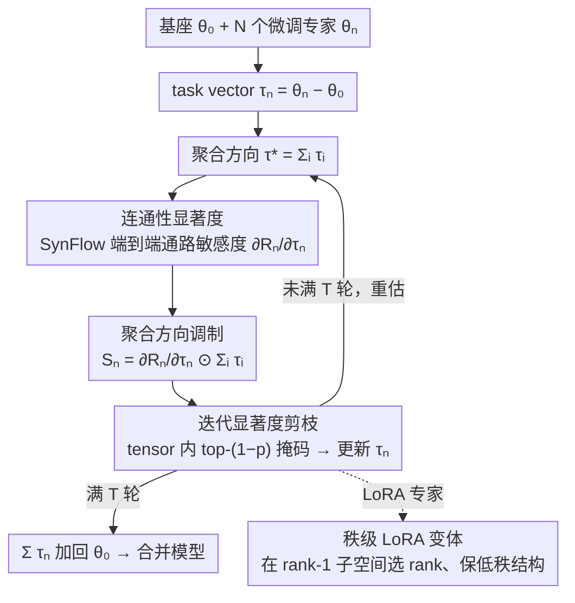

# Saliency-Aware Model Merging

**会议**: ICML 2026  
**arXiv**: [2606.00511](https://arxiv.org/abs/2606.00511)  
**代码**: 论文未公布  
**领域**: 模型压缩 / 模型融合 / 数据无关参数选择  
**关键词**: model merging, task vector, SynFlow, 连接性显著度, LoRA 融合  

## 一句话总结
SA-Merging 把结构化剪枝里的 SynFlow 连接性分数搬到数据无关模型合并场景，对每个专家的 task vector 计算"端到端通路敏感度 × 聚合方向一致性"作为显著度，迭代地去掉低显著度更新，从而在视觉/语言/LoRA 多任务上把数据无关 merging 推到接近 test-time adaptation 的水平。

## 研究背景与动机

**领域现状**：以 CLIP / ViT / LLaMA / T5 这类基座为起点，社区训出了大量任务专用的 fine-tuned 专家。把它们直接合并成一个统一模型是热门方向：Task Arithmetic 把每个专家写成 task vector $\tau_n = \theta_n - \theta_0$ 后线性叠加；TIES / DARE / PCB / WUDI 等在此基础上引入幅度修剪、符号选举、稀疏化来减少干扰。

**现有痛点**：这些数据无关方法几乎都假设"参数之间独立同分布"——每个权重的重要性由它自身的绝对值决定。但深网的功能是跨层级联出来的：一个幅度很大的更新如果被下一层的小权重"卡死"，对最终输出根本没影响；一个幅度小的更新若处在高容量路径上，反而可能至关重要。仅按幅度选 top-k，会把关键路径上的小权重砍掉，把死路上的大权重留下来，结果是合并后的模型显著落后于 MTL。

**核心矛盾**：合并需要的是"任务功能的等价压缩"，而幅度只是参数局部信息，缺了层间耦合与跨专家方向一致性这两个全局信号。要做数据无关，又不能调用任何前向/反向梯度数据来估"功能重要性"。

**本文目标**：在严格数据无关（不用任何任务样本、不用 calibration set）下，给每个 task vector 的每个坐标算一个考虑层间耦合的显著度，并据此迭代裁剪。同时希望框架能无痛迁移到 LoRA 专家，并且不破坏低秩结构。

**切入角度**：作者注意到结构化剪枝里的 SynFlow（Tanaka et al. 2020）正好提供了一个"数据无关 + 衡量端到端连通性"的得分。它原本用于单模型剪枝，能不能改造成对 task vector 的显著度？另一个观察是"跨专家共识方向"——如果某个坐标上某专家与众多其他专家的更新方向相反，多半是噪声而非有效更新。

**核心 idea**：用 SynFlow 风格的连通性梯度衡量结构敏感性，再点乘所有任务向量之和作为"共识方向"做调制，得到 saliency $\mathcal{S}_n$；用迭代 top-k 掩码逐步精炼，剩下的 task vector 求和得到合并模型。

## 方法详解

### 整体框架
方法要解决的是"哪些 task vector 坐标值得保留进合并模型"这个选择问题，且全程不碰任何任务数据。输入是基座参数 $\theta_0$ 和 $N$ 个微调专家 $\{\theta_n\}$，先转成 task vector $\tau_n := \theta_n - \theta_0$，随后进入 $T$ 轮迭代精炼。每一轮里，先把所有专家的当前更新求和得到聚合方向 $\tau^* = \sum_i \tau_i$，再对每个专家算一个端到端连通性分数 $\mathcal{R}_n$ 并对 $\tau_n$ 求梯度拿到结构敏感度，把它与 $\tau^*$ 逐坐标相乘得到显著度 $\mathcal{S}_n$，按 tensor 内 top-$(1-p)$ 生成掩码 $m_n$ 并更新 $\tau_n \leftarrow m_n \odot \tau_n$。$T$ 轮后把这些稀疏化的 task vector 全部加回 $\theta_0$，就是最终合并模型。对 LoRA 专家则把同一显著度搬到 rank-1 子空间做秩级选择，保持低秩结构不破。

### 关键设计

**1. 连通性显著度：用 SynFlow 在 task vector 上度量端到端重要性**

数据无关 merging 的老问题是只按幅度选坐标——但深网功能是跨层级联出来的，一个幅度很大的更新若被前后层的小权重夹住，对最终输出根本没贡献。作者把结构化剪枝里的 SynFlow 搬过来正面回应这点：把网络看成 $L$ 个连续参数块，定义连通性分数 $\mathcal{R}_n(\theta_0, \tau_n) = \mathbf{1}^\top (\prod_{l=1}^{L} |\theta_0^l + \tau_n^l|) \mathbf{1}$，它衡量的是端到端信号能通过多少条强通路；再对 $\tau_n$ 求梯度得到结构敏感度 $\partial \mathcal{R}_n / \partial \tau_n$，本质等价于"该坐标参与了多少条强通路"。于是那个被小权重卡死的大更新会拿到接近零的梯度，自然从重要性排序里掉下去，而高容量路径上的小更新反而被托起来。这等于免费拿到一个 data-free 的结构性重要性度量，且与幅度/符号信号正交，构成一个全新的 merging basis。

**2. 聚合方向调制：把符号选举溶进显著度乘子**

光有结构敏感度还不够——某专家在某坐标上的更新可能很"结构重要"，但方向与其他专家普遍相反，多半是噪声而非有效更新。作者再压一层跨专家共识，把显著度定义为 $\mathcal{S}_n := \frac{\partial \mathcal{R}_n}{\partial \tau_n} \odot \sum_{i=1}^{N} \tau_i$：若该坐标更新与聚合方向 $\sum_i \tau_i$ 反号，乘积为负或极小，只有"对结构重要 且 方向与多数共识一致"的坐标才能拿到大显著度。TIES 用显式符号投票来抑制这种干扰，本文则把符号选举溶进显著度本身——既保留乘性平滑（绝对值大小自动决定权重，不像投票那样硬切成 ±1），又不引入新超参，还能与连通性敏感度自然耦合，避免"结构重要却被符号硬否决"的割裂。

**3. 迭代显著度剪枝与秩级 LoRA 变体：逐步收缩并无损扩展到 LoRA**

一次性剪枝会忽略层间依赖随稀疏化而漂移的现象，所以作者仿 SynFlow 走多轮迭代：每轮按 tensor 内 top-$(1-p)$ 取掩码（用 tensor 内而非全局排序，避免把小张量整层砍光），$T$ 轮后保留率约 $(1-p)^T$；论文设 $T=10$、目标保留 10%，于是取 $p=0.2$，让 mask 在剪枝—重估—再剪枝中自我对齐。对 LoRA，直接按矩阵元素剪会破坏低秩结构，所以转到 rank-1 子空间做选择：把 $\Delta W_n^l = s B_n^l A_n^l$ 当 task vector，第 $k$ 个 rank 成分的显著度取 $s_{n,k}^l = |\gamma_{n,k}^l \eta_{n,k}^l|$，其中 $\gamma_{n,k}^l = (b_{n,k}^l)^\top G_n^l a_{n,k}^l$ 是结构敏感度、$\eta_{n,k}^l = (b_{n,k}^l)^\top \overline{\Delta W}^l a_{n,k}^l$ 是与聚合更新的一致性；按显著度选 rank 后用 $B_n^l \leftarrow B_n^l \mathrm{Diag}(m_n^l)$、$A_n^l \leftarrow \mathrm{Diag}(m_n^l) A_n^l$ 剪枝，rank 不变、LoRA 结构完整保留，可直接放回原推理路径。

### 损失函数 / 训练策略
方法没有训练损失，整个 merging 过程在任务数据上零反向传播、零超参搜索。计算 $\partial \mathcal{R}_n / \partial \tau_n$ 只需在参数上做一次自动微分；对 LoRA 还能通过 $\partial \mathcal{R}/\partial B = s G (A)^\top$、$\partial \mathcal{R}/\partial A = s B^\top G$ 直接在低秩因子上算梯度，不必把 $\Delta W$ 显式展开。

## 实验关键数据

### 主实验
评测覆盖 4 个场景：CLIP ViT-B/32、B/16、L/14 的 8 任务视觉套件（SUN397/Cars/RESISC45/EuroSAT/SVHN/GTSRB/MNIST/DTD），RoBERTa-Base/Large 的 8 任务 GLUE，Flan-T5-base 的 LoRA 合并，以及解码器（指令/数学/代码）合并套件。

| 数据集 | 指标 | 本文 (SA-Merging) | 之前最佳 data-free (WUDI) | 提升 |
|--------|------|------|----------|------|
| CLIP ViT-B/32 (8-task vision avg) | Top-1 acc | 85.9 | 85.2 | +0.7 |
| CLIP ViT-L/14 (8-task vision avg) | Top-1 acc | 93.4 | 92.6 | +0.8 |
| GLUE RoBERTa-Base | 归一化平均 | 87.1 | 85.3 | +1.8 |
| GLUE RoBERTa-Large | 归一化平均 | 90.2 | 88.8 | +1.4 |

注：CLIP ViT-L/14 上 SA-Merging 的 93.4 已经压过 Traditional MTL 的 93.5 一线之差，且高于所有 test-time / data-assisted 方法（AdaMerging 90.8 / AdaMerging++ 91.0 / Representation Surgery 89.0），意味着严格数据无关的 merging 第一次可以与依赖测试样本的方法平起平坐。

### 消融实验
| 配置 | 关键发现 | 说明 |
|------|---------|------|
| 完整 SA-Merging | 8-task vision avg ≈ 85.9 (B/32) | 结构敏感度 + 共识调制 + 迭代 |
| 仅幅度 + 共识调制 | 显著下降至接近 TIES 水平 | 失去结构敏感度后退化为加权 TIES |
| 仅结构敏感度，无共识调制 | 中间段 | 不能压制反向冲突更新 |
| 单步剪枝 (T=1) | 弱于 T=10 | 印证迭代细化的价值 |
| 不同剪枝率 $p$ | $T$ 越大越稳，趋势对 $p$ 不敏感 | 论文图 3(b) 显示性能随 $T$ 单调上升 |

### 关键发现
- 结构敏感度 $\partial \mathcal{R}_n / \partial \tau_n$ 与传统幅度排序相关性低，证实它捕获了"幅度信息之外的功能性重要性"，与现有 magnitude-based 方法互补。
- 迭代轮数 $T$ 是最稳健的旋钮：在视觉与语言任务上、不同剪枝率下都呈现"$T$ 越大越好"的单调趋势，没有看到过拟合 mask 的现象。
- LoRA 秩级显著度让数据无关 LoRA merging 显著优于按元素剪枝的朴素版本，并且不破坏 rank 结构、可直接放回原 LoRA 推理路径。

## 亮点与洞察
- 把"结构化剪枝的 SynFlow"重新解释为"task vector 的数据无关显著度"，是一个轻量但非常落地的跨子领域迁移：得到了一个全新的 merging basis，且可与现有幅度/符号方法叠加。
- 共识调制 $\odot \sum_i \tau_i$ 的设计很优雅——它把 TIES 的符号选举融进显著度乘子里，省掉了显式 sign vote 和阈值，同时还能调节强度（绝对值大小决定权重而非简单的 ±1）。
- LoRA 部分的秩级显著度是工程上最讨喜的部分：通过 $(b_{n,k}^l)^\top G a_{n,k}^l$ 这种内积形式，能复用低秩因子上的自动微分而无需 materialize $\Delta W$，对超大模型几乎免费。

## 局限与展望
- 连通性分数 $\mathcal{R}_n$ 依赖参数符号无关的 $|\cdot|$ 乘积，对深网会面临数值爆炸或下溢，工程上需要 log-domain 归一化（论文没仔细讨论数值实现细节）。
- 共识方向 $\sum_i \tau_i$ 是简单求和，当专家间天然方差很大（如域差异极大的 LLM 专家）时会被主导专家拉偏；引入加权或鲁棒聚合是自然方向。
- 实验主要集中在 8 个专家的中等规模 merging；当 $N$ 进一步放大到几十上百个专家（modular / sparse merging 的目标场景）时，迭代剪枝的开销和 mask 漂移是否仍可控有待验证。

## 相关工作与启发
- **vs TIES-Merging / DARE / PCB**: 它们走幅度修剪 + 符号选举/随机掉点，本文用结构敏感度替代幅度作为选择信号，并把符号选举融进显著度乘子；定位是"补充而非替换"，在主实验里都拿过来做基线并稳定超出。
- **vs WUDI-Merging**: 同为最新的 data-free SOTA，WUDI 用任务向量加权的方式做合并，本文则改打"选哪些坐标参与合并"这一基础问题；两者机制正交，论文实验显示 SA-Merging 全面优于 WUDI 但提升幅度较小，提示两条路线可叠加。
- **vs AdaMerging / Representation Surgery**: 它们依赖 unlabeled 测试输入做 test-time 调参，性能更高；SA-Merging 在 ViT-L/14 上的数据无关结果已经追上甚至反超这些 data-assisted 方法，凸显结构性显著度信号的潜力。

## 评分
- 新颖性: ⭐⭐⭐⭐ SynFlow → merging 的迁移很巧妙，共识调制设计简洁，LoRA 秩级变体有工程价值
- 实验充分度: ⭐⭐⭐⭐ 视觉 + GLUE + LoRA + 解码器四个家族都覆盖，对比基线齐全
- 写作质量: ⭐⭐⭐⭐ 公式推导和算法描述清晰，符号统一；对设计动机的解释也到位
- 价值: ⭐⭐⭐⭐ 给 data-free model merging 添了一个新的可叠加 basis，LoRA 扩展对实际部署有意义

<!-- RELATED:START -->

## 相关论文

- [\[CVPR 2026\] Saliency-Driven Token Merging for Vision Transformers](../../CVPR2026/model_compression/saliency-driven_token_merging_for_vision_transformers.md)
- [\[CVPR 2026\] Bridging Domains through Subspace-Aware Model Merging](../../CVPR2026/model_compression/bridging_domains_through_subspace-aware_model_merging.md)
- [\[ICML 2026\] Model Merging Scaling Laws in Large Language Models](model_merging_scaling_laws_in_large_language_models.md)
- [\[ICML 2026\] Decouple Searching from Training: Scaling Data Mixing via Model Merging for Large Language Model Pre-training](decouple_searching_from_training_scaling_data_mixing_via_model_merging_for_large.md)
- [\[ICML 2026\] FRISM: Fine-Grained Reasoning Injection via Subspace-Level Model Merging for Vision–Language Models](frism_fine-grained_reasoning_injection_via_subspace-level_model_merging_for_visi.md)

<!-- RELATED:END -->
