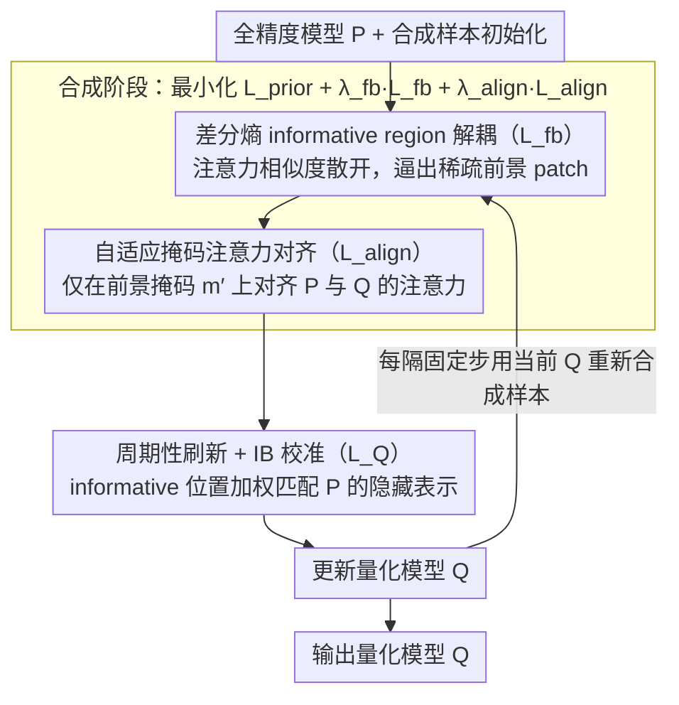

# Selective Coupling of Decoupled Informative Regions: Masked Attention Alignment for Data-Free Quantization of Vision Transformers

**会议**: ICML 2026  
**arXiv**: [2606.04373](https://arxiv.org/abs/2606.04373)  
**代码**: https://github.com/hfutqian/MaskAQ  
**领域**: 模型压缩 / 数据无关量化 / ViT  
**关键词**: 数据无关量化, ViT, 注意力对齐, 信息瓶颈, 样本合成

## 一句话总结
MaskAQ 把 ViT 的数据无关量化重新定义为"在合成样本的稀疏 informative region 上对齐全精度模型 $P$ 与量化模型 $Q$ 的注意力"，用差分熵最大化解耦前景 patch、用自适应掩码对齐注意力、并以周期性刷新让样本跟随 $Q$ 演化，在 3-bit DeiT-T 上把 ImageNet Top-1 比此前最佳再抬 3.1%。

## 研究背景与动机

**领域现状**：把预训练 ViT 部署到边缘设备需要把全精度模型 $P$ 量化成低 bit 的 $Q$，但数据安全场景下不能拿原始训练集做校准，于是诞生了"数据无关量化"（Data-Free Quantization, DFQ）——靠合成样本来恢复 $Q$ 的精度。CNN 时代的 DFQ 沿用 BatchNorm 统计当先验，把合成样本拉向真实分布；可 ViT 用的是 LayerNorm，没有 BN 这种现成"分布钥匙"，于是 PSAQ-ViT 用 patch 相似度区分前后景、CLAMP-ViT 引入 patch 级对比学习、MimiQ 用多头注意力相似度增强结构。

**现有痛点**：这些方法只在"合成图像看起来更像真实图像"这条路上推进，却没回答更要害的问题——合成样本里到底**有没有保住 $Q$ 校准所需的关键信息**？作者通过对比实验观察到两条共性病灶：(1) **semantic dispersion**——合成样本的语义在整张图上扩散，没有连贯的物体结构；(2) **attentional disparity**——合成图缺少 $Q$ 容易识别的判别性区域，导致 $Q$ 无法把注意力对齐到 $P$ 关注的位置，超低 bit 下尤为致命。

**核心矛盾**：现有 DFQ 把目标设成"逼近真实分布"，可量化误差让 $Q$ 的注意力本就发生偏移，**逼近真实分布与帮助 $Q$ 校准并不等价**；强行在全图上对齐 $P$ 与 $Q$ 的注意力反而会过度正则背景 patch，把合成样本推离能恢复精度的方向。

**本文目标**：(a) 显式从合成样本中分离出"对 $Q$ 真正重要"的稀疏区域；(b) 让 $P$ 与 $Q$ 只在这些区域上做注意力对齐而非全图对齐；(c) 让合成样本在 $Q$ 的整个训练轨迹里持续保持"对当下 $Q$ 有用"。

**切入角度**：自注意力机制本质上是稀疏的——大部分语义集中在少量 patch 上。把这个观察提升到"informative region 才是 $P$ 与 $Q$ 之间互信息的主要承载者"的命题，于是 DFQ 就从"重建分布"变成"重建关键互信息"。

**核心 idea**：把 DFQ 视为一个**信息瓶颈**问题——在量化引入的信息预算 $C$ 之下最大化 $I(z_q; y)$——并通过"先解耦 informative region、再在掩码下对齐注意力、最后周期性刷新样本"三步实现。

## 方法详解

### 整体框架
MaskAQ 沿用"合成 → 校准"两阶段的 DFQ 主框架，但在两端都引入 informative region 这个核心概念：先靠全精度模型 $P$ 的注意力把合成图里真正承载语义的稀疏前景 patch 圈出来，再让合成和校准都只围着这撮 patch 转。合成阶段的目标 $\mathcal{L}_S = \mathcal{L}_{prior} + \lambda_{fb}\mathcal{L}_{fb} + \lambda_{align}\mathcal{L}_{align}$ 一边鼓励注意力分布多样化以化解 semantic dispersion，一边在自适应掩码 $m'$ 上对齐 $P$ 与 $Q$ 的注意力以消除 attentional disparity；校准阶段则给这些前景位置加权，让量化模型 $Q$ 优先在它们上面匹配 $P$ 的隐藏表示。外层再套一个"周期性刷新"循环，每隔一段训练就用当前 $Q$ 重新合成一批样本，保证样本永远跟得上正在演化的 $Q$。

### 关键设计

**1. 基于差分熵的 informative region 解耦（$\mathcal{L}_{fb}$）：把冗余 patch 散开，逼出一小撮承载语义的前景**

合成样本的通病是 semantic dispersion——语义糊在整张图上，没有连贯物体，于是后续掩码无从下手。MaskAQ 先把 informative region 定义成注意力权重 $\alpha_n$ 不小于第 $k_{ir}$ 大值的 patch 集合 $IR = \{x_n \mid \alpha_n \geq \alpha_{[k_{ir}]}\}$，再想办法让这撮前景从背景里凸出来。具体做法是对第 $l$ 层注意力矩阵 $A_l^p \in \mathbb{R}^{N \times N}$ 按行取注意力向量 $a_i$，算两两余弦相似度 $S_{ij} = a_i \cdot a_j / (\|a_i\| \|a_j\|)$，再把 $S_{ij}$ 的分布的熵最大化——相似度越分散，patch 之间区分度越高，前景就越容易和背景一刀切开。直接最大化"前景明显"没有可微目标，但"让注意力向量彼此区分得开"是可优化的代理。原本的香农熵 $H(p_l) = -\sum_k p_l(s_k) \log p_l(s_k)$ 要靠直方图估计，离散化带来梯度抖动；作者改把相似度分布近似成高斯 $\mathcal{N}(\mu_l, \sigma_l^2)$，用差分熵代理 $H_l = \frac{1}{2}\log(2\pi e \sigma_l^2)$，最终 $\mathcal{L}_{fb} = -\frac{1}{L} \sum_l H_l$，几乎零成本就把梯度抹平滑。

**2. 自适应掩码下的注意力对齐（$\mathcal{L}_{align}$）：只在 $P$ 最有把握的位置对齐，给 $Q$ 留出顺应量化误差的余地**

超低 bit 下 $Q$ 的注意力本就发生漂移，如果强迫它整张图都跟 $P$ 一致，量化噪声主导的背景 patch 反而会被过度正则、把误差吃进梯度——这正是 attentional disparity 的来源。MaskAQ 的对策是只在前景上对齐：从 $P$ 的注意力里挑出比 $\alpha_{[k_{ir}]}$ 更严格的前 $k$ 个位置形成二进制掩码 $m[n] = \mathbb{1}[\alpha_n \geq \alpha_{[k]}]$，再以 dropout 概率 $p_{drop}$ 在保留集合 $\mathcal{P}$ 上随机丢掉一部分，保留位数 $k_{keep} = \max(k_{min}, \lfloor |\mathcal{P}| (1-p_{drop}) \rfloor)$，得到带随机性的掩码 $m'$。对齐损失只对掩码内位置的 $L1$ 注意力差做平均：

$$\mathcal{L}_{align} = \sum_l \|m' \odot (A_l^p - A_l^q)\|_1 / \|m'\|_0$$

只对齐"$P$ 自己最有把握"的位置既保证了语义传递，又不逼 $Q$ 在背景上较劲；而那道随机丢弃则防止合成样本退化成"只剩几个固定亮 patch"的退化解，让前景锚点既稳又不过拟合。

**3. 周期性样本刷新 + 信息瓶颈视角的校准：让样本跟着 $Q$ 一起演化，并把前景优先级带进校准目标**

DFQ 的一个常见失败是训练初期合成的样本到后期已经跟不上当前 $Q$。MaskAQ 把整件事放进信息瓶颈框架——在量化引入的信息预算下求 $\max I(z_q; y)$ s.t. $I(x; z_q) \leq C$，其中 $C$ 由 bit 宽度决定。论文用两条定理把前两个 loss 接进这个框架：Theorem 1 说只要 informative region 上 $P$ 与 $Q$ 的 TV 距离 $\leq \varepsilon_r$，预测互信息差就被 $\Delta_r(\varepsilon_r)$ 控住；Theorem 2 说只要合成样本与真实样本在 informative region 上的 label 互信息差 $\leq \xi$，合成样本就足以代替真实样本去对齐 $Q$。这解释了为何只对齐前景就够维持预测互信息——也正是 3-bit 这种极端情形仍能涨点的理论支撑。校准阶段对 informative 位置加权 $w_{l,n} = 1 + m^c_{l,n} \cdot (w-1)$，目标写成

$$\mathcal{L}_Q = \frac{1}{LN_h} \sum_{l, n_h} \frac{\sum_n w_{l,n} D(h^p_{l,n_h,n}, h^q_{l,n_h,n})}{\sum_n w_{l,n}}$$

外层则每隔固定步数用当前 $Q$ 重新跑 Eq. (15) 合成新样本，让样本始终对得上 $Q$ 的当前状态。

### 损失函数 / 训练策略
合成阶段 $\mathcal{L}_S = \mathcal{L}_{prior} + \lambda_{fb} \mathcal{L}_{fb} + \lambda_{align} \mathcal{L}_{align}$，其中先验项 $\mathcal{L}_{prior}$ 是 one-hot 损失 $\mathcal{L}_{OH} = CE(z_p, y)$、TV 损失 $\mathcal{L}_{TV}$ 与 inter-head SSIM 损失 $\mathcal{L}_{IH}$ 的组合；校准阶段用 $\mathcal{L}_Q$ 并对 informative patch 加权 $w$。算法 1 是个双层循环——外层是 refresh number，内层依次跑 synthesis iteration 与 calibration iteration，"先合成、再校准、再刷新"的次序保证两阶段始终交替对齐。

## 实验关键数据

### 主实验（ImageNet Top-1 分类精度，3-bit 量化对比 MimiQ）

| 设置 | 模型 | MimiQ (AAAI'25) | MaskAQ（本文） | 绝对提升 |
|------|------|------------------|-----------------|----------|
| 3w3a | ViT-T | 8.64% | 11.50% | +2.86 |
| 3w3a | ViT-B | 41.28% | 43.39% | +2.11 |
| 3w3a | DeiT-T | 19.55% | 22.65% | +3.10 |
| 3w3a | DeiT-S | 27.39% | 30.41% | +3.02 |
| 3w3a | DeiT-B | 41.86% | 43.28% | +1.42 |
| 3w3a | Swin-T | 42.90% | 44.98% | +2.08 |

全精度基线（FP）依次为 ViT-T 72.01 / ViT-B 84.53 / DeiT-T 72.21 / DeiT-S 79.85 / DeiT-B 81.85 / Swin-T 81.35；3-bit 下与 FP 仍有显著差距，但 MaskAQ 把 DFQ 在 3-bit 上的可用性向前推了一步。

### 关键组件消融（基于论文报告的总体收益归因）

| 配置 | 效果 | 说明 |
|------|------|------|
| Full MaskAQ | 3w3a DeiT-T 22.65% | 完整模型 |
| w/o $\mathcal{L}_{fb}$（不解耦 informative region） | 显著回落 | semantic dispersion 重现，掩码失去依据 |
| w/o $\mathcal{L}_{align}$（不做掩码对齐） | 退化为类似 PSAQ-ViT / MimiQ 路线 | attentional disparity 重现 |
| w/o 周期性刷新 | 训练后期样本失效 | 样本与演化中的 $Q$ 失配 |
| w/o 自适应掩码随机性（固定 mask） | 过拟合到少数固定 patch | 合成样本退化为高亮几块 |

### 关键发现
- **3-bit 是收益最大的区段**：3w3a 下 MaskAQ 相对 MimiQ 的提升幅度（DeiT-T +3.10%）远大于 4-bit 区段，证明"只对齐 informative region"在量化误差最严重时收益最大。
- **跨架构一致性**：在 ViT-T/B、DeiT-T/S/B、Swin-T 六个 backbone 上都稳定优于 SOTA，说明"信息集中在稀疏 patch 上"是 ViT 家族的共性结构假设，并非依赖特定 backbone。
- **下游任务延展**：除 ImageNet 分类外，论文在检测与分割任务上同样报告了优势，说明 informative region 在 dense prediction 任务里同样具区分性。

## 亮点与洞察
- **目标重构**：把 DFQ 从"逼近真实数据分布"重写为"在信息预算下最大化与标签的互信息"，这是相对 PSAQ-ViT / MimiQ 的范式跃迁，IB 视角为后续工作给出了可量化的优化指南。
- **差分熵代替直方图**做注意力多样性正则，是一个工程上几乎零成本却把梯度变光滑的细节，可迁移到任何需要"分布去冗余"的合成任务。
- **自适应掩码 + dropout**让"informative region"既稳又不退化：单纯按 Top-k 选会过拟合到固定位置，加入随机丢弃后既保留语义锚点又防止退化解。
- **周期性刷新**是把"合成样本服务于 $Q$"这件事做到底——之前工作几乎都是合成完就冻结样本，本文承认 $Q$ 在演化、样本也得跟着演化。

## 局限与展望
- 对**激活全部已是 outlier 主导的 backbone**（如某些蒸馏后 ViT），attention 自身已偏斜，informative region 的稀疏假设是否成立需要进一步实证。
- 周期性刷新让训练总时长显著增加，未来可考虑只刷新 informative patch 而保留背景以节省合成成本。
- 当前掩码全部来自 $P$ 的注意力，未利用 $Q$ 自身的反馈——把 $Q$ 的注意力也纳入掩码生成可能进一步缓解 attentional disparity。
- IB 理论结果依赖 TV 距离假设，但论文没有给出 $\varepsilon_r, \varepsilon_s$ 在实际训练中的可测代理，从可验证性角度还有空间。

## 相关工作与启发
- **vs PSAQ-ViT / PSAQ-ViT V2**: 先驱工作用 patch 相似度区前后景，本文把"区前后景"升级为"在前景上对齐 $P$ 与 $Q$"，并引入差分熵代理与 IB 理论。
- **vs CLAMP-ViT**: 后者用 patch 级对比学习捕捉 inter-patch 关系，但仍服务于"合成图更像真实图"目标；MaskAQ 的对比是 $P$ 与 $Q$ 之间的对齐，不再追求真实性而追求 calibration 互信息。
- **vs MimiQ (AAAI'25)**: MimiQ 关注 inter-head 注意力相似度增强样本结构，但全图对齐导致 attentional disparity 在低 bit 上爆发；MaskAQ 用掩码把对齐限制在 informative region 上，正面对症。
- **vs CNN 时代 GDFQ / ZeroQ**: BN 统计在 LN 架构里失灵，本文给出 ViT 时代"BN 替代品"的一个完整方案——靠注意力稀疏性而非分布统计来锚定合成样本。

## 评分
- 新颖性: ⭐⭐⭐⭐⭐ 从"逼近分布"到"对齐互信息"的范式重写，配套 IB 理论与差分熵代理均为新颖组合。
- 实验充分度: ⭐⭐⭐⭐ 覆盖六类 backbone + 三类任务 + 3/4 bit 区段，缺少更激进的 2-bit 与与 PTQ 路线的混合对照。
- 写作质量: ⭐⭐⭐⭐ 动机推演与符号体系清晰，IB 推导集中在附录，主文阅读节奏好。
- 价值: ⭐⭐⭐⭐⭐ 在 3-bit 区段把 ViT DFQ 推到新 SOTA，对边缘部署与隐私敏感场景有直接工程意义。

## 评分
- 新颖性: 待评
- 实验充分度: 待评
- 写作质量: 待评
- 价值: 待评

<!-- RELATED:START -->

## 相关论文

- [\[ICCV 2025\] OuroMamba: A Data-Free Quantization Framework for Vision Mamba](../../ICCV2025/model_compression/ouromamba_a_data-free_quantization_framework_for_vision_mamba.md)
- [\[CVPR 2026\] BinaryAttention: One-Bit QK-Attention for Vision and Diffusion Transformers](../../CVPR2026/model_compression/binaryattention_one-bit_qk-attention_for_vision_and_diffusion_transformers.md)
- [\[ICML 2026\] Float8@2bits: Entropy Coding Enables Data-Free Model Compression](float82bits_entropy_coding_enables_data-free_model_compression.md)
- [\[ICML 2026\] From Per-Image Low-Rank to Encoding Mismatch: Rethinking Feature Distillation in Vision Transformers](from_per-image_low-rank_to_encoding_mismatch_rethinking_feature_distillation_in_.md)
- [\[AAAI 2026\] Distillation Dynamics: Towards Understanding Feature-Based Distillation in Vision Transformers](../../AAAI2026/model_compression/distillation_dynamics_towards_understanding_feature-based_di.md)

<!-- RELATED:END -->
