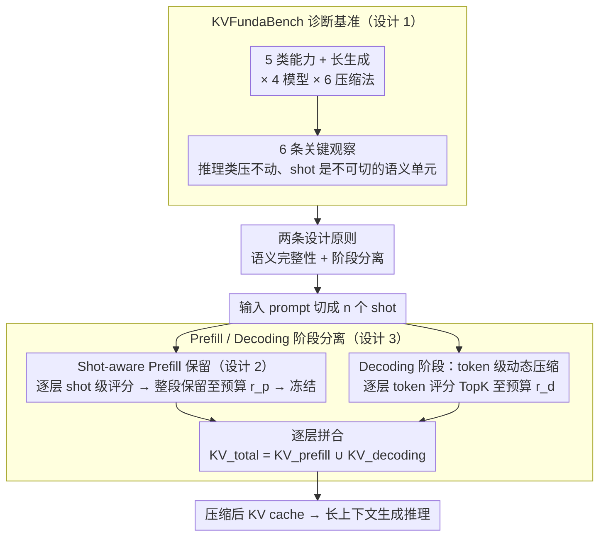

# Semantic Integrity Matters: Benchmarking and Preserving High-Density Reasoning in KV Cache Compression

**会议**: ICML 2026  
**arXiv**: [2502.01941](https://arxiv.org/abs/2502.01941)  
**代码**: 无（论文未给出公开链接）  
**领域**: 模型压缩 / LLM 效率  
**关键词**: KV cache 压缩、高密度推理、few-shot 语义单元、prefill-decoding 分离、长上下文生成

## 一句话总结
本文先用新基准 KVFundaBench 系统揭示「检索类长上下文压得动、推理类压不动」的关键不对称，并把原因归结到 KV 压缩破坏了少样本示例这一「语义单元」的完整性；据此提出 ShotKV——在 prefill 阶段保留整个 shot 作为不可分割单元、在 decoding 阶段做动态 token 级压缩，让 LG-GSM8K 在 40% 压缩率下从 baseline 46.0 提升到 47.33，并在长输入设置下端到端延迟降低 11.3%。

## 研究背景与动机

**领域现状**：KV cache 压缩主流方法（H2O、SnapKV、StreamingLLM、PyramidKV、ChunkKV、Quest 等）几乎全在 LongBench、NIAH 这种「检索定位」基准上评估，结论是只保留 ~50% token 就能不丢精度。

**现有痛点**：作者观察到一类被忽视的工作负载——「High-Density Reasoning」，即 prompt 里几乎每个 token 都是推理关键（CoT few-shot 示例、多步算术），而不是只有一小段「needle」重要。在这种场景下，矩阵相同压缩率下 arithmetic 任务比检索任务掉点更猛，且推理链中一个语义链被破坏可能造成灾难式失败。

**核心矛盾**：现有 token 级 KV 压缩按 attention score 单独评分 / 单独抛弃，会把一个完整的 few-shot 示例切碎；而 chunk 级方法虽然保了块，但又把 prefill 与 decoding 用同一策略统一处理，无法兼顾「静态指令保完整」与「动态生成保新鲜」。

**本文目标**：(1) 给出系统性 benchmark KVFundaBench，覆盖 5 类基础能力 + 长生成；(2) 量化哪些任务对压缩最敏感、哪些模型类型最稳；(3) 把「语义完整性」做成可操作的压缩原则，构造一个 lightweight proof-of-concept ShotKV 验证假设。

**切入角度**：把 few-shot 中的每个 shot 视为「不可切」的 Semantic Unit；prefill 阶段按 shot 颗粒度评分并整段保留，decoding 阶段独立做 token 级 attention-top-k 动态压缩，从而显式分离两种信息需求。

**核心 idea**：「压缩应在 semantic unit 上做，且 prefill 和 decoding 必须分相处理」——这是 benchmark 推出的核心结论，ShotKV 是最小可行的实现。

## 方法详解

### 整体框架
这篇论文走的是「先做基准、再据基准提最小方法」的路子，所以方法侧有两条并行的线。第一条是诊断基准 **KVFundaBench**：它覆盖 5 类基础能力任务（MMLU 世界知识 WK、CommonsenseQA 常识 CSR、GSM8K 算术 AR、HumanEval 代码 CG、JailBreakV 安全 SA）加上 LG-GSM8K 长生成，在 LLaMA-3.1-8B / Instruct、Mistral-7B-Instruct、DeepSeek-R1-Distill-Llama-8B 四个模型上交叉跑六种 KV 压缩方法，用相对性能 $\Delta P = (P_C - P_{\text{base}})/P_{\text{base}}$ 量化「压完掉多少」。第二条是据此构造的最小验证方法 **ShotKV**：它把 prompt 切成 $n$ 个 shot $\{s_1,\dots,s_n\}$，prefill 阶段以整个 shot 为颗粒度评分并整段保留，decoding 阶段再单独做 token 级动态压缩，最后每层把两段 cache 拼回去 $KV_{\text{total},l}=KV^C_{\text{prefill},l}\cup KV^C_{\text{decoding},l}$。

### 关键设计

**1. KVFundaBench：把「压缩在不同能力上的差异化退化」第一次量出来**

主流 KV 压缩方法几乎只在 LongBench、NIAH 这类检索定位基准上测，得出「留 50% token 不掉点」的乐观结论，却把真正脆弱的推理负载藏在了平均值底下。KVFundaBench 跨任务、跨模型、跨压缩率系统扫一遍，逼出六条关键观察：(O1) WK/CSR 很抗压，但 AR/CG/SA 在压缩率低于 20% 时直接崩盘；(O2) 推理蒸馏的 DeepSeek-R1 比 instruct-tuned 模型稳得多；(O3) 短 prompt 反而比长 prompt 脆弱（1-shot 在 10% 比例下从 0.5 掉到 0.05）；(O4) chunk 级的 ChunkKV 在 many-shot 上最稳；(O5) prompt 收益越大的任务越敏感（AR 从 0-shot 到 CoT 提升 50.41%，同时也最容易被压掉）；(O6) 长上下文生成 LG-GSM8K 哪怕随机式压缩也失血超过 20%。这些现象的根因被归到 attention 结构上——现有 token 级方法把重要性压在「sink token + 检索头」上，掩盖了算术这类任务真正依赖的 semantic chain；attention heatmap（图 3b）显示算术任务的非-sink 注意力更弥散，所以逐 token evict 极易剪断关键推理链路。这条观察直接定义了后面方法要保护的对象。

**2. Shot-aware Prefill 保留：把每个 few-shot 示例当作不可切的原子单位**

既然单 token 评分会把一个完整示例剁碎，ShotKV 就改在「shot」颗粒度上做取舍。它先按 prompt 边界识别出 $n$ 个 shot，对每一层 $l$ 算 shot 的平均 attention 重要性 $\text{Score}_{\text{prefill}}^l(s_i)=\frac{1}{k_i}\sum_{t\in s_i}\sum_h \alpha_{t,h}^l$（$k_i$ 是该 shot 的 token 数），按降序保留 shot 直到打满预算 $r_p \cdot |KV_{\text{prefill}}|$；被选中的 shot 整段进 cache，中间 token 一律不许 evict，且这次压缩做完后 prefill cache 在整个生成过程里冻结。关键在于评分是「逐层独立」的——不同层可以选不同的 shot，利用层间注意力分工。这样做之所以有效，是因为 H2O / SnapKV 这类 token 级方法可能留下一个 shot 的 question 却丢掉对应 answer，直接破坏 CoT 的因果链；ChunkKV 已经证明连续块优于离散 token，本文把「块」进一步语义化为「shot」，正好对齐了 in-context 示例的天然边界。

**3. Prefill / Decoding 阶段分离压缩：静态指令和动态生成各走各的策略**

prefill 里的 few-shot 示例是一次写定、之后只读的静态信息，而 decoding 端的 cache 随生成不断变长、越往后越需要动态淘汰，两者对压缩的诉求根本相反。ShotKV 因此把它们彻底拆开：prefill 用上面的 shot 级整段保留（比例 $r_p$）；decoding 阶段每层单独按 token 重要性 $\text{Score}_{\text{decoding}}^l(t)=\sum_h \alpha_{t,h}^l$ 做 token 级 TopK，保留比例为独立的 $r_d$；两套结果在每层拼合。观察 O6 正是这条设计的动机——长生成（4k+ token）对统一压缩策略尤其不友好：ChunkKV/SnapKV 没有动态 evict，会让 decoding 端 cache 撑爆；可如果 prefill 端也套动态策略，又会反复破坏好不容易保住的 in-context 示例。让两端各管各的，正是这个 trade-off 的自然解。

### 损失函数 / 训练策略
ShotKV 是 training-free 的推理时方法，不引入任何额外训练，唯一的超参就是一对压缩比例 $(r_p, r_d)$；实验中 temperature 设 0，LG-GSM8K 用 $K=35, T=20$。它对 prompt 结构的依赖也很轻——像 HotpotQA 这种不带 ICL 的文档 QA，只要把每个句子当作一个「shot」就能直接移植，无需重训。

## 实验关键数据

### 主实验

| 任务 / 方法 (压缩率) | FullKV | StreamingLLM | H2O | PyramidInfer | ChunkKV | SnapKV | **ShotKV** |
|---|---|---|---|---|---|---|---|
| LG-GSM8K @40% | 46.00 | 39.50 | 32.66 | 38.33 | — | — | **47.33** |
| LG-GSM8K @30% | 46.00 | 14.83 | 19.83 | 20.50 | — | — | **38.33** |
| LG-GSM8K @25% | 46.00 | 6.33 | 14.83 | 16.67 | — | — | **26.83** |
| Many-shot AR @10% | 82.35 | 74.32 | 51.27 | 70.37 | 79.32 | 68.27 | **80.37** |
| HotpotQA (LLaMA-3) @10% | 45.55 | 40.27 | 40.84 | 43.36 | 43.27 | — | **43.60** |

### 消融实验

| 配置 | Many-shot AR @10% | 说明 |
|------|---------------------|------|
| ShotKV (full) | 80.37 | 完整方法 |
| Random Shot（同样按 shot 颗粒度但随机选） | 51.34 | 验证 attention-based 评分必要性，差 29 个点 |
| 仅 prefill shot-aware（无 decoding 动态压缩） | 长生成快速失血 | 验证阶段分离 |
| ChunkKV（chunk 但非 shot 边界） | 79.32 | 显示 shot 语义边界优于一般 chunk |

| 延迟与吞吐 | 输入×输出 | Latency (s) ↓ | Throughput (T/S) ↑ |
|------------|----------|----------------|---------------------|
| FullKV | 4096×4096 | 175.50 | 37.73 |
| ShotKV | 4096×4096 | 162.85 (**-7.2%**) | 41.12 (+9.0%) |
| FullKV | 8192×4096 | 183.42 | 55.93 |
| ShotKV | 8192×4096 | 162.78 (**-11.3%**) | 63.24 (+13.1%) |

### 关键发现
- prompt-gain 与 compression sensitivity 强正相关：CoT 提升越大的任务，对 KV 压缩越敏感（AR vs WK 提升差 +50.41 vs +6.20，敏感度差距同方向放大），意味着「最该靠 in-context 的任务最怕 cache 被压」。
- DeepSeek-R1-Distill 在 10% 压缩率下 still ~0.60 准确率，明显高于 instruct-tuned LLaMA 0.50；推理模型自身的 attention pattern 抗压性能更强，给「reasoning 模型 + 激进压缩」的部署组合提供了实证支撑。
- 在不带 ICL 的 HotpotQA 文档 QA 场景，把「句子」当作 shot 即可让 ShotKV 在 10% 仍接近最优；说明 semantic unit 概念可以平滑迁移到任何具备自然分割边界的长文本。

## 亮点与洞察
- 这是少有的「先做严肃 benchmark、再据此提出 minimal 方法」的工作；作者明确强调 ShotKV「不是算法创新」，目的只是验证「保 semantic unit > 保 token」的假设，态度难得地诚实，论文价值更多在 benchmark + insight。
- 「prefill 一次压完冻结、decoding 动态评分」这套两阶段结构可以被其他 KV 压缩方法直接复用——它是对长上下文生成的本质适配，未来与 KV 量化、cross-layer KV 共享是正交可组合的。
- prompt-gain ↔ compression sensitivity 的强相关，是非常实用的 deployment heuristic：在线上能根据「该任务对 CoT 有多敏感」预估其压缩安全阈值，无需为每条任务跑全套基准。

## 局限与展望
- ShotKV 需要直接访问 KV cache，所以只适用于自托管 / 开源模型（LLaMA、Mistral、DeepSeek、Qwen），对 closed API 模型无效；并且仍依赖一个 attention-derived 启发式分数，作者也明确承认它不是「原则化的 semantic 重要性度量」。
- 在没有少样本结构、也没有显式句子边界的「全 zero-shot 长文档摘要」上，shot 概念失效；作者只演示了句子级近似适配，对话与代码 review 等更复杂结构尚未验证。
- benchmark 只覆盖 5 类基础能力 + 长生成，未涵盖 agentic tool use、多轮长对话、RAG 多文档拼接等真实长上下文负载；ShotKV 在这些场景的表现仍有待验证。

## 相关工作与启发
- **vs ChunkKV (Liu et al., 2025)**: 它保连续块但用统一策略；ShotKV 把 chunk 语义化为 shot 边界，并加 prefill/decoding 分离，等于「ChunkKV + 语义边界 + 阶段分离」。
- **vs SCOPE (Wu et al., 2025)**: SCOPE 已经提了 prefill / decoding 分离的思路，但没结合 semantic unit 概念；ShotKV 把两者拼成完整 proof-of-concept。
- **vs H2O / SnapKV**: 二者都是 token 级 attention top-k，作者用 Random Shot 实验间接证明：即便用 shot 颗粒度但随机选，仍比 attention-aware 选 shot 差 29 个点——「颗粒度对了 + 评分对了」缺一不可。

## 评分
- 新颖性: ⭐⭐⭐⭐ benchmark 暴露 high-density reasoning 这个长期被忽视的维度比方法本身更有价值。
- 实验充分度: ⭐⭐⭐⭐⭐ 6 个 observation × 多模型 × 多压缩方法 × 多压缩率，覆盖面非常全。
- 写作质量: ⭐⭐⭐⭐ 「benchmark → insight → proof-of-concept」三段式叙事清晰，作者主动声明 method 简单避免过度营销。
- 价值: ⭐⭐⭐⭐ ShotKV 立即可用且与量化、跨层共享正交；benchmark 可成为后续 KV 压缩论文的事实标准。

<!-- RELATED:START -->

## 相关论文

- [\[ACL 2026\] The Pitfalls of KV Cache Compression](../../ACL2026/model_compression/the_pitfalls_of_kv_cache_compression.md)
- [\[NeurIPS 2025\] ChunkKV: Semantic-Preserving KV Cache Compression for Efficient Long-Context LLM Inference](../../NeurIPS2025/model_compression/chunkkv_semanticpreserving_kv_cache_compression_for_efficien.md)
- [\[ICML 2026\] xKV: Cross-Layer KV-Cache Compression via Aligned Singular Vector Extraction](xkv_cross-layer_kv-cache_compression_via_aligned_singular_vector_extraction.md)
- [\[ICML 2026\] EpiCache: Episodic KV Cache Management for Long-Term Conversation on Resource-Constrained Environments](epicache_episodic_kv_cache_management_for_long-term_conversation_on_resource-con.md)
- [\[ICML 2026\] A Queueing-Theoretic Framework for Stability Analysis of LLM Inference with KV Cache Memory Constraints](a_queueing-theoretic_framework_for_stability_analysis_of_llm_inference_with_kv_c.md)

<!-- RELATED:END -->
