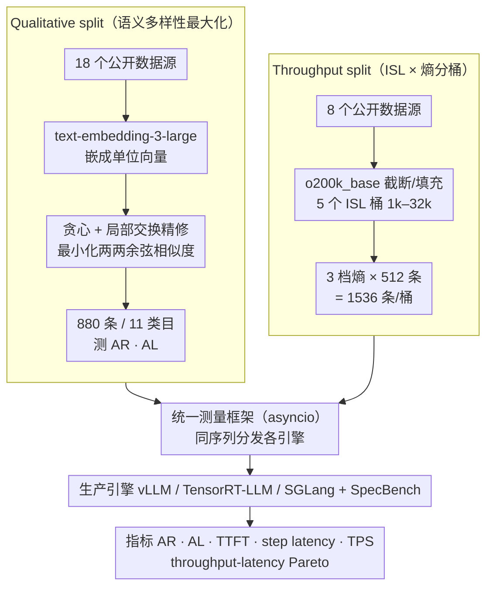

# SPEED-Bench: A Unified and Diverse Benchmark for Speculative Decoding

**会议**: ICML 2026  
**arXiv**: [2604.09557](https://arxiv.org/abs/2604.09557)  
**代码**: HuggingFace 数据集已开源（论文脚注 1）  
**领域**: 模型压缩 / LLM效率  
**关键词**: 投机解码, 推理加速, 评测基准, 吞吐-时延, 生产引擎

## 一句话总结
SPEED-Bench 是一个面向投机解码（Speculative Decoding, SD）的统一基准，它通过 *Qualitative split*（最大化语义多样性的 880 条样本）与 *Throughput split*（按 1k–32k 输入长度桶组织、覆盖三档熵的大批量数据）配合一套对接 vLLM / TensorRT-LLM / SGLang 的测量框架，揭示了过去 SD 论文里被"小数据 + 单批 + HuggingFace"评测掩盖的真实部署行为。

## 研究背景与动机

**领域现状**：投机解码已成为加速 LLM 自回归推理的主流手段——用一个轻量 draft model 一次性预测 $\gamma$ 个 token，再让 target model 在一次前向中并行验证，凭借现代 GPU "搬权重比算还慢"这一特性实现近似无损的提速。从 vanilla SD 到 Medusa、EAGLE3，再到 Qwen3-Next / DeepSeek-R1 / Nemotron-3 等前沿模型把多 token 预测（MTP）头原生集成进架构，社区已经积累了一整套 drafter 设计。

**现有痛点**：评估这套技术却仍处在"作坊式"阶段。SPEED-Bench 的作者归纳出四条具体裂缝：(1) 接受率对文本分布和熵高度敏感，可各家论文用的数据集不一致，跨方法对比缺基线；(2) 主流 paper 仍跑 HuggingFace 这种研究级 runtime，不反映 vLLM / TensorRT-LLM 这种生产引擎里 CUDA Graph、连续批处理、kernel fusion 带来的真实开销；(3) 大多数实验只看 batch size = 1 的延迟，而工业部署关心多用户高吞吐场景，此时系统会从 memory-bound 滑向 compute-bound，SD 收益常被严重高估；(4) 输入序列长度（ISL）几乎没人测过 8k 以上，但 coding 助手等真实工作负载早已进入长上下文区间。

**核心矛盾**：SD 的性能是**数据相关**的，但现有基准（如 MT-Bench、SpecBench）的样本量与类内多样性都远不足以稳定衡量这种数据相关性——SpecBench 多数类目只有 10 条样本、平均 ISL <100 token，其多语种子集甚至 100% 是 "Translate German to English:" 模板，从根上无法反映现代 LLM 的输入分布。

**本文目标**：交付一个**单一、可复现**的评测套件，同时回答两个问题——(a) drafter 在丰富语义域上的接受率究竟有多稳？(b) 在不同批量与不同 ISL 的真实 serving 配置下，SD 的端到端速比到底剩多少？

**切入角度**：把基准切成"质评"和"吞吐"两半——前者用语义嵌入做去冗余采样、把样本数压到最小的同时把多样性顶到最高；后者放弃细粒度领域、转而保证每个 ISL 桶里有足量样本以画稳定的 Pareto 曲线，并显式与生产引擎打通而非自己另起一套 runtime。

**核心 idea**：用**语义多样性最大化的紧凑数据集 + 生产引擎里的统一测量框架**替代过去"小拼盘 + HuggingFace"的评估方式，让 SD 的论文数字真正能对应到工业部署里的可观测加速。

## 方法详解

### 整体框架
SPEED-Bench 想解决的是"SD 论文数字对不上工业部署"这件事，做法是把基准拆成两份各司其职的数据集 + 一套统一测量框架。Qualitative split 负责回答"drafter 接受率稳不稳"——从 18 个公开数据源精选 880 条样本，按 11 个语义类目（Coding / Humanities / Math / Multilingual / QA / RAG / Reasoning / Roleplay / STEM / Summarization / Writing）组织，专测接受率（AR）与接受长度（AL）；Throughput split 负责回答"真实 serving 下速比剩多少"——按 5 个固定 ISL 桶（1k / 2k / 8k / 16k / 32k）× 3 个熵档（Low / Mixed / High）共 1536 条/桶，用来画 throughput-latency 的 Pareto 曲线；二者都喂给同一个 asyncio 测量框架，它把同一份 token 序列分发到 SGLang / vLLM / TensorRT-LLM / SpecBench，靠流式响应里"一个 chunk 内吐多少 token"反解 AR，并记录 TTFT、step latency、User TPS、Output TPS。贯穿全程的取舍是：**外部因素（tokenizer、BOS、chat template）做归一以保证 apples-to-apples，内部因素（kernel / scheduler / 连续批处理）保留以反映真实部署**。

### 关键设计

**1. 语义多样性最大化的 Qualitative split：用最小子集顶满语义覆盖**

针对"各家论文数据集不一致、接受率对文本分布又极敏感、跨方法无可比基线"这个痛点，作者不靠堆样本量，而是在每个类目只挑 80 条、却让它们尽量互不相似。具体做法是把每条 prompt 经 OpenAI `text-embedding-3-large` 嵌成单位向量 $x_i$，目标是从 $N$ 个候选中选出 $|S|=k$ 的子集 $S$，最小化两两余弦相似度之和 $\mathcal{L}(S) = \sum_{i \in S} \sum_{j \in S, j \neq i} x_i^\top x_j$。这是个 NP-hard 问题，论文用"贪心 + 局部交换精修"（Greedy + LSR）求近似解：先随机起点、按 $i^\ast = \arg\min_{i \notin S} \sum_{j \in S} x_i^\top x_j$ 逐点加入，再反复尝试 $i_{out} \in S$ 与 $i_{in} \notin S$ 的对换，仅当目标下降 $\Delta < 0$ 时执行交换以跳出局部最小。之所以这样有效：穷举 18 个数据源的笛卡尔积代价太高、随机抽样又留大量冗余，而这套算法把平均语义相似度比 SpecBench 压低 40%（多语种类目降 83%），同时给每条样本附 subcategory / multi-turn / difficulty 等元数据，支持后续细粒度切片分析。

**2. 按 ISL × 熵分桶的 Throughput split：把"随机 token 合成 prompt"换成真实长上下文负载**

这一设计针对的痛点是"没人测过 8k 以上 ISL、合成 token 又会骗评测"。作者用 `o200k_base` 分词器把样本截断或填充到固定 ISL 桶（1k / 2k / 8k / 16k / 32k），再按文本域熵分到 Low / Mixed / High 三档（排序与 coding 属低熵、STEM 属混合熵、创意写作属高熵），每桶 512 条 × 3 档 = 1536 条，从而能稳定画出 Pareto 曲线。配套还给出一个"领域速比"的解析代理：若已测得自回归 per-step 延迟 $t_{ar}$ 与 SD per-step 延迟 $t_{sd}$，则 $\text{Speedup} = (t_{ar} \cdot AL) / t_{sd}$，把 AL 这个数据相关量与系统级 per-step 延迟解耦，新领域只需测两类纯净量即可预测速比。用真实 prompt 而非合成 token 是有原因的：作者实证发现随机 token 会触发两类失败模式——"trivial response"（模型把噪声当礼貌寒暄、AR 虚高）和"topic latching"（抓住噪声里的关键词幻觉一段连贯文本、AR 偏低），还会让 MoE 的 router 坍缩到少数专家、连 SD 的 step latency 都测不准。

**3. 生产引擎里的统一测量框架：分离"算法本身"与"工程实现"的贡献**

为了让同一份 prompt 在不同 runtime 上跑出可比的 AR / AL / TTFT / step latency / User TPS / Output TPS，框架用 asyncio 并发派发请求来模拟多用户 serving，并通过解析流式响应里每个 chunk 携带的 token 数反推接受长度——一个 chunk 含多 token 就代表一次成功的投机。这里 AL 有明确定义：$\text{AL} = \mathbb{E}[L_t] = 1 + \sum_{i=1}^{\gamma} \prod_{j=1}^{i} \text{AR}_j$，其中 $\text{AR}_i$ 是给定前缀已被接受时第 $i$ 个 draft token 的条件接受率。关键在于它把 BOS、chat template 等外部差异在客户端统一处理，却保留各引擎内部的 CUDA Graph / 连续批处理 / kernel fusion——这正是过去"用 HuggingFace 测 SD"会与生产部署严重偏离的根源。框架同时与 SpecBench 兼容（论文给出 Medusa 在其中跑通的例子），既不抛弃研究社区资产，又把评测重心拉回部署可行性。

### 损失函数 / 训练策略
本工作不训练任何 drafter，所有结论来自基准评测；超参主要落在数据侧——$k$ = 80（Qualitative 每类样本数）、ISL 桶 = {1k, 2k, 8k, 16k, 32k}，以及评测侧的 draft length $\gamma$、batch size 与温度（论文给出 $T=0$ 和 $T=1$ 两套）。

## 实验关键数据

### 主实验
在 Qualitative split 上，覆盖 Llama 3.3 70B / GPT-OSS 120B / DeepSeek R1 / Qwen3 235B / Qwen3-Next 五个大模型 × N-Gram / Vanilla SD / EAGLE3 / 原生 MTP 四类 drafter，全部在 NVIDIA B200 上、batch size = 32、draft length = 3、温度 = 0 的设置下：

| 模型 | Drafter | 平均接受长度 (Mean AL) | 平均速比 (T=0) | 平均速比 (T=1) |
|------|---------|------------------------|----------------|----------------|
| Llama 3.3 70B | N-Gram | 1.41 | 0.88× | 0.85× |
| Llama 3.3 70B | Vanilla SD | 2.44 | 1.60× | 1.15× |
| Llama 3.3 70B | EAGLE3 | 2.44 | 1.90× | 1.75× |
| GPT-OSS 120B | EAGLE3 | 2.25 | 1.34× | 1.06× |
| GPT-OSS 120B | 原生 MTP | 2.55 | 1.45× | — |
| DeepSeek R1 | Vanilla SD | 2.43 | 1.17× | 1.06× |
| Qwen3-Next | 原生 MTP | 2.81 | 1.20× | 1.18× |

关键现象：(a) N-Gram 在多数大模型上速比 < 1×（GPT-OSS 120B 上仅 0.29×），说明启发式 drafter 在 batch=32 的中等并发下已是负收益；(b) 温度从 0 升到 1 普遍会让速比损失 0.1–0.5×，但 EAGLE3 类外置 drafter 的退化幅度小于原生 MTP。

### 消融实验（语义多样性与基准敏感度）

| 配置 | 平均语义相似度 | 与 SpecBench 对比 | 说明 |
|------|----------------|-------------------|------|
| SpecBench 原版 | 基线 | — | MT-Bench 主导，类内多样性低 |
| 同源数据 + 随机抽样 | 多数类目低于 SpecBench | 数据源质量验证 | 证明 18 个新数据源本身就更好 |
| 同源数据 + 仅贪心（No LSR） | 进一步降低 | 算法贡献的下界 | 已优于随机 |
| 同源数据 + Greedy + LSR（本文） | 比 SpecBench 低 40%（多语种低 83%） | 全部类目最优 | 局部交换跳出局部最小 |

### 关键发现
- **生产引擎 vs HuggingFace**：相同 drafter 在 vLLM / TensorRT-LLM 上的速比常被"系统层优化"吃掉一截，论文实测显示忽略这一点会让论文数字与部署观感差到难以解释。
- **合成 token 会"骗"评测**：随机 token batch 在 MoE 上能让 router 坍缩到几个专家，连基线 step latency 都失真；用真实长 prompt 测出的 throughput 与合成 prompt 测出的差距足以颠倒"哪个 drafter 更好"的结论。
- **最优 draft length 与 batch size 强耦合**：从 $BS=1$ 到 $BS=32$，最优 $\gamma$ 会显著前移；只汇报 $BS=1$ 的速比会系统性高估真实部署收益。
- **vocabulary pruning 的副作用**：state-of-the-art drafter 里常见的"剪 vocab 提速"在低多样性数据上几乎无害，但在 SPEED-Bench 上会暴露出对长尾 token 的接受率坍塌。

## 亮点与洞察
- **把"评估方法论"本身当成一篇 ICML 论文做**：核心贡献不是新算法而是把"评测什么、怎么测、在哪测"形式化，体现 SD 这条工程线已成熟到需要标准化。
- **语义嵌入 + 贪心交换的样本筛选**很巧妙：用最小化两两相似度替代"覆盖率"的模糊概念，在 NLP 评测、RLHF prompt 池筛选等任务上都可直接复用。
- **解耦"系统 per-step 延迟"与"算法 AL"**的解析速比公式让作者只需测两类纯净量就能预测任意领域速比，避免每个新领域都重新搜集大规模数据。

## 局限与展望
- 框架本身在 $BS > 256$ 时受 Python GIL 限制，作者承认这是当前实现瓶颈，需要进一步引入多进程或 Rust 客户端。
- Qualitative split 只 880 条样本，对训练自回归 drafter 而言数据量不足，更多用于"评测"而非"开发"。
- 没有覆盖加密 / 隐私场景（如 differential privacy 下的 drafter），也没把推测攻击或 prompt injection 当成评测维度。
- 五个 ISL 桶离散，对 ISL 介于 2k–8k 之间的真实日志型 workload 仍需插值，未来可考虑连续化 ISL。

## 相关工作与启发
- **vs SpecBench (Xia et al., 2024)**: SpecBench 是研究社区的事实标准，但它 70%+ 数据来自 MT-Bench，每类样本量极小且 ISL 短；SPEED-Bench 在数据源、采样策略、ISL 覆盖与生产引擎对接四个维度上都做了升级，并把 SpecBench 作为可调用 backend 而非取代它。
- **vs EAGLE3 / Medusa 等 drafter 论文**: 这些工作各自挑选评测集，导致数字难比；SPEED-Bench 不发明 drafter，但用统一数据 + 统一 runtime 让它们的数字第一次"可加可减"。
- **vs LongSpec / MagicDec**: 后两者专攻长上下文 drafter，SPEED-Bench 的 32k ISL 桶恰好是检验它们的合适场地。

## 评分
- 新颖性: ⭐⭐⭐⭐ 不是新算法，但把评测方法论形式化并落地到生产引擎，定位精准。
- 实验充分度: ⭐⭐⭐⭐⭐ 覆盖五大模型 × 四类 drafter × 两种温度 × 多批量 × 五种 ISL 桶。
- 写作质量: ⭐⭐⭐⭐ 章节清晰、动机—问题—方法—证据链条完整；附录较重需要查阅。
- 价值: ⭐⭐⭐⭐⭐ 极有可能成为社区下一阶段比较 drafter 的事实标准。

## 评分
- 新颖性: 待评
- 实验充分度: 待评
- 写作质量: 待评
- 价值: 待评

<!-- RELATED:START -->

## 相关论文

- [\[ICML 2026\] LK Losses: Direct Acceptance Rate Optimization for Speculative Decoding](lk_losses_direct_acceptance_rate_optimization_for_speculative_decoding.md)
- [\[CVPR 2026\] VVS: Accelerating Speculative Decoding for Visual Autoregressive Generation via Partial Verification Skipping](../../CVPR2026/model_compression/vvs_accelerating_speculative_decoding_for_visual_autoregressive_generation_via_p.md)
- [\[ACL 2026\] SSSD: Simply-Scalable Speculative Decoding](../../ACL2026/model_compression/sssd_simply-scalable_speculative_decoding.md)
- [\[AAAI 2026\] Steering Pretrained Drafters during Speculative Decoding](../../AAAI2026/model_compression/steering_pretrained_drafters_during_speculative_decoding.md)
- [\[NeurIPS 2025\] Traversal Verification for Speculative Tree Decoding](../../NeurIPS2025/model_compression/traversal_verification_for_speculative_tree_decoding.md)

<!-- RELATED:END -->
