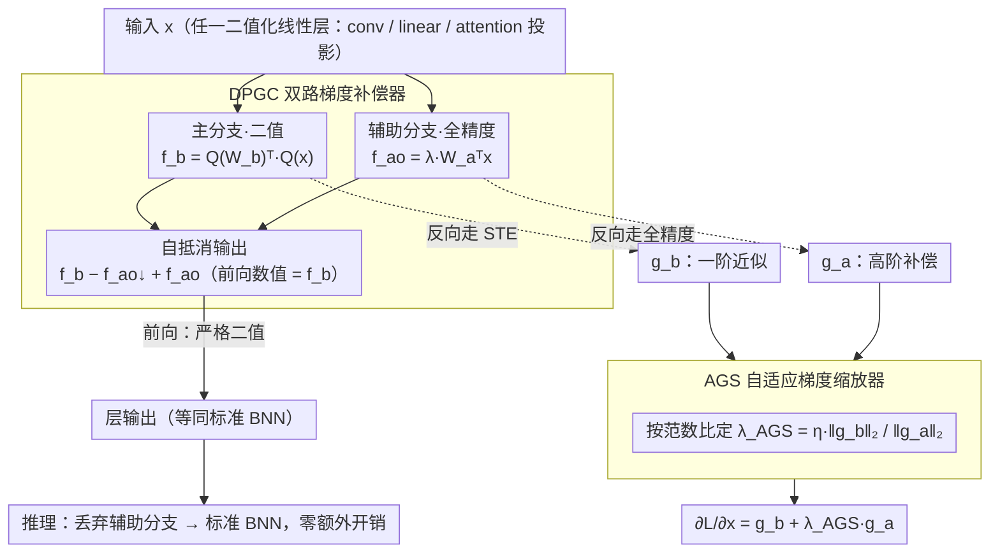

# SURGE: Surrogate Gradient Adaptation in Binary Neural Networks

**会议**: ICML 2026  
**arXiv**: [2605.10989](https://arxiv.org/abs/2605.10989)  
**代码**: 暂未公开  
**领域**: 模型压缩 / 二值神经网络 / 量化感知训练  
**关键词**: BNN、STE、梯度失配、双路径补偿、自适应梯度缩放

## 一句话总结
SURGE 给每个二值化层并联一个"全精度辅助分支"，前向输出不变但反向能从全精度分支额外回传一份"非 STE 截断"的高阶梯度，并用 AGS 按梯度范数比动态平衡两路贡献，让 BNN 在 ResNet-18/ImageNet 上做到 62.0% top-1，比 ReCU 高 1.0%、比 IR-Net 高 3.9%。

## 研究背景与动机

**领域现状**：二值神经网络（BNN）把权重和激活量化到 $\{-1,+1\}$，理论上能给出 $32\times$ 内存压缩和 $58\times$ 推理加速，是边缘部署最激进的量化方案。训练上几乎所有 BNN 都依赖 Straight-Through Estimator（STE）：前向走 $\text{sign}(\cdot)$，反向直接把 $\frac{\partial\mathbf{B}_W}{\partial W}\approx 1$、$\frac{\partial\mathbf{B}_x}{\partial x}\approx\mathbb{1}_{\{|x|\le 1\}}$ 当作代理梯度。

**现有痛点**：STE 有两个根本问题。其一，sign 的真梯度几乎处处为零，用恒等函数做替身会引入系统性偏差，是公认的"梯度失配（gradient mismatch）"。其二，激活梯度被硬剪到 $[-1,1]$ 外即清零，大量信息被丢弃。已有工作（DSQ 的 sigmoid 近似、IR-Net 的渐近 sign、ReCU 的特征分布对齐）大多依赖手工设计的近似函数，无法保证最优。

**核心矛盾**：BNN 训练里"前向必须严格二值（保证推理加速）" 和 "反向必须有足够丰富的梯度（保证能学）"是一对硬矛盾——只要前向是 sign，反向就只能拿一阶恒等代理凑合。

**本文目标**：1) 在不改前向输出的前提下，从外部补一份"非 STE、低偏差"的梯度回 main branch；2) 防止补偿梯度量级失衡破坏主分支收敛；3) 推理阶段彻底丢掉辅助分支，零额外开销。

**切入角度**：既然 STE 是 sign 的一阶近似，那就给每层并联一个"全精度副本"用它的真实梯度去补 STE 缺的高阶项；同时由于两路梯度量级未知，用 norm-ratio 自适应缩放来动态平衡。

**核心 idea**：用"前向自抵消、反向开门"的 detach 技巧让全精度辅助分支只参与反向，再用 AGS 按 $\frac{\|g_b\|_2}{\|g_a\|_2+\epsilon}$ 自适应缩放，把 STE 的一阶 surrogate 修成更接近真实梯度的混合估计。

## 方法详解

### 整体框架
SURGE 想在不碰前向输出的前提下，给每个二值化层补一份"比 STE 更接近真梯度"的反向信号。具体做法是：对每个二值化线性算子（conv、linear、attention projection）并行挂一个尺寸完全相同的全精度副本（auxiliary branch），用一个 detach 自抵消的写法让这个副本**前向不出力、反向才开门**——前向输出严格等于纯 BNN，反向时全精度副本把 STE 剪掉的高阶梯度补回输入处，再由 AGS（自适应梯度缩放器）按两路梯度的范数比动态缩放、保证补偿量级不压垮主分支。这套机制只依赖"一个二值化线性算子 + 一个同尺寸全精度副本"的最小结构，因此 architecture-agnostic、CNN 和 Transformer 都能即插即用；训练时整网三种计算状态（主分支前向、主分支反向、辅助分支反向）共存，训练完毕后辅助分支整体丢弃，推理就是一个标准 BNN，零额外开销。

### 关键设计

**1. Dual-Path Gradient Compensator（DPGC）：让前向走二值、反向走全精度，用 detach 让这对矛盾共存**

BNN 训练的死结是"前向必须严格 sign（保推理加速）"和"反向需要丰富梯度（保能学）"互斥，过去的改进（piecewise polynomial、SignSwish 等）都只是"换个更光滑的函数继续骗 STE"，没真正绕开。DPGC 的做法是给每层并联一个全精度副本，再用一个自抵消的输出公式把两件事拆开。记二值前向 $f_b(x;W_b)=Q_W(W_b)^\top Q_x(x)$、全精度前向 $f_a(x;W_a)=W_a^\top x$、缩放后的辅助项 $f_{ao}(x)=\lambda f_a(x)$，输出写成

$$\text{output}=f_b(x;W_b)-f_{ao}(x;W_a)\!\downarrow+\,f_{ao}(x;W_a)$$

其中 $\downarrow$ 表示 stop-gradient。前向时后两项数值相等、正负抵消，输出严格等于 $f_b$；反向时被 detach 那一项的梯度被截断，只剩 $f_b$ 走 STE、$f_{ao}$ 走全精度，于是输入处的梯度变成 $\frac{\partial\mathcal{L}}{\partial x}=g_b+\lambda g_a$——$g_b$ 是 STE 给的一阶近似，$g_a$ 则是全精度副本提供的高阶补偿。这样"输出严格二值"和"反向拿到全精度信号"同时成立，而且推理阶段辅助分支可直接丢弃，不留任何开销。

**2. Adaptive Gradient Scaler（AGS）：按梯度范数比动态定 $\lambda$，让补偿路只做修正不夺权**

DPGC 补进来的 $g_a$ 量级未知：固定 $\lambda$ 取大了辅助路会炸掉主分支、取小了补偿又形同虚设。AGS 干脆把缩放因子写成两路梯度的范数比

$$\lambda_{\text{AGS}}=\eta\,\frac{\|g_b\|_2}{\|g_a\|_2+\epsilon}$$

$\eta$ 是基础缩放系数、$\epsilon=10^{-8}$ 防除零。这个形式不是拍脑袋来的：论文从二阶矩模型出发证明最优缩放为 $\lambda^*=\frac{\langle\delta_b,\mu_a\rangle}{\|\mu_a\|_2^2+\text{tr}(\text{Var}(g_a))}$（$\delta_b$ 是 STE 的偏差向量），再在 alignment $\cos\theta$、相对偏差比 $\beta=\|\delta_b\|_2/\|\mu_b\|_2$、噪声比 $\rho$ 都近似稳定的假设下退化为 $\lambda^*\approx\eta\frac{\|\mu_b\|_2}{\|\mu_a\|_2}$，最后用 mini-batch 的梯度范数估计 $\|\mu\|_2$，就得到上面的实用公式。效果上它让两路始终量级相当，STE 仍主导优化方向、辅助路只作高阶修正，相当于在均方误差意义下取了两路梯度的最优凸组合。

### 损失函数 / 训练策略
端到端 cross-entropy（分类）/ detection loss（VOC）/ NLU loss（GLUE），不引入额外训练损失。$\eta$ 是少数需调的超参；推理零额外开销。

## 实验关键数据

### 主实验
覆盖 4 个 benchmark：CIFAR-10、ImageNet-1K（ResNet-18/34、ReActNet）、PASCAL VOC（Faster-RCNN + ResNet-18 backbone）、GLUE（BERT-base）。

| 网络 / 任务 | 方法 | W/A | Top-1 / mAP / 平均 |
|------------|------|-----|--------------------|
| ResNet-18 / CIFAR-10 | ReCU | 1/1 | 92.8% |
| ResNet-18 / CIFAR-10 | **SURGE** | 1/1 | **93.1%** (+0.3) |
| ResNet-20 / CIFAR-10 | ReCU | 1/1 | 87.4% |
| ResNet-20 / CIFAR-10 | **SURGE** | 1/1 | **88.0%** (+0.6) |
| VGG-Small / CIFAR-10 | ReCU | 1/1 | 92.2% |
| VGG-Small / CIFAR-10 | **SURGE** | 1/1 | **92.5%** (+0.3) |
| ResNet-18 / ImageNet (one-stage) | IR-Net | 1/1 | 58.1% |
| ResNet-18 / ImageNet (one-stage) | BONN | 1/1 | 59.3% |
| ResNet-18 / ImageNet (one-stage) | ReCU | 1/1 | ~61% |
| ResNet-18 / ImageNet (one-stage) | **SURGE** | 1/1 | **62.0%** (+3.9 over IR-Net) |

在 VOC、GLUE 上同样全面超越前 SOTA，且 OPs 与之前 BNN 一致（推理开销零增）。

### 消融实验

| 配置 | ImageNet ResNet-18 Top-1 (one-stage 量化) | 说明 |
|------|----------------------------|------|
| STE baseline | 较 SURGE 低数个百分点 | 仅一阶 surrogate |
| + DPGC（固定 $\lambda$） | 显著提升，但偶尔不稳定 | 缺乏量级平衡 |
| + AGS（norm-ratio）= **SURGE** | **62.0%** 且训练稳定 | 全模型 |
| 改 AGS 为定值 $\lambda$ | 大 $\lambda$ 训不动、小 $\lambda$ 无补偿 | 验证自适应必要性 |
| 仅在最后几层用 DPGC | 提升幅度大幅减小 | 越深层失配累积越严重 |

### 关键发现
- 图 1 的梯度统计显示：加 SURGE 后激活梯度分布明显**右移**且尾部更重，证实辅助分支确实恢复了 STE 剪掉的那部分信息。
- DPGC + AGS 的组合在 ImageNet 上比单 DPGC 提升 0.5~1%，说明量级平衡不仅是"工程稳定性"，而是收敛的必要条件。
- ResNet-18 训完丢掉辅助分支后，推理 OPs 与标准 BNN 一致（$1.63\times 10^8$），完美匹配"训练补偿、推理零额外开销"的目标。
- 在 BERT-base/GLUE 上同样有效，证明 SURGE 不局限于卷积，对 attention projection 这类 linear 算子也适用。

## 亮点与洞察
- "detach 自抵消"的写法是整篇文章最巧的工程 trick：$f-f\downarrow+f$ 在前向是 $f$、在反向是 $f$ 的真实梯度，对所有"想让前向走 A、反向走 B"的场景都通用，可以迁移到知识蒸馏、对抗训练、可微剪枝等任务。
- "把 STE 当低阶近似、用全精度副本补高阶项"的视角把 BNN 训练问题从"找个更聪明的 sign 近似"重构为"补偿一阶 Taylor 残差"，物理直觉清楚得多。
- AGS 用 norm-ratio 平衡两路，本质和 GradNorm、PCGrad 这类多任务梯度平衡同构，但理论推导明确给出了"最优 $\lambda^*$ 在等向噪声下退化为 $\eta\|\mu_b\|_2/\|\mu_a\|_2$"，比纯启发式有说服力。

## 局限与展望
- 训练时显存与 FLOPs 都几乎翻倍（辅助分支与主分支同尺寸），训成本不低。
- $\eta$ 仍需手调，对不同 backbone 最优值不一致；理论上 $\eta=\kappa c_\theta/(1+\rho)$，但这些量没人监控，实操还是 grid search。
- 假设 $g_b$、$g_a$ noise 不相关，深层网络里这个假设未必精确成立。
- 与多 bit 量化（W2A2、W4A4）的对比缺失，纯 1-bit 之外的迁移效果未知。

## 相关工作与启发
- **vs IR-Net / ReCU / BONN**：他们都在改 sign 的近似函数或权重分布，本质是"改前向"；SURGE 不动前向，只在反向开旁路，思路正交而且能跟前者叠加。
- **vs DSQ / LSQ**：DSQ 用 parametric sigmoid 渐近逼近 sign，LSQ 引入可学习 scale；SURGE 把"可学习"放到一个完全独立的全精度副本里，表达力更强且推理零负担。
- **vs Frequency-domain BNN（FDA-BNN）**：FDA-BNN 把 sign 转到频域去缓解失配；SURGE 直接在空域用全精度梯度补，工程实现更简单。

## 评分
- 新颖性: ⭐⭐⭐⭐ "前向自抵消、反向开门"的 detach 技巧 + AGS 的 norm-ratio 推导组合，构造干净。
- 实验充分度: ⭐⭐⭐⭐ 横跨 4 大 benchmark、3 类任务、CNN + Transformer，BNN 论文里属上乘。
- 写作质量: ⭐⭐⭐⭐ 图 1/2 把核心机制说得很直观，定理 5.3 与推论 5.4 的推导也清楚。
- 价值: ⭐⭐⭐⭐ ResNet-18/ImageNet 推到 62.0% 是当年 one-stage BNN 的新天花板，且推理零额外开销，工业落地友好。

<!-- RELATED:START -->

## 相关论文

- [\[CVPR 2026\] AdaBet: Gradient-free Layer Selection for Efficient Training of Deep Neural Networks](../../CVPR2026/model_compression/adabet_gradient-free_layer_selection_for_efficient_training_of_deep_neural_netwo.md)
- [\[AAAI 2026\] BD-Net: Has Depth-Wise Convolution Ever Been Applied in Binary Neural Networks?](../../AAAI2026/model_compression/bd-net_has_depth-wise_convolution_ever_been_applied_in_binary_neural_networks.md)
- [\[ICML 2026\] Partial Fusion of Neural Networks: Efficient Tradeoffs Between Ensembles and Weight Aggregation](partial_fusion_of_neural_networks_efficient_tradeoffs_between_ensembles_and_weig.md)
- [\[ICML 2025\] An Efficient Matrix Multiplication Algorithm for Accelerating Inference in Binary and Ternary Neural Networks](../../ICML2025/model_compression/an_efficient_matrix_multiplication_algorithm_for_accelerating_inference_in_binar.md)
- [\[ICLR 2026\] Adaptive Width Neural Networks](../../ICLR2026/model_compression/adaptive_width_neural_networks.md)

<!-- RELATED:END -->
