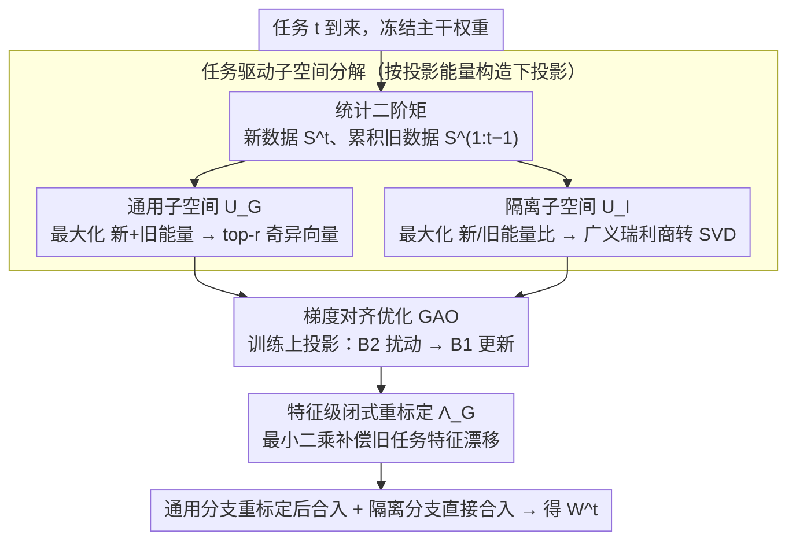

# Task-Driven Subspace Decomposition for Knowledge Sharing and Isolation in LoRA-based Continual Learning

**会议**: ICML 2026  
**arXiv**: [2603.00191](https://arxiv.org/abs/2603.00191)  
**代码**: 无  
**领域**: 模型压缩 / LoRA / 持续学习  
**关键词**: LoRA、持续学习、子空间分解、投影能量、特征级重标定

## 一句话总结
LoDA 把 LoRA 的下投影矩阵按「投影能量」拆成一个跨任务共享的通用子空间和一个真正只激活新任务的隔离子空间，再用梯度对齐训练上投影、并在融合时给通用分支闭式重标定，从而在多个持续学习 benchmark 上稳定刷过现有 LoRA-CL 方法。

## 研究背景与动机
**领域现状**：基于预训练 ViT 的持续学习（CL）几乎已被 PEFT 派统治：要么走 prompt pool（L2P / DualPrompt / CODAPrompt），要么走 LoRA 派（O-LoRA、InfLoRA、Bi-LoRA、PLAN、SD-LoRA 等），它们都希望靠少量可训练参数同时维持「稳定性—可塑性」。

**现有痛点**：当前 LoRA-CL 的主流玩法是把新任务的 LoRA 更新限制在「旧任务零空间」里来防遗忘，但这有两个问题：(1) 任务间天然存在共享方向，硬扣到零空间会把这些可迁移信息一刀切掉，迁移变差；(2) 当任务分布高度相关（现实 CL 的常态）时，「旧任务零空间」对新任务也几乎是零激活，所谓的「隔离基」其实是个安全的死区，根本学不动新任务。作者用 10S-ImageNetA 实测了一个 $r^t(\mathbf{U}_{\text{null}})\approx 1.0$，证明零空间方向对新旧任务一样不活跃。

**核心矛盾**：现有 LoRA-CL 把「隔离」和「迁移」对立起来，并且用一个被旧任务定义的负空间近似来回答「该往哪学新任务」，这两件事天然冲突——既扔掉了共享方向，又选错了任务方向。

**本文目标**：(i) 显式保留跨任务可迁移方向以促进知识迁移；(ii) 找到真正对新任务高响应、对旧任务低干扰的隔离方向；(iii) 在融合 LoRA 增量回主干时尽量逼近所有任务共同的最优。

**切入角度**：作者从「LoRA 学习能力」的梯度视角切入，证明只更新上投影 $\mathbf{B}$ 时一阶损失下降幅度由投影能量 $E=\|\mathbf{A}\mathbf{X}^\top\|_2^2$ 完全决定，即下投影 $\mathbf{A}$ 是个「能量门」，由它决定哪些输入特征会被更新。这把「该怎么设计 $\mathbf{A}$」直接还原为一个能量优化问题。

**核心 idea**：固定 LoRA 下投影 $\mathbf{A}$ 为两套数据驱动的正交基——「跨任务能量都高」给通用分支，「新/旧任务能量比最大」给隔离分支，配合梯度对齐训练和闭式重标定。

## 方法详解

### 整体框架
LoDA 想同时做到两件原本被对立的事：保留任务间可迁移的共享方向、又找到真正只对新任务高响应的隔离方向。做法是在每个 ViT 层挂一个双分支 LoRA——通用分支 $(\mathbf{A}_G,\mathbf{B}_G)$ 管知识共享、隔离分支 $(\mathbf{A}_I,\mathbf{B}_I)$ 管任务专属增量。第 $t$ 个任务到来时冻结主干 $\mathbf{W}^{t-1}$，先用新数据二阶矩 $\mathbf{S}^t$ 和累积旧数据二阶矩 $\mathbf{S}^{1:t-1}$ 解两个能量目标算出两套正交基 $\mathbf{U}_G,\mathbf{U}_I$ 并冻进下投影，再只在新数据上用 GAO 训练上投影，最后任务结束时对通用分支做闭式重标定后合入主干、隔离分支直接合入。

### 关键设计

**1. 任务驱动子空间分解：把「该往哪学」从负空间近似换成正向的能量目标**

现有 LoRA-CL 把新任务更新硬扣进「旧任务零空间」，既丢掉了共享方向、又在任务相关时让隔离基变成死区。LoDA 的关键洞察来自梯度视角（Theorem 3.1）：只更新上投影 $\mathbf{B}$ 时一阶损失下降幅度完全由投影能量 $E=\|\mathbf{A}\mathbf{X}^\top\|_2^2$ 决定，于是下投影 $\mathbf{A}$ 成了一道「能量门」，设计 $\mathbf{A}$ 就等价于一个能量优化问题。通用子空间最大化新旧能量之和 $E_{\text{old}}+E_{\text{new}}$，闭式解就是 $(\mathbf{S}^{1:t-1}+\mathbf{S}^t)$ 的 top-$r$ 奇异向量；隔离子空间则最大化「新任务能量 / 旧任务能量」之比 $\mathrm{tr}(\mathbf{U}^\top\mathbf{S}^t\mathbf{U})/\mathrm{tr}(\mathbf{U}^\top\mathbf{S}^{1:t-1}\mathbf{U})$，作者对旧数据二阶矩做 Cholesky 分解 $\mathbf{S}^{1:t-1}=\mathbf{L}\mathbf{L}^\top$，把这个广义瑞利商问题转成 $\tilde{\mathbf{S}}^t=\mathbf{L}^{-1}\mathbf{S}^t\mathbf{L}^{-\top}$ 的普通 SVD，再换回原空间得到 $\mathbf{U}_I=(\mathbf{L}^{-1})^\top\tilde{\mathbf{U}}_I$。这样隔离方向是被「对新任务能量大、对旧任务能量小」正向定义出来的，而不是被旧任务反向圈出的死区——这正是它在任务高度相关的场景里仍学得动新任务的原因。

**2. 梯度对齐优化 GAO：训练上投影时主动避开会被未来任务破坏的脆弱方向**

子空间冻好后还要训上投影 $\mathbf{B}_G,\mathbf{B}_I$，但 CL 里学当前任务时根本不知道未来类长什么样，类间梯度冲突会让学到的特征在后续任务到来时崩掉。GAO 把一个 batch $\mathcal{B}$ 切成两个标签不交集的子集 $\mathcal{B}_1,\mathcal{B}_2$：每步先用 $\mathcal{B}_2$ 的梯度在参数上扰动一小步（步长 $\rho\sim U(0,\rho_{\max})$ 随机化），再用 $\mathcal{B}_1$ 在扰动后的参数上算梯度做真正的更新，下一步两个子集互换角色。本质上是把 SAM 的「最坏邻域」思想搬到类别间冲突上——拿「另一组类的梯度」当扰动源，逼模型走两组都认可的方向，从而压掉那些只对当前类成立、容易被后续任务覆盖的脆弱方向。

**3. 特征级闭式重标定 $\mathbf{\Lambda}_G$：合入主干时精确补偿通用分支带来的旧任务漂移**

通用分支带来迁移收益的同时，必然让旧任务特征发生漂移。以前的 model merging（CoMA / BECAME 等）多在权重空间做 EMA 或基于 Fisher 估计的混合，依赖局部线性近似、有梯度估计误差。LoDA 改在特征层面下手：把「合入后旧任务 + 新任务的特征级误差」写成一个最小二乘问题，直接对修正矩阵 $\mathbf{\Lambda}_G$ 求闭式精确最优解再合入；隔离分支因为对旧任务能量本来就小，无需修正、直接 merge。在特征空间求精确最优避开了权重级近似误差，理论上界更紧，也使这一步可迁移到 RLHF / 多任务 LoRA 融合等场景。

### 损失函数 / 训练策略
训练损失就是标准交叉熵，梯度对齐正则不是显式加在损失里，而是通过 GAO 的双扰动结构隐式注入。子空间秩 $r$、通用分支权重 $w_G$、GAO 的 $\rho_{\max}$ 是三个关键超参。统计量 $\mathbf{S}^{1:t-1}$ 在每个任务结束时增量累加，全程无需保存旧数据。

## 实验关键数据

### 主实验
在 ImageNetR / ImageNetA / CIFAR100 / CUB 四个 benchmark 的 10 任务 CL 协议上对比 9+ 基线（覆盖 CVPR'22 ~ NIPS'25 范围）。

| 数据集 | 指标 | LoDA | 此前 SOTA (CoSO/LoRA-P&M) | 提升 |
|--------|------|------|--------------------------|------|
| 10S-ImageNetR | $\mathcal{A}_{Last}$ | **81.93** | 81.10 | +0.83 |
| 10S-ImageNetA | $\mathcal{A}_{Last}$ | **62.59** | 56.57 | **+6.02** |
| 10S-CIFAR100 | $\mathcal{A}_{Last}$ | **90.47** | 88.77 | +1.70 |
| 10S-CUB | $\mathcal{A}_{Last}$ | **81.74** | 78.29 | +3.45 |
| 20S-ImageNetA | $\mathcal{A}_{Last}$ | **55.74** | 52.27 | +3.47 |

在 feature replay 设定下 LoDA+CA 在 10S-ImageNetA 拿到 66.71，比此前最好的 MACIL (64.14) 高 2.57 点。

### 消融实验

| 配置 | 关键发现 |
|------|----------|
| Full LoDA | 基准 |
| 只用通用分支 | 任务隔离消失，新任务覆盖旧任务，掉点显著 |
| 只用隔离分支 | 缺乏迁移，相关任务上欠拟合 |
| 隔离分支换成零空间近似 | 在 ImageNetA 这种任务相关性强的场景退化最大，印证零空间近似失效 |
| w/o GAO | 类间梯度冲突放大，未来任务到来后旧类特征更易崩 |
| w/o 闭式重标定 | 通用分支带来的旧任务特征漂移得不到补偿 |

### 关键发现
- ImageNetA 提升最大（+6 点）正是因为它任务相关性最强，零空间近似最容易死，LoDA 的「比值最大化」隔离子空间在此场景天然有优势。
- 不用 feature replay 的 LoDA 已经能打过用 replay 的 SLCA / SSIAT / VQ-Prompt，说明子空间设计本身比额外存特征更划算。
- 任务数从 10 增到 20 时优势仍稳定（+3.47），说明该方法对长任务序列的退化更慢。

## 亮点与洞察
- **「比值最大化」选隔离方向**比传统「零空间近似」高明：前者直接定义了「我要的方向」，后者只定义了「我不要碰的方向」，在任务相关时两者完全不等价。
- **冻结下投影 + 学上投影**让 LoRA 训练过程的目标函数对子空间是「能量加权」的线性结构（Theorem 3.1），这是该方法整个数学骨架成立的关键，也启示后续工作可以把更多 PEFT 模块按「输入空间—参数空间」二分来分析。
- **特征级闭式重标定**绕开了权重级 model merging 的近似误差，是一个可迁移到 RLHF / 多任务 LoRA 融合的小 trick。

## 局限与展望
- 每个任务都要做一次广义特征值/SVD 分解（维度 $D\times D$，ViT 的 768 量级），任务多时累计开销不小，工程上需要 cache 和增量更新。
- 通用分支的秩 $r$ 和隔离分支的秩在所有层共用同一个值，没做层敏感性分析，浅层语义特征和深层任务特征可能需要不同 $r$。
- 假设任务边界清晰已知（task-aware），对 task-free CL 场景仍需扩展。
- 隔离子空间假设 $\mathbf{S}^{1:t-1}$ 满秩，当任务数极少或样本极少时这个 Cholesky 不一定数值稳定。

## 相关工作与启发
- **vs InfLoRA / O-LoRA**: 都把 LoRA 限制在「旧任务零空间」里，LoDA 用比值最大化绕开零空间近似失效问题，并补回了被丢掉的共享方向。
- **vs Bi-LoRA / PLAN**: 用固定的预定义正交基（如 DCT 基）冻结下投影，LoDA 改为数据驱动二阶矩谱分解，对任务相关性更敏感。
- **vs BECAME / CoMA**: 它们在权重空间用 EMA 或一阶 Fisher 估计做 merging，LoDA 在特征空间求闭式精确最优，避开了局部线性近似带来的误差。
- **vs SD-LoRA**: SD-LoRA 把方向与幅度解耦在低损失路径上更新参数，LoDA 直接把「方向选择」前置到下投影构造阶段，思路互补。

## 评分
- 新颖性: ⭐⭐⭐⭐ 「投影能量比值最大化」首次把 LoRA-CL 的隔离/共享真正按数据分开，理论清晰
- 实验充分度: ⭐⭐⭐⭐ 覆盖 4 个 dataset × 多个任务长度，对比基线足够新
- 写作质量: ⭐⭐⭐⭐ 数学推导清晰，图示和痛点动机连贯
- 价值: ⭐⭐⭐⭐ 对 LoRA-CL 这条工程主线是一个明显的能力升级，方法本身也可迁移到其他 PEFT 场景

<!-- RELATED:START -->

## 相关论文

- [\[ICML 2026\] Energy-Structured Low-Rank Adaptation for Continual Learning](energy-structured_low-rank_adaptation_for_continual_learning.md)
- [\[AAAI 2026\] Beyond Sharpness: A Flatness Decomposition Framework for Efficient Continual Learning](../../AAAI2026/model_compression/beyond_sharpness_a_flatness_decomposition_framework_for_efficient_continual_lear.md)
- [\[CVPR 2025\] LoRA Subtraction for Drift-Resistant Space in Exemplar-Free Continual Learning](../../CVPR2025/model_compression/lora_subtraction_for_drift-resistant_space_in_exemplar-free_continual_learning.md)
- [\[ACL 2026\] SAMoRA: Semantic-Aware Mixture of LoRA Experts for Task-Adaptive Learning](../../ACL2026/model_compression/samora_semantic-aware_mixture_of_lora_experts_for_task-adaptive_learning.md)
- [\[ICML 2026\] FedRot-LoRA: Mitigating Rotational Misalignment in Federated LoRA](fedrot-lora_mitigating_rotational_misalignment_in_federated_lora.md)

<!-- RELATED:END -->
