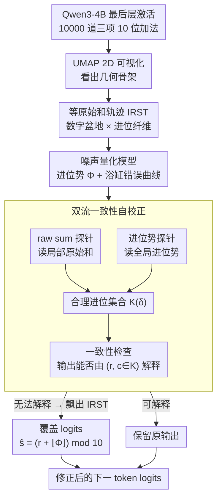

# The Shape of Addition: Geometric Structures of Arithmetic in Large Language Models

**会议**: ICML 2026  
**arXiv**: [2606.03645](https://arxiv.org/abs/2606.03645)  
**代码**: https://github.com/RL-MIND/Shape-of-Addition  
**领域**: 可解释性 / 机理分析 / LLM 算术  
**关键词**: 残差流几何, 等原始和轨迹, 噪声量化模型, 进位势, 推理期自校正

## 一句话总结
作者在 Qwen3-4B 的最后一层残差流里发现 LLM 做多操作数加法时，激活被组织成「数字盆 × 进位纤维」的分层流形，并把"算错一位"重新解释成沿着等原始和轨迹（IRST）滑过一个连续进位势的量化阈值，由此提出双流一致性检查，在推理期把"内部还知道但输出选错"的 off-by-one 错误纠回来。

## 研究背景与动机
**领域现状**：现有解释 LLM 算术能力的工作大体走两条路——一条把模型内部建模成符号化的查表 / 离散加法回路（如 Quirke、Nanda 等对小模型的电路逆向），另一条用线性探针扫描残差流，证明 LLM 内部确实编码了 ground truth、carry、raw sum 等中间量。两条路都积累了不少现象级证据。

**现有痛点**：尽管探针能从一条"出错样本"的激活里同时读出正确答案、错误输出、carry 等多组互相矛盾的信号（论文称之为 probe versatility），却没人解释清楚两件事：第一，单个向量为何能并存"对"和"错"两种语义；第二，这种内部表示几何如何机制性地诱导特定失败模式（尤其是多操作数加法里最常见的 off-by-one 进位错误）。

**核心矛盾**：以往的离散化视角假设模型内部状态是分类的，但探针读出来的连续标量（如 carry potential）暗示内部其实是连续流形；离散输出和连续表征之间缺少一座桥，这正是 LLM 在简单算术上反复"差一位"的根源。

**本文目标**：在表征层面给出一个能同时解释 (i) 探针多功能性、(ii) off-by-one 错误分布、(iii) 内部"知道"但输出"做不对"这三个观察的统一几何框架，并据此设计一个无需训练就能在推理期纠错的接口。

**切入角度**：作者选 3 项 10 位整数加法这种"足够难、足够规则"的任务，对每个生成位置 $p$ 提取最后一层激活 $\boldsymbol{h}_p^{(L)}$，用 UMAP（cos 距离）配合 logit 词嵌入做"语义锚点"，把高维流形压到 2D 同时保留可读的语义坐标。

**核心 idea**：把残差流看成一组「等原始和轨迹（IRST）」纤维，纤维上滑动的位置由一个连续的"进位势 $\Phi$"控制，输出数字是对 $\Phi$ 做带噪量化的结果；算错就是噪声把 $\Phi$ 推过一个整数阈值导致的几何滑移。

## 方法详解

### 整体框架
全篇不训练任何新模型，而是在一个固定的 Qwen3-4B（36 层）上做"观察现象 → 提出几何假设 → 解析建模 → 因果验证"的闭环分析。作者跑 10000 道三项 10 位整数加法，记录每个生成位置的最后一层激活向量 $\boldsymbol h_p^{(L)}$，先用 UMAP 把它压成 2D 看出几何骨架，再提出一套数学假设解释这套几何为什么会诱导 off-by-one 错误，最后用探针 + logit 干预去因果验证——如果假设成立，靠两个轻量探针就该能把"内部知道、输出选错"的错误纠回来。所以这里的"方法"是一组几何假设加上读取它的探针，输入是激活向量，输出是被修正后的下一个 token logits。

### 关键设计

**1. 等原始和轨迹 IRST：用两级几何结构让一个向量同时容纳"对"与"错"**

探针多功能性最反直觉的地方，是同一条出错样本的激活里能同时读出正确答案、错误输出和 carry 等互相矛盾的信号。作者的解释是：残差流并非一团混沌，而是被组织成"以数字 0–9 为锚点的数字盆地 × 以进位 $c_p$ 区分的并行纤维"两级结构。形式上把所有满足 $r_p = r$（列内原始和相同）的激活定义成一条连续流形 $\mathcal T_r$，称为等原始和轨迹。由恒等式 $\hat s_p \equiv (r_p + \hat c_p)\bmod 10$ 可知一条 IRST 不会困死在某个数字盆里，而是随 $\hat c_p$ 递增穿过相邻盆，形成 $(1,1,0,0)\leftrightarrow(2,2,1,1)\leftrightarrow(3,3,2,2)$ 这种"沿纤维滑一格 = carry +1"的拓扑。错误样本（UMAP 里的红点）几乎都落在两个稳定节点之间稀疏的过渡段上，作者称之为「几何滑移」。这样一来 probe versatility 就不再玄学：ground truth 由"激活落在哪个盆地"读出，hallucination 由"沿纤维滑了多远"读出，两者本就活在正交方向上，自然能并存而不矛盾。

**2. 噪声量化模型：把"为什么误差总挤在整数附近"写成一条浴缸曲线**

既然错误是沿纤维滑过相邻盆造成的，那滑移什么时候发生就需要一个可量化的机制，而不能用"算术误差是随机噪声"搪塞。作者定义进位势 $\Phi_p = \sum_{j\ge 1} r_{p+j}/10^j$，把右侧所有低位的原始和当成流入当前位的连续推力，真实进位就是它的下整 $c_p = \lfloor \Phi_p \rfloor$。模型内部估计的是带噪版本 $\hat\Phi_p = \Phi_p + \epsilon,\ \epsilon\sim\mathcal N(0,\sigma^2)$，输出 $\hat c_p = \lfloor\hat\Phi_p\rfloor$。记小数部分 $\delta(\Phi)=\Phi\bmod 1$，则单步 off-by-one 错误率为

$$P(\text{err}\mid\Phi) = Q\!\left(\frac{\delta}{\sigma}\right) + Q\!\left(\frac{1-\delta}{\sigma}\right),$$

它在整数 $\Phi$ 处尖峰、在 $\Phi\approx i+0.5$ 处平坦，画出来是一条周期性的"浴缸"曲线。实测拟合 $R^2 = 0.80$，反推出 Qwen3-4B 的有效内部噪声 $\sigma\approx 0.05$。这个式子把每次失败都还原成一次具体的阈值穿越事件——只有当 $\Phi$ 离整数足够近、噪声才有可能把它推过界，于是也顺带给出了纠错时的"危险区"先验：越靠近整数越危险。

**3. 双流一致性自校正：把几何假设直接变成推理期的因果干预**

如果 IRST 假设为真，那"局部 raw sum + 全局进位势"两路信息合起来就足以恢复正确数字，于是纠错不需要重训也不需要改解码器。作者在最后一层挂两个探针：分类探针 $f_{\theta_r}$ 读局部原始和 $\hat r_p$，回归探针 $f_{\theta_\phi}$ 读全局进位势 $\hat\Phi_p$。再定义一个合理进位集合 $\mathcal K_p(\delta) = \{\lfloor\phi\rfloor : \phi\in[\hat\Phi_p-\delta,\ \hat\Phi_p+\delta]\}$，其中 $\delta$ 是容差，对应浴缸理论里"靠近阈值时承认歧义、不强行覆盖"的稳定区。若模型输出 $\hat s_p$ 无法由任何 $(\hat r_p,\ c\in\mathcal K_p(\delta))$ 通过 $\hat s_p\equiv(\hat r_p + c)\bmod 10$ 解释，就判定代表向量飘出了正确 IRST，用 $\hat s_{\text{new}} = (\hat r_p + \lfloor\hat\Phi_p\rfloor)\bmod 10$ 覆盖 logits。因为这套干预完全建立在 IRST 假设之上，纠错率的提升本身就成了该假设的因果证据，而不只是相关性。

### 损失函数 / 训练策略
本文不训练 LLM 本体；探针都是在 balanced 数据集上训的 logistic regression / MLP / 线性回归，用标准交叉熵或 MSE，超参不敏感。所有干预只发生在前向推理时，作用于最后一层激活和输出 logits。

## 实验关键数据

### 主实验
所有数字来自 Qwen3-4B，三项 10 位整数加法，位置 $p=4$，$N=10000$。表 1 是探针在最后一层的解码精度，表 2 是双流一致性纠错对比。

| 探针目标 | 符号 | 精度 |
|----------|------|------|
| Ground Truth | $s_p$ | 94.85% |
| Model Output | $\hat s_p$ | 98.81% |
| Correctness | $\mathbb{I}(\hat s_p\ne s_p)$ | 82.41% |
| Raw Sum (mod 10) | $r_p\bmod 10$ | 98.60% |
| Input Carry | $c_p$ | 96.84% |
| Carry Potential | $\Phi_p$ | 92.08%（floor 后） |

| 方法 | Token Acc | TP Corr | FP Pres |
|------|-----------|---------|---------|
| 原始模型 | 86.26% | / | / |
| Re-Prompting | 79.90% | 0.08% | 99.98% |
| Linear Steering | 88.27% | 30.58% | 96.97% |
| Hard Replacement | 89.13% | 31.73% | 97.65% |
| 本文 ($\delta=0$) | 87.27% | 44.39% | 94.07% |
| 本文 ($\delta=0.1$) | **89.56%** | 30.46% | 98.13% |

### 消融实验
表 3 解耦双流里"raw sum 探针"和"carry 探针"分别贡献多少。

| 配置 | Token Acc | TP Corr | FP Pres |
|------|-----------|---------|---------|
| R + C（两个都是探针） | 86.7% | 42.3% | 93.9% |
| R + TC（探针 raw sum + 真 carry） | 96.0% | 69.3% | 99.0% |
| TR + C（真 raw sum + 探针 carry） | 90.5% | 65.4% | 94.6% |

### 关键发现
- 浴缸错误率公式拟合 $R^2=0.80$，反推 $\sigma\approx 0.05$；模型内部噪声远小于 1，因此只有 $\Phi$ 离整数足够近时才会被推过阈值，几何滑移假设得到定量验证。
- R+TC 一上来就到 96.0%，TR+C 只到 90.5%，说明 raw sum 的内部表示几乎完美，主要瓶颈是 carry potential 的噪声；模型并非"不会算"，而是"不知道该不该进位"。
- Correctness 探针只有 82.41%，因为 IRST 是连续流形，不存在硬边界——这也解释了为什么传统"先检测再修复"的两阶段思路总是失灵。
- 因果 steering 实验（沿 $\vec v_{\text{steer}} = (\boldsymbol\mu_b-\boldsymbol\mu_a)/\lVert\cdot\rVert$ 注入扰动）显示，靠近基地边界的状态在 $|\alpha|\approx 0.1$–$0.3$ 就翻转，稳定基地中心要 $|\alpha|\approx 0.5$ 才翻，sigmoid 形相变曲线进一步坐实了"连续 carry 方向"的存在。

## 亮点与洞察
- 把 probe versatility 这种"看上去玄学"的现象用一句话说清楚：同一个激活向量里"对"和"错"并不矛盾，它们活在两个正交几何坐标上（盆地 vs. 沿纤维偏移）。这种"用几何分解语义"的视角可直接搬到其他离散输出但连续中间表示的任务，比如 LLM 计数、tokenized 时间序列预测。
- 浴缸错误公式 $P(\text{err}\mid\Phi)=Q(\delta/\sigma)+Q((1-\delta)/\sigma)$ 让"错误率高低"从经验观察变成可拟合的物理量，反推出的内部噪声 $\sigma$ 第一次给了一个可比较的 LLM 算术精度指标——以后对比模型不必只看 acc，可以看 $\sigma$。
- 推理期纠错不依赖任何梯度更新或微调，仅用两个线性探针，吞吐和内存几乎零代价；这种"探针即接口"思想在 alignment / safety 场景同样诱人，例如把 hallucination 检测器换成"探针 + 一致性投票"。

## 局限与展望
- 实验完全在 Qwen3-4B 上做，且任务只到 3 项 10 位整数加法；几何结构是否在更大模型 / 4 项以上 / 浮点加法 / 减法乘法 上保持是开放问题，作者也只在附录给了少量层间扫描和长度扫描。
- IRST 框架本质是"对最后一层观察到的现象做几何命名"，并未回答"模型如何把 $\Phi$ 算出来"——前几十层的 carry 累积机制仍是黑盒。
- 双流一致性纠错虽然把 acc 推到 89.56%，但 TP Corr 与 FP Pres 之间存在显著 trade-off（$\delta=0$ 时 TP 高但误覆盖也多）；如何让 $\delta$ 自适应每条 query 的难度（如根据 $\hat\Phi$ 到整数的距离）是直接的改进方向。
- 假设 $\hat r_p\approx r_p$（局部 raw sum 几乎不错）只在简单加法成立，迁移到符号推理或代码生成时不一定成立，那时双流框架可能需要扩展成"多流"。

## 相关工作与启发
- **vs Nanda et al. (2023) 模 $p$ 加法的圆形流形**：那篇在玩具 transformer 上发现 modular addition 走旋转表示，本文把这一思想推到大模型多位加法，证明"连续相位"以 carry potential 形式存在，并给出离散输出失败的几何解释。
- **vs Kantamneni & Tegmark (2025) 螺旋/三角编码假设**：他们假设高维螺旋，本文进一步把螺旋"切开"成 IRST 纤维 + 数字基地，提供了一个更贴近失败模式的局部结构。
- **vs Sun et al. (2025) / Su et al. (2024) ground-truth 探针**：他们证明可以从错样本里读出正确答案，本文给出"为什么能读出"的几何解释，并把这种能力转成可用的推理期纠错接口。
- **vs Quirke et al. (2025) 符号化电路逆向**：那条线试图把算术解释成离散查表，本文反其道而行之，主张内部其实是连续势 + 量化，二者可能在不同 scale / 不同任务上并存。

<!-- RELATED:START -->

## 相关论文

- [\[ICML 2026\] Model Merging Scaling Laws in Large Language Models](model_merging_scaling_laws_in_large_language_models.md)
- [\[ICML 2026\] NanoQuant: Efficient Sub-1-Bit Quantization of Large Language Models](nanoquant_efficient_sub-1-bit_quantization_of_large_language_models.md)
- [\[ICML 2026\] Beyond Temperature: Hyperfitting as a Late-Stage Geometric Expansion](beyond_temperature_hyperfitting_as_a_late-stage_geometric_expansion.md)
- [\[ACL 2026\] LightReasoner: Can Small Language Models Teach Large Language Models Reasoning?](../../ACL2026/model_compression/lightreasoner_can_small_language_models_teach_large_language_models_reasoning.md)
- [\[ICML 2026\] Bounded Hyperbolic Tangent: A Stable and Efficient Alternative to Pre-Layer Normalization in Large Language Models](bounded_hyperbolic_tangent_a_stable_and_efficient_alternative_to_pre-layer_norma.md)

<!-- RELATED:END -->
