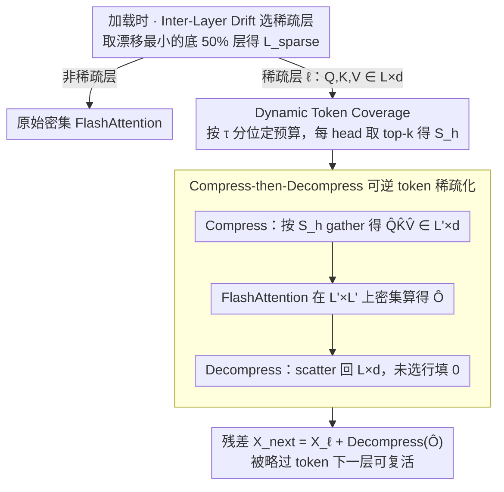

# Token Sparse Attention: Efficient Long-Context Inference with Interleaved Token Selection

**会议**: ICML 2026  
**arXiv**: [2602.03216](https://arxiv.org/abs/2602.03216)  
**代码**: https://github.com/dongwonjo/Token-Sparse-Attention  
**领域**: 模型压缩 / 长文本推理加速  
**关键词**: 稀疏注意力, prefill 加速, 可逆 token 选择, FlashAttention 兼容, 动态稀疏

## 一句话总结
作者发现 token 的"重要性"在层间和头间剧烈变化，传统 token eviction 一次性删除是不可逆的早期决策错误；他们提出 Token Sparse Attention，每层每个 attention head 独立选 $L' \ll L$ 个 token 做密集 attention，输出再 scatter 回原始序列长度，配上残差路径让被略过的 token 在下一层重新有机会被选中——既保留头/层级动态选择，又能直接调用 FlashAttention 等密集 kernel，在 128K 上下文上叠加 FlexPrefill 后达到 ×3.23 注意力加速、精度损失 <1%。

## 研究背景与动机
**领域现状**：LLM 上下文窗口动辄 100K+ 后，attention 的 $O(L^2)$ 复杂度成主要瓶颈。两条加速路线：(i) 稀疏 attention（如 Minference、FlexPrefill），用块级稀疏模式跳过低重要性区域；(ii) token eviction（PyramidInfer、FastKV、GemFilter），在早期层选出 top-k token，深层只算这些。

**现有痛点**：稀疏 attention 是块级的，块内若混入低相关 token 也会被一起算，稀疏度被天花板限制；token eviction 在早期层 hard-decide 哪些 token 重要，被删的 token 在深层即使变重要也回不来——这违反了 token 重要性的真实动态性。

**核心矛盾**：作者用 LLaMA-3.1-8B-Instruct 实测发现：(i) 层间 top-1% token 的重叠率随层间距快速下降，重要性在层间漂移；(ii) 同一层不同 head 的 top token 排名差异很大，head 各自关心不同的语义。eviction 用"一刀切"的 token 集合既忽略层动态又忽略 head 动态。

**本文目标**：(i) 设计一个 token 级稀疏机制，既能用 head/层各自的 token 选择又能在被略过后保持可恢复；(ii) 必须能直接复用 FlashAttention 等优化好的密集 kernel，不写新 CUDA；(iii) 必须能和现有稀疏 attention（块级）正交叠加。

**切入角度**：与其在 attention map 上做稀疏（被块边界限制）或在 KV cache 上做删除（不可逆），不如对 $Q, K, V$ 本身做**可逆的压缩-解压**：选 token 时压成短序列做密集 attention，输出再 scatter 回原长度并加残差。残差路径让"未选 token"的信息从上一层流入下一层，等价于给它们留一条复活通道。

**核心 idea**：用 "compress-then-decompress + 残差" 把 token-level 稀疏化变成可逆操作，让每层每 head 都能重新决策。

## 方法详解

### 整体框架
Token Sparse Attention 想解决的是：既要让 token 选择跟着层/head 各自的注意力动态走，又要保证被略过的 token 不被永久删掉，还要能直接复用现成的密集 attention kernel。它在每个被选中的稀疏层里走"压缩—密集 attention—解压"三拍：先用 Dynamic Token Coverage 给每个 head $h$ 估出一个大小为 $L'$ 的 token 集 $S_h$，从 $Q,K,V \in \mathbb R^{L\times d}$ 按 $S_h$ gather 出 $\hat Q,\hat K,\hat V \in \mathbb R^{L'\times d}$，调 FlashAttention 在 $L'\times L'$ 的压缩空间上算密集 attention 得到 $\hat O$；再把 $\hat O$ scatter 回一个零初始化的 $\mathbb R^{L\times d}$，未选位置保持 0，最后加残差。复杂度由此从 $O(L^2 d)$ 降到 $O(L'^2 d)$。至于"哪些层值得稀疏"，由 Inter-Layer Representation Drift 在加载时一次性预选（默认取漂移最小的底 50% 层），全程 training-free。

### 关键设计

**1. Compress-then-Decompress 可逆 token 稀疏化：把"删 token"换成"临时不参与 attention"**

传统 token eviction 把 $L\to L'$ 当成不可逆的 KV 删除，被删的 token 在深层即使变重要也回不来——这正是前面观察到的"重要性层间漂移"被违背的根源。本方法换一种结构：Stage 1 对每个 head $h$ 独立选 $S_h$，gather 出 $\hat Q_h,\hat K_h,\hat V_h$，让 FlashAttention 在压缩空间 $\mathbb R^{L'\times L'}$ 上直接算出 $\hat O_h$；Stage 2 用 scatter 把 $\hat O_h$ 散回 $\mathbb R^{L\times d}$ 的对应行（未选行填 0，等价于对未选 token 施加 hard mask），再走残差 $X_{\ell+1} = X_\ell + \text{Decompress}(\hat O_h)$。关键就在这条残差：被略过 token 的上一层表示直接流进下一层，下一层若判定它重要可以重新把它选回来，所以结构上一个 token 都没删，层/head 间的动态重要性得以完整保留。附带还有个工程红利——压缩后的 $\hat Q\hat K\hat V$ 是 dense 连续的，能原样喂给任何现成 attention kernel（FlashAttention、FlexPrefill 等），不必写新 CUDA。

**2. Dynamic Token Coverage：按"注意力噪声尾巴"分位自适应定预算**

固定保留比例会在不同上下文长度/任务上失配——信息密度差异很大，一刀切 30% 在长 context 上浪费、在短 context 上又砍过头。这里改成数据自适应：对每个 head 用 recent queries 与所有 keys 做一次 lightweight attention 得到 $\hat A$，按列求和再 pool 得 head 级 token score $s_h[t]$，汇总归一化成层级 score $s_l$。把 $s_l$ 升序排，找最小的 $k_{\text{sparse}}$ 使累计权重 $\sum_{j=1}^{k_{\text{sparse}}} s_l[I[j]] \ge \tau$（默认 $\tau=0.005$），即"最不重要的那一撮 token 的总注意力权重不超过 $\tau$"就整体丢掉，保留 $k_{\text{keep}} = L - k_{\text{sparse}}$ 个；每个 head 再各自用 top-$k_{\text{keep}}$ 取最关心的子集 $S_h$。这样稀疏度会随上下文自然变化——长上下文里 attention noise 的长尾多，稀疏度自动变大（实测 128K 砍 54%、4K 只砍 17%），背后的假设是长 context attention 必然累积一批长尾低权重 token，砍掉它们近似一次结构正则化。打分本身用 Triton fused kernel 写，I/O 开销可忽略。

**3. Inter-Layer Representation Drift 选稀疏层：让"哪层能扛稀疏"由数据说了算**

不是每层都经得起稀疏，对不稳定的层下手会让误差逐层累积。本方法用一个朴素但有效的 prior 来挑层：定义层 $\ell$ 的归一化表示漂移 $R_\ell = \mathbb E_t[\|h_{\ell+1,t} - h_{\ell,t}\|_2 / (\|h_{\ell,t}\|_2 + \epsilon)]$，漂移小意味着 token 表示稳定、该层能承受稀疏化。在校准数据上算出各层 $R_\ell$，排名得到 $\hat R_\ell$，取 $\mathcal L_{\text{sparse}} = \{\ell \mid \hat R_\ell \le \delta\}$（默认 $\delta=0.5$，即漂移最小的 50% 层做稀疏），整件事只在模型加载时跑一次。之所以可信，是实验对 200 个随机 3 层组合做稀疏，发现平均漂移和准确率高度相关——稳定层稀疏不伤 token 表示，不稳定层则误差累积。这一步把"哪层稀疏"从超参变成 data-driven 的预处理，省掉用户调参。

### 损失函数 / 训练策略
完全 training-free 推理时方法，不需要任何微调；只在模型加载时跑一次校准跑得到 $\mathcal L_{\text{sparse}}$。超参 $\tau$：LLaMA-3.1-8B 用 0.005，Mistral-Nemo-12B 用 0.008。token scoring 用 Triton fused kernel，attention 用未修改的 FlashAttention。

## 实验关键数据

### 主实验
RULER benchmark 上叠加各 baseline 后的平均精度与 128K 加速比（LLaMA-3.1-8B-Instruct）：

| 方法 | 4K | 32K | 128K | Avg. | 128K 加速 |
|---|---|---|---|---|---|
| FlashAttention | 95.82 | 84.87 | 74.15 | 87.01 | ×1.00 |
| + Token Sparse | 96.06 | 84.81 | 73.68 | 87.02 | ×1.36 |
| Minference | 93.46 | 85.34 | 73.63 | 86.49 | ×1.12 |
| + Token Sparse | 93.05 | 85.10 | 72.18 | 86.05 | ×1.38 |
| FlexPrefill | 95.48 | 87.20 | 73.75 | 87.27 | ×2.44 |
| + Token Sparse | 95.33 | 87.68 | 73.58 | 87.27 | **×2.76** |

与 token eviction 方法在同加速比下对比（128K，LLaMA-3.1-8B）：

| 方法 | Avg. 精度 | 加速 |
|---|---|---|
| FlashAttention | 87.01 | ×1.00 |
| PyramidInfer | 78.49 | ×1.49 |
| GemFilter | 85.12 | ×1.53 |
| FastKV | 85.64 | ×1.50 |
| **Token Sparse Attention** | **86.84** | ×1.51 |

### 消融实验

| 配置 | 关键发现 | 含义 |
|---|---|---|
| Dynamic $\tau=0.005$ vs Fixed $s=0.3$ | 同加速下 87.02 vs 86.91 | 动态预算优于固定比例 |
| Dynamic $\tau=0.010$ vs Fixed $s=0.5$ | 高稀疏度下 86.84 vs 85.43 | 稀疏越激进，动态优势越明显 |
| 加速分解（128K） | scoring/compress/decompress 总 overhead <11% | 工程实现轻量 |
| 稀疏度随上下文长度 | 4K: 17%, 128K: 54% | 长 context 自然有更多可丢 token |

### 关键发现
- 与 FlashAttention 叠加：精度几乎无变化（87.01 → 87.02），单独贡献 ×1.36 加速。
- 与块级稀疏（FlexPrefill）叠加最有价值：×2.44 → ×2.76，证明 token 级与块级稀疏度互补、不互相覆盖。
- 同加速比下击败所有 token eviction 方法，差距在 4K 短上下文上尤其明显（PyramidInfer 比 FlashAttn 低 17 个点）。

## 亮点与洞察
- **Compress-then-Decompress 是一个非常优雅的"伪稀疏"机制**：表面上算了 $L'\times L'$ 的密集 attention 然后填回 $L\times d$，但残差通道让被略过的 token 信息保留，等价于在每层做了一次轻量的、可逆的、head-specific 的 token 选择。这种"逻辑稀疏 + 物理密集"的设计可以迁移到 MoE、稀疏 expert routing 等场景。
- **不用写新 kernel 是工程上的大杀器**：直接调 FlashAttention/FlexPrefill 现成 kernel，对任何下游使用者零门槛。这与 token eviction 必须改 KV cache 结构相比，部署成本天差地别。
- **Drift 选层是个朴素但强力的 prior**：把"哪些层能扛稀疏"从超参变成 data-driven 决策，可以推广到任何"层级压缩"任务（如 layer dropout、layer pruning）。

## 局限与展望
- 仍依赖 recent queries 估 token score，这是一个 heuristic；如果模型本身用 sliding window 或 chunked attention，recent queries 的统计意义会被破坏。
- 残差路径让"未选 token"信息保留，但每层 scatter 出来的 0 行其实丢失了被选 token 与未选 token 之间的 cross-attention 贡献；论文未量化这部分损失。
- 头/层间稀疏度差异大时，batch 内不同 head 的 $L'$ 不同会破坏 tensor 规整度（虽然 FlashAttention 支持 ragged，但效率受影响）；论文没讨论 batch 多 sample 时的实际 throughput。
- 只在 prefill 上验证，decoding 阶段没用；但 decoding 的瓶颈是 KV cache 加载而非 attention 计算，本方法天然不适合。
- 改进方向：把 drift 选层做成自适应（每个 prompt 不同）、把 scoring 替换为 learnable router（end-to-end 训练）、与 KV cache quantization 联用。

## 相关工作与启发
- **vs Minference / FlexPrefill (块级稀疏)**：他们在 attention map 上按块跳，被块边界限制；本方法在 token 级别选择，可与他们正交叠加，FlexPrefill 上还能再加 ×1.13 加速。
- **vs PyramidInfer / FastKV / GemFilter (token eviction)**：他们在早期层 hard-decide 哪些 token 留下，深层无法恢复；本方法每层都可重选，同加速比下精度高 1-8 个点。
- **vs FlashAttention**：FlashAttention 是 I/O 优化的密集 attention，复杂度仍 $O(L^2)$；本方法在它之上做算法稀疏化，复杂度降到 $O(L'^2)$ 且复用其 kernel。
- **vs KV cache quantization (KIVI/H2O)**：他们减 KV 内存载入开销，本方法减 attention 计算开销，两者完全正交，可联合使用。

## 评分
- 新颖性: ⭐⭐⭐⭐ Compress-then-Decompress 的可逆设计 + head-specific token 选择是简洁但有效的新点，drift 选层也是干净的工程贡献。
- 实验充分度: ⭐⭐⭐⭐ 两个模型 × 4 个 baseline × 多个长度 × 多个 benchmark（RULER/InfiniteBench），加上与 eviction 方法的同加速对比，覆盖度高。
- 写作质量: ⭐⭐⭐⭐ 从"token 重要性动态性"两个观察直接推到方法设计，逻辑顺畅；图 3 把 compress-decompress 流程画得很清楚。
- 价值: ⭐⭐⭐⭐ 可直接落地工业部署，对所有长 context LLM 推理服务都有价值；与现有稀疏方法正交可叠加是关键卖点。

<!-- RELATED:START -->

## 相关论文

- [\[ICML 2025\] OrthoRank: Token Selection via Sink Token Orthogonality for Efficient LLM Inference](../../ICML2025/model_compression/orthorank_token_selection_via_sink_token_orthogonality_for_efficient_llm_inferen.md)
- [\[ICML 2026\] T3S: 训练轨迹感知的 token 选择，破解推理蒸馏的「Imitation Shock」](training-trajectory-aware_token_selection.md)
- [\[NeurIPS 2025\] Recurrent Attention-based Token Selection for Efficient Streaming Video-LLMs](../../NeurIPS2025/model_compression/recurrent_attention-based_token_selection_for_efficient_streaming_video-llms.md)
- [\[ACL 2026\] Adaptive Layer Selection for Layer-Wise Token Pruning in LLM Inference](../../ACL2026/model_compression/adaptive_layer_selection_for_layer-wise_token_pruning_in_llm_inference.md)
- [\[ICML 2026\] Provably Learning Attention with Queries](provably_learning_attention_with_queries.md)

<!-- RELATED:END -->
