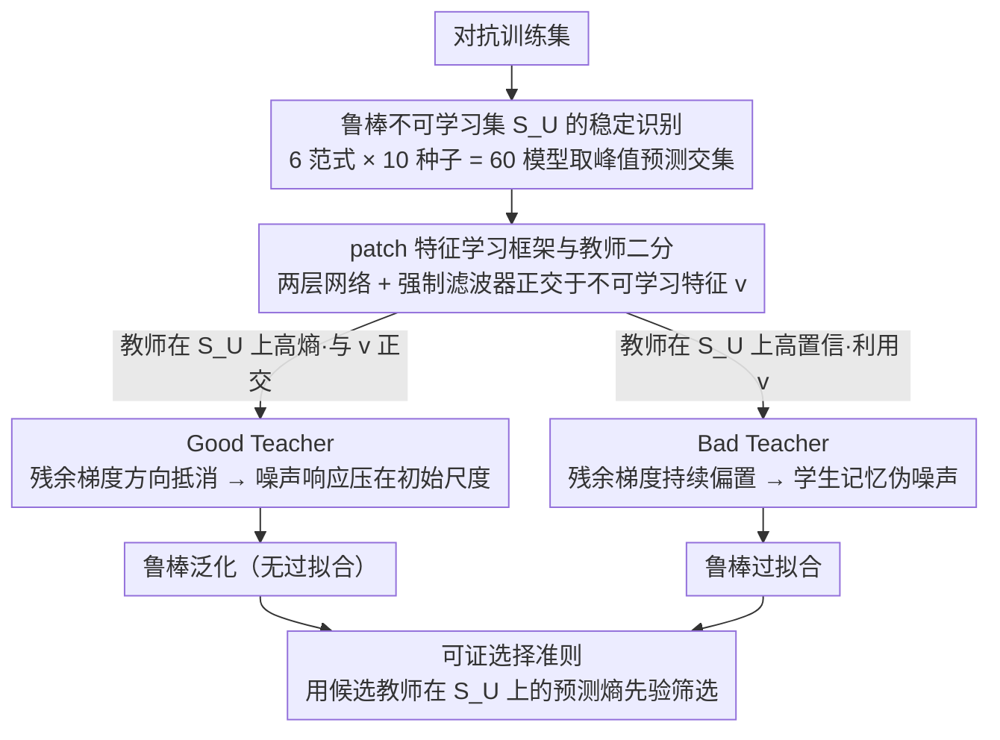

# Toward Understanding Adversarial Distillation: Why Robust Teachers Fail

**会议**: ICML 2026  
**arXiv**: [2605.21999](https://arxiv.org/abs/2605.21999)  
**代码**: 无  
**领域**: 模型压缩 / 对抗鲁棒性 / 知识蒸馏  
**关键词**: 对抗蒸馏, 鲁棒过拟合, 不可学习样本, 特征学习理论, 教师选择

## 一句话总结
本文识别出对抗训练数据中存在一个跨方法稳定的「鲁棒不可学习集」，并通过两层网络的特征学习理论证明：当强鲁棒教师在这些样本上给出高置信监督时，会迫使学生记忆伪噪声进而触发鲁棒过拟合，反之教师在这些样本上保持高熵即可抑制噪声梯度，由此给出基于不可学习样本预测熵的教师选择准则。

## 研究背景与动机
**领域现状**：对抗训练 (AT) 通过 min-max 优化抵御 $\ell_\infty$ 扰动是当前最有效的经验防御，而对抗蒸馏 (AD) 在此基础上让学生匹配鲁棒教师的软标签，被认为可以缓解鲁棒过拟合并把大模型鲁棒性迁到资源受限学生上。

**现有痛点**：AD 的成功高度不稳定——更强的教师并不必然带来更强的学生，甚至会加剧学生的鲁棒过拟合 (robust test accuracy 在某个 epoch 达峰之后持续下滑)。早期工作如 Zi et al. (2021) 报告了「鲁棒饱和」，Lee & Chung (2026) 把这种失败归因于「可迁移对抗样本 (TAS) 稀缺」，但这些都只是失败的症状，并未给出机制层面的解释。

**核心矛盾**：作者观察到一个反直觉的现象——只要不是过拟合教师，AD 即便用一个独立看上去更弱的教师也常常优于一个更强的教师；问题不在于教师是否「鲁棒」，而在于教师与学生在哪些样本上「步调一致」。这意味着背后存在一个被忽略的因子：训练集中某些样本对特定容量的学生天然不可鲁棒学习，教师在这些样本上的行为决定一切。

**本文目标**：(1) 在数据层面识别这个关键子集；(2) 在理论层面解释它如何主导鲁棒过拟合；(3) 在实践层面给出 a priori 选择有效教师的指标。

**切入角度**：作者跨 6 种鲁棒训练方式 × 10 个随机种子取「预测交集」，发现总有一群样本被所有模型在峰值鲁棒精度时都错分，这群「鲁棒不可学习集 (robustly unlearnable set, $\mathcal{S}_U$)」大小随模型容量单调下降，且对它们做特征反演只能得到崩塌的伪特征。这天然提示：不可学习性是「数据-架构」对的属性，而非数据本身的噪声。

**核心 idea**：把鲁棒过拟合归结为「教师在学生表征盲区上的置信度」与「学生容量限制」之间的错配——教师在 $\mathcal{S}_U$ 上越自信，学生越被迫用噪声补全这部分置信度，最终噪声响应反客为主。

## 方法详解

### 整体框架
这篇论文要回答一个反直觉问题：为什么更强的鲁棒教师反而可能让蒸馏学生更糟？它分三段递进给出答案——先在**经验上**从训练集里抠出一个跨方法、跨种子都「学不会」的稳定子集 $\mathcal{S}_U$，再在**理论上**用一个可分析的 patch 特征学习模型为 AT 与 AD 各证一个二分定理，把「学生会不会陷入鲁棒过拟合」精确绑定到「教师在 $\mathcal{S}_U$ 上是否自信」，最后把这条结论**落地**成一个先验可算的教师筛选指标：候选教师在 $\mathcal{S}_U$ 上的预测熵。三个设计沿同一条主线串起来：识别出的 $\mathcal{S}_U$ 既是理论模型里「不可学习特征 $\mathbf{v}$」的现实对应，也是最终筛选指标的评测样本集；而二分定理在 $\mathcal{S}_U$ 上分出的 Good / Bad Teacher 两条轨迹，正是熵指标高低所对应的两种结局。

### 关键设计

**1. 鲁棒不可学习集 $\mathcal{S}_U$ 的稳定识别：把「难样本」从经验启发变成可复现的因果触发器**

要论证「某些样本主导了鲁棒过拟合」，首先得稳定地把这些样本抠出来，而不能让结论沦为「某次训练的坏运气」。作者的做法是跑 6 种鲁棒训练范式 (PGD-AT / TRADES / 4 个教师下的 AD) × 10 个随机种子共 60 个模型，每个模型只取其**峰值鲁棒精度** epoch 的预测，把被全部 60 个模型一致错分的样本定义为不可学习集 $\mathcal{S}_U$、被一致正确分类的定义为可学习集 $\mathcal{S}_L$。之所以卡在「峰值鲁棒精度」时刻取预测交集，是因为以往按 loss 或置信度阈值划分难样本时，难样本会随训练阶段漂移；而峰值时刻等价于在「该容量下能力上限」处取硬约束，于是「不可学习」就从「难」里被剥离出来，成为「容量-数据」对的内在属性而非数据本身的噪声。证据是 $|\mathcal{S}_U|$ 随模型容量单调下降——MobileNet-V2 约 9000 张、WRN-34-10 仅约 1500 张——且对这些样本做特征反演 (feature inversion) 只能得到语义崩塌的伪特征。

**2. patch 特征学习框架与教师二分：把容量瓶颈写成对滤波器的硬正交约束，使「教师看得到、学生看不到」的不对称可推导**

经验现象需要一个能解析的模型来证明因果。作者构造的数据由 $P$ 个 patch 拼接，含两个正交鲁棒特征 $\mathbf{u}=\mathbf{e}_1$ (可学习) 与 $\mathbf{v}=\mathbf{e}_d$ (不可学习)：$\mathcal{S}_L$ 样本的信号 patch 是 $\alpha y\mathbf{u}$，$\mathcal{S}_U$ 样本的信号 patch 是 $\alpha y\mathbf{v}$，其余 patch 为正交高斯噪声 $\mathcal{N}(\mathbf{0},\sigma_n^2(\mathbf{I}_d-\Pi_{\mathcal{F}}))$。学生是两层立方激活网络 $\phi(z)=(\max\{0,z\})^3$，关键巧设是**显式约束**所有滤波器 $\langle \mathbf{w}_r,\mathbf{v}\rangle=0$ —— 这把现实里「学生容量不够、看不见某些鲁棒特征」编码成对 $\mathbf{v}$ 方向的结构性盲视，让「不对称信息」第一次成为可推导对象。对抗扰动只施加在信号 patch 方向 ($\|\delta\|_\infty\le\epsilon$)，AT 优化 $\ell(yf_W(\tilde X))$、AD 优化 teacher 软标签加权的 $\sigma(\pm yf_{W_T}(X))\ell(\pm yf_W(\tilde X))$。

在「unlearnable 稀疏」区间 $CN^{-1}\le p_{un}\le C^{-1}N^{-1}\log d$ 与「信号强于噪声」条件 $\alpha\ge\tilde\Omega(\sigma_n\sqrt{d}/N^{1/3})$ 下，作者证明 AT 与 AD 都会先把可学习特征 $\mathbf{u}$ 学到 $w_{r,1}^{(T)}\ge\tilde\Omega(\alpha^{-1})$；之后噪声响应会不会被推到 $\tilde\Omega(1)$（即触发鲁棒过拟合），完全取决于 $\mathcal{S}_U$ 上的残余梯度是否被持续激励。这条路线沿用 feature learning 框架 (Allen-Zhu & Li 2022; Li & Li 2025)，但首次把它从 AT 延伸到带 soft-label 的对抗蒸馏，并由此把「信号学习」和「噪声记忆」两条轨迹精确分离。

**3. Good vs Bad Teacher 与可证选择准则：同样鲁棒的两个教师，结局只由 $\mathcal{S}_U$ 上的置信度决定**

有了上面的二分轨迹，就能形式化「为什么更强的教师反而有害」。在 $\mathcal{S}_L$ 上，Good 与 Bad 两类教师都满足目标对齐的大间隔 $y_i f_{W_T}(X_i)\ge\Gamma$ —— 即它们**同样鲁棒**；区别只在 $\mathcal{S}_U$ 上：Good Teacher 与 $\mathbf{v}$ 正交、在这些样本上保持不确定 $y_i f_{W_G}(X_i)=0$，Bad Teacher 反而在 $\mathbf{v}$ 方向高置信 $y_i f_{W_B}(X_i)\ge\Gamma$。在 $\Gamma\ge\tilde\Omega(d)$ 的饱和教师区，AD 软标签近似硬标签，学生残余梯度被教师 sigmoid 因子 $\sigma(-yf_{W_T}(X))$ 调制：Good Teacher 让这个因子在 $\mathcal{S}_U$ 上保持 $\Theta(1)$ 但梯度方向均匀抵消，于是噪声响应被压在初始化尺度 $\tilde O(\sigma_0\sigma_n\sqrt d)$；Bad Teacher 让因子指数衰减、残余项偏置却不变，最终把噪声响应推到 $\tilde\Omega(1)$、学生被迫用噪声去补全教师的高置信。这直接给出一条可计算的实践准则（论文称之为「不可学习熵准则 (Unlearnable-Entropy Criterion)」）——**用候选教师在 $\mathcal{S}_U$ 上的预测熵作为先验筛选指标**，熵越高越接近 Good Teacher。为避免每次都跑 60 个模型，实践中用单个峰值 PGD-AT 模型构造一个**代理 $\mathcal{S}_U$**，再在 PGD-10 攻击下测候选教师在该子集上的平均预测熵即可——因为表 1 显示各方法的不可学习集高度重叠，单参考模型的代理足以区分 Good / Bad Teacher。相比靠经验（用早 epoch 教师）或事后指标（TAS，需先训完学生），这条准则只看教师本身在 $\mathcal{S}_U$ 上的输出分布，$O(N)$ 一次前向即可完成，把「a priori 教师选择」从工程经验升级为有理论支撑的可算流程。

### 损失函数 / 训练策略
AT 目标为 $\mathcal{L}_{AT}=\ell(yf_W(\tilde X))$，AD 目标为 $\mathcal{L}_{AD}=\sigma(yf_{W_T}(X))\ell(yf_W(\tilde X))+\sigma(-yf_{W_T}(X))\ell(-yf_W(\tilde X))$。优化用全 batch 梯度下降 $W^{(t+1)}=W^{(t)}-\frac{\eta}{N}\sum\nabla_W\mathcal{L}$，训练 $T\ge\tilde\Omega(N/(\eta\sigma_0\sigma_n^3 d^{3/2}))$ 步以覆盖信号学习与可能的噪声记忆双相。理论统一在事件 $\mathcal{E}$ 上以 $1-\delta$ 高概率成立。

## 实验关键数据

### 主实验：不可学习集与鲁棒过拟合的耦合
基于 60 个模型预测交集统计的 $\mathcal{S}_U$ 与 $\mathcal{S}_L$ 大小，反映**鲁棒不可学习性是容量函数**：

| 模型架构 | PGD-AT 不可学习 | TRADES 不可学习 | 跨方法交集 (Intersection) | 跨方法交集 (可学习) |
|--------|-----------------|------------------|----------------------------|----------------------|
| MobileNet-V2 | 13,898 | 12,261 | 8,979 | 19,385 |
| ResNet-18 | 8,360 | 10,217 | 5,217 | 21,899 |
| WRN-28-10 | 2,816 | 5,084 | 1,697 | 19,610 |
| WRN-34-10 | 2,608 | 4,511 | 1,559 | 16,397 |

不可学习集大小随容量从约 9k 单调降到约 1.5k，但永远非零；CIFAR-100 (Table 7) 同样观察到该单调下降，表明这是结构性现象而非 CIFAR-10 特例。

### 消融实验：教师类型 vs 学生过拟合
论文用同样独立强鲁棒的两个教师对比 AD 的最终表现 (按 Figure 1 与 Table 3 的结构整理)：

| 配置 | 学生峰值 robust acc | 学生末期 robust acc | 是否过拟合 | 解读 |
|------|---------------------|----------------------|------------|------|
| Standard PGD-AT | 中等 | 显著下降 | 是 | $\mathcal{S}_U$ 上残余梯度无人压制 |
| Self-Distill (Best teacher) | 较高 | 接近峰值 | 否 | 早期教师对 $\mathcal{S}_U$ 不自信 → 抑制噪声梯度 |
| Self-Distill (Last teacher) | 中等 | 明显下降 | 是 (更严重) | 过拟合教师在 $\mathcal{S}_U$ 上自信 → 噪声记忆放大 |
| AD with Gowal teacher | 较高 | 维持 | 否 | 教师在 $\mathcal{S}_U$ 上熵高 → 等价 Good Teacher |
| AD with Chen teacher | 中等 | 持续下降 | 是 | 同样强鲁棒但 $\mathcal{S}_U$ 上熵低 → Bad Teacher |

### 关键发现
- **过拟合驱动者是 $\mathcal{S}_U$ 而非 AT 本身**：定理 4.7 表明只要 $p_{un}=0$，AT 的所有噪声响应都被压在 $\tilde O(\sigma_0\sigma_n\sqrt d)$，鲁棒测试误差 $\to 0$；只要 $p_{un}$ 落在稀疏区间，就一定存在某个 $i\in\mathcal{S}_U$ 使噪声响应被推到 $\tilde\Omega(1)$、鲁棒误差锁在 $\ge 1/2-o(1)$。
- **教师强度不是充分条件**：定理 4.8 表明两个同样满足 $\Gamma$ 大间隔的教师 (Good vs Bad) 只在 $\mathcal{S}_U$ 上的行为不同，AD 学生结局却完全相反——把「鲁棒教师」与「好教师」彻底解耦。
- **熵作为先验指标**：实验段验证「教师在 $\mathcal{S}_U$ 上预测熵」与学生最终鲁棒精度的正相关，给出无需先训学生的教师筛选流程。
- **结构盲视假设的合理性**：作者用容量与 $|\mathcal{S}_U|$ 的单调关系 (从 9k 到 1.5k) 解释为何同样的样本对小模型是 unlearnable、对大模型是 learnable，与理论中对 $\mathbf{v}$ 方向的强制正交一一对应。

## 亮点与洞察
- **把「难样本」从经验启发上升到理论对象**：通过「跨方法预测交集」剔除了训练随机性，把不可学习性定义成数据-架构对的稳定属性，这一思路可迁移到 robust fairness、long-tail learning 等任何「容量瓶颈触发偏差」的场景。
- **教师正交性假设是巧设**：把「学生看不到的鲁棒特征」编码为对滤波器的硬正交约束，使得 AD 中教师与学生之间的不对称信息得以解析处理；这是首次把 feature learning 框架扩到带 soft-label 的对抗蒸馏。
- **熵作为筛选指标可即插即用**：相比 TAS 这类需要训完学生才能评估的事后指标，「在 $\mathcal{S}_U$ 上算一次教师 softmax 熵」就能预判 AD 结局，对工程团队极友好。

## 局限与展望
- 理论建立在两层立方激活网络 + patch 数据 + 仅在信号 patch 方向扰动的简化设定上，从 ResNet/WRN 的非线性卷积特征到 patch 模型的迁移仍是经验性的。
- $\mathcal{S}_U$ 的识别需要先训 60 个模型，虽然只需一次性完成，但对于新数据集仍有非平凡的前置成本；自然延伸是用 capacity-aware 的代理指标 (如对抗损失曲率) 在线估计 $\mathcal{S}_U$。
- 教师正交假设把 Good 和 Bad 处理成「全黑全白」，但现实教师在 $\mathcal{S}_U$ 上的置信度通常是连续谱；未来可把熵指标推广为「梯度可消化性」之类的连续度量并给出 trade-off 曲线。

## 相关工作与启发
- **vs Lee & Chung (2026, TAS)**：他们用「可迁移对抗样本稀缺」作为 AD 失败的经验信号，本文给出机制级解释——TAS 稀缺等价于教师在 $\mathcal{S}_U$ 上过于自信，本文准则更可计算且 a priori。
- **vs Li & Li (2025, AT feature learning)**：同样用 feature learning 框架，但他们只分析 AT；本文把 soft-label 教师纳入分析并给出关于「教师不对称信息」的新分支结论。
- **vs Goldblum et al. (2020, ARD) / Zi et al. (2021)**：ARD 等只关注「能否传递鲁棒性」，未触及「为何更强教师反而更糟」这一悖论；本文用 $\mathcal{S}_U$ 上的 entropy 把悖论彻底解开。

## 评分
- 新颖性: ⭐⭐⭐⭐⭐ 首次把 robust overfitting 解释为「教师-学生在不可学习集上的信息错配」并配可证明的二分定理。
- 实验充分度: ⭐⭐⭐⭐ 跨 4 种架构 × 6 种方法 × 10 种子覆盖充分，但主要在 CIFAR-10/100 上验证，缺 ImageNet。
- 写作质量: ⭐⭐⭐⭐⭐ 经验现象 → 理论模型 → 实践指标的三段论非常顺。
- 价值: ⭐⭐⭐⭐⭐ 给 AD 工程团队提供了一个 O(N) 即可执行的教师筛选准则，几乎零成本落地。

## 评分
- 新颖性: 待评
- 实验充分度: 待评
- 写作质量: 待评
- 价值: 待评

<!-- RELATED:START -->

## 相关论文

- [\[ICML 2026\] Critique-Guided Distillation for Robust Reasoning via Refinement](critique-guided_distillation_for_robust_reasoning_via_refinement.md)
- [\[CVPR 2026\] Continual Distillation of Teachers from Different Domains](../../CVPR2026/model_compression/continual_distillation_of_teachers_from_different_domains.md)
- [\[CVPR 2026\] Adversarial Concept Distillation for One-Step Diffusion Personalization](../../CVPR2026/model_compression/adversarial_concept_distillation_for_one-step_diffusion_personalization.md)
- [\[ICML 2026\] The Bridge-Garden Dilemma in LLM Distillation: Why Mixing Hard and Soft Labels Works](the_bridge-garden_dilemma_in_llm_distillation_why_mixing_hard_and_soft_labels_wo.md)
- [\[ICML 2026\] Detecting Fluent Optimization-Based Adversarial Prompts via Sequential Entropy Changes](detecting_fluent_optimization-based_adversarial_prompts_via_sequential_entropy_c.md)

<!-- RELATED:END -->
