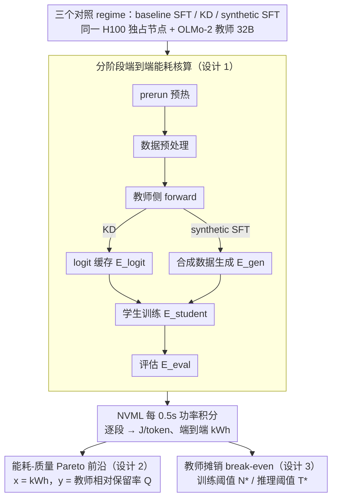

# Towards Resource-Efficient LLMs: End-to-End Energy Accounting of Distillation Pipelines

**会议**: ICML 2026  
**arXiv**: [2605.13981](https://arxiv.org/abs/2605.13981)  
**代码**: https://github.com/StellarLuminosity/Energy (有)  
**领域**: LLM 效率 / 绿色 AI / 知识蒸馏  
**关键词**: 蒸馏能耗、端到端核算、教师侧成本、Pareto 前沿、教师复用

## 一句话总结
作者搭了一套基于 NVML 的分阶段 GPU 能耗采集框架，把蒸馏流水线拆成"教师侧 + 学生侧 + 评估"逐段计量，发现一次性运行时教师 logit 缓存 / 合成数据生成才是大头，让 KD 和 synthetic SFT 在 1B–13B OLMo-2 学生上反而比直接 SFT 多耗约 $2.4\times$ 能量，并给出闭式 break-even 公式说明只有当教师产物被复用 $N^*$ 次以上时蒸馏才真"省电"。

## 研究背景与动机

**领域现状**：LLM 部署量暴增推高了 GPU 和电力需求，"Green AI"潮流呼吁把能耗与精度并列评估。在这种背景下，知识蒸馏被普遍当作"更便宜、更环保"的小模型生产线，论文里通常报学生侧的 FLOPs / 训练时长 / 推理能耗作为绿色化证据。

**现有痛点**：现有报告几乎都只算学生侧，把教师生成 logits、合成数据、超参扫描等成本当成"既已沉没"。一旦把 32B 教师为 1B 学生生成几十亿 token 的成本算进去，所谓"蒸馏更省电"的说法就站不住脚——但社区缺一套统一、可重复、按阶段拆分的能耗协议来揭穿或者佐证这件事。

**核心矛盾**：教师侧是近乎固定的大额开销，只有摊到多个学生 / 多次超参扫上才能稀释，但学生侧是按规模线性放大的可变开销；两者的相对大小决定整条 pipeline 在能耗-质量平面上到底落在哪个区域，而这点在过往工作里几乎没被量化过。

**本文目标**：（a）什么时候 KD / synthetic SFT 比强 SFT baseline 在固定预算下能取得更好的能耗-质量折中；（b）教师侧成本相对学生训练有多大、何时占主导；（c）在学生规模、序列长度、教师复用、质量目标这些维度上，蒸馏什么时候才"真省电"。

**切入角度**：把蒸馏 pipeline 形式化成"prerun / 数据预处理 / 教师 forward / 学生训练 / 评估"五个不重叠 stage，每段用 NVML 0.5 s 采样的 GPU 功率时间序列做数值积分，CPU 端用 CodeCarbon 估算，统一归一到 Joule / token，绘制 Pareto 前沿。

**核心 idea**：蒸馏不是天然"绿"的，是不是省电完全是个**工作流**问题；只要把 pipeline 拆段计量，就能写出闭式的 break-even 复用次数公式，并据此给"何时该蒸馏"开出可执行的设计准则。

## 方法详解

### 整体框架
这篇工作不提新算法，它要回答的是"蒸馏到底省不省电"，做法是把同一条蒸馏流水线拆成不重叠的几段、逐段量电，再用闭式公式算出何时才划算。具体地，三个对照 regime（baseline SFT、logit-based KD、synthetic SFT）都跑在同一台 H100 80 GB 独占节点上，固定 OLMo-2 tokenizer、Adafactor、bf16、序列长 1024、有效 batch 4、cosine LR + 100 step warmup、容差 $\epsilon = 2\times 10^{-3}$ 早停；教师统一是 32B OLMo-2-SFT，学生覆盖 1B / 7B / 13B，监督数据是 TULU-3 指令、OpenR1-Math、Open-R1 Codeforces 三套。每段 stage 都打时间戳和 token 计数，对功率序列做 $E_{\text{GPU}} \approx \int_{t_s}^{t_e} P_{\text{GPU}}(t)\,dt$ 积分得 stage 能耗，所有 stage 相加得到端到端 kWh，再用 $E_{\text{total}} \cdot \text{PUE} \cdot g_{\text{region}}$ 推 CO₂e，最终落成三张图：能耗-质量 Pareto、stage 分摊、复用摊销曲线。

### 关键设计

**1. 分阶段端到端能耗核算协议：把"教师沉没成本"显式量进总账**

过往 Green AI 报告几乎只算学生侧，把教师生成 logits / 合成数据当成既已沉没——这正是"蒸馏更绿"叙事站不住的地方。为此作者把总能耗硬拆成 $E_{\text{prerun}} + E_{\text{teacher}} + E_{\text{student}} + E_{\text{eval}}$，其中教师段再细分成 logit 缓存 $E_{\text{logit}}$ 或合成生成 $E_{\text{gen}}$，每段都带显式 start/end 边界与 token 计数。测量上以 NVML 每 0.5 s 采样 GPU 功率作 ground truth，CodeCarbon 在 process-tracking 模式估 CPU，单位统一到 $1\,\text{kWh}=3.6\times 10^{6}\,\text{J}$；为让不同规模 / pipeline 可比，把 stage 能耗除以处理 token 数得 $\text{J/token}=E^{(\text{stage})}_{\text{total}}/N_{\text{tokens}}$，CO₂e 因依赖部署假设被显式标成派生量、主分析只看实测能耗。比起 GPU-hours / FLOPs 这类跨 pipeline 不可比的代理指标，按 stage 拆账能立刻定位瓶颈在教师还是学生，从而知道该拧哪个旋钮。

**2. 能耗-质量 Pareto 前沿与统一质量分数：把"哪些配置纯属浪费电"画出来**

光看 benchmark 表格看不出哪些 (pipeline, 规模) 组合在能耗-质量平面上根本被支配。作者先把五个 benchmark 压成一个跨学生可比的 scalar——相对 32B 教师的等权保留率 $Q_i = \frac{1}{B}\sum_{b=1}^{B}\frac{s_{i,b}}{s_{\text{teacher},b}}$（$B=5$，含 AlpacaEval 2、IFEval、MT-Bench-101、GSM8K、MMLU），再以 stage 求和的全管线 kWh 为 $x$ 轴、$Q$ 为 $y$ 轴画 Pareto 散点，每个配置跑 2–3 次取均值。由于 CO₂e 在固定电网因子下线性正比于 kWh，同一张图能等价读成 emissions-quality 前沿，被支配的"显然次优解"一眼可辨，直接告诉实践者哪些配置在白烧电。

**3. 教师摊销与闭式 break-even 阈值：把"省不省电"写成一个分式**

蒸馏是否省电不是 KD 或 synthetic SFT 的内禀属性，而是被教师产物复用次数决定的工作流问题：教师段是近乎固定的大额开销，只有摊到多个学生 / 超参种子上才稀释得动。把每学生平均能耗写成 $E_{\text{teacher}}/N + E_{\text{student}}^{\text{distill}}$，与 baseline 持平的临界复用次数就是 $N^* = \dfrac{E_{\text{teacher}}}{E_{\text{student}}^{\text{baseline}}-E_{\text{student}}^{\text{distill}}}$；分母正是 baseline 与蒸馏学生的训练能耗差，意味着只有蒸馏学生确实训得更省、且复用够多次时才回本。推理侧同理给出 $T^* = \dfrac{E_{\text{extra-train,kWh}}\cdot 3{,}600{,}000}{j_{\text{ref}}-j_{\text{student}}}$，告诉用户要服务多少推理 token 才能把多花的训练能耗赚回来。两条公式只依赖几个实测量，换新硬件 / 新模型族直接重算即可，落地成 reuse-before-regenerate 的设计准则。

### 损失函数 / 训练策略
KD 的目标函数是经典 Hinton 式混合：$\mathcal{L}_{\text{KD}}(\theta_s) = \alpha\,\mathrm{CE}(y_{\mathrm{hard}}, p_s) + (1-\alpha)\,T^2\,\mathrm{KL}(p_t^{(T)} \,\|\, p_s^{(T)})$，默认 $\alpha=0.5$, $T=1$；敏感性扫 $T \in \{1, 2, 4\}$, $\alpha \in \{0.3, 0.5, 0.8\}$。Synthetic SFT 用纯自回归 $\mathcal{L}_{\text{SFT}}(\theta_s; x, y) = -\sum_{t=1}^s \log p_{\theta_s}(y_t \mid x, y_{<t})$，教师用 nucleus sampling 生成一次后跨学生复用，扫 max_new_tokens $\in \{256, 512, 1024\}$ 以及 prompt 数 7000 vs 3500。所有 regime 共享同一 batch / scheduler / 早停规则，确保能耗差完全归因于 pipeline 结构和教师存在与否。

## 实验关键数据

### 主实验
教师 32B → 学生 1B/7B/13B，端到端能耗、Joule/token、相对教师质量保留 $Q$ 都跨三个数据集取均值，重复 2–3 次。

| Pipeline | 规模 | $E$ (kWh) | J/token | $Q$ | 备注 |
|---|---|---|---|---|---|
| Baseline SFT | 1B | 7.00 | 0.84 | 0.69 | 能耗最低 |
| Baseline SFT | 7B | 19.50 | 2.34 | 0.90 | 7B/13B 上整体 Pareto 占优 |
| Baseline SFT | 13B | 34.60 | 4.15 | 0.99 | 质量最高 |
| KD | 1B | 16.90 | 2.03 | 0.70 | 比 1B SFT 多 $\sim 2.4\times$ 能耗 |
| KD | 13B | 42.50 | 5.10 | 0.82 | 反被 baseline 13B 支配 |
| Synthetic SFT | 13B | 40.70 | 4.88 | 0.85 | 教师生成段占大头 |

### 消融实验
按 stage 拆分（kWh）后的关键摊销分布：

| Pipeline | 学生规模 | 数据预处理 | 教师侧 | 学生训练 | 评估 |
|---|---|---|---|---|---|
| Baseline SFT | 1B / 13B | 0.37 / 0.37 | – | 6.30 / 33.15 | 0.33 / 1.08 |
| KD | 1B / 13B | 0.37 / 0.37 | 11.00（logit 缓存）| 5.20 / 30.05 | 0.33 / 1.08 |
| Synthetic SFT | 1B / 13B | 0.37 / 0.37 | 10.60（合成生成）| 5.35 / 28.65 | 0.33 / 1.08 |

复用阈值：KD 在 1B/7B/13B 上的 $N^*$ 约为 10 / 5–6 / 4；synthetic SFT 约为 11 / 6 / 2–3。

### 关键发现
- 教师侧成本就是把蒸馏曲线整体往右推的"那只手"——一次性运行时它直接让 KD/synthetic SFT 在 7B/13B 上被 baseline SFT 严格 Pareto 支配。
- 学生越小，越难摊掉教师；学生越大反而越快回本，因此"reuse-before-regenerate"对小规模学生最关键。
- 蒸馏侧学生训练 kWh 始终低于同尺寸 baseline，这是收敛速度差异（多了软标签监督 → 早停更早）造成的，而不是"蒸馏 GPU 跑得更省电"。
- 在 KD 超参里 $T$ 是二阶旋钮，$\alpha$ 主导能耗-质量折中；某些 $(T,\alpha)$ 组合是 Pareto-dominated，多花电但收益为负。
- Synthetic SFT 里 max_new_tokens 是能耗非线性增长的最大推手，超出中等长度后边际收益递减，应优先减 prompt 数和长度再扩生成。

## 亮点与洞察
- 把"蒸馏到底省不省电"这种营销话术变成可执行的工程数学：一行 break-even 公式 $N^* = E_{\text{teacher}}/(E^{\text{baseline}}_{\text{student}} - E^{\text{distill}}_{\text{student}})$ 就能告诉团队"我们要至少蒸馏给 6 个学生才回本"。
- 真正绿色的不是"换小模型"而是"把教师产物当共享基础设施版本化、注册化"——这点对企业研发流程是直接可落地的工作流建议。
- 用 NVML 时序积分 + CodeCarbon CPU 估算的组合，给后续研究提供了一套开源 harness，可以复用到量化、剪枝、LoRA 等其他 post-training 上做"能耗审计"。

## 局限与展望
- 全部实验只跑 H100 单卡 + OLMo-2 单一模型族；多卡 / TPU / A100 上 J/token 大概率会显著漂移，break-even 阈值需要重算。
- 教师固定 32B，没有扫教师规模——更小教师可能让 break-even 显著降低，让 KD 在更早 reuse 就回本。
- 任务面只覆盖指令 / 数学 / 代码三类监督任务，没碰安全对齐、多语言、长上下文等更现实的部署目标；CO₂e 在不同 PUE/电网假设下绝对值会差很多。
- 把推理摊销并入决策的 $T^*$ 公式还停留在"同规模"层面；当蒸馏小模型真的能等质替换大模型时，公式才能给推理省电做实用判断。

## 相关工作与启发
- **vs Schwartz et al. 的 Green AI**：他们呼吁能耗成为评估维度，本文把这个理念落到了蒸馏这一具体 post-training 子领域，给出可复现的协议而非倡议性文件。
- **vs Rafat et al. 2023 / Yuan et al. 2024**：前者关注 CNN KD 的碳成本，后者比较已蒸 NLP 模型的推理能耗——都把教师视作沉没成本；本文显式把教师 forward 当 first-class 成本计量，给出与现有结论相反的"小学生场景下蒸馏更耗电"判断。
- **vs CodeCarbon / Experiment Impact Tracker**：通用估算器，本文在它之上叠加了 NVML 直采 + 显式 stage 边界，吸收估算误差并允许 pipeline 级 Pareto 绘制。

## 评分
- 新颖性: ⭐⭐⭐⭐ 不是新算法，但首次把蒸馏的"教师侧沉没成本"做成可量化且可复现的 break-even 框架，视角新。
- 实验充分度: ⭐⭐⭐⭐ 覆盖 3 个 pipeline × 3 个学生规模 × 3 个数据集 + KD/synthetic SFT 超参敏感性扫，2000 GPU-hours 投入扎实。
- 写作质量: ⭐⭐⭐⭐ 结构清晰，公式、表格、Pareto 图配套到位，practical recommendations 一节直接可落地。
- 价值: ⭐⭐⭐⭐⭐ 戳破了"蒸馏更绿"的常见叙事，并提供开源 harness 让业界能持续审计自己的训练能耗，是政策与工程双向有用的工作。

<!-- RELATED:START -->

## 相关论文

- [\[ICML 2026\] End-to-End Compression for Tabular Foundation Models](end-to-end_compression_for_tabular_foundation_models.md)
- [\[CVPR 2026\] A Paradigm Shift: Fully End-to-End Training for Temporal Sentence Grounding in Videos](../../CVPR2026/model_compression/a_paradigm_shift_fully_end-to-end_training_for_temporal_sentence_grounding_in_vi.md)
- [\[ICML 2026\] Multi-Adapter Representation Interventions via Energy Calibration](multi-adapter_representation_interventions_via_energy_calibration.md)
- [\[ICML 2026\] Memory-Efficient Partitioned DNN Inference on Resource-Constrained Android Crowds](memory-efficient_partitioned_dnn_inference_on_resource-constrained_android_crowd.md)
- [\[ICML 2026\] Energy-Structured Low-Rank Adaptation for Continual Learning](energy-structured_low-rank_adaptation_for_continual_learning.md)

<!-- RELATED:END -->
