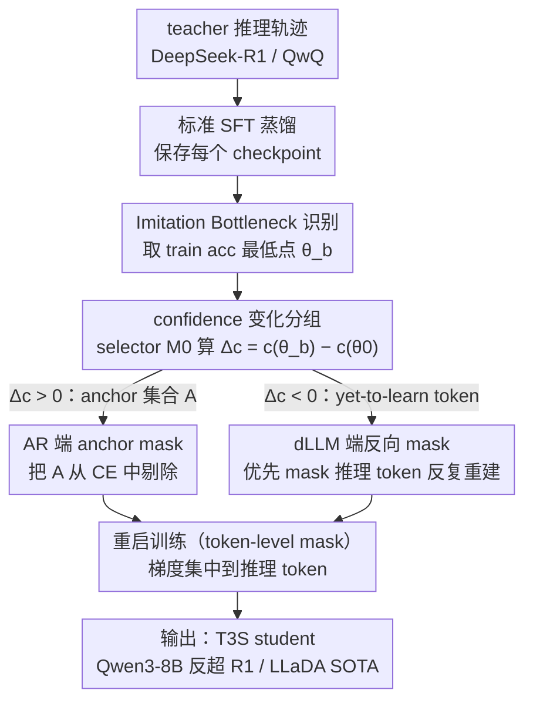

# T3S: 训练轨迹感知的 token 选择，破解推理蒸馏的「Imitation Shock」

**会议**: ICML 2026  
**arXiv**: [2601.10348](https://arxiv.org/abs/2601.10348)  
**代码**: 未列
**领域**: LLM 蒸馏 / 推理压缩 / 训练动力学  
**关键词**: 推理蒸馏, Imitation Shock, anchor token, 训练轨迹, AR + dLLM

## 一句话总结
论文发现强 student（如 Qwen3-8B）继续从 DeepSeek-R1 蒸馏时存在通用的「Imitation Shock」——loss 单调下降但 acc 先暴跌再恢复，根因是早期「Imitation-Anchor Tokens」梯度统治优化压制了真正负责推理的 token；T3S 用训练轨迹找出 anchor token 并把它们 mask 掉，让 yet-to-learn 推理 token 提前学习，在 AR 和 dLLM 两个 setting 都涨分（Qwen3-8B 反超 DeepSeek-R1，Qwen3-32B 逼近 Qwen3-235B，LLaDA-2.0-Mini 反超 AR baseline 拿到 16B no-think SOTA）。

## 研究背景与动机

**领域现状**：当 student LLM 已经有较强推理能力时（如 Qwen3-8B），社区想继续用强 teacher（DeepSeek-R1、QwQ）蒸馏来再上一台阶。已有 efficient distillation 工作（s1、LIMR、BOBA）证明几百条高质量轨迹比海量数据还有效，但都聚焦在「数据怎么挑」，没分析「训练动力学是否健康」。

**现有痛点**：把 Qwen3-8B 直接从 DeepSeek-R1 蒸馏，loss 看着一路下降，但 AIME24/AIME25/MMLU-Pro 等所有指标都先暴跌到某一步、再缓慢爬回——作者管这叫 Imitation Shock，把最低点的 checkpoint 叫 Imitation Bottleneck。更诡异的是把这个 bottleneck 之前的所有参数更新丢掉、只保留之后的 update（叫 Recovering Residual Transfer），反而比标准 SFT 更好！这意味着「pre-bottleneck 阶段学到的东西不是必要的、甚至有害」。

**核心矛盾**：teacher 输出里有「容易模仿但不带推理增益的 token」（如格式 token、连接词、常用表达）和「真正承载推理的 token」（如关键算式、中间推导）。在 SFT 的 next-token CE 下，前者梯度大、收敛快，先把模型「锚」到 teacher 风格上，但同时压制了后者的学习。结果是 student 看起来在「模仿 teacher」但实际推理能力先下降——典型的「拣芝麻丢西瓜」。

**本文目标**：用训练轨迹信号系统地定位这些「锚 token」并把它们从 loss 中剔除，让推理 token 提前学，避免 Imitation Bottleneck 浪费的算力。

**切入角度**：直接做 token-level 干预的关键是「怎么找到 anchor token」。作者发现 anchor token 有一个统一信号——从 base 到 bottleneck checkpoint 之间 confidence 单调上升（$\Delta c_t > 0$），而推理 token 则是单调下降。于是「找 bottleneck → 用 confidence 差排序 → mask 上升组」就是 T3S 的全部。

**核心 idea**：用训练轨迹上的 confidence 变化 $\Delta c_t = c_t(\theta_b) - c_t(\theta_0)$ 区分两类 token；对 AR 直接把 anchor 集合 $\mathcal{A}$ 从 loss 中 mask 掉，对 dLLM 把 anchor 优先放进 visible context、让 mask 反复盯着 yet-to-learn token 练，从训练动力学层面绕开 Imitation Shock。

## 方法详解

### 整体框架

T3S 想解决的是「强 student 继续从强 teacher 蒸馏时 acc 先崩后恢复」这件怪事，做法是先把崩点找出来、再把崩点之前主导优化的那批 token 从 loss 里剔掉。整体三步走：先跑一次标准 SFT、保存每个 checkpoint，按 train accuracy 的最低点定位 Imitation Bottleneck $\theta_b$；再用 selector 模型 $M_0$ 在 base $\theta_0$ 和 $\theta_b$ 上分别算每个 token 的 log-prob、取差值 $\Delta c_t$ 给 token 分组；最后重启训练、根据 $\Delta c_t$ 构造 token-level mask——AR 把 $\Delta c_t > 0$ 的 anchor token 从 CE 里 mask 掉，dLLM 反过来让 trajectory 标出的推理 token 更频繁被 mask、逼模型在 anchor 全给定的条件下反复重建它们。这套监控可以在线跑：训练时盯着 train acc，一旦探到 bottleneck 就切到 mask 模式，不必预先跑完整轮蒸馏。

### 关键设计

**1. Imitation Bottleneck 识别 + Recovering Residual Transfer：先找到该开始 mask 的时刻，再证明之前的更新是多余的**

T3S 的第一颗螺丝是把「什么时候模型其实在变差」从黑盒里挖出来。作者定义 bottleneck 为训练轨迹上 train accuracy 最低的那个 checkpoint $\theta_b = \arg\min_\theta \mathrm{Acc}_{\mathrm{train}}(\theta)$，这一点之后才是真正学推理的阶段。为了证明 bottleneck 之前的参数更新不仅冗余、甚至有害，他们做了 Recovering Residual Transfer（RRT）实验：直接丢掉 pre-bottleneck 的所有更新，构造 $\theta_{\mathrm{RRT}} = \theta_0 + (\theta_f - \theta_b)$。结果很反直觉——标准 SFT 让 DeepSeek-R1 蒸馏的 Qwen3-8B 在 BOBA-200 上从 71.46 跌到 63.13（$\downarrow 8.33$），而扔掉前半段更新的 RRT 反而涨到 72.61（$\uparrow 1.15$），换 QwQ teacher 也是同一模式。这直接证伪了「训练 loss 下降 = 模型变好」的朴素认知：loss 的下降可能完全来自 anchor token 的 over-fit，跟 downstream 任务无关。RRT 不是要替代 SFT，而是给「pre-bottleneck 阶段不必要」一个无可辩驳的实验锚点，为后面更精细的 token-level 干预奠定合法性。

**2. confidence 变化分组 + AR 端 anchor mask：把主导优化的 token 揪出来，直接从 loss 里切掉**

知道了该 mask、却还不知道 mask 谁。作者发现 anchor token 有一个统一信号——蒸馏前期 confidence 单调上升。于是用 selector $M_0$ 计算每个 token 的 log-prob $c_t(\theta; x, y) = \log p_\theta(y_t | y_{<t}, x)$，在轨迹两端取差 $\Delta c_t = c_t(\theta_b) - c_t(\theta_0)$，把 $\Delta c_t > 0$ 的 token 归为 Imitation-Anchor Tokens：

$$\mathcal{A}(x,y) = \{t : \Delta c_t > 0\}$$

这些就是蒸馏前期就被模型轻松「学会」的 token。AR 端的 T3S loss 直接把它们从 CE 中剔除，让梯度只落在剩下的推理 token 上：

$$\mathcal{L}_{\mathrm{AR\text{-}T3S}} = \mathbb{E}\Big[\sum_{t \setminus \mathcal{A}} -\log p_\theta(y_t | y_{<t}, x)\Big]$$

为什么这样有效，词云分析（Figure 3）给了直观佐证：anchor token 多是连接词、标点、思路引导语，而 yet-to-learn token 多是关键算式、中间推导步骤——划分跟人类直觉高度一致。与其调超参或换数据，不如在 loss 层面 surgical 切掉这批「容易模仿但不带推理增益」的害群之马。论文还做了「反 T3S」诊断（只在 anchor 上训、把推理 token mask 掉），性能从 71.46 暴跌到 26.67，反向印证 T3S 的 token 选择极具区分度，不是「随便 mask 一半」能复现的。

**3. 梯度交互证据：anchor 和 yet-to-learn 本就互不相容，mask 才是必要的**

T3S 还把「为什么必须 mask」追到了梯度层面，让粗暴干预有理论支撑。Figure 5 的干预实验显示，在 anchor 还没学好（large $\mathcal{L}_{\mathrm{anchor}}$）的 checkpoint 上做一步只优化 anchor 的更新，其他 token 的 loss 会暴增（large positive $\Delta \mathcal{L}_{\mathrm{other}}$）——anchor 的学习确实在压制其他 token。Figure 6 进一步量化这种统治：anchor token 的梯度范数早期能达到 other token 的 $17 \times$，到 bottleneck 才降到 $2 \times$，同时两组梯度的 cosine similarity 在 crash 阶段跌到 $-0.4 \sim -0.5$，是方向上的强冲突。Table 6 的 4×4 token-group transfer 矩阵则把这种不相容彻底量化：训 anchor 子集会让 reasoning 子集的 loss 大幅上升，反之亦然。三组证据互相印证，把「anchor 压制 yet-to-learn」从假设升级成机制级结论。

**4. dLLM 端的反向操作：把随机 mask 换成 trajectory-aware mask**

同样的「轨迹感知 token 选择」框架推广到扩散 LLM（LLaDA-2.0-Mini）时要反着用。dLLM 的训练目标本来就是 random masked reconstruction，所以 T3S 不再剔除 anchor，而是让 trajectory-identified 的 yet-to-learn 推理 token **更频繁**被 mask，使模型在「anchor token 全部给定」的条件下反复重建推理 token。等价于把 dLLM 的随机 mask 替换成 trajectory-aware mask，既贴合扩散范式、又把训练算力集中到真正难学的 token 上。

## 实验关键数据

### 主实验：AR setting，Qwen3-8B 蒸馏

| 方法 | BOBA-200 AIME24 | BOBA-200 AIME25 | BOBA-200 AVG | S1K-200 AVG |
|------|------|------|------|------|
| BASE | 75.83 | 67.08 | 71.46 | 71.46 |
| SFT (R1) | 71.25 | 55.00 | 63.13 ↓8.33 | 64.17 |
| RRT (R1) | 76.67 | 68.54 | 72.61 ↑1.15 | 73.65 |
| -T3S (R1)（mask 反向） | 30.63 | 25.63 | 28.13 暴跌 | 26.67 |
| **T3S (R1)** | **80.63** | **73.96** | **77.30** | **80.00**+ |
| SFT (QWQ) | 73.33 | 63.33 | 63.30 ↓ | — |
| **T3S (QWQ)** | — | — | 显著 ↑ | — |

T3S 比标准 SFT 平均涨 +14 个点（BOBA-200），比 RRT（参数级 fix）还高 +5 个点，说明 token-level mask 比 parameter-level surgery 更精细。-T3S（mask 反向）暴跌到 28.13 是关键诊断——证明 T3S 选的 token 集合极具区分度，不是「随便 mask 一半就行」。

### 主实验：dLLM setting + 跨规模验证

- LLaDA-2.0-Mini（16B no-think dLLM）+ T3S，反超同架构 AR baseline，拿到 16B-scale no-think 模型的 SOTA。
- Qwen3-32B + T3S，逼近 Qwen3-235B 在 AIME 上的水平——证明 T3S 跨 student 规模有效。

### Imitation Shock 跨设置普遍性

| 变体 | 是否出现 crash-then-recover |
|------|--------------------------|
| 不同 teacher（QwQ） | ✓ |
| 不同 dataset（S1K-200） | ✓ |
| 大规模数据（R1-Distilled-OpenThought3-65K） | ✓ |
| 不同 student（R1-Distilled Llama3） | ✓ |
| 不同领域（Code） | ✓ |

Imitation Shock 不是某个 dataset/teacher 的偶然——是 continual distillation 的通用现象，T3S 因此是通用解。

### 关键发现

- **loss 下降 ≠ 模型变好**：BOBA-200 上 SFT loss 单调降但 AIME24 从 75.83 跌到 71.25，这是对「监控 loss 判收敛」的直接反例。
- **anchor token 是格式/连接词，yet-to-learn 是推理 token**：词云分析（Figure 3）一图证明 anchor 跟语义连接词高度重合，符合直觉。
- **过长训练救不了**：BOBA-200 上训 15 epoch，仍有 68.51% 的 token confidence 比 base 还差（Table 2）——anchor 压制效应不会随时间自动消失。
- **梯度比 17× + cosine -0.4**：anchor 梯度早期统治量级 + 方向冲突，从优化层面解释为什么 mask 是必要的，而不是「随便加正则」就行。
- **从 R1 蒸馏比从 QwQ 蒸馏 T3S 收益更大**：强 teacher 提供更丰富信号但也更强 bias，T3S 把 bias 滤掉后能更充分利用 teacher。

## 亮点与洞察

- **从训练动力学层面诊断蒸馏失败**：以往工作改数据/loss/算法，本文第一次把「continual distillation 为什么失败」回答到 token-级梯度交互，论证链条完整（4 个 Takeaway + 6 个图 + 4×4 矩阵）。
- **简单干预 + 巨大涨幅**：T3S 不改 loss 形式、不改架构、不需要额外数据，只在 CE 上加一个 token-level mask 就涨 14 个点。
- **AR 和 dLLM 两端通吃**：用统一的「trajectory-aware token 选择」框架推广到扩散 LLM，且 LLaDA-2.0-Mini 反超 AR baseline，是 dLLM 在推理任务上少见的成功案例。
- **RRT 实验的颠覆性**：「丢掉 pre-bottleneck 更新反而更好」直接挑战了「训练越多越好」的朴素认知，对蒸馏算力分配有实操指导。
- **检测信号易于工程化**：「monitor train acc，发现 bottleneck 后切换到 mask」可以嵌入标准训练 pipeline 当 early stopping 的扩展，落地门槛低。

## 局限与展望

- **依赖 verifier/gold answer**：bottleneck 检测靠 train acc，需要可自动判定的 correctness 信号，对开放性任务（chat、写作）不直接适用——但论文指出 RLVR-style 数据集天然满足。
- **selector 模型 $M_0$ 的选择敏感性**：用什么模型当 selector 影响 $\Delta c_t$ 估计；论文用 $M_0 = $ base student，但跨架构 selector 的影响没系统消融。
- **anchor 集合是 epoch-level 静态的**：一次 bottleneck 决定哪些 token 永远被 mask；随着训练推进，anchor 集合可能漂移，但 T3S 不更新它。Curriculum-style 动态 mask 是未来方向。
- **Imitation Bottleneck 的存在性证据偏经验**：理论上为什么不同 teacher/student 都出现 bottleneck？什么数据/模型组合不会出现？这两个问题论文没回答。
- **跨域泛化的延伸**：code distillation 上也观察到 Imitation Shock，但跨语言、跨模态（CoT visual）的蒸馏是否一致还需要验证。

## 相关工作与启发

- **vs s1 / LIMR / BOBA**：他们关注「数据怎么挑」，本文关注「训练过程怎么干预」，两者正交可叠加（T3S + BOBA-200 = 主实验）。
- **vs DistilBERT / TinyBERT 等经典蒸馏**：那一代关注「单步知识传递」（logit matching、attention mimicry），本文关注「多步训练动力学」，研究尺度完全不同。
- **vs Recovering Residual Transfer**：RRT 是本文自己的 baseline，证明 parameter-level surgery 已经能涨；T3S 进一步证明 token-level 干预更彻底。
- **vs early stopping**：经典 early stopping 选 validation 最低点退出；T3S 选 bottleneck 之前 mask 不丢更新，相当于「early stopping + selective masking」的合体。
- **启发**：所有「fine-tune base model 但出现 negative transfer」的场景（多语言扩展、医疗适配、领域定制）都可以尝试同样思路——监控训练轨迹找 bottleneck，然后对应做 token-level 或 layer-level surgery。

## 评分

- 新颖性: ⭐⭐⭐⭐⭐ Imitation Shock 是新发现，Recovering Residual Transfer 和 anchor token 分析是新概念，整套机制+方法是原创。
- 实验充分度: ⭐⭐⭐⭐⭐ 跨 teacher/dataset/student/scale/domain 五维验证现象普遍性，又有 4×4 token-group transfer 矩阵 + 梯度可视化提供机制证据，覆盖几乎所有可能的怀疑。
- 写作质量: ⭐⭐⭐⭐⭐ 4 个 Takeaway 串起整篇论文逻辑，公式简洁、图表丰富，工程师和理论 reader 都好理解。
- 价值: ⭐⭐⭐⭐⭐ 对所有 LLM 蒸馏实践者直接可用，对训练动力学研究开辟新方向，AR + dLLM 双端有效，是 2026 年很有影响的工作。

<!-- RELATED:START -->

## 相关论文

- [\[ICLR 2026\] π-Flow: Policy-Based Few-Step Generation via Imitation Distillation](../../ICLR2026/model_compression/pi-flow_policy-based_few-step_generation_via_imitation_distillation.md)
- [\[ICML 2026\] Token Sparse Attention: Efficient Long-Context Inference with Interleaved Token Selection](token_sparse_attention_efficient_long-context_inference_with_interleaved_token_s.md)
- [\[ICLR 2026\] Parallel Token Prediction for Language Models](../../ICLR2026/model_compression/parallel_token_prediction_for_language_models.md)
- [\[CVPR 2026\] Hybrid Token Compression for Vision-Language Models](../../CVPR2026/model_compression/hybrid_token_compression_for_vision-language_models.md)
- [\[CVPR 2026\] Saliency-Driven Token Merging for Vision Transformers](../../CVPR2026/model_compression/saliency-driven_token_merging_for_vision_transformers.md)

<!-- RELATED:END -->
