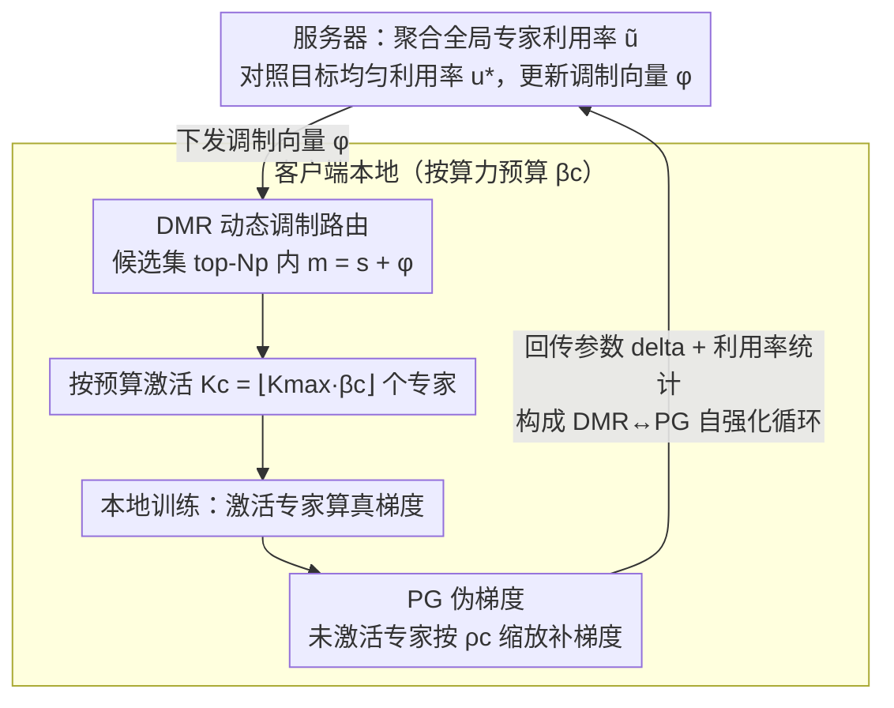

# UB-SMoE: Universally Balanced Sparse Mixture-of-Experts for Resource-Adaptive Federated Fine-tuning of Foundation Models

**会议**: ICML 2026  
**arXiv**: [2605.16690](https://arxiv.org/abs/2605.16690)  
**代码**: 无  
**领域**: 联邦学习 / 模型压缩 / Sparse MoE / LoRA 微调  
**关键词**: 联邦微调, 稀疏 MoE, 异构客户端, 动态路由, 伪梯度

## 一句话总结
作者发现把 Sparse MoE 直接搬进异构联邦 LoRA 微调会出现「专家利用失衡」与「Top-K 不可导」两个致命问题，并通过 Dynamic Modulated Routing (DMR) 重平衡专家激活、Universal Pseudo-Gradient (PG) 给未激活专家补伪梯度，构成自强化循环，使低算力客户端在节省 45% 计算的同时性能提升 8.7×。

## 研究背景与动机
**领域现状**：基础模型（FM）的联邦微调主流方案是 LoRA —— 冻结预训练权重，只在每层注入低秩矩阵 $B\in\mathbb{R}^{d\times r}, A\in\mathbb{R}^{r\times l}$，更新 $\Delta W=\frac{\alpha}{r}BA$。为应对真实设备的系统异构性，HetLoRA / FlexLoRA / FLoRA / FLoRIST 等方法给每个客户端分配不同 rank $r_c$，让低端设备用更小的适配器。

**现有痛点**：异构 LoRA-rank 路线**省得很少**——LoRA 部分的计算量 $\mathcal{O}(r_c(d+l))$ 本就远小于 FFN 的 $\mathcal{O}(d\cdot l)$，而 FFN 计算量与 rank 无关，最终低算力客户端只能省约 5%；推理阶段更尴尬：$W_0+\Delta W$ 合并后仍是稠密矩阵，所有客户端延迟一样。

**核心矛盾**：要让低算力客户端真正轻、真正快，必须动 FFN 本身，但 LoRA-rank 路线根本没碰 FFN。Sparse MoE 通过条件计算只激活 $K$ 个专家，天然提供「按算力配 $K_c$」的资源自适应机制，但把它丢进异构联邦场景会引爆两个新问题：

1. **专家利用失衡**：高算力客户端激活更多专家，这些专家更新频繁被「过度专门化」；低算力客户端只激活少数专家，相关专家长期得不到训练。形成 rich-get-richer。
2. **Top-K 路由不可导**：未激活专家的 gating $\gamma_i(x)=0$，反传零梯度。低算力客户端 $K_c$ 小，意味着大部分专家在它本地训练时根本拿不到学习信号。

**本文目标**：(i) 给出收敛性分析，证明上述两个 discordance 会引入与客户端算力成反比的「不可约误差地板」；(ii) 设计一个机制同时治这两个病；(iii) 在常识推理与电信领域两个 benchmark 上证明对低算力客户端尤其有效。

**切入角度**：作者观察到，专家利用率统计在服务器端是可以聚合的全局信息，而未激活专家的梯度可以基于已激活专家+路由 softmax 概率"近似重建"。把这两个手段配对，就能形成「PG 维持未激活专家可用 → DMR 把它们路由回来产生真梯度 → 真梯度让 PG 更准」的自强化循环。

**核心 idea**：路由 logits 用全局利用率统计做动态调制 (DMR)，未激活专家用伪梯度补充学习信号 (PG)，两者循环互补。

## 方法详解

### 整体框架
UB-SMoE 要解决的是「把 Sparse MoE 搬进异构联邦 LoRA 微调后，低算力客户端因为 $K_c$ 小而陷入专家失衡与梯度死锁」这件事。它在每个 SMoE 层注入统一 rank 的 LoRA 适配器，让整个系统在「服务器聚合全局专家利用率 $\tilde u_i^{(l)}$ → 客户端拿利用率调制路由 logits $m^{(l)}_i=s^{(l)}_i+\phi^{(l)}_i$ → 按算力预算 $\beta_c$ 激活 $K_c=\lfloor K_{\max}\beta_c\rfloor$ 个专家 → 本地训练时未激活专家也吃到按稀疏度 $\rho_c$ 缩放的伪梯度 → 把参数 delta 与利用率统计回传服务器」这条闭环上滚动。两个核心机制 DMR 与 PG 各治一个病，又互相喂数据形成自强化循环——下图这条"服务器↔客户端"闭环回路本身就是第 3 个关键设计要刻画的对象。

### 关键设计

**1. Dynamic Modulated Routing (DMR)：用全局利用率重塑路由，又不毁掉专家专门化**

要修的痛点是 rich-get-richer 的专家失衡——高算力客户端反复激活同一批专家把它们过度专门化，低算力客户端激活到的少数专家长期得不到训练。最直接的办法是加 load balancing loss 强行均匀化，但那会把专家压平、牺牲掉好不容易学到的专门化。DMR 的做法是把「这个专家在语义上合不合适」和「这个专家在系统上有没有被冷落」两个信号正交拆开：先用原始 affinity $s^{(l)}=W^{(r)}x$ 选出 top-$N_p$（$K_{\max}\le N_p\ll M$，文中取 $N_p=2$）候选集 $\mathcal{T}^{(l)}$，**只对候选集内**的专家加可学习调制向量 $\phi^{(l)}_i$，候选集外保持原 logit，再 $p^{(l)}=\text{softmax}(m^{(l)})$ 并 Top-$K_c$ 选出实际激活。调制量本身由服务器端的全局统计驱动：聚合利用率 $\tilde u^{(l)}_i=\sum_c p_c\frac{a^{(l)}_{c,i}}{n^{(l)}_c}$，对照目标均匀利用率 $u^*=\bar K/M$，按 $\tilde\phi^{(l)}_i=\tanh\left(\frac{u^*}{\tilde u^{(l)}_i+\epsilon}-1\right)$ 更新并用 momentum $\zeta$ 平滑——被过度使用的专家 logit 被压低、被冷落的被抬升。关键在于这种再平衡只发生在「跟当前输入语义相关」的候选集里，所以既修了失衡又不会把路由搅成噪声。

**2. Universal Pseudo-Gradient (PG)：给未激活专家造梯度，打破 Top-K 死锁**

第二个痛点是 Top-K 路由不可导：未激活专家 gating 为 0、反传梯度也为 0，$K_c$ 小的低算力客户端等于本地大半专家拿不到任何学习信号。PG 让每个 batch、每个客户端的未激活专家 $i\notin\mathcal{A}_c(x)$ 都拿到一份「近似」梯度——用 router 的 softmax 概率配上已激活专家的真实梯度构造伪梯度，再按客户端稀疏度 $\rho_c$（与 $K_c/M$ 反比）缩放，$K_c$ 越小则伪梯度权重越高，因为它越急需补偿。这一步在数学上等价于把期望梯度 $\nabla_{\Theta^{(e)}_i}F_c$ 从「条件在 $i\in\mathcal{A}_c(x)$ 上」松弛回「无条件」，直接缩小 Definition 7 里的偏差项 $B_{c,i}(\Theta)$。为什么非这么做不可有理论背书：Theorem 4.1 证明 sparse Top-K 路由会让 SGD 收敛到 bias error 地板 $B_{\text{SMoE}}=2\|B(\Theta^*)\|^2/\mu'$，Corollary 1 进一步指出该地板 $\propto (M-K_c)$、对小 $K_c$ 客户端尤其致命，而 PG 正是攻击这个 bias 的来源——把「未激活」近似成「$p_{c,i}(\Theta)\to 1$ 的可更新状态」。

**3. DMR ↔ PG 自强化循环与 $\phi$ 范围正则：两个机制互相兜底**

单独用任何一个都会过激：只有 DMR 时，路由再怎么调，长期零梯度的死亡专家还是没法贡献；只有 PG 时，所有专家会收敛到相似参数、失去 MoE 的意义。两者闭环才稳——PG 让所有专家持续学习不死掉，DMR 拿到的全局利用率统计才有意义、调制才能精准调度，调度后越来越多专家被真正激活、产生真实梯度，真实梯度又反过来让 PG 的估计更准。为防止调制本身爆炸，对 $\phi^{(l)}$ 加范围正则 $\mathcal{L}_{reg}=\lambda(\|\text{ReLU}(\phi_{\min}-\phi)\|^2_2+\|\text{ReLU}(\phi-\phi_{\max})\|^2_2)$，把调制量约束在 $[\phi_{\min},\phi_{\max}]$ 内。

### 损失函数 / 训练策略
本地损失 = LM 损失 + DMR 范围正则 $\mathcal{L}_{reg}$，未激活专家通过 PG 直接累积梯度。客户端按预算 $\beta_c\in[0,1]$ 决定 $K_c=\lfloor K_{\max}\beta_c\rfloor$，统一 LoRA rank $r$（无需异构 rank）。服务器侧聚合 LoRA 增量 + 利用率统计 + modulation 参数。

## 实验关键数据

### 主实验
基于 OLMoE-1B-7B，Commonsense-15K（8 个常识推理数据集）与 telecommunication 领域，对比 4 个 LoRA-rank 异构方法 (HetLoRA / FlexLoRA / FLoRA / FLoRIST) 与 2 个异构稀疏方法 (SMoE-LLB / A3SMoE)。

| 方法 | 类别 | 低算力 ($\beta_1$) ↑ | 高算力 ($\beta_4$) ↑ | 平均 ↑ |
|------|------|----------------------|----------------------|--------|
| HetLoRA | 异构 rank | 0.0079 | 0.4580 | 0.1874 |
| FlexLoRA | 异构 rank | 0.0456 | 0.4563 | 0.3303 |
| FLoRA | 异构 rank | 0.0094 | 0.2996 | 0.1517 |
| FLoRIST | 异构 rank | 0.0112 | 0.2724 | 0.1480 |
| A3SMoE | 异构稀疏 | 0.3629 | 0.3410 | 0.3861 |
| **UB-SMoE** | 异构稀疏 | **0.3936** | **0.5240** | **0.4267** |

低算力客户端性能从 HetLoRA 的 0.0079 跳到 0.3936（约 8.7× 提升），同时高算力侧也比所有 baseline 都高。

### 消融实验
| 配置 | 低算力性能 | 说明 |
|------|-----------|------|
| Full UB-SMoE (DMR + PG) | 0.3936 | 完整模型 |
| w/o PG | 显著下降 | 未激活专家梯度归 0，bias 地板回归 |
| w/o DMR | 显著下降 | rich-get-richer 重现，少数专家垄断 |
| candidate set $N_p=2$ | 最优 | 太大调制覆盖语义、太小不够灵活 |
| 无 $\mathcal{L}_{reg}$ | $\phi$ 发散 | 调制爆炸破坏路由 |

### 关键发现
- **真正省算力**：异构 LoRA-rank 路线对低算力客户端只省 ~5%，UB-SMoE 通过 Sparse MoE 直接砍 FFN，省到 45%。
- **理论与实验闭环**：Theorem 4.1 推出的 bias error 地板 $B_{\text{SMoE}}\propto(M-K_c)$ 解释了 baseline 为何在低算力端崩盘，UB-SMoE 实测在 $\beta_1$ 上的提升幅度（8.7×）也对应理论预测「$K_c$ 越小、bias 越大、PG 收益越大」。
- **高低算力同时受益**：很多联邦异构方法是"按下葫芦浮起瓢"——救了低算力就拖累高算力。UB-SMoE 因为专家保持多样性，高算力 $\beta_4$ 也达到 0.5240，全榜最高。
- **通信成本可控**：相比 LoRA-rank 方法只多传 $L(M+1)$ 维利用率统计向量（$M$=专家数、$L$=层数），相对参数 delta 可忽略。

## 亮点与洞察
- **理论先行的清晰诊断**：先用 Theorem 4.1 + Corollary 1 把「Top-K 路由 + 异构算力」的偏差地板写成 $\propto(M-K_c)$ 的闭式，让方法设计完全锁定攻击目标 —— 这是这类系统型论文里少见的、理论与方法严格对应的范式。
- **「条件结构 + 调制」的解耦**：DMR 的精髓不是又一个 load balancing loss，而是把"哪些专家在语义上合适"（候选集）和"哪些专家在系统上欠喂"（调制项）做了正交分解，避免常见 MoE 训练里 balance loss 把专家压平的副作用，可以迁移到任何 SMoE 训练场景。
- **PG 的物理含义**：本质是把 sparse expected gradient 的「条件期望」逼近回「无条件期望」，与 dropout / noise injection / soft routing 思路相通，但具体到 SMoE 异构联邦场景，把 $\rho_c$ 和客户端算力反相关挂钩是关键。
- **可迁移性**：思路可以套到 (a) 边缘部署的稀疏 LLM（每台设备 $K_c$ 不同），(b) 多任务 MoE（不同任务激活强度差异类比异构客户端），(c) 任何「条件计算 + 不可导路由」组合。

## 局限与展望
- 收敛分析依赖 PL 条件、$L$-smooth、bounded variance、bounded gradient divergence 等较强假设，虽然在 LoRA 适配器小空间里有合理性，但仍是简化模型。
- PG 的近似精度依赖路由 softmax 输出质量，路由器本身没训好时 PG 可能引入额外噪声 —— 文中没系统量化这一点。
- 实验主要在 OLMoE-1B-7B + 常识推理 + telecom 上，更大规模 FM（70B+）以及多模态 MoE 上的可扩展性尚未验证。
- DMR 的 momentum $\zeta$、PG 的缩放 $\rho_c$、modulation 范围 $[\phi_{\min},\phi_{\max}]$、候选集大小 $N_p$ 等超参较多，跨任务自动调参方案缺失。

## 相关工作与启发
- **vs HetLoRA / FlexLoRA / FLoRA / FLoRIST**：这些方法都走"异构 LoRA-rank"路线，UB-SMoE 走"异构 sparsity"，区别在于真正动了 FFN 计算量；优势是低算力侧能省 45%（而不是 5%）算力，劣势是需要 MoE 架构作为前提。
- **vs A3SMoE (Tran et al., 2025)**：A3SMoE 首次把 SMoE 引入异构联邦微调，但没解决 expert utilization imbalance 与 Top-K 不可导问题，UB-SMoE 用 DMR + PG 直接补齐，全 budget 段都更优。
- **vs 中心化 MoE 训练**：中心化场景里 load balancing loss (Switch Transformer, GShard) 已足够，但联邦异构场景下问题被「不同客户端 $K_c$ 不同」放大，必须有全局利用率聚合 + 客户端感知伪梯度才能解决。
- **vs FedAvg 类一般 FL**：UB-SMoE 在标准 FedAvg 参数聚合外还需聚合利用率统计与 modulation 参数，但通信开销分摊到 LoRA delta 之外只多 $L(M+1)$ 浮点数，工程上可行。

## 评分
- 新颖性: ⭐⭐⭐⭐ 把 SMoE 与异构联邦微调结合并用 DMR+PG 双机制闭环解决，确实是这条路线上的明显推进。
- 实验充分度: ⭐⭐⭐ 在两个领域 benchmark 上做了充分对比，但缺少更大规模 FM 与多模态场景验证。
- 写作质量: ⭐⭐⭐⭐ 收敛分析推导清晰、公式与定理表述严谨，方法对应攻击的偏差项有理论依据。
- 价值: ⭐⭐⭐⭐ 让低算力客户端真正能参与 FM 微调，对边缘联邦场景有直接落地价值。

<!-- RELATED:START -->

## 相关论文

- [\[ICML 2026\] DAG-MoE: From Simple Mixture to Structural Aggregation in Mixture-of-Experts](dag-moe_from_simple_mixture_to_structural_aggregation_in_mixture-of-experts.md)
- [\[ICLR 2026\] ABBA-Adapters: Efficient and Expressive Fine-Tuning of Foundation Models](../../ICLR2026/model_compression/abba-adapters_efficient_and_expressive_fine-tuning_of_foundation_models.md)
- [\[ICLR 2026\] Unveiling Super Experts in Mixture-of-Experts Large Language Models](../../ICLR2026/model_compression/unveiling_super_experts_in_mixture-of-experts_large_language_models.md)
- [\[CVPR 2026\] Quant Experts: Token-aware Adaptive Error Reconstruction with Mixture of Experts for Large Vision-Language Models Quantization](../../CVPR2026/model_compression/quant_experts_token_aware_vlm_quantization.md)
- [\[ICML 2026\] End-to-End Compression for Tabular Foundation Models](end-to-end_compression_for_tabular_foundation_models.md)

<!-- RELATED:END -->
