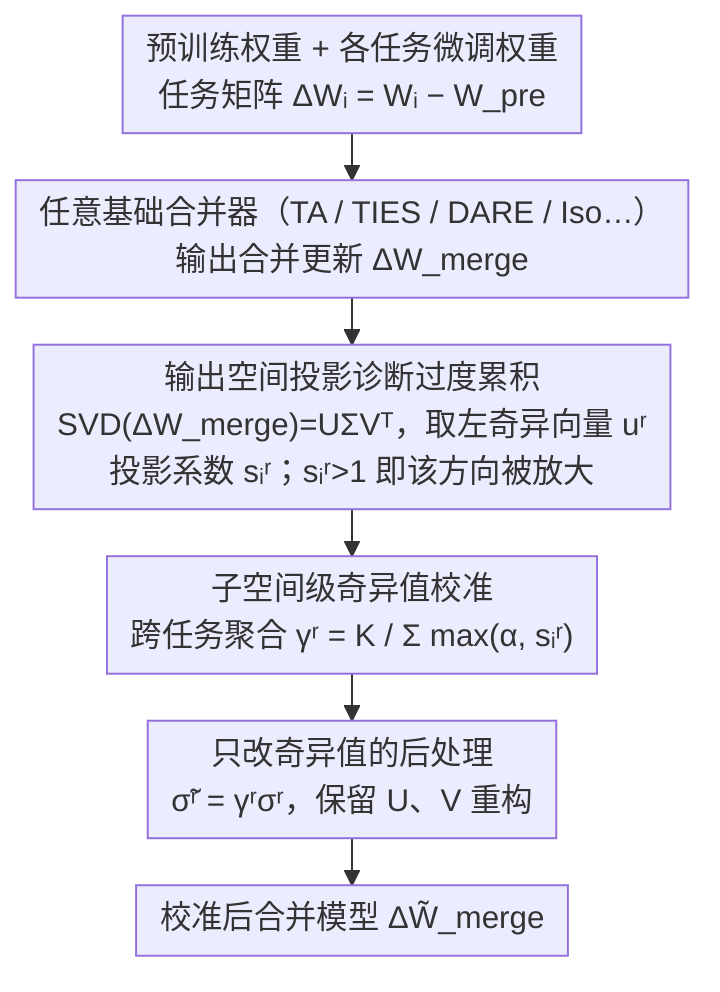

# When Shared Knowledge Hurts: Spectral Over-Accumulation in Model Merging

**会议**: ICML2026  
**arXiv**: [2602.05536](https://arxiv.org/abs/2602.05536)  
**代码**: https://github.com/lyymuwu/SVC  
**领域**: 优化  
**关键词**: 模型合并, 谱校准, 奇异值, 任务向量, 数据无关后处理

## 一句话总结
这篇论文指出模型合并不仅会有任务冲突，还会把跨任务共享的谱方向重复累加成过大的奇异值，并提出无需训练和数据的 Singular Value Calibration，在不改奇异向量的情况下重标定奇异值，从而稳定提升视觉与语言任务的合并效果。

## 研究背景与动机
**领域现状**：模型合并希望把多个同底座微调模型的能力整合进一个模型，常见做法是把每个任务的权重差写成 task vector 或 task matrix，再通过平均、Task Arithmetic、TIES、DARE 等规则组合成一个 merged update。这个方向的吸引力在于不需要重新训练一个多任务模型，也不需要在推理时保留多个专家模型。

**现有痛点**：已有方法主要把合并失败归因于“任务之间的冲突”，因此常在参数层面剪枝、掩码或去掉符号不一致的更新。但论文观察到另一个更隐蔽的失败模式：如果多个任务在相同谱子空间里携带相似的共享知识，简单线性合并会把这部分共同成分重复计数，使少数顶部奇异方向被放大，最终让合并模型过度偏向共享方向而压低任务特异信息。

**核心矛盾**：共享知识本来应该帮助迁移，但当共享方向被多次加和时，它会从“公共有用信号”变成“谱上的过度累积”。也就是说，合并模型的问题不只是不同任务互相抵消，也可能是相同方向被一起推得太强。

**本文目标**：作者要在不访问训练数据、不额外微调、不改变已有合并规则的条件下，诊断每个谱子空间里共享知识是否被过度累积，并把被放大的奇异值拉回更合理的尺度。

**切入角度**：论文把合并后的 task matrix 做 SVD，用合并矩阵的输出空间基作为公共坐标系，再把每个任务矩阵投影到这些输出方向上。这样，不同任务在同一子空间中的响应可以被直接比较，过度累积也可以被写成投影系数大于 1 的现象。

**核心 idea**：用输出空间投影系数估计每个谱子空间的“共享方向被多算了多少”，再只缩放对应奇异值，得到一个训练无关、数据无关、可接在任意合并方法后的谱后处理器。

## 方法详解
论文的核心不是重新设计一种合并公式，而是给已有合并结果做一次谱层面的体检和校准。给定预训练权重 $W_{pre}$ 与多个微调权重 $W_i$，每个任务矩阵定义为 $\Delta W_i = W_i - W_{pre}$。任意基础合并方法先输出一个 $\Delta W_{merge}$，SVC 再对这个矩阵做后处理，得到校准后的 $\Delta \tilde{W}_{merge}$。

### 整体框架
整体流程可以分成三步。第一步，对合并矩阵 $\Delta W_{merge}$ 做 SVD，写成 $U\Sigma V^\top$，其中左奇异向量 $u^r$ 被视为第 $r$ 个输出空间方向。第二步，对每个任务矩阵计算它在该输出方向上的响应 $a_i^r=(u^r)^\top\Delta W_i$，同时计算合并矩阵的响应 $a_{merge}^r=(u^r)^\top\Delta W_{merge}$。第三步，把 $a_{merge}^r$ 投影到每个 $a_i^r$ 上，得到投影系数 $s_i^r=\langle a_{merge}^r,a_i^r\rangle / \|a_i^r\|_2^2$，再把所有任务的系数组合成子空间校准因子 $\gamma^r$，最终用 $\tilde{\sigma}^r=\gamma^r\sigma^r$ 重构合并更新。

这个设计的关键点是，SVC 不重新估计方向，只调整每个方向的强度。如果某个方向确实对应多个任务共享的输出模式，SVC 不会删除它；如果这个方向因为重复累加而强到压制其他方向，SVC 会降低对应奇异值，让谱分布重新平衡。

### 关键设计

**1. 输出空间投影诊断过度累积：把“共享方向被多算了”变成可计算的谱指标。** 权重空间逐参数比较很难看出“共享知识被多次累加”这种结构性问题，论文转而在输出空间里量化它。对合并矩阵做 SVD 后，第 $r$ 个左奇异向量 $u^r$ 代表一个输出响应方向；每个任务在该方向上的响应是 $a_i^r=(u^r)^\top\Delta W_i$，合并响应则是各任务之和 $a_{merge}^r=\sum_i a_i^r$。把合并响应投影回任务响应得到系数 $s_i^r=\langle a_{merge}^r,a_i^r\rangle/\|a_i^r\|_2^2$：$s_i^r>1$ 说明其他任务在这个方向上贡献了正向内积、把任务 $i$ 的该方向放大了，正是“过度累积”的可计算信号；$s_i^r<1$ 则对应被衰减或冲突。之所以用左奇异向量（输出空间）而非右奇异向量（输入空间），是因为输出方向直接对应合并矩阵的响应行为，能稳定衡量任务是否被放大，而输入方向混合了多任务的输入模式、对单个专家不够有代表性——这也是消融里输入空间变体几乎失效的原因。

**2. 子空间级奇异值校准：跨任务聚合，只在共享方向普遍被放大时才动手。** 单个任务的投影系数会受噪声和任务偏好影响，直接按它缩放容易过度修正，因此论文把同一子空间里所有任务的系数聚合成一个缩放因子 $\gamma^r=K/\sum_i \max(\alpha,s_i^r)$（等价于各任务裁剪后缩放 $1/\max(\alpha,s_i^r)$ 的调和平均）。当很多任务都在该方向上 $s_i^r>1$ 时分母变大、$\gamma^r<1$，奇异值被下调；没有系统性过度累积时 $\gamma^r\approx 1$，几乎不动。超参 $\alpha$ 控制下调力度：$\alpha=1$ 时 $\max(\alpha,s_i^r)\ge 1$ 保证 $\gamma^r\le 1$，是“只抑制不放大”的纯抑制式校准；$\alpha<1$ 时允许 $\gamma^r>1$ 去补强累积不足的子空间。这样校准只在共享方向被普遍放大时才生效，避免误伤个别任务的特异方向。

**3. 只改奇异值、不改奇异向量的后处理：当插件接在任意合并器之后。** SVC 保留 SVD 得到的 $U$ 与 $V$，只用 $\tilde{\sigma}^r=\gamma^r\sigma^r$ 替换原奇异值，再重构 $\Delta\tilde W_{merge}=\sum_r \tilde{\sigma}^r u^r(v^r)^\top$。这意味着它不重新寻找方向、不引入新的训练目标、也不需要校准集，可以直接接在 TA、TIES、DARE、TSV-M、Iso-C/Iso-CTS 等任意合并器之后当后处理插件；额外代价只是一次离线 SVD，特别适合数据不可用、或只想对仓库里已有合并模型做轻量修正的场景。对 IA3 这类一维 PEFT 更新（无法做矩阵 SVD），论文还给出向量版校准 $\gamma=K/\sum_i s_i$、$\tilde\tau_{merge}=\gamma\tau_{merge}$，把同样的“只改尺度不改方向”思路延伸过去。

### 损失函数 / 训练策略
SVC 本身没有训练损失。论文用一个投影最优问题解释校准因子的来源：希望找到非负缩放 $\gamma^r$，使 $\gamma^r a_{merge}^r$ 在任务响应方向 $a_i^r$ 上的投影尽量接近 $a_i^r$。当 $s_i^r>0$ 时，单任务最优缩放为 $1/s_i^r$；如果跨任务正内积导致 $s_i^r>1$，就自然得到小于 1 的缩放。实验默认使用数据无关设置 $\alpha=1/K$；对 TSV-M 使用 $\alpha=1$，即只抑制过度累积、不放大任何子空间。

## 实验关键数据

### 主实验
论文在视觉与语言两类合并任务上测试 SVC。视觉侧覆盖 8-task 与 14-task 多任务分类，使用 ViT-B/32、ViT-B/16、ViT-L/14；语言侧覆盖 Llama2-7B 生成评测、BERT/T5/T0 分类或 PEFT 任务。

| 场景 | 基础合并器 | 原始结果 | 加 SVC 后 | 提升 |
|------|------------|----------|-----------|------|
| CV 8 tasks, ViT-B/32 | Task Arithmetic | 68.9 | 81.9 | +13.0 |
| CV 14 tasks, ViT-L/14 | Task Arithmetic | 57.7 | 76.7 | +19.0 |
| CV 8 tasks, ViT-B/16 | DARE | 71.5 | 84.8 | +13.3 |
| NLP, Llama2 AlpacaEval | Iso-C | 50.0 | 58.9 | +8.9 |
| NLP, Llama2 GSM8K | Iso-C | 42.0 | 51.4 | +9.4 |
| NLP, BERT 平均分类准确率 | Task Arithmetic | 56.9 | 69.0 | +12.1 |

### 消融实验
论文的关键消融是比较输出空间校准与输入空间校准。把左奇异向量换成右奇异向量后，多数基础合并器的收益明显消失，甚至低于原始合并结果。

| 配置 | TA | TIES | DARE | TSV-M | Iso-C | Iso-CTS |
|------|----|------|------|-------|-------|---------|
| 原始合并 | 68.9 | 72.6 | 65.8 | 84.0 | 83.1 | 81.4 |
| SVC 输出空间, 本文 | 81.9 | 80.0 | 80.7 | 84.8 | 84.6 | 85.6 |
| SVC 输入空间变体 | 64.9 | 65.7 | 67.5 | 84.0 | 82.1 | 85.5 |

| Backbone | SVC 离线时间 | 显存占用 |
|----------|--------------|----------|
| ViT-B/32 | 5.1 s | 1027.4 MiB |
| ViT-B/16 | 8.2 s | 1082.8 MiB |
| ViT-L/14 | 15.6 s | 1488.5 MiB |
| LLaMA2 7B | 517.2 s | 1898.7 MiB |
| Qwen2.5 7B | 249.3 s | 2513.1 MiB |

### 关键发现
- SVC 对弱合并器提升最大，说明谱过度累积是 Task Arithmetic 这类线性方法的重要失败源；但它对 TSV-M、Iso-C/Iso-CTS 等更强谱方法仍有稳定小幅收益。
- 输出空间比输入空间更关键。左奇异向量对应合并矩阵的输出响应，能直接衡量任务行为是否被放大；右奇异向量侧更多反映输入模式，对校准合并行为不够可靠。
- $\alpha=1$ 的抑制式校准已经能稳定提升，允许 $\alpha<1$ 放大低累积子空间时效果更混合，说明“先修正过强方向”比“同时补强弱方向”更稳。
- SVC 是一次性离线后处理，LLM 规模上也比训练式合并便宜得多，但仍要承担大矩阵 SVD 的计算成本。

## 亮点与洞察
- 论文把“共享知识为什么会伤害合并”讲得很清楚：不是共享本身有害，而是线性合并把共享方向重复计数，使谱能量集中到少数顶部子空间。
- 投影系数 $s_i^r$ 是一个很有解释力的诊断量。它把跨任务内积、行为放大和奇异值膨胀连在一起，使方法不只是经验后处理，而有明确的谱分析支撑。
- SVC 的工程形态很实用：不需要校准数据、不需要任务标签、不改推理路由，也不要求知道输入分布。这让它适合模型仓库里已有多个 task adapter 或 fine-tuned checkpoint 的场景。
- “只改奇异值”是一个克制但有效的选择。它避免了重新寻找方向的复杂性，也降低了破坏已有合并器结构的风险。

## 局限与展望
- 方法依赖对层级 task matrix 做 SVD，虽然是离线操作，但在更大模型、更高秩更新或多层全量合并中仍可能成为瓶颈。
- 理论主要解释线性权重合并与局部线性层行为，对非线性功能组合、token 分布变化和推理时动态路由的解释仍有限。
- SVC 默认以数据无关方式平衡所有任务，如果用户真正关心某些任务的优先级，需要结合论文中的 target-task calibration 或额外偏好信息。
- 当前实验覆盖视觉、NLP 与 7B 级 LLM，但还可以进一步测试 instruction tuning、multimodal adapter 合并、LoRA 合并以及安全对齐模型合并中的谱过度累积。

## 相关工作与启发
- **vs Task Arithmetic**: Task Arithmetic 直接加任务向量，简单高效但容易把共享方向重复累积；SVC 可以作为其后处理，将 8-task ViT-B/32 从 68.9 提到 81.9。
- **vs TIES / DARE**: 这些方法更多在参数层处理符号冲突或稀疏化冲突更新；SVC 关注全局谱结构，因此能补上“非冲突但过强”的共享方向问题。
- **vs TSV-M / Iso-C / Iso-CTS**: 这些方法已经使用谱视角构造合并更新；SVC 的区别是以后处理方式诊断合并后的输出子空间重叠，不需要重写基础合并规则。
- **启发**: 对 adapter、LoRA、专家模型融合来说，合并质量也许不只取决于任务相关性，还取决于共享方向在谱上是否被重复放大；未来可以把类似诊断用于选择要合并的任务组合。

## 评分
- 新颖性: ⭐⭐⭐⭐☆ 谱空间合并已有基础，但把共享知识过度累积形式化为输出空间投影和奇异值膨胀很有辨识度。
- 实验充分度: ⭐⭐⭐⭐☆ 覆盖视觉与语言、多种合并器和消融，主结论扎实；如果有更多真实 LLM adapter 合并案例会更完整。
- 写作质量: ⭐⭐⭐⭐☆ 动机、理论和算法衔接自然，少数表格信息较密，需要读者熟悉模型合并背景。
- 价值: ⭐⭐⭐⭐⭐ 作为训练无关、数据无关的后处理，实用性强，也给模型合并失败分析提供了清晰诊断工具。

<!-- RELATED:START -->

## 相关论文

- [\[ICML 2026\] Saliency-Aware Model Merging](saliency-aware_model_merging.md)
- [\[ICLR 2026\] AdaRank: Adaptive Rank Pruning for Enhanced Model Merging](../../ICLR2026/model_compression/adarank_adaptive_rank_pruning_for_enhanced_model_merging.md)
- [\[ICML 2026\] Model Merging Scaling Laws in Large Language Models](model_merging_scaling_laws_in_large_language_models.md)
- [\[ICML 2026\] Decouple Searching from Training: Scaling Data Mixing via Model Merging for Large Language Model Pre-training](decouple_searching_from_training_scaling_data_mixing_via_model_merging_for_large.md)
- [\[CVPR 2026\] Model Merging on Loss Landscape: A Geometry Perspective](../../CVPR2026/model_compression/model_merging_on_loss_landscape_a_geometry_perspective.md)

<!-- RELATED:END -->
