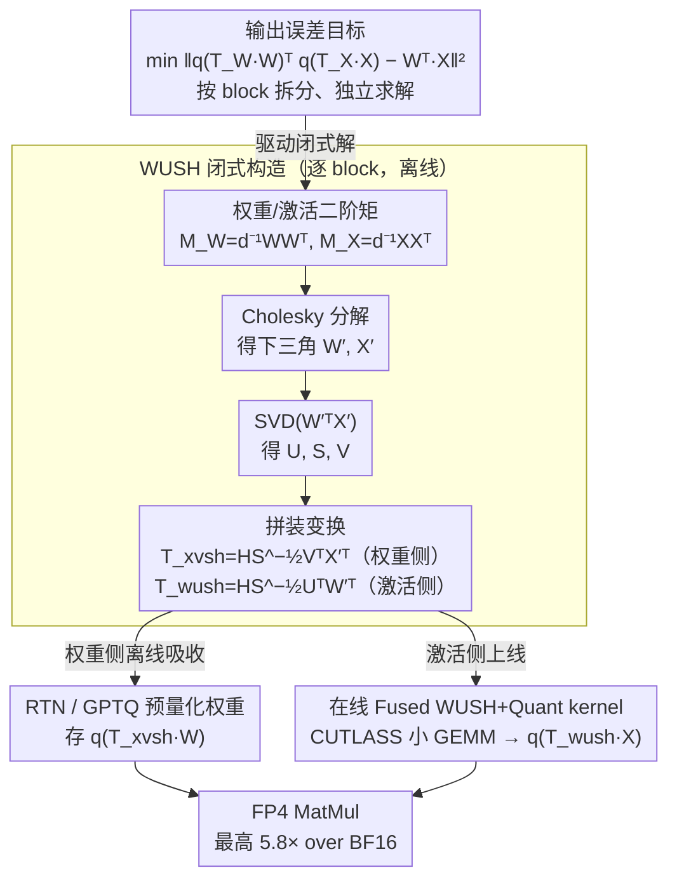

# WUSH: Near-Optimal Adaptive Transforms for LLM Quantization

**会议**: ICML 2026  
**arXiv**: [2512.00956](https://arxiv.org/abs/2512.00956)  
**代码**: https://github.com/IST-DASLab/WUSH  
**领域**: 模型压缩 / LLM 量化  
**关键词**: W4A4 量化, 自适应变换, Hadamard, MXFP4, GPTQ  

## 一句话总结
WUSH 为 LLM 的 weight-activation 低比特量化推导出闭式、数据自适应的 blockwise 线性变换，把 Hadamard 的均匀扩散能力和权重/激活二阶统计结合起来，在 W4A4 尤其是 MXFP4 场景下显著提升精度且几乎不牺牲 FP4 kernel 吞吐。

## 研究背景与动机
**领域现状**：LLM 部署中，权重量化和激活量化已经是降低显存、提升吞吐的常规手段。对于 W4A4 这类权重和激活都压到 4 bit 的方案，主流做法不仅要选择 RTN、GPTQ 等量化器，还要在量化前对通道做缩放或旋转，减少少数 outlier 对 AbsMax scale 的支配。

**现有痛点**：Hadamard rotation、QuaRot、MR-GPTQ 这类变换在实践中有效，但通常是固定的、数据无关的。它们可以把 outlier 能量摊开，却没有回答“什么变换对给定权重和激活统计最优”。SpinQuant、FlatQuant 等方法尝试学习变换，但需要迭代优化，校准和工程成本更高，也不一定适合快速 per-token 激活量化。

**核心矛盾**：量化误差取决于权重和激活共同决定的输出误差，而不是单边把权重或激活变得更均匀就够了。理想的变换既要适配每个 block 的二阶统计，又要能在推理时被高效融合进 activation transform 和 quantization kernel；如果变换过于复杂，精度收益会被运行时开销吃掉。

**本文目标**：作者希望为 blockwise RTN AbsMax quantizer 推导一个闭式近似最优变换，覆盖 FP 和 INT 低比特格式，并能自然接入 GPTQ。方法需要在真实 LLM 上提升 W4A4 精度，同时保留 FP4 MatMul 的吞吐优势。

**切入角度**：论文从单个量化 block 的输出误差出发，把权重列和激活列视作来自分布的样本，用二阶矩描述它们的典型形状，再寻找能让 transformed weight 与 transformed activation 的量化误差最小的线性变换。Hadamard 不再是唯一主角，而是最优构造中的一个均匀扩散骨架。

**核心 idea**：先用权重和激活的 blockwise 二阶矩构造数据自适应的非正交变换，再在外层接一个 Hadamard backbone，使变换同时具备统计最优性和对 AbsMax 量化友好的能量扩散特性。

## 方法详解

### 整体框架
WUSH 针对每个 linear layer 的输入通道按量化 group 切成 block。离线校准时，方法收集该 block 的权重二阶矩和激活二阶矩，闭式求出一对互逆转置关系的变换：权重侧用 $T_{xvsh}$ 预变换并量化，激活侧在推理时用 $T_{wush}$ 变换后再量化。由于两者满足 $T_{xvsh}=T_{wush}^{-\top}$，未量化时内积保持一致；量化后，变换的目标是让输出误差最小。

推理时，权重侧的变换已经吸收到预量化权重里，在线只需要对 activation block 做 WUSH transform 和 quantization。作者为此实现 fused WUSH + Quant kernel，并把每个 block 的 $G\times G$ 矩阵以适合 CUTLASS GEMM 的布局存储，使多个小矩阵变换可以像 Hadamard + quantization 一样被高效融合。

### 关键设计
1. **从输出误差出发定义逐 block 的联合量化目标**：以往的量化要么只盯权重量化误差、要么只压激活，但真正决定模型输出的是 $W^\top X$ 这个乘积的误差。WUSH 干脆把每个输入通道 block 的输出误差 $\|q(T_WW)^\top q(T_XX)-W^\top X\|_F^2$ 直接当成优化目标，选一对变换 $T_W,T_X$ 让它最小，再把整层误差近似拆成各 block 误差之和，于是每个 block 都能独立闭式求解。之所以从输出误差建模，是因为 AbsMax group quantization 的误差由 block 内最大值、分布形状以及权重/激活的相互作用共同决定——盯住输出误差才能直接解释固定 Hadamard 何时够用、何时不够，也是后面整套闭式解的出发点。

2. **WUSH 闭式构造：二阶矩 + SVD + Hadamard backbone**：有了目标，关键是真能闭式解出「对这个 block 最优」的变换，而不靠迭代学习。做法是先对权重二阶矩 $d_{out}^{-1}WW^\top$ 和激活二阶矩 $d_{batch}^{-1}XX^\top$ 各做 Cholesky 得到下三角 $W'$、$X'$，再对 $W'^\top X'$ 做 SVD 得到 $U,S,V$，最后拼出激活侧变换 $T_{wush}=HS^{-1/2}U^\top W'^\top$、权重侧 $T_{xvsh}=HS^{-1/2}V^\top X'^\top$，两者互为逆转置 $T_{xvsh}=T_{wush}^{-\top}$，保证未量化时内积不变。这里 $S^{-1/2}$ 与二阶矩项按真实统计把坐标系「白化」对齐，而 Hadamard backbone 把能量均匀撒到 group 内、让每个通道 RMS 相等——这正是 AbsMax 友好的关键。论文证明该构造对 FP 量化最优、对 INT 渐近最优，且 Hadamard 是其中唯一数据无关的成分，顺带解释了它长期被经验验证有效的原因。

3. **RTN / GPTQ 嵌入与 fused GPU kernel 工程闭环**：每个 block 都有独立矩阵，朴素实现会比固定 Hadamard 慢很多，理论收益容易被运行时开销吃掉，所以必须把它落到真实 W4A4 推理。RTN 下各 block 并行算 WUSH，并把权重侧变换离线吸收进预量化权重；GPTQ 下则复用与 GPTQ Hessian 相同的激活二阶信息，在 block 更新与误差传播之间交错计算 transformed weight。在线阶段只剩 activation 侧变换，被映射成 CUTLASS 风格的小 GEMM、与 quantization 融成一个 kernel，随后接 FP4 MatMul。通过把 $(G,G,C)$ 的 block 矩阵按适合 CUTLASS GEMM 的布局存储、把 C 维当作 thread block 偏移隐式处理，实测吞吐与 Hadamard fused kernel 仅差约 1.3%、最高 5.8× over BF16，使精度提升不被工程开销抵消。

### 损失函数 / 训练策略
WUSH 是后训练量化方法，不训练模型参数。离线阶段使用校准数据计算权重/激活二阶矩，并对每个线性层顺序校准；量化一层后，把校准激活继续前传到下一层。RTN 版本直接 round-to-nearest；GPTQ 版本沿用 GPTQ 的 Hessian 和误差传播，只是在当前 block 上先应用 WUSH 变换。复杂度上，额外代价主要是 block 内二阶矩、Cholesky 和 SVD；由于 block size 远小于通道数，整体校准成本接近标准 GPTQ。

## 实验关键数据

### 主实验
主结果看 Llama-3.1-8B-Instruct 的 W4A4 LM Evaluation Harness。WUSH 在 NVFP4 上小幅提升，在更难的 MXFP4 上提升更明显，尤其相对 Hadamard/MR-GPTQ 的优势清楚。

| 格式 | 方法 | MMLU-CoT | GSM8K | HellaSwag | WinoGrande | Average | Recovery |
|------|------|----------|-------|-----------|------------|---------|----------|
| BF16 | 原模型 | 72.76 | 85.06 | 80.01 | 77.90 | 78.93 | 100.0 |
| NVFP4 | RTN-I | 68.26 | 78.39 | 78.15 | 74.11 | 74.73 | 94.67 |
| NVFP4 | GPTQ-H / MR-GPTQ | 69.12 | 80.80 | 78.17 | 75.24 | 75.84 | 96.08 |
| NVFP4 | GPTQ-WUSH | 69.69 | 80.11 | 78.52 | 76.09 | 76.10 | 96.40 |
| MXFP4 | RTN-I | 62.21 | 67.85 | 73.99 | 73.24 | 69.32 | 87.83 |
| MXFP4 | RTN-H | 62.38 | 72.48 | 75.29 | 71.67 | 70.45 | 89.26 |
| MXFP4 | RTN-WUSH | 66.85 | 75.16 | 77.28 | 73.56 | 73.21 | 92.75 |
| MXFP4 | GPTQ-H / MR-GPTQ | 67.19 | 75.70 | 76.91 | 74.80 | 73.65 | 93.31 |
| MXFP4 | GPTQ-WUSH | 67.79 | 77.41 | 77.44 | 74.78 | 74.35 | 94.20 |

### 消融实验
Layerwise quantization loss 直接验证 WUSH 的设计组件。下表摘取 Qwen3-8B 第 18 个 block、FineWeb-Edu 校准、RTN loss 的平均趋势：WUSH 在 MXFP4 和 INT4 中明显优于 identity、random rotation、Hadamard 和去掉 Hadamard 的 WUS。

| 量化格式 | 变换 | Q | K | V | O | G | U | D | 结论 |
|----------|------|---|---|---|---|---|---|---|------|
| MXFP4 | I | 11.1 | 12.0 | 10.7 | 4.35 | 7.10 | 6.56 | 5.47 | outlier 拉大误差 |
| MXFP4 | H | 7.24 | 7.20 | 8.60 | 3.79 | 5.45 | 5.61 | 3.90 | 固定 Hadamard 有帮助 |
| MXFP4 | WUS | 6.27 | 7.22 | 4.05 | 3.57 | 5.76 | 4.75 | 4.46 | 自适应但缺少均匀扩散 |
| MXFP4 | WUSH | 3.34 | 3.34 | 3.30 | 2.76 | 4.49 | 4.39 | 3.39 | 误差最低 |
| INT4 | H | 5.57 | 5.55 | 6.80 | 2.86 | 4.09 | 4.25 | 3.03 | Hadamard 稳定 AbsMax scale |
| INT4 | WUS | 213.0 | 142.0 | 10.7 | 4.54 | 50.2 | 7.42 | 13.1 | 非正交项可能放大坐标 |
| INT4 | WUSH | 2.39 | 2.43 | 2.54 | 2.10 | 3.43 | 3.43 | 2.55 | Hadamard 组件不可少 |

| 系统/鲁棒性分析 | 数值 | 说明 |
|----------------|------|------|
| WUSH + Quant + FP4 MatMul 最高 per-layer speedup | 5.8x vs BF16 | 接近 FP4 MatMul 的硬件收益 |
| 与 H + Quant + FP4 MatMul 的平均吞吐差 | 约 1.3% | 每 block 独立矩阵没有明显拖慢 kernel |
| Llama-3.1-8B RTN 预处理成本 | 19 分钟 / 19 GB H100 | 与 GPTQ 量级接近 |
| Qwen3-32B RTN 预处理成本 | 38 分钟 / 40 GB B200 | 大模型可扩展 |
| Llama-3.1-8B WUSH transform 存储开销 | MXFP4 1.4%，NVFP4 0.7% | 相对全 checkpoint 很小 |
| Qwen3-8B MXFP4 校准集敏感性 | FineWeb 74.91 / C4 75.57 LM Eval Avg. | 不依赖单一校准集 |

### 关键发现
- WUSH 的主要收益集中在 MXFP4 这类更难的 FP4 格式。Llama-3.1-8B 上，MXFP4 RTN-WUSH 比 RTN-H 平均分高 2.76，GPTQ-WUSH 比 MR-GPTQ 高 0.70。
- 单独的 WUS 在 NVFP4 上能接近 WUSH，但在 INT4 上会出现灾难性 outlier 放大，说明 Hadamard backbone 不是装饰，而是控制 AbsMax scale 的关键稳定器。
- fused kernel 结果很重要：WUSH 每个 block 有不同矩阵，理论上更难高效实现，但实测与 Hadamard fused kernel 平均吞吐差只有 1.3%，使精度提升不会被工程开销抵消。
- 校准集稳定性和 KL divergence 结果支持方法不是只对某一批 benchmark 过拟合。Qwen3-8B 上 WUSH 的 KL 低于 Hadamard，并且 FineWeb/C4 校准得到的平均准确率接近。

## 亮点与洞察
- 论文把“Hadamard 为什么有用”讲得更清楚：它不是凭经验乱转，而是在 WUSH 构造里承担把能量均匀分布到 group 维度的角色。这个解释比单纯报 benchmark 更有迁移价值。
- WUSH 的非正交、自适应部分来自权重和激活的二阶统计，因此它不是只处理 weight-only quantization，而是直接面向 W4A4 的 joint error。对 activation quantization 来说，这个建模粒度更贴近实际部署问题。
- 方法兼容 RTN 和 GPTQ，覆盖了“快速直接量化”和“二阶校正量化”两种常见路线。对工程使用者来说，这比只在一种校准流程里有效更有吸引力。
- GPU kernel 部分让论文完整度明显提高。每 block 独立矩阵通常会让人担心吞吐，但作者用布局和 CUTLASS GEMM 映射说明它可以做到接近 Hadamard 的速度。

## 局限与展望
- WUSH 仍依赖校准数据统计。虽然 FineWeb/C4 的敏感性实验不错，但在强 domain shift、长上下文或特殊工具调用分布下，activation 二阶矩是否稳定还需要更多验证。
- 论文主要围绕 dense linear layer 的 W4A4 推理，尚未充分讨论 MoE routing、KV-cache 量化、attention score 量化等更复杂模块的适配。
- 变换矩阵是 block-specific 的，存储开销虽小，但会增加实现复杂度。要进入更多推理框架，还需要成熟的 kernel、格式支持和量化导出工具链。
- 理论推导基于若干温和假设和近似，例如 block loss 独立、随机量化 surrogate、二阶矩代表典型分布；这些假设在极端 heavy-tail 或强相关 block 中可能不完全成立。

## 相关工作与启发
- **vs SmoothQuant / AWQ**: 这些方法主要通过通道缩放平衡权重与激活动态范围；WUSH 使用完整 blockwise 线性变换，能处理维度之间的相关结构，而不只是逐通道 scale。
- **vs QuaRot / Hadamard-based 方法**: QuaRot 和 MR-GPTQ 依赖固定旋转或 Hadamard，简单高效但数据无关；WUSH 保留 Hadamard 的硬件友好性，同时加入二阶统计自适应。
- **vs SpinQuant / FlatQuant**: 学习式变换可以适配数据，但需要迭代优化；WUSH 给出闭式解，校准流程更像 GPTQ，成本和可控性更适合批量部署。
- **vs GPTQ**: GPTQ 主要优化 weight quantization 的误差传播；WUSH 可以嵌入 GPTQ，在 transformed block 上做 GPTQ，并用相同 Hessian 信息提供 activation-side 变换。
- **启发**: 对低比特 LLM 来说，未来的关键可能不是单纯发明新 quantizer，而是把数据统计、格式特性和 kernel 形态一起设计；WUSH 是这类“数学目标到硬件实现”闭环的一个好样例。

## 评分
- 新颖性: ⭐⭐⭐⭐⭐ 闭式推导自适应 block transform，并解释 Hadamard 角色，创新点很集中。
- 实验充分度: ⭐⭐⭐⭐☆ 覆盖多模型、多格式、RTN/GPTQ、kernel 和校准稳定性；若能有更多真实部署端到端延迟会更完整。
- 写作质量: ⭐⭐⭐⭐☆ 理论、算法、kernel、实验衔接清楚，但推导密度高，读者需要一定量化背景。
- 价值: ⭐⭐⭐⭐⭐ 对 W4A4 LLM 部署价值很高，尤其适合 MXFP/NVFP 等新 FP4 格式的实际落地。

<!-- RELATED:START -->

## 相关论文

- [\[ICML 2026\] NeUQI: Near-Optimal Uniform Quantization Parameter Initialization for Low-Bit LLMs](neuqi_near-optimal_uniform_quantization_parameter_initialization_for_low-bit_llm.md)
- [\[ICML 2026\] OSAQ: Outlier Self-Absorption for Accurate Low-bit LLM Quantization](osaq_outlier_self-absorption_for_accurate_low-bit_llm_quantization.md)
- [\[ICML 2026\] ReSpinQuant: Efficient Layer-Wise LLM Quantization via Subspace Residual Rotation Approximation](respinquant_efficient_layer-wise_llm_quantization_via_subspace_residual_rotation.md)
- [\[ICLR 2026\] Dataset Distillation as Pushforward Optimal Quantization](../../ICLR2026/model_compression/dataset_distillation_as_pushforward_optimal_quantization.md)
- [\[ICLR 2026\] Compute-Optimal Quantization-Aware Training](../../ICLR2026/model_compression/compute-optimal_quantization-aware_training.md)

<!-- RELATED:END -->
