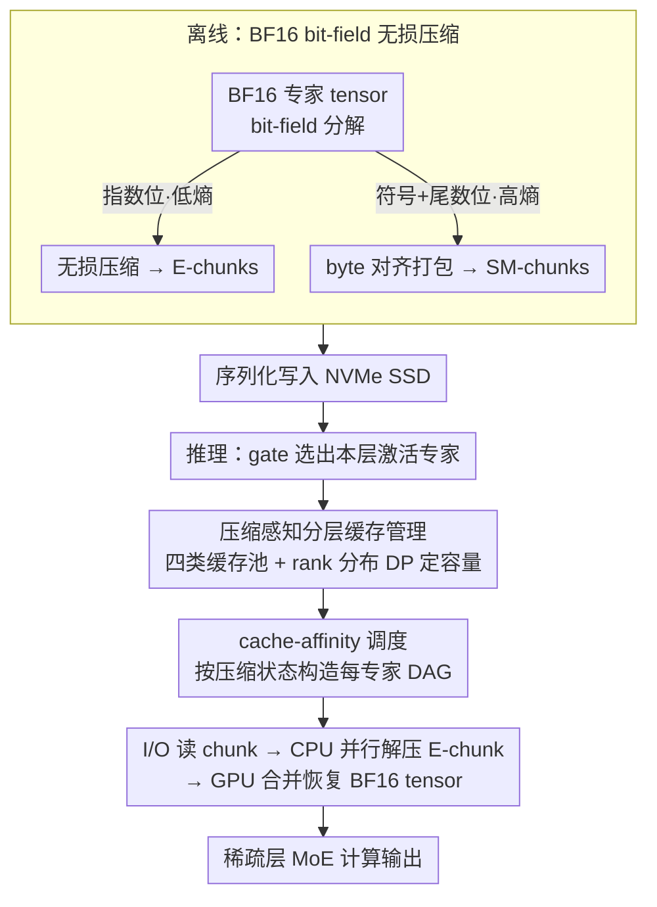

# ZipMoE: Efficient On-Device MoE Serving via Lossless Compression and Cache-Affinity Scheduling

**会议**: ICML2026  
**arXiv**: [2601.21198](https://arxiv.org/abs/2601.21198)  
**代码**: https://github.com/npnothard/ZipMoE-ICML26  
**领域**: 模型压缩 / LLM 系统 / 边缘推理  
**关键词**: MoE 推理, 无损压缩, 边缘部署, 缓存调度, 统一内存架构  

## 一句话总结
ZipMoE 面向移动和边缘设备上的 MoE 大模型推理，把 BF16 专家参数拆成可压缩的 exponent bits 与高熵 sign-mantissa bits，通过无损压缩、分层缓存和 cache-affinity 调度，把原本受 SSD I/O 卡住的专家加载改造成可被多核 CPU 并行隐藏的解压与重组流程，在不改模型语义的前提下降低延迟并提升吞吐。

## 研究背景与动机
**领域现状**：MoE 语言模型通过“每个 token 只激活少数专家”的稀疏计算扩展模型容量，但部署时仍要保存大量专家参数。云端或服务器上通常依赖 CPU 内存/SSD offloading、专家缓存、预取和流水线，把专家从低层存储搬到 GPU；边缘设备上则希望把模型留在本地，以获得隐私、低网络依赖和交互式响应。

**现有痛点**：边缘平台的约束和服务器很不一样。Jetson、移动 SoC、Apple Silicon 等设备通常采用 CPU/GPU 共享物理内存的 UMA 架构，DRAM 容量有限，专家经常需要从 NVMe SSD 读取；交互式应用又大多是 batch size 1，难以靠大 batch 或长流水线摊平 I/O。论文的测量显示，从服务器环境迁到边缘环境后，MoE 解码层中的 I/O stall 可从 38.5% 上升到 80.1%，计算资源反而大量空闲。

**核心矛盾**：模型压缩能减少内存占用，但常见量化和剪枝会改变模型行为；对安全敏感、无人监控的端侧部署而言，仅用 perplexity 或 zero-shot accuracy 证明“差不多”并不够。另一方面，完全不改参数又会被专家加载 I/O 限制。本文要解决的是“既保持算法行为完全一致，又让端侧 MoE 不被 I/O 拖死”的系统矛盾。

**本文目标**：作者把问题拆成三个子问题：如何从 MoE 参数中找到不会损失信息的可压缩结构；如何在统一内存和多核 CPU 上把解压成本隐藏到 I/O 之后；如何在有限内存预算下决定缓存完整 tensor、压缩块还是部分 bit-field，并调度这些专家请求。

**切入角度**：关键观察来自 BF16 参数的 bit-field 分布。sign 和 mantissa bits 接近随机，压缩收益有限；exponent bits 的符号分布却高度偏斜，Shannon entropy 约 2.55-2.65 bits，实际压缩后模型大小可降到约 68%-74%。这说明 MoE 专家参数里存在统计冗余，而且可以用无损方式利用。

**核心 idea**：用 bit-field 级无损压缩和缓存-调度协同，把专家访问从“等待完整 tensor 读盘”改为“读一部分、并行解压一部分、再快速恢复 BF16 tensor”。

## 方法详解
ZipMoE 是一个端侧 MoE serving 系统，而不是新的 MoE 模型。它的设计重点是把专家参数在离线阶段拆分、压缩、序列化，在在线推理阶段根据 gate 选出的专家构造细粒度任务 DAG，并把 SSD I/O、CPU 解压和 GPU tensor recovery 交错执行。

### 整体框架
系统分为离线初始化和实时推理两阶段。

离线初始化时，ZipMoE 对每个 BF16 专家 tensor 做 bit-field decomposition：exponent bits 被切成多个 shard 后用 LZ4/LZ4HC/ZSTD 这类无损 compressor 压成 E-chunks；sign 和 mantissa bits 被打包为 byte-aligned 的 SM-chunks。所有块和元数据被写成二进制文件并放到 NVMe SSD。因为这个过程是无损的，恢复出的 BF16 tensor 与原模型参数一致。

实时推理时，模型 gate 先给出当前 sparse MoE layer 需要访问的专家。ZipMoE 的 cache manager 决定不同压缩状态的缓存容量，scheduler 为每个专家 tensor 构造 DAG：可能需要读 SM-chunk、读压缩 E-chunk、CPU 解压 E-chunk，再用 GPU kernel 把两部分重新拼成 BF16 tensor。执行上有一个 I/O 线程、一组 CPU worker threads 和 CUDA stream；目标是在 sparse layer 内尽量隐藏 I/O 和解压，让 GPU 等待时间最小。

### 关键设计

**1. BF16 bit-field 无损压缩：用表示冗余而非数值近似来省 I/O**

量化能省内存却会改变模型行为，对无人监控的端侧安全场景不可接受；可完整保参数的 offloading 又被 SSD 读盘卡死。ZipMoE 的切入点是 BF16 表示本身存在冗余：把每个参数的 sign、exponent、mantissa 三段拆开后，exponent bits 分布高度偏斜、Shannon entropy 只有约 2.55-2.65 bits，分成多个 shard 后可用 LZ4/LZ4HC/ZSTD 这类无损 compressor 压成 E-chunks；而 sign 与 mantissa 近似高熵、压不动，就直接 byte 对齐打包成 SM-chunks。推理时只需解压 E-chunks 再与 SM-chunks 逐位合并，即可还原与原模型完全一致的 BF16 值，离线后模型体积降到约 68%-74%。因为它利用的是“表示冗余”而不是“模型可近似”，整个过程无损、行为零漂移，这正是它区别于量化/剪枝的关键。

**2. 压缩感知的分层缓存管理：在固定预算下决定缓存哪种粒度**

同一个专家可以以多种粒度驻留内存——完整 tensor、压缩 tensor、只缓存 SM-chunk 或只缓存 E-chunk，而缓存到哪种粒度，直接决定推理时还要读多少盘、解多少压。ZipMoE 为此维护四类缓存池（完整 tensor 池、压缩 tensor 池、SM 专用池、E 专用池），用历史激活频率构造一个 rank-based activation distribution——按热度排名而非固定 expert id 建模，再用 Poisson-binomial 动态规划估计不同池划分下的命中组合概率，最后网格搜索出使期望 sparse-layer makespan 最小的池容量配置。这样建模的好处是：MoE 专家访问虽有 skew，但具体哪个专家热会随 prompt 漂移，按 rank 建模既吃到了长尾分布的红利，又不会把缓存策略绑死在某一个工作负载样本上。

**3. Compression state 与 cache-affinity 调度：让 I/O、CPU、GPU 同时被喂饱**

端侧真正的瓶颈不是单个操作慢，而是 I/O 线程、CPU 多核、GPU 三者没被同时利用——测量显示 I/O stall 可占解码时间的 80.1%，算力大量空闲。ZipMoE 把“某专家当前缓存了哪些组件”抽象成 compression state（E-expert、SM-expert、compressed-expert、full tensor 等），据此为每个专家生成不同的执行 DAG；调度时把任务分成需要读 SM-chunk 的 Type-I 与 SM 已命中的 Type-II，按预计执行时间排序成 block——先用 Type-I 的读盘任务占住 I/O 线程，再插入 Type-II 的解压任务填满 CPU worker，让 exponent 解压恰好藏在读盘之后。论文证明该调度的 makespan 满足 $ALG \le (3 - 1/L) \cdot OPT$（$L$ 为解压线程数）。正是这种把缓存状态显式建模成 DAG 的做法，让系统能判断哪些任务可“贴着命中路径”执行、哪些解压能被 I/O 掩盖，从而把专家加载从 I/O-bound 拉成 compute-parallel。

### 损失函数 / 训练策略
本文没有训练新模型，也不引入额外损失函数。ZipMoE 的“优化目标”是系统层面的 sparse layer makespan 和端到端推理延迟。离线阶段只做无损参数重编码；在线阶段通过 cache partition planning 和 scheduling 最小化预期执行时间。实验中的模型均直接来自 Hugging Face，没有修改权重。

## 实验关键数据

### 主实验
实验覆盖 DeepSeekV2-Lite、Qwen1.5-MoE 和 SwitchTransformers-Large-128，硬件为 Jetson AGX Orin 64GB/32GB，baseline 包括 MoE-Infinity、DeepSpeed ZeRO-3 offloading 和 Accelerate。作者报告了 TTFT、TPOT、吞吐和端到端延迟，核心结论是 ZipMoE 在必须 offload 的端侧内存预算下稳定领先。

| 场景 | 指标 | ZipMoE 相对 baseline 的结果 | 对比对象 | 说明 |
|------|------|-----------------------------|----------|------|
| Decoder-only MoE 交互式推理 | TPOT | 降低 62.65%-97.97% | MoE-Infinity / DeepSpeed / Accelerate | 输出 token 过程中的实时响应明显改善 |
| Decoder-only MoE 交互式推理 | TTFT | 降低 53.25%-87.90% | 同上 | 首 token 等待时间显著缩短 |
| Encoder-decoder MoE | TPOT | 降低 4.99%-81.24% | 同上 | 专家激活更偏斜，收益较小但仍存在 |
| Batch inference | Throughput | decoder-only 提升 1.79x-42.49x，encoder-decoder 提升 1.31x-5.82x | 同上 | batch 越大，每层激活专家越多，调度并行性越明显 |
| End-to-end generation | Latency | decoder-only 加速 3.03x-42.49x，encoder-decoder 加速 1.11x-5.64x | 同上 | 不同输出长度下均保持优势 |

### 消融实验
论文把缓存策略拆开看，比较基础 eviction、异构 cache pool、cache planning 的贡献。下表摘取 Table 1 的吞吐与端到端时间分解。

| 模型 | 配置 | Throughput (tokens/s) | E2E (s) | 说明 |
|------|------|------------------------|---------|------|
| DeepSeekV2-Lite 16B | Baseline | 1.60 | 585.96 | offloading baseline |
| DeepSeekV2-Lite 16B | ZipMoE avg. basic | 4.43 | 204.05 | 仅用基础缓存策略时已获得主要收益 |
| DeepSeekV2-Lite 16B | ZipMoE +C | 5.18 | 176.68 | 加入异构 cache pool 后继续提升 |
| DeepSeekV2-Lite 16B | ZipMoE +C+P | 5.30 | 173.23 | 加入 cache planning 后达到最好 Pareto 点 |
| Qwen1.5-MoE 14B | Baseline | 1.99 | 515.12 | offloading baseline |
| Qwen1.5-MoE 14B | ZipMoE avg. basic | 6.39 | 160.33 | 核心解压与调度贡献最大 |
| Qwen1.5-MoE 14B | ZipMoE +C | 7.64 | 134.10 | 分层缓存带来明显吞吐提升 |
| Qwen1.5-MoE 14B | ZipMoE +C+P | 7.79 | 未在缓存片段中完整显示 | planning 提供额外但较小收益 |

### 关键发现
- 主要收益来自范式切换：用无损压缩减少读盘，再用 CPU 并行解压把专家加载从 I/O-bound 拉向 compute-parallel。作者估计核心系统约贡献 76% 的总吞吐增益，cache management 约贡献剩余 24%。
- OS page cache 是额外收益而非唯一来源。即使人为占用 32GB RAM，几乎不给 page cache 留空间，ZipMoE 仍能相对 baseline 降低 56.64% TTFT 和 53.32% TPOT，并保留 66.7%-74.4% 的原始性能优势。
- Encoder-decoder MoE 的收益弱于 decoder-only MoE，因为专家激活更偏斜、I/O 密集程度较低；这说明 ZipMoE 最适合“专家多、内存不够、I/O 占主导”的端侧大模型场景。

## 亮点与洞察
- 最巧妙的点是没有把“压缩”理解成量化，而是回到 BF16 表示本身找无损冗余。这样既能减少端侧 I/O，又避免因低比特近似引入潜在安全行为漂移。
- Compression state 这个抽象很实用：它把“某个专家缓存了一部分参数”从实现细节提升为调度对象，使系统能精确区分 full hit、partial hit 和 miss，并为每种状态生成不同 DAG。
- 论文抓住了端侧 SoC 的一个反直觉机会：CPU 平时被 I/O stall 闲置，但多核解压能力足以隐藏 exponent 恢复成本。这个思路可迁移到其他稀疏模型、adapter bank 或检索式参数库，只要参数访问有低熵部分和稀疏激活模式。

## 局限与展望
- 评测硬件主要是 NVIDIA Jetson AGX Orin。虽然作者讨论了可推广到其他 shared-memory 平台，但手机 NPU、Apple Neural Engine 或独立 CPU/GPU 内存架构上的真实表现仍需要验证。
- 方法依赖 BF16 bit-field 的低熵 exponent 分布。如果未来模型使用不同数值格式，或参数分布被训练过程改变，压缩率和调度收益可能下降。
- ZipMoE 当前关注推理时专家参数访问，对 prefill 阶段、KV cache 压力、多应用并发调度和能耗指标讨论较少。端侧部署中，功耗和热限制可能和 latency 同样关键。
- Cache planning 需要历史激活统计来建模 rank distribution。对于高度非平稳、频繁换任务的个人助手场景，如何快速自适应仍是后续问题。

## 相关工作与启发
- **vs 量化/剪枝 MoE 系统**: 量化和剪枝通过近似参数或结构来减小模型，ZipMoE 保留原始 BF16 语义，只改变存储与执行路径；优势是行为一致性更强，劣势是压缩上限受无损冗余限制。
- **vs MoE-Infinity / MoELightning / Klotski**: 这些系统主要围绕 offloading、prefetch 和流水线隐藏 I/O，ZipMoE 则针对端侧 UMA + SSD 场景，把专家参数拆成可并行恢复的块，避免把服务器假设直接搬到移动设备上。
- **vs DFloat11 / HuffLLM / nvCOMP 类无损压缩**: 这些方法证明无损压缩能服务 LLM 推理，但通常不面向 MoE 的条件激活和端侧 AArch64 CPU。ZipMoE 的差异在于把 compressor、partial cache 和专家调度合成一个系统。

## 评分
- 新颖性: ⭐⭐⭐⭐☆ 把 BF16 bit-field 无损压缩和 MoE cache-affinity scheduling 结合得很完整，系统视角新颖。
- 实验充分度: ⭐⭐⭐⭐☆ 覆盖多模型、多硬件预算和主要 baseline，也做了缓存消融；如果有更多移动 SoC/手机平台和能耗评测会更强。
- 写作质量: ⭐⭐⭐⭐☆ 动机测量清楚，系统组件和理论保证都有交代，但部分表格信息依赖图示，阅读时需要在图表间来回对照。
- 价值: ⭐⭐⭐⭐⭐ 对端侧 MoE serving 很有实用价值，尤其适合不愿用有损量化换速度的安全敏感场景。

<!-- RELATED:START -->

## 相关论文

- [\[ICML 2026\] RQ-MoE: Residual Quantization via Mixture of Experts for Efficient Input-Dependent Vector Compression](rq-moe_residual_quantization_via_mixture_of_experts_for_efficient_input-dependen.md)
- [\[ACL 2026\] The Pitfalls of KV Cache Compression](../../ACL2026/model_compression/the_pitfalls_of_kv_cache_compression.md)
- [\[ICML 2026\] Breaking the MoE LLM Trilemma: Dynamic Expert Clustering with Structured Compression](breaking_the_moe_llm_trilemma_dynamic_expert_clustering_with_structured_compress.md)
- [\[ICML 2026\] xKV: Cross-Layer KV-Cache Compression via Aligned Singular Vector Extraction](xkv_cross-layer_kv-cache_compression_via_aligned_singular_vector_extraction.md)
- [\[ICML 2026\] Semantic Integrity Matters: Benchmarking and Preserving High-Density Reasoning in KV Cache Compression](semantic_integrity_matters_benchmarking_and_preserving_high-density_reasoning_in.md)

<!-- RELATED:END -->
