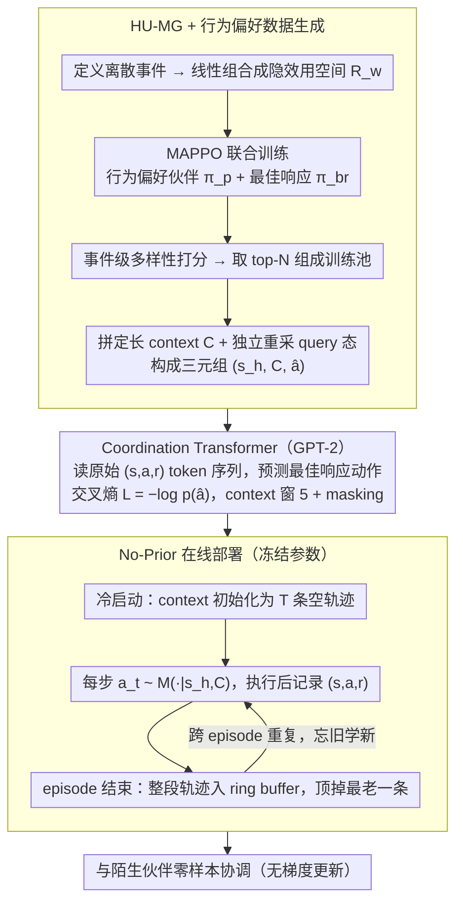

# CoOT: Learning to Coordinate In-Context with Coordination Transformers

**会议**: ICML 2026  
**arXiv**: [2506.23549](https://arxiv.org/abs/2506.23549)  
**代码**: https://coot-project.github.io/coot/ (有 demo)  
**领域**: 多智能体强化学习 / 协同 / 上下文学习  
**关键词**: 即兴协作, 上下文学习, Decision Transformer, 隐效用马可夫博弈, 零样本协调  

## 一句话总结
把"如何与陌生伙伴协作"从 task-generalization 改写成 partner-generalization 的 in-context 学习问题：训练一个 Decision Transformer 在跨 episode 的交互轨迹上预测最佳响应动作，让模型不更新参数就能在几局之内适应任何未见过的伙伴。

## 研究背景与动机

**领域现状**：多智能体强化学习里"和不认识的人配合"被称为 ad-hoc teamwork（AHT）或 zero-shot coordination（ZSC），主流做法分三类——self-play（SP）训出固定 convention；population-based（HSP、MEP）用多样化伙伴池训一个 recurrent policy；context-based meta-RL（PACE、PECAN、LIAM）用编码器把近期轨迹压成 latent 喂给 policy。

**现有痛点**：SP 收敛到自己的 convention，遇到 convention 不同的伙伴直接崩；population-based 方法泛化能力依然受训练伙伴池覆盖度限制，遇到分布外伙伴掉点严重；fine-tuning 在线适配需要数千到上百万次交互，few-shot 场景下完全不可行；context-based meta-RL 把交互压成 fixed latent，丢掉了时序结构、对未见伙伴常常给出误导性表示，PACE/PECAN 甚至跑不过 vanilla HSP。

**核心矛盾**：协调的本质是"在线推断伙伴的隐藏偏好/策略"，但现有 paradigm 都把这件事压在训练阶段或 latent bottleneck 里，没人真的让模型在 test time 看着完整的原始轨迹做推断。

**本文目标**：(1) 找到一个不需要梯度更新、也不依赖 latent 压缩的 partner-adaptation 机制；(2) 在 Overcooked 与 GRF 这种真协调场景里证明"少量交互"就够。

**切入角度**：把 in-context learning（ICL）从语言/任务泛化迁移到 partner 泛化——既然 transformer 在 prompt 里见过几个示例就能跨任务推断，那它应该也能在 prompt 里见过几个 episode 就能跨伙伴推断最佳响应。

**核心 idea**：用 best-response 行为做监督信号，训练一个 Decision-Pretrained Transformer 在"过去 T 个 episode 的完整轨迹 + 当前 query state"上直接预测最佳响应动作，让 partner-adaptation 完全发生在 forward pass 里。

## 方法详解

### 整体框架
CoOT 想解决的是"如何不更新参数就能和陌生伙伴配合"。它把协调问题写成 Hidden-Utility Markov Game（HU-MG）$(\mathcal{S},\mathcal{A},\mathcal{T},R_t,\mathcal{R}_w)$：环境奖励 $R_t$ 共享，但每个伙伴 $\pi^p_i$ 私有一个"隐效用" $r^w_i\sim\mathcal{R}_w$，不同 $r^w_i$ 在同一环境里诱导出截然不同的行为偏好。整体流程是：训练阶段为大量行为各异的伙伴各自跑出对应的最佳响应轨迹，喂给一个 Decision Transformer 学"看过去几局交互就能预测该如何最佳响应"；部署阶段冻结参数，靠不断追加的交互历史在 forward pass 里完成 partner 适应。

### 关键设计

**1. HU-MG + Behavior-Preferring 数据生成：让训练池里的伙伴既行为多样、又自带最佳响应标签**

ICL 要泛化到陌生伙伴，前提是训练时见过的伙伴行为光谱足够宽，而且每个伙伴都得有一个干净的监督信号可以对照。作者先定义一组离散环境事件，用事件特征的线性组合写出 reward space $\mathcal{R}_w$；对每个采样到的隐效用 $r^w_i$ 用 MAPPO 联合训练一个 behavior-preferring partner $\pi^p_i$ 和它的最佳响应 $\pi^{br}_i$，这样最佳响应天然就是 partner-specific 的 oracle，监督信号比 RL 稀疏奖励干净得多。为保证多样性，对所有 $\pi^{br}_i$ 计算事件级 diversity score $d_i$，挑 top-N 多样 pair 组成训练池 $\Pi_{train}$。关键的一个细节是：每个 pair 采 $T$ 条轨迹拼成定长 context $C$ 之后，query state $s_h$ 要**独立**重采，构成三元组 $(s_h, C, \hat{a})$——否则模型会退化成简单的轨迹续写，而不是真的从 context 推断 partner。

**2. Coordination Transformer：让 GPT-2 直接读原始 $(s,a,r)$ token 序列，而不是压成 latent**

context-based meta-RL 的通病是把交互压成 fixed latent，丢掉协调最关键的时序结构。CoOT 反其道而行：把上下文展平成 token 序列 $[\tau_1, \tau_2, \ldots, \tau_T, s_{query}]$（每个 $\tau$ 是一整段 episode 的 $(s,a,r)$ 序列），在最后位置预测动作分布 $\hat{p}_h(\cdot)=M_\theta(\cdot\mid s_h, C)$，训练目标就是匹配最佳响应动作的交叉熵 $\mathcal{L} = -\log \hat{p}_h(\hat{a})$，其中 $\hat{a}=\pi^{br}_i(s_h)$。context window 设为 5 个 episode，训练时做 context masking 鼓励模型依赖近端轨迹。让 transformer 直接 attention 原始 token，保留了 PEARL/PACE 那种 reconstruction loss 会抹平的细节——后者给所有 feature 等权，coordination-irrelevant 的噪声反而主导了 latent。

**3. No-Prior Online Deployment：冷启动 + ring buffer，逼模型只靠"当下"的交互适应**

部署是协调能力的硬考试，任何 retrieval 或预填 context 都会让数字虚高、掩盖真实泛化。CoOT 把 context $C$ 初始化为 $T$ 条空轨迹（strict cold start），每步用 $\hat{p}_t=M_\theta(\cdot\mid s_h, C)$ 采样动作 $a_t\sim\hat{p}_t$，执行后记录 $(s_t, a_t, r_t)$；episode 结束时把完整轨迹 $\tau=(s_t, a_t, r_t)_{t=1}^Z$ 追加进 context buffer 并**顶掉最老的一条**。用 ring buffer 而非无限 append，是因为 partner 可能中途换 style，老 episode 反而误导——只有让 context 始终反映 partner 的**当前**行为，模型才能"忘旧学新"。

### 训练与评测策略
CoOT 用 GPT-2 backbone，36 个 best-response 策略（每个对应一个 behavior-preferring HSP 训练分布的 partner）产出轨迹做监督训练，仅用 best-response 轨迹（partner 轨迹不直接监督）。评测协议沿用 Wang et al. 2024：每个 layout 用 10 个评测 partner（Coord. Ring Multi-recipe 用 15 个），用 Best-Response Diversity（BR-div，best-response 相似矩阵的行列式）选 diverse 子集；每个 partner 跑 50 episode，CoOT 跨 episode 不断追加 context。

## 实验关键数据

### 主实验

Overcooked 五个 layout 的 Return 与 Best-Response Proximity（BR-prox = 智能体回报 / 最佳响应回报）：

| 方法 | Coord. Ring | Coord. Ring Multi-recipe | Counter Circ. | Asymm. Adv. | Bothway Coord. | Overall Return | Overall BR-prox |
|------|-------------|--------------------------|----------------|-------------|----------------|----------------|------------------|
| BC | 26.24 / 0.31 | 8.97 / 0.10 | 10.79 / 0.11 | 108.83 / 0.53 | 98.99 / 0.94 | 50.76 | 0.40 |
| BC-RNN | 28.07 / 0.33 | 21.98 / 0.25 | 15.15 / 0.14 | 105.52 / 0.51 | 93.59 / 0.91 | 52.86 | 0.42 |
| MEP | 40.30 / 0.47 | 16.64 / 0.19 | 1.89 / 0.02 | 127.44 / 0.61 | 22.76 / 0.20 | 41.81 | 0.30 |
| HSP | 41.10 / 0.49 | 29.35 / 0.33 | 21.37 / 0.23 | 134.01 / 0.63 | 54.99 / 0.53 | 56.16 | 0.44 |
| HSP-ft | 41.30 / 0.49 | 29.24 / 0.33 | 21.71 / 0.22 | 133.59 / 0.63 | 55.81 / 0.54 | 56.33 | 0.44 |
| HSP-meta | 29.84 / 0.35 | 30.21 / 0.34 | 3.28 / 0.03 | 113.16 / 0.54 | 20.44 / 0.20 | 40.19 | 0.29 |
| PACE | 33.94 / 0.40 | 4.43 / 0.05 | 2.41 / 0.02 | 124.06 / 0.59 | 14.90 / 0.15 | 35.95 | 0.24 |
| **CoOT** | 38.30 / 0.47 | **45.96 / 0.50** | **28.28 / 0.30** | 129.48 / 0.62 | **101.93 / 0.96** | **68.79** | **0.57** |

CoOT 在协调密集的 Coord. Ring Multi-recipe 上把第二名（HSP-meta 30.21）拉到 45.96，Overall BR-prox 从最强基线的 0.44 提到 0.57（+30%）。

### 受控实验：GRF 3v1 与人评

| 实验 | 指标 | BC | MEP | HSP | HSP-ft | **CoOT** |
|------|------|----|-----|-----|--------|-----------|
| GRF 3v1（goal rate / 200 步） | 进球率 ↑ | 1.97 | 1.11 | 1.46 | 1.52 | **2.50** |
| 人评（36 参与者）— Return | ↑ | 51.0 | 53.0 | 40.5 | — | **63.5** |
| 人评 — Collaboration | ↑ | 2.0 | 3.4 | 2.7 | — | **4.0** |
| 人评 — Adaptivity | ↑ | 1.8 | 2.9 | 2.2 | — | **3.1** |
| 人评 — Best Agent 投票（/36） | ↑ | 5 | 8 | 5 | — | **18** |

### 关键发现
- **Few-shot 适配速度**：图 2 显示 CoOT 在前 15 个 episode 内 BR-prox 显著上升并稳定，PACE 几乎没改进、HSP-meta 收敛到低位、HSP-ft 完全不动——证明"原始轨迹喂 transformer"比"latent + 梯度更新"在 few-shot 下都更管用。
- **非平稳适配**：partner 中途切换 style（Active / Still / Dish-averse 三两两组合）下 CoOT 平均 3.67 episode 内恢复到新 partner 的非切换基线性能，最多 6 episode；说明 context buffer ring 设计真的让模型"忘旧学新"。
- **Context length 5 是甜区**：context 越长信息越多，但 5 episode 之后旧轨迹反而误导（partner 行为已被 CoOT 适应改变）；context masking 仅能部分缓解，硬性 trade-off 仍在。
- **Compress to latent 是反 pattern**：HSP-meta 与 PACE 在 5 个 layout 平均都跑不过 vanilla HSP，PEARL-style reconstruction loss 等权处理所有 feature、把 coordination-relevant 信号淹没；用 transformer 在 raw token 上 attention 反而活下来。
- **数据多样性比数量更关键**：partner 数从 36 降到 12 时 CoOT 掉 24.0%、BC 掉 41.5%；trajectory 数减半 CoOT 掉 28.6%、BC 掉 32.1%——CoOT 对数据规模更鲁棒，归功于 ICL 的样本效率。

## 亮点与洞察
- **协调 = partner-generalization 而非 task-generalization** —— 这个 reframing 本身比方法更重要。把 DPT 从"跨任务"换到"跨 partner"几乎不改架构就拿到 SOTA，说明 ICL 在 RL 里的真正发力点可能一直被找错。
- **"看原始轨迹"打败"看 latent"** —— PACE / PECAN / LIAM 这条路线被实证证伪：fixed-size latent 会破坏 coordination 关键的时序信号。这给所有 meta-RL with encoder 路线敲了警钟。
- **HU-MG + best-response 监督是优雅的训练信号** —— 用 MAPPO 跑出来的 best-response 天然就是 partner-specific oracle，监督信号比 RL 稀疏奖励干净得多，训练完全可以走 SL 路线绕开 RL 不稳定问题。
- **人评 18/36 投 CoOT** —— 在 ad-hoc teamwork 论文里能拿出 IRB 通过的真人交互数据非常少见，加 N=144 的开放回答 + Gemini 做主题编码，把"是否真的更 adaptive"从主观直觉变成了可分析证据。

## 局限与展望
- 只有动作历史，没有显式通信 channel，所有"协调"完全靠行为推断；引入语言/手势通信是显然的扩展。
- 两个实验环境都是协调 benchmark，没真正考验 embodied 场景下的丰富感知与控制；机器人/真实多人协作还需要验证。
- Cold-start no-prior 协议虽然严格，但牺牲了实用性——如果允许从相似 partner 复用 context，前几 episode 的协调成本可显著降低。
- 只针对 cooperative shared-reward 设定，竞争/混合动机场景下 best-response 的定义本身就模糊，方法不能直接搬。
- 训练 partner pool（36 个 HSP-trained）仍然是 population-based 数据生成产物，CoOT 的 partner 多样性上限被这步限制。

## 相关工作与启发
- **vs HSP / MEP（population-based）**: 都用同一个 HSP 伙伴池，区别仅在学习范式——recurrent policy + 共享奖励训练 vs transformer + best-response 监督；CoOT 在多 layout 平均 +12 return，说明 paradigm shift 才是关键，不是更多数据。
- **vs PACE / PEARL-style meta-RL**: PACE 在 latent 上挂 peer identifier 反而比 vanilla HSP 还差；CoOT 拒绝任何 encoder bottleneck，直接 attention raw trajectory。
- **vs Decision-Pretrained Transformer (DPT)**: 共享 GPT-2 架构与"context+query state"形式，但目标从"跨任务 best response"换成"跨 partner best response"，监督信号也从 reward 驱动改成 best-response 动作驱动。
- **vs Algorithm Distillation / In-Context RL**: 同样把 RL 改成 sequence modeling，但 AD 蒸馏的是"学习算法"，CoOT 蒸馏的是"对 partner 行为的反应能力"——后者在 ad-hoc teamwork 里更直接。

## 评分
- 新颖性: ⭐⭐⭐⭐ 把 ICL 从 task-generalization 迁到 partner-generalization 是简洁但重要的 reframing，方法本身改动不大但视角全新。
- 实验充分度: ⭐⭐⭐⭐⭐ 5 layout × 7 baseline × 3 seed + GRF + 36 人 IRB 人评 + few-shot 适配 + 非平稳切换 + 数据/context ablation，几乎把能问的问题都问了。
- 写作质量: ⭐⭐⭐⭐ Method 部分清晰，HU-MG 形式化干净；HSP-meta 不如 HSP 这种反直觉结果有专门的失败分析。
- 价值: ⭐⭐⭐⭐ 给 human-AI 协作提供了真正可即插即用的方案（无需 fine-tune），人评结果让"AI 队友"的工业落地更可信。

## 评分
- 新颖性: 待评
- 实验充分度: 待评
- 写作质量: 待评
- 价值: 待评

<!-- RELATED:START -->

## 相关论文

- [\[ICML 2026\] Sheaf-ADMM: Learning Multi-Agent Coordination via Sheaf-ADMM](learning_multi-agent_coordination_via_sheaf-admm.md)
- [\[NeurIPS 2025\] The PokeAgent Challenge: Competitive and Long-Context Learning at Scale](../../NeurIPS2025/multi_agent/the_pokeagent_challenge_competitive_and_long-context_learning_at_scale.md)
- [\[ICML 2026\] E-mem: Multi-Agent Based Episodic Context Reconstruction for LLM Agent Memory](e-mem_multi-agent_based_episodic_context_reconstruction_for_llm_agent_memory.md)
- [\[AAAI 2026\] Conversational Learning Diagnosis via Reasoning Multi-Turn Interactive Learning](../../AAAI2026/multi_agent/conversational_learning_diagnosis_via_reasoning_multi-turn_interactive_learning.md)
- [\[ICML 2026\] EngiAgent: Fully Connected Coordination of LLM Agents for Solving Open-ended Engineering Problems with Feasible Solutions](engiagent_fully_connected_coordination_of_llm_agents_for_solving_open-ended_engi.md)

<!-- RELATED:END -->
