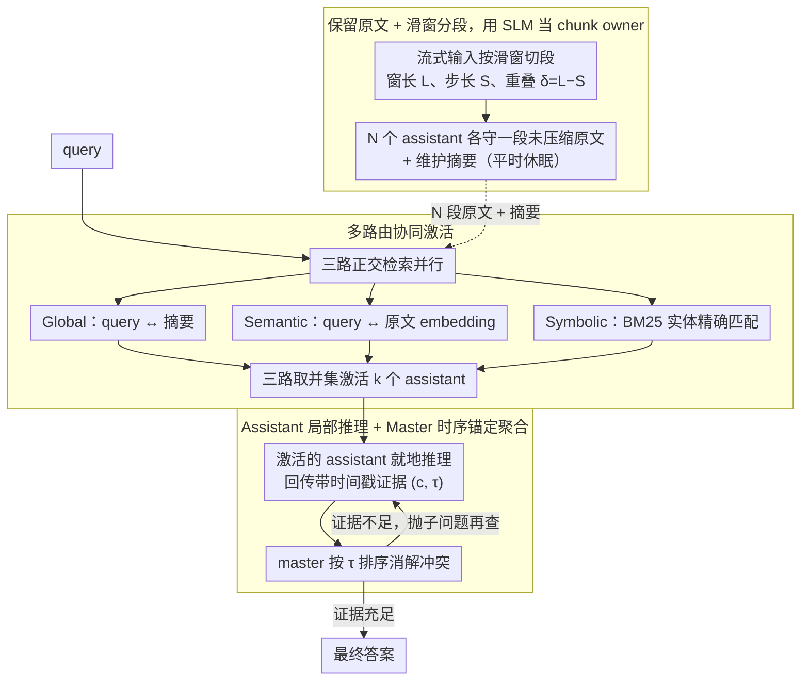

# E-mem: Multi-Agent Based Episodic Context Reconstruction for LLM Agent Memory

**会议**: ICML 2026  
**arXiv**: [2601.21714](https://arxiv.org/abs/2601.21714)  
**代码**: https://github.com/dog-last/E-mem  
**领域**: LLM Agent / 长上下文记忆 / 多智能体系统  
**关键词**: 情景记忆、上下文重构、Master-Assistant 架构、SLM 助手、LoCoMo

## 一句话总结
E-mem 把"预处理压缩成嵌入/图"的传统记忆范式改成"保留原始上下文 + 小模型助手就地推理"的情景重构范式：master agent 只做全局规划，多个 SLM assistant 各自守着一段未压缩的原文，按多路由检索激活后再做局部推理回传证据，在 LoCoMo 上 F1 反超 SOTA 7.75 个点的同时把 token 消耗砍掉 70%。

## 研究背景与动机

**领域现状**：长程 LLM agent 普遍把历史会话先做"预处理"再存起来——常见做法是切 chunk 算 embedding（RAG）、抽实体建图（GraphRAG / GAM）、或者用 OS 风格的分页（MemGPT），查询时再 retrieve 出 top-k 片段拼到 prompt 里。

**现有痛点**：作者称这类做法是 "destructive de-contextualization"——把一连串紧密耦合的事件压成几何点或图节点后，序列依赖被切断了。具体表现是在 LoCoMo 这种多 session 长对话基准上，多跳和时序问题很难答对，因为 chunk 之间的因果链已经丢了；A-Mem、Mem0、MemoryOS 这些 2024-25 的方法在 LoCoMo 上 F1 都卡在 36-45 之间上不去。

**核心矛盾**：(1) 想做深度 System 2 推理必须保留长程因果链；(2) 直接把全历史塞进上下文窗口会触发 "Lost-in-the-Middle"，而且 token 成本爆炸；(3) 预处理虽然便宜，但天然破坏了 (1) 需要的上下文完整性。三者之间是 trade-off。

**本文目标**：在不放弃成本可扩展性的前提下，让 agent 真正能"重新经历"过去的片段，而不是只检索碎片。

**切入角度**：作者类比生物 engram（神经印记）——人脑回忆不是查索引，而是激活整段情景上下文再做推理。如果让一个小模型专门守着一段原文不动，并在被激活时就地做局部推理，就能保留序列依赖又控制成本。

**核心 idea**：用 "master agent 规划 + 多个 SLM assistant 守原文 + 多路由按需激活 + assistant 就地推理回传证据" 的层级架构替代"统一压缩存储 + 检索"的范式。

## 方法详解

### 整体框架
E-mem 想做的是：在不预处理压缩历史的前提下，让 agent 能"重新经历"过去的片段做深度推理，又不爆 token。它把记忆系统形式化成三元组 $\mathcal{F}=\langle\mathcal{A}_{\text{master}},\{\mathcal{A}_{\text{asst}}^{(i)}\}_{i=1}^{N},\mathcal{R}\rangle$：一个 master agent（GPT-4o-mini / Qwen2.5-14B）只做全局规划、自己不碰原始历史；一群 assistant（Qwen3-4B SLM）每人守一段未压缩的原文 $\mathcal{E}_i$ 并维护一份精简摘要 $s_i$ 作路由特征；一个 multi-pathway router $\mathcal{R}$ 在 query 到来时输出激活分布 $\mathcal{P}_{act}=\pi(q|\mathbf{S},\mathcal{R})\in[0,1]^N$ 决定唤醒谁。整条链路是：流式输入按滑窗切成 N 段、每段交给一个 assistant 存着 → query 进来时 router 并行跑三路检索取并集激活若干 assistant → 被激活的 assistant 各自在自己那段原文上做局部推理、回传带时间戳的证据 → master 聚合证据、按时间消解冲突后给出答案。

### 关键设计

**1. 保留原文 + 滑窗分段，用 SLM 当 chunk owner：把"压缩存储"换成"原文托管"**

传统方法把 chunk 嵌成一个向量，本质是因为"算不动这么多 chunk 一起推理"，于是只能先压缩、查询时再 retrieve top-k 拼回去——序列依赖在这一步就断了。E-mem 直接绕开这个瓶颈：把无界流 $\mathcal{X}=(x_1,x_2,\dots)$ 按窗口长度 $L$、步长 $S<L$ 切成 $\mathcal{E}_i=\{x_t\mid(i-1)S<t\leq(i-1)S+L\}$，每段是**原始未压缩 token**，由一个独立 SLM assistant 持有；平时 assistant 处于 dormant 状态，只在被激活时才"上线"推理。相邻段保留重叠 $\delta=L-S$ 作连续性缓冲区——新 token 直接 append 到当前 active assistant 的 $\mathcal{E}_{\text{active}}$，写满后凝固成一个 memory unit，新开 assistant 时从前一段切走 overlap 区作种子（$\mathcal{E}_{N+1}^{init}=\text{Extract}(\mathcal{E}_N,\text{overlap}=\delta)$），保证跨段语义不断裂。这样存储侧仍是完整原文、推理被分摊到许多小模型上，整体是 $O(1)$ 流式更新，既保住了 System 2 推理需要的长程因果链，又没把全历史塞进单个上下文窗口。

**2. 多路由协同激活：三条正交检索通路取并集，用召回率换准确率**

单一路由在 LoCoMo 这种"多跳 + 时序 + 实体精确召回"混合的基准上必然顾此失彼——纯 vector 漏实体、纯 graph 漏宏观意图。E-mem 并行跑三条正交通路再取并集 $\mathcal{A}^*=\{\mathcal{A}_{\text{asst}}^{(i)}\mid\mathcal{A}_{\text{asst}}^{(i)}\in\mathcal{P}_{\text{global}}\vee\mathcal{P}_{\text{vec}}\vee\mathcal{P}_{\text{kw}}\}$：Global Alignment $\mathcal{P}_{\text{global}}$ 让 query 与摘要 $s_i$ 做稠密向量 + 稀疏词法对齐，相当于高通滤波捕获宏观叙事意图；Semantic Association $\mathcal{P}_{\text{vec}}$ 让 query 与原文 chunk embedding 做高维向量相似度，兜底"摘要漏掉的细节"；Symbolic Trigger $\mathcal{P}_{\text{kw}}$ 用 BM25 做实体/ID 精确匹配，保证关键名字、编号不会因为被摘要丢掉而错过激活。三路并集只是在 router 阶段多算几次轻量检索，而漏召一旦发生后面整个推理就废了——所以作者宁可多激活几个 assistant 也不做加权融合，明显是用召回率换准确率。

**3. Assistant 局部推理 + Master 时序锚定聚合：证据自带时间戳才能跨段消解冲突**

被激活的 assistant 不是"回传原文片段"，而是直接在自己那段 $\mathcal{E}_i$ 上做完整 chain-of-thought 局部推理，把 raw text 转成**带时间戳的证据 tuple** $e_i=\langle c_i,\tau_i\rangle=\Phi_{\text{asst}}(q\mid\mathcal{E}_i)$，其中 $c_i$ 是推理出的语义证据、$\tau_i$ 是对应事件的绝对时间戳。master 收齐所有 $\{e_i\}$ 后通过 $R=\Psi_{\text{master}}(q,\mathbf{E})$ 聚合，关键是**按 $\tau$ 排序解决状态冲突**——比如同一物品的位置前后变动，就取最近 timestamp 的那条。难题还支持 iterative 模式：master 维护推理 trace $S^{(t)}$，发现证据不够就 $q^{(t)}=\pi_{\text{plan}}(q_{\text{init}},S^{(t-1)})$ 抛新子问题给 assistant。让 SLM 在"小段 + 完整原文"上推理比让大模型在"全部原文拼起来"上推理更可控、token 更省，而正是这个 $\tau$ 让 master 第一次有能力做跨段时序冲突消解——这是 multi-hop / temporal 子任务大涨的根因。

### 一个完整示例
以一个时序问题"Alice 现在的手机型号是什么？"为例（历史里她换过两次机）：原始对话被滑窗切成若干段，分别托管在 assistant₁…assistant_N 上。query 进来后 router 三路并发——Global 通过摘要锁定"几段聊到手机"，Symbolic 用 BM25 命中含 "Alice"+"phone" 的精确段，Vector 兜底召回一段只提"换了新机却没点名 Alice"的隐含段；三路并集激活了 3 个 assistant。assistant₃ 就地推理回传 $\langle$"Alice 买了 iPhone 14"，$\tau{=}$2023-03$\rangle$，assistant₇ 回传 $\langle$"Alice 换成 Galaxy S24"，$\tau{=}$2024-01$\rangle$，assistant₅ 回传一条无时间戳的弱证据。master 收到后按 $\tau$ 排序，发现两条都讲手机但时间冲突，取最近的 2024-01，输出 "Galaxy S24"。如果 master 觉得证据链还差一环，就把"她 2024 之后有没有再换"作为 $q^{(1)}$ 再抛给 assistant 跑下一轮——直到 trace 足够下结论。

### 损失函数 / 训练策略
论文是**纯 inference-time 框架**，不训练任何模型。master 用 GPT-4o-mini / Qwen2.5-14B，assistant 用 Qwen3-0.6B/1.7B/4B/8B/14B，全部冻结直接 prompt。设计空间主要在路由超参（top-k、三路权重）和窗口大小 $L$、重叠 $\delta$ 上。

## 实验关键数据

### 主实验

LoCoMo 5 类子任务（GPT-4o-mini 作为 master，Qwen3-4B 作为 assistant）：

| 方法 | Overall F1 | Multi-Hop | Temporal | Single-Hop |
|------|-----------|-----------|----------|------------|
| RAG (top-20) | 44.73 | 27.50 | 46.07 | 52.45 |
| A-Mem | 39.65 | 27.02 | 45.85 | 44.65 |
| Mem0 | 45.10 | 38.72 | 48.93 | 47.65 |
| MemoryOS | 42.84 | 35.27 | 41.15 | 48.62 |
| GAM (前 SOTA) | 45.31 | 34.84 | 53.91 | 47.74 |
| **E-mem** | **54.17** | **42.64** | **59.82** | **59.23** |
| 相对 GAM 提升 | **+8.86** | **+7.80** | **+5.91** | **+11.49** |

HotpotQA 流式扩展（400/800/1600 docs，超 200K tokens）：

| 方法 | 400 F1 | 800 F1 | 1600 F1 |
|------|--------|--------|---------|
| Long-Context | 56.56 | 49.71 | 53.92 |
| GAM | 54.75 | 52.86 | 53.71 |
| **E-mem** | **61.46** | **55.46** | **55.76** |

### 消融实验

Assistant 模型规模消融（LoCoMo adversarial 子集，对抗性问题用于测幻觉）：

| Assistant 模型 | F1 | BLEU-1 |
|---------------|-----|--------|
| Qwen3-0.6B | 85.11 | 80.14 |
| Qwen3-1.7B | 87.31 | 83.17 |
| Qwen3-4B（默认）| 89.94 | 85.51 |
| Qwen3-8B | 95.74 | 88.09 |
| Qwen3-14B | 95.03 | 88.06 |

Master 模型替换（assistant 固定 Qwen3-4B）：Gemini2.5-flash 93.62, GPT-4o 89.37, GPT-4o-mini 89.94, DeepSeek-V3 75.87, Grok4-fast 77.80。

### 关键发现
- **Multi-hop 和 Temporal 是收益最大的子任务**：分别 +7.80 / +5.91 F1，正好对应作者的核心论点——保留原始上下文 + 时间戳锚定才能跨段串起因果链。
- **Open Domain 反而被 Mem0 反超**（24.89 vs 28.64）：开放生成更依赖摘要式的全局概括，E-mem 的"原文+局部推理"在这种发散问答上反而不占优。
- **Assistant 越大越好但收益递减**：从 0.6B 到 4B F1 涨 4.83 个点，4B 到 8B 再涨 5.80，但 8B 到 14B 反而微跌，说明 4B 是性价比甜区。
- **Token 成本省 70%+**：通过只激活相关的 k 个 assistant 而不是把全历史塞 master，单 query 的总 token 远低于 RAG / GraphRAG。

## 亮点与洞察
- **"小模型守原文 + 大模型做规划"是非常优雅的劳动分工**：传统 memory 系统要么"把所有重活给大模型"要么"把所有重活给压缩模块"，E-mem 把推理重活分摊到许多 SLM 上，第一次把"长上下文推理"做成了真正可水平扩展的多智能体问题。
- **带时间戳的证据 tuple 是隐藏的关键设计**：很多论文宣传"多路由检索"，但真正解决 LoCoMo Temporal 任务的是 $e_i=\langle c_i,\tau_i\rangle$ 这一对——没有 $\tau$ 就没法在 master 端做冲突消解。
- **多路由取并集而不是加权融合**：作者宁可多激活几个 assistant 也不愿因为加权错过关键 chunk，反映出 "recall > precision" 的设计哲学，这对所有 multi-hop QA 系统都有借鉴价值。
- **三路检索可以迁移到任何"原文不能扔"的场景**：法律 / 医疗 / 代码仓库等"必须能溯源到原文"的 agent 都可以借这个架构。

## 局限与展望
- **Open Domain 子任务上落后于 Mem0**：发散生成更需要全局总结而非局部证据，E-mem 的"局部就地推理"在这类任务上不是最优解。
- **N 个 SLM 同时驻留的显存代价没充分讨论**：当 $N$ 很大时（比如数千个 chunk），即便每个 4B 也是数百 GB 显存，论文只展示了 LoCoMo / HotpotQA 这种中等规模的 N。
- **路由超参（top-k、三路阈值）需要手调**：不同任务的最优 k 可能差很多，缺乏自适应机制。
- **依赖 master agent 的时序推理能力**：master 换成 DeepSeek-V3 / Grok4-fast 后掉到 75-77 F1，说明冲突消解严重依赖 master 自身的时序推理强度，不是架构本身就稳。
- **改进方向**：(i) 给 router 加可学习的稀疏门控；(ii) 给 assistant 加"睡眠态压缩"（不被激活时压成 KV cache 省显存）；(iii) 把 iterative 模式做成强化学习训练，让 master 学会什么时候停。

## 相关工作与启发
- **vs MemGPT / RAG**：MemGPT 用 OS 分页拼 chunk，每次激活都要重新拼接恢复依赖；E-mem 让每个 chunk 自带"推理脑"，直接产出结构化证据，省掉了重拼步骤。
- **vs A-Mem / Mem0**：A-Mem 用 Zettelkasten 自演化笔记、Mem0 做个性化压缩，都仍然是"压缩-存储-检索"范式；E-mem 把"压缩"这一步彻底删掉，用 assistant 数量换上下文完整性。
- **vs GAM（前 SOTA）**：GAM 用 graph + 多 agent 深度调研做存储侧的语义结构化；E-mem 把"语义结构化"推迟到 query 时由 assistant 即时做，避免预存的图与未来 query 不匹配。
- **vs Agentic RAG**：Agentic RAG 给 retrieval 加 planning loop，但 storage 还是 vector；E-mem 把 storage 本身做成多 agent，更彻底。

## 评分
- 新颖性: ⭐⭐⭐⭐⭐ "用 SLM 做 chunk owner"是一个简洁又深刻的换框架，把存储和推理重新解耦
- 实验充分度: ⭐⭐⭐⭐ LoCoMo + HotpotQA 两类基准、5 个 SOTA 基线、master/assistant 模型规模都做了消融，但缺少显存 / 真实延迟数据
- 写作质量: ⭐⭐⭐⭐ 思路讲得清晰，类比生物 engram 把"为什么要原文"的动机说服力很强
- 价值: ⭐⭐⭐⭐⭐ 给 long-horizon agent 提供了一个真正可水平扩展的新范式，且代码开源

<!-- RELATED:START -->

## 相关论文

- [\[ACL 2026\] Memory-Augmented LLM-based Multi-Agent System for Automated Feature Generation on Tabular Data](../../ACL2026/multi_agent/memory-augmented_llm-based_multi-agent_system_for_automated_feature_generation_o.md)
- [\[ICML 2026\] CoOT: Learning to Coordinate In-Context with Coordination Transformers](coot_learning_to_coordinate_in-context_with_coordination_transformers.md)
- [\[AAAI 2026\] KDR-Agent: A Multi-Agent LLM Framework for Multi-Domain Low-Resource In-Context NER via Knowledge Retrieval](../../AAAI2026/multi_agent/a_multi-agent_llm_framework_for_multi-domain_low-resource_in-context_ner_via_kno.md)
- [\[ICML 2026\] MASPO: Joint Prompt Optimization for LLM-based Multi-Agent Systems](maspo_joint_prompt_optimization_for_llm-based_multi-agent_systems.md)
- [\[ACL 2026\] Scaling External Knowledge Input Beyond Context Windows of LLMs via Multi-Agent Collaboration](../../ACL2026/multi_agent/scaling_external_knowledge_input_beyond_context_windows_of_llms_via_multi-agent_.md)

<!-- RELATED:END -->
