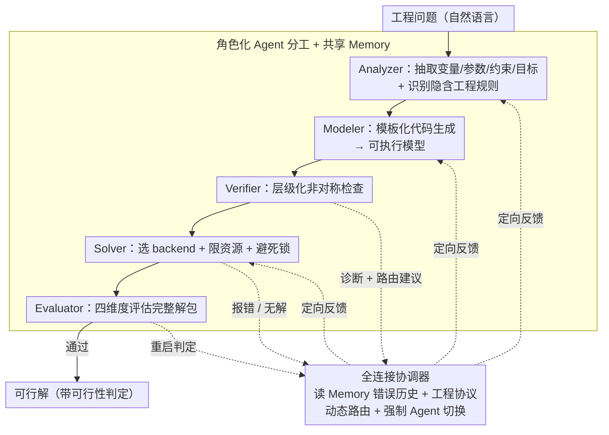

# EngiAgent: Fully Connected Coordination of LLM Agents for Solving Open-ended Engineering Problems with Feasible Solutions

**会议**: ICML 2026  
**arXiv**: [2605.02289](https://arxiv.org/abs/2605.02289)  
**代码**: https://github.com/AI4Engi/EngiAgent (有)  
**领域**: LLM Agent / 工程问题求解 / 多智能体系统  
**关键词**: 全连接协调器, 可行性, 工程建模, 多 Agent, 反馈路由

## 一句话总结
EngiAgent 把工程问题求解拆成 Analyzer/Modeler/Verifier/Solver/Evaluator 五个专家 Agent，再用一个**全连接协调器**动态路由反馈（而不是走固定流水线），让 GPT-4o 上工程任务的可行解率从 5.66%（zero-shot）/7.55%（MM-Agent）一跃到 64.15%，平均比此前 SOTA 提升约 7 倍。

## 研究背景与动机

**领域现状**：LLM 在数学推理（GSM8K 等）、代码生成（HumanEval 等）上已经接近饱和，社区自然想把它推广到工程问题求解——交通调度、电力调度、机械系统协调等。已有路线大致三类：(1) ResearchAgent 类做开放探索；(2) MM-Agent 类做数学建模；(3) DS-Agent 类做数据驱动代码生成。

**现有痛点**：作者实证给出三组刺眼数字：(a) Autonomous research 方向只产出 < 10% 可行解，因为目标是「新颖」而非「可执行」；(b) MM-Agent 风格在数学 benchmark 上能拿 70% 但工程问题里只有约 13% 给出数值解；(c) DS-Agent 风格 62.26% 能跑出数字但只有 5.66% 在物理 / 安全约束下可行。归纳起来工程问题里最容易犯四种错：花哨但模糊的建模、篡改原始数据、违反物理定律、过度约束导致不可解。

**核心矛盾**：现有 Agent 系统普遍采用**固定流水线**（Analyzer → Modeler → Solver 这种线性 DAG），一旦中途某个阶段出错，反馈只能回到上一步，根本无法跨阶段定向修复（如 Verifier 发现数据不一致时应跳回 Analyzer 而非 Modeler）。这种刚性结构 vs 工程问题的多源失败模式之间存在结构性不匹配。

**本文目标**：(1) 把「可行性」抬到与正确性同等的指标地位；(2) 设计一个能在五个角色之间任意路由反馈、容错并主动切换的协调机制；(3) 构建覆盖电力 / 交通 / 制造 / 结构等多领域的可行性基准。

**切入角度**：把多 Agent 协作的拓扑从「链」改成「全连接图 + 状态感知协调器」，让协调器（本身也是 LLM）根据共享 Memory 中的错误历史动态决定下一步把控制权交给谁。

**核心 idea**：用「LLM 自主决策 + 结构化工程协议作为 context」的混合策略，配上强制 Agent 切换机制（同一 Agent 失败重复就强制换人）防止无限调试循环。

## 方法详解

### 整体框架
EngiAgent 要解决的是「工程问题里 LLM 能产出数字却产不出可行解」这件事，做法是把一个工程师团队的分工搬进多 Agent 系统：5 个功能 Agent（Analyzer/Modeler/Verifier/Solver/Evaluator）各管一段工作，1 块共享 Memory 让它们看到彼此的输出和失败历史，再由 1 个全连接协调器决定每一步把控制权交给谁。基线流水线按 Analyzer → Modeler → Verifier → Solver → Evaluator 线性走一遍（输入自然语言问题、输出带可行性判定的完整解包）；协调器层则允许任意跨越线性顺序——Verifier 检测到「数据不一致」可以直接跳回 Analyzer 重抽取，Solver 报「无解」可以跳回 Modeler 放松约束。

### 关键设计

**1. 全连接协调器：让反馈路径与错误根因一对一匹配**

固定流水线的毛病在于一旦中途出错，反馈只能回到上一步，没法跨阶段定向修复——而工程问题恰恰是多源失败（数据抽错、物理违例、过度约束往往发生在不同阶段）。EngiAgent 把拓扑从「链」改成「全连接图」，协调器（本身也是一个 LLM）充当控制中枢，根据实时反馈决定下一个被激活的 Agent，而非按固定顺序推进。为了不让这种自由度变成乱跳，协调器把**工程协议**当上下文喂进去（如「数据一致性优先级 > 形式正确性」「过度约束需放松而非删除」），同时读共享 Memory 里每个 Agent 最近 $k$ 次的输出和失败原因，把 LLM 的自主决策约束在工程合理边界内。配套的**强制 Agent 切换机制**是这里最工程化的一笔：同一 Agent 在同一错误模式上失败超过阈值，就强制把控制权交给另一个 Agent，专治「Modeler 反复改公式但根因其实在 Analyzer 的数据抽取错误」这类在错误根因之外死磕的无限调试循环。全连接结构让反馈能精确打到根因，强制切换则压住局部反复振荡，两者合起来是可行率从固定流水线的 47.17% 跳到 64.15% 的主要来源。

**2. Verifier 的层级化非对称检查：既不空转也不放水**

如果 Verifier 用纯正确性检查，系统会在 $a+b$ 与 $b+a$ 这类格式差异上反复空转；如果用纯宽容检查，核心硬约束会被悄悄删掉而仍判通过——EngiAgent 用两层非对称判定同时压住这两端。第一层是非可商议的语义检查（目标方向、核心物理定律、数据一致性），任何一条违反就立即拒绝，并产出错误诊断加路由建议交给协调器；第二层则容忍**功能等价的表达差异**（如 $a+b$ vs $b+a$、$\leq$ 拆成 $\geq$ 取负），避免「只是写法不同」就触发无意义重跑。关键是它显式禁止「为了能求解就删掉核心硬约束」这种自欺欺人，把「可行性」真正当成检验目标而不是数值产出的副产品。

**3. 角色化 Agent 分工 + 共享 Memory：每个 Agent 有边界又有全局视图**

把工程师团队的明确分工显式映射到 5 个 LLM Agent，避免单 Agent 全包导致 prompt 过长、角色混乱。Analyzer 把自然语言问题转成「决策变量 + 参数 + 约束 + 目标」的结构化表示，并识别题面没写明的**隐含**工程规则；Modeler 用模板化代码生成把结构化表示变成可执行模型；Verifier 做语义一致性、约束完整性、数据一致性三类检查；Solver 负责选 backend、设资源限制、避死锁；Evaluator 对完整解包做四维度评估（结果可行性、模型问题对齐、工程有效性、整体质量）。这些 Agent 内部各用 prompt + 领域知识库定制，而共享 Memory 让它们都能看到彼此的输出和历史——这块 Memory 既是 Agent 间协作的载体，也正是协调器做路由决策的依据。

### 损失函数 / 训练策略
本文是 inference-time agent 框架，不涉及训练，所有效果来自 prompt + 协调器 + Memory 的设计。基准用三种 LLM 后端（GPT-4o、Gemini-2.5 Flash、DeepSeek-V3-671B）做对比；自建数据集覆盖四个工程领域 53 道高质量问题，重点评估可行性而不仅是数值产出率。

## 实验关键数据

### 主实验

| 后端 / 方法 | 数值产出率 (Num.) ↑ | **可行率 (Feas.) ↑** | IE | DR | MO | UH | Avg. |
|------|------|------|------|------|------|------|------|
| GPT-4o Zero-shot | 22.64% | 5.66% | 5.66 | 5.42 | 4.47 | 3.33 | 4.72 |
| GPT-4o MM-Agent | 13.21% | 7.55% | 6.89 | 7.21 | 6.48 | 7.98 | 7.14 |
| GPT-4o EngiAgent (Fixed) | 47.17% | 47.17% | 8.30 | 7.22 | 6.67 | 7.14 | 7.33 |
| **GPT-4o EngiAgent (Coord.)** | **66.04%** | **64.15%** | **8.67** | **7.74** | **7.05** | **7.41** | **7.72** |
| Gemini-2.5 Flash EngiAgent (Coord.) | 52.83% | 50.94% | 8.30 | 6.89 | 6.30 | 6.06 | 6.89 |
| DeepSeek-V3-671B EngiAgent (Coord.) | — | 75.47% | — | — | — | — | — |

### 消融实验

| 配置 | 可行率 | 说明 |
|------|--------|------|
| Full EngiAgent (Coord.) | 64.15% (GPT-4o) | 完整系统 |
| EngiAgent (Fixed pipeline) | 47.17% | 去掉协调器、走固定 DAG，掉约 17 pp |
| w/o Verifier | 明显下降（见 §6.5） | 缺乏严格检验导致违反物理 / 数据约束的解被错判通过 |
| w/o 强制切换机制 | 调试循环失败率上升 | 同一 Agent 在错误根因外反复振荡 |

### 关键发现
- **协调器是关键差异**：在三种后端上「Coord. vs Fixed」平均可行率提升超 10 pp；GPT-4o 上单这一项就贡献 +16.98 pp。
- **数值产出 ≠ 可行**：DS-Agent 在 DeepSeek 上能产出 77.36% 数值解，但只有 28.30% 可行；EngiAgent 在数值产出和可行率上几乎重合，证明可行性不是「先产数再修」能解决的，必须在生成路径里就被强制。
- **后端鲁棒性**：三种 LLM 后端可行率均位列对应组第一，意味着方法收益主要来自「协作结构」而非某个特定模型——这是 agent 框架最有意义的横向证据。
- **可行子集（Feasible 列）质量也高**：在可行解里平均得分 8.12，说明 EngiAgent 不是用「放水可行性判定」换来的可行率虚高，可行的解本身质量也优。

## 亮点与洞察
- **「拓扑革命」叙事**：把多 Agent 系统的失败归因到「固定流水线」这种结构而非 LLM 能力本身，并给出一个最小代价的替代方案（全连接 + 状态感知协调器），思路对任何 multi-agent 系统设计都有借鉴价值。
- **强制切换防死循环**：单 Agent 重复失败就强制换人，是非常工程化但解决真问题的设计——直接对应「LLM 在错误根因之外死磕」这一典型病。
- **可行性作为一等公民**：明确把可行率与数值产出率分开统计，并且用四类错误（vague modeling、altering data、physical violation、over-constraining）给社区一个可复用的失败模式分类法。

## 局限与展望
- 只在 53 题、4 个领域上评测，规模偏小；更大规模、跨领域工程 benchmark 仍需后续构建（论文承认）。
- 协调器本身是 LLM 调用，决策质量上限受限于后端模型；对小模型（< 7B）是否仍然有效未见验证。
- 五 Agent 角色和工程协议都是手工设计的，缺乏自动化生成或自适应调整机制；新领域接入仍需大量 prompt engineering。
- 推理成本明显高于单 Agent 方案（每次任务可能涉及数十次 LLM 调用 + 多次 Solver 调用），论文没有报告 token / wall-clock 成本，对实际部署门槛是个未量化变量。
- 评测里部分指标（IE/DR/MO/UH 的「Avg.」）由 LLM 评分，存在自评偏差风险，需要更多人类对比验证。

## 相关工作与启发
- **vs ResearchAgent / AI Scientist**：他们追求开放探索和新颖性，可行率 < 10%；EngiAgent 直接把目标定在「可行 + 实用」，是另一条工程化路线。
- **vs MM-Agent**：MM-Agent 侧重数学建模质量；EngiAgent 把「建模 + 求解 + 可行性检查」合并，因此在工程 setting 下大幅领先。
- **vs DS-Agent**：DS-Agent 是高数值产出但低可行率的典型——证明「能跑出数字」≠「真能用」，间接论证了 Verifier + Evaluator 的必要性。
- **vs HuggingGPT / AutoGen 类通用 agent 框架**：它们更通用但路由策略偏固定；EngiAgent 在路由灵活性上更进一步，工程协议显式约束了灵活性的边界。

## 评分
- 新颖性: ⭐⭐⭐⭐ 多 Agent 框架本身不新，但「全连接协调 + 强制切换 + 工程协议」组合在工程域是首创。
- 实验充分度: ⭐⭐⭐⭐ 三后端 × 四领域 × 多基线对比 + 消融充分；样本量 53 题略偏小。
- 写作质量: ⭐⭐⭐⭐ 四类失败模式的图示讲清了为什么需要这种架构，叙事清晰。
- 价值: ⭐⭐⭐⭐ 给所有想把 LLM 推到「真实工程闭环」的工作一个高质量参考实现。

<!-- RELATED:START -->

## 相关论文

- [\[ACL 2026\] RoadMapper: A Multi-Agent System for Roadmap Generation of Solving Complex Research Problems](../../ACL2026/multi_agent/roadmapper_a_multi-agent_system_for_roadmap_generation_of_solving_complex_resear.md)
- [\[ACL 2026\] Diversity Collapse in Multi-Agent LLM Systems: Structural Coupling and Collective Failure in Open-Ended Idea Generation](../../ACL2026/multi_agent/diversity_collapse_in_multi-agent_llm_systems_structural_coupling_and_collective.md)
- [\[ACL 2026\] ATLAS: Adaptive Trading with LLM AgentS Through Dynamic Prompt Optimization and Multi-Agent Coordination](../../ACL2026/multi_agent/atlas_adaptive_trading_with_llm_agents_through_dynamic_prompt_optimization_and_m.md)
- [\[ICML 2026\] CoOT: Learning to Coordinate In-Context with Coordination Transformers](coot_learning_to_coordinate_in-context_with_coordination_transformers.md)
- [\[ICML 2026\] Sheaf-ADMM: Learning Multi-Agent Coordination via Sheaf-ADMM](learning_multi-agent_coordination_via_sheaf-admm.md)

<!-- RELATED:END -->
