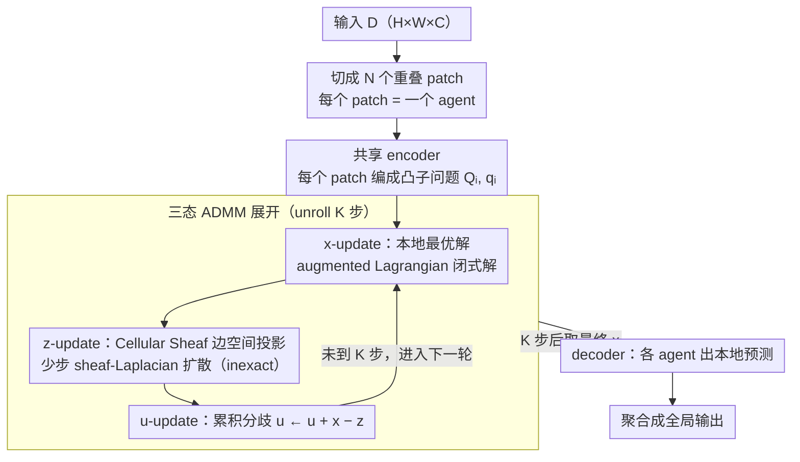

# Sheaf-ADMM: Learning Multi-Agent Coordination via Sheaf-ADMM

**会议**: ICML 2026  
**arXiv**: [2605.31005](https://arxiv.org/abs/2605.31005)  
**代码**: 待确认  
**领域**: 多智能体 / 可微优化 / 几何深度学习  
**关键词**: ADMM 展开, cellular sheaf, 多智能体一致, sheaf Laplacian, 局部视图融合

## 一句话总结
Sheaf-ADMM 把多智能体协调问题做成端到端可微的 ADMM 展开——每个 agent 只看局部 patch，独立解 ADMM 子问题（$\bm x$-update）、通过 cellular sheaf 定义的"边空间投影"协商一致（$\bm z$-update）、用对偶变量 $\bm u$ 累积分歧；在 maze pathfinding / MNIST / Sudoku 上 agents 协同得出正确全局解，且推理路径有可分析的 primal/consensus/dual 三态——比 MPNN 更可干预。

## 研究背景与动机

**领域现状**：标准神经架构是 monolithic——一个大网络处理整个输入；但自然界智能多是 collective——一群只看局部的 agents 协同解全局任务（蚁群、神经元集群等）。已有相关架构包括 sheaf neural networks（Bodnar 2022）、neural cellular automata（Mordvintsev 2020）、recurrent MPNN（Gilmer 2017）。

**现有痛点**：（1）MPNN 风格架构每个 agent 只有单一 hidden state，混了"本地决定"和"对外协商"两件事；（2）消息传递是任意学习的非线性函数，行为不可解释；（3）通常要求 agents 在整个状态向量上一致，过于刚性（adjacent maze 区只需 boundary 一致，不需内部一致）；（4）已有 sheaf-constrained ADMM（Hanks 2025b）用固定手工 sheaf 处理多智能体线性控制，没做可微学习。

**核心矛盾**：要让一群"信息不全"的 agents 真正协同解全局任务，需要（a）明确分离本地决策和全局协商；（b）灵活的"局部一致"语义（不同 agent 对不同方面一致）；（c）端到端可学习；现有架构都做不到三者兼得。

**本文目标**：（1）端到端可微的多智能体协调框架；（2）用 cellular sheaf 定义"哪些方面要一致"的灵活语义；（3）每个 agent 维护 primal/consensus/dual 三态保可解释性；（4）在标准 DL 任务上验证。

**切入角度**：复用 ADMM 的天然分解结构——consensus form ADMM 把全局问题拆成 N 个 agent 的局部子问题 + consensus 投影；用 cellular sheaf 替代"全状态一致"约束，让 agents 只在 edge stalk（边空间）上投影后才需一致——这是个数学上严格、几何上直观的"灵活一致"语义。

**核心 idea**：unrolled ADMM + learnable cellular sheaf——每 agent 解 $\bm x$-update（神经编码器参数化的凸子问题）→ sheaf-Laplacian 扩散做 $\bm z$-update（投影到 ker($\bm F$)）→ $\bm u$-update 累积分歧；全管线可微，端到端反传。

## 方法详解

### 整体框架

Sheaf-ADMM 把"一群只看局部的 agent 协同解全局任务"直接做成一层可微的 consensus-form ADMM 展开。输入 $\bm D \in \mathbb{R}^{H \times W \times C_{in}}$ 被切成 $N$ 个重叠 patch，每个 patch 就是一个 agent，只看自己那块视野；共享 encoder 把每个 patch $\bm d_i$ 编成一个凸二次子问题的参数 $\bm Q_i, \bm q_i$。接着展开 $K$ 步 ADMM：每步里 agent 先独立解自己的局部子问题（$\bm x$-update），再通过 cellular sheaf 定义的"边空间投影"把彼此协商成一致（$\bm z$-update），最后用对偶变量累积没对齐的分歧（$\bm u$-update）。$K$ 步迭代后，每个 agent 拿最终的 $\bm x_i$ 配上本地 patch 过 decoder 出本地预测，再聚合成全局输出。整条管线没有任何采样或不可导算子，可以端到端反传。

### 关键设计

**1. 三态分离：把"我想什么/我们一致什么/我们曾分歧什么"拆成 $\bm x$、$\bm z$、$\bm u$**

MPNN 这类架构每个 agent 只有一个 hidden state，等于把本地决策、对外协商目标和历史冲突全压进同一个向量里，事后没法分辨它到底在表达哪一层意思。ADMM 天生把这三者拆开：$\bm x_i$ 是 agent 的本地最优解，受 augmented Lagrangian 项 $\tfrac{\rho}{2}\|\bm x_i - \bm z_i + \bm u_i\|^2$ 牵引向 $\bm z_i - \bm u_i$；$\bm z_i$ 是当前的 consensus 目标（满足下面的 sheaf 约束）；$\bm u_i$ 则把过去每一轮没对齐的差额累加起来，相当于"分歧的历史账本"。$\bm x$-update 有闭式解 $\bm x_i = (\bm Q_i + \rho \bm I)^{-1}(\rho(\bm z_i - \bm u_i) - \bm q_i)$，$\bm u$-update 就是 $\bm u^{k+1} = \bm u^k + \bm x^{k+1} - \bm z^{k+1}$。三态分开之后推理动力学变得可分析——可以单独可视化 $\bm z$ 看 consensus 怎么收敛、看 $\bm u$ 锁定冲突最大的区域，这正是单 hidden state 架构做不到的。

**2. Cellular Sheaf：让 agent 只在"任务真正要求一致"的低维子空间上对齐**

要求相邻 agent 在整个状态向量上一致太刚性——相邻的迷宫区其实只需要边界处衔接得上，内部各走各的不该被强行拉平。cellular sheaf 把这个直觉形式化：每条边 $e=(i,j)$ 挂一个低维 edge stalk $\mathbb{R}^{d_e}$（$d_e < d_v$），两端各有一个 restriction map $\bm F_{i\to e}, \bm F_{j\to e} \in \mathbb{R}^{d_e \times d_v}$ 把 agent 状态投影到这条边的共享空间上，"一致"就只定义为 $\bm F_{i\to e}\bm x_i = \bm F_{j\to e}\bm x_j$。由此定义 sheaf Laplacian $\bm L_\mathcal{F} = \bm F^\top \bm F$，它度量的总分歧恰好是

$$\bm x^\top \bm L_\mathcal{F} \bm x = \sum_{e=(i,j)} \|\bm F_{i\to e}\bm x_i - \bm F_{j\to e}\bm x_j\|^2 .$$

$\bm z$-update 要做的就是把当前状态投影到 $\ker(\bm F)$（这个总分歧为零的子空间）。restriction maps 是学出来的，等于让模型自己决定"我们到底要在哪些维度上达成一致"——比图 Laplacian 的"全状态一致"灵活得多，也正好对上 Sudoku 行/列/宫这种只约束部分关系的结构。

**3. Unrolled ADMM + inexact $\bm z$-update：把分布式优化器当成可微递归层，且每步只扩散几下**

固定 $K$ 步 ADMM、整体反传，ADMM 就从一个迭代求解器变成了一层可端到端训练的递归网络。关键的省力点在 $\bm z$-update：精确投影到 $\ker(\bm F)$ 要解一个大型线性系统，而 sparse 场景下 $\bm L_\mathcal{F}$ 条件数很大、完美收敛代价高，所以这里只跑少数几步 sheaf-Laplacian 扩散 $\bm z^{t+1} = \bm z^t - \eta \bm L_\mathcal{F}\bm z^t$（inexact）。少步扩散本质上是个 smoother：先把高频的、局部相邻 agent 之间的分歧快速磨平，低频的全局结构留待后续 ADMM 轮次慢慢对齐。这种"少步消高频"恰好是 ADMM 用在多智能体上的特有红利——不必每步都把 consensus 解到底，几步就够推动全局收敛，省下大量算力。

### 一个完整示例：16×16 迷宫寻路

以一张 16×16 迷宫为例走一遍三态怎么转。每个 patch agent 先在 $\bm x$-update 里独立提议一条穿过自己视野的本地路径——此时各 agent 各说各话，在迷宫拐点和区块交界处提议常常对不上。$\bm z$-update 通过 restriction maps 只在相邻区块的边界 stalk 上拉一致，几轮 ADMM 后这些本地段被缝合成一条全局连贯的路径。$\bm u$ 则在迭代中悄悄标记出那些"反复对不齐"的格子——通常正是迷宫的拐点和死胡同入口，因为那里本地视野最容易做出错误的局部决定。$K$ 步后 decoder 读出最终的 $\bm x$，得到一条完整可行路径；而把 $\bm x/\bm z/\bm u$ 三张图分别画出来，就能直接看到"提议 → 协商 → 冲突定位"的全过程，这是 MPNN 单 hidden state 给不出的可解释性。

## 实验关键数据

### Sudoku（核心 reasoning task）

| 方法 | 解题率 | 参数量 |
|------|------|-------|
| MPNN（参数匹配）| 32% | ~500K |
| Recurrent Transformer | 41% | ~500K |
| **Sheaf-ADMM** | **78%** | ~500K |

Sudoku 这种全局逻辑约束任务上 Sheaf-ADMM 显著超 MPNN——因为 sheaf 的局部一致约束天然匹配 Sudoku 的行/列/宫约束结构。

### Maze Pathfinding

| 难度 | MPNN | **Sheaf-ADMM** |
|------|------|--------------|
| 8×8 | 89% | **96%** |
| 16×16 | 67% | **88%** |
| 32×32 | 23% | **64%** |

随迷宫增大 MPNN 退化更快，Sheaf-ADMM 因 ADMM 的全局收敛性质泛化更好。

### MNIST 鲁棒性（关键发现）

| Test 分布 | CNN baseline | **Sheaf-ADMM** |
|---------|-----------|--------------|
| Standard MNIST | 99.1 | 98.8 |
| Rotated MNIST | 73.2 | **89.4** |
| Translated MNIST | 81.7 | **93.1** |
| Noisy MNIST | 85.5 | **91.8** |

干净测试上略弱（−0.3），但分布偏移下显著鲁棒（+15+ on rotation）——证明 local-view decomposition + sheaf consensus 提供了更强的归纳偏置

### 可解释性（ADMM 三态）

论文 Figure 3 展示在 maze 任务上：
- $\bm x$（primal）：早期每 agent 独立提议本地路径
- $\bm z$（consensus）：通过 ADMM 迭代汇成全局连贯路径
- $\bm u$（dual）：标识"曾经分歧大"的区域——常是迷宫拐点

这种可视化在 MPNN 上完全做不到（只有一个 hidden state）。

### 关键发现
- **任务越需要全局协调，Sheaf-ADMM 优势越大**：Sudoku（强约束 +46%）> Maze 32×32（+41%）> MNIST clean（−0.3）；说明 framework 对真协调任务才有大收益
- **分布偏移鲁棒性是天然 byproduct**：local-view decomposition 让模型不依赖全局位置先验，泛化到 rotation/translation
- **inexact ADMM 够用**：少步扩散就够把高频分歧消掉，不需要完美收敛——大幅省算力
- **sheaf 学到的 restriction maps 可解释**：可视化展示 agents 学到"在哪些维度上协商"

## 亮点与洞察
- **三态分离 + sheaf 一致是真正全新的归纳偏置**：以往 MPNN 把所有信息混一起 + 全状态一致是个粗略 prior；本文把"我决定、我们一致、我们曾分歧"清晰分开 + 用 sheaf 形式化"哪些方面一致"——这套结构性 prior 比 MPNN 自由度小但匹配真协调任务的结构
- **Optimization-derived 更新 vs 任意学习更新**：sheaf-Laplacian 扩散和 ADMM proximal 更新都是 optimization 推出的，不是任意学习函数；这给出了"为什么这样更新"的数学解释，可分析、可干预
- **可解释性 + 可干预性**：训练完可对 $\bm x, \bm z, \bm u$ 单独可视化和扰动——MPNN 完全没这种可分析性，对 safety-critical 多智能体应用有意义
- **Sheaf 作为通用 framework**：cellular sheaf 远比图 Laplacian 灵活，可以表达异构一致语义；本文展示了把 sheaf 用到 DL coordination 的完整 pipeline

## 局限性 / 可改进方向
- ADMM 展开层数 $K$ 固定，对不同难度样本不自适应——可考虑自适应迭代或 early termination
- sparse 大型系统下 $\bm L_\mathcal{F}$ 条件数仍是问题，少步扩散是 workaround；可考虑 preconditioning
- restriction maps 全局共享，对极异构 agents（如不同模态混合）可能不够
- 仅在结构化预测任务（grid-organized agents）验证；任意图拓扑的扩展和效果未充分测试
- 训练成本——unrolled $K$ 步会让 backward 内存膨胀；implicit differentiation 可能是更好选择但需重新设计

## 相关工作与启发
- **vs MPNN / GNN**：MPNN 用任意学习消息函数，行为不可解；Sheaf-ADMM 用 optimization-derived 更新，三态分离
- **vs Sheaf Neural Networks (Bodnar 2022)**：那个用 sheaf Laplacian 做 diffusion-based message passing；Sheaf-ADMM 进一步用 sheaf 约束 ADMM 的 consensus，且有 primal-dual 结构
- **vs Hanks 2025b**：那个用固定手工 sheaf 做多智能体线性控制；本文学 sheaf + 任意凸子问题，端到端可微
- **vs Neural Cellular Automata**：NCA 用任意学习更新做 emergence；Sheaf-ADMM 用 optimization 结构保证收敛
- **启发**：把任何"分布式优化算法"通过 unrolling 变成可微神经层是个 fertile direction；ADMM、PGD、Frank-Wolfe 等都可这样做

## 评分
- 新颖性: ⭐⭐⭐⭐⭐ 端到端学习的 sheaf-constrained ADMM 是真正全新的多智能体协调架构
- 实验充分度: ⭐⭐⭐⭐ Sudoku + Maze + MNIST 鲁棒性覆盖了 reasoning 和 classification，但场景仍偏 grid 结构
- 写作质量: ⭐⭐⭐⭐⭐ 数学严谨（sheaf + ADMM 完整推导），Figure 1/2/3 直观；三态分离的可解释性论证清晰
- 价值: ⭐⭐⭐⭐ 对多智能体 RL、机器人协同、分布式推理都有理论和实践启发；可解释性对 safety-critical 应用有意义

<!-- RELATED:START -->

## 相关论文

- [\[ICML 2026\] CoOT: Learning to Coordinate In-Context with Coordination Transformers](coot_learning_to_coordinate_in-context_with_coordination_transformers.md)
- [\[AAAI 2026\] Conversational Learning Diagnosis via Reasoning Multi-Turn Interactive Learning](../../AAAI2026/multi_agent/conversational_learning_diagnosis_via_reasoning_multi-turn_interactive_learning.md)
- [\[ICML 2026\] EngiAgent: Fully Connected Coordination of LLM Agents for Solving Open-ended Engineering Problems with Feasible Solutions](engiagent_fully_connected_coordination_of_llm_agents_for_solving_open-ended_engi.md)
- [\[ICLR 2026\] Multi-agent Coordination via Flow Matching](../../ICLR2026/multi_agent/multi-agent_coordination_via_flow_matching.md)
- [\[ACL 2026\] Explicit Trait Inference for Multi-Agent Coordination](../../ACL2026/multi_agent/explicit_trait_inference_for_multi-agent_coordination.md)

<!-- RELATED:END -->
