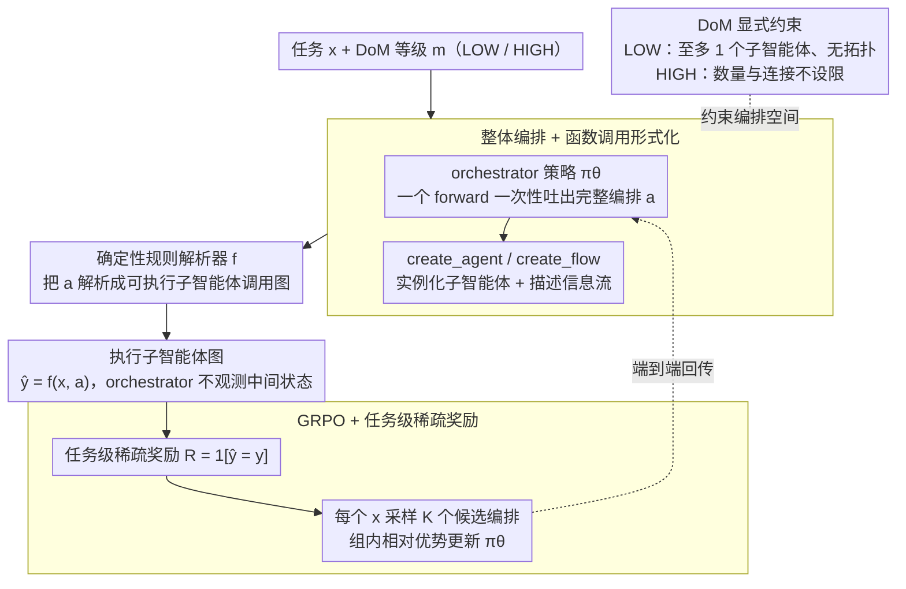

# MAS-Orchestra: Understanding and Improving Multi-Agent Reasoning Through Holistic Orchestration and Controlled Benchmarks

**会议**: ICML 2026  
**arXiv**: [2601.14652](https://arxiv.org/abs/2601.14652)  
**代码**: https://github.com/SalesforceAIResearch/MAS-Orchestra (有)  
**领域**: LLM Agent / 多智能体系统 / 强化学习  
**关键词**: 多智能体系统, 整体编排, 函数调用, GRPO, MASBench  

## 一句话总结
把"自动多智能体系统设计"重新表述为一次性输出整张 MAS 的函数调用 RL 问题，并配套 MASBench 从 Depth/Horizon/Breadth/Parallel/Robustness 五个轴说清楚"什么时候多智能体真的比单智能体强"。

## 研究背景与动机

**领域现状**：自动 MAS（multi-agent system）设计已经从手工连线（debate、CoT-SC 之类固定拓扑）走向训练时编排——给一个 orchestrator LLM，让它根据任务自动生成子智能体的角色、连接方式与执行顺序。

**现有痛点**：作者把现有路线归到三个具体问题。其一，形式化层面几乎所有工作都用"可执行代码"来描述编排（MAS-Zero、AFlow、W4S），orchestrator 不得不读甚至复现子智能体的内部代码，当子智能体复杂（如多轮 search agent）时编排成本急剧上升，子智能体被迫退化到 CoT/CoT-SC 这种最简形式。其二，训练层面要么完全靠推理时启发式搜索导致方向不稳，要么用多步 RL 增量式拼接组件，长程信用分配差、误差顺着步骤累积。其三，"什么时候该用 MAS"完全靠经验，没有定量框架，导致大家用错地方还以为是模型问题。

**核心矛盾**：sequential 多步编排逼着 orchestrator 在每一步都做局部最优，但 MAS 的好处来自整体协调（global coordination），这两件事本质冲突；同时把子智能体定义在"prompt 改一行"或"换个 backbone"层面，又抹掉了 tool 与 workflow 这些真正区分子智能体能力的维度。

**本文目标**：(1) 提一个既能让 orchestrator 做全局推理、又能容纳复杂子智能体的编排形式化；(2) 给出一个可控基准，把"任务结构 × 验证协议 × orchestrator / 子智能体能力"对 MAS 收益的影响逐项拆开。

**切入角度**：作者的关键观察是——orchestrator 真正需要的能力是"高层系统设计"而不是"复现子智能体内部行为"。如果把子智能体抽象成黑盒可调用函数（只暴露 signature），orchestrator 就可以一次性吐出完整系统结构，绕开 sequential RL 的长程信用分配问题。

**核心 idea**：用 `create_agent` + `create_flow` 两个原语把 MAS 写成"一次函数调用程序"，用 GRPO 在端到端任务奖励上训练 orchestrator 整体生成整张系统，并显式引入 DoM（degree of MAS）作为用户可控的复杂度旋钮。

## 方法详解

### 整体框架
这篇论文要解决的是"自动 MAS 设计"被 sequential 多步 RL 拖累的老问题：以往让 orchestrator 一步步增量拼装系统，长程信用分配差、错误顺着步骤累积。MAS-Orchestra 把整个过程压成一次性决策——给定数据集 $\mathcal{D}=\{(x_i,y_i)\}$ 和用户指定的 DoM 等级 $m\in\{\text{LOW},\text{HIGH}\}$，orchestrator 策略只在第 0 步看到任务 $x$，一个 forward 内采样出完整编排 $a\sim\pi_\theta(\cdot\mid x,m)$；再由确定性规则解析器 $f$ 把 $a$ 翻成可执行的子智能体调用图，跑出预测 $\hat{y}=f(x,a)$。之后 orchestrator 不再观测中间状态、不再做增量决策，编排好坏只通过最终答案是否正确来回传，整套训练靠 GRPO 在端到端任务奖励上完成。

### 关键设计

**1. Holistic Orchestration + Function-Calling 形式化：让 orchestrator 一次吐出整张系统，而不是逐步拼**

针对的痛点是 code-based 编排（MAS-Zero、AFlow、W4S）的强耦合——orchestrator 必须读懂甚至复现子智能体的内部代码，子智能体一复杂（如多轮 search agent）编排成本就爆炸，逼得大家把子智能体退化成 CoT/CoT-SC 这种最简形式。MAS-Orchestra 把整个编排空间收到两个函数原语上：`create_agent(role, goal, tools, workflow)` 实例化一个目标导向的子智能体，`create_flow(from, to, payload)` 描述子智能体之间的信息流。关键在于子智能体被当作黑盒函数，orchestrator 只看 signature 不看实现，于是它在一个 forward 里就能写出包含若干子智能体及其连接拓扑的完整 MAS 程序。这样 RL 信号直接对齐"系统级最终回报"而非每一步的局部最优，训练更稳定，子智能体也可以做得任意复杂（多轮 search、DeepResearch），因为它们的内部复杂度对 orchestrator 完全透明。

**2. DoM（Degree of MAS）显式约束：把"该不该上 MAS"做成用户可调的旋钮**

实证里并非所有任务都受益于 MAS——AIME 这类强 sequential 数学题加上 MAS 几乎无增益，硬上反而白白付协调开销。作者因此给调用时加一个 DoM 等级 $m$ 来硬性约束编排空间：LOW 时至多实例化 1 个子智能体、且不允许显式 inter-agent 拓扑，HIGH 时子智能体数量与连接方式都不设限。要强调 LOW 并不等于退回单智能体（SAS）——orchestrator 仍要决定"自己解 / 委派整任务 / 委派子任务 / 选哪个子智能体 / 怎么配置它"，只是不搭多智能体拓扑；HIGH 才进一步决定多体协同结构。同一个用统一目标训练出来的模型，靠 $m$ 就能在两种 regime 间切换，把"要不要 MAS"这个先验留给用户/任务，而不是埋死在模型权重里，省下大量无效编排。

**3. GRPO + 任务级稀疏奖励：只用最终答案对错端到端训整张系统**

holistic 编排只在最终输出处拿到反馈，奖励极稀疏，PPO 这种依赖 value baseline 的方法在这种信号下方差很大。作者用最终答案正确性 $R(x,y,\hat{y})=\mathbb{1}[\hat{y}=y]$ 作为唯一信号，对每个 $x$ 采样一组 $K$ 个候选编排 $\{a_i\}_{i=1}^K\sim\pi_\theta(\cdot\mid x,m)$，算出各自奖励 $\{R_i\}$，再用组内相对优势构造 clipped policy gradient（GRPO, Shao et al. 2024）。Robustness 这类需要中间答案的任务可在奖励里额外加入子任务正确性。GRPO 用 group 内相对比较替代 value model，恰好契合"一个 prompt 一次成型出多个候选系统"的训练形态——一把 critic 全省掉，正好对上 holistic 编排"一次吐 K 个完整 MAS"的采样结构。

### 训练与评测策略
训练阶段同时喂两类数据：一是 MASBench 的可控合成数据（由 iGSM 数学问题生成器在指定 Depth/Horizon/Breadth/Parallel 复杂度下产出，Robustness 轴则通过插入 NIAH 风格的对抗 note 构造），二是公开基准的训练集（DeepScaleR for AIME/GPQA、HotpotQA 训练集、BrowseComp+ 的 80% 切分）。子智能体池固定为 CoT / CoT-SC / Debate / Self-refine / DeepResearch 五类，全部共用同一 LLM 后端，仅在 tool 和 workflow 上做区分，确保对比中变化的只是编排结构而非底层模型。

## 实验关键数据

### 主实验

在 5 个公开基准上，以 Qwen2.5-7B-Instruct 为 orchestrator、GPT-OSS-120B (low) 为子智能体后端，对比所有标准独立智能体、SoTA 推理时编排（AFlow / MaAS / MAS-Zero）、SoTA 训练时编排（MAS-GPT / ToolOrchestra）以及 GPT-5 / Claude-Sonnet-4.5 作为 orchestrator 的 SoTA 大模型方案：

| 基准 | 任务类型 | 最佳独立智能体 | SoTA 编排基线 | MAS-Orchestra | 备注 |
|------|----------|-----------------|---------------|---------------|------|
| AIME24 | 数学（IID） | DebateAgent 62.08 | AFlow 62.50 | **66.25** | 低 DoM |
| AIME25 | 数学（IID） | DebateAgent 57.50 | AFlow 53.33 | **61.25** | 低 DoM |
| HotpotQA | 多跳 QA（IID） | DeepResearch 46.44 | ToolOrchestra 37.44 | **49.00** | 高 DoM |
| BrowseComp+ | search QA（IID） | DeepResearch 8.56 | ToolOrchestra 1.38 | **11.00** | 高 DoM |
| GPQA | 推理（OOD） | DebateAgent 64.14 | AFlow 65.43 | **65.21** | 低 DoM，DeepScaleR 训练 |

效率方面，MAS-Orchestra 落在 Pareto frontier 上，相对强基线达到 10× 以上推理代价节省（论文 Figure 1）。

### 受控实验：MASBench 五轴分析

| 配置 | 结论 | 说明 |
|------|------|------|
| Sub-agent = Qwen-7B（弱） | MAS 在 Breadth/Parallel/Robustness 上明显胜 SAS；Depth 上 MAS 输 SAS | sequential CoT 在强依赖链上反而省掉协调开销 |
| Sub-agent = GPT-120B low（强） | MAS 在 Depth/Horizon/Breadth/Parallel 上增益几乎归零；Robustness 仍领先 | 强子智能体内部已能消化结构，协调成本压过收益 |
| Orchestrator = RLM（如 GPT-OSS-20B-low） | 不如 Instruction-tuned LLM | RLM 倾向"自己解 + 只委派一个 agent"，三智能体方案训练后逐步收敛到单智能体，反映端到端 RL 训练偏好直接解题而非委派 |
| Robustness 轴（对抗 note 注入） | SAS 准确率近乎 0，MAS 显著领先 | MAS 会主动加入 final answer / moderator 子智能体做交叉验证 |
| 提高 reasoning effort（512 → 120k tokens） | low/mid/high effort 下 MAS-vs-SAS 在 Robustness 上的优势仍稳定保持 | 不是 context 截断造成的伪相关 |

### 关键发现
- **"边缘能力"假说**：MAS 最大增益出现在子智能体"够用但还没强到能独立内化整套结构"的区间——太弱时分解出来的子任务子智能体也做不好，太强时协调成本与误差传播抵消好处。
- **Holistic vs Sequential**：MAS-Orchestra 优于 ToolOrchestra（sequential RL）在所有 5 个公开基准上都成立，且 BrowseComp+ 上把 1.38 拉到 11.00，说明 sequential RL 在子智能体复杂时尤其吃亏。
- **Orchestrator 选择反直觉**：把 GPT-5 / Claude-Sonnet-4.5 当 orchestrator（不训练）在所有 benchmark 上都被一个训练过的 7B Qwen orchestrator 击败，说明编排能力不能直接从"通用推理能力"迁移，必须通过 RL 显式塑造。
- **DoM 配置策略**：数学/GPQA 这类强 sequential 任务用 LOW，HotpotQA/BrowseComp+ 这类含并行 search 的任务用 HIGH，按任务结构选 DoM 比一刀切都用 HIGH 更优。

## 亮点与洞察
- **"function 是 MAS 的正确抽象层"** —— 抽象到函数 signature 这一层后，orchestrator 不再被子智能体复杂度拖累，DeepResearchAgent 这种多轮 search 复杂 agent 才有机会被自然纳入候选池。这个抽象选择本身比 GRPO 训练更值得关注。
- **MASBench 的五轴拆解可以独立复用**：以后任何 MAS 工作都应该报告"在哪个轴上比 SAS 好、好多少"，而不是只报一个聚合数字。Depth/Horizon/Breadth/Parallel/Robustness 这套划分把 MAS-vs-SAS 之争从口水仗变成可证伪的实验问题。
- **RLM 不适合当 orchestrator**：作者用 agent 统计图证明 RLM 倾向"自己解题"而非"设计系统"，这与 RLM 端到端训练目标完全一致——这条洞察对所有想"用 o1 / DeepSeek-R1 当 orchestrator"的工作都是一记警钟。
- **稀疏任务奖励 + 一次成型编排** 是 GRPO 的天然场景：一个 prompt 采 K 个候选 MAS、用相对优势更新，把 PPO 那套 critic 全省掉。

## 局限与展望
- 实验里子智能体仍限制在 CoT/SC/Debate/Self-refine/DeepResearch 五类固定 workflow，真正能"创造新子智能体类型"的编排能力没被验证。
- 训练时只见过 low reasoning effort 的子智能体（512 tokens 上限），高 effort 下需要额外训练才能管好 context 长度——意味着 orchestrator 与子智能体之间存在隐式 capability 绑定。
- 用 GPT-5 / Claude-Sonnet-4.5 作为 orchestrator 基线时没有训练，这种对比对闭源大模型并不完全公平，"训练后的 GPT-5 orchestrator vs 训练后的 Qwen-7B orchestrator"才是更干净的对照。
- MASBench 大量基于 iGSM 合成，公开基准里 BrowseComp+ 仍偏窄，缺乏代码生成、长文档分析这类典型 MAS 用例。

## 相关工作与启发
- **vs MAS-Zero / AFlow（推理时编排）**: 他们不训练 orchestrator，只在推理时做启发式搜索；MAS-Orchestra 用 GRPO 显式训练，性能与效率都更好（10×），且把"是否要 MAS"通过 DoM 显式参数化。
- **vs ToolOrchestra（sequential 训练时编排）**: 同样用 RL，但走多步序列决策，BrowseComp+ 上只能拿 1.38；MAS-Orchestra 一次成型拿到 11.00，说明长程信用分配在 MAS 设计里是个真问题。
- **vs MAS-GPT（SFT 训练 orchestrator）**: SFT 容易过拟合训练分布；用 RL + 任务奖励能更好捕捉 system-level 协调模式，OOD（GPQA）泛化也更稳。
- **vs Debate / Self-Consistency 等固定模式 MAS**: 这些都是 MAS-Orchestra 候选池里的子智能体之一，作者证明"自动选择 + 组合 + 配置"比任何单一固定模式都好。

## 评分
- 新颖性: ⭐⭐⭐⭐ 把 MAS 编排重新表述为 holistic function-calling RL，配套 5 轴可控基准，两个组件单独拿出来都立得住。
- 实验充分度: ⭐⭐⭐⭐⭐ 公开基准 + 受控 benchmark + orchestrator/子智能体能力扫描 + reasoning effort 扫描，把"何时该用 MAS"的边界基本画清楚。
- 写作质量: ⭐⭐⭐⭐ 三个 desiderata 一路推导到方法，Table 1 把自己跟全部相关工作系统对比；公式与算法描述清晰。
- 价值: ⭐⭐⭐⭐⭐ MASBench 与"边缘能力"洞察预计会成为后续 MAS 论文的标准对照，10× 效率提升对工业落地有直接吸引力。

## 评分
- 新颖性: 待评
- 实验充分度: 待评
- 写作质量: 待评
- 价值: 待评

<!-- RELATED:START -->

## 相关论文

- [\[ICML 2026\] OMAC: A Holistic Optimization Framework for LLM-Based Multi-Agent Collaboration](omac_a_holistic_optimization_framework_for_llm-based_multi-agent_collaboration.md)
- [\[ACL 2026\] Towards Self-Improving Error Diagnosis in Multi-Agent Systems](../../ACL2026/multi_agent/towards_self-improving_error_diagnosis_in_multi-agent_systems.md)
- [\[ACL 2025\] GETReason: Enhancing Image Context Extraction through Hierarchical Multi-Agent Reasoning](../../ACL2025/multi_agent/getreason_enhancing_image_context_extraction_through_hierarchical_multi-agent_re.md)
- [\[NeurIPS 2025\] Multi-Agent Collaboration via Evolving Orchestration](../../NeurIPS2025/multi_agent/multi-agent_collaboration_via_evolving_orchestration.md)
- [\[ACL 2025\] Multi-Agent Collaboration via Cross-Team Orchestration](../../ACL2025/multi_agent/multi-agent_collaboration_via_cross-team_orchestration.md)

<!-- RELATED:END -->
