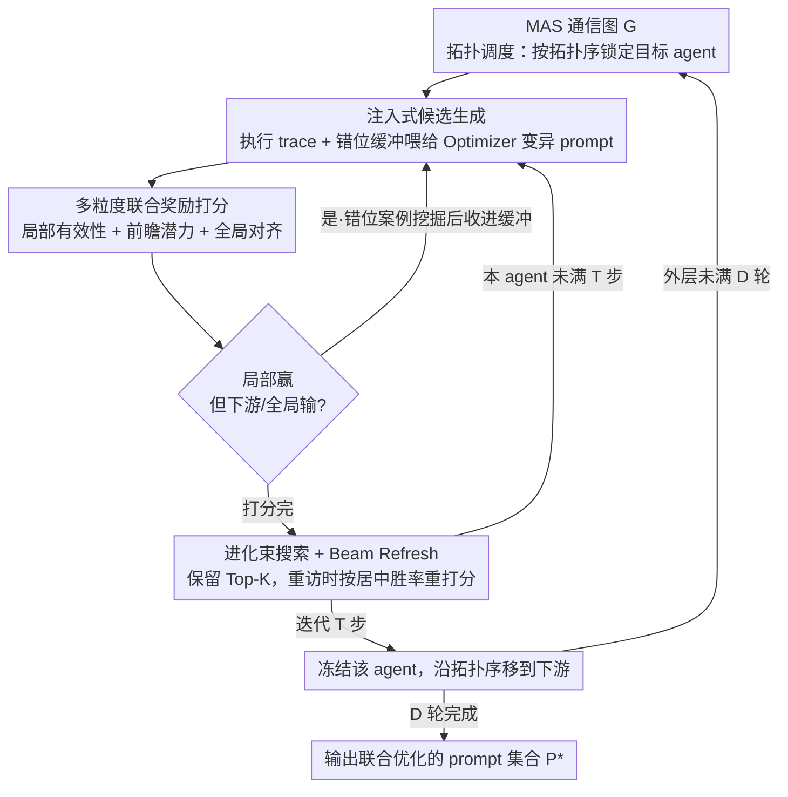

# MASPO: Joint Prompt Optimization for LLM-based Multi-Agent Systems

**会议**: ICML 2026  
**arXiv**: [2605.06623](https://arxiv.org/abs/2605.06623)  
**代码**: https://github.com/wangzx1219/MASPO  
**领域**: LLM / Agent / 提示工程  
**关键词**: 多智能体系统, 联合提示优化, 信用分配, 进化束搜索, 错位采样

## 一句话总结
MASPO 通过多粒度联合评价（局部有效性 + 前瞻潜力 + 全局对齐）+ 错位案例驱动的进化束搜索，在不依赖标注的前提下端到端地为整条多智能体链路联合优化角色提示词，6 个任务上平均提升约 2.9 分。

## 研究背景与动机

**领域现状**：基于 LLM 的多智能体系统（MAS）目前主要靠人工写一组「角色 prompt」来编排：把任务拆给若干异质 agent，让它们按一定通信拓扑顺序协作，整体性能比单 agent 高一截。Prompt 自动优化在单 agent 上已有 APE、OPRO、DSPy / MIPRO、TPE、SPO 等成熟方法。

**现有痛点**：把这些方法直接搬到 MAS 上会出大问题。第一，传统优化器靠「最终答案 vs ground truth」打分，但中间 agent 输出的是推理/反思/草稿，没有 label 可以直接对照——这是典型的**信用分配问题**。第二，TPE / MIPRO / MASS 这类贝叶斯搜索把 prompt 池写死成离散候选集，无法做开放式生成。第三，自监督方案（如 SPO）只看「这次输出比上次好不好」，仍然停留在单 agent 的孤立比较，不能反映 prompt 改动会沿因果链传播到下游 agent 这一事实。

**核心矛盾**：MAS 的 prompt 之间存在**功能耦合**——改了上游 $p_j$，下游 $v_i$ 的输入分布 $\mathcal{C}_i$ 跟着变（covariate shift），优化景观天然非平稳；而局部最优的 prompt 在系统层面可能是「输出语法上合规但下游被带跑偏」的**Local-Global Misalignment**。

**本文目标**：在无 ground truth 的条件下，对整个 MAS 的 $N$ 个 agent prompt 集合 $\mathcal{P}=\{p_i\}_{i=1}^N$ 做联合优化，同时 (1) 解决信用分配；(2) 显式识别并修复局部-全局错位；(3) 处理非平稳的协同优化。

**切入角度**：作者观察到只要能在局部、前瞻、全局三个粒度上分别比较「新 prompt vs 参考 prompt」的胜负，就能在不需要 label 的情况下构造出对因果链路敏感的奖励信号；并且把「局部赢但前瞻/全局输」的样本显式当作 hard negative 喂回 prompt 生成器，可以让搜索定向地修复协调断点。

**核心 idea**：把「拓扑顺序 + 多粒度联合奖励 + 错位案例采样 + 带 Beam Refresh 的进化束搜索」拼成一个坐标上升式框架，让每个 agent 的 prompt 都按整条因果链的贡献而非孤立输出来进化。

## 方法详解

### 整体框架
MASPO 把多智能体系统形式化为一张有向通信图 $\mathcal{G}=(\mathcal{V},\mathcal{E})$，每个 agent $v_i$ 由 LLM 推理函数 $f_i$ 和角色 prompt $p_i$ 决定输出 $o_i=f_i(p_i,q,\mathcal{C}_i)$，其中上下文 $\mathcal{C}_i$ 是按拓扑序拼接的前驱输出，目标是找一组 prompt $\mathcal{P}^*$ 最大化系统级回报 $R(\Phi(\mathcal{G},\mathcal{P},q),o_{glob}^*)$。它走的是坐标上升式的循环：沿拓扑序逐个锁定目标 agent，用执行 trace 生成候选 prompt、用一个无标注的多粒度奖励给候选打分并顺手挖出协调断点、在带刷新的束搜索里保留 Top-$K$，迭代 $T$ 步后冻结该 agent 移到下游，外层整体重复 $D$ 轮。这样每个 prompt 都按它对整条因果链的贡献而非孤立输出来进化。

### 关键设计

**1. 多粒度联合奖励：在没有 label 的情况下判断一个 prompt 是不是真的更好**

中间 agent 输出的是推理草稿而非可对照 ground truth 的答案，所以 MASPO 不去算绝对分，而是让 LLM Evaluator $\mathcal{M}_{eval}$ 在三个粒度上比较候选 prompt 与参考 prompt 的输出谁更优，再加权平均成奖励：$R=\frac{1}{|\mathcal{B}|}\sum_k[\alpha\cdot\mathbb{I}(o_i'\succ o_i)+\theta\cdot\mathbb{I}(o_{glob}'\succ o_{glob})+\beta\cdot\frac{1}{|\mathcal{N}_{out}(v_i)|}\sum_{v_j}\mathbb{I}(o_j'\succ o_j)]$。三项分别对应 Local Validity（局部角色合规性）、Global Alignment（对最终系统输出的影响）、以及拓扑感知的 Lookahead Potential——把候选生成的新上下文喂给直接后继 agent，看下游输出是否被改善，相当于把「下游涟漪」量化进奖励。只看 local 会被「局部完美但下游崩」骗，只看 global 又会因信号过稀疏让优化器学不动，三层组合让信用分配能沿因果链传播，同时整套评估完全不需要标注。

**2. 错位案例挖掘 + 注入式生成：把「局部赢全局输」的隐性 bug 变成定向训练信号**

人工调 prompt 时最难抓的就是「输出貌似合规但把下一步带跑偏」这种隐性失败，MASPO 把它显式形式化：凡是 $\mathbb{I}(o_i'\succ o_i)=1$ 但 $\mathbb{I}(\text{Lookahead})=0$ 或 $\mathbb{I}(o_{glob}'\succ o_{glob})=0$ 的样本，就是局部赢全局输的错位案例，统一收进缓冲 $\mathcal{B}_{mis}$。生成新 prompt 时不再盲目变异，而是 trace-guided——把 $(q,\mathcal{C},o)$ 三元组当 few-shot 上下文交给 Optimizer LLM $\mathcal{M}_{opt}$，并优先注入 $K_{mis}$ 条错位样本，等于告诉它「这些场景下你看似做对了却拖累了系统，请针对性改」，倒逼新 prompt 去弥合局部与全局的鸿沟。把 bug 自动定位再显式喂回生成器，比纯随机变异的搜索效率高一个数量级。

**3. 带 Beam Refresh 的进化束搜索 + 拓扑调度：在非平稳的优化景观里稳定搜索**

候选在 Top-$K$ beam 里按累计奖励 $J(p')=R(p',p_{parent};\mathcal{B}_{iter})+J(p_{parent})$ 演化，配合交错式拓扑调度——每个 agent 只迭代 $T$ 步就冻结让位下游，避免上游对下游早已过时的行为过拟合。难点在于 peer agent 一直在变，beam 里残留的旧累计分对应的是早被替换掉的上游上下文，照着选下一代会被过时信息误导，所以 **Beam Refresh** 在每次重访某 agent 时丢弃旧分，改用相对当前全局最优 prompt $p_{best}$ 的「居中胜率」重新打分 $J_{new}(p)=R(p,p_{best};\mathcal{B}_{iter})-0.5$（减 $0.5$ 把胜率居中到正负号，胜过基线为正、不如为负）。它只在 agent 被重访时刷新而非全量重评，把无效计算压到最低，又保证搜索始终在最新的性能流形上推进。

### 损失函数 / 训练策略
没有梯度下降，整个流程是「生成 → 评估 → 进化」的提示词搜索。Backbone 是 Qwen3-8B（标准推理模式，关闭内置 reasoning），Optimizer 与 Evaluator 都用 Gemini-2.5-pro。每次迭代 mini-batch 大小 $|\mathcal{B}|=10$，整个无标注样本池只有几十条。

## 实验关键数据

### 主实验
6 个任务（数学 MATH-500 / AGIEval-MATH / AQuA、推理 GPQA-Diamond、代码 MBPP / HumanEval-ET），对比两种 MAS 架构（Sequential、Hierarchical）+ TPE / SPO baseline。

| MAS 架构 | 优化方法 | MATH-500 | GPQA | HumanEval-ET | Avg |
|---|---|---|---|---|---|
| Sequential | 无 | 75.10 | 47.73 | 68.90 | 65.31 |
| Sequential | + TPE | 75.80 | 48.04 | 70.12 | 66.49 |
| Sequential | + SPO | 77.20 | 49.52 | 67.94 | 66.56 |
| Sequential | **+ MASPO** | **77.80** | **58.08** | **73.78** | **70.39** |
| Hierarchical | 无 | 77.60 | 50.63 | 71.34 | 68.32 |
| Hierarchical | + SPO | 77.80 | 51.01 | 73.39 | 69.01 |
| Hierarchical | **+ MASPO** | **78.40** | **54.04** | **76.83** | **71.05** |

最显著的提升在 GPQA：Sequential 上 MASPO 比 SPO 高 8.56 分，说明在最考验「多 agent 协同推理」的任务上联合优化收益最大。

### 消融实验

| 配置 | Avg | 说明 |
|---|---|---|
| MASPO (Full) | 70.39 | 完整框架 |
| Serial Search（不用本文 beam）| 68.10 | 搜索策略本身贡献 ~2.3 |
| Single Cycle（不交错只跑一轮）| 68.19 | 拓扑调度贡献明显 |
| Single Agent + SPO | 66.86 | 退化为单 agent 优化基线 |
| + Our Beam Search | 68.87 | 仅替换搜索策略也能 +2 |
| w/o Beam Refresh | （文中报告下降）| Beam Refresh 是关键稳定器 |

### 关键发现
- 联合优化对「需要多 agent 接力推理」的复杂任务（GPQA、MBPP）增益远大于「单步可解」的任务（AQuA），证明 Lookahead Potential 项确实在做事。
- 把 backbone 换成 Qwen3-8B（弱 optimizer/evaluator）和故意用次优 prompt 初始化时，MASPO 仍稳定胜出，说明框架对组件强度不敏感。
- 错位采样的 $K_{mis}$ 有甜区：太小退化为普通 trace-guided，太大则被噪声主导。

## 亮点与洞察
- 把「局部赢但全局输」这种隐性失败模式显式形式化为可检测、可挖掘的事件，是这篇最聪明的一笔——它把过去靠人工 debug 才能发现的 MAS 协同 bug 变成了优化信号源。
- Lookahead Potential 是个非常可迁移的设计思想：任何带因果依赖的系统（多步 agent、RAG pipeline、tool-use chain）都能借鉴「不只看自己输出，看你的输出让下游做得更好没」这一评估视角。
- Beam Refresh 用居中胜率 $-0.5$ 处理 covariate shift 比简单「全部重评」更精打细算——它只在 agent 被重访时刷新，把无效计算压到最低。

## 局限与展望
- 整套流程依赖 Evaluator LLM 做胜负判断，因此 Evaluator 的偏见会被放大；作者用 Qwen3-8B 做了鲁棒性实验，但没有评估 Evaluator 「系统性误判某类任务」的风险。
- $D$ 轮 × $N$ agent × $T$ 步的外循环带来 LLM 调用成本不低，作者只在 6 个相对小规模任务上测试，未给出 prompt token 总开销。
- 通信图必须是 DAG 才能定义拓扑序；含环或动态拓扑的真正交互式多 agent 系统（如辩论、协商）还需额外设计。

## 相关工作与启发
- **vs MIPRO / MASS (TPE)**：它们在固定离散 prompt 池里做贝叶斯选择，MASPO 走开放式生成 + 进化，自由度高一个量级。
- **vs SPO**：SPO 用「输出对比」做单 agent 自监督优化，MASPO 把这一思想拓展到链路级，并加上下游传播评估。
- **vs DSPy / TextGrad**：那些框架更偏「带文本反向传播」的局部 prompt 调，MASPO 解决的是「prompt 之间相互耦合带来的非平稳性」这一系统性问题。

## 评分
- 新颖性: ⭐⭐⭐⭐ 多粒度联合奖励 + 错位案例采样 + Beam Refresh 是 MAS prompt 优化里第一个完整解决信用分配与非平稳性的组合。
- 实验充分度: ⭐⭐⭐⭐ 6 任务 × 2 架构 × 多消融，覆盖数学/推理/代码，但没有给出推理链更长（5+ agent）的可扩展性实验。
- 写作质量: ⭐⭐⭐⭐ 公式与流程图（Fig 1）配合清晰，每个组件都有动机阐述，附录 prompt 模板完整。
- 价值: ⭐⭐⭐⭐ 提供了一个可直接套用到任意 DAG 形态 MAS 上的 prompt 优化工具，对工业界搭 agent 系统的人极实用。

<!-- RELATED:START -->

## 相关论文

- [\[ACL 2026\] Conjunctive Prompt Attacks in Multi-Agent LLM Systems](../../ACL2026/multi_agent/conjunctive_prompt_attacks_in_multi-agent_llm_systems.md)
- [\[ACL 2026\] ATLAS: Adaptive Trading with LLM AgentS Through Dynamic Prompt Optimization and Multi-Agent Coordination](../../ACL2026/multi_agent/atlas_adaptive_trading_with_llm_agents_through_dynamic_prompt_optimization_and_m.md)
- [\[ICML 2026\] OMAC: A Holistic Optimization Framework for LLM-Based Multi-Agent Collaboration](omac_a_holistic_optimization_framework_for_llm-based_multi-agent_collaboration.md)
- [\[NeurIPS 2025\] R&D-Agent-Quant: A Multi-Agent Framework for Data-Centric Factors and Model Joint Optimization](../../NeurIPS2025/multi_agent/rd-agent-quant_a_multi-agent_framework_for_data-centric_factors_and_model_joint_.md)
- [\[ACL 2026\] Seeing the Whole Elephant: A Benchmark for Failure Attribution in LLM-based Multi-Agent Systems](../../ACL2026/multi_agent/seeing_the_whole_elephant_a_benchmark_for_failure_attribution_in_llm-based_multi.md)

<!-- RELATED:END -->
