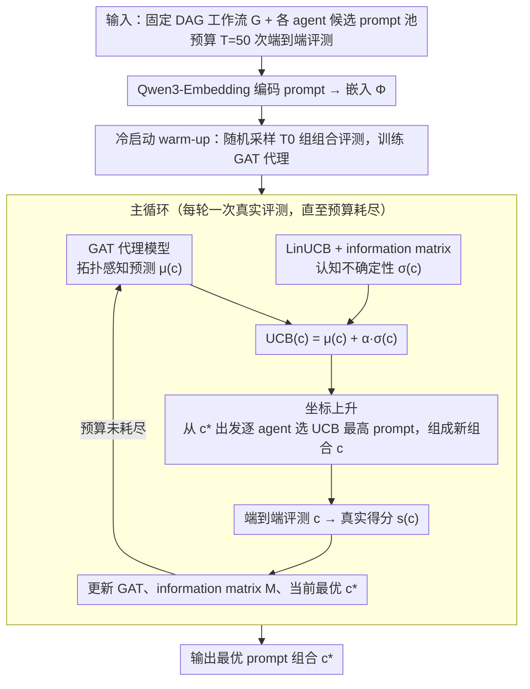

# MASPOB: 用 GNN 代理 + LinUCB + 坐标上升做多智能体提示优化

**会议**: ICML 2026 Spotlight  
**arXiv**: [2603.02630](https://arxiv.org/abs/2603.02630)  
**代码**: https://github.com/HZ1008/MASPOB  
**领域**: 多 Agent / 提示优化 / 贝叶斯优化  
**关键词**: MAS, prompt optimization, GAT, LinUCB, 坐标上升, 黑盒优化

## 一句话总结
MASPOB 把多智能体系统的 prompt 优化看作预算紧缩的黑盒优化，用 GAT 代理模型捕获 workflow topology 下的 prompt 耦合、用 LinUCB 在嵌入空间算 epistemic uncertainty、用坐标上升把联合搜索拆成序贯单体问题，复杂度从 $\mathcal{O}(\prod |\mathcal{P}_i|)$ 降到 $\mathcal{O}(\sum |\mathcal{P}_i|)$；在 6 个基准（QA/Code/Math）上平均 80.58 超越 MIPRO 78.87、AFlow 78.52、IO 68.56。

## 研究背景与动机

**领域现状**：LLM 多智能体系统（MAS）让多个专业 agent 协同完成复杂任务。MAS 性能不仅取决于 LLM 本身，也取决于 workflow topology 和 agent prompts。AFlow、GPTSwarm 等探索自动化 topology，但很多 workflow 经过专家验证和安全审查不能改，所以优化 prompt 是唯一可行的提升手段。

**现有痛点**：MAS 上的 prompt 优化是三重挑战的组合黑盒问题——(1) 评估昂贵：一次评测要跑完整 end-to-end MAS 含多次 LLM 调用；(2) topology-induced coupling：上游 agent 的 prompt 变了，下游 agent 的 input 分布也变，objective 不可分解；(3) combinatorial explosion：N 个 agent 的联合 prompt 空间是 Cartesian product。

**核心矛盾**：现有 prompt optimizer 要么 single-agent（OPRO/PromptBreeder/Instinct）独立优化忽略 topology，要么 multi-stage 但用 implicit dependency 建模（MIPRO 用 TPE）几乎 topology-agnostic。在 budget=50 评测、prompt 空间指数增长的现实下，sample-inefficient 且 miss 高质量 coordinated combinations。

**本文目标**：同时解决三重挑战——sample-efficient 探索、topology-aware 建模、scalable combinatorial 搜索。

**切入角度**：把 prompt 优化 reframe 为 contextual bandit：UCB 提供 explore/exploit 平衡；GNN 作 surrogate 捕获 inter-agent dependency；coordinate ascent 把组合优化拆成序贯单体，复杂度从 $O(\prod |\mathcal{P}_i|)$ 降到 $O(\sum |\mathcal{P}_i|)$。

**核心 idea**：三件套。GAT 消息传递得 topology-aware $\mu(c)$；information matrix $\mathbf{M}$ 算 uncertainty $\sigma(c) = \sqrt{\Phi(c)^\top \mathbf{M}^{-1} \Phi(c)}$；UCB $= \mu(c) + \alpha \sigma(c)$ 引导搜索；坐标上升每轮逐个优化单 agent prompt。

## 方法详解

### 整体框架

MASPOB 要在一个已经固定、不能改拓扑的多智能体 workflow 上，只动各 agent 的 prompt 把整体任务性能拉高，而且全程只给 $T=50$ 次端到端评测预算。它把 workflow 建模成 DAG $\mathcal{G} = (\mathcal{V}, \mathcal{E})$，$N$ 个 agent 各绑一个候选 prompt 池 $p_i \in \mathcal{P}_i$，目标是找 $c^* = \arg\max_c s(c)$。整条流程分三段：先用 $T_0$ 轮随机采样 + 评测把 GAT 代理模型冷启动训起来；然后进入主循环，每轮以当前最优组合 $c^*$ 为起点、用坐标上升逐个 agent 挑出 UCB 最高的 prompt 组成一个新组合 $c$，再花一次真实评测验证它；评完用新数据更新 GAT、information matrix 和当前 incumbent，循环到预算耗尽。文本侧用 Qwen3-Embedding-8B 把 prompt 编码成向量，MAS backbone 是 GPT-4o-mini。

### 关键设计

**1. GAT 代理模型：把"改一个 prompt 牵动全局"建进预测里**

MAS 上 prompt 优化最棘手的地方是 topology-induced coupling——上游 agent 的 prompt 一改，它产出的内容变了，下游 agent 的输入分布跟着变，整个目标函数不可分解。OPRO、PromptBreeder 这类方法干脆把 MAS 当纯黑盒，MIPRO 用 TPE 隐式建模依赖但很弱。MASPOB 直接把 workflow 拓扑当成 surrogate 的归纳偏置：每个 agent 是一个 node，node feature 取它当前 prompt 的嵌入 $\Phi(p_i)$，边就是 workflow 的依赖关系再加 self-loop。多头 GAT 在这张图上做消息传递 $\mathbf{h}_i^{(l+1)} = \|_{k=1}^K \sigma(\sum_{j \in \mathcal{N}(i) \cup \{i\}} \alpha_{ij}^{(k)} \mathbf{W}^{(l,k)} \mathbf{h}_j^{(l)})$，注意力权重 $\alpha_{ij}^{(k)}$ 由 leaky-ReLU 加 softmax 归一化算出，最后对所有节点 mean pool 再过 MLP 得到对整组组合的性能预测 $\mu(c)$。这样"prompt 变化沿着拓扑传播"被显式编码进网络，attention 还能自动学到哪条 edge 对性能更关键，比把 MAS 当黑盒的隐式建模精准得多。

**2. LinUCB + information matrix：在 50 次预算里量化"这组没见过"**

评测一次要跑完整 end-to-end MAS、烧掉好几次 LLM 调用，预算紧到只能采 50 个点，所以必须 sample-efficient——光信 GAT 预测分最高的（纯 exploit）会一头扎进局部最优，得给"没探索过的组合"加分。MASPOB 借用 LinUCB 的经典工具 information matrix $\mathbf{M} \in \mathbb{R}^{Nd \times Nd}$，初始化为 $\lambda \mathbf{I}$，每评测完一个组合就累加 $\mathbf{M} \leftarrow \mathbf{M} + \Phi(c)\Phi(c)^\top$。一个组合的整体嵌入是各 agent prompt 嵌入的拼接 $\Phi(c) = [\Phi(p_1); \dots; \Phi(p_N)] \in \mathbb{R}^{Nd}$，它的 epistemic uncertainty 就是 $\sigma(c) = \sqrt{\Phi(c)^\top \mathbf{M}^{-1} \Phi(c)}$——落在已采样方向上的组合 $\sigma$ 小，方向新颖的组合 $\sigma$ 大。两者合成采集函数 $\mathrm{UCB}(c) = \mu(c) + \alpha\sigma(c)$，让"GAT 觉得好"和"还没探过"两股力量自然平衡，不用像 ε-greedy 那样手调探索率。

**3. 坐标上升：把指数级联合搜索拆成线性的逐 agent 搜索**

就算有了便宜的 UCB 采集函数，要在 $N$ 个 agent 的全联合空间里挑最优组合，候选数是 Cartesian 积 $\prod_i |\mathcal{P}_i|$，随 agent 数指数爆炸，根本算不过来。MASPOB 用坐标上升把这步降维：从当前最优 $c^*$ 出发，固定其余 agent 不动，只对第 $i$ 个 agent 扫它自己的 $|\mathcal{P}_i|$ 个候选挑 UCB 最高的，$p_i^* \leftarrow \arg\max_{p \in \mathcal{P}_i} \mathrm{UCB}(p_1^*, \dots, p_{i-1}^*, p, p_{i+1}^*, \dots, p_N^*)$，依次走完所有 agent，总枚举量从 $\mathcal{O}(\prod_i |\mathcal{P}_i|)$ 降到 $\mathcal{O}(\sum_i |\mathcal{P}_i|)$。关键在于这一整轮坐标上升里的每次 UCB 比较只需 forward 一遍 GAT、不跑真实 MAS，几乎零成本；真正昂贵的端到端评测只在每轮选定新组合后跑一次。把"便宜的代理 forward"和"贵的真实评测"切开分配算力，正是它在 50 次预算下还能找到协同组合的原因。

## 实验关键数据

### 主实验：6 个基准（GPT-4o-mini，3 次平均）

| 方法 | HotpotQA | DROP | HumanEval | MBPP | GSM8K | MATH | 平均 |
|------|---|---|---|---|---|---|---|
| IO | 60.36 | 53.09 | 89.31 | 69.11 | 87.80 | 51.71 | 68.56 |
| CoT | 67.62 | 58.27 | 89.57 | 69.89 | 88.34 | 52.47 | 71.03 |
| ReAct | 65.61 | 67.25 | 87.79 | 66.08 | 88.91 | 52.61 | 71.38 |
| PromptBreeder | 68.76 | 71.85 | 88.80 | 70.38 | 91.97 | 52.13 | 73.98 |
| Instinct | 69.92 | 71.90 | 90.08 | 70.23 | 92.64 | 52.40 | 74.53 |
| AFlow | 73.42 | 79.48 | 91.09 | 79.96 | 93.36 | 53.83 | 78.52 |
| MIPRO | 74.37 | 79.13 | 91.35 | 80.65 | 92.80 | 54.90 | 78.87 |
| **MASPOB** | **75.43** | **82.28** | **94.15** | **80.65** | **93.90** | **57.05** | **80.58** |

MASPOB 在 6 个任务里 5 个 SOTA，平均 80.58 vs MIPRO 78.87（+1.71）vs IO 68.56（+12.02）。

### 复杂 topology 实验

在 AFlow 自动生成的更大 topology（HotpotQA 8 agents, DROP 7, HumanEval 7）上 MASPOB 仍是最高，且优势随 agent 数量放大——验证 GAT 显式 topology 建模的针对性价值。

### 关键发现

- **平均 +12% 相对 IO**：prompt 优化整体能拉 +12 分；MASPOB 再 +1.7 分 vs MIPRO。
- **MATH 任务上最大改善**：数学推理需要多步逻辑链，topology coupling 最强；MASPOB MATH +2.15 vs MIPRO。
- **HumanEval 94.15**：代码生成天花板被推到 94.15，对工业最关心场景特别有效。
- **同 budget 下胜出**：所有方法用同样 50 评估预算，MASPOB 的 sample-efficiency 是真实优势。

## 亮点与洞察

- **三个挑战 → 三个机制的清晰对应**：sample 贵 → UCB；topology coupling → GAT；combinatorial → coordinate ascent。每个 component 解一个具体痛点。
- **GNN as surrogate for prompt opt**：第一次把 workflow topology 当作 inductive bias 注入 surrogate，是方法学创新。
- **LinUCB 在 prompt embedding 空间**：把 contextual bandit 工具搬到 LLM prompt 优化，无需手调 ε。
- **Coordinate ascent + cheap UCB forward**：把"贵评估"和"便宜代理 forward"分开是巧妙算力分配。
- **6 个 benchmark 跨 3 领域**：QA + Code + Math 都覆盖，不挑任务。
- **可适配其他 multi-agent systems**：思路可推广到其他 combinatorial design space 上做 sample-efficient 优化的场景。

## 局限与展望

- **依赖 workflow 已固定**：假设 topology 已设计好，只优化 prompt——但这恰好是问题设定前提。
- **GAT 训练数据少**：50 评估总样本对 GNN 偏少，可能 overfit；warmup $T_0$ 选取需调。
- **Prompt embedding 质量依赖 Qwen3-Embedding**：固定 encoding 可能限制 GAT 表达能力。
- **没跟 DSPy / TextGrad 对比**：缺 RL-style 和 gradient-based baseline。
- **只用 GPT-4o-mini**：更强 LLM 下的 marginal gain 未知。
- **没 long-horizon stability**：500+ 评估预算是否还保持优势未知。
- **理论 regret 分析缺失**：LinUCB 在组合空间下的 regret bound 未给。

## 相关工作与启发

- **vs OPRO / PromptBreeder / Instinct**：single-agent 忽略 topology；MASPOB 用 GAT 显式建模。
- **vs MIPRO**：multi-stage 用 TPE，dependency 是 implicit；MASPOB explicit。
- **vs AFlow / GPTSwarm**：他们优化 topology，本文优化 prompt；正交可结合。
- **vs Bayesian Optimization**：经典 BO 用 GP surrogate；MASPOB 用 GNN 更适合 structured combinatorial space。
- **启发**：(1) structured discrete space 上的 sample-efficient 黑盒优化都可试 GNN-surrogate + UCB；(2) coordinate ascent + cheap surrogate forward 是 combinatorial 问题通用技巧；(3) workflow topology 是 inductive bias 来源，应纳入 prompt opt 等下游建模。

## 评分

- 新颖性: ⭐⭐⭐⭐⭐ GNN surrogate + LinUCB + coordinate ascent 三件套组合应用到 MAS prompt opt 是方法学创新。
- 实验充分度: ⭐⭐⭐⭐ 6 基准跨 3 领域 + 7 baseline + 复杂 topology 实验扎实；缺 RL-style 和大模型 backbone。
- 写作质量: ⭐⭐⭐⭐⭐ 问题动机清晰（三重挑战）、方法对应（三件套）、伪代码可复现。
- 价值: ⭐⭐⭐⭐⭐ 直接服务 MAS 部署痛点（workflow 固定 + prompt 优化），开源代码降门槛，对生产环境 LLM agent 系统有实战价值。

<!-- RELATED:START -->

## 相关论文

- [\[ICML 2026\] OMAC: A Holistic Optimization Framework for LLM-Based Multi-Agent Collaboration](omac_a_holistic_optimization_framework_for_llm-based_multi-agent_collaboration.md)
- [\[ICML 2026\] E-mem: Multi-Agent Based Episodic Context Reconstruction for LLM Agent Memory](e-mem_multi-agent_based_episodic_context_reconstruction_for_llm_agent_memory.md)
- [\[ICML 2026\] CoOT: Learning to Coordinate In-Context with Coordination Transformers](coot_learning_to_coordinate_in-context_with_coordination_transformers.md)
- [\[ICML 2026\] Systematic Failures in Collective Reasoning under Distributed Information in Multi-Agent LLMs](systematic_failures_in_collective_reasoning_under_distributed_information_in_mul.md)
- [\[ICML 2026\] When Cloud Agents Meet Device Agents: Lessons from Hybrid Multi-Agent Systems](when_cloud_agents_meet_device_agents_lessons_from_hybrid_multi-agent_systems.md)

<!-- RELATED:END -->
