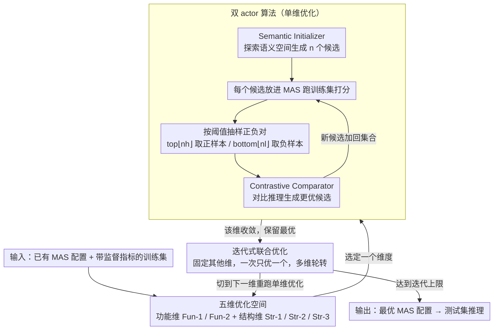

# OMAC: A Holistic Optimization Framework for LLM-Based Multi-Agent Collaboration

**会议**: ICML 2026  
**arXiv**: [2505.11765](https://arxiv.org/abs/2505.11765)  
**代码**: https://github.com/xiwenchao/OMAC  
**领域**: LLM Agent / 多智能体系统 / 代码生成  
**关键词**: 多智能体系统、协同优化、对比推理、提示进化、监督优化

## 一句话总结
本文把多智能体系统的优化空间形式化为五个维度（两个功能维度 + 三个结构维度），用"Semantic Initializer 生成 + Contrastive Comparator 对比改进"的双 actor 算法在每个维度上做监督式优化，再迭代联合优化多个维度，在 HumanEval / MMLU / MATH 上稳定打败 DyLAN、ADAS、AFlow 等基线。

## 研究背景与动机

**领域现状**：多智能体系统（MAS）已在代码生成（AgentVerse）、推理（LLM Debate）、决策（Sun 2024）等任务上展示出超越单 agent 的能力。但现有 MAS 大都靠人工设计——agent 角色用人类先验或 LLM 直接生成，协作结构用固定的中心化/去中心化/层次化拓扑。少数自动化工作如 DyLAN（动态选 agent 团队组成）、ADAS（提示进化）、AFlow（MCTS 架构搜索）、G-Designer/MaAS（架构搜索）也只优化单一方面。

**现有痛点**：（1）DyLAN 用无监督的 "agent importance score"，缺乏从训练数据导出的监督信号；（2）ADAS / AFlow / G-Designer / MaAS 只优化某一个方面（提示 *或* 架构）；（3）这些方法都不能同时改 agent 功能（提示/few-shot）和协作结构（候选选择 / 动态参与 / 通信流），缺少统一框架。

**核心矛盾**：MAS 本质上是一张信息流图——节点（agent）和边（通信链路）都可优化，但现有方法要么只动节点要么只动边，并且没有一个通用算法可以同时处理这两类。

**本文目标**：构造一个统一框架，能用同一个算法监督式地优化 MAS 的任何一个维度，并能迭代联合优化多个维度。

**切入角度**：把 MAS 的协作过程概念化为信息流图后，作者识别出 5 个核心可优化维度——2 个关于节点（agent）功能，3 个关于图（结构）；并发现这 5 个维度都可以归结为"优化一段 LLM 的指令提示（外加可选的 few-shot 示例）"。

**核心 idea**：用一对 LLM 驱动的 actor——Semantic Initializer 探索语义空间生成多样化的初始提示集合，Contrastive Comparator 对比高低分对子的差异生成更优提示——在每个维度上做监督式对比推理优化，再用"一次一维度"的迭代策略联合多个维度。

## 方法详解

### 整体框架
OMAC 接收一个已有的 MAS 配置（多个 agent + 协作拓扑）和一个带监督指标的训练集（如 HumanEval 的 Pass@1），输出一套被优化过的提示。它的关键洞察是：MAS 里所有"可调的东西"——agent 的提示、新加的 agent、谁参与协作、信息怎么流——本质上都是在调一段自然语言指令，因此可以用**同一个算法**统一处理。具体分两层：下层是一个**单维度优化算法**，盯住 5 个维度中的某一个反复试错；上层是**多维度联合优化**，按"固定其他、一次只优一个"的方式在多个维度间轮转，把单维度的收益叠起来。

### 关键设计

**1. 五维优化空间：把 MAS 拆成一张可调的信息流图**

以前每篇 MAS 优化论文都自己定义"优化什么"——DyLAN 调候选选择、ADAS/AFlow 主要做架构搜索，各管一摊、没有公共坐标系。OMAC 把 MAS 看成一张信息流图：节点是 agent、边是通信链路，于是优化空间自然落到两类、共 5 个互不重叠的维度上。**功能维度**管节点能力——Fun-1 优化已有 agent 的提示和 few-shot 示例，Fun-2 构造全新 agent；**结构维度**管图的形状——Str-1 是全局的候选 agent 选择控制器（谁进团队），Str-2 是每一步的动态参与控制器（这一轮谁发言），Str-3 是 agent 间的通信流控制器（边怎么路由）。关键在于这 5 个维度都能归结为"优化一段 LLM 提示"，所以同一个算法换个上下文描述就能套用；而且作者发现 5 维各有独立、可叠加的提升空间，不是此消彼长。

**2. 双 actor 算法：Semantic Initializer 探索 + Contrastive Comparator 利用**

光让 LLM 生成提示是无监督探索，白白浪费了训练集上的分数信号。OMAC 把"性能差"变成监督信号：Semantic Initializer 先接收上下文（任务描述 + 当前 MAS 配置 + 该维度的规格 + 一个 one-shot 示例），在保持功能不变的前提下做语义空间的多样化生成，吐出 $n$ 个候选；每个候选放进 MAS 跑一遍训练集拿到分数，再按上下阈值抽样——从 top-$\lfloor n h \rfloor$ 取一个正样本、从 bottom-$\lfloor n l \rfloor$ 取一个负样本——把这对正负样本交给 Contrastive Comparator。后者做对比推理："为什么 A 比 B 好？把 A 的优点强化、把 B 的毛病去掉，生成一个比 A 还好的版本"，新候选加回集合再循环。这等于用 LLM 自身的归因能力做了一次轻量、不需要梯度的"伪 RL"；之所以一对样本里只让一个维度变化，就是为了让 Comparator 能干净地把性能差异归因到具体改动上。

**3. 迭代式联合优化：一次只动一维，避免归因混乱**

5 个维度同时优化会组合爆炸，更糟的是会让 Comparator 失去归因能力——多个变量一起变，LLM 就说不清到底是哪个改动带来了提升。OMAC 选择串行迭代：先对每个维度独立跑单维优化、挑出收益最大的几个，联合时对 dim-1 跑完单维优化保留最优 → 切到 dim-2 在固定 dim-1 的前提下再跑单维优化 → 回到 dim-1……直到迭代上限。这样每次对比对子里始终只有一个维度在变、其他保持当前最优，差异原因可解释。作者用 ablation 量化了这一点：让 Comparator 同时推理多个变化维度时，性能提升明显更小、方差更大；实践中"选两个收益最大的功能维度联合"或"最强功能 + 最强结构维度联合"效果最好。

### 一个完整示例：在 MATH 上优化 Fun-1
拿 MATH 任务的默认 4-agent MAS 走一遍单维度优化（优化 Fun-1，即改写某个 agent 的提示）。Semantic Initializer 先生成 3 个语义不同的提示候选——比如 P1 强调"逐步列出中间式"、P2 强调"先估算量级再精算"、P3 强调"算完回代验证"。三者各自放进 MAS 跑训练集，拿到 Accuracy 34.0 / 31.2 / 33.5。按阈值 $l=h=0.5$，P1（34.0，最高）当正样本、P2（31.2，最低）当负样本送进 Contrastive Comparator；它推理出"P1 的中间式让验证有据可依，而 P2 的量级估算在算术题上反而引入近似误差"，于是合成 P4——保留逐步列式、去掉粗估、补上回代验证。P4 跑出 35.0，进入集合成为新的最优。迭代上限 3 轮内重复抽样—对比—合成，最终该维度收敛到 35.17，相对默认 MAS 提升约 4.9%。若再联合一个结构维度（如 Str-3），就固定这个已优化的 Fun-1 提示，切到 Str-3 重跑同一套流程，把两维收益叠到约 9.6%。

### 损失函数 / 训练策略
OMAC 不更新任何模型参数，全部"优化"都发生在提示层面。监督信号就是 MAS 在训练集上的任务指标（HumanEval Pass@1 / MMLU Accuracy / MATH Accuracy）。基础 LLM 用 gpt-3.5-turbo-1106，温度 0.8；Semantic Initializer 每轮生成 3 个候选；对比推理迭代上限 3；阈值 $l=h=0.5$；每个实验跑 3 次报均值±标差。

## 实验关键数据

### 主实验
基准任务：HumanEval（代码生成，Pass@1）、MMLU（通用推理，Accuracy）、MATH（算术推理，Accuracy）。默认 MAS 配置来自 DyLAN（代码 7 agent、推理 7 agent、算术 4 agent），全连通拓扑。

| 任务 | 最强基线 | 基线分数 | OMAC 单维最高 | 维度 |
|------|---------|---------|--------------|------|
| HumanEval (Pass@1) | AFlow | 85.63 | 89.25 ± 1.30 | Fun-1.4 |
| MMLU (Accuracy) | ADAS | 69.02 | 74.22 ± 2.22 | Fun-1.4 |
| MATH (Accuracy) | AFlow | 32.49 | 35.17 ± 1.96 | Fun-1.1 |

联合优化（MATH 任务上 3 次迭代）：

| 优化策略 | 性能提升（相对默认 MAS） |
|---------|----------------------|
| 单维度最佳 | ~2.9% |
| 两个最强维度联合迭代 3 轮 | ~9.6% |

### 消融实验
OMAC-C：去掉 Contrastive Comparator，只用 Semantic Initializer 生成初始集合后选最高分。

| MATH 维度 | OMAC-C | OMAC | Comparator 收益 |
|----------|--------|------|---------------|
| Str-1 | 32.64 | 33.34 | +0.70 |
| Str-2 | 32.67 | 33.41 | +0.74 |
| Str-3 | 32.76 | 33.70 | +0.94 |
| Fun-1.1 | 34.20 | 35.17 | +0.97 |
| Fun-2 | 32.71 | 33.95 | +1.24 |

### 关键发现
- **5 个维度都有独立提升空间**：单维度优化平均收益分别是 HumanEval 3.6%、MMLU 2.8%、MATH 4.9%，证明 5 维划分确实捕获了正交的优化方向。
- **功能维度通常比结构维度收益更大**：Fun-1.x 在三个任务上都给出了最高的单维度提升，说明改 agent 提示比改协作拓扑更直接。
- **联合优化收益超过单维度之和**：MATH 上单维度最高 2.9% → 联合 9.6%，说明结构和功能优化存在协同。"选最强两个维度" 策略稳定优于随机两个或最弱组合。
- **Comparator 不可或缺**：去掉对比推理后 OMAC-C 在所有维度都掉点，证明监督式对比推理比单纯探索更高效；但 OMAC-C 仍超过 DyLAN，说明 Semantic Initializer 的多样化探索本身就有价值。
- **降低推理成本**：动态 agent 选择 + 通信流优化让 OMAC 在推理时通常使用比基线更少的 agent，显著降低 token 消耗。

## 亮点与洞察
- **把 MAS 优化空间形式化为 5 维坐标系**：以前每篇 MAS 优化论文都在自己定义"什么是优化"，本文给出一个清晰的图论坐标系（节点能力 × 图结构）覆盖既有工作，分类干净易扩展。
- **对比推理作为轻量监督信号**：不需要梯度、不需要 RL 训练，只用 LLM 本身的推理能力把"性能差"翻译成"提示改进"，几乎是个通用范式，可以迁移到任何"优化某段自然语言"的场景。
- **"一次一维度"的迭代准则**：这个看似简单的工程选择背后是对 LLM 归因能力局限的清醒认识——同时变多个变量会让 LLM 给出错误的因果归因，论文用 ablation 量化了这一点。
- **可与任何 MAS 基础设计互补**：OMAC 的输入是"已有 MAS 配置"，输出是"优化后的 MAS"，所以任何手工设计的 MAS（包括未来更复杂的）都可以套上 OMAC 再提升。

## 局限与展望
- **依赖训练集监督信号**：对没有明确指标的开放性任务（如开放对话质量、长程 agent 规划）不直接适用，作者只在 GAIA 等开放任务上做了少量补充实验。
- **优化质量受 LLM 自身推理能力限制**：作者用 GPT-3.5 做主实验，更弱的 LLM 当 Comparator 时对比推理可能不稳；附录有 GPT-4 实验但篇幅不够展开。
- **联合优化的组合爆炸**：5 维全部联合的算力是单维的 $5^k$ 倍（$k$ 是迭代轮数），所以只能选最优两三维度，没法做真正全面的联合优化。
- **没考虑 agent 之间的角色冲突**：Fun-2（新建 agent）后 MAS 里可能出现职责重叠或矛盾，论文没讨论如何检测和处理。
- **训练数据子集采样策略经验化**：附录提到用训练数据子集而非全集评估候选可以省算力，但子集规模和采样策略缺乏理论分析。

## 相关工作与启发
- **vs DyLAN (2024)**：DyLAN 用无监督的 Agent Importance Score 仅优化候选选择（Str-1）；OMAC 用监督式对比推理覆盖 5 个维度，且对 Str-1 也比 DyLAN 强。
- **vs ADAS / AFlow**：这两者主要做架构搜索（提示进化 / MCTS），优化 Fun-2 + 部分 Str-3；OMAC 用更轻量的对比推理算法在更广维度上一致更优。
- **vs G-Designer / MaAS**：纯结构搜索方法；OMAC 在结构维度上不弱（Str-1/2/3 都打败它们），且额外能优化功能维度。
- **vs gradient-based 方法（SFT / prompt tuning）**：单 agent 优化思路，无法处理 MAS 多步协作；OMAC 不需要梯度、用 LLM 推理能力替代。
- **vs RL-based MAS 优化（Shao 2024, Liu 2025）**：往往局限于单步交互或共享策略；OMAC 处理多步、角色专用 MAS 更自然。

## 评分
- 新颖性: ⭐⭐⭐⭐ 五维划分和对比推理双 actor 算法是清晰的概念贡献，虽然单个组件不算颠覆但组合产生新范式。
- 实验充分度: ⭐⭐⭐⭐ 3 个经典 benchmark + 2 个困难 benchmark（MBPP/GAIA）+ ablation + 多基线对比，超参研究也比较完整。
- 写作质量: ⭐⭐⭐⭐ 框架清晰、图示直观，公式不多但每个设计的"为什么"都说清楚了。
- 价值: ⭐⭐⭐⭐ 对实战 MAS 是即插即用的优化套件，且范式可迁移到任何"优化自然语言指令"的场景。

<!-- RELATED:START -->

## 相关论文

- [\[ICML 2026\] MASPO: Joint Prompt Optimization for LLM-based Multi-Agent Systems](maspo_joint_prompt_optimization_for_llm-based_multi-agent_systems.md)
- [\[ICML 2026\] MAS-Orchestra: Understanding and Improving Multi-Agent Reasoning Through Holistic Orchestration and Controlled Benchmarks](mas-orchestra_understanding_and_improving_multi-agent_reasoning_through_holistic.md)
- [\[NeurIPS 2025\] R&D-Agent-Quant: A Multi-Agent Framework for Data-Centric Factors and Model Joint Optimization](../../NeurIPS2025/multi_agent/rd-agent-quant_a_multi-agent_framework_for_data-centric_factors_and_model_joint_.md)
- [\[ACL 2026\] ATLAS: Adaptive Trading with LLM AgentS Through Dynamic Prompt Optimization and Multi-Agent Coordination](../../ACL2026/multi_agent/atlas_adaptive_trading_with_llm_agents_through_dynamic_prompt_optimization_and_m.md)
- [\[ACL 2026\] LLM-Based Human-Agent Collaboration and Interaction Systems: A Survey](../../ACL2026/multi_agent/llm-based_human-agent_collaboration_and_interaction_systems_a_survey.md)

<!-- RELATED:END -->
