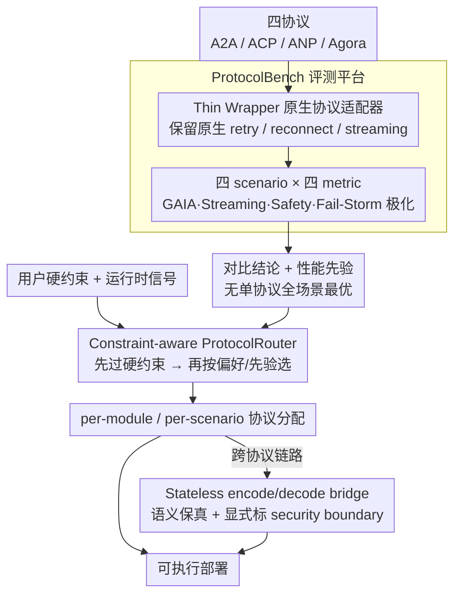

# ProtocolBench: Which LLM MultiAgent Protocol to Choose?

**会议**: ICML 2026  
**arXiv**: [2510.17149](https://arxiv.org/abs/2510.17149)  
**代码**: 待确认  
**领域**: 多智能体 / 协议评测 / LLM 系统  
**关键词**: 多智能体协议, A2A / ACP / ANP / Agora, 协议路由, 失败恢复, 端到端延迟

## 一句话总结
ProtocolBench 首次系统对比四大 LLM 多智能体通信协议（A2A、ACP、ANP、Agora）在任务成功、端到端延迟、消息字节开销、失败鲁棒性四轴上的表现——发现协议选择对系统行为有 36.5% 完成时间差、3.48s 延迟差；进一步提出 ProtocolRouter 按场景/模块动态选协议，将 Fail-Storm 恢复时间降 18.1%。

## 研究背景与动机

**领域现状**：LLM 多智能体系统正从研究 prototype 走向生产（CAMEL、ChatDev、MetaGPT、AutoGen）。底层通信靠 protocol：A2A（Google）、ACP（IBM BeeAI）、ANP、Agora 等百花齐放；MCP 管工具调用、IoA 管动态发现各负其责。

**现有痛点**：协议选择基本靠直觉，缺乏标准化指南：（1）现有 benchmark 假设固定通信机制只看任务级结果（Zhu 2025、Hyun 2025），把 protocol 当黑盒；（2）协议选择同时影响任务成功 + 延迟 + 字节 + 失败鲁棒性，trade-off 紧耦合无法各看各的；（3）公平对比难——需要钉住非协议因素（模型、prompt、硬件、限流）但又不能加抽象层屏蔽协议原生 retry/reconnect/streaming 行为；（4）大空间（协议×topology×scale+动态故障）需要轻量统一日志。

**核心矛盾**：实践者要"哪个协议好"的答案，但答案严重 scenario-dependent（GAIA 上某个赢、Streaming 上另一个赢、Fail-Storm 上又不同）；没有任何单协议在所有场景都最优。这意味着真正需要的是"按场景选/合成"而非"选一个最优"。

**本文目标**：（1）公平、可复现的协议评测——保持原生行为不引入抽象层；（2）4 个核心轴 + 4 个 scenario 覆盖核心 use case；（3）超越评测——给出 router 把协议选择自动化。

**切入角度**：用 thin wrappers 包原生协议实现（不替换其内部 retry/streaming 逻辑），统一日志和 metric；scenario 覆盖任务质量（GAIA）、延迟吞吐（Streaming Queue）、安全（Safety Tech）、失败恢复（Fail-Storm Recovery）；router 用 constraint-aware 选择算法，把 protocol 选择当成可学习问题。

**核心 idea**：把"选哪个协议"从隐式默契变成可量化、可路由的工程决策；router 不替换协议，只做 selection + 跨协议 stateless encode/decode bridge。

## 方法详解

### 整体框架

这篇工作分两块：一个评测平台 ProtocolBench 和一个建在它之上的协议路由器 ProtocolRouter。ProtocolBench 把 A2A、ACP、ANP、Agora 四个协议放进同一套 thin wrapper，在四个刻意极化某个维度的 scenario（GAIA 看任务质量、Streaming Queue 看延迟吞吐、Safety Tech 看安全、Fail-Storm Recovery 看故障恢复）下跑同样的工作负载，沿四条 metric 轴（任务成功/质量、端到端延迟/吞吐、消息字节开销、故障期鲁棒性）统一记录。这套评测先得出"无单协议全场景最优"的结论，并沉淀出每个协议的性能先验。ProtocolRouter 则把"该选哪个协议"从隐式默契变成一个约束优化问题——以评测得到的先验加上用户约束和运行时信号，按 scenario 甚至按 module 动态挑协议，并用 stateless bridge 在协议间翻译消息，让选择结果直接可执行。

### 关键设计

**1. Thin Wrapper 包原生协议：评测时不抹掉协议自己的脾气**

公平对比协议有个反直觉的陷阱——以往 benchmark 习惯加一层抽象把所有协议统一成"通用 RPC"，结果 A2A 的 streaming、ANP 的重连这些差异化能力全被屏蔽了，而它们恰恰是协议设计的核心区别。本文反其道而行：每个协议套一层 thin wrapper 只暴露统一接口，内部完全调用原生 SDK，原生的 retry / reconnect / streaming 行为一律保留不动。在此之上钉死统一的 logging schema 让四条 metric 轴可比，再让所有协议跑同一套 shared scenario suite（共享模型、prompt、硬件、限流），把非协议因素全部对齐。这样测出来的差距才真正归因于协议本身，而不是抽象层的副作用。

**2. 四 scenario × 四 metric：用极化场景把耦合的 trade-off 拆开看**

协议选择会同时牵动任务成功、延迟、字节、故障鲁棒四个维度，而这四者紧耦合——单个 scenario 评测只会引导大家朝单一 metric 优化，把 trade-off 藏起来。本文让每个 scenario 各给一条 metric 当"主场"：GAIA 极化任务质量、Streaming Queue 极化延迟吞吐、Safety Tech 极化安全合规、Fail-Storm Recovery 极化故障鲁棒。于是"在哪个场景下哪个协议占优"被强制暴露出来——实验里 A2A 拿下 GAIA 和 Fail-Storm、ACP 拿下 Streaming，没有任何协议通吃。这套被极化的对比信号同时也成了 router 的决策依据。

**3. Constraint-aware ProtocolRouter：把选协议形式化成带约束的选择**

既然没有单协议全场景最优，静态选一个就必然在某些场景吃亏，动态路由才是必要的。Router 把选择形式化为约束优化：给定用户的硬约束（如延迟 $<10\text{s}$、恢复时间 $<5\text{s}$、某个 safety boundary）加上运行时信号（当前负载、故障状态），在四个协议候选里挑最优；粒度既可以 per-scenario，也可以 per-module——比如 retrieval 阶段用低延迟的 ACP、recovery 阶段切到强鲁棒的 A2A。难点在于切协议不能破坏现有应用，所以 router 在 adapter 内部用 stateless encode/decode bridge 跨协议翻译消息，保住 application semantics，同时把 security boundary 的变化显式标出来。它只做 selection 和 composition，从不改协议内部，因此输出可以直接落到生产。

## 实验关键数据

### GAIA Document QA（任务质量极化）

| 协议 | Quality↑ | Success↑ |
|------|--------|---------|
| **A2A** | **2.51** (+7.7%) | **9.29** (+27.6%) |
| ACP | 2.33 | 7.28 |
| ANP | 2.21 | 6.94 |
| Agora | 2.18 | 6.81 |

A2A 在 GAIA 上明显占优（quality +7.7%、success +27.6%）。

### Streaming Queue（延迟极化）

| 协议 | Mean Latency (s)↓ | Variance↓ | 完成时间(min)↓ |
|------|----------------|---------|------------|
| **ACP** | **9.66** | 最低 | **40.28** |
| A2A | 11.42 | 中 | 47.83 |
| ANP | 12.18 | 中 | 51.20 |
| Agora | 13.14 | 高 | **54.97** |

ACP 延迟最低 + 方差最小；Agora 反向；端到端完成差距高达 36.5%（40.28 vs 54.97 min）。

### Fail-Storm Recovery（鲁棒性极化）

| 协议 | 故障后/故障前 答案保留率 |
|------|------------------|
| **A2A** | **98.85%** (post 14.57 / pre 14.74) |
| ACP | 92.41% |
| ANP | 86.96% |
| Agora | 81.29% |

A2A 鲁棒性最强；Agora 在故障下损失 19%。

### ProtocolRouter 收益

| 任务 | 最佳单协议 baseline | **ProtocolRouter** | Δ |
|------|--------------|--------------|---|
| Fail-Storm 恢复时间 | A2A: 8.00s | **6.55s** | **−18.1%** |
| GAIA 成功 | A2A: 9.29 | **9.90** | +6.6% |

Router 不是 blanket-dominate（某些 metric 上 trade-off），但在显式约束下精准改善目标 metric。

### 关键发现
- **无单协议最优**：4 个 scenario 各有"主场协议"，A2A 在 GAIA / Fail-Storm、ACP 在 Streaming——证明 protocol 选择必须 scenario-dependent
- **协议选择影响巨大**：36.5% 完成时间差、3.48s 延迟差、17.56% 鲁棒性差——这些都是工程级的大差距，不是 noise
- **Router 在约束下精准优化**：通过 constraint-aware 选择降低 Fail-Storm 恢复时间 18.1%，证明 dynamic routing 是 viable approach
- **per-module 选择有空间**：不同 stage 用不同协议（如 retrieval 用 ACP 低延迟、recovery 用 A2A 强鲁棒）

## 亮点与洞察
- **首次系统量化"协议选择"这个被忽视维度**：以往 multi-agent 研究关注 agent 角色、prompt 设计、协作策略，本文揭示协议本身对系统行为有数量级影响——开启了"protocol-aware MAS 设计"这个新方向
- **公平评测的工程严谨性**：thin wrapper 保留原生 retry / streaming 行为是个关键设计决策——以往评测加抽象层后协议都"等价了"，本文方法论才真正可信
- **scenario-axis 解耦设计**：4 scenario × 4 metric 强制暴露 trade-off，让"在哪个场景该用哪个"成为可量化讨论；这套 evaluation framework 模板可推广到任何"多选项 + 多维度 trade-off"问题
- **Router 是 evaluation → action 的闭环**：不止评测告诉你"该选哪个"，还给出可执行的自动化机制；stateless bridges 让 router 在保 application semantics 下工作，可立即部署到生产

## 局限性 / 可改进方向
- 仅评 4 个主流协议；MCP / IoA / LMOS 等 adjacent 标准未纳入
- 4 scenario 偏典型场景，长尾 use case（如跨组织安全协商、动态 agent 发现）覆盖不足
- Router 现在是 constraint-aware rule-based，可考虑 RL-based 或 learned router
- 跨协议 stateless bridge 在某些 stateful 协议特性下可能丢信息（如 A2A 的 streaming session）
- 协议安全维度（认证、加密、零信任）评测较浅，需后续工作深入
- benchmark 数据集 fixed，未来新协议 / 新 scenario 出现需重测

## 相关工作与启发
- **vs MultiAgentBench（Zhu 2025）**：那个评测 agent 协作能力 fixing 协议；本文专门评协议
- **vs LangChain / LangGraph / AutoGen 等框架**：那些 hardcode 通信模式，本文揭示"通信模式"本身的差异化影响
- **vs 网络 protocol benchmark（TCP/HTTP 等）**：网络层有成熟评测体系；LLM 多智能体 protocol 长期缺位，本文填补
- **启发**：协议选择是个 first-class engineering decision，应有自动化工具；scenario-axis evaluation 模板对所有 "no one-size-fits-all" 的工具选择问题（向量库、checkpoint 格式、序列化协议等）都适用

## 评分
- 新颖性: ⭐⭐⭐⭐⭐ 首个系统的 LLM multi-agent protocol benchmark + router；填补社区空白
- 实验充分度: ⭐⭐⭐⭐⭐ 4 协议 × 4 scenario × 4 metric 全覆盖，数字翔实，trade-off 量化清晰
- 写作质量: ⭐⭐⭐⭐ Figure 1 框架图清晰；数字呈现稍密，但 take-home conclusion 明确
- 价值: ⭐⭐⭐⭐⭐ 直接服务生产部署的 multi-agent 工程实践；router 可立即采用；benchmark 将影响后续协议设计

<!-- RELATED:START -->

## 相关论文

- [\[ICLR 2026\] Which LLM Multi-Agent Protocol to Choose?](../../ICLR2026/multi_agent/which_llm_multi-agent_protocol_to_choose.md)
- [\[ICML 2026\] OMAC: A Holistic Optimization Framework for LLM-Based Multi-Agent Collaboration](omac_a_holistic_optimization_framework_for_llm-based_multi-agent_collaboration.md)
- [\[ICML 2026\] MASPO: Joint Prompt Optimization for LLM-based Multi-Agent Systems](maspo_joint_prompt_optimization_for_llm-based_multi-agent_systems.md)
- [\[ICML 2026\] E-mem: Multi-Agent Based Episodic Context Reconstruction for LLM Agent Memory](e-mem_multi-agent_based_episodic_context_reconstruction_for_llm_agent_memory.md)
- [\[ICML 2026\] Beyond Majority Voting: LLM Aggregation by Leveraging Higher-Order Information](beyond_majority_voting_llm_aggregation_by_leveraging_higher-order_information.md)

<!-- RELATED:END -->
