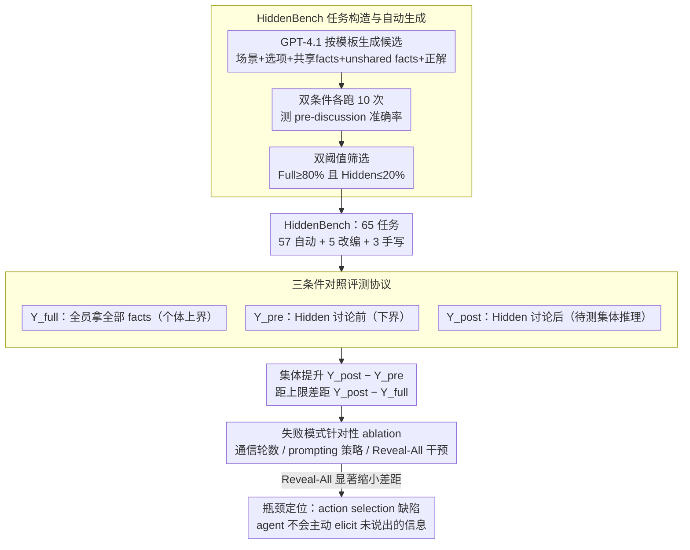

# Systematic Failures in Collective Reasoning under Distributed Information in Multi-Agent LLMs

**会议**: ICML 2026  
**arXiv**: [2505.11556](https://arxiv.org/abs/2505.11556)  
**代码**: HuggingFace + GitHub (有)  
**领域**: LLM Agent / 多智能体 / 集体推理评测  
**关键词**: HiddenBench、Hidden Profile、分布式信息、信息不对称、集体推理失败

## 一句话总结
本文将社会心理学的 Hidden Profile 范式搬到多智能体 LLM 评测里，构建 65 任务的 HiddenBench，在 15 个前沿 LLM 上系统揭示：单 agent 在 Full Profile 下能 80.7% 答对的同类任务，多 agent 在分布式信息下仅 30.1%，根本失败模式是**不会主动 elicit 别人没说出来的信息**，而轻量结构化沟通协议能跨家族大幅缓解。

## 研究背景与动机

**领域现状**：多 agent LLM 系统被越来越多地部署在软件开发、科研发现、社会模拟等场景，**核心承诺是"群体能整合比单 agent 更多的信息"**。这一假设让 multi-agent 范式被认为天然优于单模型。

**现有痛点**：现实里大量复现工作显示多 agent 经常不如单 agent，但**没有一个干净的评测能把"集体推理失败"与"个体推理不足"分开**——一个 group 答错了，到底是模型笨，还是信息整合机制烂？现有 benchmark 把两者混在一起，没办法做归因。

**核心矛盾**：要测"集体推理"本身，必须保证：(i) 任务个体单独看是**无解**的（这样才需要 group）；(ii) 把所有信息给一个 agent 又必须**有解**（排除"任务太难"这一干扰）。同时还要有 ground truth 可验证。

**本文目标**：把社会心理学的 Hidden Profile 范式工程化为可扩展的多智能体 benchmark，并系统刻画前沿 LLM 在分布式信息下的失败模式 + 是否可被简单协议挽救。

**切入角度**：Hidden Profile 是社心几十年来研究人类群体决策失败的经典范式——每个成员手里有不同的关键信息，必须 pooling 才能找出正解，否则共享信息会引导到错误答案。把它形式化为 LLM evaluation，天然满足"个体不能解、集体能解、有 ground truth"。

**核心 idea**：构造 HiddenBench（65 任务，5 改编自人类研究 + 3 手写 + 57 自动生成），对 15 个前沿 LLM 在 Hidden / Full Profile 双条件下评测，并通过 ablation 隔离失败的真正瓶颈——agents **可以**整合已说出的信息、但**不会**去主动 elicit 没说出的信息。

## 方法详解

### 整体框架
任务结构：每个任务由若干决策选项 + 若干 task-relevant facts 组成。**Hidden Profile 条件**下，部分 facts（$\mathcal{I}_s$）被所有 agent 共享，剩下 unshared facts（$\mathcal{I}_u$）uniquely 分给每个 agent，即 agent $a_i$ 收到 $I_i=\mathcal{I}_s\cup\{u_i\}$；共享信息被构造为**支持错误选项**，只有 pool 全部 unshared 才指向正确选项。**Full Profile 条件**下所有 agent 都拿 $\mathcal{I}_s\cup\mathcal{I}_u$。Agent 不被告知是否存在信息不对称。评测对比 $Y^{\text{pre}}$（讨论前）、$Y^{\text{post}}$（讨论后）、$Y^{\text{full}}$（Full Profile 上限）。整篇方法是一条"先造干净的 benchmark、再用三条件对照测出失败、最后用 ablation 把失败定位到具体机制"的诊断流水线，下图按这个顺序展开。

### 关键设计

**1. HiddenBench 任务构造与自动化生成 pipeline：把社心范式的软约束变成可机器验证的硬阈值**

要测"集体推理"本身，每个任务必须同时满足"个体不可解、集体可解"——但手工出题既不可扩展又容易掺主观偏差，纯靠 GPT 自动生成又无法保证形式正确。本文用一条"生成-执行-筛选"流水线把这对矛盾压成机器可验证的阈值：先由 GPT-4.1 按结构化模板生成候选任务（场景 + 决策选项 + 共享 facts + unshared facts + 正解），再对每个候选在 Full / Hidden 双条件下各跑 10 次测 pre-discussion 准确率，最后只保留 Full Profile 准确率 $\ge 80\%$ 且 Hidden Profile $\le 20\%$ 的任务。这两道阈值正是范式硬约束的可执行化身：Full 高保证"信息齐了就能解"（排除任务太难的干扰），Hidden 低保证"信息散开时单看会被共享 facts 误导"（确保真的需要 pooling）。从 200 个候选里筛出 57 个（28.5% 通过率），加上 5 个改编自人类研究 + 3 个手写，凑成 65 个跨领域任务（医疗、组织规划、文化保育等）。

**2. 三种条件的对照评测协议：给 accuracy 加一层因果反事实控制**

传统 benchmark 只报一个 accuracy 数，group 答错了根本分不清是"模型笨"还是"协调烂"。本文的归因利器是同一任务在三种信息条件下各跑一遍：$Y^{\text{full}}$（所有 agent 都拿全部 facts，作个体推理能力上界）、$Y^{\text{pre}}$（Hidden Profile 下讨论前，作"必须靠 group 才能解"的下界）、$Y^{\text{post}}$（Hidden Profile 下讨论后，真正要测的集体推理能力）。三者一比就读出两个干净指标——集体提升 $Y^{\text{post}}-Y^{\text{pre}}$ 和距上限差距 $Y^{\text{post}}-Y^{\text{full}}$，直接把"是模型不行还是协调不行"拆开。评测覆盖 15 个前沿 LLM（OpenAI GPT、Google Gemini、Alibaba Qwen、Meta Llama 四大家族），每模型每任务跑 10 个 session，并变化通信深度 $T\in\{5,10,15,20\}$ 与 group size 测 scaling。

**3. 失败模式的针对性 ablation：把"多 agent 不行"升级成机制诊断**

光说"多 agent 不行"没价值，得定位到具体哪个环节崩了。本文把集体失败拆成三种候选——aggregation 失败（整合不了已说出的信息）、inference 失败（整合了也推不对）、action selection 失败（没主动去要别人没说的信息），再用一组 ablation 逐一排除：变化通信轮数（5/10/15/20）、换 prompting 策略（cooperative / conflictual / CoT / informing asymmetry / share-all），最后上机制层面的 reveal-all 干预（强制 round-1 公开所有信息）。关键转折是 reveal-all 显著缩小差距——agent 一旦被强行 disclose 就能正确推理，说明 aggregation 和 inference 都没坏，唯一的瓶颈是 **agent 不会意识到自己该去 elicit 别人手里没说出的信息**。正是这一步把 50-point gap 从"现象"钉死成"action selection 缺陷"。

### 损失函数 / 训练策略
评测论文，无训练，全部 zero-shot 通过 API 调用各家 LLM。

## 实验关键数据

### 主实验
跨 15 个前沿 LLM 的 HiddenBench 表现（65 任务，10 session，average rule，post-discussion accuracy under Hidden Profile）：

| 模型 | $Y^{\text{full}}$ (Full) | $Y^{\text{pre}}$ (Hidden 讨论前) | $Y^{\text{post}}$ (Hidden 讨论后) | 改进 | 与 Full 差距 |
|------|--------------------------|----------------------------------|-----------------------------------|------|---------------|
| Gemini-2.5-Pro | 0.981 | 0.217 | **0.671** | +0.454 | -0.310 |
| Gemini-2.5-Flash | 高 | 中 | 0.550 | 较大 | 中等 |
| Gemini-2.5-Flash-Lite | 高 | 中 | 0.394 | 中等 | 较大 |
| GPT-5（minimal reasoning） | 高 | 中 | 中 | 小 | **-0.750** |
| GPT-5-Nano | 高 | 中 | 低 | **-0.004**（几乎无改进） | 极大 |
| **整体均值（15 模型）** | **0.807** | 0.082~0.217 | **0.301** | 中等 | -0.5 量级 |

横向对比关键事实：(i) 单 agent 在 Full Profile 下平均 80.7%，多 agent 在 Hidden 下仅 30.1%，差距 50 个点；(ii) 模型大小 / 个体推理能力**不能**可靠预测集体表现（GPT-5 个体强但集体差）；(iii) Gemini 家族在集体设置上显著优于其他家族。

### 消融实验

| 干预维度 | 关键现象 | 解读 |
|---------|---------|------|
| 通信深度 $T=5/10/15/20$ | $T=15$ 峰值 $Y^{\text{post}}=0.233$，$T=20$ 反掉到 0.133 | 长讨论强化错误共识而非促进 exploration |
| Cooperative / Constructive prompt | $Y^{\text{post}}=0.20\sim 0.24$ | 合作 prompt 无明显改善 |
| Conflictual prompt | $Y^{\text{post}}=0.0\sim 0.26$，多数 case 无 majority consensus | 冲突 prompt 反而无法收敛 |
| Zero-shot CoT | 0.222 | 改善有限 |
| Informing asymmetry（告诉 agent "可能有信息不对称"） | 0.367 | 单纯告知有帮助但不够 |
| Share All Information（prompting 强让说） | 0.467 | 仍只填平约一半 gap，说明仅 disclose 不够 |
| **Reveal-All（机制层面强制 round-1 公开所有）** | 显著缩小差距 | **证明瓶颈是 action selection 而非 inference** |
| Group size 放大 | $Y^{\text{post}}$ 反而下降 | 更多 agent 让协调更难 |

### 关键发现
- **失败模式定位**：agent 能整合 disclosed 信息，但**不会主动 elicit unshared 信息**——这是把 50-point gap 归到具体能力缺陷上的核心结论。
- 模型 scale / 个体 reasoning ≠ 集体 reasoning，GPT-5 这类 reasoning-heavy 模型在集体设置下没显著优势，挑战了"scale up will solve it"的默认假设。
- 通信轮数过多反而**强化 premature consensus**，符合人类社心里的 groupthink。
- 一个**轻量结构化沟通协议**（让 agent 显式列出自己的 unique evidence 再开始辩论）跨家族大幅提升 $Y^{\text{post}}$，证明 bottleneck 是 actionable 的——不需要换模型也能改善。

## 亮点与洞察
- 把"集体推理"这个软概念变成"个体可解、集体不可解"的硬形式约束（双阈值筛选），是一记漂亮的工程化操作，所有"我也想做 multi-agent benchmark"的工作都能套用。
- 三条件对照协议（Hidden-pre / Hidden-post / Full）本质是给评测加了**因果反事实控制**——同一个任务在不同信息条件下跑，能直接读出"失败归因"，这种范式可以推广到其他 collective reasoning / cooperation 评测。
- "Reveal-All 干预"和"Share-All prompting"的对比特别有教育意义：prompting 让模型"知道该说"但仍不说全，机制干预直接强制说全才大幅改善——说明 elicit 行为不是知识问题，而是 **目标 / 激励问题**，未来要从 RL 目标设计入手。
- 揭示了一个反直觉事实：**更多 agent ≠ 更好**——和"群体智慧"的朴素假设正相反，符合 March 的 exploration-exploitation 与 Janis 的 groupthink 理论。

## 局限与展望
- 任务都是 multiple-choice 决策类，没覆盖 open-ended generation / tool-use / 长期协作场景。
- 通信协议是同步全连接广播，没测 partial observability、async messaging、有结构的 organizational hierarchy。
- 单纯做 prompting 干预证明 bottleneck 是 elicit 行为，但**没在训练目标上**给出系统解法——未来需要 RL / SFT 数据集设计来真正改这一行为。
- 15 模型全是闭源 + 一些开源，规模和家族覆盖较广但没有按训练数据 / RLHF 配方做更细维度的归因。

## 相关工作与启发
- **vs Du et al. 等 multi-agent debate**：他们假设辩论自动带来好处；本文直接反驳——辩论次数越多有时反而劣化，且核心瓶颈与"辩论质量"无关。
- **vs Cemri et al. 等 LLM coordination failure 研究**：他们观察到 coordination 问题但缺乏可控变量；HiddenBench 把信息不对称作为唯一变量隔离出来，归因更干净。
- **vs 社心 Hidden Profile 研究**：本文是把人类心理学范式工程化为 LLM 评测的范本，证明很多 AI agent 失败模式与人类群体失败模式同构——这条"借鉴社心做 AI 评测"的路有大量后续可能。

## 评分
- 新颖性: ⭐⭐⭐⭐⭐ 把 Hidden Profile 范式工程化为可扩展 LLM benchmark，是社心 → AI 评测的开创性桥梁。
- 实验充分度: ⭐⭐⭐⭐⭐ 15 模型、65 任务、双条件、多维 ablation，覆盖广度和归因深度都罕见。
- 写作质量: ⭐⭐⭐⭐⭐ 把"failure mode 定位到 action selection"的论证链条逻辑清晰、可复现。
- 价值: ⭐⭐⭐⭐⭐ 给 multi-agent LLM 社区一个干净的 evaluation tool 和明确的研究方向（elicit-aware coordination），影响力会很持久。

<!-- RELATED:START -->

## 相关论文

- [\[ACL 2026\] Collaborative Multi-Agent Scripts Generation for Enhancing Imperfect-Information Reasoning in Murder Mystery Games](../../ACL2026/multi_agent/collaborative_multi-agent_scripts_generation_for_enhancing_imperfect-information.md)
- [\[ICML 2026\] Beyond Majority Voting: LLM Aggregation by Leveraging Higher-Order Information](beyond_majority_voting_llm_aggregation_by_leveraging_higher-order_information.md)
- [\[ACL 2026\] SILO-BENCH: A Scalable Environment for Evaluating Distributed Coordination in Multi-Agent LLM Systems](../../ACL2026/multi_agent/silo-bench_a_scalable_environment_for_evaluating_distributed_coordination_in_mul.md)
- [\[ACL 2026\] Scaling External Knowledge Input Beyond Context Windows of LLMs via Multi-Agent Collaboration](../../ACL2026/multi_agent/scaling_external_knowledge_input_beyond_context_windows_of_llms_via_multi-agent_.md)
- [\[ACL 2026\] Diversity Collapse in Multi-Agent LLM Systems: Structural Coupling and Collective Failure in Open-Ended Idea Generation](../../ACL2026/multi_agent/diversity_collapse_in_multi-agent_llm_systems_structural_coupling_and_collective.md)

<!-- RELATED:END -->
