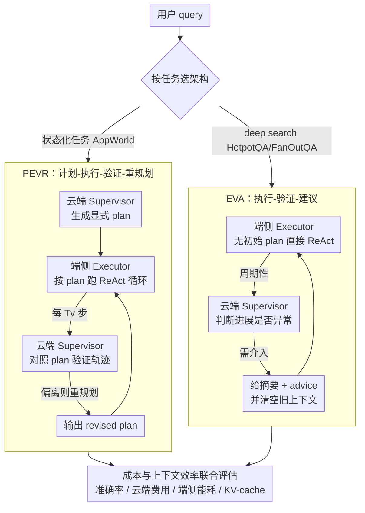

# When Cloud Agents Meet Device Agents: Lessons from Hybrid Multi-Agent Systems

**会议**: ICML2026  
**arXiv**: [2605.30102](https://arxiv.org/abs/2605.30102)  
**代码**: 无  
**领域**: multi_agent  
**关键词**: 混合多智能体, 云端模型, 端侧模型, Agent 评测, 上下文效率

## 一句话总结
这篇论文系统研究云端 GPT-4o 监督者与端侧 Qwen3 执行者组成的混合多智能体系统，发现 PEVR 和 EVA 在 UI assistance 与 deep search 上各有优势，更多云端介入不一定更好，而上下文重置与摘要能显著改善端侧长任务的成本和 KV-cache 压力。

## 研究背景与动机
**领域现状**：LLM agent 正从短对话走向长时程任务执行，需要分解目标、调用工具、维护状态并在环境中多步行动。最强的 frontier LLM 通常部署在云端，能力强但 token 成本高；较小的 SLM 可以在手机或笔记本上运行，成本低、隐私更好，但长上下文和复杂推理能力有限。

**现有痛点**：混合 AI 往往通过 router 在大模型和小模型之间选择，或在小模型失败时升级到大模型。但在 agent 场景中，计算不只是“哪个模型回答”，还涉及谁规划、谁执行、谁验证、何时重启上下文。现有系统大多针对单一任务临时设计，缺少跨任务、跨成本维度的系统性比较。

**核心矛盾**：云端模型越多介入，理论上能提供更强监督，但也会增加 API 成本，并可能频繁打断端侧执行；端侧模型持续执行省钱，但长上下文会带来 KV-cache 增长、上下文腐化和错误累积。混合 MAS 的难点就是在准确率、云端费用和端侧能耗之间找 Pareto 平衡。

**本文目标**：作者希望把代表性多智能体架构改造成 cloud-edge hybrid 版本，在 HotpotQA、FanOutQA、AppWorld 三类任务上系统评估模型分工、监督频率、重启方式和上下文管理对性能与成本的影响。

**切入角度**：论文把云端 GPT-4o 作为间歇性 Supervisor，把端侧 Qwen3 4B/8B/14B/32B 作为长期 Executor。这样，最 token-intensive 的 ReAct 执行留在端侧，昂贵云端模型只在规划、验证或建议时介入。

**核心 idea**：把混合 agent 设计看成多智能体角色分配问题，而不是简单模型路由；通过 PEVR 与 EVA 两种结构对比，找出不同任务下“计划式监督”和“建议式摘要”各自适合的边界。

## 方法详解
论文没有提出一个新的 agent benchmark，而是围绕混合 MAS 的设计空间做系统实验。核心变量包括：架构采用 PEVR 还是 EVA，端侧 Executor 用哪个 Qwen3 尺寸，云端 Supervisor 多久验证一次，以及执行失败后是重规划还是给建议并重置上下文。

### 整体框架
系统由两个角色组成。Executor 是端侧小模型，负责持续 ReAct 循环：根据当前任务、上下文和可用工具生成 reasoning/action，调用环境，收集 observation。Supervisor 是云端 GPT-4o，不直接承担每一步工具执行，而是周期性查看轨迹并决定是否介入。用户通过 verification interval 控制云端介入频率，interval 越小，云端调用越频繁，成本越高。

实验覆盖三个难度逐步增加的任务族。HotpotQA 是短程多跳问答，报告 ROUGE-1 F1；FanOutQA 是长程 fan-out 信息聚合，同样报告 ROUGE-1 F1；AppWorld 是状态化 API 环境，报告 Test Pass Ratio 和 Task Success。效率侧报告云端 API 美元成本、端侧能耗估计，以及长任务中的 KV-cache 最大占用。两个角色组合成两种互斥的混合架构 PEVR 与 EVA，论文按任务类型对比它们，最后统一用“准确率 + 成本 + 上下文”三个维度评估。

### 关键设计

**1. PEVR：计划-执行-验证-重规划（Plan-Execute-Verify-Replan）**

这条线服务于 AppWorld 这类状态化 API 任务——早期一个错误动作可能不可逆，控制流和工具调用顺序必须从一开始就对。机制上，云端 Supervisor 先根据用户 query 生成一份自然语言 plan，端侧 Executor 按 plan 跑 ReAct 循环；每隔 $T_v$ 步，Supervisor 对照 plan 检查轨迹是否偏离，一旦判断需要介入就输出 revised plan，Executor 在更新后的计划下继续执行。这样昂贵的云端能力被集中用在“规划 + 纠偏”上，而最耗 token 的逐步执行留在端侧，既保住了状态化任务所需的全局可控性，又避免云端承担每一步工具调用。

**2. EVA：执行-验证-建议（Execute-Verify-Advise）**

这条线服务于 HotpotQA / FanOutQA 这类 deep search 任务——表现高度依赖连续的探索和信息聚合，频繁重规划反而会打断已经积累的搜索轨迹。因此 EVA 干脆不给初始 plan，端侧 Executor 直接 ReAct 自主探索；云端 Supervisor 只周期性地根据 query 和轨迹判断进展是否异常，需要介入时也不重写计划，而是生成过往动作的摘要加一条后续 advice，并清空 Executor 的旧上下文再继续。轻量建议 + 摘要既保持了长程搜索方向，又顺手压掉了端侧累积的长上下文。

**3. 成本与上下文效率的联合评估**

混合 MAS 的价值不只是“比端侧单体更准”，还得“比纯云端更便宜”且“能在端侧内存限制下跑完长任务”，所以论文不只看准确率。它把云端开销按 GPT-4o 的 API 价格累加，端侧能耗按模型推理量估计，上下文压力用最大 KV-cache footprint 衡量。关键在于：PEVR 的重规划和 EVA 的摘要+重置都会周期性截断端侧上下文，从而直接限制 KV-cache 增长——这让上下文管理从“评测指标”变成了架构本身自带的一项收益。

### 损失函数 / 训练策略
本文不训练模型，所有实验都是推理时系统设计比较。云端模型固定为 GPT-4o，端侧模型为 Qwen3 4B、8B、14B、32B。HotpotQA 最大 10 个 ReAct turn，验证间隔为 1/2/3/5；FanOutQA 最大 20 turn，间隔为 1/2/3/5/10；AppWorld 最大 40 turn，间隔为 1/2/4/8/16。Qwen3 32B 使用 fp8 KV-cache 和权重量化以便单 A100 跑实验。

## 实验关键数据

### 主实验
论文主结论来自 Figure 2 和 Table 2。下面的表格聚焦“谁当 Executor、谁当 Supervisor”的对比，分数取相应任务上最佳准确率设置，成本为云端 API 成本，越低越好。

| 配置 | AppWorld Task Success | AppWorld Cost | FanOutQA ROUGE-1 F1 | FanOutQA Cost | 结论 |
|------|----------------------|---------------|---------------------|---------------|------|
| GPT-4o 单体云端 | 0.25 | 0.37 | 0.14 | 0.19 | 准确但成本高 |
| Qwen 32B Executor + GPT-4o Supervisor | 0.21 | 0.09 | 0.23 | 0.11 | 端执行云监督在 FanOutQA 上优于纯云且更便宜 |
| Qwen 14B Executor + GPT-4o Supervisor | 0.19 | 0.08 | 0.12 | 0.04 | 成本低，能力受端侧模型限制 |
| Qwen 8B Executor + GPT-4o Supervisor | 0.16 | 0.08 | 0.09 | 0.04 | 仍优于部分端侧单体配置 |
| Qwen 4B Executor + GPT-4o Supervisor | 0.11 | 0.13 | 0.06 | 0.04 | 小模型执行能力成为瓶颈 |
| GPT-4o Executor + Qwen 32B Supervisor | 0.25 | 0.67 | 0.14 | 0.17 | 云端执行、端侧监督更贵且不更准 |
| Qwen 32B 单体端侧 | 0.07 | 0.00 | 0.15 | 0.00 | 便宜但 AppWorld 明显不足 |

### 消融实验
论文分析了验证器误判、架构角色反转和上下文效率。这里列出两个最直接支撑设计结论的表。

| Benchmark | Verifier | False Negative | False Positive | 解释 |
|-----------|----------|----------------|----------------|------|
| AppWorld | Plan-based PEVR | 5.3% | 6.2% | 更积极介入，计划偏离是有效信号 |
| AppWorld | Query-based EVA | 6.0% | 1.9% | 更保守，但缺少初始计划帮助 |
| FanOutQA | Plan-based PEVR | 8.4% | 7.7% | 过多重启会伤害长程搜索 |
| FanOutQA | Query-based EVA | 14.8% | 6.1% | 漏报更多，但较少打断执行 |

| Max Turns | Architecture | Qwen3 8B Task Success | Qwen3 8B KV$ GB | Qwen3 32B Task Success | Qwen3 32B KV$ GB |
|-----------|--------------|-----------------------|------------------|------------------------|-------------------|
| 20 | Monolithic | 0.00 | 3.52 | 0.05 | 6.59 |
| 20 | PEVR | 0.07 | 3.34 | 0.18 | 6.53 |
| 40 | Monolithic | 0.02 | 4.82 | 0.07 | 11.34 |
| 40 | PEVR | 0.09 | 3.65 | 0.16 | 6.98 |
| 80 | Monolithic | 0.00 | 5.17 | 0.09 | 13.12 |
| 80 | PEVR | 0.11 | 3.82 | 0.19 | 7.90 |

### 关键发现
- 混合 MAS 可以找到比端侧单体更准、又比云端单体更便宜的配置，但最佳点随任务变化。
- PEVR 更适合 AppWorld，因为状态化环境需要初始计划和可执行 replan；EVA 更适合 FanOutQA / HotpotQA，因为 deep search 被频繁 restart 会明显伤害表现。
- 更多云端监督不等于更高准确率。验证间隔太短会增加成本，也可能因过度干预打断端侧执行。
- 端侧模型越大通常越好，但混合架构完成了一些纯云端和纯端侧都没完成的任务，说明协作不是简单 router 的并集。
- PEVR/EVA 的上下文重置和摘要能限制 KV-cache 增长，在 AppWorld 80 turn 场景中，Qwen3 32B 的 PEVR KV-cache 为 7.90GB，而单体端侧达到 13.12GB。

## 亮点与洞察
- 论文没有把 hybrid agent 简化成“便宜小模型不行就问大模型”，而是认真拆解了规划、执行、验证、建议这些角色，分析它们在不同任务中的作用。
- “更多云端介入可能更差”是很有用的工程结论。强模型如果频繁重启长程搜索，可能破坏已经积累的中间状态。
- PEVR 和 EVA 的差异说明 agent 架构应该任务自适应：状态化任务需要可执行计划，开放信息搜索更需要保留探索轨迹和适度摘要。
- 上下文效率表很有现实意义。很多端侧 agent 的瓶颈不是单步推理，而是长轨迹导致 KV-cache 爆炸；MAS 的周期性重置恰好缓解这个问题。

## 局限与展望
- 云端模型固定为 GPT-4o，端侧模型固定为 Qwen3 系列；不同模型家族、不同上下文长度或更强本地模型可能改变最优架构。
- 论文覆盖 HotpotQA、FanOutQA、AppWorld，但没有覆盖代码 agent、机器人控制、浏览器 GUI 或真实移动端部署。
- 能耗是估计而非真实设备测量，实际手机/笔记本上的延迟、温控、内存带宽和系统调度会带来额外约束。
- 当前 verification interval 是手工扫参，未来更自然的方向是学习一个动态 supervisor policy，根据不确定性和任务状态决定何时请求云端。

## 相关工作与启发
- **vs 单体云端 agent**: 云端单体能力强但成本高，且不一定覆盖所有混合系统能解决的任务；混合 MAS 可以以更低费用进入相近甚至更好的 Pareto 区域。
- **vs 单体端侧 agent**: 端侧单体便宜但在 AppWorld 这类长程状态任务上失败多；云端规划/验证能提供关键纠偏。
- **vs model routing**: routing 是每个 query 选一个模型，而本文显示 MAS 能完成一些纯云和纯端都失败的任务，说明角色协作带来新的行为。
- **vs AgentFlow / advisor-style MAS**: PEVR 接近 planner-executor-verify-replan，EVA 接近 advisor with reset；论文贡献在于把两者放进统一 cloud-edge 成本框架比较。

## 评分
- 新颖性: ⭐⭐⭐⭐☆ 混合云端/端侧 agent 不是全新概念，但系统性拆解 PEVR/EVA 与成本、能耗、上下文效率很有价值。
- 实验充分度: ⭐⭐⭐⭐☆ 三类 benchmark、多种 Qwen3 尺寸和监督间隔，分析扎实；真实设备实测和更多任务域仍缺。
- 写作质量: ⭐⭐⭐⭐☆ 结构清晰，机制分析到位；Figure 2 信息量较大，读者需要结合后续表格理解。
- 价值: ⭐⭐⭐⭐⭐ 对实际部署端侧 agent 和云端辅助系统很实用，尤其是“少量云端监督 + 上下文管理”的设计原则。

<!-- RELATED:START -->

## 相关论文

- [\[ICLR 2026\] When Agents "Misremember" Collectively: Exploring the Mandela Effect in LLM-based Multi-Agent Systems](../../ICLR2026/multi_agent/when_agents_misremember_collectively_exploring_the_mandela_effect_in_llm-based_m.md)
- [\[AAAI 2026\] EcoAgent: An Efficient Device-Cloud Collaborative Multi-Agent Framework for Mobile Automation](../../AAAI2026/multi_agent/ecoagent_an_efficient_device-cloud_collaborative_multi-agent.md)
- [\[AAAI 2026\] Scalable and Accurate Graph Reasoning with LLM-Based Multi-Agents](../../AAAI2026/multi_agent/scalable_and_accurate_graph_reasoning_with_llm-based_multi-agents.md)
- [\[ICLR 2026\] Multi-Agent Design: Optimizing Agents with Better Prompts and Topologies](../../ICLR2026/multi_agent/multi-agent_design_optimizing_agents_with_better_prompts_and_topologies.md)
- [\[ICML 2026\] EngiAgent: Fully Connected Coordination of LLM Agents for Solving Open-ended Engineering Problems with Feasible Solutions](engiagent_fully_connected_coordination_of_llm_agents_for_solving_open-ended_engi.md)

<!-- RELATED:END -->
