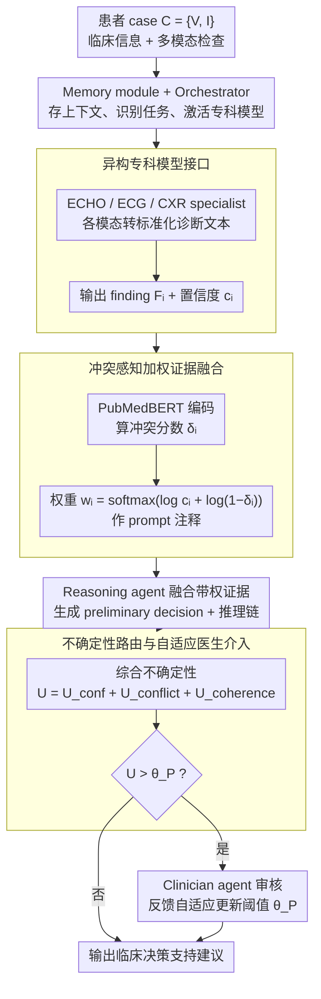

# Why Specialist Models Still Matter: A Heterogeneous Multi-Agent Paradigm for Medical Artificial Intelligence

**会议**: ICML2026  
**arXiv**: [2605.29744](https://arxiv.org/abs/2605.29744)  
**代码**: 未见公开代码  
**领域**: 多智能体 / 临床决策
**关键词**: 医疗多智能体, 专科模型, 临床决策支持, 不确定性路由, 证据融合  

## 一句话总结
HetMedAgent 将通用 LLM、模态专科模型和临床医生组织成异构多智能体系统，通过冲突感知证据融合与不确定性路由，在心血管和胸片临床决策任务上证明专科模型与人类监督仍是医疗 AI 中不可替代的组成部分。

## 研究背景与动机
**领域现状**：GPT、Claude 等通用 LLM 在医学问答和临床推理上表现越来越强，医疗领域自然会出现一个问题：既然大模型能读病历、答医学题、解释诊断，是否还需要为 ECG、ECHO、CXR 等具体模态训练专科模型。

**现有痛点**：单一医疗 LLM 的风险很明显。它可以给出流畅的推理链，但对特定检查模态的底层信号理解并不一定可靠；医疗数据又高度隐私、稀缺、跨机构碎片化，训练一个全能医疗基础模型的成本和合规难度都很高。另一方面，纯专科模型虽然在窄任务上强，却缺乏跨模态整合、临床背景推理和责任边界。

**核心矛盾**：医疗决策不是“一个模型输出一个答案”的问题，而是多种证据、多种专业角色和最终责任之间的协作问题。通用 LLM 擅长组织语言和综合推理，专科模型擅长模态特异诊断，医生负责安全、伦理和最终裁决。若只追求单模型自动化，就会牺牲其中至少一部分能力。

**本文目标**：论文想证明 specialist models 没有被 generalist LLM 淘汰；更合理的路线是把它们作为可插拔专家，与通用 LLM 和 clinician agent 一起形成临床决策支持系统。系统不仅要提高 AUROC/F1，还要知道什么时候不该自动回答，而应升级给医生。

**切入角度**：作者把医疗 AI 设计成异构多智能体协作流程。每个病人 case 包含临床信息和多模态检查，orchestrator 选择专科模型，specialists 输出结构化 findings 与 confidence，reasoning agent 做证据融合，uncertainty routing 决定是否触发 clinician intervention。

**核心 idea**：不要让通用 LLM 替代专科模型，而是让 LLM 负责协调和推理，让专科模型提供模态证据，让医生处理高不确定性病例。

## 方法详解
HetMedAgent 的核心不是某个单独网络，而是一套医疗决策流程。它把 MDT 式协作形式化为可执行的 agent pipeline，并在 pipeline 中显式建模证据冲突、生成置信度、推理一致性和医生介入阈值。

### 整体框架
系统输入是患者 case $C=\{V,I\}$，其中 $V$ 是年龄、性别、慢病史、治疗史、症状等临床信息，$I$ 是检查模态，例如 ECHO 报告、ECG 图像或 CXR 影像。目标是输出一组临床决策，例如 180 天心血管入院风险、病因预测、严重程度评估，或胸片急性/非急性判断。

流程上，memory module 先保存病人信息、交互历史、可用模态和任务定义。orchestrator agent 读取这些上下文，识别任务并激活合适的 specialist agents。每个 specialist 把自己的模态转化为标准化诊断文本和 confidence。随后系统计算不同 specialist 之间的语义冲突分数，并给每个 finding 分配权重。reasoning agent 接收临床背景和带权证据，生成 preliminary decision 和 reasoning chain。最后，系统计算综合不确定性，如果超过阈值就交给 clinician agent 审核，否则输出作为临床决策支持建议。

### 关键设计
1. **异构专科模型接口**:

	- 功能：让不同模态的医学模型以统一格式接入系统，同时保留各自的专门能力。
	- 核心思路：每个 specialist agent 输出 $F_i^w=\{diagnosis:F_i, confidence:c_i\}$。ECHO specialist 使用文本到文本的 Transformer/LSTM 结构处理报告序列，ECG specialist 使用 CNN 图像编码器加 Transformer encoder-decoder 把 ECG 图像转成诊断文本；CXR 扩展实验中也加入了双视角胸片 specialist。
	- 设计动机：医疗模态差异很大，硬把所有输入塞给一个 LLM 会丢失模态细节。统一文本 finding 接口能让下游 reasoning agent 可解释地消费证据，同时允许新专科模型按标准接口增量加入。

2. **冲突感知加权证据融合**:

	- 功能：当多个 specialist 给出互补或矛盾证据时，系统不是简单拼接，而是根据置信度和冲突程度调整证据权重。
	- 核心思路：每个 finding 用 PubMedBERT bi-encoder 投到语义空间，计算它与其他 specialists 的平均相似度，并得到冲突分数 $\delta_i$。权重按 $w_i=\mathrm{softmax}(\log c_i+\log(1-\delta_i))$ 计算，再作为 prompt-level annotation 告诉 reasoning agent 哪些证据更可靠。
	- 设计动机：不同模态的自然语言 findings 没有共享概率标签空间，不能直接做 product-of-experts。把权重作为结构化文本注释，既保留 LLM 综合推理能力，又让它显式看到证据可靠性。

3. **不确定性路由与自适应医生介入**:

	- 功能：把系统定位为临床决策支持，而不是无人监管的自动诊断器。
	- 核心思路：综合不确定性由三部分组成：specialist confidence gap $U_{conf}=1-\max_i(c_i)$、平均冲突 $U_{conflict}=\frac{1}{k}\sum_i\delta_i$、推理链不连贯性 $U_{coherence}$。当 $U(D_{prelim})>\theta_P$ 时，case 升级给 clinician agent。阈值还会根据医生反馈更新：医生接受则略提高阈值，医生修改则降低阈值。
	- 设计动机：医疗场景的核心不是让 AI 尽可能多地自动回答，而是把低风险、低冲突 case 自动化，同时把困难/矛盾 case 精准交给医生，平衡效率与安全。

### 损失函数 / 训练策略
论文不是端到端训练整个多智能体系统，而是分别训练/配置 specialist models，并用通用 LLM 作为 orchestrator 和 reasoning backend。ECHO/ECG specialists 输出诊断文本，诊断质量用 BERTScore 评估；临床决策结果用 AUROC 和 F1 评估。主实验中 generalist LLM 默认使用 GPT-4o，另有 Claude、Gemini、Llama、Qwen、GLM 等替换实验。医生介入阈值实验用固定阈值 $\theta_P=0.5$ 和模拟 sequential feedback 验证校准机制。

## 实验关键数据

### 主实验
主实验是 613 个真实心血管病例，来自 514 名患者，输入包括 ECHO 报告和 ECG 图像，任务包括入院风险分层、病因预测和严重程度评估。HetMedAgent 同时和医学 LLM、普通 multi-agent 系统比较。

| 方法 | 风险 AUROC/F1 | 病因 AUROC/F1 | 严重度 AUROC/F1 | 平均观察 |
|------|---------------|---------------|-----------------|----------|
| Meditron | 0.801 / 0.768 | 0.723 / 0.681 | 0.673 / 0.634 | 最强单模型基线之一 |
| MedAgents | 0.823 / 0.789 | 0.751 / 0.708 | 0.692 / 0.653 | 最强 multi-agent 基线 |
| AgentClinic | 0.817 / 0.781 | 0.738 / 0.695 | 0.681 / 0.641 | 多 GPT-4 医生角色协作 |
| HetMedAgent w/o Clinician | 0.866 / 0.844 | 0.801 / 0.757 | 0.727 / 0.719 | 三个任务都最好 |

作者报告 HetMedAgent 相比最佳单模型 baseline 平均 AUROC +6.6%、F1 +7.9%，相比最佳 multi-agent baseline 平均 AUROC +4.3%、F1 +5.7%。这说明收益不仅来自“用了多个 LLM 讨论”，还来自专科模型和冲突/不确定性机制。

### 消融实验
| 配置 | 关键指标 | 说明 |
|------|---------|------|
| GPT-4o 单独使用 | 平均 AUROC 0.671，F1 0.625 | 只有通用 LLM 时临床决策明显不足 |
| + ECHO specialist | 平均 AUROC 0.752，F1 0.711 | ECHO 信息带来 +8.1% AUROC、+8.6% F1 |
| + ECG specialist | 平均 AUROC 0.734，F1 0.692 | ECG 信息也显著提升 |
| + 两个 specialists | 平均 AUROC 0.798，F1 0.773 | 双模态互补最好 |
| Weighted evidence | 平均 AUROC 0.798，F1 0.773 | 正确权重注释最佳 |
| No annotation | 平均 AUROC 0.777，F1 0.749 | 去掉权重后下降 |
| Inverse-weighted | 平均 AUROC 0.758，F1 0.727 | 反转权重伤害最大，说明 LLM 确实利用权重 |

### 关键发现
- Transformer-based specialists 明显强于传统 CNN specialists。ECHO BERTScore 从 ResNet-based 0.707 提到 0.800，ECG 从 0.658 提到 0.717，平均冲突分数也下降。
- 不同 generalist LLM 都能接入，但 GPT-4o 最好，平均 AUROC/F1 为 0.798/0.773；Claude-3.5-Sonnet 为 0.791/0.766，Gemini-2.0-Flash 为 0.783/0.757，说明框架不完全绑定某个 LLM。
- 固定阈值 $\theta_P=0.5$ 时，613 个测试病例中 114 个（18.6%）触发医生介入；这些病例 F1 更低，说明不确定性机制确实筛出了更难的 case。
- 自适应阈值把介入数从固定阈值的 114 降到 97（15.8%），同时 AIR 从 1.468 提到 1.679，说明反馈校准能更精准地区分自动处理和需要介入的病例。
- 跨域胸片实验中，HetMedAgent 在 IU X-Ray 急性/非急性任务上达到 AUROC 0.820、F1 0.537，优于 ViT-BERT 的 0.783/0.468，验证框架能迁移到不同医学专科。

## 亮点与洞察
- 论文明确反对“医疗 LLM 一统天下”的叙事，转而强调协作式系统设计。这一点很务实：医疗 AI 的瓶颈常常不是语言能力，而是模态专业性、责任边界和不确定性管理。
- 把 specialist weight 作为 prompt-level evidence annotation 是一个很聪明的折中。它避免了跨模态概率校准的困难，又让 LLM 在推理时显式知道哪些证据更可信。
- 不确定性路由让系统更接近真实临床工作流。自动化不是目标本身，正确地知道何时升级给医生，反而是安全部署的关键能力。
- Cross-domain CXR 实验虽然只是补充，但很重要。它说明 HetMedAgent 不是只为 ECHO+ECG 手工拼出来的 pipeline，而是一种可以替换 specialist 的模块化范式。

## 局限与展望
- 生成置信度 $c_i$ 本质上是 token-level 置信度，并不等价于临床正确性。未来需要更强的 per-modality calibration，例如 Platt scaling 或基于专家标注的置信度校准。
- 医生反馈在实验中主要用 ground truth 模拟，不是真实多医生共识。真实部署中医生意见可能有噪声和分歧，阈值更新需要更稳健的动量、边界和异常反馈处理。
- 主数据集来自单机构心血管病例，规模 613 cases 偏小；Age ≥85 等子群样本更少，公平性和泛化结论还不够强。
- 各 agent 之间主要交换文本，可能丢失 ECG/CXR 中的空间结构和连续表示。论文也指出未来可让 specialist 同时输出结构化文本和 embedding，供 reasoning module 联合使用。
- 商业 LLM API 带来隐私与合规问题。虽然作者讨论了本地 open-weight 替换，但实际效果、成本和安全审计仍需验证。

## 相关工作与启发
- **vs 医学 LLM**: PMC-LLaMA、Meditron、BioMistral 等把医学知识注入单模型；HetMedAgent 认为医疗决策更适合 generalist reasoning + specialist precision + clinician oversight。
- **vs AgentClinic/MedAgents**: 这些系统多是 LLM 角色扮演式协作，缺少真实模态专科模型和医生路由机制；HetMedAgent 的异构性更贴近临床 MDT。
- **vs 传统专科模型**: ResNet/EfficientNet 等单模态模型能做局部诊断，但无法整合临床上下文；HetMedAgent 保留它们的模态能力，同时交给 LLM 做跨证据推理。
- **vs 人机协作 CDSS**: 传统 CDSS 常给规则或风险分数，HetMedAgent 进一步提供可追踪的 agent chain、权重注释和不确定性升级，适合做过程审计。

## 评分
- 新颖性: ⭐⭐⭐⭐☆ 医疗多智能体框架的思想并非全新，但把专科模型、LLM、医生介入和冲突权重系统化整合得较完整。
- 实验充分度: ⭐⭐⭐⭐☆ 主实验、模态消融、权重敏感性、跨 LLM 和 CXR 迁移都比较全面；真实多机构/真实医生反馈仍欠缺。
- 写作质量: ⭐⭐⭐⭐☆ 框架图和流程清楚，结果解释充分；符号较多，部分公式对临床读者可能偏重。
- 价值: ⭐⭐⭐⭐☆ 对医疗 AI 系统设计很有参考价值，尤其强调 specialist models 和 clinician oversight 的长期必要性。

<!-- RELATED:START -->

## 相关论文

- [\[AAAI 2026\] MedLA: A Logic-Driven Multi-Agent Framework for Complex Medical Reasoning with Large Language Models](../../AAAI2026/multi_agent/medla_a_logic-driven_multi-agent_framework_for_complex_medic.md)
- [\[ICLR 2026\] MMedAgent-RL: Optimizing Multi-Agent Collaboration for Multimodal Medical Reasoning](../../ICLR2026/multi_agent/mmedagent-rl_optimizing_multi-agent_collaboration_for_multimodal_medical_reasoni.md)
- [\[AAAI 2026\] LieCraft: A Multi-Agent Framework for Evaluating Deceptive Capabilities in Language Models](../../AAAI2026/multi_agent/liecraft_a_multi-agent_framework_for_evaluating_deceptive_capabilities_in_langua.md)
- [\[NeurIPS 2025\] MedAgentBoard: Benchmarking Multi-Agent Collaboration with Conventional Methods for Diverse Medical Tasks](../../NeurIPS2025/multi_agent/medagentboard_benchmarking_multi-agent_collaboration_with_conventional_methods_f.md)
- [\[ACL 2026\] AgenticEval: Toward Agentic and Self-Evolving Safety Evaluation of Large Language Models](../../ACL2026/multi_agent/agenticeval_toward_agentic_and_self-evolving_safety_evaluation_of_large_language.md)

<!-- RELATED:END -->
