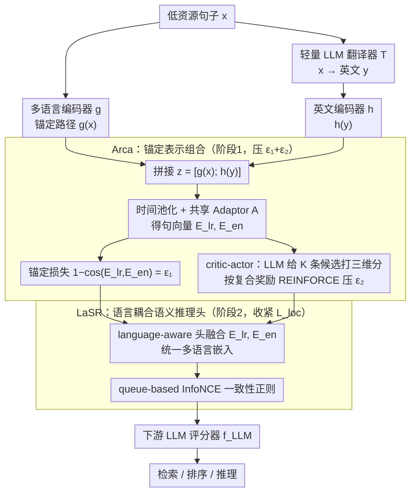

# Toward Robust Multilingual Adaptation of LLMs for Low-Resource Languages

**会议**: ICML 2026  
**arXiv**: [2510.14466](https://arxiv.org/abs/2510.14466)  
**代码**: 论文承诺将开源，目前仓库待发布  
**领域**: 多语言机器翻译 / 跨语言检索与推理  
**关键词**: 低资源语言, 跨语言对齐, 锚定表示, 翻译噪声, LLM 适配

## 一句话总结
LiRA 在冻结的多语言编码器与英文 LLM 之间插一层 "锚定 + 一致性正则" 的轻量微调模块，把低资源语言的句向量按 $\epsilon_1$（锚定误差）与 $\epsilon_2$（翻译 KL 距离）这两个理论可控的量约束到共享英文语义空间，从而在检索、排序与推理三类任务上同时拿到稳定提升。

## 研究背景与动机
**领域现状**：LLM 的能力高度集中在英文与中文等高资源语言，处理东南亚 / 南亚等低资源语言（Bengali、Indonesian、Burmese、Pashto、Thai、Filipino、Vietnamese 等）时仍严重退化。当前主流路线分两派：一派走 "翻译 → 英文模型推理 → 反翻译" 的 MT pipeline；另一派直接训多语言编码器（mBERT、XLM-R、E5-Mistral）做 language-agnostic 对齐。

**现有痛点**：MT pipeline 会逐级累积翻译噪声并产生语义漂移（semantic drift），尤其在需要多步推理的查询上误差放大；多语言编码器虽然天生跨语言，但拿不到英文 LLM 中强大的推理头，且在低资源域内训练样本本身就稀缺。MindMerger、LUSIFER 这类近期工作尝试把多语言编码器与英文 LLM 接起来，但前者依赖平行语料因而仍背着翻译噪声，后者训练阶段几乎不见低资源语言，迁移时跨语言对齐不稳定。

**核心矛盾**：跨语言系统中的误差有两类——表示空间映射误差（不同编码路径落点不一致）与翻译诱导的语义偏移；现有方法既没有系统建模这两类误差如何传播，也没有给出可被优化目标驱动的形式化界，导致鲁棒性只能 "靠经验调"。

**本文目标**：(i) 给跨语言适配建一个能写出 representation deviation 上界的理论框架，使两类误差变成显式可优化的项；(ii) 设计一个既能挂在不同骨干上、又能同时支撑 retrieval / ranking / reasoning 的轻量插件；(iii) 提供一个真正贴近真实低资源场景（电商商品检索）的多语言评测集。

**切入角度**：把低资源句子 $x$ 与其英文翻译 $y = T(x)$ 想象成 "两路通向同一英文语义空间" 的表示路径——多语言锚定路径 $g(x)$ 与英文编码路径 $h(y)$，然后用"理想英文表示" $\mathbf{z}^\star = [h(y^\star); h(y^\star)]$ 当数学参考系，证明只要锚定误差 $\epsilon_1$ 与翻译 KL 距离 $\epsilon_2$ 同时变小，整段 pipeline 的输出就被 Lipschitz 常数 $L^{\text{loc}}$ 紧紧夹住。

**核心 idea**：LiRA = Arca（用 critic-actor 强化学习压缩 $\epsilon_1, \epsilon_2$）+ LaSR（用语言相关头做跨语言一致性正则），把理论上界翻译成两个可联合优化的损失。

## 方法详解

### 整体框架
输入是低资源语言句子 $x \in \mathcal{X}$。LiRA 把它送入两条平行路径：路径 1 经过多语言编码器 $g: \mathcal{X} \to \mathbb{R}^d$ 得到 "锚定表示" $g(x)$；路径 2 先经轻量 LLM 翻译器 $T$ 得到英文 $y = T(x)$，再过英文编码器 $h: \mathcal{Y} \to \mathbb{R}^d$ 得到 $h(y)$。两路表示拼成 $\mathbf{z}(x) = [g(x); h(y)] \in \mathbb{R}^{2d}$ 后喂给下游 LLM 评分器 $f_{\text{LLM}}$，用于检索 / 排序 / 推理。

理论上希望 $\mathbf{z}$ 逼近 "理想参考" $\mathbf{z}^\star = [h(y^\star); h(y^\star)]$（两路一致地落在英文理想翻译 $y^\star$ 的位置）。论文证明在锚定假设 $\|g(x) - h(y^\star)\|_2 \le \epsilon_1$ 与翻译保真假设 $D_{\text{KL}}(p(s|x) \| p(s|T(x))) \le \epsilon_2$ 下，有
$\|\mathbf{z} - \mathbf{z}^\star\|_2 \le \epsilon_1 + C\sqrt{2\epsilon_2}$，
继而 $\|f_{\text{LLM}}(\mathbf{z}) - f_{\text{LLM}}(\mathbf{z}^\star)\|_2 \le L^{\text{loc}}(y;\delta)(\epsilon_1 + C\sqrt{2\epsilon_2})$。Arca 与 LaSR 就是把这两个 $\epsilon$ 推向 0 的工程实现。

### 关键设计

**1. Arca — 锚定表示组合架构：把理论上界 $\epsilon_1+C\sqrt{2\epsilon_2}$ 拆成两个能直接优化的损失**

理论给的上界很漂亮，但 $\epsilon_1$（锚定误差）与 $\epsilon_2$（翻译失真）只是抽象量，必须落到能反传的目标上。Arca 先把多语言 token 流 $g_{\text{tok}}(x) \in \mathbb{R}^{L_x \times d_g}$ 与英文 token 流 $h_{\text{tok}}(y) \in \mathbb{R}^{L_y \times d_h}$ 用 $S_{\text{feat}}$-bin 时间池化拉到等长，过共享 Adaptor $A(\cdot)$ 映到统一 $d$ 维得句向量 $E_{lr}, E_{en}$，再把锚定损失定义为余弦距离 $\mathcal{L}_{\text{anchor}} = 1 - \cos(E_{lr}, E_{en})$——这一项就是理论里的 $\epsilon_1$。$\epsilon_2$ 则交给一个 critic-actor 回路：一个轻量 LLM 给 $K$ 条候选翻译打三维分 $(s_k, e_k, p_k) \in [1,10]$（语义忠实、情感一致、语用得体），与 Adaptor 相似度 $\text{sim}_k$ 拼成 policy 特征 $\mathbf{c}_k = [s_k, e_k, p_k, \text{sim}_k]^\top$，喂给 MLP 得到策略 $\pi_\phi(k|\mathbf{c}_{1:K}) = \text{softmax}(g_\phi(\mathbf{c}_{1:K}))$，按复合奖励 $R_k = 0.1(\alpha s_k + \beta e_k + \gamma p_k) + \delta\,\text{sim}_k$ 做 REINFORCE。

两项合成总目标 $\mathcal{L} = \mathcal{L}_{\text{RL}} + \eta\,\mathcal{L}_{\text{anchor}}$ 把 $\epsilon_1, \epsilon_2$ 同时往下压。之所以用 critic-actor 而不是纯监督，是因为低资源平行语料本身脏——让"翻译挑选"和"表示对齐"互相博弈，模型能绕开被噪声翻译带偏的陷阱，而不是死记某条不靠谱的参考译文。

**2. LaSR — 语言耦合语义推理头：把下游 LLM 对残余误差的放大也压住**

Arca 解决的是"两路表示落点对不对"，但即便落点对了，下游 LLM 对多语言路径和英文路径输入的敏感度不同，仍可能把残余误差放大——这正是理论里 $L^{\text{loc}}(y;\delta)$ 这个 Lipschitz 常数在起作用。LaSR 用一个轻量 language-aware 头把 Arca 输出的 $(E_{lr}, E_{en})$ 融合成统一多语言嵌入，再用 queue-based InfoNCE 风格的对比损失把相同 query 的多语言版本与英文版本拉近、与负样本拉远，等价于在输出层再加一道 $\mathcal{L}_{\text{consistency}}$ 正则；检索、排序、QA、推理共用这一份嵌入。

它的作用是把 Corollary 2 上界的最后一块——$L^{\text{loc}}$——也收紧：Arca 管 $\epsilon_1+C\sqrt{2\epsilon_2}$，LaSR 管它前面的乘子，两者叠起来整段上界才真正变小。队列式对比同时让大批量检索在显存受限时仍稳定。

**3. 理论驱动的两阶段训练：把"压偏差"和"适配任务"解耦成可插拔两步**

如果端到端同时优化理论目标（$\epsilon_1,\epsilon_2$）与任务指标，两套目标会互相抢梯度。作者把它拆开：第一阶段冻结多语言编码器与英文编码器骨干，只训 Adaptor + critic + actor，专注最小化 $\mathcal{L}_{\text{anchor}} + \mathcal{L}_{\text{RL}}$ 把表示先对齐好；第二阶段才挂上 LaSR，针对具体任务（检索 / 排序 / 推理）用对比 + 一致性损失微调。

这样既复用了已预训练编码器的能力，又让两个目标互不干扰。整套模块是 plug-and-play 的——同一套 Arca+LaSR 可以挂在 Qwen3-E、E5-Mistral、BGE 等任意骨干上，换骨干不用重推理论。

### 损失函数 / 训练策略
- Arca 阶段：$\mathcal{L} = \mathcal{L}_{\text{RL}} + \eta\, \mathcal{L}_{\text{anchor}}$，其中 $\mathcal{L}_{\text{RL}} \approx -\log \pi_\phi(a | \mathbf{c}_{1:K}) \cdot R_a$。奖励权重 $(\alpha, \beta, \gamma, \delta)$ 控制翻译质量三维分与嵌入相似度的相对重要性。
- LaSR 阶段：queue-based 对比损失 + 多语言一致性正则；池化 bin 数 $S_{\text{feat}}$、近邻半径 $\delta$、Lipschitz 分位 $q$（默认 $q=0.95$，对应 $L^{(0.95)} \approx 0.034$）是关键超参。

## 实验关键数据

### 主实验
作者发布 LazRetrieval（5 个东南亚 + 2 个南亚语言的真实电商商品检索集），并在 7 种语言上对比多种 sentence encoder。表中除 LiRA-Large 外均为公开 baseline，指标为 retrieval 平均得分（越高越好）。

| 方法 | 参数量 | Bd | Id | My | Pk | Th | Ph | Vn | Avg |
|------|--------|------|------|------|------|------|------|------|------|
| Sentence-T5-XXL | 4.8B | 34.11 | 71.77 | 49.19 | 27.84 | 23.58 | 84.20 | 28.61 | 44.56 |
| GTR-XXL | 4.8B | 34.85 | 75.92 | 49.36 | 30.39 | 22.94 | 84.94 | 46.15 | 48.17 |
| Contriever | 110M | 39.95 | 74.95 | 48.90 | 35.71 | 15.43 | 83.74 | 64.75 | 51.00 |
| BGE-en-v1.5 | 335M | 41.06 | 78.78 | 53.28 | 37.52 | 18.35 | 88.18 | 68.72 | 54.09 |
| E5-Mistral-7B | 7.24B | 48.27 | 75.43 | 71.01 | 53.62 | 61.75 | 83.18 | 65.44 | 64.51 |
| Qwen3-E-0.6B | 0.6B | 38.36 | 63.95 | 62.37 | 40.73 | 55.28 | 74.38 | 59.46 | 56.31 |
| **LiRA-Large (ours)** | 8.5B | **48.60** | 74.43 | **71.26** | 49.84 | **66.39** | 83.90 | **70.67** | **66.44** |

LiRA-Large 平均比 E5-Mistral-7B 提 ~1.9 分，在 Bd / My / Th / Vn 四个最稀缺语种上拿到最佳。

### 消融实验
按论文报告的趋势整理（具体数字以原文为准）：

| 配置 | 检索 Avg | 推理任务 | 说明 |
|------|----------|----------|------|
| Full LiRA | 66.4 | best | 完整 Arca + LaSR |
| w/o $\mathcal{L}_{\text{anchor}}$ | ↓ | ↓ | 去掉锚定损失，$\epsilon_1$ 反弹，跨语言对齐变松 |
| w/o RL critic | ↓↓ | ↓↓ | 失去翻译质量评分驱动，$\epsilon_2$ 上升，低资源语种掉点最猛 |
| w/o LaSR | ↓ | ↓↓ | 多语言嵌入失去一致性正则，推理任务掉得比检索更多 |
| 训练数据：去掉低资源语言 | ↓↓ | ↓↓ | 验证 LUSIFER 式 "几乎不见低资源样本" 的局限 |

### 关键发现
- 训练过程中 $\|\mathbf{z} - \mathbf{z}^\star\|$ 的经验测度单调下降，与理论 $\epsilon_1 + C\sqrt{2\epsilon_2}$ 的预测方向一致——说明理论假设虽抽象，但被工程化目标真正落实。
- 在 token-edit 邻域半径 $\delta = 1$ 下，95% 分位 Lipschitz 常数 $L^{(0.95)} \approx 0.034$，表明下游 LLM 对小幅表示扰动几乎不放大错误，corollary 给出的上界很紧。
- LiRA 在 Burmese / Thai / Vietnamese 等长尾语言上的相对增益远大于在 Indonesian 这类相对高资源语言，说明锚定 + 一致性正则在 "训练样本稀疏" 区收益最大。
- 模块插拔实验显示 LiRA 同时换骨干（Qwen3-E-0.6B / 4B → 与 LiRA 组合）都能稳定涨点，证明 plug-and-play 形态确实成立。

## 亮点与洞察
- 把一个工程问题（"低资源语言怎么对齐"）翻成两个可优化的标量 $(\epsilon_1, \epsilon_2)$，再用 RKHS / KME 把翻译 KL 距离与表示偏差挂钩——这种 "理论上界 ↔ 损失函数" 的一一对应方式可以直接迁移到任何 "两路表示通向共享语义空间" 的场景（多模态对齐、跨域适配都行）。
- Critic-actor 用 LLM 当翻译评分器，相当于把人类标注的多维质量评估外包给小 LLM，配合 REINFORCE 自动挑候选——这是个值得复用的 "无监督数据增强" trick：只要能让 LLM 打多维质量分，就能蒸出一个 reward。
- 把多语言路径 + 英文路径拼接而不是融合，保留了两套不同语义偏差的视角，避免 "强行平均" 损失信息——这与 dual-stream 多模态架构思想暗合。

## 局限与展望
- 翻译器 $T$ 本身仍是一个外部 LLM，其能力直接决定 $\epsilon_2$ 的下限；若目标语言不在翻译 LLM 训练分布内，整套框架退化。
- 理论假设要求 $f_{\text{LLM}}$ 在表示扰动下 locally Lipschitz，对显式工具调用 / 长链推理这类离散决策场景未必成立。
- LazRetrieval 仍以电商商品域为主，跨域 (法律 / 医疗 / 政务) 验证缺失，未来需补全。
- $\epsilon_1, \epsilon_2$ 都是上界控制，没有给出最小可学习的下界——很可能在某些语言对上已经接近瓶颈。

## 相关工作与启发
- **vs MindMerger**：都试图把多语言编码器与英文 LLM 拼起来，但 MindMerger 重度依赖平行翻译语料，等价于直接最小化经验翻译损失；LiRA 用 critic-actor 加 RL 评分挑候选，绕开了 "平行语料必须 clean" 的强假设，并显式建模 $\epsilon_2$。
- **vs LUSIFER**：LUSIFER 用 connector 接多语言编码器与英文 LLM-based embedding，但训练阶段几乎不见低资源样本，inference 时跨语言对齐脆弱；LiRA 在两阶段训练中保留低资源样本，且通过锚定损失显式优化跨语言落点。
- **vs XRAG / CCPR**：这些工作侧重端到端 cross-lingual RAG 评测或短语级检索，LiRA 是更底层的表示对齐层，可作为它们的前端嵌入器使用。

## 评分
- 新颖性: ⭐⭐⭐⭐ 把跨语言对齐用 RKHS + Lipschitz 上界形式化，再翻译成 critic-actor RL，是同类工作中少见的 "理论 + 工程闭环"。
- 实验充分度: ⭐⭐⭐⭐ 7 种低资源语言 + 多骨干 + 多任务，且释出新基准 LazRetrieval。
- 写作质量: ⭐⭐⭐⭐ 理论与方法对应清晰，公式编号与文字解释互引到位。
- 价值: ⭐⭐⭐⭐ 给低资源 NLP 系统提供了一个可挂在任意编码器上的鲁棒前端，对东南亚 / 南亚电商等真实场景直接可用。

<!-- RELATED:START -->

## 相关论文

- [\[ACL 2026\] Efficient Low-Resource Language Adaptation via Multi-Source Dynamic Logit Fusion](../../ACL2026/multilingual_mt/efficient_low-resource_language_adaptation_via_multi-source_dynamic_logit_fusion.md)
- [\[ACL 2025\] Accessible Machine Translation Evaluation For Low-Resource Languages](../../ACL2025/multilingual_mt/accessible_machine_translation_evaluation_for_low-resource_languages.md)
- [\[ACL 2025\] The Esethu Framework: Reimagining Sustainable Dataset Governance and Curation for Low-Resource Languages](../../ACL2025/multilingual_mt/the_esethu_framework_reimagining_sustainable_dataset_governance_and_curation_for.md)
- [\[ACL 2025\] Dictionaries to the Rescue: Cross-Lingual Vocabulary Transfer for Low-Resource Languages Using Bilingual Dictionaries](../../ACL2025/multilingual_mt/dictionaries_to_the_rescue_cross-lingual_vocabulary_transfer_for_low-resource_la.md)
- [\[ACL 2025\] Multilingual Encoder Knows More Than You Realize: Shared Weights Pretraining for Extremely Low-Resource Languages](../../ACL2025/multilingual_mt/multilingual_encoder_knows_more_than_you_realize_shared_weights_pretraining_for_.md)

<!-- RELATED:END -->
