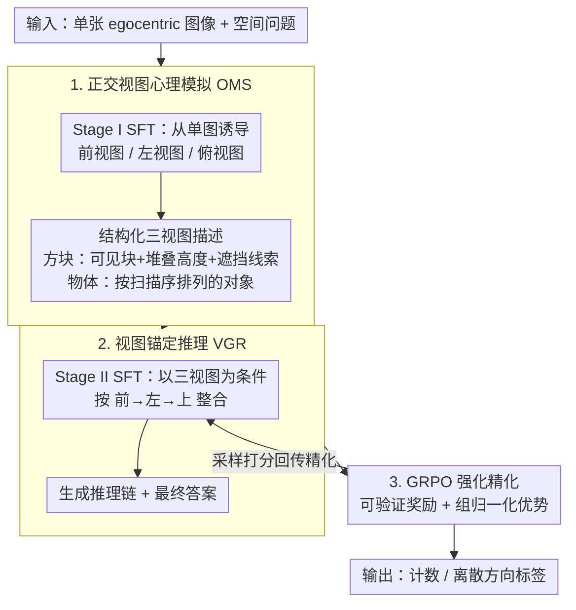

# 3ViewSense: Spatial and Mental Perspective Reasoning from Orthographic Views in Vision-Language Models

**会议**: ICML 2026  
**arXiv**: [2603.07751](https://arxiv.org/abs/2603.07751)  
**代码**: https://github.com/Jasaxion/3ViewSense  
**领域**: 多模态VLM / 空间推理  
**关键词**: 正交视图，空间推理，心理模拟，VLM，GRPO

## 一句话总结
3ViewSense 认为 VLM 空间推理的瓶颈不是视觉特征不够或语言推理太弱，而是缺少稳定的三维中间表示，因此让模型先从单张图像诱导前视图、左视图、俯视图，再基于这些正交视图推理，在遮挡计数和视角一致空间推理上显著优于同规模 VLM。

## 研究背景与动机
**领域现状**：大视觉语言模型已经能处理复杂的图文问答、符号逻辑和多步推理，但在空间理解上仍然很脆弱。典型例子是方块堆叠计数：人类儿童可以通过想象被遮挡部分完成计数，VLM 却经常在遮挡、透视和深度歧义下反复猜测。

**现有痛点**：论文先做了两个诊断。第一，冻结 VLM 视觉特征后训练轻量 MLP probe，方块计数准确率能到 55.8%，说明图像编码器已经保留了不少几何信息。第二，如果直接给同一个模型补充前/左/上三视图的文字描述，Gemini-3-pro 等模型的空间推理会大幅提升。这说明问题不只是“看不见”，也不只是“不会推理”，而是视觉特征没有被组织成推理器可稳定使用的空间结构。

**核心矛盾**：单张 egocentric 图像把三维结构压成二维投影，天然会有遮挡和深度歧义。端到端 VLM 直接建模 $P(a \mid I_{ego}, q)$ 时，必须在隐空间里同时完成三维补全、视角转换和答案推理；一旦中间状态不稳定，后续语言推理就会出现漂移和幻觉。

**本文目标**：作者希望把“从 2D 图像恢复可推理的 3D 心理表示”显式化：先让模型生成一组规范正交视图，再让模型基于这些视图回答计数、位置和属性相关问题。

**切入角度**：工程制图用正交投影把三维物体拆成前视图、左视图和俯视图，从而减少透视带来的歧义。论文把这个思想迁移到 VLM 中，把三视图作为 egocentric 感知和 allocentric 空间推理之间的接口。

**核心 idea**：用“先模拟三视图、再基于三视图推理”的 Simulate-and-Reason 管线，替代单阶段黑箱图像问答。

## 方法详解
3ViewSense 的关键不是引入额外 3D 传感器，而是把 VLM 内部推理过程拆成两个可监督的能力：Orthographic Mental Simulation (OMS) 负责把单视角图像转成结构化三视图，View-Grounded Reasoning (VGR) 负责把三视图和原始问题整合为答案。形式上，论文把答案分布写成经由潜在正交视图 $\mathcal{V}=\{v_{front}, v_{left}, v_{top}\}$ 的两阶段过程：先估计 $\hat{\mathcal{V}}=\arg\max_{\mathcal{V}}P_{\theta_{sim}}(\mathcal{V}\mid I_{ego},q)$，再用 $P_{\theta_{reason}}(a\mid \hat{\mathcal{V}},I_{ego},q)$ 输出答案。

### 整体框架
输入是一张 egocentric 图像和一个空间问题，输出是计数或离散方向标签。整条管线是「先模拟、再推理」(Simulate-and-Reason)：先由正交视图心理模拟 (OMS) 从单图诱导出前/左/上三个正交视图，再由视图锚定推理 (VGR) 以这三视图为条件整合出答案。训练分三步：先在 OrthoMind-3D 的程序化数据上做 Stage I SFT，学习生成三个正交视图的结构化描述；再做 Stage II SFT，让模型以三视图为条件生成推理链和最终答案；最后从 Stage II 模型出发，用 GRPO 在数学可验证奖励下强化答案正确性和推理稳定性。

### 关键设计
**1. 正交视图心理模拟（Orthographic Mental Simulation, OMS）：把三维补全降维成平面识别。** 这一步针对框架图最上游的痛点——单张 egocentric 图像把三维结构压成二维投影，遮挡和深度天然有歧义，端到端模型只能在隐空间里临时猜深度。OMS 让模型从单图诱导出前/左/上三个正交视图，并写成结构化描述：方块计数任务里，每个视图编码可见方块、堆叠高度和遮挡线索；物体推理任务里，视图是按扫描顺序（从左到右或从远到近）排列的对象序列。Stage I 用约 19.5k 个带三视图标注的样本做序列最大似然训练（标注从程序化合成数据里抽取，方块任务还用一个唯一性条件强制保证「三视图 ↔ 方块总数」是双射）。这样做的本质是把隐含的三维补全问题，转成更接近符号模式识别的二维平面问题，把后续推理阶段「现猜深度」的空间压到最小。

**2. 视图锚定推理（View-Grounded Reasoning, VGR）：监督推理过程而不是只监督答案。** 三视图给了结构先验，但遮挡计数、视角变换这类难题还需要把多个投影整合成一致的三维心理模型。Stage II 让模型显式读取诱导出的三视图，按「前→左→上」的固定顺序生成推理轨迹再给出答案；21k 条训练轨迹由 Gemini-3-Flash 生成、再按最终答案正确性过滤。关键在于模型学的不是「图像→标签」的捷径，而是「如何把多个投影拼成一致结构」的过程——消融里只监督最终答案的 Direct QA 在域内更高、却在 SPBench-SI 和 ViewSpatial 上几乎崩掉，正说明监督推理过程才能把「多视图整合」沉淀成可迁移能力。

**3. GRPO 强化精化与可验证奖励：在 VGR warm start 之上稳定拔高。** SFT 之后还想进一步提升计数和方向准确率、并缓解大规模 SFT 带来的泛化退化，于是从 Stage II 模型出发做强化学习：对每个问题采样一组回答，用整数计数或离散方向标签的可验证奖励打分，按组归一化优势 $\hat{A}_i=(R_i-\mu_R)/(\sigma_R+\delta)$ 配 clipped GRPO 目标优化；奖励分 strict 与 slack 两档，后者对计数误差给一定容忍。之所以放在最后、且必须以 VGR 为起点，是因为空间答案能自动验算、天然适合 RL，但若直接从 Stage I 的 OMS-SFT 启动，reward 曲线会高方差震荡，只有先有 VGR 的视图推理 warm start，强化训练才能稳定上升——这正对应框架图里 GRPO 把梯度回传给 VGR 阶段的那条回环。

### 损失函数 / 训练策略
Stage I 和 Stage II 都采用标准序列最大似然训练，分别学习三视图生成和视图条件推理。RL 阶段使用 30k 实例，其中 10k 来自 Stage II 样本重采样，20k 为新生成样本；基座模型是 Qwen3-VL-4B-Instruct。奖励配置分 strict 与 slack，两者都针对整数计数或离散方向标签做自动验证。

## 实验关键数据

### 主实验
OrthoMind-3D 主实验显示，通用 VLM 在遮挡方块计数上非常弱，而 3ViewSense 经 GRPO 后几乎把域内任务推到高准确率。

| 模型 | Block Count | Block Count (Attr.) | Object Count | Object Position | Object Count (Attr.) | Object Position (Attr.) |
|------|-------------|---------------------|--------------|-----------------|----------------------|-------------------------|
| GPT-4o | 15.8 | 53.2 | 68.3 | 39.3 | 71.2 | 47.2 |
| Gemini-3-pro | 13.8 | 80.2 | 83.3 | 71.6 | 93.2 | 93.6 |
| SpaceOm-4B | 10.4 | 47.2 | 63.6 | 17.6 | 60.2 | 25.4 |
| Qwen3-VL-4B-Instruct | 6.2 | 43.4 | 59.0 | 41.0 | 74.8 | 45.6 |
| 3ViewSense-4B-SFT | 33.4 | 63.1 | 97.0 | 91.0 | 95.4 | 91.8 |
| 3ViewSense-4B-RL-strict | 95.0 | 88.2 | 98.7 | 93.3 | 97.4 | 93.2 |
| 3ViewSense-4B-RL-slack | 94.4 | 88.6 | 98.7 | 92.3 | 98.4 | 93.4 |

在 OOD 与外部基准上，提升没有域内那么夸张，但仍能看到三视图推理的迁移收益。以 Qwen3-VL-4B-Instruct 为基线，RL-slack 在 OrthoMind-3D OOD Block Count 上从 21.2 提升到 38.7，在 MindCube-Tiny 上从 27.2 提升到 38.9。

| 模型 | OOD Block Count | OOD Object Position | MindCube-Tiny | CV-Bench 2D | SPBench-SI | ViewSpatial |
|------|-----------------|--------------------|---------------|-------------|------------|-------------|
| Qwen3-VL-4B-Instruct | 21.2 | 46.7 | 27.2 | 77.9 | 22.2 | 35.5 |
| 3ViewSense-4B-SFT | 31.1 | 72.5 | 34.9 | 74.3 | 20.6 | 34.4 |
| 3ViewSense-4B-RL-strict | 33.2 | 74.3 | 36.7 | 78.1 | 23.2 | 36.6 |
| 3ViewSense-4B-RL-slack | 38.7 | 76.1 | 38.9 | 79.9 | 25.4 | 37.1 |

### 消融实验
论文的消融重点是证明收益来自“视图条件推理过程”，而不只是更多监督数据。

| 配置 | OrthoMind-3D ID | OrthoMind-3D OOD | SPBench-SI | ViewSpatial | 说明 |
|------|----------------|-----------------|------------|-------------|------|
| Direct QA | 80.3 | 49.8 | 1.3 | 7.2 | 同样输入和超参，但只监督最终答案 |
| 3ViewSense Reasoning | 70.3 | 46.6 | 21.2 | 34.1 | 监督视图条件推理链 |

Direct QA 在 OrthoMind-3D 上更高，说明它更会拟合目标数据集；但到 SPBench-SI 和 ViewSpatial 几乎崩掉。3ViewSense Reasoning 的域内分数略低，却能保留可迁移的空间推理能力。

| Stage | OrthoMind-3D ID | OrthoMind-3D OOD | MindCube-Tiny | ViewSpatial | 说明 |
|-------|----------------|-----------------|---------------|-------------|------|
| OMS-SFT only | 48.7 | 41.3 | 29.6 | 33.4 | 只会诱导视图，不足以回答复杂查询 |
| VGR-SFT only | 70.3 | 46.6 | 32.4 | 34.1 | 直接学习视图条件推理 |
| OMS→VGR two-stage | 78.6 | 49.5 | 34.9 | 34.4 | 先学视图诱导再学推理，整体最稳 |

### 关键发现
- 属性条件计数明显比纯计数容易，因为颜色、大小等显著属性把真实三维枚举问题简化成局部检索问题。
- ICL 不能稳定教会三视图推理；只有少数强闭源模型有有限改善，多数开源模型反而退化，说明这不是简单 prompt 技巧。
- 基座模型在方块计数上会产生超过 10k tokens 的冗长推理，3ViewSense 因为先形成视图草图，输出更短且更稳定。
- GRPO 从 Stage II VGR-SFT 初始化时 reward 曲线稳定上升；从 Stage I OMS-SFT 直接启动则高方差震荡，说明“视图推理 warm start”对 RL 很关键。

## 亮点与洞察
- 论文最有价值的地方是把 VLM 空间失败做成了可诊断问题：视觉 probe 与显式三视图提示分别排除了“看不见”和“不会想”的解释，把瓶颈定位到缺少中间空间接口。
- 正交投影是一个很朴素但有效的归纳偏置。它没有引入重型 3D 模块，却把遮挡计数中最难的深度歧义显式拆开，适合和现有 VLM 训练管线结合。
- Direct QA 消融很有启发：更高的域内答案准确率不等于更好的空间能力。真正可迁移的是对中间表示和推理过程的监督，而不是答案模式拟合。

## 局限与展望
- 三个固定正交视图不能覆盖所有空间问题。涉及支撑关系、可供性、动力学或物理稳定性的任务，需要比几何投影更丰富的中间表示。
- OMS 依赖程序化合成和可获得三视图真值的训练数据，开放世界图像中很难直接拿到同等质量的正交标注。
- OOD 和外部基准提升相对温和，说明模型学到的三视图能力仍有数据域限制；未来需要让模型估计视图诱导不确定性，并在必要时自适应选择其他空间抽象。
- 当前方法增加了推理链生成和训练阶段，实际部署时还要权衡输出长度、延迟和空间推理收益。

## 相关工作与启发
- **vs Spatial-MLLM / 外部 3D 编码器方法**: 这些方法常依赖额外视觉模块、mask 或 3D 特征，3ViewSense 更像是在语言接口内学习可解释的空间中间表示，成本更低但受限于三视图表达能力。
- **vs SpatialLadder / RL 自纠错方法**: 课程学习或通用 RL 强化的是训练策略，3ViewSense 的核心是把推理对象换成 view-consistent representation，两者未来可以结合。
- **vs MindCube / mental imagery 方法**: MindCube 更偏隐式想象三维结构，3ViewSense 用规范正交投影约束这种想象，使中间过程更可检查、更容易监督。

## 评分
- 新颖性: ⭐⭐⭐⭐⭐ 把工程制图式正交视图引入 VLM 空间推理，并用诊断实验支撑问题定位，idea 简洁但抓住要害。
- 实验充分度: ⭐⭐⭐⭐ 主实验、OOD、外部基准和多层消融都比较完整，但真实开放世界任务和部署成本分析还不够。
- 写作质量: ⭐⭐⭐⭐⭐ 从诊断到方法再到消融的逻辑非常顺，读者能清楚看到每个模块为什么存在。
- 价值: ⭐⭐⭐⭐⭐ 对多模态空间推理很有启发，尤其适合作为“显式中间表示优于答案拟合”的案例。

<!-- RELATED:START -->

## 相关论文

- [\[ICML 2026\] Active Exploring like a Pigeon: Reinforcing Spatial Reasoning via Agentic Vision-Language Models](active_exploring_like_a_pigeon_reinforcing_spatial_reasoning_via_agentic_vision-.md)
- [\[ICML 2026\] Learning GUI Grounding with Spatial Reasoning from Visual Feedback](learning_gui_grounding_with_spatial_reasoning_from_visual_feedback.md)
- [\[ICCV 2025\] Perspective-Aware Reasoning in Vision-Language Models via Mental Imagery Simulation](../../ICCV2025/multimodal_vlm/perspective-aware_reasoning_in_vision-language_models_via_mental_imagery_simulat.md)
- [\[ICML 2026\] Bad Seeing or Bad Thinking? Rewarding Perception for Vision-Language Reasoning](bad_seeing_or_bad_thinking_rewarding_perception_for_vision-language_reasoning.md)
- [\[ICLR 2026\] SpinBench: Perspective and Rotation as a Lens on Spatial Reasoning in VLMs](../../ICLR2026/multimodal_vlm/spinbench_perspective_and_rotation_as_a_lens_on_spatial_reasoning_in_vlms.md)

<!-- RELATED:END -->
