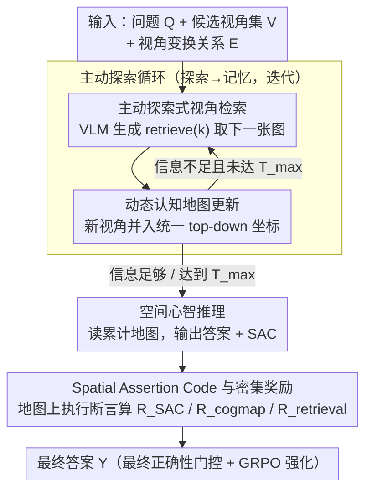

# Active Exploring like a Pigeon: Reinforcing Spatial Reasoning via Agentic Vision-Language Models

**会议**: ICML 2026  
**arXiv**: [2606.02459](https://arxiv.org/abs/2606.02459)  
**代码**: https://github.com/dw-dengwei/active-spatial-reasoning.git  
**领域**: 多模态VLM / 空间推理  
**关键词**: 主动视觉探索, 空间推理, 动态认知地图, Spatial Assertion Code, GRPO  

## 一句话总结
本文把 VLM 空间推理从“被动看完所有视角再回答”改造成“按问题主动取景、更新认知地图、用可执行空间断言验证推理”的 agentic 流程，并用密集奖励微调 Qwen2.5-VL-3B，在 MindCube-Tiny 上取得 80.5% overall accuracy，尤其把 Rotation 子集提升到 85.0%。

## 研究背景与动机
**领域现状**：多模态 VLM 已经能处理图文理解、视觉问答和一部分空间关系问题，但多数方法仍把所有图像一次性塞进上下文，让模型在静态输入里推理。MindCube、3DThinker 等空间 VLM 进一步引入认知地图或 3D 重建辅助任务，不过它们的感知方式仍然偏被动。

**现有痛点**：真实 embodied 场景里，agent 很少能一次看到完整环境。它需要根据问题选择要看的视角，并把碎片化观察拼成连续空间记忆。被动输入所有视角不仅成本高，也容易让模型在无关视觉信息里迷失；而已有 RLVR/GRPO 类训练通常只看最终答案对错，奖励过稀疏，很难告诉模型“哪一步空间关系推错了”。

**核心矛盾**：空间推理需要中间过程可验证，但 VLM 的自然语言推理是开放式文本，很难直接判断每个中间关系是否正确。若只用最终答案奖励，模型可能学到表面模式；若用 LLM judge，又会把 hallucination 和过度自信带进奖励。

**本文目标**：作者希望同时解决三个子问题：让 VLM 主动选择相关视角；让多次观察形成可更新的空间记忆；让中间空间关系可以被程序化检查，从而给 RL 训练提供比最终 0/1 更细的反馈。

**切入角度**：论文借鉴生物导航里的 cognitive map，把观察到的物体、相机位置和朝向统一放进 top-down 坐标系；再把“某物在某视角左边/前方”等自然语言关系转成 Python 表达式，让这些表达式在认知地图上执行。

**核心 idea**：用动态认知地图承载空间记忆，用 Spatial Assertion Code 把中间推理变成可执行断言，再把 retrieval、map update 和 SAC correctness 组合成密集奖励来强化主动空间推理。

## 方法详解
这篇论文的关键不只是“加了一个 memory”，而是把空间问答拆成一个顺序决策过程。模型每一步都处在当前 cognitive map 状态里，根据问题和视角变换关系决定下一张要看的图；看完后更新地图；当信息足够时停止探索并回答。训练时，模型还被要求在自然语言解释旁边输出 SAC，让系统能检查中间关系是否与当前地图一致。

### 整体框架
输入包括问题 $\mathcal{Q}$、候选视角集合 $V=\{v_n\}$，以及视角之间的变换描述 $E$。系统状态 $s_t$ 是动态认知地图，动作 $a_{t+1}$ 是由 VLM 生成的检索代码，例如 `retrieve(3)`。执行动作后，模型看到对应视角 $v_{t+1}$，再用同一个 VLM 更新地图 $s_{t+1}=\mathcal{P}_\theta(s_t,v_{t+1},a_{t+1})$。这个循环持续到模型决定停止，最后根据累计地图输出答案。

动态认知地图用统一 top-down 坐标系保存两个集合：物体集合 $\mathcal{O}_t=\{(o_i,\mathbf{p}_i,\mathbf{d}_i)\}$，记录物体类别、位置和朝向；视角集合 $\mathcal{V}_t=\{(v_j,\mathbf{c}_j,\mathbf{f}_j)\}$，记录相机位置和朝向。这样，后续看到的新视角不只是附加到文本上下文里，而是被整合进同一个空间坐标系统。

训练分两阶段。第一阶段 SFT 用三类冷启动数据让模型学会检索相关视角、更新认知地图、生成带 SAC 的空间推理。第二阶段 RFT 在 SFT 模型上用 GRPO 做强化微调，奖励由最终正确性门控，再加上 retrieval、cognitive map、SAC 三个中间项。

### 关键设计
1. **主动探索式视角检索：按问题取景，而非一次看完所有图**：被动把所有视角塞进上下文不仅成本高，在 Rotation 这类问题里不同视角之间几乎没有共享视觉锚点，模型很容易在无关信息里迷失。本文把检索动作写成可解析的 Python-like action（如 `retrieve(k)` 表示取第 $k$ 张视角），让 VLM 每一步根据当前认知地图和问题主动选下一张最相关的图，既可以多轮探索、也可以在达到最大步数 $T_{\max}$ 前主动停止。这样模型沿着 egocentric reference frame 逐步拼接空间关系，把“一次性对齐所有视角”这件难事拆成若干可控的小步。

2. **动态认知地图作为结构化长期记忆：用坐标系替代文本历史**：空间推理最难的是视角变换与坐标对齐，而纯文本历史上下文会把精确的位置结构丢掉。本文用统一 top-down 坐标系下的地图状态 $s_t=\{\mathcal{O}_t,\mathcal{V}_t\}$ 当记忆：$\mathcal{O}_t$ 存物体的类别、位置与朝向，$\mathcal{V}_t$ 存相机的位置与朝向，每观察一张新视角就把它并入这个坐标系（$s_{t+1}=\mathcal{P}_\theta(s_t,v_{t+1},a_{t+1})$）。后续推理不再回读一长串图文历史，而是直接在坐标里读“哪些物体在哪、视角从哪看”，从而把跨视角观察沉淀成可积累的几何状态。

3. **Spatial Assertion Code 与密集奖励：把中间推理变成可执行验证**：只用最终答案奖励，模型只知道“结果错了”，却不知道错在检索、地图还是关系判断，反馈过于稀疏；而用 LLM judge 又会把幻觉和过度自信带进奖励。SAC 的做法是把自然语言空间关系翻译成布尔型 Python 表达式——“从 view 4 看，object 1 在 object 0 左侧”就对应 `obj1 in obj0.left(view=v4)`，再在认知地图上下文里执行，用 $R_{SAC}=\frac{1}{M}\sum_i \mathbb{1}(\text{eval}(\text{code}_i,s_t)=\texttt{True})$ 统计成立比例。它和检验地图正确性的 $R_{cogmap}$、检验取景相关性的 $R_{retrieval}$ 一起，被最终正确性门控（答错则总奖励为 0，防止 reward hacking）组合成密集奖励，把原本不可控的自然语言中间过程变成可计算信号，是本文 RL 设计的核心。

### 损失函数 / 训练策略
SFT 阶段用标准自回归交叉熵：$\mathcal{L}_{SFT}=-\mathbb{E}_{(x,y)\sim\mathcal{D}_{SFT}}[\log p_\theta(y|x)]$，其中训练数据由 retrieval、cognitive map update 和 SAC reasoning 三部分组成。

RFT 阶段使用 GRPO。奖励函数先由最终答案正确性做门控：若最终答案错，总奖励为 0，避免模型只优化中间格式而不答对题；若最终答案对，则加入 $R_{retrieval}$、$R_{cogmap}$、$R_{SAC}$ 三个密集项。论文中的形式可概括为 $R=\mathbb{1}_{correct}[\mathbb{1}_{correct}+w(R_{retrieval}+R_{cogmap}+R_{SAC})]$。其中 $R_{SAC}$ 通过执行中间代码断言得到，$R_{cogmap}$ 对比地图是否接近标注，$R_{retrieval}$ 检查取到的视角是否与问题相关。

## 实验关键数据

### 主实验
MindCube-Tiny 上，本文方法基于 Qwen2.5-VL-3B-Instruct 训练，和随机基线、通用 VLM、专门空间 VLM 对比。最重要的现象是 Rotation 子集的跃升，因为这个子集最接近“有限视野下连续转向”的 embodied spatial reasoning。

| 方法 | 感知/记忆方式 | Overall ↑ | Rotation ↑ | Among ↑ | Around ↑ |
|------|---------------|-----------|------------|---------|----------|
| Qwen2.5-VL-3B-Instruct | 被动输入 | 33.21 | 37.37 | 33.26 | 30.34 |
| GPT-4o | 被动输入 | 38.81 | 32.65 | 40.17 | 29.16 |
| MindCube-Qwen2.5-VL-3B | 被动 + 静态认知地图 | 70.7 | 48.0 | 79.2 | 68.4 |
| 3DThinker-Qwen2.5-VL-3B | 被动 + 3D 重建辅助 | 75.2 | 55.5 | 81.8 | 75.2 |
| Ours | 主动探索 + 动态认知地图 | 80.5 | 85.0 | 81.0 | 75.6 |

### 消融实验
论文把感知范式、奖励组件、记忆形式和训练阶段分开分析。完整方法的收益主要来自 SAC 密集奖励和 SFT+RL 的组合。

| 配置 | 关键指标 | 说明 |
|------|---------|------|
| Passive RFT | Rotation Acc. 27.5 | 不主动逐步取景，直接处理视角信息 |
| Active RFT | Rotation Acc. 38.5 | 同样从 base checkpoint 做 RFT，主动感知带来 +11.0 |
| Full reward | Overall Acc. 80.4 | 完整 dense reward 组合 |
| w/o $R_{retrieval}$ | Overall Acc. 72.5 | 去掉检索相关性奖励，下降 7.9 |
| w/o $R_{cogmap}$ | Overall Acc. 72.6 | 地图正确性不再被监督，下降 7.8 |
| w/o $R_{SAC}$ | Overall Acc. 70.2 | 中间空间断言奖励最关键，下降 10.2 |
| Context memory | Acc. 50.9 | 只把历史作为普通上下文累积 |
| Cognitive map | Acc. 54.2 | 结构化地图带来 +3.3 |

### 关键发现
- Rotation 是本文最有说服力的子集：之前最好方法只有 55.5，本文到 85.0，说明主动探索和动态坐标记忆确实缓解了视角拼接问题。
- SAC 奖励的消融下降最大，说明空间推理的中间步骤可执行化比单纯增加文本解释更有价值。
- SFT 是 RL 的前提。论文报告 base 模型 pass@1 只有 25.4，SFT 可到 67.2，Base+SFT+RL 最终到 80.5，说明 RL 主要是在已有 agentic 行为上做强化，而不是从零学会格式和工具使用。

## 亮点与洞察
- 把空间推理拆成“探索-记忆-验证”三个可训练接口很清晰。相比只说让 VLM 更会 3D reasoning，这篇论文把可操作的动作、状态和奖励都定义出来了。
- SAC 是一个很实用的设计：它不要求模型输出完整可执行程序，只要求关键空间关系能被布尔表达式检查，因此比通用 program-of-thought 更贴近空间 QA。
- 最终正确性门控避免了 dense reward 的常见副作用。模型只有答对时才拿到中间奖励加成，降低了为了刷 SAC 或 map 分数而偏离任务目标的风险。
- 动态认知地图的思想可以迁移到机器人导航、室内问答、视频多视角理解等任务，只要能把观察变成统一坐标中的对象和相机状态。

## 局限与展望
- 方法依赖 MindCube 中可获得的视角变换关系和认知地图监督。真实机器人场景中，位姿估计、遮挡和检测误差会让 map update 更难。
- SAC 的表达能力覆盖的是相对明确的空间关系；若问题涉及连续几何量、物体形变或模糊语义，手写关系 API 可能不够。
- 训练成本不低：SFT 约 22 小时，RL 约 1 天，且使用 8 张 A100。对更大 VLM 或真实场景数据扩展时，需要更省的 reward computation 和 rollout 策略。
- 论文主要在 MindCube-Tiny 上验证，缺少真实 embodied benchmark 或机器人闭环执行实验。下一步可以把认知地图和 SAC 接到 SLAM/导航系统里，测试真实视角噪声下是否仍稳定。

## 相关工作与启发
- **vs MindCube**: MindCube 也使用 cognitive map，但偏静态、被动；本文把地图放进顺序决策循环，并用 SAC 提供密集奖励，因此在 Rotation 上优势明显。
- **vs 3DThinker**: 3DThinker 用 3D reconstruction 辅助空间理解，仍然一次性处理输入；本文强调主动检索和中间验证，适合信息逐步获取的场景。
- **vs RLVR/GRPO 空间推理方法**: 既有方法多用最终答案作为 verifiable reward；本文把可验证性推进到中间步骤，说明“reward design 的结构化”比单纯增加 rollout 更关键。
- **启发**: 对需要多步视觉工具调用的 VLM 任务，可以优先考虑把中间状态设计成结构化 memory，再把模型解释转为可执行 assertion，而不是把所有监督压在最终答案上。

## 评分
- 新颖性: ⭐⭐⭐⭐⭐ 用 SAC + 动态认知地图把空间推理中间过程变成可验证 RL 信号，设计比较鲜明。
- 实验充分度: ⭐⭐⭐⭐ MindCube 上主实验和消融完整，但真实 embodied 场景验证不足。
- 写作质量: ⭐⭐⭐⭐ 方法流程、奖励设计和消融逻辑清楚，部分公式和表格排版略拥挤。
- 价值: ⭐⭐⭐⭐⭐ 对 agentic VLM、空间推理和可验证奖励设计都有较高复用价值。

<!-- RELATED:START -->

## 相关论文

- [\[ICML 2026\] 3ViewSense: Spatial and Mental Perspective Reasoning from Orthographic Views in Vision-Language Models](3viewsense_spatial_and_mental_perspective_reasoning_from_orthographic_views_in_v.md)
- [\[CVPR 2026\] ARM-Thinker: Reinforcing Multimodal Generative Reward Models with Agentic Tool Use and Visual Reasoning](../../CVPR2026/multimodal_vlm/arm-thinker_reinforcing_multimodal_generative_reward_models_with_agentic_tool_us.md)
- [\[ICML 2026\] Learning GUI Grounding with Spatial Reasoning from Visual Feedback](learning_gui_grounding_with_spatial_reasoning_from_visual_feedback.md)
- [\[ICML 2026\] Circle-RoPE: Cone-like Decoupled Rotary Positional Embedding for Vision-Language Models](circle-rope_cone-like_decoupled_rotary_positional_embedding_for_large_vision-lan.md)
- [\[ICML 2026\] The Perceptual Bandwidth Bottleneck in Vision-Language Models: Active Visual Reasoning via Sequential Experimental Design](the_perceptual_bandwidth_bottleneck_in_vision-language_models_active_visual_reas.md)

<!-- RELATED:END -->
