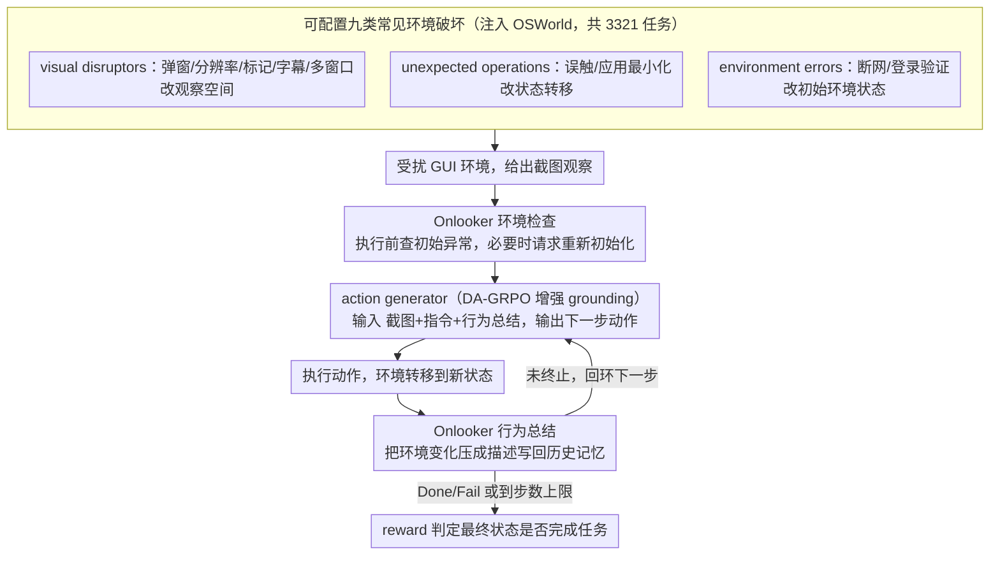

# AgentHijack: Benchmarking Computer Use Agent Robustness to Common Environment Corruptions

**会议**: ICML2026  
**arXiv**: [2605.25707](https://arxiv.org/abs/2605.25707)  
**代码**: https://AgentHijack.github.io  
**领域**: LLM Agent / 多模态鲁棒性  
**关键词**: computer-use agent, GUI Agent, 环境破坏, 鲁棒性评测, DA-GRPO  

## 一句话总结
本文提出 AgentHijack，用 9 类可配置的日常环境破坏评测 computer-use Agent 鲁棒性，并进一步用 DA-GRPO 强化 grounding、引入 onlooker 进行行为总结与环境检查，使 UI-TARS-1.5-7B 在平均成功率上从 18.74% 提升到 22.89%。

## 研究背景与动机

**领域现状**：多模态大模型驱动的 computer-use Agent 已经能在虚拟机、网页和移动端完成办公、系统操作、浏览器任务等复杂流程。OSWorld、WebArena、AndroidWorld 等 benchmark 主要关注干净环境下的任务成功率，评估 Agent 能否看懂截图、规划步骤并执行点击或输入。

**现有痛点**：真实桌面环境很少保持“干净”。弹窗、分辨率变化、字幕遮挡、其他应用窗口、误触、窗口最小化、网络断开、登录验证等情况都会打断执行流。现有 Agent 在这些常见破坏下会出现定位漂移、错误归因和无意义重复尝试，但已有鲁棒性 benchmark 要么关注 adversarial attack，要么是 QA 形式，缺少真实可执行 GUI 环境和可配置破坏。

**核心矛盾**：computer-use Agent 的部署风险来自日常环境不确定性，而不是只来自恶意攻击；但主流评测仍把环境假设为理想状态，导致模型在真实世界中最容易暴露的 failure mode 没被系统测量。

**本文目标**：作者希望构建一个能在 OSWorld 类虚拟机环境中注入常见破坏的 benchmark，系统评估 Agent 的 corruption robustness，并提出一个能缓解这些破坏影响的 Agent 框架。

**切入角度**：论文不把这些扰动称为 adversarial robustness，而定义为 corruption robustness：破坏不改变用户任务本身，也没有直接恶意意图，而是改变观察空间、状态转移或环境状态，让 Agent 的闭环执行偏离原计划。

**核心 idea**：用可配置的真实 GUI 破坏暴露 Agent 的 grounding、记忆和环境检查短板，再用“增强 grounding 的 action generator + 旁观者 onlooker”共同提升鲁棒性。

## 方法详解

### 整体框架

AgentHijack 先把 computer-use Agent 建模为 POMDP。Agent 每一步根据截图观察 $o_t$ 输出动作 $a_t$，环境转移到新状态 $s_{t+1}$；达到最大步数或输出 Done/Fail 后，用任务 reward 判断最终状态是否满足目标。普通 benchmark 评估的是干净环境下的平均成功率，而 AgentHijack 评估的是被 corruption 函数 $\mathcal{C}_i$ 改变后的观察、状态或转移下的成功率。

benchmark 基于 OSWorld 构造，共 3321 个任务，注入 9 类常见 corruption，并提供 YAML 配置以调节位置、强度和内容。破坏被分成三组：visual disruptors 改变截图观察，如弹窗、分辨率变化、屏幕标记、字幕、多应用窗口；unexpected operations 干扰状态转移，如误触和应用最小化；environment errors 改变初始环境状态，如网络错误和登录验证。

在方法侧，AgentHijack-Agent 包含两个角色。action generator 是执行任务的 GUI Agent，基于 UI-TARS-1.5-7B，并通过 DA-GRPO 在不同破坏环境中训练以增强 grounding。onlooker 是环境旁观者，先在执行前检查初始环境是否异常，执行中持续总结环境变化，把历史截图和动作压缩为行为描述，帮助 action generator 判断“这是自己造成的变化，还是环境外部扰动”。

### 关键设计

**1. 可配置的九类常见环境破坏：把真实桌面的非理想情况系统化注入 benchmark**

现有 GUI benchmark 默认环境干净，而真实桌面充满弹窗、分辨率变化、误触、断网等日常扰动——它们不改变任务目标、也无恶意，却足以打断 Agent 的闭环执行。AgentHijack 据此把 9 类破坏按“扰动作用的层面”分成三组，正好对应 POMDP 里观察、转移、状态三处：visual disruptors（弹窗、分辨率变化、标记、字幕、多应用窗口）改变截图观察 $\mathcal{O}$，unexpected operations（误触、应用最小化）干扰状态转移 $\mathcal{T}$，environment errors（断网、登录验证）改变初始环境状态 $\mathcal{S}$。每类破坏都有具体注入手段：弹窗在可覆盖区域绘制诱导文本，分辨率变化直接 resize 截图，marks/subtitle 在随机或指定区域画视觉干扰，multi apps 启动无关应用，accidental touch 在指定步点击随机按钮，app minimization 触发 Win+D，network error 用防火墙规则阻断外网，verification 用 Win+L 锁屏。关键是每类破坏都用 YAML 暴露强度、内容、发生时机等参数，研究者能造出不同变体，避免 benchmark 只测一种固定 failure，也能分离地考察“强度 / 内容 / 位置”对鲁棒性各自的影响。

**2. DA-GRPO：在多种破坏环境中 rollout 来强化 grounding**

用 SFT 强化 grounding 需要大量轨迹、且学不到自纠错；普通 GRPO 虽能端到端优化，但只在单一（干净）环境 rollout，学不会跨破坏的鲁棒性。DA-GRPO（Data-Augmented GRPO）的关键改动是让同一条指令在随机抽取的破坏环境 $c\in\mathcal{C}$ 下 rollout 出一组响应 $\{o_i^c\}$，再用 GRPO 的组相对优势 $\hat{A}_{i,j}=(r_i-\mu)/\sigma$ 做归一化——这样组内比较天然覆盖了多种视觉与状态扰动；当 $c$ 恒为干净环境时它退化回普通 GRPO。奖励由任务成功奖励与格式奖励相加 $r_i=r_i^{success}+r_i^{format}$（完成任务得 1，schema 不合规罚 −1）。由于当前 Agent 成功轨迹稀少，一批 rollout 很可能全失败、组内优势全为零而没有正向学习信号；DA-GRPO 沿用 ARPO 的 experience replay buffer 缓存历史成功轨迹，一旦整批全失败就随机替换其中一条为已存的成功轨迹，保证每个 batch 至少有一条非零奖励信号可供模仿。

**3. Onlooker：执行前环境检查 + 执行中行为总结的旁观者视角**

GUI Agent 的历史上下文通常是纯“截图+动作”序列 $\{o_1,a_1,\dots\}$，带来两个老毛病——一是只盯自己动作引起的变化、忽略外部 unexpected operations，于是把误触、窗口最小化误归因为自己的操作；二是截图里 UI 元素太多、抓不住关键，遇到被触发的无关内容容易跑偏。Onlooker 是一个专门盯环境的辅助 Agent（默认也用微调后的 UI-TARS-1.5-7B），承担两件事：执行前，它对照一个外部错误信息库检查初始环境是否存在断网、登录验证等异常，发现就报错并请求重新初始化，避免 Agent 在不可执行环境里空耗；执行中，它记录每一次环境变化并压成简短描述 $d_t$，把上下文改写成 $\{o_1,d_1,\dots,o_t,d_t\}$，让 action generator 能分清“这是我造成的变化还是外部扰动”，从而恢复原任务线索。

### 损失函数 / 训练策略

AgentHijack-Agent 以 UI-TARS-1.5-7B 为基础模型，在 128 个 AgentHijack 任务上训练 15 个 epoch。训练使用 VERL，batch size 为 1，rollout 数为 4，学习率 $1\times10^{-6}$，梯度累积 4，关闭 KL loss 以鼓励探索。默认 onlooker 也使用微调后的 UI-TARS-1.5-7B；截图分辨率为 $1920\times1080$，最大执行步数为 10。

评估覆盖 9 个代表性 Agent，包括 GLM-4.5V、Llama-3.2-90B-Vision-Instruct、Qwen2.5-VL-72B-Instruct、GPT-4o、Claude-3.7-Sonnet、Gemini-2.5-Pro、UI-TARS-7B-DPO、UI-TARS-72B-DPO 和 UI-TARS-1.5-7B。所有模型统一设置 temperature 0.6、top-p 0.9、最大输出 1500 tokens，历史上下文最多包含 15 张 GUI 截图。

## 实验关键数据

### 主实验

| Agent | Clean | Pop ups | Resolution | Accidental Touch | Network Error | Verification | Average |
|-------|-------|---------|------------|------------------|---------------|--------------|---------|
| Qwen2.5-VL-72B-Instruct | 10.99% | 1.86% | 6.38% | 7.48% | 7.48% | 6.63% | 7.47% |
| GPT-4o | 5.38% | 1.44% | 4.82% | 3.12% | 4.24% | 3.25% | 3.69% |
| Gemini-2.5-Pro | 8.11% | 5.20% | 6.98% | 4.61% | 7.02% | 7.81% | 5.82% |
| UI-TARS-72B-DPO | 22.38% | 15.51% | 14.32% | 14.44% | 19.76% | 9.42% | 16.96% |
| UI-TARS-1.5-7B | 24.21% | 10.28% | 11.69% | 22.54% | 22.02% | 10.48% | 18.74% |
| AgentHijack-Agent | 27.80% | 21.51% | 12.53% | 24.37% | 23.09% | 20.15% | 22.89% |

### 消融实验

| 分析项 | 设置 | 关键指标 | 说明 |
|------|------|---------|------|
| 相对最强 baseline | AgentHijack-Agent vs UI-TARS-1.5-7B | 平均 +4.15 点，Clean +3.59，Pop ups +11.23，Verification +9.67 | onlooker 对弹窗和验证类问题帮助最大 |
| 破坏强度 | 分辨率缩放、marks 数量、误触/最小化频率 | 强度越大性能越低，但 AgentHijack-Agent 始终高于 base | DA-GRPO 训练不是只适配默认强度 |
| 破坏内容 | 不同弹窗文本、字幕文本、标记形状和颜色 | 性能会随内容波动，但框架保持稳定提升 | 方法学到的是抗干扰策略，而非记住固定图案 |
| 破坏位置 | 字幕位置、误触/最小化发生在 early/middle/late step | 不同空间和时间位置下均有收益 | onlooker 的历史总结能缓解发生时机变化 |
| 模块必要性 | 去掉 RL 或去掉 onlooker | 两者都会导致明显掉点 | grounding 强化和环境旁观视角是互补的 |

### 关键发现
- 当前通用 MLLM 即使很大，在真实 GUI 执行中的成功率也很低。GPT-4o 平均只有 3.69%，Gemini-2.5-Pro 为 5.82%，说明 GUI Agent 能力不能直接从 VLM 问答能力外推。
- UI-TARS 系列在 clean 环境更强，但面对 corruption 仍明显下降。UI-TARS-1.5-7B clean 为 24.21%，平均降到 18.74%，verification 和 pop-ups 是最脆弱的两类。
- AgentHijack-Agent 对所有 corruption 类型都有正收益，尤其是 pop-ups 和 verification，说明环境检查与行为总结确实能减少无意义点击和不可执行环境中的盲目尝试。
- resolution 的提升最小，只有 +0.84 点，暗示坐标/缩放类 grounding 仍是 GUI Agent 的硬问题，仅靠当前 DA-GRPO 和 onlooker 不够彻底。

## 亮点与洞察
- 论文把“日常破坏”从安全攻击中区分出来很有价值。真实部署失败经常不是因为用户恶意诱导，而是因为一个弹窗、一个登录页或一个窗口状态变化；这类问题应该有独立评测轴。
- benchmark 的九类 corruption 覆盖了观察空间、状态转移和初始环境三种层面，这比单纯视觉遮挡更完整。尤其是 accidental touch 和 app minimization 能测到 Agent 是否会错误归因。
- onlooker 的设计朴素但有效，相当于给执行 Agent 加了一个“环境日志员”。对长 GUI 轨迹来说，把历史截图压缩为环境变化摘要，比简单堆更多截图更符合人的调试方式。
- DA-GRPO 加 replay buffer 的细节很实用。GUI 任务成功轨迹稀少，如果一批 rollout 全失败，组相对优势会没有正向学习信号；缓存成功轨迹能让训练不断看到可模仿的恢复路径。

## 局限与展望
- AgentHijack 基于 OSWorld 和虚拟机桌面，主要覆盖桌面 GUI；移动端、网页浏览器、远程桌面和企业软件中的 corruption 可能有不同表现。
- 成功率整体仍然偏低，AgentHijack-Agent 平均也只有 22.89%。这说明框架缓解了问题，但离可部署鲁棒性还有很远距离。
- onlooker 增加了推理成本，并且默认使用同一个微调模型；如果 onlooker 自身判断错误，可能把错误摘要传给 action generator。
- benchmark 的 corruption 是作者预定义的 9 类，虽然可配置，但仍无法覆盖所有真实桌面异常。后续可以引入自动 mined corruptions、用户日志重放或真实系统事件流。
- DA-GRPO 训练只用 128 个任务，规模相对有限。未来可以研究更大规模的 corruption curriculum，以及把视觉 grounding、坐标校准和环境状态恢复分开优化。

## 相关工作与启发
- **vs OSWorld / WebArena / AndroidWorld**: 这些 benchmark 主要评估干净环境下的任务完成能力；AgentHijack 直接在真实交互环境中注入常见异常，评估部署鲁棒性。
- **vs Agent-SafetyBench / SafeArena 等安全评测**: 这些工作关注高风险或恶意任务倾向；AgentHijack 关注非恶意、日常发生的 corruption，不改变任务目标。
- **vs GUI-Robust / Env. Distractions**: 它们也关注常见干扰，但多采用 QA 格式或缺乏灵活配置；AgentHijack 在虚拟机中执行任务，能测闭环操作失败。
- **vs UI-TARS**: UI-TARS 是强 GUI Agent baseline，AgentHijack 显示它在 clean 环境强但仍怕弹窗、分辨率和验证错误；本文在其基础上通过 DA-GRPO 和 onlooker 改善鲁棒性。
- **vs 普通 GRPO GUI Agent 训练**: 普通 GRPO 多在单一环境 rollout；DA-GRPO 把 corruption 当作环境数据增强，让同一任务在多种异常下产生组内比较。

## 评分
- 新颖性: ⭐⭐⭐⭐☆ corruption robustness 的定义和可执行 benchmark 很有现实意义，方法框架相对直观但抓住了关键 failure mode。
- 实验充分度: ⭐⭐⭐⭐☆ 覆盖 9 类 corruption、9 个 Agent、强度/内容/位置/onlooker 消融；不足是主方法训练任务规模偏小，部分消融数字主要在图中呈现。
- 写作质量: ⭐⭐⭐⭐☆ 动机和案例清楚，benchmark 构造具体；方法公式和实验图表略显分散，需要结合附录理解 DA-GRPO 细节。
- 价值: ⭐⭐⭐⭐⭐ 对 GUI Agent 真实部署非常有价值，尤其提醒研究者不要只看 clean task success，还要测环境异常下的恢复能力。

<!-- RELATED:START -->

## 相关论文

- [\[CVPR 2026\] AVR: Adaptive VLM Routing for Computer Use Agents](../../CVPR2026/multimodal_vlm/adaptive_vision-language_model_routing_for_computer_use_agents.md)
- [\[AAAI 2026\] "Are We Done Yet?": A Vision-Based Judge for Autonomous Task Completion of Computer Use Agents](../../AAAI2026/multimodal_vlm/are_we_done_yet_a_vision-based_judge_for_autonomous_task_completion_of_computer_.md)
- [\[NeurIPS 2025\] Mint: A Simple Test-Time Adaptation of Vision-Language Models against Common Corruptions](../../NeurIPS2025/multimodal_vlm/mint_a_simple_testtime_adaptation_of_visionlanguage_models_a.md)
- [\[AAAI 2026\] VipAct: Visual-Perception Enhancement via Specialized VLM Agent Collaboration and Tool-use](../../AAAI2026/multimodal_vlm/vipact_visual-perception_enhancement_via_specialized_vlm_age.md)
- [\[ICML 2026\] Any3D-VLA: Enhancing VLA Robustness via Diverse Point Clouds](any3d-vla_enhancing_vla_robustness_via_diverse_point_clouds.md)

<!-- RELATED:END -->
