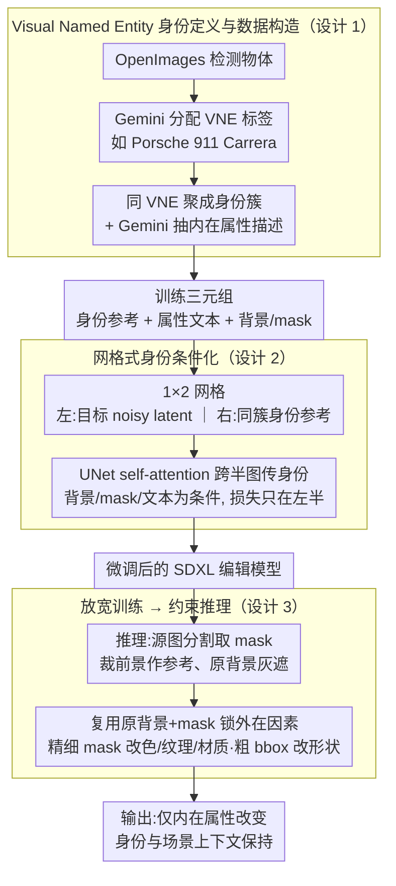

# Alterbute: Editing Intrinsic Attributes of Objects in Images

**会议**: ICML 2026  
**arXiv**: [2601.10714](https://arxiv.org/abs/2601.10714)  
**代码**: 无公开代码（项目页: https://talreiss.github.io/alterbute/）  
**领域**: 图像生成 / 图像编辑  
**关键词**: 图像编辑, 内在属性编辑, 扩散模型, 视觉命名实体, 身份保持  

## 一句话总结
Alterbute 用 VLM 自动挖掘 Visual Named Entity 身份簇，并在扩散模型中联合条件化身份参考、属性文本、背景和 mask，从而统一编辑物体颜色、纹理、材质和形状，同时尽量保持物体身份与场景上下文。

## 研究背景与动机
**领域现状**：图像编辑模型已经能做大范围文本引导修改、局部 inpainting、风格迁移和 subject-driven generation。很多方法能保持粗类别或实例外观，但当用户要求“把这辆车变成红色”“把桌面材质改成木头”“改变物体形状”时，既要改内在属性，又要保留身份，难度明显更高。

**现有痛点**：通用图像编辑器常常改错对象、改变身份或忽略目标属性；subject personalization 方法又把身份定义得太严格，几乎不允许颜色、材质、纹理、形状发生变化。属性专门方法通常只解决材质或纹理等单一属性，难以覆盖所有内在属性。

**核心矛盾**：身份保持和属性编辑存在天然张力。身份定义太粗，例如只说“车”，编辑空间很大但容易换成另一辆车；身份定义太细，例如具体实例，模型会把颜色和纹理也当成身份的一部分，无法做有意义的内在编辑。

**本文目标**：作者希望训练一个单一模型，支持颜色、纹理、材质和形状四类内在属性编辑，并在编辑后保持用户感知中的物体身份、背景、光照和构图。

**切入角度**：论文没有试图收集几乎不存在的“同一场景同一物体只改变内在属性”的成对数据，而是放宽训练任务：训练时允许内在和外在属性都变化，推理时再通过复用原图背景和 mask 固定外在因素。

**核心 idea**：用 Visual Named Entity 作为介于粗类别和实例之间的身份定义，再用 VLM 自动构造“同一 VNE、不同属性和场景”的监督数据，让扩散模型学会身份保持的内在属性变化。

## 方法详解
Alterbute 的方法可以理解为“先重新定义身份，再把监督问题变得可收集”。如果身份用类别，监督太松；如果用实例，监督太紧。VNE 让模型看到同一种可命名物体在不同颜色、材质、纹理、形状和场景中的自然变化，从而学习哪些变化不破坏身份。

### 整体框架
训练数据来自 OpenImages。作者先用 Gemini 给检测到的物体分配 VNE 标签，例如“Porsche 911 Carrera”或“IKEA LACK table”，过滤掉泛化或无法命名的对象。具有相同 VNE 的物体形成身份簇，Gemini 再为每个物体抽取结构化内在属性描述，包括 color、texture、material 和 shape。

扩散模型基于 SDXL 微调。训练时输入被组织成 $1\times2$ 图像网格：左半边是目标图像的 noisy latent，右半边是来自同一 VNE 簇的身份参考图。模型还接收目标属性文本、背景图和 object mask；背景图中的目标区域被灰色遮挡，mask 指定物体位置。损失只作用在左半边，让模型学习在指定场景中生成具有目标属性且保持身份的物体。

推理时，给定源图和单个属性 prompt，系统用分割模型提取物体 mask，裁出前景作为身份参考，并用原图背景与原 mask 作为外在条件。对于颜色、纹理、材质编辑使用精细 mask；对于形状编辑，因为目标几何未知，可以使用粗 bounding-box mask 给模型更多形变空间。

### 关键设计
**1. Visual Named Entity 身份定义与数据构造：把身份切到"可命名"的中间粒度，让监督可自动收集**

身份保持和属性编辑天然冲突——身份定义太粗（只说"车"），编辑空间大但容易换成另一辆车；定义太细（具体实例），模型又会把颜色、纹理也当成身份的一部分，无法做有意义的内在编辑。Visual Named Entity（VNE）是介于粗类别和实例之间的细粒度可命名标签（如"Porsche 911 Carrera""iPhone 16 Pro"），同一 VNE 下的物体共享身份特征、却允许内在属性自然变化，正好对齐人类指称物体的直觉。作者用 Gemini 给 OpenImages 检测到的每个物体分配 VNE 标签、把同标签物体聚成身份簇，再让 Gemini 抽取结构化内在属性描述（color/texture/material/shape），自动构造"身份参考 + 属性文本 + 背景/mask"训练三元组——全程无需人工标注，共得到 69,744 个 VNE 簇、约 108 万张标注图。相比之下，DINOv2 相似度会把外观相近但身份不同的物体混到一起、实例检索又太严，VNE 提供的"同身份但属性可变"样本簇才是后续训练能学会"什么变化不破坏身份"的根本。

**2. 网格式身份条件化：用空间自注意力跨图传身份，而非简单拼通道**

身份参考图怎么喂给扩散 UNet，决定了模型到底用不用它。Alterbute 把目标的 noisy latent 和去背景的身份参考拼成 1×2 图像网格（各 512×512，合成 512×1024）：左半是待生成的目标，右半是同 VNE 簇采样的参考物体；背景图（目标区用灰像素遮挡）、二值 mask 沿通道维拼接后只放在左半，右半补零，属性文本经 cross-attention 注入。这样 UNet 自带的 self-attention 层就能跨左右两半传播细粒度身份特征，而损失只在左半目标区计算，让学习聚焦在被编辑区域。消融证明了这个网格不是可有可无的工程选择：换成 channel-wise 通道拼接后，模型推理时"基本不编辑"、退化成恒等映射——没有跨图 self-attention，参考身份信号传不到目标，所以网格是细粒度身份迁移的结构性必需。

**3. 放宽训练、约束推理：把不可收集的任务变成可监督的任务**

"同物体、同场景、仅内在属性变化"的严格配对样本在自然数据里几乎不存在，监督学习无从下手。作者的破局思路是放宽训练目标——只要求目标图和参考图同属一个 VNE，内在和外在属性（姿态、背景）都允许不同；到推理时再复用源图的原背景和原 mask 把外在因素锁死，让变化集中到物体内在属性上。表面看这把任务"过度泛化"了，实则关键优势在于"同 VNE、不同场景和属性"的样本可以在大规模数据里被自动挖掘出来。mask 的粒度也配合这一策略分情况处理：颜色、纹理、材质编辑用精细分割 mask，形状编辑因目标几何未知改用粗 bounding-box mask 给更大形变空间（训练时随机在精细 mask 和粗 bbox 间切换以泛化到不同粒度）。

### 损失函数 / 训练策略
模型使用标准扩散 L2 denoising loss，只在左半目标区域计算噪声预测误差。训练 100,000 步，学习率 $10^{-5}$，batch size 128，分辨率为 512×1024，基于 7B 参数 SDXL 架构，在 128 个 v4 TPU 上训练约 24 小时。为提升鲁棒性，训练中 10% 样本随机丢弃身份参考，另 10% 随机丢弃文本 prompt；推理使用文本 CFG 7.5 和图像 CFG 2.0。

## 实验关键数据

### 主实验
作者构建了 30 个物体、100 个属性编辑样本的评估集，覆盖颜色、纹理、材质和形状。用户研究包含 166 名参与者，每个样本收到 5 次独立判断；同时用 Gemini、GPT-4o 和 Claude 做 VLM pairwise 评价。

| 评估者 | vs MimicBrush | vs MaterialFusion | vs FlowEdit | vs InstructPix2Pix | vs OmniGen | vs UltraEdit | vs Diptych |
|--------|---------------|-------------------|-------------|--------------------|------------|--------------|------------|
| User | 85.0% | 79.7% | 89.3% | 85.0% | 81.2% | 80.0% | 76.2% |
| Gemini | 94.3% | 87.0% | 89.6% | 88.8% | 80.2% | 86.0% | 76.8% |
| GPT-4o | 89.8% | 77.6% | 88.6% | 87.0% | 77.4% | 78.6% | 74.8% |
| Claude | 92.6% | 81.3% | 92.6% | 85.4% | 78.8% | 85.6% | 77.8% |

### 消融实验
论文的分析集中在身份定义、条件化方式和训练预算。传统 DINO/CLIP 指标也被报告，但作者强调这些指标对内在属性编辑并不完全可靠，因为“不编辑”也可能获得高 identity 分。

| 分析项 | 关键指标 | 说明 |
|--------|---------|------|
| 标准指标 Ours | DINO 0.815 / CLIP-I 0.914 / CLIP-T 0.321 | CLIP-T 最高，说明目标属性匹配最好 |
| 标准指标 UltraEdit | DINO 0.841 / CLIP-I 0.922 / CLIP-T 0.303 | 身份指标高，但属性匹配弱于 Alterbute |
| VNE 数据规模 | 69,744 个 VNE 簇 / 1,079,442 张标注图 | 由 OpenImages 和 Gemini 自动构造 |
| Channel-wise conditioning | 定性结果接近 no-op | 身份参考无法有效传递，模型倾向输出原图 |
| 50K 训练步 | Gemini/GPT-4o/Claude 胜率 78.0/75.7/76.3 | 半预算仍明显强于基线 |
| 100K 训练步 | Gemini/GPT-4o/Claude 胜率 86.1/82.0/84.9 | 完整训练提升约 7 个百分点 |
| 100K vs 50K | VLM 更偏好 100K 的比例为 58.2/57.1/60.6 | 加长训练有收益但不是决定性因素 |

### 关键发现
- 用户和 VLM 都显著偏好 Alterbute，且 binomial test 的 p-value 在主比较中均小于 0.05，说明优势不是单个评估器偏差造成的。
- 按属性拆分时，形状编辑胜率最高；这表明 Alterbute 在最难的几何变化上尤其拉开基线。
- VNE 不是简单标签工程，而是训练监督的核心：它提供了“同身份但属性可变”的样本簇，使模型不会把所有内在属性都固化为身份。

## 亮点与洞察
- 论文最有意思的地方是重新定义“身份”。它没有把身份当成抽象概念，而是提出 VNE 这样可自动标注、可扩展、又贴近人类命名习惯的数据结构。
- 放宽训练目标很巧妙。训练时允许更多变化让数据可得，推理时再用背景和 mask 把外在变化锁住，这比强行寻找稀缺配对数据更现实。
- 网格输入说明扩散模型的条件化方式会决定模型是否真正使用参考图。对于 identity-preserving editing，空间自注意力可能比单纯 channel 拼接更关键。

## 局限与展望
- VNE 标注依赖 Gemini，可能继承 VLM 对品牌、物体类别和长尾文化实体的识别偏差。
- 评估集只有 30 个物体和 100 个编辑样本，虽然覆盖四类属性，但规模还不足以完全代表真实开放场景。
- 粗 bounding-box mask 支持形状编辑，但可能带来背景伪影；刚性物体形状变化也容易生成不真实几何。
- 目前主要是单物体编辑，多物体交互、遮挡关系、反射和物理一致性还需要更强场景建模。

## 相关工作与启发
- **vs InstructPix2Pix / UltraEdit / OmniGen**: 这些通用编辑器覆盖任务广，但对内在属性和身份保持的联合约束不够稳定；Alterbute 通过 VNE 监督专门学习这类变化。
- **vs DreamBooth / subject-driven generation**: 个性化方法强调实例保持，但往往把颜色和纹理也绑定到实例身份；Alterbute 允许在同一 VNE 内变化，更适合属性编辑。
- **vs MaterialFusion / MimicBrush**: 它们针对材质或纹理等单属性，任务范围窄；Alterbute 用一个模型统一处理颜色、纹理、材质和形状。
- **启发**: 很多生成任务的瓶颈不只是模型结构，而是 supervision 的语义粒度。找到合适的中间层标签，往往能把“不可能收集的数据”变成可自动构造的数据。

## 评分
- 新颖性: ⭐⭐⭐⭐☆ VNE 身份定义和放宽训练目标很有创造性，模型主体仍建立在成熟扩散编辑范式上。
- 实验充分度: ⭐⭐⭐⭐☆ 有用户、VLM、标准指标和训练预算分析，但 benchmark 规模偏小。
- 写作质量: ⭐⭐⭐⭐☆ 动机讲得很清楚，身份定义的光谱解释尤其有助于理解方法。
- 价值: ⭐⭐⭐⭐☆ 对可控图像编辑和监督数据构造很有启发，尤其适合产品级物体属性编辑。

<!-- RELATED:START -->

## 相关论文

- [\[ICML 2026\] Debate with Images: Detecting Deceptive Behaviors in Multimodal Large Language Models](debate_with_images_detecting_deceptive_behaviors_in_multimodal_large_language_mo.md)
- [\[ICCV 2025\] Advancing Textual Prompt Learning with Anchored Attributes](../../ICCV2025/multimodal_vlm/advancing_textual_prompt_learning_with_anchored_attributes.md)
- [\[NeurIPS 2025\] Learning Skill-Attributes for Transferable Assessment in Video](../../NeurIPS2025/multimodal_vlm/learning_skill-attributes_for_transferable_assessment_in_video.md)
- [\[CVPR 2025\] Recognition-Synergistic Scene Text Editing](../../CVPR2025/multimodal_vlm/recognition-synergistic_scene_text_editing.md)
- [\[CVPR 2026\] DSCA: Dynamic Subspace Concept Alignment for Lifelong VLM Editing](../../CVPR2026/multimodal_vlm/dsca_dynamic_subspace_concept_alignment_for_lifelong_vlm_editing.md)

<!-- RELATED:END -->
