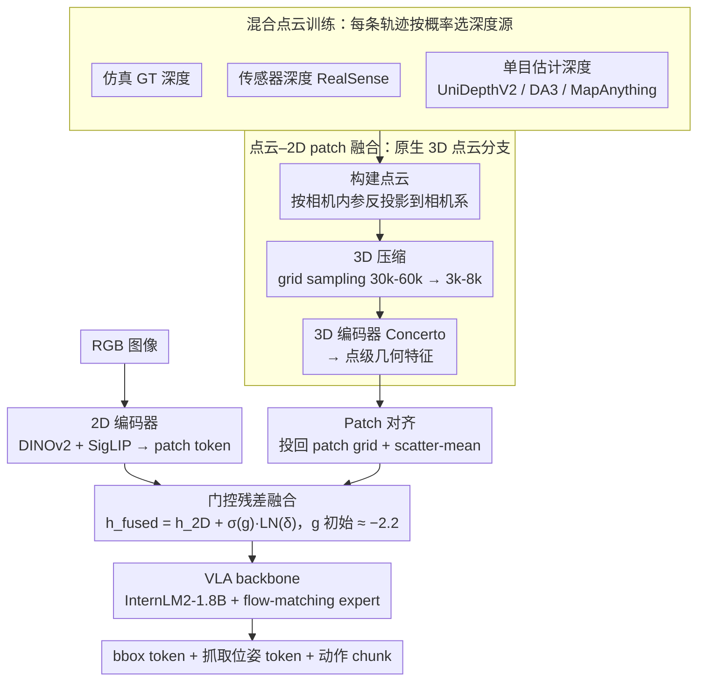

# Any3D-VLA: Enhancing VLA Robustness via Diverse Point Clouds

**会议**: ICML 2026  
**arXiv**: [2602.00807](https://arxiv.org/abs/2602.00807)  
**代码**: https://xianzhefan.github.io/Any3D-VLA.github.io  
**领域**: 机器人 / VLA / 多模态 3D 表示  
**关键词**: 点云融合, sim-to-real, 域泛化, 数据增广, 抓取

## 一句话总结
作者通过 pilot study 发现"显式把视觉提升到点云、再与 2D patch 融合"是 VLA 注入 3D 信息的最有效方式；为了解决 3D 数据稀缺和不同点云源（仿真/传感器/单目估计）的域差异，提出 Any3D-VLA：用 hybrid point cloud training 学到 source-agnostic 的几何表示，在真实抓取任务上 zero-shot 比最强 baseline 提升 29.2%（62.5% vs 33.3%）。

## 研究背景与动机
**领域现状**：当前主流 VLA（如 π0.5、GraspVLA）以 2D 图像为视觉输入，借 VLM backbone 做语言-视觉-动作的统一建模。社区已尝试注入 3D：depth-pretrained encoder（DepthVLA）、spatial foundation model（VGGT）、depth-as-channel（3D-CAVLA）、点云分支（PointVLA / 3DS-VLA）等。

**现有痛点**：（1）纯 2D VLA 在小物体、视角变化、遮挡场景下脆弱。（2）已有 3D 注入方法各有问题：implicit depth/3D（VGGT 类）靠 reconstruction loss 学几何，缺乏 metric 精度、易"空间幻觉"；depth-as-channel 把深度当 2D 图像处理破坏 3D 拓扑；point cloud 分支要么用非预训练 encoder、要么独立处理点云没与 2D 对齐。（3）3D 数据稀缺、跨环境（仿真 vs 传感器 vs 估计）的噪声/尺度/几何偏差导致严重 domain gap，导致 3D VLA 难以 sim-to-real。

**核心矛盾**：要拿到精确的 3D 几何信号，要么靠贵的 metric depth 硬件（依赖性强、跨环境差异大），要么靠 model-estimated 深度（带 scale drift 噪声）。而真正"工业级可部署的 VLA"必须能在任何深度源下都 work——这是个鲁棒性问题，而不是单纯的精度问题。

**本文目标**：（1）通过 pilot study 选出最优的 3D 注入范式；（2）设计一个 plug-in 模块把 3D 信息融入已有 VLA backbone；（3）通过"混合点云训练"显式建模深度源异质性，让模型在部署时对深度源无关。

**切入角度**：作者首先做了一个干净的 pilot 实验，公平对比 2D-only / implicit-depth RGB / implicit-3D RGB / RGBD-image-plane / point-cloud+2D-patch fusion 五种范式（在同一仿真 benchmark、同一 ground-truth metric depth 下）。发现 point-cloud+2D-patch 显著优于其他——这就是 Any3D-VLA 的基础选型。

**核心 idea**：把 RGB+depth lift 成点云，3D 网格压缩 + 预训练点云 encoder 编码后，按 ViT patch 对齐做 scatter-mean、再用 gated residual 融合回 2D 表示；训练时混合 simulator / sensor / model-estimated 三种点云源，让 3D encoder 学到 source-agnostic 几何特征。

## 方法详解
Any3D-VLA 是一个 plug-in 视觉观测模块，可挂到任意 VLA backbone 上。整套 pipeline：RGB+optional depth → lift to point cloud → 3D 压缩 → 点云 encoder → patch 对齐 → 2D-3D gated 融合 → VLA backbone。

### 整体框架
- **数据准备**：在 Isaac Sim 中合成 RGBD 数据集（Objaverse LVIS 子集，290 类、10680 实例、单视角、相机参数匹配 RealSense D435）。每个时间步同时导出 (1) Isaac 渲染管线的 ground-truth metric depth、(2) 单目深度模型估计的 metric depth，两种都用。
- **VLA backbone**：InternLM2-1.8B 作 VLM 主干 + conditional flow-matching action expert，二者通过 PAG（Progressive Action Generation）连接。视觉观测模块是本文核心。
- **视觉模块四步**：(1) Point Cloud Construction，按相机内参把每个有效深度像素 unproject 到相机坐标系；(2) 3D Compression，按 Sonata 的 grid sampling 把点云从 30k-60k 压到 3k-8k；(3) Vision Encoder，2D 用 DINOv2+SigLIP、3D 用 Concerto（预训练在 2D+3D 数据上的点云 encoder）；(4) Patch-Wise Alignment + 2D-3D Fusion，把 3D 点投回图像 patch grid、scatter-mean 聚合成 patch-level 3D 特征、再与 2D patch token gated residual 融合。
- **输出**：融合 token 序列 → 与语言、本体感知 token 一起喂给 VLA backbone → autoregressive 生成 bbox token + grasp pose token，最后 flow-matching expert 生成连续 end-effector 动作 chunk。

### 关键设计

**1. Point-cloud–2D patch fusion：用 pilot study 选定的最优 3D 注入范式**

注入 3D 的方式五花八门，但作者认为「如何表示几何」比「是否有几何」更要紧，所以先做一个干净的 pilot study：在同一仿真 benchmark、同一 ground-truth metric depth 下，公平对比 2D-only / implicit-depth RGB / implicit-3D RGB / RGBD-image-plane / point-cloud+2D-patch fusion 五种范式。结果只有 point cloud 那条线稳定提升（Single-Trial SR 从 45.3 涨到 61.1），原因是它既保留了原生 3D 拓扑、又能和 2D patch 做显式空间对齐。相比之下，VGGT 这类 implicit 方法虽带 reconstruction 先验，但在 fine-grained manipulation 上常出现「空间幻觉」；depth-as-channel 把 3D 压成 2D 通道直接丢了拓扑。Any3D-VLA 由此 commit 到 point cloud + 2D patch fusion——既拿到点云的几何精度，又保住 2D backbone 的语义先验。

**2. Patch-Wise Alignment + Gated Residual Fusion：把无序点云对齐到 patch grid，再以「微小修正」的形式注入**

点云是无序的，2D backbone 的 token 却排在规则的 ViT patch grid 上，要融合就得先对齐。每个 3D 点 $\mathbf{x}_i$ 经相机投影 $(u_i,v_i)=\pi(\mathbf{x}_i)$ 映回图像平面、找到对应 patch index $a_i$，同一 patch 内的点做 scatter-mean 聚合成 $\mathbf{g}_j^\text{3D}$，patch 内无点则用可学习 empty token $\mathbf{e}^\text{3D}$ 占位；线性投影到 token 维度 $\mathbf{h}_j^\text{3D}=W_\text{3D}\mathbf{g}_j^\text{3D}$，与 $\mathbf{h}_j^\text{2D}$ concat 过 MLP 得残差 $\delta_j$。融合用 gated residual：$\mathbf{h}_j^\text{fused}=\mathbf{h}_j^\text{2D}+\sigma(g)\cdot\text{LayerNorm}(\delta_j)$，其中 gating $g$ 初始化为 $-2.1972$ 让 $\sigma(g)$ 训练初期非常小、几乎不动原表示，随训练再逐步放开。之所以选「在 2D backbone 上做微小修正」而不是「替换 2D 表示」，是为了保住 DINOv2+SigLIP 的强语义先验、又让 3D 信号在需要时才介入；而 gated init 正是为了避开从头注入新模态时常见的「前几个 epoch 把原表示摧毁」的坑。

**3. Hybrid Point Cloud Training：把深度源的异质性直接灌进训练数据，让鲁棒性成为优化目标**

3D VLA 真正落地的最大障碍不是精度本身，而是不同环境的深度源差异巨大——仿真、传感器、单目估计各有各的噪声、scale bias 和几何瑕疵。Any3D-VLA 干脆把这种异质性写进训练：定义三种设置——Setting 1 仅 simulator GT 点云、Setting 3 仅 sensor、而核心的 Setting 2 是 hybrid，每条轨迹按固定概率从 simulator / sensor / 单帧 RGB 估计的 metric 点云里选源（具体配比 30% RealSense + UniDepthV2 / DA3 / MapAnything 各 20%）。整个训练过程模型都见过多种点云源，3D encoder 和 fusion 层就被迫学到对源无关的几何特征。这等于把「鲁棒性」做成优化目标的一部分——与其费劲调一种深度的精度，不如让模型见过所有深度。实验里 hybrid 训练在任何推理点云源下都 ≥ 单源训练，证明它学到的是 source-agnostic 几何而非 multi-task overfit。

### 损失函数 / 训练策略
联合训练 VLM head + flow-matching action expert：从 GRIT 抽 grounding 数据监督 VLM autoregressive 预测 bbox token；从合成 RGBD 数据额外监督 grasp pose token + end-effector action（flow matching loss）。**不加任何 depth/point cloud reconstruction loss**——作者刻意验证性能提升来自表示设计而非辅助监督。

## 实验关键数据

### 主实验（真实世界 zero-shot）
在 4 类 challenge（Standard / Scale&Shape / Viewpoint / Appearance-Deprived）上对比 π0.5、GraspVLA（2D 基线）、SpatialVLA（3D 基线）。47 种真实物体、120 trial、每 trial 最多 3 次抓取。

| 方法 | 训练设置 | 推理点云 | Overall SR (%) |
|------|----------|----------|----------------|
| π0.5 (2D) | – | – | ≈ 26 |
| GraspVLA (2D) | – | – | ≈ 30 |
| SpatialVLA (3D) | – | – | 33.3 (最强 baseline) |
| Any3D-VLA | Setting 1 (sim only) | RealSense | 提升 |
| Any3D-VLA | Setting 2 (hybrid) | RealSense | 进一步提升 |
| **Any3D-VLA** | **Setting 2 (hybrid)** | **DA3 estimated** | **62.5 (+29.2)** |

### Post-training（少量真实示范 fine-tune）
两个挑战任务：Task1 把粉色郁金香放花瓶 / Task2 把透明调料杯放固定卡槽。各 100 条真实示范。

| 模型 | 训练设置 | 推理点云 | Task1 SR (%) | Task2 SR (%) |
|------|----------|----------|--------------|--------------|
| π0.5 | – | – | 33.3 | 26.7 |
| GraspVLA | – | – | 33.3 | 53.3 |
| SpatialVLA | – | – | 13.3 | 6.7 |
| Any3D-VLA | RealSense only | RealSense | 73.3 | 60.0 |
| Any3D-VLA | RealSense only | DA3 | 80.0 | 60.0 |
| Any3D-VLA | Hybrid | RealSense | 80.0 | 66.7 |
| **Any3D-VLA** | **Hybrid** | **DA3** | **93.3** | **86.7** |

### 关键发现
- Hybrid training 在任何推理点云源下都≥单源训练，证明它真正学到了 source-agnostic 几何，而非简单的 multi-task overfit。
- DA3 估计的点云在多数情况下推理表现 ≥ RealSense 传感器点云，说明现代单目深度估计模型已能产出比消费级深度相机更准的点云——这暗示未来 3D VLA 部署可以彻底摆脱深度硬件依赖。
- Pilot study 数据反直觉：在仿真完美深度下，把 depth 当 channel 输入仅给 11 点提升（45.3 → 56.8），而 point-cloud fusion 给 16 点提升（45.3 → 61.1）。说明"如何表示几何"比"是否有几何"更重要。
- 推理延迟 1.7~2.0 FPS（DA3 路线），靠 action chunking (chunk size=4) amortize 后实际可用于桌面 manipulation。

## 亮点与洞察
- **干净的 pilot study 设定**：在所有方法上严格控制变量（同 backbone、同训练策略、同仿真 ground-truth depth），用 SR 数据说话证明 point-cloud+2D-patch 是最优范式——这种"先 pilot 再 commit"的实验方法论非常值得借鉴。
- **Gated residual fusion 的初始化技巧**：把 gating 初始化为 $\sigma^{-1}(\text{very small})$ 让新模态从"几乎不影响"开始训练，避免 catastrophic forgetting，这种"先冷再热"的注入策略对任何新模态都适用。
- **Hybrid training 作为 sim-to-real 万能药**：与其费力调一种深度的精度，不如让模型见过所有深度——这种"数据多样性 > 单源精度"的哲学在 LLM 数据混合、自动驾驶 sensor fusion 上都已多次被验证，本文把它精准复用到 VLA 3D 注入上。

## 局限与展望
- 物体类别封顶 290 种（Objaverse LVIS 子集），离开放词汇还有距离。
- 单视角输入，多视角融合可能进一步提升遮挡场景；但多视角必然增加延迟。
- 推理时还是依赖一个 estimated depth 模型（DA3），等于把延迟瓶颈从 3D encoder 转移到深度模型上。
- 主要验证在桌面 manipulation 上，对移动平台、长时长任务（loco-manipulation）尚未测试。
- 透明/反光物体仍是难点（虽然论文展示了透明调料杯但 SR 不算极高）。

## 相关工作与启发
- **vs PointVLA (Li et al. 2025a)**：PointVLA 通过 injector 把点云特征塞进 action expert，但点云和 2D 处理相对独立；本文 patch-level 对齐让 3D 信号与 2D token 一一对应、更精细。
- **vs SpatialVLA**：SpatialVLA 是最强 3D 基线，但仍以 image-plane 为主；本文用原生 3D 拓扑 + hybrid training 把 SR 拉到几乎翻倍。
- **vs VGGT / Spatial Forcing**：那些用 implicit 3D 先验，本文实证 explicit 3D 几何对 fine-grained manipulation 更可靠。
- **vs DepthVLA / 3D-CAVLA**：那些用 depth 作为额外 channel 或 depth expert，本文把 depth 提升到点云空间再回投，几何精度和拓扑兼得。

## 评分
- 新颖性: ⭐⭐⭐⭐ Pilot study + gated patch fusion + hybrid training 组合很扎实，单项技术多有前作但整合方式新
- 实验充分度: ⭐⭐⭐⭐⭐ 仿真 + 真实 + zero-shot + post-training + 多深度源 + 多 baseline，实验设计教科书级
- 写作质量: ⭐⭐⭐⭐ Pilot study 部分讲得很清楚，逻辑链 "为什么选 point cloud → 怎么融合 → 怎么 sim2real" 一气呵成
- 价值: ⭐⭐⭐⭐⭐ 直接刚需，且 hybrid training 的范式可迁移到任何"多源传感器异质"场景

<!-- RELATED:START -->

## 相关论文

- [\[ICML 2026\] VLANeXt：构建强大 VLA 模型的配方](vlanext_recipes_for_building_strong_vla_models.md)
- [\[ICML 2026\] VLA-Arena：评估视觉语言动作模型的开源框架](vla-arena_an_open-source_framework_for_benchmarking_vision-language-action_model.md)
- [\[ICML 2026\] TRAP: 用对抗 patch 劫持 VLA 的 CoT 推理实现目标行为攻击](trap_hijacking_vla_cot-reasoning_via_adversarial_patches.md)
- [\[AAAI 2026\] Phantom Menace: Exploring and Enhancing the Robustness of VLA Models Against Physical Sensor Attacks](../../AAAI2026/multimodal_vlm/phantom_menace_exploring_and_enhancing_the_robustness_of_vla_models_against_phys.md)
- [\[AAAI 2026\] FT-NCFM: An Influence-Aware Data Distillation Framework for Efficient VLA Models](../../AAAI2026/multimodal_vlm/ft-ncfm_an_influence-aware_data_distillation_framework_for_efficient_vla_models.md)

<!-- RELATED:END -->
