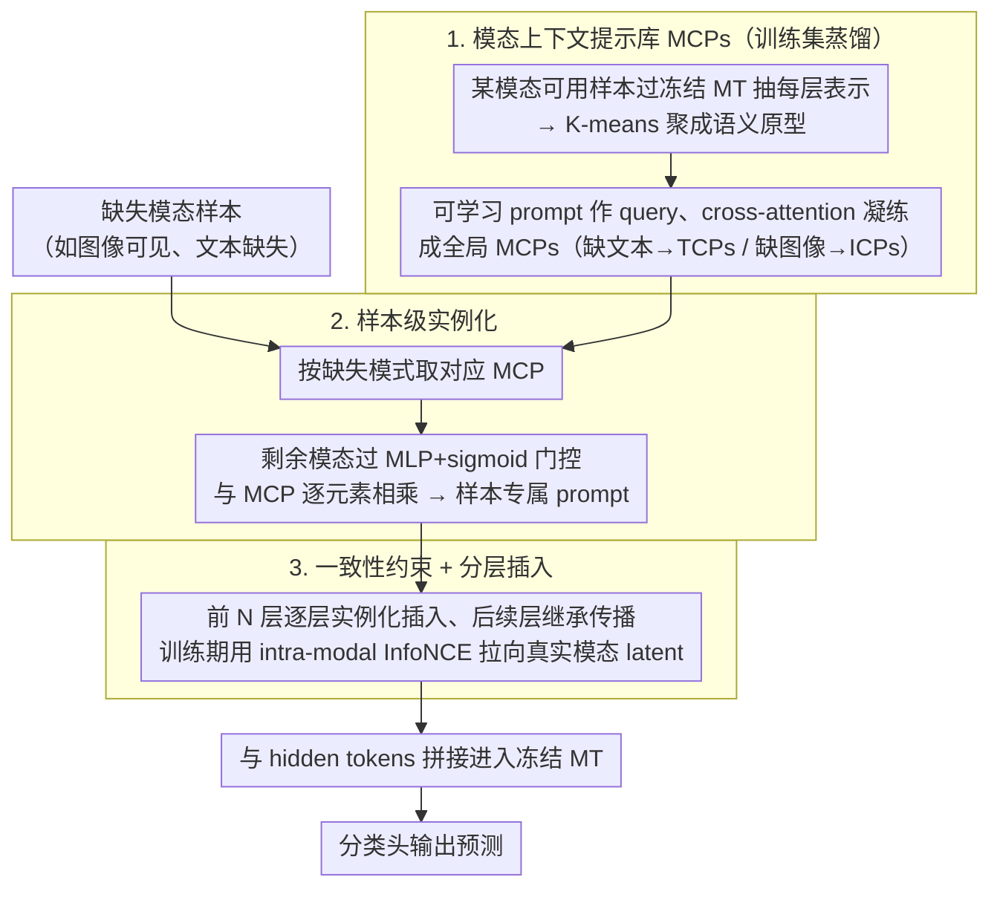

# AOEPT: Breaking the Implicit Modality-Reduction Bottleneck in Modality-Missing Prompt Tuning

**会议**: ICML 2026  
**arXiv**: [2605.24816](https://arxiv.org/abs/2605.24816)  
**代码**: https://github.com/Jian-Lang/AOEPT  
**领域**: 多模态VLM / 缺失模态学习  
**关键词**: 缺失模态, 多模态Transformer, 提示调优, 模态上下文提示, NM2I  

## 一句话总结
AOEPT指出现有缺失模态 prompt tuning 会把多模态 Transformer 的推理范围压缩到可见模态子空间，并用从训练集蒸馏出的模态上下文提示为缺失模态补回可检索的隐式信息源，在多数据集、多缺失率和多 backbone 上稳定优于现有方法。

## 研究背景与动机
**领域现状**：多模态系统通常依赖图像、文本、音频等多源信号共同完成分类、理解或问答任务。随着 CLIP、ViLT、MulT 一类 Multimodal Transformer 成为通用 backbone，近年的缺失模态研究也从定制网络逐渐转向更轻量的 prompt tuning：冻结预训练 MT，只学习少量 prompt 和任务头，让模型适配部署时的图像缺失、文本缺失或多模态同时不完整场景。

**现有痛点**：MAPs、DCP、MemPrompt、SyP 等方法都能比裸 MT 更稳健，但它们的 prompt 往往只由缺失模式或当前可见模态决定。例如图像缺失时，prompt 的条件信号主要来自文本；文本缺失时，条件信号主要来自图像。这样做看似合理，实际却让模型只能围绕剩下的单模态证据做推理。

**核心矛盾**：预训练 MT 原本拥有跨模态建模能力，但缺失模态 prompt tuning 把问题退化成了“可见模态到标签”的映射。作者把这个现象称为 Implicit Modality-Reduction (IMR) bottleneck：prompt 没有显式接入缺失模态的潜在信息源，导致 MT 的推理范围被隐式限制在模态缩减后的子空间。

**本文目标**：本文要解决三个具体问题。第一，解释为什么现有 prompt tuning 在缺失模态场景下仍然没有完全释放 MT 的多模态能力。第二，设计一种仍然轻量、无需外部检索或重建大模块的 prompt 机制，让缺失模态也能以隐式信息库的形式进入推理。第三，给出可诊断 IMR 瓶颈的度量，而不只是报告最终分类指标。

**切入角度**：作者先做了一个简单 pilot experiment：把 MAPs 中原本随机初始化的 prompt，替换成由训练集中对应模态 token 表示聚类得到的全局先验。这个小改动能提升 MM-IMDb 上的缺失模态表现，说明缺失模态的全局上下文确实能突破单模态推理瓶颈。

**核心 idea**：AOEPT 用“模态级全局信息库 + 样本级条件激活”代替“只看可见模态生成 prompt”，让 prompt 不再只是适配降级输入结构，而是主动为当前样本补充缺失模态的隐式上下文。

## 方法详解
AOEPT 的方法主线很清楚：先从训练集中收集某个模态的 layer-wise 表示，把它压缩成轻量的 Modal-Contextualized Prompts (MCPs)；再根据当前样本的剩余模态，把这些全局 MCPs 实例化成样本相关 prompt；最后把这些 prompt 插入冻结 MT 的若干层中，只训练 prompt 和分类头。以图像可见、文本缺失为例，AOEPT 构造的是 Text-Contextualized Prompts (TCPs)，让图像样本在推理时仍能访问文本模态的隐式语义库。

### 整体框架
输入是可能缺失某些模态的多模态样本，例如 $(t, v)$、$(t, \varnothing)$ 或 $(v, \varnothing)$。AOEPT 不改变 MT 主体结构，而是在预训练 Transformer 的层间插入 prompt tokens。训练阶段先用冻结 MT 对训练集中“某模态可用”的样本做前向传播，抽取每一层的模态表示；这些表示经过聚类压缩后，被用于构造对应模态的 MCPs。

当测试样本缺失文本时，模型取出 TCPs；当缺失图像时，模型取出 ICPs。MCPs 本身是全局的，因此还需要用当前样本中剩余的模态表示进行门控，得到 instance-aware prompts。最终这些 prompts 与原始 hidden tokens 拼接进入 MT 层，分类头基于最后一层表示输出预测。

### 关键设计
1. **模态上下文提示（MCP）作为缺失模态信息库**:

	- 功能：把训练集中某一模态的全局上下文压缩成一组 prompt tokens，作为该模态在缺失时可访问的隐式信息源。
	- 核心思路：以 TCP 为例，先把所有文本可用样本送入冻结 MT，得到每层的文本 token 表示集合 $C_t^l$；再用 K-means 把大量 token 表示压缩成 $N_t'$ 个语义原型，降低存储和计算成本；默认构造方式是 attention-based，用可学习 prompt 作为 query，对这些文本原型做 cross-attention，得到每一层的 TCP。
	- 设计动机：随机 prompt 只能告诉模型“这里缺了一个模态”，不能提供缺失模态可能包含什么信息。MCPs 则把训练分布中对应模态的上下文显式保存下来，相当于给冻结 MT 接回一个轻量、内部化的模态记忆。

2. **样本级实例化（Instance-aware Instantiation）**:

	- 功能：把全局 MCPs 转换成当前样本专属的 prompt，避免所有缺失样本共享同一组粗粒度补偿信息。
	- 核心思路：对于图像可见、文本缺失的样本，用图像 hidden representation 经过 MLP 和 sigmoid 生成门控向量，再与 TCPs 做逐元素相乘，即 $P_{TCP,i}^l = P_{TCP}^l \odot \sigma(MLP(\bar{V}_i^{l-1}))$。这样，当前图像会选择性激活与自己最相关的文本上下文。
	- 设计动机：MCPs 是模态级信息库，不经过样本条件化会过于平均。实例化步骤把“全局文本分布”投影到“这张图可能对应什么文本语义”的局部空间，是 AOEPT 从全局先验走向样本级补偿的关键。

3. **一致性约束与缺失自适应插入策略**:

	- 功能：让实例化后的 prompt 更像真实缺失模态的 latent representation，并控制 prompt 在 Transformer 层中的传播方式。
	- 核心思路：作者提出 intra-modal latent consistency regularization，只在对应模态可用的训练样本上计算。池化后的 instance-aware prompt 与同一样本真实模态表示作为正样本，与 batch 内其他样本表示作为负样本，用 InfoNCE 风格的对比目标约束 prompt。插入时，前 $N$ 层每层重新实例化并插入 prompt，后续层则继承上一层 prompt 继续传播。
	- 设计动机：仅靠分类损失会让 prompt 学到与标签有关但未必代表缺失模态的信息；一致性约束把 prompt 拉向真实模态 latent space。分层插入策略则避免每一层都重新生成 prompt 的开销，同时保留早期层充分补偿缺失模态的能力。

### 损失函数 / 训练策略
AOEPT 冻结预训练 MT，只训练 MCPs 和任务分类头。总目标可以理解为分类损失 $L_{CE}$ 加上一致性正则 $L_{CR}$，其中 $L_{CR}$ 用 prompt 与真实模态 latent representation 的相似度来约束实例化质量。

主实验使用 CLIP ViT-B/16 作为双流 MT backbone，也在 ViLT 单流 backbone 和 MulT 三模态 backbone 上做了扩展实验。作者把精炼后的模态集合容量设为 256，默认 prompt length 为 $M=16$，prompt tuning depth 为 $N=6$，这是在性能和效率之间的折中点。

MCP 构造有三种变体。Attention-based 是默认方法，性能和开销较均衡；MLP-based 性能略高但额外计算更多；Initialization-based 直接用池化后的模态原型初始化 prompt，推理开销最低但效果最弱。这个设计也说明 AOEPT 不是依赖某个复杂模块取胜，而是依赖“让 prompt 接入缺失模态上下文”这一范式转变。

## 实验关键数据

### 主实验
主实验覆盖 MM-IMDb、HateMemes、Food101 三个图文多模态 benchmark，并在训练和测试阶段都设置 70% 或 90% 缺失率。评价指标分别是 F1-Macro、AUC 和 Accuracy。AOEPT 在所有平均指标上都超过 MAPs、DCP、RAGPT、MemPrompt、SyP 等强基线。

| 缺失率 | 数据集 | 指标 | AOEPT Avg. | 最强基线 Avg. | 提升 |
|--------|--------|------|------------|----------------|------|
| 70% | MM-IMDb | F1-M | 53.22 | 51.88 (SyP) | +1.34 |
| 70% | HateMemes | AUC | 69.63 | 68.11 (SyP) | +1.52 |
| 70% | Food101 | ACC | 84.29 | 83.56 (SyP) | +0.73 |
| 90% | MM-IMDb | F1-M | 51.45 | 49.58 (SyP) | +1.87 |
| 90% | HateMemes | AUC | 68.57 | 67.72 (SyP) | +0.85 |
| 90% | Food101 | ACC | 82.06 | 81.26 (SyP) | +0.80 |

更细看 70% 缺失率下的单项场景，AOEPT 在 MM-IMDb 的 text missing、image missing、both missing 上分别为 51.50、54.86、53.31；HateMemes 上为 71.12、67.96、69.80；Food101 上为 80.77、88.86、83.24。提升并不是只来自某一种缺失模式，而是跨文本缺失、图像缺失和双向混合缺失都存在。

### 消融实验
消融实验在 70% text missing 下验证了 AOEPT 的三个关键模块：MCP、样本级实例化、一致性正则。结果显示，去掉 MCP 退回随机 prompt 后下降最明显之一；直接插入未实例化的 MCP 也明显弱于完整模型；用轻量 reconstruction network 替代 MCP 并不能解决问题。

| 配置 | MM-IMDb F1-M | HateMemes AUC | Food101 ACC | 说明 |
|------|--------------|---------------|-------------|------|
| w/o MCP | 48.93 | 68.63 | 78.78 | 用普通随机 prompt 替代模态上下文信息库 |
| w/o Instantiation | 49.17 | 69.42 | 79.13 | 全局 MCP 直接插入，不做样本条件化 |
| w/o Consistency | 50.56 | 69.85 | 79.59 | 去掉 latent consistency regularization |
| w/ Reconstruction | 48.55 | 70.13 | 76.81 | 用参数量相近的重建网络替代 MCP |
| AOEPT | 51.50 | 71.12 | 80.77 | 完整方法 |

### Backbone 泛化
作者还在 ViLT 单流 MT 上测试 MM-IMDb 70% 缺失率，AOEPT 平均 F1-M 为 39.86，高于 MemPrompt 的 38.07、RAGPT 的 37.61 和 DCP 的 36.06。这说明 AOEPT 不是只针对 CLIP 双流结构调参，而是能迁移到不同 MT 架构。

| Backbone | 方法 | Text missing | Image missing | Both missing | Avg. |
|----------|------|--------------|---------------|--------------|------|
| ViLT | LB | 28.83 | 19.87 | 24.65 | 24.45 |
| ViLT | MemPrompt | 35.40 | 40.58 | 38.23 | 38.07 |
| ViLT | RAGPT | 36.19 | 39.90 | 36.74 | 37.61 |
| ViLT | AOEPT | 37.46 | 42.23 | 39.89 | 39.86 |

### 关键发现
- MCP 是突破 IMR 瓶颈的核心。没有 MCP 时，模型又回到只靠随机 prompt 适配缺失结构的路径，MM-IMDb 从 51.50 降到 48.93。
- 样本级实例化不是锦上添花。w/o Instantiation 在三个数据集上都低于完整模型，说明全局模态库必须根据当前可见模态选择性激活。
- Reconstruction 不是轻量 prompt 场景下的好替代。参数量相近的重建网络在 Food101 上只得到 76.81，明显低于完整 AOEPT 的 80.77，作者认为原因是可用于跨模态重建的完整样本有限，且轻量网络难以拟合复杂跨模态映射。
- NM2I 诊断支持作者的中心论点。基线方法的 NM2I 接近 0，说明 prompt 与缺失模态 latent representation 几乎没有共享信息；AOEPT 的 NM2I 明显更高，证明它确实把 prompt 拉回了缺失模态信息空间。
- 训练条件改善时，基线存在 modality information scaling bottleneck。测试 text missing 固定为 90% 时，降低训练 text missing rate 并不能稳定帮助基线，甚至会让它们更难泛化到严重缺失；AOEPT 则能把更多训练期可用的文本信息吸收到 MCPs 中。

## 亮点与洞察
- 最大亮点是把缺失模态问题从“适配降级输入”改写成“恢复推理范围”。这个视角很有解释力，因为它指出了为什么很多 prompt tuning 方法虽然参数高效，却仍然没有真正利用预训练 MT 的多模态能力。
- MCP 的设计很克制：它没有引入外部检索库，也没有训练大规模生成式重建器，而是从训练集内部蒸馏模态级上下文。这让方法既能补充缺失模态信息，又不会像 RAGPT 一样依赖样本级检索质量。
- NM2I 是一个有价值的诊断工具。它不直接替代任务性能，但能回答“prompt 是否真的携带缺失模态信息”这个更机制化的问题，可迁移到其他缺失模态、模态补全或多模态鲁棒性研究中。
- 论文对 prompt 长度和插入深度的分析比较实用。$M=16$、$N=6$ 的结论未必是通用最优，但提供了一个经验：缺失模态补偿需要足够的 token 容量和早期层介入，过短或过浅都难以充分恢复跨模态空间。
- AOEPT 对多模态系统部署有启发意义。现实系统经常遇到传感器故障、文本缺失或图像不可用，直接让模型“猜标签”不如维护一个轻量的模态先验库，再根据当前输入动态激活。

## 局限与展望
- 作者承认 NM2I 与任务性能不一定单调相关。某些数据集中可见模态本身已经足够强，即使 IMR 瓶颈存在，分类指标也可能不错；因此 NM2I 更适合作为机制诊断，而不是唯一优化目标。
- AOEPT 默认训练和测试语义分布差异不大。MCPs 从训练集蒸馏模态上下文，如果部署环境发生严重 domain shift，模态信息库可能激活不匹配的先验。
- 方法主要验证在分类式 benchmark 上。对于开放式 VQA、复杂 MLLM 推理、长视频理解或多轮交互任务，缺失模态信息是否能用同样轻量的 MCP 表示，还需要更多实验。
- MCP 捕捉的是训练分布中的隐式模态先验，不等价于恢复真实缺失输入。对于需要精确细节的任务，例如医学图像报告或细粒度定位，仅靠全局上下文 prompt 可能不足以替代真实模态。
- 未来可以把 AOEPT 与不确定性估计结合：当 MCP 激活出的缺失模态先验可信度低时，模型可以降低补偿强度或请求额外输入，而不是始终假设训练先验可用。

## 相关工作与启发
- **vs MAPs**: MAPs 首先把 missing-aware prompts 引入 MT 缺失模态学习，但 prompt 更像输入结构标记。AOEPT 认为这种做法仍然落在 IMR 瓶颈里，并用 MCPs 显式提供缺失模态上下文。
- **vs DCP / MemPrompt / SyP**: 这些方法把 prompt 做得更样本化、更记忆化或更跨模态共享，性能逐步提高，但条件信号仍主要来自剩余模态。AOEPT 的区别在于先构造缺失模态的信息库，再用剩余模态选择性激活，而不是只从剩余模态直接生成 prompt。
- **vs RAGPT / REDEEM**: 检索式方法通过外部样本或重建模块补充多模态证据，信息更显式，但训练和推理开销更大，也容易受检索噪声影响。AOEPT 像是把检索内化到了 prompt 参数中，用全局模态上下文替代样本级外部检索。
- **vs 模态补全方法**: 传统 imputation 试图重建缺失模态本身，通常需要定制网络和完整样本监督。AOEPT 不生成图像或文本，而是在 latent prompt 空间补充对预测有用的模态上下文，更适合冻结 MT 的参数高效适配。
- **启发**: 这篇论文的思路可以推广到多模态 RAG、agent 观测缺失、机器人传感器缺失等场景。关键不是把缺失输入“补成一个看似完整的样本”，而是给模型一个可学习、可诊断、可条件激活的缺失信息访问通道。

## 评分
- 新颖性: ⭐⭐⭐⭐⭐ 提出 IMR bottleneck 和 MCP 范式，问题定义与解决路径都比较清晰。
- 实验充分度: ⭐⭐⭐⭐ 覆盖多数据集、多缺失率、多 backbone 和消融，若能加入开放式 MLLM 任务会更完整。
- 写作质量: ⭐⭐⭐⭐ 论文结构顺畅，动机和方法解释充分，但部分公式排版和符号在缓存文本中略显拥挤。
- 价值: ⭐⭐⭐⭐⭐ 对缺失模态 prompt tuning 给出机制性解释和轻量方案，也提供了 NM2I 这样的可复用分析工具。

<!-- RELATED:START -->

## 相关论文

- [\[ICML 2026\] Jailbreaking Vision-Language Models Through the Visual Modality](jailbreaking_vision-language_models_through_the_visual_modality.md)
- [\[ICML 2026\] Calibrated Multimodal Representation Learning with Missing Modalities](calibrated_multimodal_representation_learning_with_missing_modalities.md)
- [\[ICML 2026\] Seeing is Understanding: Unlocking Causal Attention into Modality-Mutual Attention for Multimodal LLMs](seeing_is_understanding_unlocking_causal_attention_into_modality-mutual_attentio.md)
- [\[ICML 2026\] ECG-R1: Protocol-Guided and Modality-Agnostic MLLM for Reliable ECG Interpretation](ecg-r1_protocol-guided_and_modality-agnostic_mllm_for_reliable_ecg_interpretatio.md)
- [\[ICLR 2026\] Revisit Visual Prompt Tuning: The Expressiveness of Prompt Experts](../../ICLR2026/multimodal_vlm/revisit_visual_prompt_tuning_the_expressiveness_of_prompt_experts.md)

<!-- RELATED:END -->
