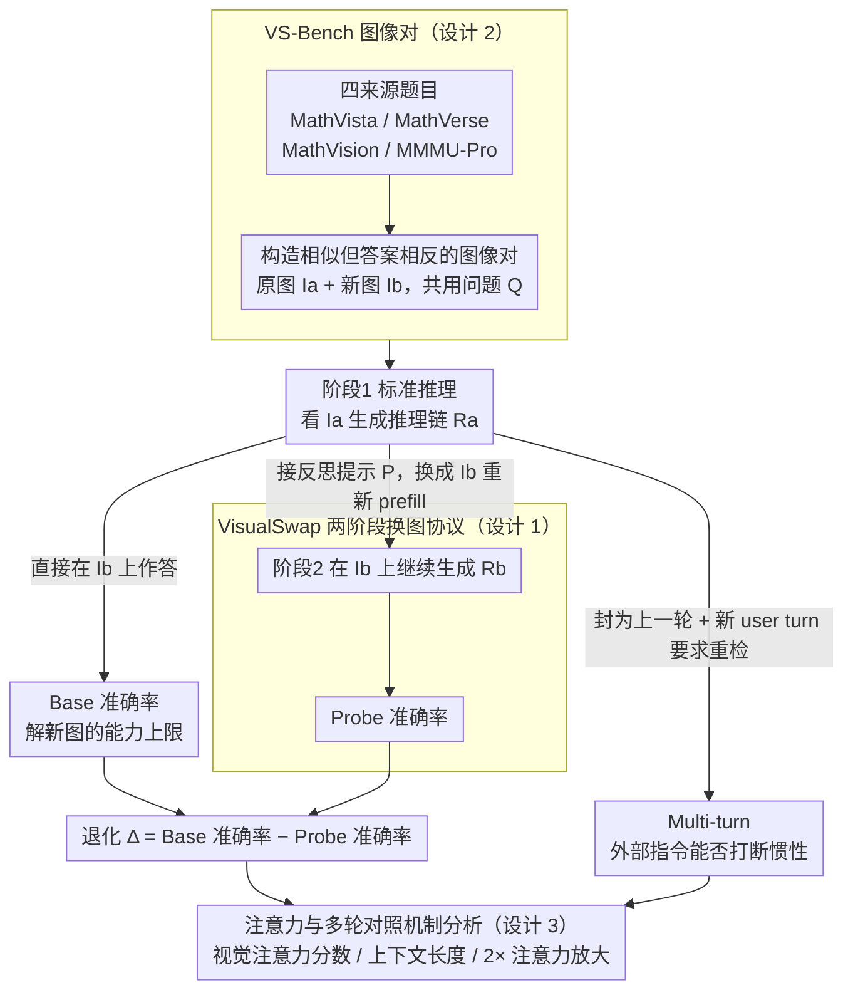

# Are VLMs Seeing or Just Saying? Uncovering the Illusion of Visual Re-examination

**会议**: ICML2026  
**arXiv**: [2605.15864](https://arxiv.org/abs/2605.15864)  
**代码**: https://visualswap.github.io/  
**领域**: 多模态VLM  
**关键词**: 视觉重检, 多模态推理, 自反思, 注意力分析, 评测基准  

## 一句话总结
这篇论文提出 VisualSwap 和 VS-Bench，通过在 VLM 自称“再看一眼图像”之后替换图像来检验真实视觉重检能力，发现当前推理型 VLM 往往沿着旧文本惯性继续生成，显式用户多轮指令或增强视觉注意力才能显著恢复 grounding。

## 研究背景与动机
**领域现状**：多模态大模型已经能在数学图表、几何题、专业视觉问答等任务上生成很长的推理链。新一代 reasoning VLM 还会在链式思考中输出“让我再检查一下图像”这类自反思句子，表面上看像是在主动校验视觉证据。

**现有痛点**：这些自反思句子到底触发了真实的视觉重读，还是只是语言模型学到的推理话术，并没有被系统性测量。普通 VQA 准确率只测试模型能否一次性读懂图像，无法区分“模型真的重新看图”和“模型在旧推理轨迹上补一句检查口头禅”。

**核心矛盾**：VLM 的推理链越长，文本上下文越强；如果视觉 token 在后续生成中没有重新获得足够注意力，模型就可能相信自己刚写出的文字，而不是当前图像。换言之，自反思的语言形式和视觉重检的执行过程可能被解耦。

**本文目标**：作者想把这个问题变成可观测的诊断任务：先让模型基于原图生成推理，再在“检查图像”的时刻换成视觉相似但答案不同的新图，观察模型能否发现冲突、修正推理并回答新图对应的答案。

**切入角度**：图像替换是一个很干净的干预，因为理想模型只要真的重新读取当前视觉输入，就应该摆脱旧推理并转向新答案；如果模型没有看图，它会继续复述原图里的细节。

**核心 idea**：用受控的 image swap 把“模型说自己在看”变成可验证行为，从而直接暴露 VLM 自发视觉重检中的文本惯性和注意力失控。

## 方法详解
这篇论文不是提出一个新模型，而是提出一套诊断框架、一个专门构造的基准，以及一组机制分析。它关心的问题非常具体：当 VLM 在生成过程中出现自反思触发词时，模型是否真的会重新读取图像 token。

### 整体框架
整体流程分为三层。

第一层是 VisualSwap 评测协议。每个样本包含原图 $I_a$、替换图 $I_b$ 和同一个问题 $Q$。两张图在整体布局、风格和语义场景上相似，但在答案关键细节上不同，因此对应答案分别是 $A_a$ 和 $A_b$。

第二层是 VS-Bench 数据集。作者从 MathVista、MathVerse、MathVision 和 MMMU-Pro 中选取需要精细视觉理解的问题，每个来源构造 200 对图像，共 800 对。构造时要求问题对两张图都自然成立，图像整体相似，同时关键视觉细节足以改变答案。

第三层是行为与机制分析。作者比较普通单轮、同一 assistant turn 内的自反思 probe、多轮用户显式要求重检三种条件，再用视觉 token 注意力、上下文长度、prompt 改写、自然触发点和注意力放大来解释失败原因。

在标准推理中，模型直接基于 $I_b$ 和问题 $Q$ 回答，得到 Base Accuracy。这个数值代表模型本来有没有能力解新图。

在 Probe 设置中，模型先看 $I_a$ 生成初始推理 $R_a$，随后研究者把输入图换成 $I_b$，并把反思提示 $P$ 接在同一个 assistant response 里，让模型继续生成 $R_b$。如果模型真的重读图像，它应当回答 $A_b$。

在 Multi-turn 设置中，$R_a$ 被作为上一轮 assistant 输出封闭起来，然后用户在新一轮明确说“重新检查图像”。这和 Probe 共享同样的新图与历史文本，但多了清晰的用户 turn 边界，用于测试外部指令是否能打断文本惯性。

### 关键设计
**1. VisualSwap 两阶段换图协议：把“说自己在看”变成可验证行为**

直接看模型输出里有没有“让我再看一眼图像”这种反思句，根本判断不了它是否真的重读了图，这是图里 Probe 分支要解决的核心问题。作者把它做成一个反事实测试：阶段一让模型基于原图 $I_a$ 正常生成带反思触发词的推理链 $R_a=\mathcal{M}(I_a,Q)$；阶段二在 $R_a$ 后接上反思提示 $P$（如“Wait, let me check the image again”），**同时**把图像换成视觉相似但答案不同的 $I_b$，重新 prefill 整段上下文后继续生成 $R_b=\mathcal{M}(I_b,Q,R_a\oplus P)$。理想模型只要真的重读当前视觉输入，就该发现冲突、转向 $I_b$ 的答案 $A_b$；只会复述旧文字的模型则继续答 $A_a$。用退化量 $\Delta=Acc_{base}-Acc_{probe}$ 度量这种重检缺失。这里有个关键实现细节：阶段二是用新图重新 prefill 全部上下文、而非隐藏状态或 KV cache 注入，所以模型在继续生成时**确实持有 $I_b$ 的视觉表示**，从而排除了“模型技术上看不到新图”这一解释，把失败精确地归到“看得到却没去看”。

**2. VS-Bench：相似但答案相反的图像对**

协议要成立，图像对的难度必须恰到好处，这对应框架图里 Base 分支之前的数据构造环节。作者从 MathVista、MathVerse、MathVision、MMMU-Pro 四个强视觉依赖 benchmark 取问题与目标图 $I_b$，再经 human-in-the-loop 标注与图像生成工具（Nano Banana Pro）造出配对图 $I_a$，遵循三条原则：问题不变（同一个 $Q$ 对两图都自然成立）、整体视觉相似（布局/风格/构图接近）、关键细节发散（足以改变答案）。共 800 对，并用 CLIP 0.95、SSIM 0.86、LPIPS 0.14 及 5 人志愿者的可区分性实验佐证质量。之所以刻意保持外观相近，是因为两图差异过大时模型可能只凭“画面突然变了”的异常感发现替换、而非真的重读细节；问题若不再适用，错误又会来自数据缺陷。把外观压到高相似，才能让测试干净地聚焦在“细粒度重新观察”能力上。

**3. 注意力与多轮对照机制分析：是看不懂，还是不肯看**

主实验只暴露现象，这一步回答“为什么”，对应框架图末端 Multi-turn 分支与机制分析节点的汇合。作者要区分两种解释：模型根本读不懂新图，还是有能力却不自发调用视觉注意力。为此定义视觉注意力分数 $S_{vis}^{(l)}(t)$，统计当前生成 token 对图像 token 的平均注意力，并对比 Probe 与 Multi-turn 在干预点前后约 100 个 token 的变化；同时做一个无训练干预——在 Probe 生成 $R_b$ 时把分配给图像 token 的注意力权重乘以 2。结果是：同样的新图与历史文本下，Multi-turn 的视觉注意力显著抬升、准确率近乎恢复到 baseline（如 Qwen3-VL-235B-Thinking 从 34.1 回到 85.4），而自反思 Probe 的注意力增量很小；2 倍放大也能把 Probe 拉高一截。这组对照把病因定位到**自主注意力控制失灵**，而不是图像理解能力消失——模型不是看不懂，是没去看。

### 损失函数 / 训练策略
本文没有训练新模型，核心是评测与诊断。实验使用官方 chat template 和默认生成配置，base 与 probe 的推理温度设为 0.1，并用 VLMEvalKit 做标准化评测和答案抽取。

Probe 的实现不是隐藏状态或 KV cache 注入，而是用替换后的图像重新 prefill 全部上下文，因此模型在继续生成时确实拥有 $I_b$ 的视觉表示。这个细节很关键，因为它排除了“模型技术上看不到新图”的解释。

注意力放大实验也不更新参数，只是在 probe 生成 $R_b$ 时把分配给图像 token 的注意力权重乘以 2。它更像一个因果探针，用来验证视觉注意力不足是否是失败原因。

## 实验关键数据

### 主实验
主实验覆盖 15 个 VLM，包含 Qwen3-VL、Qwen2.5-VL、OpenVLThinker、VL-Rethinker、Kimi-VL 和 ERNIE-4.5-VL 的 instruct / thinking 变体。最重要的观察是：所有模型在 VisualSwap 下都有明显掉点，thinking 版本通常掉得更重，扩大模型规模也没有自然解决这个问题。

| 模型 | 变体 | 平均 Base | 平均 Probe | 退化 $\Delta$ |
|------|------|-----------|-------------|---------------|
| Qwen3-VL-8B | Instruct | 69.1 | 46.6 | 22.5 |
| Qwen3-VL-8B | Thinking | 76.0 | 36.6 | 39.4 |
| Qwen3-VL-32B | Instruct | 79.6 | 61.8 | 17.9 |
| Qwen3-VL-32B | Thinking | 84.9 | 36.6 | 48.3 |
| Qwen3-VL-235B-A22B | Instruct | 81.1 | 61.3 | 19.9 |
| Qwen3-VL-235B-A22B | Thinking | 88.8 | 34.1 | 54.6 |
| ERNIE-4.5-VL-28B-A3B | Instruct | 63.3 | 29.0 | 34.3 |
| ERNIE-4.5-VL-28B-A3B | Thinking | 79.9 | 19.6 | 60.3 |
| Kimi-VL-A3B | Thinking | 69.8 | 27.4 | 42.4 |

这个表最刺眼的地方是 thinking 模型的反常失败。Qwen3-VL-235B-A22B-Thinking 在普通单轮下平均 88.8%，换图后只剩 34.1%；ERNIE thinking 的退化达到 60.3 个百分点。长推理提升了普通任务表现，却也强化了旧文本轨迹。

### 消融实验
作者做了多组分析实验，分别排除“新图更难”“prompt 恰好不好”“上下文太长导致完全失能”等解释。

| 分析设置 | 关键指标 | 说明 |
|----------|----------|------|
| $I_a$ vs $I_b$ 独立推理 | 两者平均差距多在 0.1 到 6.3 个百分点 | 新图本身并不明显更难，probe 掉点来自旧推理上下文干扰 |
| Multi-turn 用户重检 | Qwen3-VL-235B-Thinking 从 Probe 34.1 恢复到 85.4 | 外部用户 turn 能重新激活视觉 grounding，说明能力仍在 |
| 上下文长度从 0% 到 100% | Qwen3-VL-235B-Thinking 从 88.8 降到 34.1 | 保留越多 $R_a$，文本惯性越强，thinking 模型最明显 |
| 10 种反思 prompt 改写 | 标准差小，235B thinking 约 36.5 ± 4.9 | 失败不是某一句提示措辞导致的 |
| 自然反思触发点换图 | Qwen3-VL-8B-Instruct 46.6 降到 34.9 | 在模型自然产生的“wait”等位置换图，失败同样存在甚至更强 |
| 2 倍视觉注意力放大 | Qwen3-VL-8B-Thinking 从 36.6 升到 54.8 | 直接增强图像 token 注意力能缓解失败，支持注意力不足解释 |

### 关键发现
- VS-Bench 图像对是“可区分但容易让模型偷懒”的难度：平均 CLIP 相似度 0.95、SSIM 0.86、LPIPS 0.14，人工区分实验中 5 名志愿者对抽样图像对都能找到答案关键差异。
- 多轮显式用户指令和同一 assistant turn 里的自反思句有本质差别。前者在相同视觉输入和相同历史文本下显著提升视觉注意力，后者大多只是延续语言轨迹。
- 注意力分析显示，Probe 中视觉注意力提升很小；例如 Qwen3-VL-235B-Thinking 在某中间层的视觉注意力增量约 1.07，而 Multi-turn 可到 2.21。Qwen3-VL-8B-Thinking 也出现类似翻倍差异。
- closed-source API 不支持主 probe 所需的 mid-response 插入，也不暴露注意力，因此作者主实验聚焦开源模型；附录中的 Gemini 3 Flash Preview 只能验证 Multi-turn 恢复现象，不能验证自反思失败。

## 亮点与洞察
- 这篇论文的评测设计很有穿透力：它没有问“模型会不会说自己在检查”，而是直接制造旧文字与新图像冲突。这个设计把原本很抽象的“自反思真实性”压成了一个可以算准确率的行为测试。
- thinking 模型更差是最有启发的结果。长 CoT 经常被默认视为更可靠，但在多模态任务里，长文本也会变成强先验，使模型更难回到视觉证据。
- Multi-turn 恢复结果说明问题不是“VLM 根本看不懂图”。模型可以读新图，只是自生成反思缺少足够强的控制信号；用户 turn 边界可能在训练分布中更常对应“需要重新响应外部输入”。
- 注意力放大实验给了一个可操作方向：未来多模态 RL 或 SFT 不应只奖励最终答案和漂亮推理，还可以显式奖励反思时的视觉 token 重新参与。
- 这篇工作也提醒评测者，模型输出“我重新检查了图像”不该被当作可靠证据。尤其在医学诊断、自动驾驶感知、图表审计等场景，语言上的谨慎可能掩盖感知上的停滞。

## 局限与展望
- 主 probe 需要把旧推理和反思提示插在同一个 assistant response 中，很多闭源 API 不支持这种控制，因此现象验证主要覆盖开源 VLM。闭源模型是否也存在同等级别的自发重检失败，还需要更合适的接口或替代实验。
- VS-Bench 的图像对由人工和图像生成工具共同构造，虽然有相似度指标和人工可区分性验证，但规模仍是 800 对，任务类型也偏视觉数学、图表和专业问答。更开放的真实场景图像、视频、多图对话还没有覆盖。
- 注意力分数只能作为机制证据之一。更高的视觉注意力通常对应更好 grounding，但注意力不是完整因果解释；后续可以结合 activation patching、视觉 token 层级干预或训练轨迹分析。
- attention amplification 是 proof-of-concept，不是部署方案。简单把图像 token 权重乘以 2 可能在其他任务上引入过度依赖视觉噪声，需要更精细的动态触发机制。
- 本文没有训练一个真正会自主重检的新模型。更自然的下一步是构造多轮视觉验证数据，把“发现旧推理和新图冲突”纳入 SFT / RL，并把视觉注意力强度或图像差异定位作为辅助奖励。

## 相关工作与启发
- **vs 传统 VQA / MMMU / MathVista**: 传统 benchmark 测的是模型能否在一次输入下回答视觉问题，本文测的是模型在已有推理上下文和新视觉证据冲突时能否重新绑定图像，因此更接近“多轮可靠性”而非静态感知能力。
- **vs Self-Refine / Reflexion 等文本自反思**: 文本任务中的自反思主要检查逻辑和语言输出，VLM 自反思还必须重新访问视觉证据。本文说明，把文本反思范式直接搬到多模态推理里会漏掉 grounding 执行问题。
- **vs OpenVLThinker / VL-Rethinker 等 reasoning VLM**: 这些模型强化了长推理和自我修正形式，但 VisualSwap 暴露出一个副作用：推理越长，模型越可能被自己的历史文字锚定。
- **vs 幻觉检测工作**: 很多视觉幻觉研究关注模型是否生成图中不存在的实体，本文更进一步追问“模型声称验证时是否真的看图”。这对高风险应用里的可解释性和审计很有参考价值。
- **启发**: 做 VLM agent 或视觉推理系统时，可以把“视觉重检”做成显式外部步骤，而不是依赖模型在同一段 CoT 里自我提醒。工程上可考虑在关键决策前强制新 user turn、重新编码图像、定位差异区域，再让模型生成最终答案。

## 评分
- 新颖性: ⭐⭐⭐⭐⭐ 用图像替换来检验自反思真实性，问题切得很准，诊断信号也很直接。
- 实验充分度: ⭐⭐⭐⭐⭐ 覆盖 15 个模型、4 个数据来源、主实验和多组机制分析，证据链比较完整。
- 写作质量: ⭐⭐⭐⭐☆ 论文主线清楚，VisualSwap 和 Multi-turn 对照讲得很明白，但表格较多且附录信息密集。
- 价值: ⭐⭐⭐⭐⭐ 对 reasoning VLM 的可靠性评估很有价值，尤其提醒社区不要把“模型说自己检查了”误当成真的视觉 grounding。

<!-- RELATED:START -->

## 相关论文

- [\[ICLR 2026\] ICYM2I: The Illusion of Multimodal Informativeness under Missingness](../../ICLR2026/multimodal_vlm/icym2i_the_illusion_of_multimodal_informativeness_under_missingness.md)
- [\[ICCV 2025\] Generalizable Object Re-Identification via Visual In-Context Prompting](../../ICCV2025/multimodal_vlm/generalizable_object_re-identification_via_visual_in-context_prompting.md)
- [\[CVPR 2026\] Seeing Through Touch: Tactile-Driven Visual Localization of Material Regions](../../CVPR2026/multimodal_vlm/seeing_through_touch_tactile_localization.md)
- [\[CVPR 2026\] What Do Visual Tokens Really Encode? Uncovering Sparsity and Redundancy in Multimodal Large Language Models](../../CVPR2026/multimodal_vlm/what_do_visual_tokens_really_encode_uncovering_sparsity_and_redundancy_in_multim.md)
- [\[NeurIPS 2025\] Don't Just Chase "Highlighted Tokens" in MLLMs: Revisiting Visual Holistic Context Retention](../../NeurIPS2025/multimodal_vlm/dont_just_chase_highlighted_tokens_in_mllms_revisiting_visual_holistic_context_r.md)

<!-- RELATED:END -->
